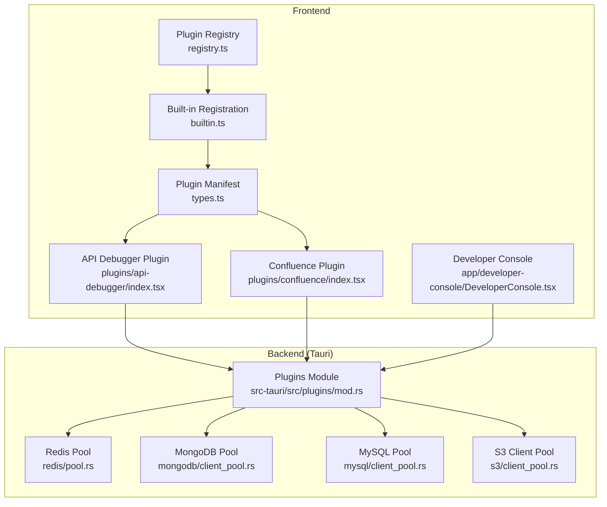
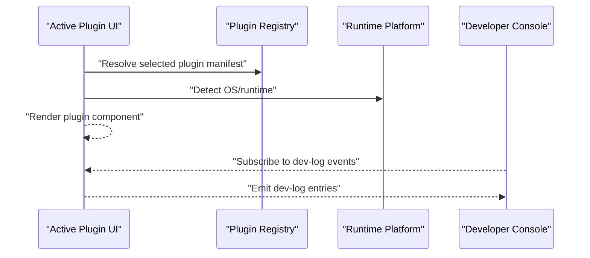
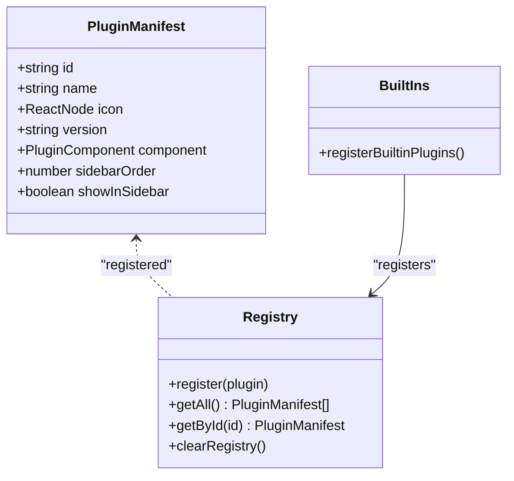
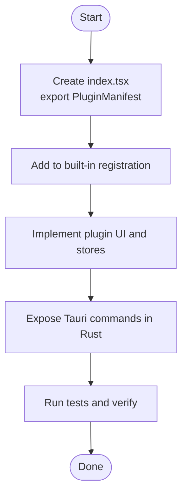
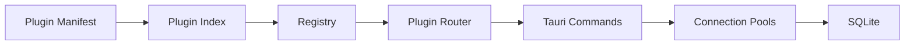

# Advanced Topics

<cite>
**Referenced Files in This Document**
- [registry.ts](file://src/app/plugin-registry/registry.ts)
- [builtin.ts](file://src/app/plugin-registry/builtin.ts)
- [types.ts](file://src/app/plugin-registry/types.ts)
- [index.tsx (API Debugger)](file://src/plugins/api-debugger/index.tsx)
- [index.tsx (Confluence)](file://src/plugins/confluence/index.tsx)
- [mod.rs](file://src-tauri/src/plugins/mod.rs)
- [client_pool.rs (MongoDB)](file://src-tauri/src/plugins/mongodb/client_pool.rs)
- [client_pool.rs (MySQL)](file://src-tauri/src/plugins/mysql/client_pool.rs)
- [pool.rs (Redis)](file://src-tauri/src/plugins/redis/pool.rs)
- [client_pool.rs (S3)](file://src-tauri/src/plugins/s3/client_pool.rs)
- [config.yaml (OpenSpec)](file://openspec/config.yaml)
- [AGENTS.md](file://AGENTS.md)
- [CLAUDE.md](file://CLAUDE.md)
- [DeveloperConsole.tsx](file://src/app/developer-console/DeveloperConsole.tsx)
- [platform.ts](file://src/app/runtime/platform.ts)
</cite>

## Table of Contents
1. [Introduction](#introduction)
2. [Project Structure](#project-structure)
3. [Core Components](#core-components)
4. [Architecture Overview](#architecture-overview)
5. [Detailed Component Analysis](#detailed-component-analysis)
6. [Dependency Analysis](#dependency-analysis)
7. [Performance Considerations](#performance-considerations)
8. [Troubleshooting Guide](#troubleshooting-guide)
9. [Conclusion](#conclusion)
10. [Appendices](#appendices)

## Introduction
This document provides advanced guidance for extending RDMM, optimizing performance, and leveraging expert-level capabilities. It focuses on the plugin development framework, custom plugin creation, extension patterns, performance optimization techniques (memory management, connection pooling, lazy loading), the open specification system, agent integrations, and practical examples for building and tuning RDMM.

## Project Structure
RDMM follows a hybrid frontend/backend architecture:
- Frontend (React + TypeScript) manages UI, routing, and plugin manifests.
- Backend (Rust/Tauri) exposes commands and manages persistent resources (databases, pools).
- Plugins are statically registered at compile time and rendered as single-page experiences.

**Diagram sources**
- [registry.ts:1-26](file://src/app/plugin-registry/registry.ts#L1-L26)
- [builtin.ts:1-31](file://src/app/plugin-registry/builtin.ts#L1-L31)
- [types.ts:1-14](file://src/app/plugin-registry/types.ts#L1-L14)
- [index.tsx (API Debugger):1-39](file://src/plugins/api-debugger/index.tsx#L1-L39)
- [index.tsx (Confluence):1-18](file://src/plugins/confluence/index.tsx#L1-L18)
- [mod.rs:1-11](file://src-tauri/src/plugins/mod.rs#L1-L11)
- [pool.rs (Redis):1-76](file://src-tauri/src/plugins/redis/pool.rs#L1-L76)
- [client_pool.rs (MongoDB):1-132](file://src-tauri/src/plugins/mongodb/client_pool.rs#L1-L132)
- [client_pool.rs (MySQL):1-65](file://src-tauri/src/plugins/mysql/client_pool.rs#L1-L65)
- [client_pool.rs (S3):1-86](file://src-tauri/src/plugins/s3/client_pool.rs#L1-L86)

**Section sources**
- [registry.ts:1-26](file://src/app/plugin-registry/registry.ts#L1-L26)
- [builtin.ts:1-31](file://src/app/plugin-registry/builtin.ts#L1-L31)
- [types.ts:1-14](file://src/app/plugin-registry/types.ts#L1-L14)
- [index.tsx (API Debugger):1-39](file://src/plugins/api-debugger/index.tsx#L1-L39)
- [index.tsx (Confluence):1-18](file://src/plugins/confluence/index.tsx#L1-L18)
- [mod.rs:1-11](file://src-tauri/src/plugins/mod.rs#L1-L11)

## Core Components
- Plugin Registry: Maintains a map of plugin manifests, supports registration, retrieval, and clearing.
- Built-in Registration: Registers all bundled plugins at startup.
- Plugin Manifest: Defines plugin identity, metadata, and UI component.
- Backend Plugins Module: Declares available backend plugin families.
- Connection Pools: Centralized, process-scoped pools for Redis, MongoDB, MySQL, and S3 clients.
- Developer Console: Live diagnostics drawer for internal events and logs.

**Section sources**
- [registry.ts:1-26](file://src/app/plugin-registry/registry.ts#L1-L26)
- [builtin.ts:1-31](file://src/app/plugin-registry/builtin.ts#L1-L31)
- [types.ts:1-14](file://src/app/plugin-registry/types.ts#L1-L14)
- [mod.rs:1-11](file://src-tauri/src/plugins/mod.rs#L1-L11)
- [pool.rs (Redis):1-76](file://src-tauri/src/plugins/redis/pool.rs#L1-L76)
- [client_pool.rs (MongoDB):1-132](file://src-tauri/src/plugins/mongodb/client_pool.rs#L1-L132)
- [client_pool.rs (MySQL):1-65](file://src-tauri/src/plugins/mysql/client_pool.rs#L1-L65)
- [client_pool.rs (S3):1-86](file://src-tauri/src/plugins/s3/client_pool.rs#L1-L86)
- [DeveloperConsole.tsx:1-132](file://src/app/developer-console/DeveloperConsole.tsx#L1-L132)

## Architecture Overview
The system enforces a strict separation:
- Frontend: Renders the active plugin and orchestrates UI state.
- Backend: Exposes Tauri commands for resource operations and lifecycle management.
- Persistence: SQLite initialized at startup; sensitive data encrypted before storage.
- Security: All backend structs use camelCase serialization to align with frontend conventions.

**Diagram sources**
- [registry.ts:13-21](file://src/app/plugin-registry/registry.ts#L13-L21)
- [platform.ts:1-10](file://src/app/runtime/platform.ts#L1-L10)
- [DeveloperConsole.tsx:35-45](file://src/app/developer-console/DeveloperConsole.tsx#L35-L45)

**Section sources**
- [CLAUDE.md:24-53](file://CLAUDE.md#L24-L53)
- [AGENTS.md:14-28](file://AGENTS.md#L14-L28)
- [platform.ts:1-10](file://src/app/runtime/platform.ts#L1-L10)
- [DeveloperConsole.tsx:1-132](file://src/app/developer-console/DeveloperConsole.tsx#L1-L132)

## Detailed Component Analysis

### Plugin Development Framework
- Manifest contract: id, name, icon, version, component, sidebar order, and optional sidebar visibility.
- Registration pipeline: create a manifest in the plugin’s index, export it, and register it in built-ins.
- Rendering: only one plugin is visible at a time; selection is driven by a global setting.

**Diagram sources**
- [types.ts:5-13](file://src/app/plugin-registry/types.ts#L5-L13)
- [registry.ts:5-25](file://src/app/plugin-registry/registry.ts#L5-L25)
- [builtin.ts:14-29](file://src/app/plugin-registry/builtin.ts#L14-L29)

**Section sources**
- [types.ts:1-14](file://src/app/plugin-registry/types.ts#L1-L14)
- [registry.ts:1-26](file://src/app/plugin-registry/registry.ts#L1-L26)
- [builtin.ts:1-31](file://src/app/plugin-registry/builtin.ts#L1-L31)
- [CLAUDE.md:26-44](file://CLAUDE.md#L26-L44)
- [AGENTS.md:14-20](file://AGENTS.md#L14-L20)

### Custom Plugin Creation Pattern
Steps to add a new plugin:
1. Create a new folder under plugins/<your-plugin-id> with an index.tsx exporting a PluginManifest.
2. Export the manifest and add it to the built-in registration list.
3. Implement the plugin component and any required stores.
4. Integrate with backend commands via Tauri invoke and Rust command handlers.

**Diagram sources**
- [index.tsx (API Debugger):38-39](file://src/plugins/api-debugger/index.tsx#L38-L39)
- [index.tsx (Confluence):10-17](file://src/plugins/confluence/index.tsx#L10-L17)
- [builtin.ts:19-28](file://src/app/plugin-registry/builtin.ts#L19-L28)
- [AGENTS.md:16-18](file://AGENTS.md#L16-L18)

**Section sources**
- [index.tsx (API Debugger):1-39](file://src/plugins/api-debugger/index.tsx#L1-L39)
- [index.tsx (Confluence):1-18](file://src/plugins/confluence/index.tsx#L1-L18)
- [builtin.ts:1-31](file://src/app/plugin-registry/builtin.ts#L1-L31)
- [AGENTS.md:14-20](file://AGENTS.md#L14-L20)

### Extension Patterns
- Single-Page Experience: Each plugin encapsulates its own state and views.
- Shared Stores: Global stores for theme and selected plugin ID; plugin-specific stores under src/plugins/<plugin>/store/.
- Event-Driven Diagnostics: Developer Console listens to dev-log events for real-time insights.

**Section sources**
- [CLAUDE.md:76-82](file://CLAUDE.md#L76-L82)
- [DeveloperConsole.tsx:35-45](file://src/app/developer-console/DeveloperConsole.tsx#L35-L45)

### Open Specification System
The open specification configuration enables spec-driven artifact creation and customization:
- Schema declaration and optional per-artifact rules.
- Optional project context injection for AI agents.

**Section sources**
- [config.yaml:1-21](file://openspec/config.yaml#L1-L21)

### Agent Integrations
Guidance for AI agents:
- Commands for local development and CI checks.
- Architecture conventions for plugin manifests, Tauri commands, and data encryption.
- Release and version synchronization across frontend, backend, and configuration files.

**Section sources**
- [CLAUDE.md:5-18](file://CLAUDE.md#L5-L18)
- [CLAUDE.md:24-53](file://CLAUDE.md#L24-L53)
- [AGENTS.md:29-46](file://AGENTS.md#L29-L46)

## Dependency Analysis
- Frontend-to-Backend coupling is mediated by Tauri commands; manifests define plugin boundaries.
- Backend plugins module aggregates all families; each family exposes a pool or client factory and command handlers.
- Runtime platform detection influences UI behavior (e.g., titlebar handling).

**Diagram sources**
- [types.ts:5-13](file://src/app/plugin-registry/types.ts#L5-L13)
- [index.tsx (API Debugger):38-39](file://src/plugins/api-debugger/index.tsx#L38-L39)
- [registry.ts:13-21](file://src/app/plugin-registry/registry.ts#L13-L21)
- [mod.rs:1-11](file://src-tauri/src/plugins/mod.rs#L1-L11)
- [pool.rs (Redis):10-13](file://src-tauri/src/plugins/redis/pool.rs#L10-L13)
- [client_pool.rs (MongoDB):9-12](file://src-tauri/src/plugins/mongodb/client_pool.rs#L9-L12)
- [client_pool.rs (MySQL):7-10](file://src-tauri/src/plugins/mysql/client_pool.rs#L7-L10)
- [client_pool.rs (S3):10-13](file://src-tauri/src/plugins/s3/client_pool.rs#L10-L13)

**Section sources**
- [types.ts:1-14](file://src/app/plugin-registry/types.ts#L1-L14)
- [index.tsx (API Debugger):1-39](file://src/plugins/api-debugger/index.tsx#L1-L39)
- [registry.ts:1-26](file://src/app/plugin-registry/registry.ts#L1-L26)
- [mod.rs:1-11](file://src-tauri/src/plugins/mod.rs#L1-L11)
- [platform.ts:1-10](file://src/app/runtime/platform.ts#L1-L10)

## Performance Considerations
- Memory Management
  - Backend pools are process-scoped and keyed by connection identifiers; clients persist until explicitly removed. This reduces allocation overhead but requires disciplined cleanup on disconnect.
  - Avoid retaining unnecessary references in plugin stores; prefer minimal state updates and selective re-renders.

- Connection Pooling
  - Redis: Uses a static pool keyed by connection ID; clients are stored in memory until disconnected.
  - MongoDB: Builds clients from URI or SRV options; maintains a static pool keyed by connection ID.
  - MySQL: Builds pools from connection options; supports charset initialization and disconnect semantics.
  - S3: Constructs SDK clients with region, credentials, and optional endpoint overrides; maintains a static pool keyed by connection ID.

- Lazy Loading Strategies
  - Defer heavy initialization until the plugin tab becomes active (already implemented in several plugins).
  - Use React Suspense-compatible patterns for dynamic imports of heavy views.
  - Debounce frequent UI updates and batch state changes to reduce re-render pressure.

- Synchronous I/O and Long Operations
  - Backend commands operate synchronously at the command level; avoid long-running operations on the UI thread. Offload heavy work to background tasks and use progress events.

**Section sources**
- [pool.rs (Redis):10-13](file://src-tauri/src/plugins/redis/pool.rs#L10-L13)
- [client_pool.rs (MongoDB):9-12](file://src-tauri/src/plugins/mongodb/client_pool.rs#L9-L12)
- [client_pool.rs (MySQL):7-10](file://src-tauri/src/plugins/mysql/client_pool.rs#L7-L10)
- [client_pool.rs (S3):10-13](file://src-tauri/src/plugins/s3/client_pool.rs#L10-L13)
- [index.tsx (API Debugger):21-21](file://src/plugins/api-debugger/index.tsx#L21-L21)
- [CLAUDE.md:74-74](file://CLAUDE.md#L74-L74)

## Troubleshooting Guide
- Plugin Not Visible
  - Verify manifest registration in built-ins and ensure sidebarOrder places it within the visible range.
  - Confirm the selected plugin ID in global settings matches the new plugin’s id.

- Backend Command Failures
  - Check Tauri command naming conventions and error propagation (Result<T, String>).
  - Validate serde field naming alignment (camelCase) between Rust structs and TypeScript.

- Connection Issues
  - Redis/MongoDB/MySQL/S3: Ensure the pool has a client for the given connection ID; verify PING/connectivity tests pass.
  - MySQL: Disconnect pools gracefully to free resources.

- Developer Console
  - Use the hidden drawer (Ctrl + Shift + D) to inspect dev-log events emitted by the app and plugins.
  - Copy or clear logs for sharing and debugging.

- Security and Encryption
  - Persist sensitive credentials using the AES-256-GCM helper before storing in SQLite.

**Section sources**
- [builtin.ts:19-28](file://src/app/plugin-registry/builtin.ts#L19-L28)
- [AGENTS.md:22-27](file://AGENTS.md#L22-L27)
- [CLAUDE.md:46-52](file://CLAUDE.md#L46-L52)
- [pool.rs (Redis):39-48](file://src-tauri/src/plugins/redis/pool.rs#L39-L48)
- [client_pool.rs (MongoDB):107-115](file://src-tauri/src/plugins/mongodb/client_pool.rs#L107-L115)
- [client_pool.rs (MySQL):32-40](file://src-tauri/src/plugins/mysql/client_pool.rs#L32-L40)
- [client_pool.rs (S3):61-69](file://src-tauri/src/plugins/s3/client_pool.rs#L61-L69)
- [DeveloperConsole.tsx:10-63](file://src/app/developer-console/DeveloperConsole.tsx#L10-L63)
- [AGENTS.md:29-31](file://AGENTS.md#L29-L31)

## Conclusion
RDMM’s architecture balances simplicity and power: plugins are first-class citizens with clear contracts, backend resources are pooled for efficiency, and diagnostics are built-in for rapid iteration. By following the extension patterns, adhering to performance best practices, and leveraging the open specification and agent guidance, you can build robust, maintainable extensions and optimize application behavior at scale.

## Appendices

### Practical Examples

- Developing a Custom Plugin
  - Create a manifest and export it from the plugin index.
  - Register it in built-ins and verify rendering in the sidebar.
  - Wire backend commands and state stores as needed.

- Optimizing Application Performance
  - Use connection pools and avoid recreating clients frequently.
  - Initialize heavy components lazily and dispose of them on tab switch.
  - Minimize global state churn and prefer granular updates.

- Integrating with External Systems
  - Expose Tauri commands for external APIs.
  - Manage credentials securely and persist encrypted data.
  - Provide health checks and latency measurements for connectivity.

**Section sources**
- [index.tsx (API Debugger):1-39](file://src/plugins/api-debugger/index.tsx#L1-L39)
- [index.tsx (Confluence):1-18](file://src/plugins/confluence/index.tsx#L1-L18)
- [builtin.ts:19-28](file://src/app/plugin-registry/builtin.ts#L19-L28)
- [CLAUDE.md:26-53](file://CLAUDE.md#L26-L53)
- [AGENTS.md:14-28](file://AGENTS.md#L14-L28)