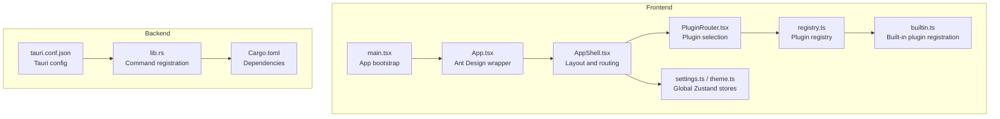
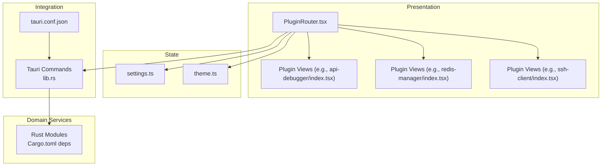
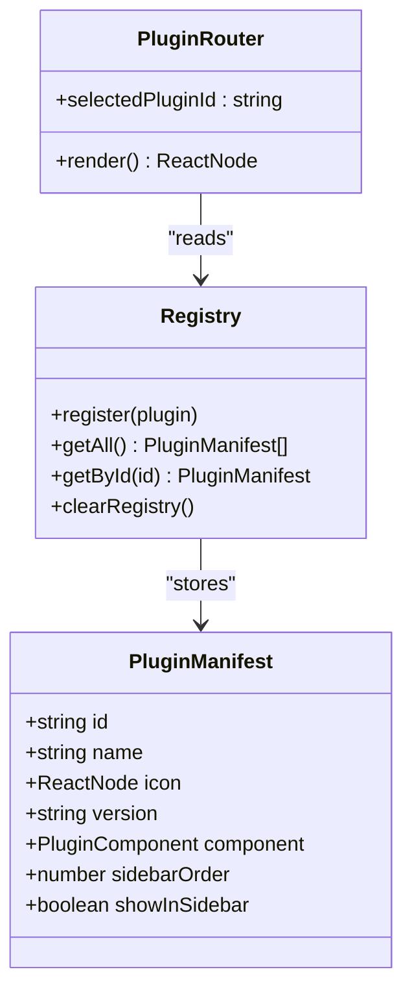
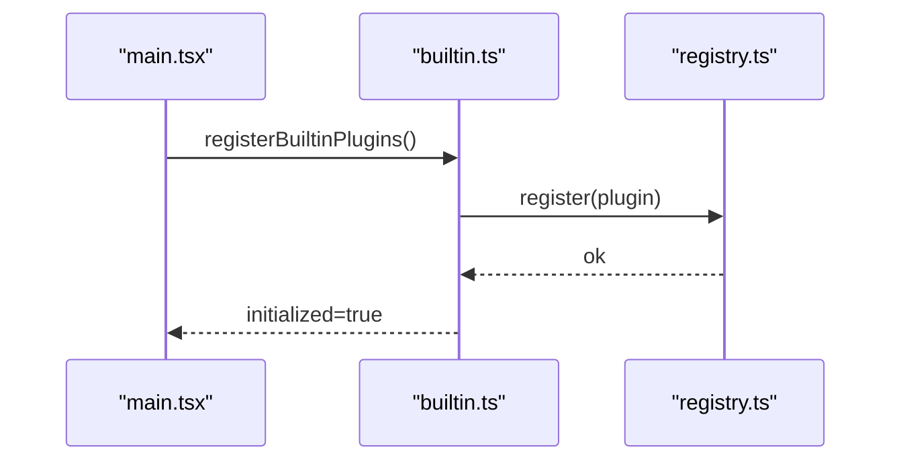
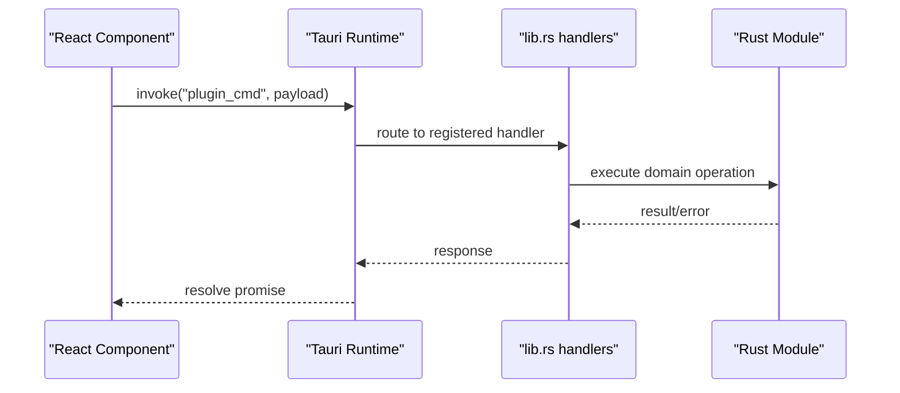
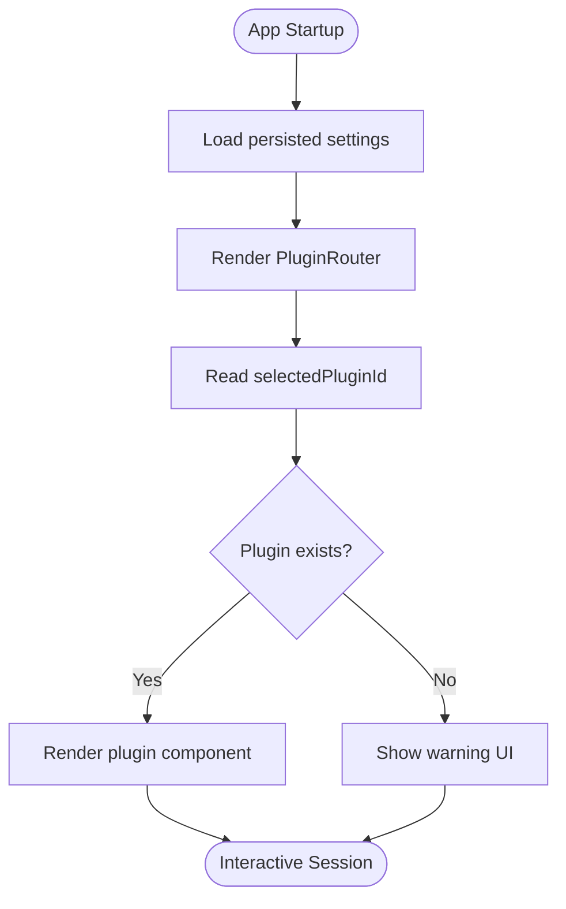
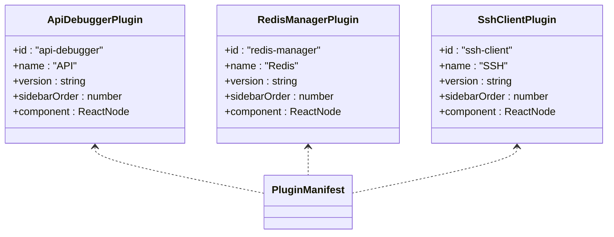
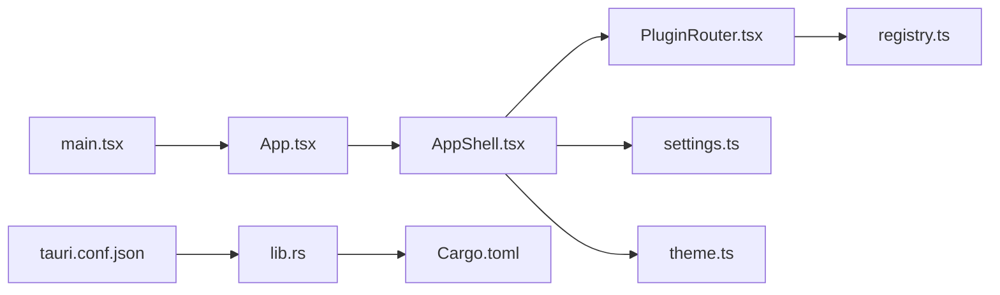

# Architecture Overview

<cite>
**Referenced Files in This Document**
- [main.tsx](file://src/main.tsx)
- [App.tsx](file://src/App.tsx)
- [AppShell.tsx](file://src/app/layout/AppShell.tsx)
- [PluginRouter.tsx](file://src/app/plugin-registry/PluginRouter.tsx)
- [registry.ts](file://src/app/plugin-registry/registry.ts)
- [types.ts](file://src/app/plugin-registry/types.ts)
- [builtin.ts](file://src/app/plugin-registry/builtin.ts)
- [settings.ts](file://src/app/store/settings.ts)
- [theme.ts](file://src/app/store/theme.ts)
- [tauri.conf.json](file://src-tauri/tauri.conf.json)
- [lib.rs](file://src-tauri/src/lib.rs)
- [Cargo.toml](file://src-tauri/Cargo.toml)
- [api-debugger/index.tsx](file://src/plugins/api-debugger/index.tsx)
- [redis-manager/index.tsx](file://src/plugins/redis-manager/index.tsx)
- [ssh-client/index.tsx](file://src/plugins/ssh-client/index.tsx)
</cite>

## Table of Contents
1. [Introduction](#introduction)
2. [Project Structure](#project-structure)
3. [Core Components](#core-components)
4. [Architecture Overview](#architecture-overview)
5. [Detailed Component Analysis](#detailed-component-analysis)
6. [Dependency Analysis](#dependency-analysis)
7. [Performance Considerations](#performance-considerations)
8. [Security and Cross-Cutting Concerns](#security-and-cross-cutting-consumers)
9. [Deployment Considerations](#deployment-considerations)
10. [Troubleshooting Guide](#troubleshooting-guide)
11. [Conclusion](#conclusion)

## Introduction
This document describes the system architecture of RDMM (DevNexus), a desktop developer toolkit built with a React frontend and a Tauri/Rust backend. The application follows a plugin-based extensibility model, enabling modular tooling for databases, cloud storage, SSH, LAN chat, and more. State management is handled by Zustand stores, and the frontend communicates with the backend via Tauri commands. The document explains the separation of concerns among UI components, plugin implementations, and backend services, along with system boundaries, data flow patterns, and integration points.

## Project Structure
The repository is organized into:
- Frontend (TypeScript/React):
  - Application shell and layout
  - Plugin registry and router
  - Built-in plugins under the plugins folder
  - Global state stores (Zustand)
- Backend (Rust/Tauri):
  - Tauri configuration and command registration
  - Rust modules implementing plugin commands and services

**Diagram sources**
- [main.tsx:1-38](file://src/main.tsx#L1-L38)
- [App.tsx:1-11](file://src/App.tsx#L1-L11)
- [AppShell.tsx:1-207](file://src/app/layout/AppShell.tsx#L1-L207)
- [PluginRouter.tsx:1-29](file://src/app/plugin-registry/PluginRouter.tsx#L1-L29)
- [registry.ts:1-26](file://src/app/plugin-registry/registry.ts#L1-L26)
- [builtin.ts:1-31](file://src/app/plugin-registry/builtin.ts#L1-L31)
- [settings.ts:1-28](file://src/app/store/settings.ts#L1-L28)
- [theme.ts:1-27](file://src/app/store/theme.ts#L1-L27)
- [tauri.conf.json:1-39](file://src-tauri/tauri.conf.json#L1-L39)
- [lib.rs:1-263](file://src-tauri/src/lib.rs#L1-L263)
- [Cargo.toml:1-49](file://src-tauri/Cargo.toml#L1-L49)

**Section sources**
- [main.tsx:1-38](file://src/main.tsx#L1-L38)
- [App.tsx:1-11](file://src/App.tsx#L1-L11)
- [AppShell.tsx:1-207](file://src/app/layout/AppShell.tsx#L1-L207)
- [PluginRouter.tsx:1-29](file://src/app/plugin-registry/PluginRouter.tsx#L1-L29)
- [registry.ts:1-26](file://src/app/plugin-registry/registry.ts#L1-L26)
- [builtin.ts:1-31](file://src/app/plugin-registry/builtin.ts#L1-L31)
- [settings.ts:1-28](file://src/app/store/settings.ts#L1-L28)
- [theme.ts:1-27](file://src/app/store/theme.ts#L1-L27)
- [tauri.conf.json:1-39](file://src-tauri/tauri.conf.json#L1-L39)
- [lib.rs:1-263](file://src-tauri/src/lib.rs#L1-L263)
- [Cargo.toml:1-49](file://src-tauri/Cargo.toml#L1-L49)

## Core Components
- Plugin Registry: Central registry managing plugin manifests and ordering.
- Plugin Router: Selects and renders the active plugin component based on user selection.
- Built-in Plugins: Pre-registered plugins injected at startup.
- Global Stores: Zustand stores for settings and theme persistence.
- Tauri Commands: Backend command handlers bridging frontend actions to Rust services.
- Application Shell: Orchestrates layout, status bar, and plugin rendering.

**Section sources**
- [registry.ts:1-26](file://src/app/plugin-registry/registry.ts#L1-L26)
- [types.ts:1-14](file://src/app/plugin-registry/types.ts#L1-L14)
- [builtin.ts:1-31](file://src/app/plugin-registry/builtin.ts#L1-L31)
- [PluginRouter.tsx:1-29](file://src/app/plugin-registry/PluginRouter.tsx#L1-L29)
- [settings.ts:1-28](file://src/app/store/settings.ts#L1-L28)
- [theme.ts:1-27](file://src/app/store/theme.ts#L1-L27)
- [lib.rs:26-259](file://src-tauri/src/lib.rs#L26-L259)

## Architecture Overview
The system follows a layered architecture:
- Presentation Layer: React components and plugin views.
- Routing Layer: PluginRouter selects the active plugin.
- State Layer: Zustand stores manage UI and plugin-specific state.
- Integration Layer: Tauri commands connect frontend to backend services.
- Domain Services Layer: Rust modules implement plugin commands and data access.

**Diagram sources**
- [PluginRouter.tsx:1-29](file://src/app/plugin-registry/PluginRouter.tsx#L1-L29)
- [api-debugger/index.tsx:1-39](file://src/plugins/api-debugger/index.tsx#L1-L39)
- [redis-manager/index.tsx:1-67](file://src/plugins/redis-manager/index.tsx#L1-L67)
- [ssh-client/index.tsx:1-66](file://src/plugins/ssh-client/index.tsx#L1-L66)
- [settings.ts:1-28](file://src/app/store/settings.ts#L1-L28)
- [theme.ts:1-27](file://src/app/store/theme.ts#L1-L27)
- [lib.rs:26-259](file://src-tauri/src/lib.rs#L26-L259)
- [tauri.conf.json:1-39](file://src-tauri/tauri.conf.json#L1-L39)
- [Cargo.toml:1-49](file://src-tauri/Cargo.toml#L1-L49)

## Detailed Component Analysis

### Plugin Registry and Router
The plugin registry maintains a sorted list of plugin manifests keyed by ID. The router selects the current plugin based on persisted settings and renders the associated component.

**Diagram sources**
- [types.ts:5-13](file://src/app/plugin-registry/types.ts#L5-L13)
- [registry.ts:3-25](file://src/app/plugin-registry/registry.ts#L3-L25)
- [PluginRouter.tsx:7-27](file://src/app/plugin-registry/PluginRouter.tsx#L7-L27)

**Section sources**
- [registry.ts:1-26](file://src/app/plugin-registry/registry.ts#L1-L26)
- [types.ts:1-14](file://src/app/plugin-registry/types.ts#L1-L14)
- [PluginRouter.tsx:1-29](file://src/app/plugin-registry/PluginRouter.tsx#L1-L29)

### Built-in Plugin Registration
Built-in plugins are registered once at application startup. This ensures the registry is populated before the router attempts to render a plugin.

**Diagram sources**
- [main.tsx:5-10](file://src/main.tsx#L5-L10)
- [builtin.ts:14-29](file://src/app/plugin-registry/builtin.ts#L14-L29)
- [registry.ts:5-11](file://src/app/plugin-registry/registry.ts#L5-L11)

**Section sources**
- [main.tsx:1-38](file://src/main.tsx#L1-L38)
- [builtin.ts:1-31](file://src/app/plugin-registry/builtin.ts#L1-L31)
- [registry.ts:1-26](file://src/app/plugin-registry/registry.ts#L1-L26)

### Frontend-Backend Communication via Tauri Commands
The frontend invokes backend commands through Tauri’s invoke mechanism. The backend registers command handlers in lib.rs, which are generated from plugin modules. The Tauri configuration defines the development and bundling behavior.

**Diagram sources**
- [lib.rs:26-259](file://src-tauri/src/lib.rs#L26-L259)
- [tauri.conf.json:6-11](file://src-tauri/tauri.conf.json#L6-L11)

**Section sources**
- [lib.rs:1-263](file://src-tauri/src/lib.rs#L1-L263)
- [tauri.conf.json:1-39](file://src-tauri/tauri.conf.json#L1-L39)

### State Management with Zustand
Global state is managed by Zustand stores with persistence. The settings store controls UI state and selected plugin, while the theme store manages appearance mode.

**Diagram sources**
- [settings.ts:13-27](file://src/app/store/settings.ts#L13-L27)
- [PluginRouter.tsx:7-27](file://src/app/plugin-registry/PluginRouter.tsx#L7-L27)

**Section sources**
- [settings.ts:1-28](file://src/app/store/settings.ts#L1-L28)
- [theme.ts:1-27](file://src/app/store/theme.ts#L1-L27)
- [PluginRouter.tsx:1-29](file://src/app/plugin-registry/PluginRouter.tsx#L1-L29)

### Plugin Implementation Examples
Each plugin exports a manifest and a root component. The plugin root component manages its internal state and views.

**Diagram sources**
- [api-debugger/index.tsx:38](file://src/plugins/api-debugger/index.tsx#L38)
- [redis-manager/index.tsx:59-66](file://src/plugins/redis-manager/index.tsx#L59-L66)
- [ssh-client/index.tsx:58-65](file://src/plugins/ssh-client/index.tsx#L58-L65)
- [types.ts:5-13](file://src/app/plugin-registry/types.ts#L5-L13)

**Section sources**
- [api-debugger/index.tsx:1-39](file://src/plugins/api-debugger/index.tsx#L1-L39)
- [redis-manager/index.tsx:1-67](file://src/plugins/redis-manager/index.tsx#L1-L67)
- [ssh-client/index.tsx:1-66](file://src/plugins/ssh-client/index.tsx#L1-L66)

## Dependency Analysis
The frontend depends on the plugin registry and stores, while the backend exposes commands consumed by the frontend. The Tauri configuration ties the frontend build to the backend runtime.

**Diagram sources**
- [main.tsx:1-38](file://src/main.tsx#L1-L38)
- [App.tsx:1-11](file://src/App.tsx#L1-L11)
- [AppShell.tsx:1-207](file://src/app/layout/AppShell.tsx#L1-L207)
- [PluginRouter.tsx:1-29](file://src/app/plugin-registry/PluginRouter.tsx#L1-L29)
- [registry.ts:1-26](file://src/app/plugin-registry/registry.ts#L1-L26)
- [settings.ts:1-28](file://src/app/store/settings.ts#L1-L28)
- [theme.ts:1-27](file://src/app/store/theme.ts#L1-L27)
- [tauri.conf.json:1-39](file://src-tauri/tauri.conf.json#L1-L39)
- [lib.rs:1-263](file://src-tauri/src/lib.rs#L1-L263)
- [Cargo.toml:1-49](file://src-tauri/Cargo.toml#L1-L49)

**Section sources**
- [main.tsx:1-38](file://src/main.tsx#L1-L38)
- [AppShell.tsx:1-207](file://src/app/layout/AppShell.tsx#L1-L207)
- [lib.rs:1-263](file://src-tauri/src/lib.rs#L1-L263)
- [tauri.conf.json:1-39](file://src-tauri/tauri.conf.json#L1-L39)

## Performance Considerations
- Plugin rendering is lazy via the router; only the active plugin component is mounted.
- Zustand stores are scoped per plugin or global, minimizing unnecessary re-renders.
- Tauri command handlers should avoid blocking operations; heavy workloads should be asynchronous.
- Persisted stores reduce initialization overhead by restoring state from disk.

## Security and Cross-Cutting Concerns
- Tauri configuration disables CSP for development; production builds should enforce a strict policy.
- Encryption and secrets handling are present in dependencies; ensure sensitive data is stored securely and transmitted over encrypted channels.
- Access to filesystem and dialogs is enabled via Tauri plugins; restrict capabilities to the minimum required for each plugin.

**Section sources**
- [tauri.conf.json:23-25](file://src-tauri/tauri.conf.json#L23-L25)
- [Cargo.toml:29-30](file://src-tauri/Cargo.toml#L29-L30)

## Deployment Considerations
- Development: The frontend runs at http://localhost:1420, served by Vite; Tauri launches the packaged app after building.
- Production: The app bundles the frontend dist and packages platform-specific binaries; ensure icons and metadata are configured.
- Capabilities: Review and constrain Tauri capabilities for hardened deployments.

**Section sources**
- [tauri.conf.json:6-11](file://src-tauri/tauri.conf.json#L6-L11)
- [tauri.conf.json:27-37](file://src-tauri/tauri.conf.json#L27-L37)

## Troubleshooting Guide
- No plugin registered: The router displays a warning when no plugin is found; ensure built-in plugins are registered during boot.
- Command not found: Verify the command is included in the generated handler list in lib.rs and matches the frontend invocation.
- State not persisting: Confirm the store middleware is configured and the storage key matches the persisted store name.

**Section sources**
- [PluginRouter.tsx:15-24](file://src/app/plugin-registry/PluginRouter.tsx#L15-L24)
- [lib.rs:26-259](file://src-tauri/src/lib.rs#L26-L259)
- [settings.ts:13-27](file://src/app/store/settings.ts#L13-L27)

## Conclusion
RDMM employs a clean separation of concerns: UI components and plugin views encapsulate presentation logic, Zustand stores centralize state, and Tauri commands provide a secure bridge to Rust-backed services. The plugin registry and router enable extensibility, while Tauri configuration and Cargo dependencies define the runtime and capabilities. This architecture supports modular growth, maintainable state management, and robust desktop integration.