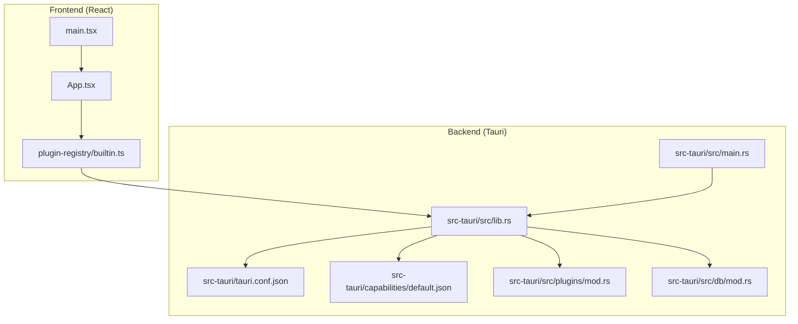
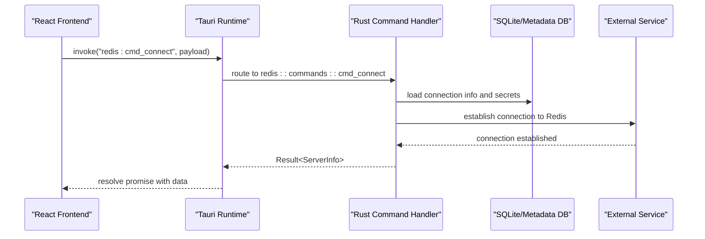
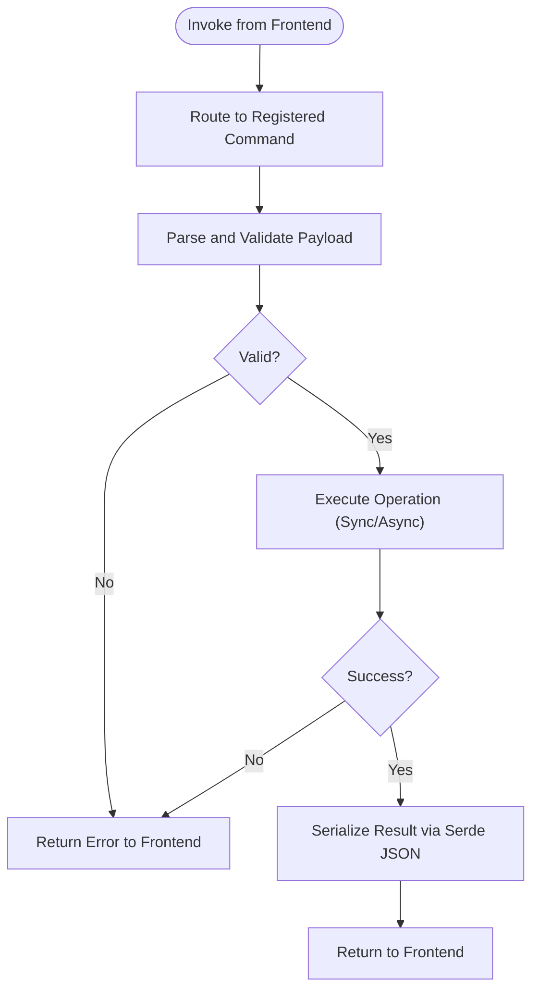
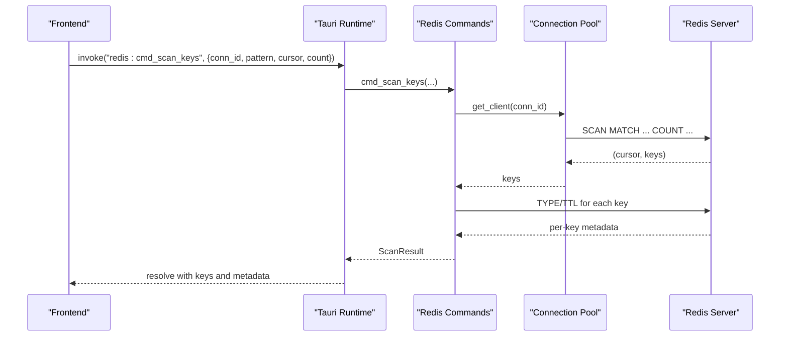
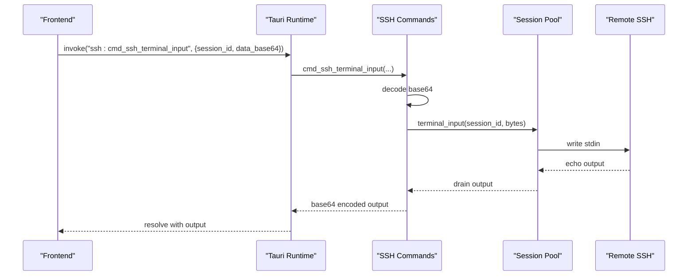
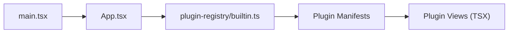
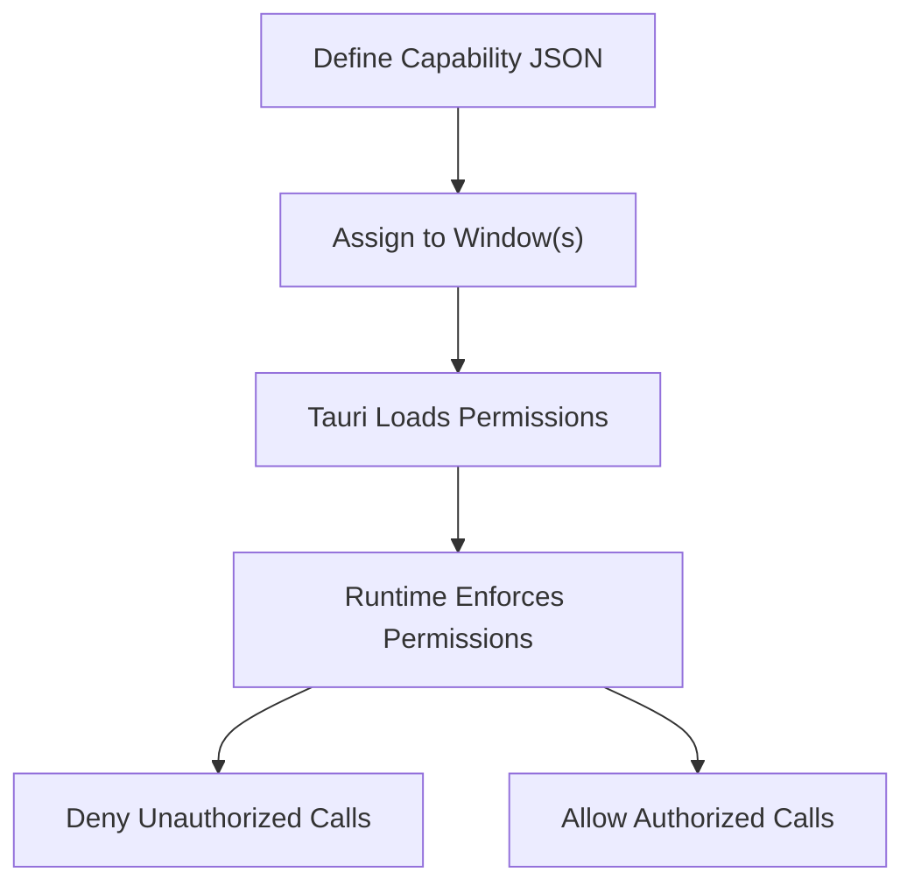
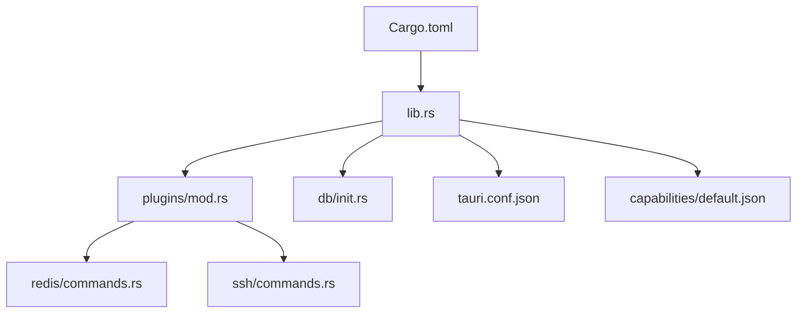

# Frontend-Backend Integration

<cite>
**Referenced Files in This Document**
- [Cargo.toml](file://src-tauri/Cargo.toml)
- [tauri.conf.json](file://src-tauri/tauri.conf.json)
- [lib.rs](file://src-tauri/src/lib.rs)
- [main.rs](file://src-tauri/src/main.rs)
- [default.json](file://src-tauri/capabilities/default.json)
- [plugins/mod.rs](file://src-tauri/src/plugins/mod.rs)
- [db/mod.rs](file://src-tauri/src/db/mod.rs)
- [redis/commands.rs](file://src-tauri/src/plugins/redis/commands.rs)
- [ssh/commands.rs](file://src-tauri/src/plugins/ssh/commands.rs)
- [builtin.ts](file://src/app/plugin-registry/builtin.ts)
- [main.tsx](file://src/main.tsx)
- [App.tsx](file://src/App.tsx)
</cite>

## Table of Contents
1. [Introduction](#introduction)
2. [Project Structure](#project-structure)
3. [Core Components](#core-components)
4. [Architecture Overview](#architecture-overview)
5. [Detailed Component Analysis](#detailed-component-analysis)
6. [Dependency Analysis](#dependency-analysis)
7. [Performance Considerations](#performance-considerations)
8. [Troubleshooting Guide](#troubleshooting-guide)
9. [Conclusion](#conclusion)
10. [Appendices](#appendices)

## Introduction
This document explains the frontend-backend integration of RDMM (DevNexus) using the Tauri framework. It focuses on the command system architecture, inter-process communication (IPC) patterns, and the security model implemented via capabilities. It documents the Rust backend services, Tauri command handlers, and data serialization mechanisms. It also details integration points between the React frontend and the Rust backend, including type safety, error handling, and asynchronous operation management. Practical examples illustrate command invocation, data exchange patterns, and resource management. Security considerations, sandboxing, and capability-based permissions are addressed, along with guidelines for extending the command system and optimizing performance.

## Project Structure
RDMM is organized into a React-based frontend and a Tauri-powered Rust backend. The frontend registers built-in plugins and renders the application shell. The backend initializes plugins, sets up database initialization, and exposes a large surface of Tauri commands grouped by domain (e.g., Redis, SSH, S3, MongoDB, MySQL, MQ, Network, API Debugger, LAN Chat, Confluence).

**Diagram sources**
- [main.tsx:1-38](file://src/main.tsx#L1-L38)
- [App.tsx:1-11](file://src/App.tsx#L1-L11)
- [builtin.ts:1-31](file://src/app/plugin-registry/builtin.ts#L1-L31)
- [main.rs:1-7](file://src-tauri/src/main.rs#L1-L7)
- [lib.rs:1-263](file://src-tauri/src/lib.rs#L1-L263)
- [tauri.conf.json:1-39](file://src-tauri/tauri.conf.json#L1-L39)
- [default.json:1-18](file://src-tauri/capabilities/default.json#L1-L18)
- [plugins/mod.rs:1-11](file://src-tauri/src/plugins/mod.rs#L1-L11)
- [db/mod.rs:1-8](file://src-tauri/src/db/mod.rs#L1-L8)

**Section sources**
- [main.tsx:1-38](file://src/main.tsx#L1-L38)
- [App.tsx:1-11](file://src/App.tsx#L1-L11)
- [builtin.ts:1-31](file://src/app/plugin-registry/builtin.ts#L1-L31)
- [main.rs:1-7](file://src-tauri/src/main.rs#L1-L7)
- [lib.rs:1-263](file://src-tauri/src/lib.rs#L1-L263)
- [tauri.conf.json:1-39](file://src-tauri/tauri.conf.json#L1-L39)
- [default.json:1-18](file://src-tauri/capabilities/default.json#L1-L18)
- [plugins/mod.rs:1-11](file://src-tauri/src/plugins/mod.rs#L1-L11)
- [db/mod.rs:1-8](file://src-tauri/src/db/mod.rs#L1-L8)

## Core Components
- Tauri application entrypoint and builder:
  - Application bootstrap and plugin registration occur in the Rust library module. The binary entrypoint delegates to the library’s run function.
- Command handler registration:
  - The Tauri Builder registers hundreds of commands across domains (Redis, SSH, S3, MongoDB, MySQL, MQ, Network, API Debugger, LAN Chat, Confluence). These are grouped under dedicated modules and exposed via a single invoke handler.
- Capability-based permissions:
  - Capabilities define which Tauri APIs are available to the frontend, including window controls, opener, dialog, and filesystem access.
- Database initialization:
  - The backend initializes local storage for connection metadata and query history.
- Plugin modules:
  - Plugins encapsulate domain-specific commands, pools, and utilities. Examples include Redis, SSH, S3, MongoDB, MySQL, MQ, Network, API Debugger, LAN Chat, and Confluence.

**Section sources**
- [main.rs:1-7](file://src-tauri/src/main.rs#L1-L7)
- [lib.rs:10-263](file://src-tauri/src/lib.rs#L10-L263)
- [default.json:1-18](file://src-tauri/capabilities/default.json#L1-L18)
- [db/mod.rs:1-8](file://src-tauri/src/db/mod.rs#L1-L8)
- [plugins/mod.rs:1-11](file://src-tauri/src/plugins/mod.rs#L1-L11)

## Architecture Overview
The frontend and backend communicate through Tauri’s IPC. The React app registers built-in plugins and renders views. Commands are invoked from the frontend and routed to Rust handlers. Handlers perform operations (e.g., database queries, external service calls) and return structured results serialized via Serde JSON.

**Diagram sources**
- [lib.rs:26-259](file://src-tauri/src/lib.rs#L26-L259)
- [redis/commands.rs:174-194](file://src-tauri/src/plugins/redis/commands.rs#L174-L194)

**Section sources**
- [lib.rs:26-259](file://src-tauri/src/lib.rs#L26-L259)
- [redis/commands.rs:174-194](file://src-tauri/src/plugins/redis/commands.rs#L174-L194)

## Detailed Component Analysis

### Tauri Command System and IPC
- Invocation model:
  - Frontend invokes commands using Tauri’s invoke mechanism. The command name follows a namespace convention (e.g., redis:cmd_connect).
  - The backend routes to a generated handler that resolves to a specific command function.
- Error propagation:
  - Command functions return Result<T, String>. Errors are propagated to the frontend as human-readable messages.
- Data serialization:
  - Structs used in command signatures derive serde Serialize/Deserialize. Responses are serialized to JSON for IPC.
- Async operations:
  - Tokio runtime powers async operations (e.g., external service calls). Commands themselves are synchronous entrypoints; long-running tasks should be offloaded to async contexts.

**Diagram sources**
- [lib.rs:26-259](file://src-tauri/src/lib.rs#L26-L259)
- [Cargo.toml:25-31](file://src-tauri/Cargo.toml#L25-L31)

**Section sources**
- [lib.rs:26-259](file://src-tauri/src/lib.rs#L26-L259)
- [Cargo.toml:25-31](file://src-tauri/Cargo.toml#L25-L31)

### Redis Plugin Commands
- Purpose:
  - Provides a comprehensive set of Redis operations: connection lifecycle, key scanning, TTL manipulation, string/hash/list/set/zset operations, raw command execution, and administrative queries.
- Implementation highlights:
  - Connection management uses a pool abstraction and stores credentials securely via the connection repository.
  - Results are normalized into a unified RedisValue type for safe serialization.
  - Dangerous commands require explicit confirmation.
  - Query history is persisted locally for auditing and reuse.
- Example invocation patterns:
  - Connect to a Redis instance, scan keys with pagination, update TTL, rename keys, and execute raw commands with safeguards.

**Diagram sources**
- [lib.rs:139-251](file://src-tauri/src/lib.rs#L139-L251)
- [redis/commands.rs:216-251](file://src-tauri/src/plugins/redis/commands.rs#L216-L251)

**Section sources**
- [lib.rs:139-251](file://src-tauri/src/lib.rs#L139-L251)
- [redis/commands.rs:1-800](file://src-tauri/src/plugins/redis/commands.rs#L1-L800)

### SSH Plugin Commands
- Purpose:
  - Manages SSH connections, terminals, key storage, and tunnel rules.
- Implementation highlights:
  - Latency testing performs TCP connect to remote host.
  - Terminal operations encode input as base64 and decode on the backend.
  - Tunnel rules support local, remote, and dynamic forwarding.
- Example invocation patterns:
  - Test connectivity, open a terminal session, resize the terminal, send input, drain output, manage keys, and start/stop tunnels.

**Diagram sources**
- [lib.rs:77-101](file://src-tauri/src/lib.rs#L77-L101)
- [ssh/commands.rs:85-106](file://src-tauri/src/plugins/ssh/commands.rs#L85-L106)

**Section sources**
- [lib.rs:77-101](file://src-tauri/src/lib.rs#L77-L101)
- [ssh/commands.rs:1-266](file://src-tauri/src/plugins/ssh/commands.rs#L1-L266)

### Frontend Integration Points
- Plugin registration:
  - Built-in plugins are registered during app startup. Each plugin exports a manifest with metadata and a React component.
- Rendering:
  - The root app wraps the shell and theme provider. Plugins render their views within the application layout.
- Type safety:
  - Frontend types align with backend structs via shared schemas and TypeScript interfaces. Commands are typed via Tauri’s type system.

**Diagram sources**
- [main.tsx:1-38](file://src/main.tsx#L1-L38)
- [App.tsx:1-11](file://src/App.tsx#L1-L11)
- [builtin.ts:1-31](file://src/app/plugin-registry/builtin.ts#L1-L31)

**Section sources**
- [main.tsx:1-38](file://src/main.tsx#L1-L38)
- [App.tsx:1-11](file://src/App.tsx#L1-L11)
- [builtin.ts:1-31](file://src/app/plugin-registry/builtin.ts#L1-L31)

### Security Model and Capabilities
- Capability-based permissions:
  - The default capability grants core window controls, opener, dialog, and filesystem access to the main window. Additional capabilities can be defined for specialized features.
- Sandboxing:
  - Tauri’s default CSP is disabled in configuration. Capabilities act as the primary sandboxing mechanism.
- Least privilege:
  - Define separate capabilities for plugins requiring distinct permissions (e.g., network tools, S3 access).

**Diagram sources**
- [default.json:1-18](file://src-tauri/capabilities/default.json#L1-L18)
- [tauri.conf.json:23-25](file://src-tauri/tauri.conf.json#L23-L25)

**Section sources**
- [default.json:1-18](file://src-tauri/capabilities/default.json#L1-L18)
- [tauri.conf.json:23-25](file://src-tauri/tauri.conf.json#L23-L25)

## Dependency Analysis
- Internal dependencies:
  - The library module depends on plugin modules and the database initialization module. Plugins depend on shared types and repositories.
- External dependencies:
  - Tauri core and plugins, Redis client, SQLite, AWS SDK for S3, MongoDB driver, MySQL async driver, Kafka/RabbitMQ clients, and networking libraries.
- Coupling and cohesion:
  - Commands are cohesive per domain and loosely coupled via shared repositories and pools. The central invoke handler aggregates all commands.

**Diagram sources**
- [lib.rs:1-263](file://src-tauri/src/lib.rs#L1-L263)
- [plugins/mod.rs:1-11](file://src-tauri/src/plugins/mod.rs#L1-L11)
- [db/mod.rs:1-8](file://src-tauri/src/db/mod.rs#L1-L8)
- [redis/commands.rs:1-800](file://src-tauri/src/plugins/redis/commands.rs#L1-L800)
- [ssh/commands.rs:1-266](file://src-tauri/src/plugins/ssh/commands.rs#L1-L266)
- [tauri.conf.json:1-39](file://src-tauri/tauri.conf.json#L1-L39)
- [default.json:1-18](file://src-tauri/capabilities/default.json#L1-L18)
- [Cargo.toml:1-49](file://src-tauri/Cargo.toml#L1-L49)

**Section sources**
- [lib.rs:1-263](file://src-tauri/src/lib.rs#L1-L263)
- [plugins/mod.rs:1-11](file://src-tauri/src/plugins/mod.rs#L1-L11)
- [db/mod.rs:1-8](file://src-tauri/src/db/mod.rs#L1-L8)
- [redis/commands.rs:1-800](file://src-tauri/src/plugins/redis/commands.rs#L1-L800)
- [ssh/commands.rs:1-266](file://src-tauri/src/plugins/ssh/commands.rs#L1-L266)
- [tauri.conf.json:1-39](file://src-tauri/tauri.conf.json#L1-L39)
- [default.json:1-18](file://src-tauri/capabilities/default.json#L1-L18)
- [Cargo.toml:1-49](file://src-tauri/Cargo.toml#L1-L49)

## Performance Considerations
- Efficient data transfer:
  - Prefer streaming or paginated results for large datasets (e.g., key scanning with cursor/count).
  - Minimize payload sizes by sending only required fields.
- Asynchronous operations:
  - Offload heavy workloads to async tasks; avoid blocking the main thread.
- Connection pooling:
  - Reuse pooled connections to reduce overhead.
- Serialization:
  - Keep command payloads minimal and leverage typed enums for compact representation.
- Caching:
  - Cache frequently accessed metadata (e.g., server info) to reduce repeated round trips.

## Troubleshooting Guide
- Command errors:
  - Commands return Result<T, String>. Inspect error messages for actionable diagnostics (e.g., “connection not found”, “invalid base64 input”).
- Permission denials:
  - If a command fails due to permissions, review the capability configuration for the affected window.
- Connectivity issues:
  - Use latency test commands to validate network reachability before establishing persistent connections.
- Data normalization:
  - For heterogeneous Redis values, rely on the unified value type to prevent deserialization failures.

**Section sources**
- [redis/commands.rs:16-29](file://src-tauri/src/plugins/redis/commands.rs#L16-L29)
- [ssh/commands.rs:86-91](file://src-tauri/src/plugins/ssh/commands.rs#L86-L91)
- [default.json:1-18](file://src-tauri/capabilities/default.json#L1-L18)

## Conclusion
RDMM integrates a React frontend with a Rust backend through Tauri’s IPC. The command system provides a scalable, capability-guarded interface for diverse data services. By leveraging typed payloads, robust error handling, and connection pooling, the system achieves reliability and performance. Extending the system involves adding new commands, integrating domain-specific repositories, and defining appropriate capabilities.

## Appendices

### Practical Examples

- Invoking a Redis command:
  - Namespace: redis
  - Example command: cmd_connect
  - Purpose: Establish a Redis connection and retrieve server info
  - Frontend invocation: invoke("redis:cmd_connect", { id })
  - Backend handler: redis::commands::cmd_connect
  - Notes: Requires a saved connection and optional password retrieval

- Invoking an SSH terminal command:
  - Namespace: ssh
  - Example command: cmd_ssh_terminal_input
  - Purpose: Send input to a terminal session
  - Frontend invocation: invoke("ssh:cmd_ssh_terminal_input", { session_id, data_base64 })
  - Backend handler: ssh::commands::cmd_ssh_terminal_input
  - Notes: Input is base64-encoded on the frontend and decoded on the backend

- Adding a new backend service:
  - Create a new plugin module under src-tauri/src/plugins/
  - Define commands with #[tauri::command] and return Result<T, String>
  - Register commands in lib.rs invoke handler
  - Add capability entries for required permissions
  - Expose a frontend plugin manifest and integrate into the registry

- Optimizing data transfer:
  - Use pagination for large lists (e.g., SCAN with cursor/count)
  - Encode binary streams (e.g., terminal input) as base64 to avoid framing issues
  - Normalize heterogeneous values into a single enum for safe serialization

**Section sources**
- [lib.rs:26-259](file://src-tauri/src/lib.rs#L26-L259)
- [redis/commands.rs:174-194](file://src-tauri/src/plugins/redis/commands.rs#L174-L194)
- [ssh/commands.rs:85-91](file://src-tauri/src/plugins/ssh/commands.rs#L85-L91)
- [builtin.ts:1-31](file://src/app/plugin-registry/builtin.ts#L1-L31)