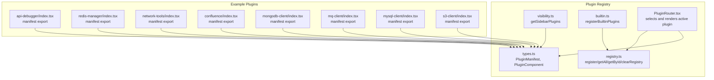
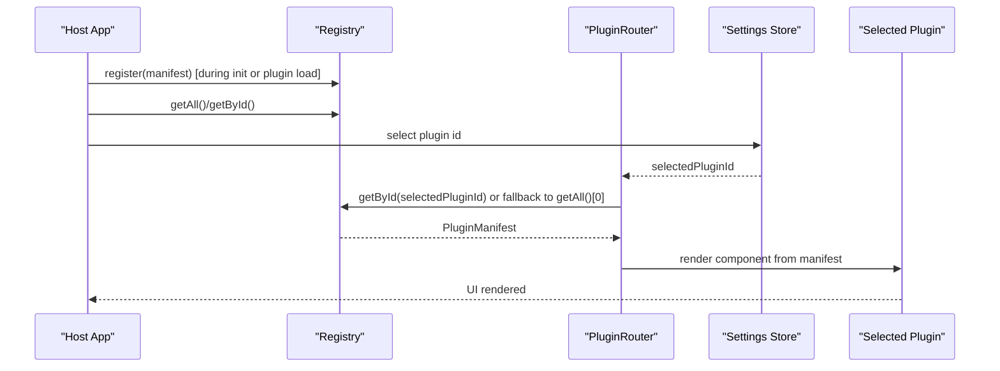
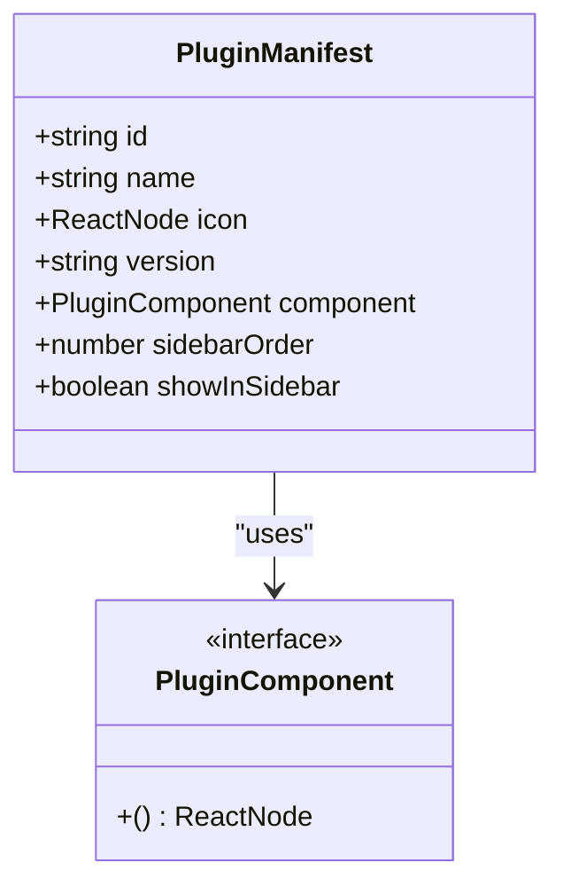
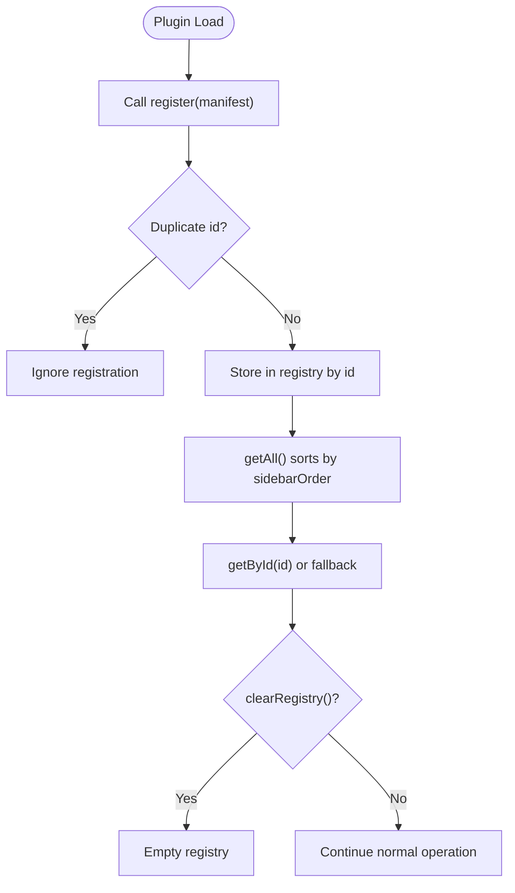
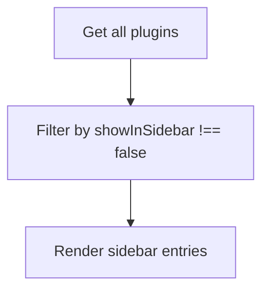
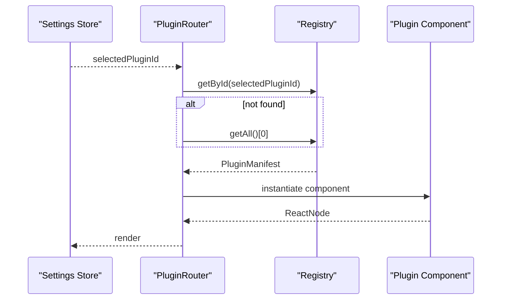
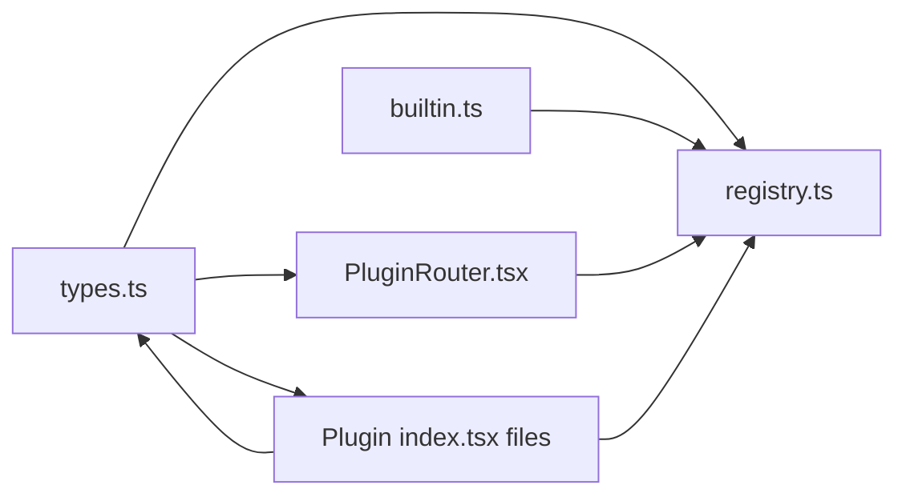

# Plugin Architecture

<cite>
**Referenced Files in This Document**
- [registry.ts](file://src/app/plugin-registry/registry.ts)
- [types.ts](file://src/app/plugin-registry/types.ts)
- [visibility.ts](file://src/app/plugin-registry/visibility.ts)
- [builtin.ts](file://src/app/plugin-registry/builtin.ts)
- [PluginRouter.tsx](file://src/app/plugin-registry/PluginRouter.tsx)
- [api-debugger/index.tsx](file://src/plugins/api-debugger/index.tsx)
- [api-debugger/types.ts](file://src/plugins/api-debugger/types.ts)
- [redis-manager/index.tsx](file://src/plugins/redis-manager/index.tsx)
- [network-tools/index.tsx](file://src/plugins/network-tools/index.tsx)
- [confluence/index.tsx](file://src/plugins/confluence/index.tsx)
- [mongodb-client/index.tsx](file://src/plugins/mongodb-client/index.tsx)
- [mq-client/index.tsx](file://src/plugins/mq-client/index.tsx)
- [mysql-client/index.tsx](file://src/plugins/mysql-client/index.tsx)
- [s3-client/index.tsx](file://src/plugins/s3-client/index.tsx)
</cite>

## Table of Contents
1. [Introduction](#introduction)
2. [Project Structure](#project-structure)
3. [Core Components](#core-components)
4. [Architecture Overview](#architecture-overview)
5. [Detailed Component Analysis](#detailed-component-analysis)
6. [Dependency Analysis](#dependency-analysis)
7. [Performance Considerations](#performance-considerations)
8. [Troubleshooting Guide](#troubleshooting-guide)
9. [Conclusion](#conclusion)
10. [Appendices](#appendices)

## Introduction
This document explains RDMM’s plugin architecture: the plugin registry pattern, manifest-based registration, dynamic loading via the plugin router, and the plugin lifecycle from registration to execution. It covers plugin metadata, visibility controls, state management integration, and communication with the host application. Practical examples demonstrate how to create plugins, define manifests, and integrate with the plugin router. Security, isolation, performance, and backward compatibility considerations are included to guide extension and maintenance.

## Project Structure
RDMM organizes plugin-related logic under a dedicated plugin registry module and individual plugin packages. The registry manages plugin manifests, exposes getters and setters, and supports built-in plugin registration. Plugins are self-contained packages exporting a PluginManifest and a root component. The plugin router selects and renders the active plugin based on application state.

**Diagram sources**
- [registry.ts:1-26](file://src/app/plugin-registry/registry.ts#L1-L26)
- [types.ts:1-14](file://src/app/plugin-registry/types.ts#L1-L14)
- [visibility.ts:1-6](file://src/app/plugin-registry/visibility.ts#L1-L6)
- [builtin.ts:1-31](file://src/app/plugin-registry/builtin.ts#L1-L31)
- [PluginRouter.tsx:1-29](file://src/app/plugin-registry/PluginRouter.tsx#L1-L29)
- [api-debugger/index.tsx:1-39](file://src/plugins/api-debugger/index.tsx#L1-L39)
- [redis-manager/index.tsx:1-67](file://src/plugins/redis-manager/index.tsx#L1-L67)
- [network-tools/index.tsx:1-27](file://src/plugins/network-tools/index.tsx#L1-L27)
- [confluence/index.tsx:1-18](file://src/plugins/confluence/index.tsx#L1-L18)
- [mongodb-client/index.tsx:1-87](file://src/plugins/mongodb-client/index.tsx#L1-L87)
- [mq-client/index.tsx:1-38](file://src/plugins/mq-client/index.tsx#L1-L38)
- [mysql-client/index.tsx:1-38](file://src/plugins/mysql-client/index.tsx#L1-L38)
- [s3-client/index.tsx:1-76](file://src/plugins/s3-client/index.tsx#L1-L76)

**Section sources**
- [registry.ts:1-26](file://src/app/plugin-registry/registry.ts#L1-L26)
- [types.ts:1-14](file://src/app/plugin-registry/types.ts#L1-L14)
- [visibility.ts:1-6](file://src/app/plugin-registry/visibility.ts#L1-L6)
- [builtin.ts:1-31](file://src/app/plugin-registry/builtin.ts#L1-L31)
- [PluginRouter.tsx:1-29](file://src/app/plugin-registry/PluginRouter.tsx#L1-L29)

## Core Components
- PluginManifest defines the contract for plugin registration: id, name, icon, version, component, sidebarOrder, and optional showInSidebar flag.
- Registry provides a simple in-memory store keyed by plugin id with registration, retrieval, sorting, and clearing utilities.
- Visibility filter determines which plugins appear in the sidebar based on the showInSidebar flag.
- Built-in plugin registration centralizes initial plugin registration to avoid duplication and ensure deterministic ordering.
- PluginRouter selects the active plugin from the registry and renders its component, falling back to the first available plugin if none is selected.

**Section sources**
- [types.ts:1-14](file://src/app/plugin-registry/types.ts#L1-L14)
- [registry.ts:1-26](file://src/app/plugin-registry/registry.ts#L1-L26)
- [visibility.ts:1-6](file://src/app/plugin-registry/visibility.ts#L1-L6)
- [builtin.ts:1-31](file://src/app/plugin-registry/builtin.ts#L1-L31)
- [PluginRouter.tsx:1-29](file://src/app/plugin-registry/PluginRouter.tsx#L1-L29)

## Architecture Overview
The plugin architecture follows a manifest-driven registry pattern:
- Plugins export a PluginManifest and a root component.
- Built-in plugins are registered once during initialization.
- The router reads the current selection from application state and renders the matching plugin component.
- Sidebar visibility is controlled by the manifest’s showInSidebar flag.

**Diagram sources**
- [registry.ts:13-21](file://src/app/plugin-registry/registry.ts#L13-L21)
- [PluginRouter.tsx:7-28](file://src/app/plugin-registry/PluginRouter.tsx#L7-L28)
- [builtin.ts:14-29](file://src/app/plugin-registry/builtin.ts#L14-L29)

## Detailed Component Analysis

### Plugin Manifest Contract
The PluginManifest interface defines the plugin contract:
- id: Unique identifier used by the registry and router.
- name/icon/version: Metadata for display and identification.
- component: A React component factory returning a ReactNode.
- sidebarOrder: Numeric order for sidebar rendering.
- showInSidebar: Optional flag to hide from sidebar.

**Diagram sources**
- [types.ts:5-13](file://src/app/plugin-registry/types.ts#L5-L13)

**Section sources**
- [types.ts:1-14](file://src/app/plugin-registry/types.ts#L1-L14)

### Registry Pattern and Lifecycle
Lifecycle stages:
- Registration: Plugins call register with their manifest. Duplicate ids are ignored.
- Discovery: getAll returns manifests sorted by sidebarOrder.
- Selection: getById retrieves a specific plugin by id.
- Clearing: clearRegistry resets the registry (useful for hot-reload or testing).
- Initialization: Built-in plugins are registered once via registerBuiltinPlugins.

**Diagram sources**
- [registry.ts:5-25](file://src/app/plugin-registry/registry.ts#L5-L25)
- [builtin.ts:14-29](file://src/app/plugin-registry/builtin.ts#L14-L29)

**Section sources**
- [registry.ts:1-26](file://src/app/plugin-registry/registry.ts#L1-L26)
- [builtin.ts:1-31](file://src/app/plugin-registry/builtin.ts#L1-L31)

### Visibility Controls
Sidebar visibility is determined by filtering plugins whose showInSidebar is not explicitly false. This allows plugins to opt out of sidebar presentation while still being available for programmatic selection.

**Diagram sources**
- [visibility.ts:3-5](file://src/app/plugin-registry/visibility.ts#L3-L5)

**Section sources**
- [visibility.ts:1-6](file://src/app/plugin-registry/visibility.ts#L1-L6)

### Dynamic Loading and Router Integration
The PluginRouter:
- Reads selectedPluginId from the settings store.
- Resolves the selected plugin manifest by id, or falls back to the first plugin from getAll().
- Renders the plugin’s component.

**Diagram sources**
- [PluginRouter.tsx:7-28](file://src/app/plugin-registry/PluginRouter.tsx#L7-L28)
- [registry.ts:13-21](file://src/app/plugin-registry/registry.ts#L13-L21)

**Section sources**
- [PluginRouter.tsx:1-29](file://src/app/plugin-registry/PluginRouter.tsx#L1-L29)

### Example Plugins and State Management Integration
Each plugin exports a PluginManifest and a root component. Root components typically:
- Subscribe to plugin-specific stores to manage internal state.
- Render tabbed workspaces or specialized views.
- Use manifest metadata (id, name, icon, version) for UI labeling and selection.

Examples:
- API Debugger: Tabs for Workspace, Collections, Environments, History; integrates with its own store for requests and environments.
- Redis Manager: Tabs for Connections, Keys, Console, Server; enforces navigation rules based on active connection.
- MongoDB Client: Rich tabs for connections, databases, documents, query, indexes, import/export, server; integrates with connection store.
- MySQL Client: Tabs for connections, databases, table data, SQL, indexes, import/export, server; integrates with connection store.
- S3 Client: Tabs for connections, buckets, objects; lazy loads buckets when switching to the buckets tab.
- Network Tools: Tabs for Diagnostics and History; displays active tool.
- Confluence: Minimal wrapper around editor component.

These plugins illustrate:
- How to structure plugin roots with segmented controls and tabbed views.
- How to integrate with plugin-local stores for state management.
- How to use manifest metadata for consistent UI labeling.

**Section sources**
- [api-debugger/index.tsx:13-39](file://src/plugins/api-debugger/index.tsx#L13-L39)
- [api-debugger/types.ts:1-105](file://src/plugins/api-debugger/types.ts#L1-L105)
- [redis-manager/index.tsx:14-67](file://src/plugins/redis-manager/index.tsx#L14-L67)
- [mongodb-client/index.tsx:14-87](file://src/plugins/mongodb-client/index.tsx#L14-L87)
- [mysql-client/index.tsx:14-38](file://src/plugins/mysql-client/index.tsx#L14-L38)
- [s3-client/index.tsx:10-76](file://src/plugins/s3-client/index.tsx#L10-L76)
- [network-tools/index.tsx:9-27](file://src/plugins/network-tools/index.tsx#L9-L27)
- [confluence/index.tsx:6-18](file://src/plugins/confluence/index.tsx#L6-L18)

## Dependency Analysis
- Registry depends on PluginManifest types and maintains a Map keyed by id.
- Built-in registration depends on plugin index exports and registry.register.
- Router depends on registry getters and the settings store for selection.
- Plugins depend on their own stores and types, and export a manifest conforming to PluginManifest.

**Diagram sources**
- [types.ts:1-14](file://src/app/plugin-registry/types.ts#L1-L14)
- [registry.ts:1-26](file://src/app/plugin-registry/registry.ts#L1-L26)
- [builtin.ts:1-31](file://src/app/plugin-registry/builtin.ts#L1-L31)
- [PluginRouter.tsx:1-29](file://src/app/plugin-registry/PluginRouter.tsx#L1-L29)
- [api-debugger/index.tsx:5-39](file://src/plugins/api-debugger/index.tsx#L5-L39)
- [redis-manager/index.tsx:5-67](file://src/plugins/redis-manager/index.tsx#L5-L67)
- [mongodb-client/index.tsx:5-87](file://src/plugins/mongodb-client/index.tsx#L5-L87)
- [mysql-client/index.tsx:5-38](file://src/plugins/mysql-client/index.tsx#L5-L38)
- [s3-client/index.tsx:5-76](file://src/plugins/s3-client/index.tsx#L5-L76)
- [network-tools/index.tsx:4-27](file://src/plugins/network-tools/index.tsx#L4-L27)
- [confluence/index.tsx:3-18](file://src/plugins/confluence/index.tsx#L3-L18)

**Section sources**
- [registry.ts:1-26](file://src/app/plugin-registry/registry.ts#L1-L26)
- [types.ts:1-14](file://src/app/plugin-registry/types.ts#L1-L14)
- [builtin.ts:1-31](file://src/app/plugin-registry/builtin.ts#L1-L31)
- [PluginRouter.tsx:1-29](file://src/app/plugin-registry/PluginRouter.tsx#L1-L29)

## Performance Considerations
- Prefer lazy-loading plugin components to reduce initial bundle size. This can be achieved by dynamically importing the plugin root component inside the router or by deferring plugin registration until needed.
- Minimize heavy computations in plugin root components; offload to plugin stores and memoize selectors.
- Use selective re-rendering via React.memo or equivalent patterns within plugin views.
- Keep sidebarOrder stable to avoid unnecessary re-sorting; avoid frequent manifest updates.
- Avoid synchronous heavy work in register; defer initialization to plugin root effects.

[No sources needed since this section provides general guidance]

## Troubleshooting Guide
Common issues and resolutions:
- No plugin registered: The router displays a warning when no plugin is found. Ensure registerBuiltinPlugins is called or that custom plugins are registered before rendering the router.
- Selected plugin id invalid: The router falls back to the first plugin from getAll(). Verify the settings store persists a valid id or initialize with a default.
- Duplicate plugin id: Registration is ignored for duplicates. Ensure each plugin id is unique.
- Plugin not visible in sidebar: Confirm showInSidebar is not explicitly set to false in the manifest.

**Section sources**
- [PluginRouter.tsx:15-24](file://src/app/plugin-registry/PluginRouter.tsx#L15-L24)
- [registry.ts:6-8](file://src/app/plugin-registry/registry.ts#L6-L8)
- [builtin.ts:15-17](file://src/app/plugin-registry/builtin.ts#L15-L17)

## Conclusion
RDMM’s plugin architecture centers on a clean manifest contract, a simple registry, and a router that dynamically renders the active plugin. Built-in registration ensures predictable initialization, while visibility controls and sidebar ordering provide flexible presentation. Plugins integrate with their own stores and expose a root component for rendering. Following the patterns documented here enables secure, isolated, and maintainable extensions with strong backward compatibility.

[No sources needed since this section summarizes without analyzing specific files]

## Appendices

### Creating a New Plugin
Steps:
- Define a root component that renders the plugin UI and integrates with a plugin-local store.
- Export a PluginManifest with id, name, icon, version, component, sidebarOrder, and optional showInSidebar.
- Register the plugin manifest via registry.register or include it in built-in registration.
- Ensure the router can select the plugin via the settings store.

References:
- Manifest contract: [types.ts:5-13](file://src/app/plugin-registry/types.ts#L5-L13)
- Registration: [registry.ts:5-11](file://src/app/plugin-registry/registry.ts#L5-L11)
- Built-in registration: [builtin.ts:14-29](file://src/app/plugin-registry/builtin.ts#L14-L29)
- Router selection: [PluginRouter.tsx:7-13](file://src/app/plugin-registry/PluginRouter.tsx#L7-L13)

**Section sources**
- [types.ts:1-14](file://src/app/plugin-registry/types.ts#L1-L14)
- [registry.ts:1-26](file://src/app/plugin-registry/registry.ts#L1-L26)
- [builtin.ts:1-31](file://src/app/plugin-registry/builtin.ts#L1-L31)
- [PluginRouter.tsx:1-29](file://src/app/plugin-registry/PluginRouter.tsx#L1-L29)

### Security and Isolation Guidelines
- Keep plugin state local to plugin stores to prevent cross-plugin interference.
- Avoid direct DOM manipulation in plugin components; use React patterns and Ant Design components consistently.
- Sanitize user inputs within plugin views; delegate sensitive operations to backend APIs or Tauri plugins when applicable.
- Use React’s component boundaries to isolate plugin rendering and minimize global side effects.

[No sources needed since this section provides general guidance]

### Backward Compatibility Best Practices
- Do not change PluginManifest fields without deprecation notices and migration paths.
- Maintain stable sidebarOrder values to preserve UI ordering.
- Keep component signatures consistent; introduce optional props with defaults.
- Version manifests per plugin to track breaking changes and enable selective updates.

[No sources needed since this section provides general guidance]