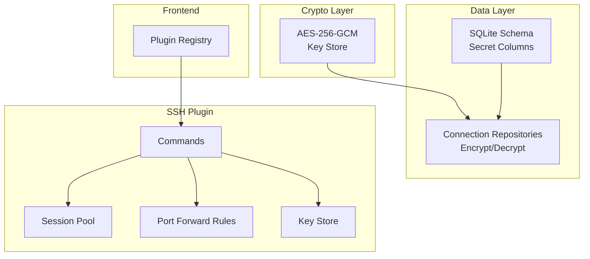
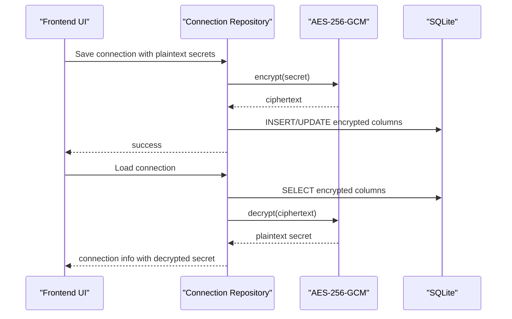
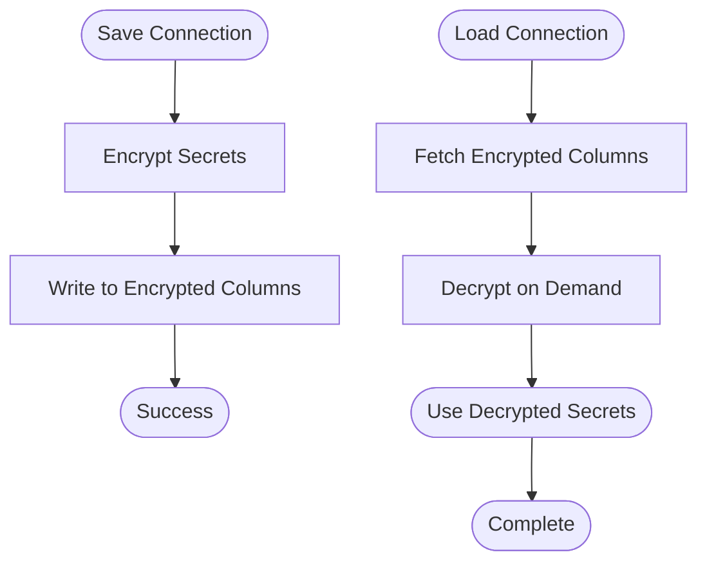
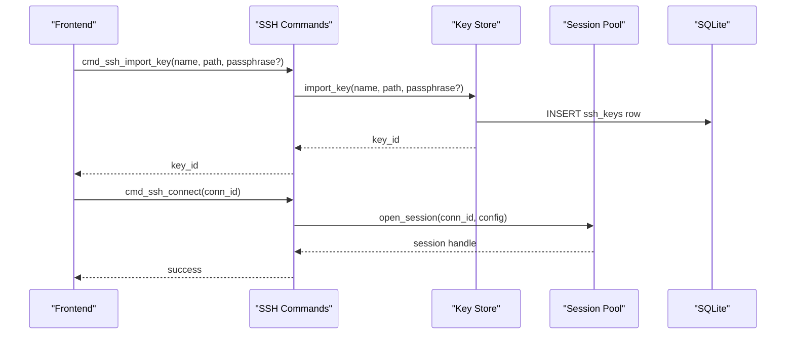
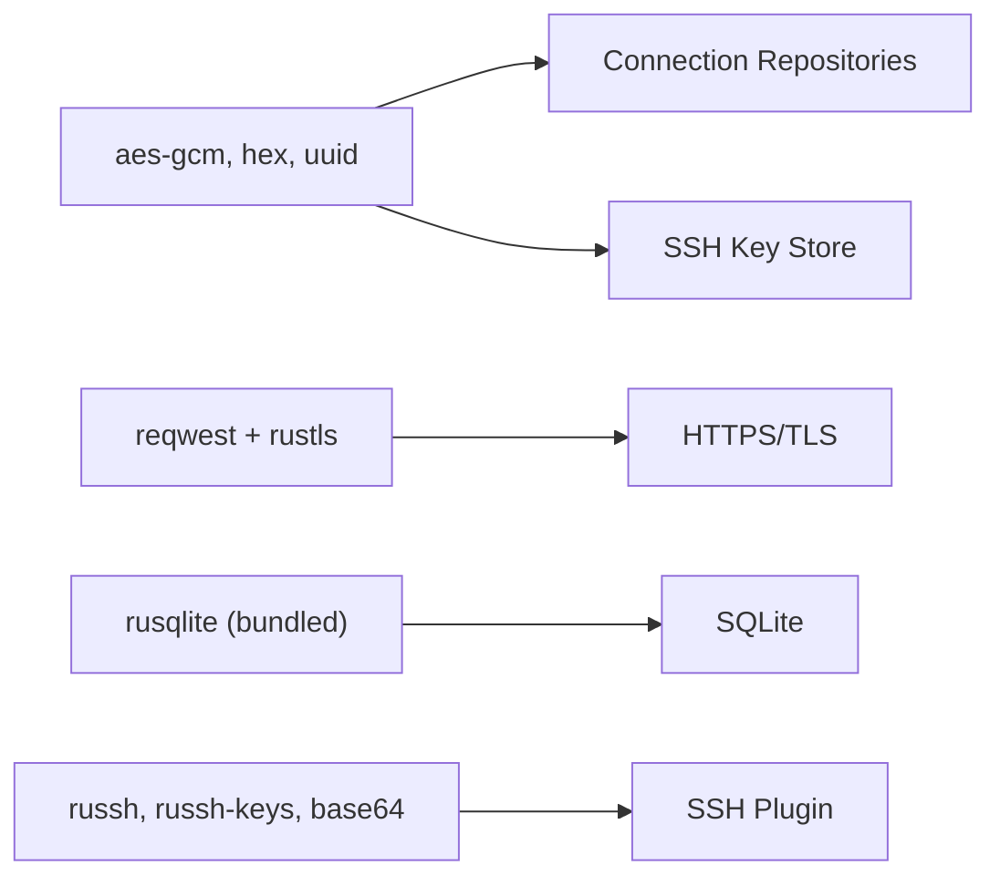

# Security Architecture

<cite>
**Referenced Files in This Document**
- [mod.rs](file://src-tauri/src/crypto/mod.rs)
- [init.rs](file://src-tauri/src/db/init.rs)
- [connection_repo.rs](file://src-tauri/src/db/connection_repo.rs)
- [mysql_connection_repo.rs](file://src-tauri/src/db/mysql_connection_repo.rs)
- [mongodb_connection_repo.rs](file://src-tauri/src/db/mongodb_connection_repo.rs)
- [ssh_connection_repo.rs](file://src-tauri/src/db/ssh_connection_repo.rs)
- [key_store.rs](file://src-tauri/src/plugins/ssh/key_store.rs)
- [commands.rs](file://src-tauri/src/plugins/ssh/commands.rs)
- [session_pool.rs](file://src-tauri/src/plugins/ssh/session_pool.rs)
- [tunnel.rs](file://src-tauri/src/plugins/ssh/tunnel.rs)
- [Cargo.toml](file://src-tauri/Cargo.toml)
- [tauri.conf.json](file://src-tauri/tauri.conf.json)
</cite>

## Table of Contents
1. [Introduction](#introduction)
2. [Project Structure](#project-structure)
3. [Core Components](#core-components)
4. [Architecture Overview](#architecture-overview)
5. [Detailed Component Analysis](#detailed-component-analysis)
6. [Dependency Analysis](#dependency-analysis)
7. [Performance Considerations](#performance-considerations)
8. [Troubleshooting Guide](#troubleshooting-guide)
9. [Conclusion](#conclusion)
10. [Appendices](#appendices)

## Introduction
This document describes RDMM's security architecture and encryption implementation. It explains how AES-256-GCM protects stored credentials, how database connections are secured, how SSH keys and sessions are managed, and how secure communication is maintained across plugins. It also covers threat modeling, best practices, and compliance considerations for developing secure plugins and handling secrets.

## Project Structure
Security-critical components are organized by responsibility:
- Cryptographic primitives and key management live under the crypto module.
- Database initialization and schema define where secrets are persisted.
- Connection repositories manage encryption/decryption of credentials for Redis, MySQL, MongoDB, S3, SSH, and MQ.
- SSH plugin implements key storage, session pooling, and tunneling with secure secret retrieval.
- Frontend plugin registry and Tauri configuration define the runtime security posture.

**Diagram sources**
- [mod.rs:1-75](file://src-tauri/src/crypto/mod.rs#L1-L75)
- [init.rs:35-115](file://src-tauri/src/db/init.rs#L35-L115)
- [connection_repo.rs:96-115](file://src-tauri/src/db/connection_repo.rs#L96-L115)
- [ssh_connection_repo.rs:117-167](file://src-tauri/src/db/ssh_connection_repo.rs#L117-L167)
- [key_store.rs:39-108](file://src-tauri/src/plugins/ssh/key_store.rs#L39-L108)
- [commands.rs:8-139](file://src-tauri/src/plugins/ssh/commands.rs#L8-L139)

**Section sources**
- [mod.rs:1-75](file://src-tauri/src/crypto/mod.rs#L1-L75)
- [init.rs:35-115](file://src-tauri/src/db/init.rs#L35-L115)
- [commands.rs:8-139](file://src-tauri/src/plugins/ssh/commands.rs#L8-L139)

## Core Components
- AES-256-GCM encryption/decryption with a per-installation symmetric key.
- SQLite-backed secret storage with encrypted columns for each service.
- SSH key management with optional passphrase encryption and runtime retrieval.
- Session pooling and tunnel management with lifecycle controls.
- Tauri security configuration and Rust TLS stack.

**Section sources**
- [mod.rs:40-74](file://src-tauri/src/crypto/mod.rs#L40-L74)
- [init.rs:35-115](file://src-tauri/src/db/init.rs#L35-L115)
- [key_store.rs:66-108](file://src-tauri/src/plugins/ssh/key_store.rs#L66-L108)
- [session_pool.rs:105-139](file://src-tauri/src/plugins/ssh/session_pool.rs#L105-L139)
- [tunnel.rs:132-176](file://src-tauri/src/plugins/ssh/tunnel.rs#L132-L176)

## Architecture Overview
The system uses a layered approach:
- A single AES-256-GCM key is generated or loaded from disk and stored in the application data directory.
- Secrets are encrypted before being written to SQLite columns dedicated to each service.
- On demand, secrets are decrypted only when establishing connections or performing operations.
- SSH-specific flows include key import/generation, passphrase encryption, and secure session management.

**Diagram sources**
- [connection_repo.rs:96-115](file://src-tauri/src/db/connection_repo.rs#L96-L115)
- [mod.rs:40-74](file://src-tauri/src/crypto/mod.rs#L40-L74)

## Detailed Component Analysis

### AES-256-GCM Encryption Module
- Key management:
  - Loads or generates a 32-byte key from a file in the application data directory.
  - Supports migration from a legacy key filename.
- Encryption/decryption:
  - Uses AES-256-GCM with a fixed 12-byte nonce.
  - Returns hex-encoded ciphertext for persistence.
  - Handles empty inputs gracefully.

Security considerations:
- Fixed nonce is a known weakness. While acceptable for local, per-user secrets, it should not be reused across messages or devices.
- The key is stored in cleartext on disk; protect the application data directory and restrict OS-level access.

**Section sources**
- [mod.rs:10-19](file://src-tauri/src/crypto/mod.rs#L10-L19)
- [mod.rs:21-38](file://src-tauri/src/crypto/mod.rs#L21-L38)
- [mod.rs:40-55](file://src-tauri/src/crypto/mod.rs#L40-L55)
- [mod.rs:57-74](file://src-tauri/src/crypto/mod.rs#L57-L74)

### Database Initialization and Secret Storage
- Schema defines encrypted columns for each service:
  - Redis: password_encrypted
  - MySQL: password_encrypted
  - MongoDB: uri_encrypted, password_encrypted
  - SSH: password_encrypted, key_passphrase_encrypted, private_key_path
  - MQ: password_encrypted, rabbitmq_management_password_encrypted, kafka_sasl_password_encrypted
  - S3: secret_access_key_encrypted
- Data directory migration ensures continuity across versions.

Best practices:
- Keep secrets in dedicated encrypted columns; avoid embedding in URIs unless necessary.
- Validate and sanitize inputs before encryption.

**Section sources**
- [init.rs:35-115](file://src-tauri/src/db/init.rs#L35-L115)
- [init.rs:117-133](file://src-tauri/src/db/init.rs#L117-L133)
- [init.rs:144-157](file://src-tauri/src/db/init.rs#L144-L157)
- [init.rs:103-115](file://src-tauri/src/db/init.rs#L103-L115)

### Connection Repositories and Secret Handling
- Redis/MongoDB/MySQL repositories:
  - Encrypt before saving; decrypt on retrieval.
  - Merge new values with existing stored values to avoid accidental clearing.
- SSH repository:
  - Encrypts both password and key passphrase.
  - Retrieves decrypted secrets when establishing sessions.

**Diagram sources**
- [connection_repo.rs:96-115](file://src-tauri/src/db/connection_repo.rs#L96-L115)
- [mysql_connection_repo.rs:185-208](file://src-tauri/src/db/mysql_connection_repo.rs#L185-L208)
- [mongodb_connection_repo.rs:127-158](file://src-tauri/src/db/mongodb_connection_repo.rs#L127-L158)
- [ssh_connection_repo.rs:117-167](file://src-tauri/src/db/ssh_connection_repo.rs#L117-L167)

**Section sources**
- [connection_repo.rs:96-115](file://src-tauri/src/db/connection_repo.rs#L96-L115)
- [mysql_connection_repo.rs:185-208](file://src-tauri/src/db/mysql_connection_repo.rs#L185-L208)
- [mongodb_connection_repo.rs:127-158](file://src-tauri/src/db/mongodb_connection_repo.rs#L127-L158)
- [ssh_connection_repo.rs:117-167](file://src-tauri/src/db/ssh_connection_repo.rs#L117-L167)

### SSH Key Management and Secure Sessions
- Key store:
  - Lists, imports, deletes, and generates SSH keys.
  - Optionally encrypts passphrases before storing.
  - Derives a virtual public key preview for display.
- Commands:
  - Expose Tauri commands for key and connection management.
- Session pool:
  - Maintains active sessions with keepalive and TCP probing.
  - Emits session-closed events and cleans up tasks.
- Tunnel rules:
  - Stores port forwarding rules with runtime state tracking.
  - Validates rule types and required fields.

**Diagram sources**
- [key_store.rs:66-108](file://src-tauri/src/plugins/ssh/key_store.rs#L66-L108)
- [commands.rs:113-139](file://src-tauri/src/plugins/ssh/commands.rs#L113-L139)
- [session_pool.rs:105-139](file://src-tauri/src/plugins/ssh/session_pool.rs#L105-L139)

**Section sources**
- [key_store.rs:39-108](file://src-tauri/src/plugins/ssh/key_store.rs#L39-L108)
- [commands.rs:113-139](file://src-tauri/src/plugins/ssh/commands.rs#L113-L139)
- [session_pool.rs:105-139](file://src-tauri/src/plugins/ssh/session_pool.rs#L105-L139)
- [tunnel.rs:132-176](file://src-tauri/src/plugins/ssh/tunnel.rs#L132-L176)

### Secure Communication Protocols
- TLS stack:
  - Uses rustls via reqwest for HTTPS/TLS with platform verifier support.
- Tauri CSP:
  - Content-Security-Policy is disabled in configuration; evaluate enabling CSP for hardened environments.

**Section sources**
- [Cargo.toml:46-46](file://src-tauri/Cargo.toml#L46-L46)
- [tauri.conf.json:23-25](file://src-tauri/tauri.conf.json#L23-L25)

## Dependency Analysis
- Crypto depends on aes-gcm, hex, uuid.
- SSH plugin depends on russh, russh-keys, base64.
- HTTP/TLS uses reqwest with rustls backend.
- Database uses rusqlite with bundled feature.

**Diagram sources**
- [Cargo.toml:29-49](file://src-tauri/Cargo.toml#L29-L49)
- [mod.rs:1-8](file://src-tauri/src/crypto/mod.rs#L1-L8)

**Section sources**
- [Cargo.toml:29-49](file://src-tauri/Cargo.toml#L29-L49)

## Performance Considerations
- Encryption overhead is minimal for typical secret sizes; cache decrypted secrets only during active operations.
- Session keepalive uses exponential backoff to reduce unnecessary probes.
- Tunnel runtime state is kept in-memory with thread-safe maps; avoid frequent rule updates during active transfers.

## Troubleshooting Guide
Common issues and resolutions:
- Key file errors:
  - Verify the key file exists in the application data directory and is readable.
  - Ensure the key is 32 bytes hex-encoded.
- Decryption failures:
  - Confirm ciphertext integrity and that the same key is used.
  - Check for UTF-8 conversion errors after decryption.
- SSH connection failures:
  - Validate host/port reachability and credentials.
  - Review session pool state and emitted closed events.
- Tunnel rule errors:
  - Ensure required fields are present for the chosen tunnel type.
  - Confirm the connection session is active before starting tunnels.

**Section sources**
- [mod.rs:25-31](file://src-tauri/src/crypto/mod.rs#L25-L31)
- [mod.rs:69-73](file://src-tauri/src/crypto/mod.rs#L69-L73)
- [session_pool.rs:31-44](file://src-tauri/src/plugins/ssh/session_pool.rs#L31-L44)
- [tunnel.rs:132-176](file://src-tauri/src/plugins/ssh/tunnel.rs#L132-L176)

## Conclusion
RDMM employs AES-256-GCM for local secret encryption, stores sensitive data in dedicated encrypted columns, and manages SSH keys and sessions securely. While the fixed nonce introduces a known risk, the overall design minimizes exposure by decrypting secrets only on-demand and keeping them out of logs and UI state. Strengthening the nonce and enabling CSP would further improve security.

## Appendices

### Practical Examples
- Secure credential storage:
  - Encrypt before saving; decrypt only when connecting.
  - Example paths: [connection_repo.rs:100-100](file://src-tauri/src/db/connection_repo.rs#L100-L100), [ssh_connection_repo.rs:122-124](file://src-tauri/src/db/ssh_connection_repo.rs#L122-L124)
- Encrypted connection strings:
  - Store MongoDB URI and passwords in encrypted columns.
  - Example paths: [mongodb_connection_repo.rs:149-157](file://src-tauri/src/db/mongodb_connection_repo.rs#L149-L157)
- Secure plugin communication:
  - Use Tauri commands to invoke SSH operations; avoid passing secrets in plain UI state.
  - Example paths: [commands.rs:65-70](file://src-tauri/src/plugins/ssh/commands.rs#L65-L70)

### Threat Modeling and Best Practices
- Threats:
  - Local file system compromise: mitigate via OS-level protections and least privilege.
  - Man-in-the-middle attacks: rely on TLS; verify certificates; avoid disabling validation.
  - Replay/nonce misuse: avoid reusing fixed nonce; consider random nonces for multi-device scenarios.
- Best practices:
  - Limit secret lifetime; refresh credentials periodically.
  - Enable CSP and strict security policies in production builds.
  - Sanitize and validate all inputs; avoid embedding secrets in URLs.
  - Use separate keys per environment or rotate keys periodically.

### Compliance Considerations
- Data classification:
  - Treat stored credentials as sensitive personal data or internal secrets.
- Storage:
  - Encrypt at rest; restrict access to application data directory.
- Transport:
  - Enforce TLS 1.2+; use modern ciphers; validate certificates.
- Audit:
  - Log access patterns without storing secrets; monitor for anomalies.