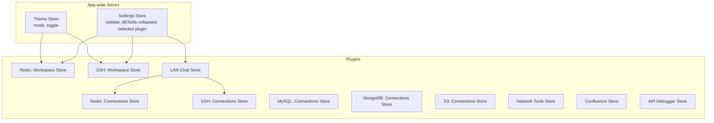
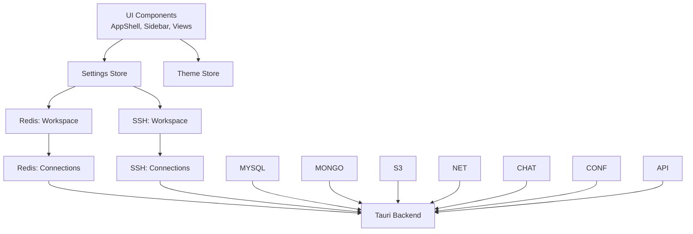
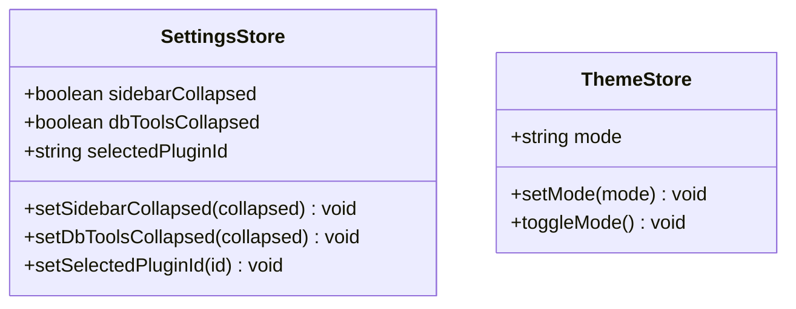
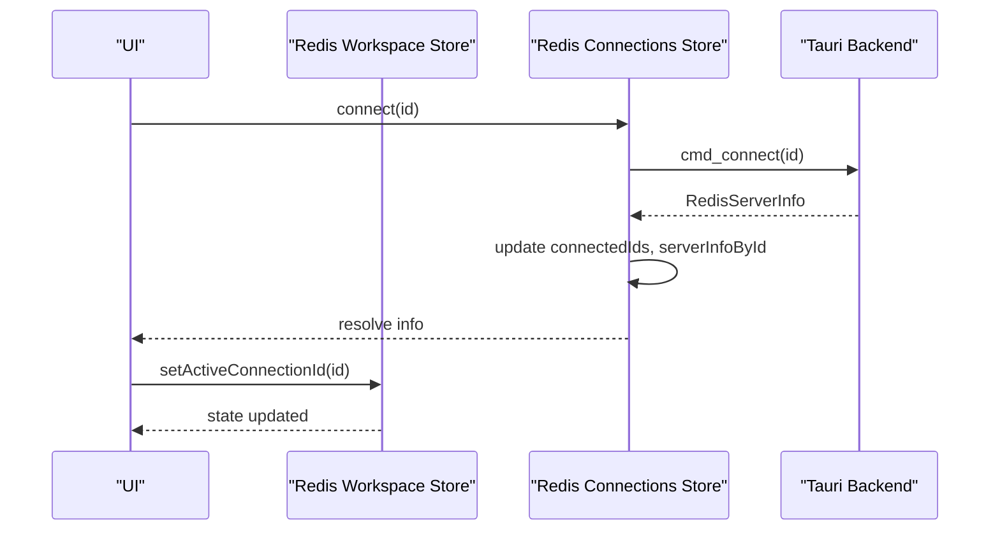
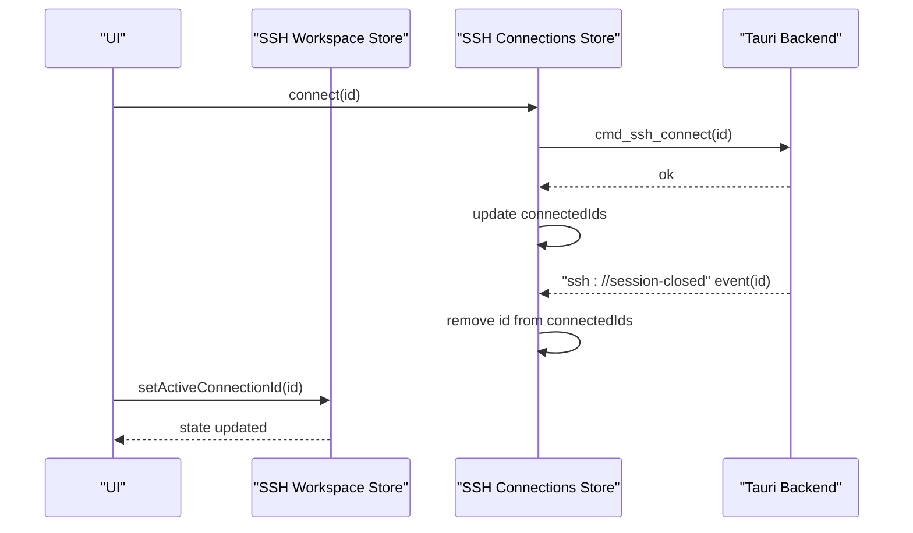
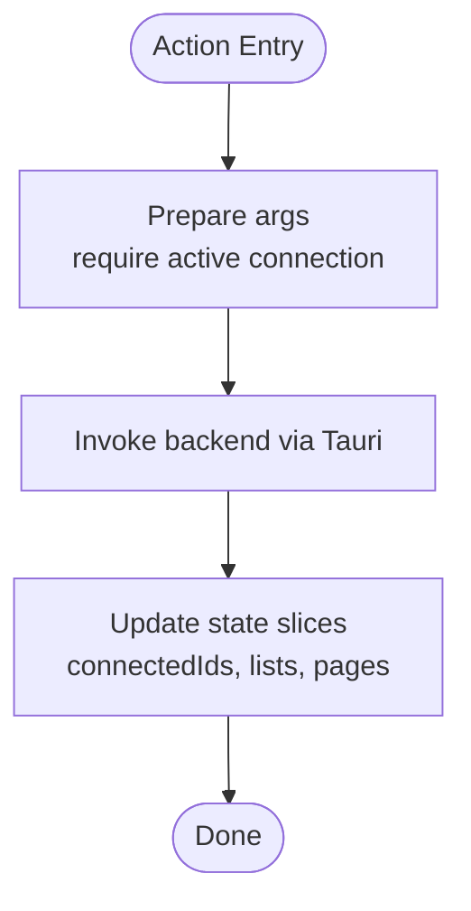
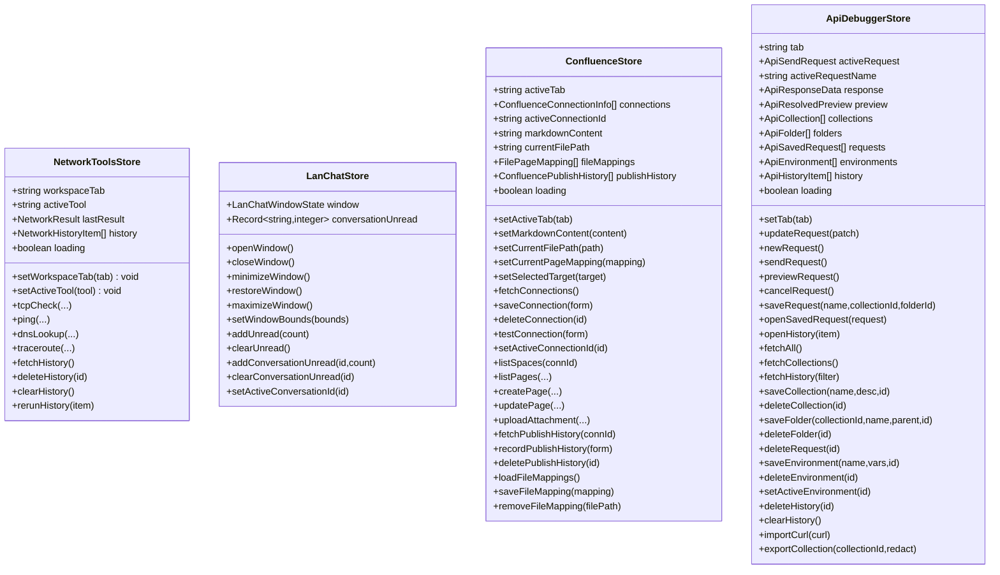
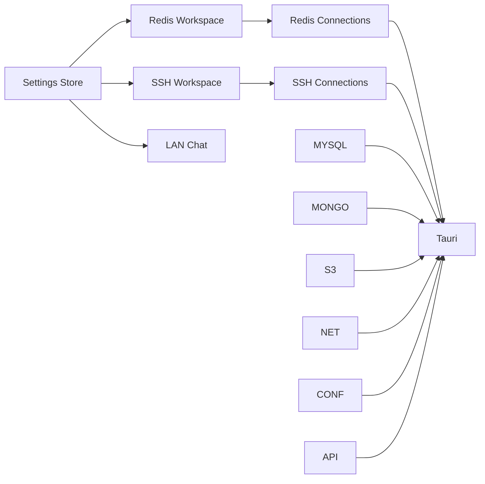

# State Management

<cite>
**Referenced Files in This Document**
- [settings.ts](file://src/app/store/settings.ts)
- [theme.ts](file://src/app/store/theme.ts)
- [workspace.ts](file://src/plugins/redis-manager/store/workspace.ts)
- [connections.ts](file://src/plugins/redis-manager/store/connections.ts)
- [ssh-connections.ts](file://src/plugins/ssh-client/store/ssh-connections.ts)
- [workspace.ts](file://src/plugins/ssh-client/store/workspace.ts)
- [mysql-connections.ts](file://src/plugins/mysql-client/store/mysql-connections.ts)
- [mongodb-connections.ts](file://src/plugins/mongodb-client/store/mongodb-connections.ts)
- [s3-connections.ts](file://src/plugins/s3-client/store/s3-connections.ts)
- [network-tools.ts](file://src/plugins/network-tools/store/network-tools.ts)
- [lan-chat.ts](file://src/plugins/lan-chat/store/lan-chat.ts)
- [confluence.ts](file://src/plugins/confluence/store/confluence.ts)
- [api-debugger.ts](file://src/plugins/api-debugger/store/api-debugger.ts)
- [App.tsx](file://src/App.tsx)
</cite>

## Table of Contents
1. [Introduction](#introduction)
2. [Project Structure](#project-structure)
3. [Core Components](#core-components)
4. [Architecture Overview](#architecture-overview)
5. [Detailed Component Analysis](#detailed-component-analysis)
6. [Dependency Analysis](#dependency-analysis)
7. [Performance Considerations](#performance-considerations)
8. [Troubleshooting Guide](#troubleshooting-guide)
9. [Conclusion](#conclusion)
10. [Appendices](#appendices)

## Introduction
This document explains RDMM’s state management architecture built on Zustand. It covers the store pattern, global state coordination, and plugin-specific state management. You will learn the store structure, actions, selectors, middleware integration, and how application-wide stores (settings, theme) coordinate with plugin-specific stores (connections, workspaces). Practical examples include state subscriptions, persistence, cross-plugin state sharing, hydration, error handling, and performance optimization. Guidelines are provided for creating new stores, managing side effects, and maintaining consistency across the application.

## Project Structure
RDMM organizes state into two primary categories:
- Application-wide stores: located under src/app/store, responsible for global UI and theme preferences.
- Plugin-specific stores: located under src/plugins/<plugin>/store, encapsulating domain logic per plugin.

Global stores:
- Settings store: manages UI layout and selection state.
- Theme store: manages light/dark mode and toggling.

Plugin stores:
- Redis Manager: workspace and connections stores.
- SSH Client: workspace and connections stores.
- MySQL Client: comprehensive connections and workspace store.
- MongoDB Client: comprehensive connections and workspace store.
- S3 Client: comprehensive connections and workspace store.
- Network Tools: diagnostics and history store.
- LAN Chat: window state and unread counters with persistence.
- Confluence: editor and publishing store with local storage for mappings.
- API Debugger: request/response, collections, environments, and history store.

**Diagram sources**
- [settings.ts:1-28](file://src/app/store/settings.ts#L1-L28)
- [theme.ts:1-27](file://src/app/store/theme.ts#L1-L27)
- [workspace.ts:1-26](file://src/plugins/redis-manager/store/workspace.ts#L1-L26)
- [connections.ts:1-91](file://src/plugins/redis-manager/store/connections.ts#L1-L91)
- [workspace.ts:1-22](file://src/plugins/ssh-client/store/workspace.ts#L1-L22)
- [ssh-connections.ts:1-77](file://src/plugins/ssh-client/store/ssh-connections.ts#L1-L77)
- [mysql-connections.ts:1-153](file://src/plugins/mysql-client/store/mysql-connections.ts#L1-L153)
- [mongodb-connections.ts:1-296](file://src/plugins/mongodb-client/store/mongodb-connections.ts#L1-L296)
- [s3-connections.ts:1-432](file://src/plugins/s3-client/store/s3-connections.ts#L1-L432)
- [network-tools.ts:1-97](file://src/plugins/network-tools/store/network-tools.ts#L1-L97)
- [lan-chat.ts:1-202](file://src/plugins/lan-chat/store/lan-chat.ts#L1-L202)
- [confluence.ts:1-146](file://src/plugins/confluence/store/confluence.ts#L1-L146)
- [api-debugger.ts:1-129](file://src/plugins/api-debugger/store/api-debugger.ts#L1-L129)

**Section sources**
- [settings.ts:1-28](file://src/app/store/settings.ts#L1-L28)
- [theme.ts:1-27](file://src/app/store/theme.ts#L1-L27)
- [workspace.ts:1-26](file://src/plugins/redis-manager/store/workspace.ts#L1-L26)
- [connections.ts:1-91](file://src/plugins/redis-manager/store/connections.ts#L1-L91)
- [workspace.ts:1-22](file://src/plugins/ssh-client/store/workspace.ts#L1-L22)
- [ssh-connections.ts:1-77](file://src/plugins/ssh-client/store/ssh-connections.ts#L1-L77)
- [mysql-connections.ts:1-153](file://src/plugins/mysql-client/store/mysql-connections.ts#L1-L153)
- [mongodb-connections.ts:1-296](file://src/plugins/mongodb-client/store/mongodb-connections.ts#L1-L296)
- [s3-connections.ts:1-432](file://src/plugins/s3-client/store/s3-connections.ts#L1-L432)
- [network-tools.ts:1-97](file://src/plugins/network-tools/store/network-tools.ts#L1-L97)
- [lan-chat.ts:1-202](file://src/plugins/lan-chat/store/lan-chat.ts#L1-L202)
- [confluence.ts:1-146](file://src/plugins/confluence/store/confluence.ts#L1-L146)
- [api-debugger.ts:1-129](file://src/plugins/api-debugger/store/api-debugger.ts#L1-L129)
- [App.tsx:1-11](file://src/App.tsx#L1-L11)

## Core Components
- Global stores
  - Settings store: exposes setters for sidebar and database tools collapse state, and selected plugin ID. Persisted to local storage.
  - Theme store: exposes setters for theme mode and a toggle method. Persisted to local storage.
- Plugin stores
  - Workspace stores: track active view/connection and selection state for a given plugin.
  - Connections stores: manage lists of connections, connectivity state, and orchestrate backend invocations via Tauri.

Key patterns:
- Each store is a Zustand “slice” with actions that mutate state.
- Many plugin stores integrate with Tauri via invoke for async operations.
- Persistence is applied selectively using Zustand’s persist middleware.

**Section sources**
- [settings.ts:1-28](file://src/app/store/settings.ts#L1-L28)
- [theme.ts:1-27](file://src/app/store/theme.ts#L1-L27)
- [workspace.ts:1-26](file://src/plugins/redis-manager/store/workspace.ts#L1-L26)
- [connections.ts:1-91](file://src/plugins/redis-manager/store/connections.ts#L1-L91)
- [workspace.ts:1-22](file://src/plugins/ssh-client/store/workspace.ts#L1-L22)
- [ssh-connections.ts:1-77](file://src/plugins/ssh-client/store/ssh-connections.ts#L1-L77)
- [mysql-connections.ts:1-153](file://src/plugins/mysql-client/store/mysql-connections.ts#L1-L153)
- [mongodb-connections.ts:1-296](file://src/plugins/mongodb-client/store/mongodb-connections.ts#L1-L296)
- [s3-connections.ts:1-432](file://src/plugins/s3-client/store/s3-connections.ts#L1-L432)
- [network-tools.ts:1-97](file://src/plugins/network-tools/store/network-tools.ts#L1-L97)
- [lan-chat.ts:1-202](file://src/plugins/lan-chat/store/lan-chat.ts#L1-L202)
- [confluence.ts:1-146](file://src/plugins/confluence/store/confluence.ts#L1-L146)
- [api-debugger.ts:1-129](file://src/plugins/api-debugger/store/api-debugger.ts#L1-L129)

## Architecture Overview
Zustand enables a flat, composable state model:
- Global stores (settings, theme) are consumed by UI components and plugin routers.
- Plugin stores are isolated per plugin but can coordinate via shared state keys or events.
- Middleware (persist) persists selected slices to local storage.
- Side effects are centralized inside store actions using Tauri invoke.

**Diagram sources**
- [settings.ts:1-28](file://src/app/store/settings.ts#L1-L28)
- [theme.ts:1-27](file://src/app/store/theme.ts#L1-L27)
- [workspace.ts:1-26](file://src/plugins/redis-manager/store/workspace.ts#L1-L26)
- [connections.ts:1-91](file://src/plugins/redis-manager/store/connections.ts#L1-L91)
- [workspace.ts:1-22](file://src/plugins/ssh-client/store/workspace.ts#L1-L22)
- [ssh-connections.ts:1-77](file://src/plugins/ssh-client/store/ssh-connections.ts#L1-L77)
- [mysql-connections.ts:1-153](file://src/plugins/mysql-client/store/mysql-connections.ts#L1-L153)
- [mongodb-connections.ts:1-296](file://src/plugins/mongodb-client/store/mongodb-connections.ts#L1-L296)
- [s3-connections.ts:1-432](file://src/plugins/s3-client/store/s3-connections.ts#L1-L432)
- [network-tools.ts:1-97](file://src/plugins/network-tools/store/network-tools.ts#L1-L97)
- [lan-chat.ts:1-202](file://src/plugins/lan-chat/store/lan-chat.ts#L1-L202)
- [confluence.ts:1-146](file://src/plugins/confluence/store/confluence.ts#L1-L146)
- [api-debugger.ts:1-129](file://src/plugins/api-debugger/store/api-debugger.ts#L1-L129)

## Detailed Component Analysis

### Global Stores: Settings and Theme
- Purpose
  - Settings: centralize UI layout and plugin selection state.
  - Theme: centralize theme mode and toggle.
- Structure
  - Both use create with optional persist middleware to serialize to local storage.
- Actions
  - Settings: setters for sidebar/dbTools collapse and selected plugin ID.
  - Theme: setters for mode and toggle based on current value.
- Hydration and persistence
  - Persisted under dedicated storage keys; hydrated on store creation.

**Diagram sources**
- [settings.ts:1-28](file://src/app/store/settings.ts#L1-L28)
- [theme.ts:1-27](file://src/app/store/theme.ts#L1-L27)

**Section sources**
- [settings.ts:1-28](file://src/app/store/settings.ts#L1-L28)
- [theme.ts:1-27](file://src/app/store/theme.ts#L1-L27)

### Plugin Stores: Redis Manager
- Workspace store
  - Tracks active connection, DB index, selected key, and active view.
  - No persistence; lightweight UI state.
- Connections store
  - Manages connection list, connected IDs, server info, latency, and loading state.
  - Integrates with backend via invoke for CRUD and connectivity operations.
  - Uses set and functional updates to keep state consistent after async calls.

**Diagram sources**
- [connections.ts:1-91](file://src/plugins/redis-manager/store/connections.ts#L1-L91)
- [workspace.ts:1-26](file://src/plugins/redis-manager/store/workspace.ts#L1-L26)

**Section sources**
- [workspace.ts:1-26](file://src/plugins/redis-manager/store/workspace.ts#L1-L26)
- [connections.ts:1-91](file://src/plugins/redis-manager/store/connections.ts#L1-L91)

### Plugin Stores: SSH Client
- Workspace store
  - Tracks active view and active connection ID for SSH.
- Connections store
  - Manages SSH connections, connected IDs, and loading.
  - Subscribes to a Tauri event to automatically reflect disconnections.

**Diagram sources**
- [ssh-connections.ts:1-77](file://src/plugins/ssh-client/store/ssh-connections.ts#L1-L77)
- [workspace.ts:1-22](file://src/plugins/ssh-client/store/workspace.ts#L1-L22)

**Section sources**
- [workspace.ts:1-22](file://src/plugins/ssh-client/store/workspace.ts#L1-L22)
- [ssh-connections.ts:1-77](file://src/plugins/ssh-client/store/ssh-connections.ts#L1-L77)

### Plugin Stores: MySQL, MongoDB, S3 Clients
- Shared characteristics
  - Comprehensive state for connections, active namespace, lists, and paginated data.
  - Actions orchestrate backend calls and update state consistently.
  - Some stores expose helpers to enforce preconditions (e.g., require active connection).
- Patterns
  - Functional set updates to avoid stale closures.
  - Parallel fetching for related data.
  - Clear separation between workspace tabs and data state.

**Diagram sources**
- [mysql-connections.ts:1-153](file://src/plugins/mysql-client/store/mysql-connections.ts#L1-L153)
- [mongodb-connections.ts:1-296](file://src/plugins/mongodb-client/store/mongodb-connections.ts#L1-L296)
- [s3-connections.ts:1-432](file://src/plugins/s3-client/store/s3-connections.ts#L1-L432)

**Section sources**
- [mysql-connections.ts:1-153](file://src/plugins/mysql-client/store/mysql-connections.ts#L1-L153)
- [mongodb-connections.ts:1-296](file://src/plugins/mongodb-client/store/mongodb-connections.ts#L1-L296)
- [s3-connections.ts:1-432](file://src/plugins/s3-client/store/s3-connections.ts#L1-L432)

### Plugin Stores: Network Tools, LAN Chat, Confluence, API Debugger
- Network Tools
  - Manages active tool, last result, history, and loading.
  - Actions trigger backend tools and refresh history.
- LAN Chat
  - Window state and unread counters with persistence.
  - Helpers compute unread counts based on visibility.
- Confluence
  - Manages editor content, mappings, publish history, and connection list.
  - Uses localStorage for file-to-page mappings.
- API Debugger
  - Manages collections, environments, saved requests, history, and active request.
  - Integrates with backend for sending, previewing, importing, exporting.

**Diagram sources**
- [network-tools.ts:1-97](file://src/plugins/network-tools/store/network-tools.ts#L1-L97)
- [lan-chat.ts:1-202](file://src/plugins/lan-chat/store/lan-chat.ts#L1-L202)
- [confluence.ts:1-146](file://src/plugins/confluence/store/confluence.ts#L1-L146)
- [api-debugger.ts:1-129](file://src/plugins/api-debugger/store/api-debugger.ts#L1-L129)

**Section sources**
- [network-tools.ts:1-97](file://src/plugins/network-tools/store/network-tools.ts#L1-L97)
- [lan-chat.ts:1-202](file://src/plugins/lan-chat/store/lan-chat.ts#L1-L202)
- [confluence.ts:1-146](file://src/plugins/confluence/store/confluence.ts#L1-L146)
- [api-debugger.ts:1-129](file://src/plugins/api-debugger/store/api-debugger.ts#L1-L129)

## Dependency Analysis
- Internal dependencies
  - Plugin workspace stores depend on settings store for selected plugin and UI collapse state.
  - LAN Chat store coordinates with settings to share selected plugin ID snapshot for persistence.
- External dependencies
  - Tauri invoke for backend operations across plugin stores.
  - Local storage for Confluence file mappings and Zustand persist for window state.

**Diagram sources**
- [settings.ts:1-28](file://src/app/store/settings.ts#L1-L28)
- [workspace.ts:1-26](file://src/plugins/redis-manager/store/workspace.ts#L1-L26)
- [workspace.ts:1-22](file://src/plugins/ssh-client/store/workspace.ts#L1-L22)
- [lan-chat.ts:1-202](file://src/plugins/lan-chat/store/lan-chat.ts#L1-L202)
- [connections.ts:1-91](file://src/plugins/redis-manager/store/connections.ts#L1-L91)
- [ssh-connections.ts:1-77](file://src/plugins/ssh-client/store/ssh-connections.ts#L1-L77)
- [mysql-connections.ts:1-153](file://src/plugins/mysql-client/store/mysql-connections.ts#L1-L153)
- [mongodb-connections.ts:1-296](file://src/plugins/mongodb-client/store/mongodb-connections.ts#L1-L296)
- [s3-connections.ts:1-432](file://src/plugins/s3-client/store/s3-connections.ts#L1-L432)
- [network-tools.ts:1-97](file://src/plugins/network-tools/store/network-tools.ts#L1-L97)
- [confluence.ts:1-146](file://src/plugins/confluence/store/confluence.ts#L1-L146)
- [api-debugger.ts:1-129](file://src/plugins/api-debugger/store/api-debugger.ts#L1-L129)

**Section sources**
- [settings.ts:1-28](file://src/app/store/settings.ts#L1-L28)
- [workspace.ts:1-26](file://src/plugins/redis-manager/store/workspace.ts#L1-L26)
- [workspace.ts:1-22](file://src/plugins/ssh-client/store/workspace.ts#L1-L22)
- [lan-chat.ts:1-202](file://src/plugins/lan-chat/store/lan-chat.ts#L1-L202)
- [connections.ts:1-91](file://src/plugins/redis-manager/store/connections.ts#L1-L91)
- [ssh-connections.ts:1-77](file://src/plugins/ssh-client/store/ssh-connections.ts#L1-L77)
- [mysql-connections.ts:1-153](file://src/plugins/mysql-client/store/mysql-connections.ts#L1-L153)
- [mongodb-connections.ts:1-296](file://src/plugins/mongodb-client/store/mongodb-connections.ts#L1-L296)
- [s3-connections.ts:1-432](file://src/plugins/s3-client/store/s3-connections.ts#L1-L432)
- [network-tools.ts:1-97](file://src/plugins/network-tools/store/network-tools.ts#L1-L97)
- [confluence.ts:1-146](file://src/plugins/confluence/store/confluence.ts#L1-L146)
- [api-debugger.ts:1-129](file://src/plugins/api-debugger/store/api-debugger.ts#L1-L129)

## Performance Considerations
- Minimize re-renders
  - Keep UI state granular; avoid monolithic slices.
  - Use shallow equality checks; avoid unnecessary object churn in actions.
- Batch updates
  - Use functional set updates to prevent stale closures and reduce redundant renders.
- Debounce or throttle
  - For frequent UI interactions (e.g., filters), debounce backend calls.
- Parallelize
  - Use Promise.all for independent data loads within a single action.
- Persist selectively
  - Persist only necessary slices to reduce storage overhead and improve hydration speed.
- Loading flags
  - Use boolean flags around async operations to avoid UI thrashing.

[No sources needed since this section provides general guidance]

## Troubleshooting Guide
- State not hydrating
  - Verify persist storage keys and middleware configuration for each store.
  - Confirm that persisted keys match the intended state shape.
- Stale state after async operation
  - Ensure actions update state using functional set or explicit post-invoke updates.
- Event-driven updates not reflected
  - Confirm event listeners are registered once and cleaned up appropriately.
- Cross-plugin state sharing
  - Share minimal state via settings store or introduce a small coordinator store if needed.
- Error handling
  - Wrap async actions in try/finally or try/catch to reset loading flags.
  - Surface errors via UI notifications or error boundaries.

**Section sources**
- [ssh-connections.ts:23-38](file://src/plugins/ssh-client/store/ssh-connections.ts#L23-L38)
- [mysql-connections.ts:109-113](file://src/plugins/mysql-client/store/mysql-connections.ts#L109-L113)
- [mongodb-connections.ts:147-161](file://src/plugins/mongodb-client/store/mongodb-connections.ts#L147-L161)
- [s3-connections.ts:178-196](file://src/plugins/s3-client/store/s3-connections.ts#L178-L196)
- [network-tools.ts:42-50](file://src/plugins/network-tools/store/network-tools.ts#L42-L50)
- [lan-chat.ts:89-202](file://src/plugins/lan-chat/store/lan-chat.ts#L89-L202)

## Conclusion
RDMM’s Zustand-based state management cleanly separates global and plugin-specific concerns while enabling robust side effects and persistence. By following the patterns demonstrated here—functional updates, selective persistence, event-driven synchronization, and careful error handling—you can extend the system reliably. Use the guidelines below to maintain consistency and performance as new plugins and features are introduced.

[No sources needed since this section summarizes without analyzing specific files]

## Appendices

### Practical Examples

- Subscriptions
  - Subscribe to settings store to react to selected plugin changes and adjust workspace accordingly.
  - Subscribe to LAN Chat store to update unread badges in the sidebar.
- Persistence
  - Persist only necessary slices (e.g., LAN Chat window bounds and unread counters).
  - Use partialize to serialize only relevant parts of the state.
- Cross-plugin state sharing
  - Share minimal state via settings store (e.g., selected plugin ID).
  - For richer coordination, introduce a small coordinator store scoped to the affected plugins.
- Hydration
  - Ensure persist middleware is configured with correct storage keys and partialization.
  - Validate that initializers (e.g., createInitialLanChatState) merge defaults with stored snapshots.
- Error handling
  - Reset loading flags in finally blocks.
  - Normalize error messages and surface them to users.
- Performance
  - Prefer functional set updates and shallow state shapes.
  - Parallelize independent data loads within actions.

[No sources needed since this section provides general guidance]