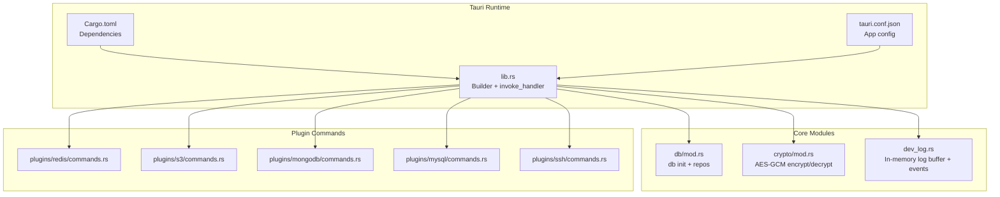
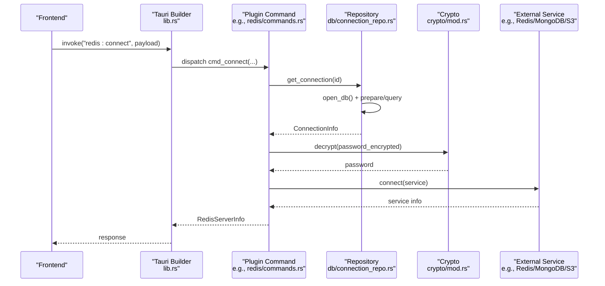
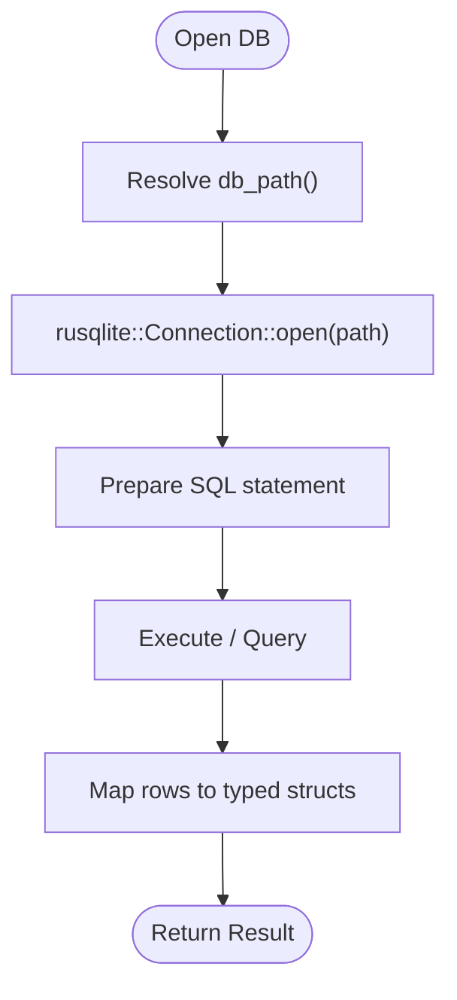
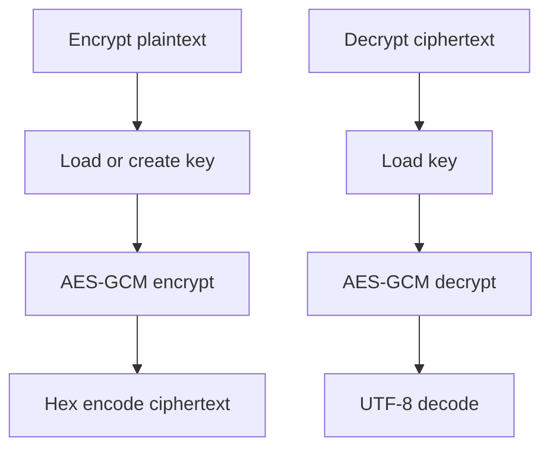
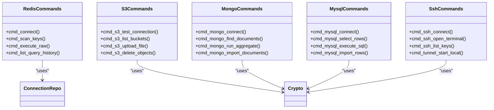
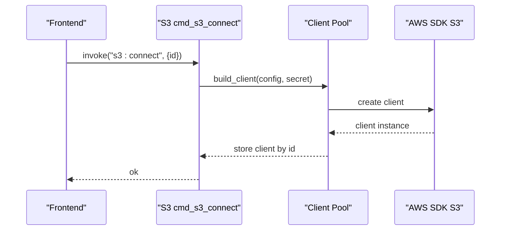
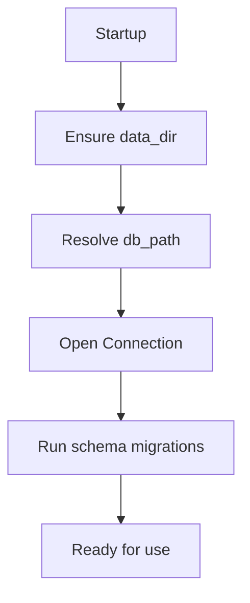
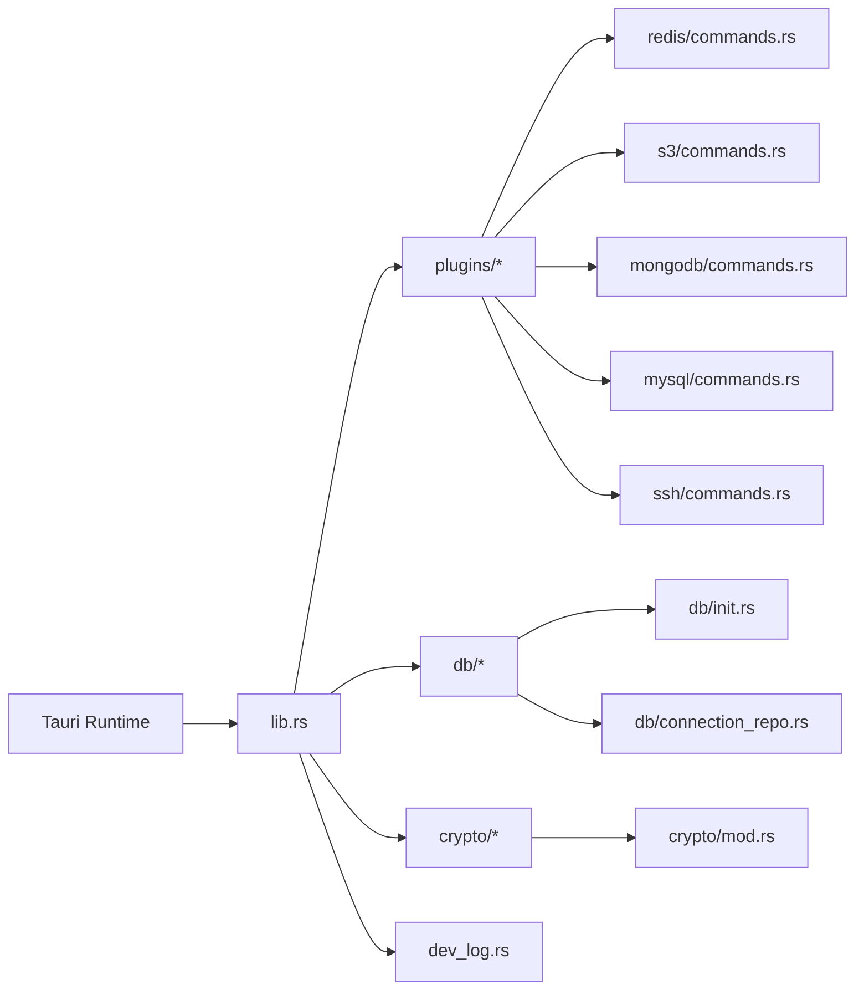

# Backend Integration

<cite>
**Referenced Files in This Document**
- [Cargo.toml](file://src-tauri/Cargo.toml)
- [main.rs](file://src-tauri/src/main.rs)
- [lib.rs](file://src-tauri/src/lib.rs)
- [tauri.conf.json](file://src-tauri/tauri.conf.json)
- [db/mod.rs](file://src-tauri/src/db/mod.rs)
- [db/init.rs](file://src-tauri/src/db/init.rs)
- [db/connection_repo.rs](file://src-tauri/src/db/connection_repo.rs)
- [crypto/mod.rs](file://src-tauri/src/crypto/mod.rs)
- [plugins/mod.rs](file://src-tauri/src/plugins/mod.rs)
- [plugins/redis/commands.rs](file://src-tauri/src/plugins/redis/commands.rs)
- [plugins/ssh/commands.rs](file://src-tauri/src/plugins/ssh/commands.rs)
- [plugins/s3/commands.rs](file://src-tauri/src/plugins/s3/commands.rs)
- [plugins/mongodb/commands.rs](file://src-tauri/src/plugins/mongodb/commands.rs)
- [plugins/mysql/commands.rs](file://src-tauri/src/plugins/mysql/commands.rs)
- [dev_log.rs](file://src-tauri/src/dev_log.rs)
</cite>

## Table of Contents
1. [Introduction](#introduction)
2. [Project Structure](#project-structure)
3. [Core Components](#core-components)
4. [Architecture Overview](#architecture-overview)
5. [Detailed Component Analysis](#detailed-component-analysis)
6. [Dependency Analysis](#dependency-analysis)
7. [Performance Considerations](#performance-considerations)
8. [Troubleshooting Guide](#troubleshooting-guide)
9. [Conclusion](#conclusion)

## Introduction
This document explains RDMM’s backend integration built on Tauri and Rust. It focuses on:
- The Tauri command system for frontend-backend communication
- The database repository pattern for data access
- Encryption and security implementations
- Plugin command system, async operation handling, and resource management
- SQLite integration, credential storage, and cross-platform desktop capabilities
- Practical examples for implementing custom commands, managing database connections, and handling security-sensitive operations
- Performance considerations, error handling strategies, and debugging techniques

## Project Structure
The backend is organized around a Tauri Builder that registers plugins, initializes the database, and exposes a large set of commands grouped by domain (Redis, SSH, S3, MongoDB, MySQL, Network, API Debugger, LAN Chat, Confluence). Commands are declared centrally and routed to plugin-specific modules.

**Diagram sources**
- [lib.rs:10-262](file://src-tauri/src/lib.rs#L10-L262)
- [Cargo.toml:20-49](file://src-tauri/Cargo.toml#L20-L49)
- [tauri.conf.json:1-39](file://src-tauri/tauri.conf.json#L1-L39)
- [db/mod.rs:1-8](file://src-tauri/src/db/mod.rs#L1-L8)
- [crypto/mod.rs:1-75](file://src-tauri/src/crypto/mod.rs#L1-L75)
- [dev_log.rs:1-69](file://src-tauri/src/dev_log.rs#L1-L69)
- [plugins/redis/commands.rs:1-800](file://src-tauri/src/plugins/redis/commands.rs#L1-L800)
- [plugins/s3/commands.rs:1-800](file://src-tauri/src/plugins/s3/commands.rs#L1-L800)
- [plugins/mongodb/commands.rs:1-788](file://src-tauri/src/plugins/mongodb/commands.rs#L1-L788)
- [plugins/mysql/commands.rs:1-615](file://src-tauri/src/plugins/mysql/commands.rs#L1-L615)
- [plugins/ssh/commands.rs:1-266](file://src-tauri/src/plugins/ssh/commands.rs#L1-L266)

**Section sources**
- [lib.rs:10-262](file://src-tauri/src/lib.rs#L10-L262)
- [Cargo.toml:20-49](file://src-tauri/Cargo.toml#L20-L49)
- [tauri.conf.json:1-39](file://src-tauri/tauri.conf.json#L1-L39)

## Core Components
- Tauri Builder and invoke handler: Central registration of all plugin commands and app lifecycle initialization.
- Database initialization and schema: SQLite bootstrap with migrations and schema evolution.
- Repository pattern: Typed CRUD helpers for connection and history data.
- Encryption: AES-GCM with a per-app key stored securely on disk.
- Logging: In-memory ring buffer with event emission to frontend.
- Plugins: Domain-specific command modules for Redis, SSH, S3, MongoDB, MySQL, and others.

**Section sources**
- [lib.rs:10-262](file://src-tauri/src/lib.rs#L10-L262)
- [db/init.rs:28-392](file://src-tauri/src/db/init.rs#L28-L392)
- [db/connection_repo.rs:29-174](file://src-tauri/src/db/connection_repo.rs#L29-L174)
- [crypto/mod.rs:21-75](file://src-tauri/src/crypto/mod.rs#L21-L75)
- [dev_log.rs:29-69](file://src-tauri/src/dev_log.rs#L29-L69)

## Architecture Overview
The backend uses Tauri’s command invocation to route frontend requests to Rust handlers. Handlers typically:
- Open a database connection via the repository pattern
- Optionally encrypt/decrypt secrets using the crypto module
- Interact with external services (Redis, MongoDB, MySQL, AWS S3)
- Persist results or history to SQLite
- Return structured JSON responses

**Diagram sources**
- [lib.rs:26-259](file://src-tauri/src/lib.rs#L26-L259)
- [plugins/redis/commands.rs:174-194](file://src-tauri/src/plugins/redis/commands.rs#L174-L194)
- [db/connection_repo.rs:65-94](file://src-tauri/src/db/connection_repo.rs#L65-L94)
- [crypto/mod.rs:57-74](file://src-tauri/src/crypto/mod.rs#L57-L74)

## Detailed Component Analysis

### Tauri Command System
- Centralized registration: All plugin commands are registered in the Tauri Builder’s invoke handler.
- Command attributes: Each command is annotated with #[tauri::command] and returns Result<T, String>.
- Async commands: Some commands (e.g., S3, MongoDB, MySQL) are async and manage external clients/pools.

Practical examples:
- Implement a new Redis command: Add a #[tauri::command] function in the Redis commands module and register it in lib.rs.
- Implement a new S3 command: Add a #[tauri::command] function in the S3 commands module and register it in lib.rs.

**Section sources**
- [lib.rs:26-259](file://src-tauri/src/lib.rs#L26-L259)
- [plugins/redis/commands.rs:139-172](file://src-tauri/src/plugins/redis/commands.rs#L139-L172)
- [plugins/s3/commands.rs:35-91](file://src-tauri/src/plugins/s3/commands.rs#L35-L91)

### Database Repository Pattern
- Connection management: Each repo opens a SQLite connection via db_path and executes prepared statements.
- Typed models: Structs like ConnectionInfo and ConnectionForm encapsulate persisted data.
- Credential handling: Passwords and secrets are stored encrypted and decrypted on demand.

**Diagram sources**
- [db/connection_repo.rs:29-63](file://src-tauri/src/db/connection_repo.rs#L29-L63)

**Section sources**
- [db/connection_repo.rs:29-174](file://src-tauri/src/db/connection_repo.rs#L29-L174)
- [db/init.rs:28-392](file://src-tauri/src/db/init.rs#L28-L392)

### Encryption and Security
- AES-GCM with fixed nonce: Used for encrypting sensitive fields (passwords, secrets).
- Key management: A 32-byte key is generated and stored as hex in the app data directory; migration supported from legacy filename.
- Secret lifecycle: Secrets are encrypted before storage and decrypted when needed for external connections.

**Diagram sources**
- [crypto/mod.rs:40-74](file://src-tauri/src/crypto/mod.rs#L40-L74)

**Section sources**
- [crypto/mod.rs:21-75](file://src-tauri/src/crypto/mod.rs#L21-L75)

### Plugin Command System
- Redis: Rich set of commands for connection management, key operations, scanning, and history persistence.
- SSH: Connection lifecycle, terminal I/O, key management, and port forwarding rules.
- S3: Client pools, bucket/object operations, uploads/downloads, and presigned URLs.
- MongoDB: Client pools, CRUD, aggregation, indexing, import/export, and history.
- MySQL: Client pools, CRUD, schema introspection, import/export, and history.

**Diagram sources**
- [plugins/redis/commands.rs:139-251](file://src-tauri/src/plugins/redis/commands.rs#L139-L251)
- [plugins/s3/commands.rs:35-91](file://src-tauri/src/plugins/s3/commands.rs#L35-L91)
- [plugins/mongodb/commands.rs:156-212](file://src-tauri/src/plugins/mongodb/commands.rs#L156-L212)
- [plugins/mysql/commands.rs:201-245](file://src-tauri/src/plugins/mysql/commands.rs#L201-L245)
- [plugins/ssh/commands.rs:64-106](file://src-tauri/src/plugins/ssh/commands.rs#L64-L106)

**Section sources**
- [plugins/redis/commands.rs:139-251](file://src-tauri/src/plugins/redis/commands.rs#L139-L251)
- [plugins/s3/commands.rs:210-315](file://src-tauri/src/plugins/s3/commands.rs#L210-L315)
- [plugins/mongodb/commands.rs:156-212](file://src-tauri/src/plugins/mongodb/commands.rs#L156-L212)
- [plugins/mysql/commands.rs:201-245](file://src-tauri/src/plugins/mysql/commands.rs#L201-L245)
- [plugins/ssh/commands.rs:64-106](file://src-tauri/src/plugins/ssh/commands.rs#L64-L106)

### Async Operation Handling and Resource Management
- Async commands: S3, MongoDB, and MySQL commands are async and rely on client pools or connection pools.
- Pool management: Plugins maintain client or connection pools keyed by connection ID to avoid repeated handshakes.
- Lifecycle: Connect/disconnect commands open/close pools and persist minimal state.

**Diagram sources**
- [plugins/s3/commands.rs:93-106](file://src-tauri/src/plugins/s3/commands.rs#L93-L106)

**Section sources**
- [plugins/s3/commands.rs:93-106](file://src-tauri/src/plugins/s3/commands.rs#L93-L106)
- [plugins/mongodb/commands.rs:156-169](file://src-tauri/src/plugins/mongodb/commands.rs#L156-L169)
- [plugins/mysql/commands.rs:201-214](file://src-tauri/src/plugins/mysql/commands.rs#L201-L214)

### SQLite Integration and Credential Storage
- Initialization: On startup, the app ensures the data directory exists, resolves the database path, and runs schema creation/migration scripts.
- Schema: Includes tables for connections, query history, SSH keys, port forwarding rules, and plugin-specific entities.
- Credential storage: Sensitive fields are encrypted before insertion and decrypted on retrieval.

**Diagram sources**
- [db/init.rs:28-392](file://src-tauri/src/db/init.rs#L28-L392)

**Section sources**
- [db/init.rs:28-392](file://src-tauri/src/db/init.rs#L28-L392)
- [db/connection_repo.rs:96-155](file://src-tauri/src/db/connection_repo.rs#L96-L155)

### Cross-Platform Desktop Capabilities
- Tauri configuration defines product metadata, bundling targets, window properties, and security policies.
- Platform-specific behavior: macOS decorations are toggled during setup.

**Section sources**
- [tauri.conf.json:1-39](file://src-tauri/tauri.conf.json#L1-L39)
- [lib.rs:15-24](file://src-tauri/src/lib.rs#L15-L24)

### Practical Examples

- Implement a custom Redis command:
  - Add a #[tauri::command] function in the Redis commands module.
  - Use get_conn_info and get_password to fetch connection and decrypted credentials.
  - Use write_history to persist command executions.
  - Register the command in lib.rs invoke_handler.

  Example reference paths:
  - [plugins/redis/commands.rs:139-172](file://src-tauri/src/plugins/redis/commands.rs#L139-L172)
  - [plugins/redis/commands.rs:92-111](file://src-tauri/src/plugins/redis/commands.rs#L92-L111)

- Manage database connections:
  - Use connection_repo::save_connection to persist a new connection (encrypted passwords handled internally).
  - Use connection_repo::list_connections and get_connection to enumerate and fetch details.
  - Use connection_repo::delete_connection to remove persisted records.

  Example reference paths:
  - [db/connection_repo.rs:96-138](file://src-tauri/src/db/connection_repo.rs#L96-L138)

- Handle security-sensitive operations:
  - Encrypt secrets before storing using crypto::encrypt.
  - Decrypt secrets on demand using crypto::decrypt.
  - Avoid logging sensitive data; use dev_log only for non-sensitive diagnostics.

  Example reference paths:
  - [crypto/mod.rs:40-74](file://src-tauri/src/crypto/mod.rs#L40-L74)
  - [dev_log.rs:29-69](file://src-tauri/src/dev_log.rs#L29-L69)

## Dependency Analysis
The backend relies on Tauri and a set of ecosystem crates for database, encryption, networking, and cloud integrations. The dependency graph highlights core modules and their relationships.

**Diagram sources**
- [lib.rs:10-262](file://src-tauri/src/lib.rs#L10-L262)
- [plugins/mod.rs:1-11](file://src-tauri/src/plugins/mod.rs#L1-L11)
- [db/mod.rs:1-8](file://src-tauri/src/db/mod.rs#L1-L8)
- [crypto/mod.rs:1-75](file://src-tauri/src/crypto/mod.rs#L1-L75)
- [dev_log.rs:1-69](file://src-tauri/src/dev_log.rs#L1-L69)

**Section sources**
- [Cargo.toml:20-49](file://src-tauri/Cargo.toml#L20-L49)
- [lib.rs:10-262](file://src-tauri/src/lib.rs#L10-L262)

## Performance Considerations
- Prefer connection pooling for external services (S3, MongoDB, MySQL) to reduce latency and resource usage.
- Limit query result sizes and pagination where appropriate (e.g., MySQL select_rows).
- Avoid unnecessary decryption/encryption loops; cache decrypted secrets per session when safe.
- Use targeted queries and indexes to minimize SQLite overhead.
- Batch operations for S3 uploads/downloads and MongoDB/MySQL imports to reduce round trips.

## Troubleshooting Guide
- Command registration issues: Verify the command is included in the invoke_handler list in lib.rs.
- Database initialization failures: Check data directory permissions and db_path resolution.
- Decryption errors: Confirm the key file exists and is valid hex; ensure migration from legacy key path succeeded.
- External service connectivity: Validate credentials and network reachability; inspect plugin-specific error messages returned by commands.
- Logging: Use dev_log list/clear commands to inspect recent entries; ensure sensitive data is not emitted.

**Section sources**
- [lib.rs:26-259](file://src-tauri/src/lib.rs#L26-L259)
- [db/init.rs:28-392](file://src-tauri/src/db/init.rs#L28-L392)
- [crypto/mod.rs:21-75](file://src-tauri/src/crypto/mod.rs#L21-L75)
- [dev_log.rs:55-69](file://src-tauri/src/dev_log.rs#L55-L69)

## Conclusion
RDMM’s backend leverages Tauri’s command system, a robust repository pattern, and secure encryption to deliver a cross-platform desktop application. The modular plugin architecture enables scalable domain-specific functionality, while SQLite provides reliable local persistence. By following the patterns outlined here—command registration, repository usage, encryption, async resource management, and careful error handling—you can extend the backend safely and efficiently.