# Database Repositories

<cite>
**Referenced Files in This Document**
- [connection_repo.rs](file://src-tauri/src/db/connection_repo.rs)
- [mongodb_connection_repo.rs](file://src-tauri/src/db/mongodb_connection_repo.rs)
- [mysql_connection_repo.rs](file://src-tauri/src/db/mysql_connection_repo.rs)
- [s3_connection_repo.rs](file://src-tauri/src/db/s3_connection_repo.rs)
- [ssh_connection_repo.rs](file://src-tauri/src/db/ssh_connection_repo.rs)
- [init.rs](file://src-tauri/src/db/init.rs)
- [mod.rs (crypto)](file://src-tauri/src/crypto/mod.rs)
- [mod.rs (db)](file://src-tauri/src/db/mod.rs)
- [mod.rs (plugins)](file://src-tauri/src/plugins/mod.rs)
</cite>

## Table of Contents
1. [Introduction](#introduction)
2. [Project Structure](#project-structure)
3. [Core Components](#core-components)
4. [Architecture Overview](#architecture-overview)
5. [Detailed Component Analysis](#detailed-component-analysis)
6. [Dependency Analysis](#dependency-analysis)
7. [Performance Considerations](#performance-considerations)
8. [Troubleshooting Guide](#troubleshooting-guide)
9. [Conclusion](#conclusion)
10. [Appendices](#appendices)

## Introduction
This document explains RDMM’s database repository pattern for data access abstraction and connection management. It covers the repository interface design, connection lifecycle, encryption of secrets, and how repositories integrate with the plugin command system. It also documents implementation patterns for MongoDB, MySQL, Redis, S3, and SSH connections, along with security considerations, error handling, and practical guidance for extending the system.

## Project Structure
RDMM organizes database-related logic under a dedicated Rust backend module. The database layer defines typed connection records, CRUD operations, and schema initialization. Encryption utilities secure sensitive credentials. Plugins expose command handlers that use these repositories to perform operations.

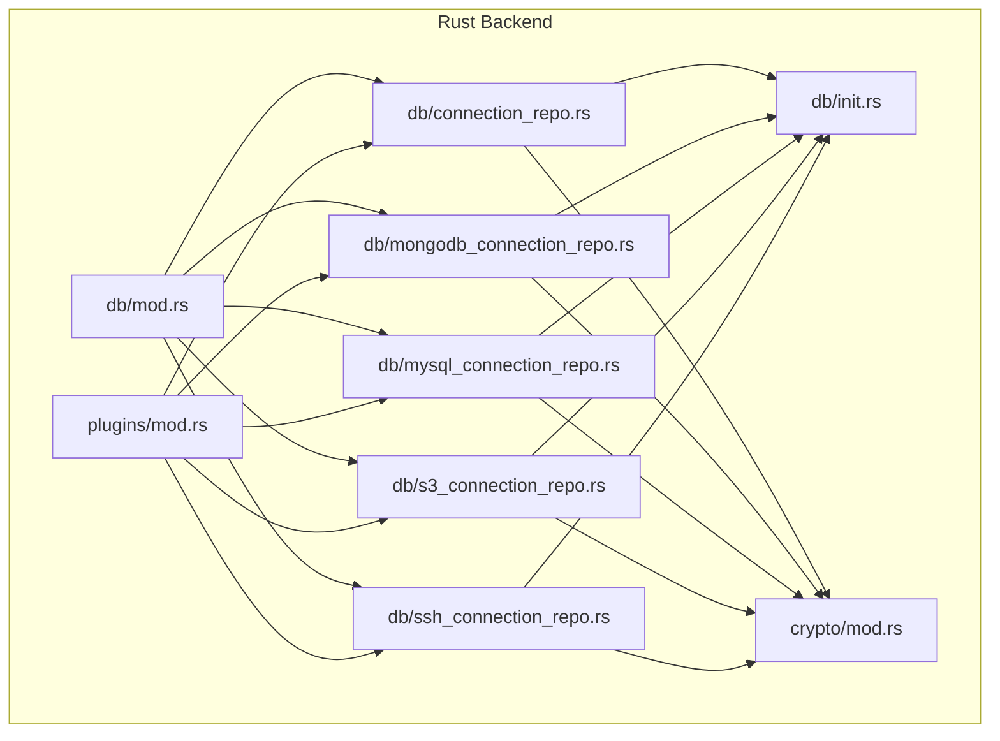

**Diagram sources**
- [mod.rs (db):1-8](file://src-tauri/src/db/mod.rs#L1-L8)
- [init.rs:1-393](file://src-tauri/src/db/init.rs#L1-L393)
- [mod.rs (crypto):1-75](file://src-tauri/src/crypto/mod.rs#L1-L75)
- [connection_repo.rs:1-174](file://src-tauri/src/db/connection_repo.rs#L1-L174)
- [mongodb_connection_repo.rs:1-249](file://src-tauri/src/db/mongodb_connection_repo.rs#L1-L249)
- [mysql_connection_repo.rs:1-209](file://src-tauri/src/db/mysql_connection_repo.rs#L1-L209)
- [s3_connection_repo.rs:1-188](file://src-tauri/src/db/s3_connection_repo.rs#L1-L188)
- [ssh_connection_repo.rs:1-218](file://src-tauri/src/db/ssh_connection_repo.rs#L1-L218)
- [mod.rs (plugins):1-11](file://src-tauri/src/plugins/mod.rs#L1-L11)

**Section sources**
- [mod.rs (db):1-8](file://src-tauri/src/db/mod.rs#L1-L8)
- [init.rs:1-393](file://src-tauri/src/db/init.rs#L1-L393)
- [mod.rs (crypto):1-75](file://src-tauri/src/crypto/mod.rs#L1-L75)
- [mod.rs (plugins):1-11](file://src-tauri/src/plugins/mod.rs#L1-L11)

## Core Components
- Centralized SQLite-backed repository layer with typed DTOs for each connection type.
- Schema initialization and migration logic.
- Encryption/decryption utilities for storing secrets securely.
- Plugin integration via command handlers that delegate to repositories.

Key responsibilities:
- Define connection models and forms for serialization/deserialization.
- Provide CRUD operations for each connection type.
- Encrypt sensitive fields before persisting; decrypt on retrieval.
- Initialize and maintain database schema on startup.

**Section sources**
- [connection_repo.rs:1-174](file://src-tauri/src/db/connection_repo.rs#L1-L174)
- [mongodb_connection_repo.rs:1-249](file://src-tauri/src/db/mongodb_connection_repo.rs#L1-L249)
- [mysql_connection_repo.rs:1-209](file://src-tauri/src/db/mysql_connection_repo.rs#L1-L209)
- [s3_connection_repo.rs:1-188](file://src-tauri/src/db/s3_connection_repo.rs#L1-L188)
- [ssh_connection_repo.rs:1-218](file://src-tauri/src/db/ssh_connection_repo.rs#L1-L218)
- [init.rs:35-392](file://src-tauri/src/db/init.rs#L35-L392)
- [mod.rs (crypto):40-74](file://src-tauri/src/crypto/mod.rs#L40-L74)

## Architecture Overview
The repository pattern follows a layered design:
- Data Access Layer: Typed repositories per connection type.
- Persistence Layer: SQLite database initialized and migrated by the initializer.
- Security Layer: AES-GCM encryption for secrets stored in the database.
- Integration Layer: Plugins expose commands that call into repositories.

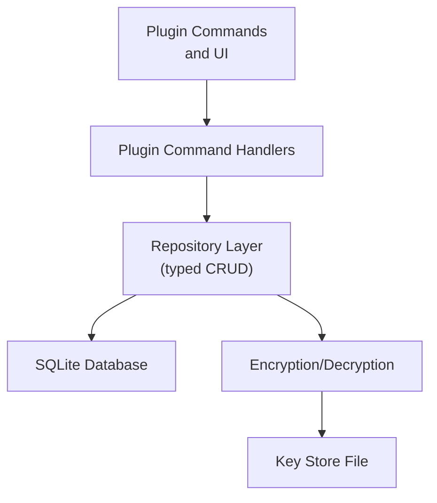

**Diagram sources**
- [init.rs:35-392](file://src-tauri/src/db/init.rs#L35-L392)
- [mod.rs (crypto):10-38](file://src-tauri/src/crypto/mod.rs#L10-L38)
- [connection_repo.rs:96-131](file://src-tauri/src/db/connection_repo.rs#L96-L131)
- [mongodb_connection_repo.rs:115-202](file://src-tauri/src/db/mongodb_connection_repo.rs#L115-L202)
- [mysql_connection_repo.rs:108-176](file://src-tauri/src/db/mysql_connection_repo.rs#L108-L176)
- [s3_connection_repo.rs:110-161](file://src-tauri/src/db/s3_connection_repo.rs#L110-L161)
- [ssh_connection_repo.rs:117-167](file://src-tauri/src/db/ssh_connection_repo.rs#L117-L167)

## Detailed Component Analysis

### SQLite Initialization and Schema Management
- Ensures data directory exists and resolves database path.
- Creates tables for all supported connection types and related history tables.
- Performs lightweight migrations for backward compatibility.

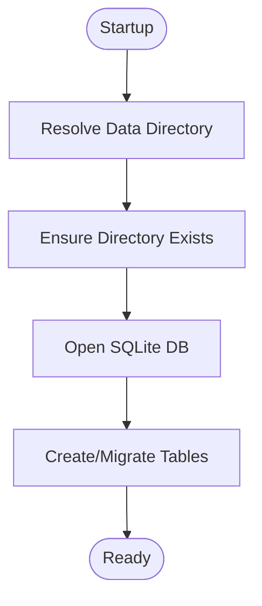

**Diagram sources**
- [init.rs:28-392](file://src-tauri/src/db/init.rs#L28-L392)

**Section sources**
- [init.rs:17-392](file://src-tauri/src/db/init.rs#L17-L392)

### Encryption and Secrets Management
- Generates or loads a 32-byte symmetric key from a key file.
- Uses AES-GCM with a fixed nonce to encrypt/decrypt secrets.
- Repositories store encrypted values and return decrypted values on demand.

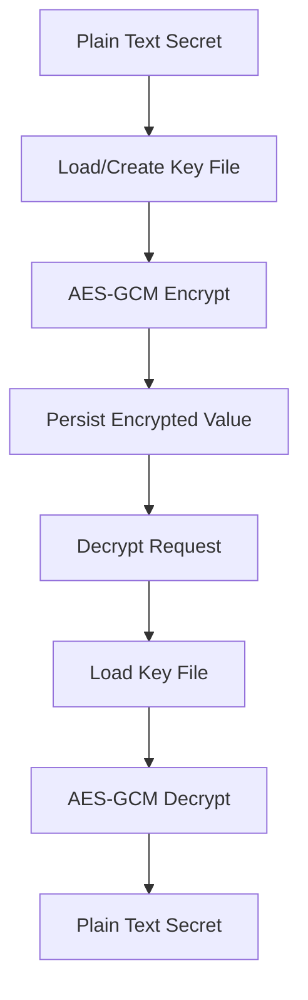

**Diagram sources**
- [mod.rs (crypto):21-74](file://src-tauri/src/crypto/mod.rs#L21-L74)
- [connection_repo.rs:100-100](file://src-tauri/src/db/connection_repo.rs#L100-L100)
- [mongodb_connection_repo.rs:152-158](file://src-tauri/src/db/mongodb_connection_repo.rs#L152-L158)
- [mysql_connection_repo.rs:137-138](file://src-tauri/src/db/mysql_connection_repo.rs#L137-L138)
- [s3_connection_repo.rs:125-125](file://src-tauri/src/db/s3_connection_repo.rs#L125-L125)
- [ssh_connection_repo.rs:123-124](file://src-tauri/src/db/ssh_connection_repo.rs#L123-L124)

**Section sources**
- [mod.rs (crypto):10-74](file://src-tauri/src/crypto/mod.rs#L10-L74)
- [connection_repo.rs:100-154](file://src-tauri/src/db/connection_repo.rs#L100-L154)
- [mongodb_connection_repo.rs:149-248](file://src-tauri/src/db/mongodb_connection_repo.rs#L149-L248)
- [mysql_connection_repo.rs:134-208](file://src-tauri/src/db/mysql_connection_repo.rs#L134-L208)
- [s3_connection_repo.rs:125-187](file://src-tauri/src/db/s3_connection_repo.rs#L125-L187)
- [ssh_connection_repo.rs:122-203](file://src-tauri/src/db/ssh_connection_repo.rs#L122-L203)

### Generic Connection Repository (Redis-like Abstractions)
- Defines shared connection info and form structures.
- Provides list, get, save, delete, password retrieval, and DB index updates.
- Uses a unified SQLite table for generic connections.

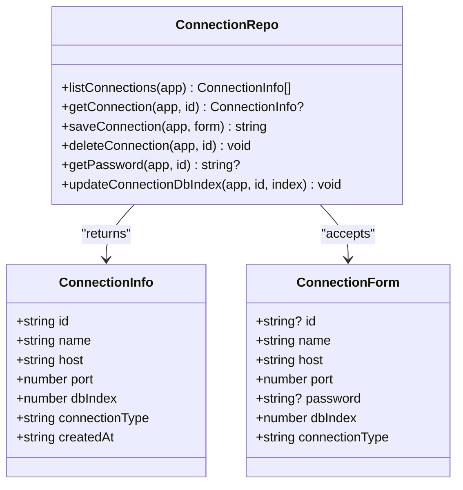

**Diagram sources**
- [connection_repo.rs:3-14](file://src-tauri/src/db/connection_repo.rs#L3-L14)
- [connection_repo.rs:34-173](file://src-tauri/src/db/connection_repo.rs#L34-L173)

**Section sources**
- [connection_repo.rs:1-174](file://src-tauri/src/db/connection_repo.rs#L1-L174)

### MongoDB Connection Repository
- Supports two modes: URI-based or form-based configuration.
- Stores encrypted URI and password; validates mode and required fields.
- Provides CRUD operations and secret retrieval.

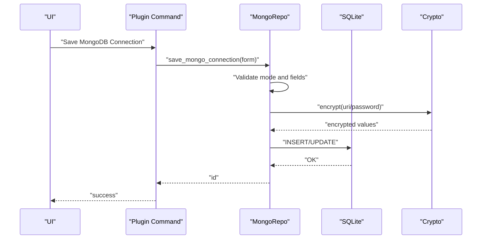

**Diagram sources**
- [mongodb_connection_repo.rs:115-202](file://src-tauri/src/db/mongodb_connection_repo.rs#L115-L202)
- [mongodb_connection_repo.rs:217-248](file://src-tauri/src/db/mongodb_connection_repo.rs#L217-L248)
- [init.rs:117-133](file://src-tauri/src/db/init.rs#L117-L133)
- [mod.rs (crypto):40-74](file://src-tauri/src/crypto/mod.rs#L40-L74)

**Section sources**
- [mongodb_connection_repo.rs:1-249](file://src-tauri/src/db/mongodb_connection_repo.rs#L1-L249)
- [init.rs:117-133](file://src-tauri/src/db/init.rs#L117-L133)

### MySQL Connection Repository
- Validates required fields (name, host, username).
- Persists encrypted password and defaults for optional fields.
- Retrieves secrets by decrypting stored values.

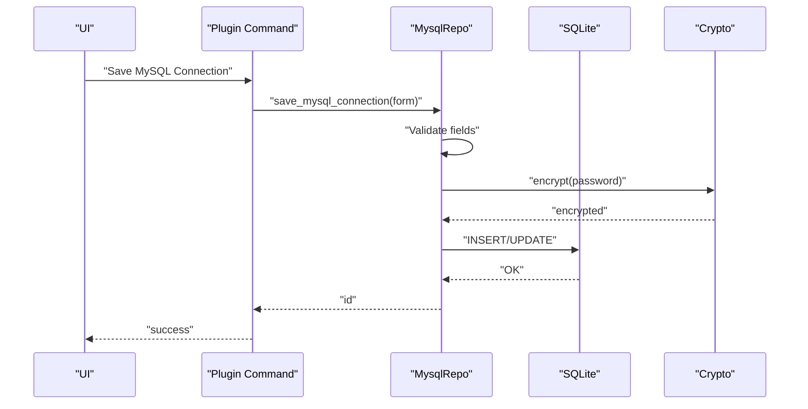

**Diagram sources**
- [mysql_connection_repo.rs:108-176](file://src-tauri/src/db/mysql_connection_repo.rs#L108-L176)
- [mysql_connection_repo.rs:185-208](file://src-tauri/src/db/mysql_connection_repo.rs#L185-L208)
- [init.rs:144-157](file://src-tauri/src/db/init.rs#L144-L157)
- [mod.rs (crypto):40-74](file://src-tauri/src/crypto/mod.rs#L40-L74)

**Section sources**
- [mysql_connection_repo.rs:1-209](file://src-tauri/src/db/mysql_connection_repo.rs#L1-L209)
- [init.rs:144-157](file://src-tauri/src/db/init.rs#L144-L157)

### S3 Connection Repository
- Requires secret access key; stores encrypted value.
- Handles provider, endpoint, region, and path-style options.

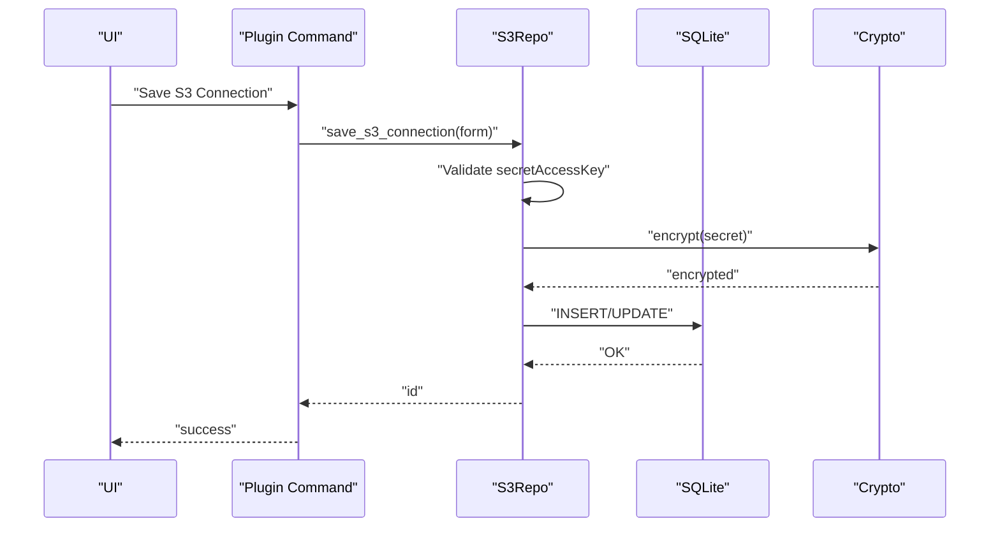

**Diagram sources**
- [s3_connection_repo.rs:110-161](file://src-tauri/src/db/s3_connection_repo.rs#L110-L161)
- [s3_connection_repo.rs:170-187](file://src-tauri/src/db/s3_connection_repo.rs#L170-L187)
- [init.rs:103-115](file://src-tauri/src/db/init.rs#L103-L115)
- [mod.rs (crypto):40-74](file://src-tauri/src/crypto/mod.rs#L40-L74)

**Section sources**
- [s3_connection_repo.rs:1-188](file://src-tauri/src/db/s3_connection_repo.rs#L1-L188)
- [init.rs:103-115](file://src-tauri/src/db/init.rs#L103-L115)

### SSH Connection Repository
- Stores authentication secrets (password and key passphrase) encrypted.
- Manages key references and jump host associations.
- Provides retrieval of secrets and key path resolution.

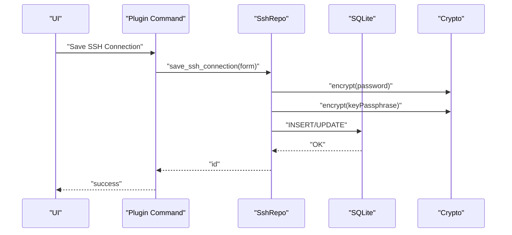

**Diagram sources**
- [ssh_connection_repo.rs:117-167](file://src-tauri/src/db/ssh_connection_repo.rs#L117-L167)
- [ssh_connection_repo.rs:176-203](file://src-tauri/src/db/ssh_connection_repo.rs#L176-L203)
- [ssh_connection_repo.rs:205-217](file://src-tauri/src/db/ssh_connection_repo.rs#L205-L217)
- [init.rs:65-80](file://src-tauri/src/db/init.rs#L65-L80)
- [mod.rs (crypto):40-74](file://src-tauri/src/crypto/mod.rs#L40-L74)

**Section sources**
- [ssh_connection_repo.rs:1-218](file://src-tauri/src/db/ssh_connection_repo.rs#L1-L218)
- [init.rs:65-80](file://src-tauri/src/db/init.rs#L65-L80)

### Relationship Between Repositories and Plugin Command System
- Plugins define command modules that depend on repositories.
- Repositories encapsulate persistence and encryption concerns.
- Commands orchestrate higher-level operations using repository primitives.

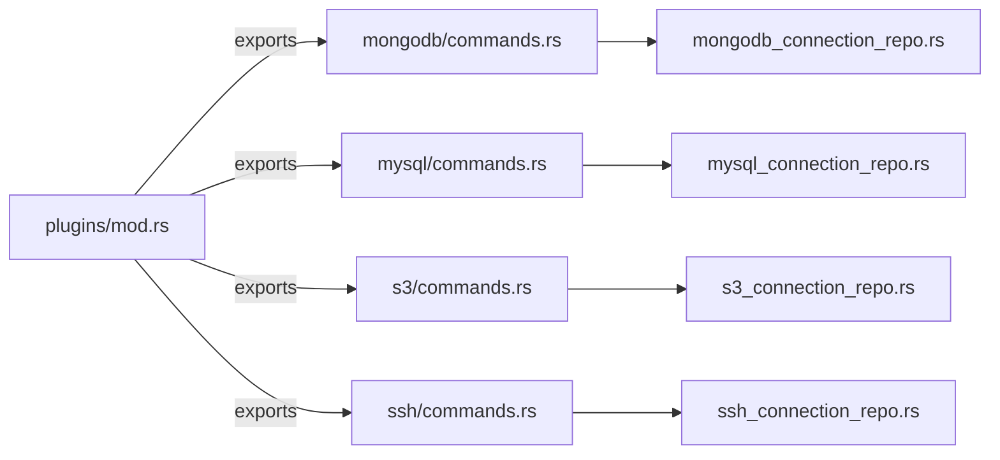

**Diagram sources**
- [mod.rs (plugins):1-11](file://src-tauri/src/plugins/mod.rs#L1-L11)
- [mongodb_connection_repo.rs:1-249](file://src-tauri/src/db/mongodb_connection_repo.rs#L1-L249)
- [mysql_connection_repo.rs:1-209](file://src-tauri/src/db/mysql_connection_repo.rs#L1-L209)
- [s3_connection_repo.rs:1-188](file://src-tauri/src/db/s3_connection_repo.rs#L1-L188)
- [ssh_connection_repo.rs:1-218](file://src-tauri/src/db/ssh_connection_repo.rs#L1-L218)

**Section sources**
- [mod.rs (plugins):1-11](file://src-tauri/src/plugins/mod.rs#L1-L11)

## Dependency Analysis
- Repositories depend on:
  - SQLite initialization for schema and path resolution.
  - Encryption utilities for secret handling.
  - Tauri app handle for filesystem access.
- Plugins depend on repositories to perform operations.

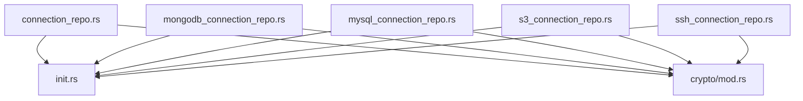

**Diagram sources**
- [connection_repo.rs:29-32](file://src-tauri/src/db/connection_repo.rs#L29-L32)
- [mongodb_connection_repo.rs:40-43](file://src-tauri/src/db/mongodb_connection_repo.rs#L40-L43)
- [mysql_connection_repo.rs:40-43](file://src-tauri/src/db/mysql_connection_repo.rs#L40-L43)
- [s3_connection_repo.rs:33-36](file://src-tauri/src/db/s3_connection_repo.rs#L33-L36)
- [ssh_connection_repo.rs:38-41](file://src-tauri/src/db/ssh_connection_repo.rs#L38-L41)
- [init.rs:1-393](file://src-tauri/src/db/init.rs#L1-L393)
- [mod.rs (crypto):1-75](file://src-tauri/src/crypto/mod.rs#L1-L75)

**Section sources**
- [connection_repo.rs:1-174](file://src-tauri/src/db/connection_repo.rs#L1-L174)
- [mongodb_connection_repo.rs:1-249](file://src-tauri/src/db/mongodb_connection_repo.rs#L1-L249)
- [mysql_connection_repo.rs:1-209](file://src-tauri/src/db/mysql_connection_repo.rs#L1-L209)
- [s3_connection_repo.rs:1-188](file://src-tauri/src/db/s3_connection_repo.rs#L1-L188)
- [ssh_connection_repo.rs:1-218](file://src-tauri/src/db/ssh_connection_repo.rs#L1-L218)
- [init.rs:1-393](file://src-tauri/src/db/init.rs#L1-L393)
- [mod.rs (crypto):1-75](file://src-tauri/src/crypto/mod.rs#L1-L75)

## Performance Considerations
- Connection reuse: Repositories open a SQLite connection per operation. For high-throughput scenarios, consider pooling at the application level or batching operations.
- Encryption overhead: AES-GCM adds CPU cost; cache decrypted secrets in memory for short-lived operations where appropriate.
- Query optimization: Use indexed columns (e.g., primary keys) and avoid N+1 queries by fetching related data in joins or separate queries.
- I/O patterns: Minimize disk writes by grouping inserts/updates and leveraging upsert semantics already present in the repositories.

## Troubleshooting Guide
Common issues and resolutions:
- Database path errors: Ensure the data directory exists and is writable; the initializer creates directories automatically.
- Migration failures: Verify schema creation statements succeed; check for conflicting table definitions.
- Encryption failures: Confirm key file exists and is valid hex; regenerate key if corrupted.
- Missing secrets: Ensure encrypted values exist for the given ID; re-save connection to populate secrets.
- Validation errors: Repositories enforce required fields; review form inputs and modes (e.g., MongoDB mode).

Operational checks:
- Confirm database path resolution and existence.
- Validate encryption key presence and size.
- Test CRUD operations for each connection type.
- Verify plugin commands route to correct repository functions.

**Section sources**
- [init.rs:17-392](file://src-tauri/src/db/init.rs#L17-L392)
- [mod.rs (crypto):21-38](file://src-tauri/src/crypto/mod.rs#L21-L38)
- [mongodb_connection_repo.rs:123-147](file://src-tauri/src/db/mongodb_connection_repo.rs#L123-L147)
- [mysql_connection_repo.rs:117-125](file://src-tauri/src/db/mysql_connection_repo.rs#L117-L125)
- [s3_connection_repo.rs:122-124](file://src-tauri/src/db/s3_connection_repo.rs#L122-L124)
- [ssh_connection_repo.rs:122-124](file://src-tauri/src/db/ssh_connection_repo.rs#L122-L124)

## Conclusion
RDMM’s repository pattern centralizes connection management with typed DTOs, robust encryption, and a clear separation of concerns. Repositories provide consistent CRUD APIs across database types while the plugin system integrates these capabilities into user-facing workflows. The design supports extensibility and maintains strong security hygiene for sensitive credentials.

## Appendices

### Implementing a New Repository Type
Steps to add a new repository:
1. Define structs for Info and Form in a new module under the database layer.
2. Add SQL schema for the new table(s) in the initializer.
3. Implement CRUD functions mirroring existing repositories:
   - list/get/save/delete
   - secret retrieval if applicable
   - validation and encryption/decryption
4. Integrate with the plugin command system by adding a command handler that delegates to the new repository.
5. Update module exports to expose the new repository.

Guidance:
- Reuse the existing pattern for encryption and schema initialization.
- Keep validation close to save operations.
- Use ON CONFLICT upsert semantics for idempotent saves.

**Section sources**
- [init.rs:35-392](file://src-tauri/src/db/init.rs#L35-L392)
- [mod.rs (db):1-8](file://src-tauri/src/db/mod.rs#L1-L8)
- [mod.rs (plugins):1-11](file://src-tauri/src/plugins/mod.rs#L1-L11)

### Connection Lifecycle and State Management
Lifecycle stages:
- Initialization: Ensure data directory and database file; create tables.
- Configuration: Save connection with encrypted secrets.
- Retrieval: Fetch and decrypt secrets when needed.
- Deletion: Remove persisted configuration and related history.

State considerations:
- Secrets are stored encrypted; decryption occurs on-demand.
- Schema evolves over time; initializer handles migrations.

**Section sources**
- [init.rs:28-392](file://src-tauri/src/db/init.rs#L28-L392)
- [connection_repo.rs:96-154](file://src-tauri/src/db/connection_repo.rs#L96-L154)
- [mongodb_connection_repo.rs:115-248](file://src-tauri/src/db/mongodb_connection_repo.rs#L115-L248)
- [mysql_connection_repo.rs:108-208](file://src-tauri/src/db/mysql_connection_repo.rs#L108-L208)
- [s3_connection_repo.rs:110-187](file://src-tauri/src/db/s3_connection_repo.rs#L110-L187)
- [ssh_connection_repo.rs:117-203](file://src-tauri/src/db/ssh_connection_repo.rs#L117-L203)

### Transaction Handling
- Current repositories perform single-statement operations without explicit transactions.
- For multi-step operations (e.g., saving a connection and related metadata), wrap statements in a transaction block to ensure atomicity.
- Use SQLite transaction primitives to commit or rollback as a unit.

[No sources needed since this section provides general guidance]

### Security Considerations
- Credential storage: Encrypt all secrets before persisting; never log decrypted values.
- Key management: Store a single symmetric key in the application data directory; rotate keys carefully.
- Access control: Restrict filesystem permissions on the database and key files.
- Transport security: Prefer TLS-enabled connections for external services (MongoDB, MySQL, S3).
- Least privilege: Limit database and service permissions to required scopes.

**Section sources**
- [mod.rs (crypto):40-74](file://src-tauri/src/crypto/mod.rs#L40-L74)
- [mongodb_connection_repo.rs:149-158](file://src-tauri/src/db/mongodb_connection_repo.rs#L149-L158)
- [mysql_connection_repo.rs:134-138](file://src-tauri/src/db/mysql_connection_repo.rs#L134-L138)
- [s3_connection_repo.rs:125-125](file://src-tauri/src/db/s3_connection_repo.rs#L125-L125)
- [ssh_connection_repo.rs:122-124](file://src-tauri/src/db/ssh_connection_repo.rs#L122-L124)