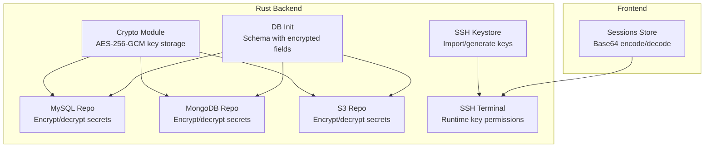
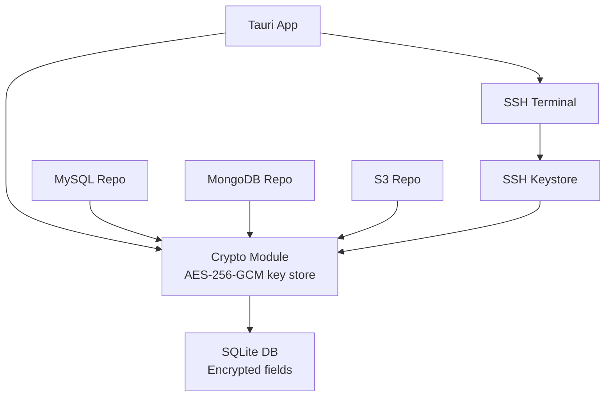
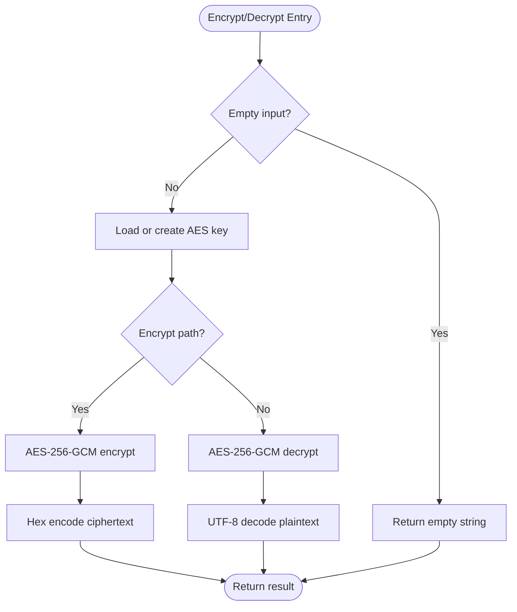
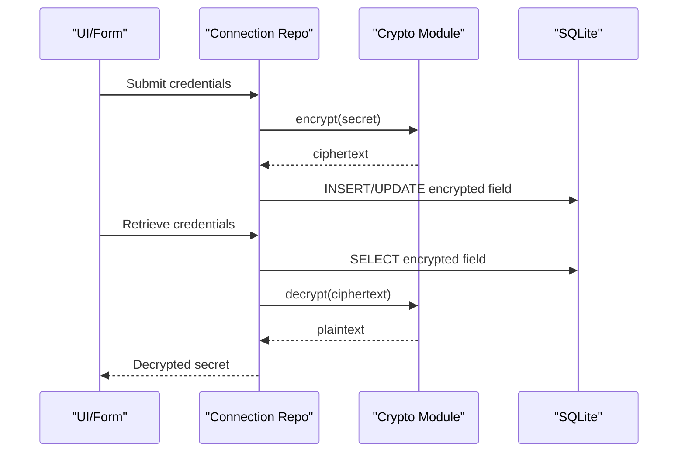
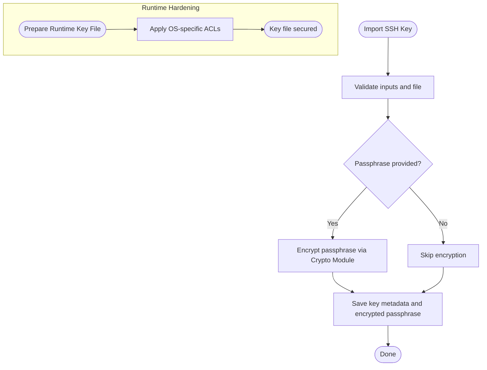
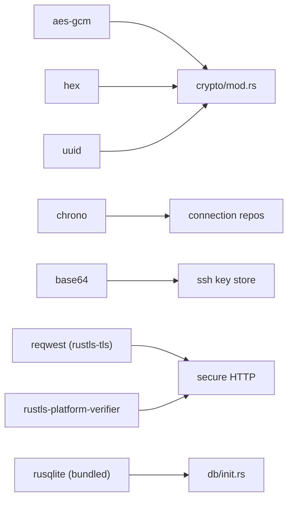

# Encryption and Security

<cite>
**Referenced Files in This Document**
- [mod.rs](file://src-tauri/src/crypto/mod.rs)
- [Cargo.toml](file://src-tauri/Cargo.toml)
- [Cargo.lock](file://src-tauri/Cargo.lock)
- [init.rs](file://src-tauri/src/db/init.rs)
- [mysql_connection_repo.rs](file://src-tauri/src/db/mysql_connection_repo.rs)
- [mongodb_connection_repo.rs](file://src-tauri/src/db/mongodb_connection_repo.rs)
- [s3_connection_repo.rs](file://src-tauri/src/db/s3_connection_repo.rs)
- [key_store.rs](file://src-tauri/src/plugins/ssh/key_store.rs)
- [terminal.rs](file://src-tauri/src/plugins/ssh/terminal.rs)
- [sessions.ts](file://src/plugins/ssh-client/store/sessions.ts)
</cite>

## Table of Contents
1. [Introduction](#introduction)
2. [Project Structure](#project-structure)
3. [Core Components](#core-components)
4. [Architecture Overview](#architecture-overview)
5. [Detailed Component Analysis](#detailed-component-analysis)
6. [Dependency Analysis](#dependency-analysis)
7. [Performance Considerations](#performance-considerations)
8. [Troubleshooting Guide](#troubleshooting-guide)
9. [Conclusion](#conclusion)
10. [Appendices](#appendices)

## Introduction
This document explains RDMM’s encryption and security implementation with a focus on protecting sensitive data at rest and in transit. It covers the AES-256-GCM symmetric encryption used for storing secrets, the key storage mechanism, credential encryption patterns across database-backed connections, secure memory handling during runtime, and secure communication pathways. It also documents platform-specific protections for SSH key material, certificate verification via rustls-platform-verifier, and operational best practices for auditing and compliance.

## Project Structure
Security-relevant code spans Rust backend modules and Tauri plugins:
- Crypto primitives and key storage live under the crypto module.
- Database initialization defines schema for encrypted fields.
- Connection repositories implement secret encryption/decryption.
- SSH plugin manages key lifecycle and runtime permissions.
- Frontend session utilities handle base64 encoding/decoding for terminal data.

**Diagram sources**
- [mod.rs:1-75](file://src-tauri/src/crypto/mod.rs#L1-L75)
- [init.rs:35-115](file://src-tauri/src/db/init.rs#L35-L115)
- [mysql_connection_repo.rs:108-176](file://src-tauri/src/db/mysql_connection_repo.rs#L108-L176)
- [mongodb_connection_repo.rs:115-202](file://src-tauri/src/db/mongodb_connection_repo.rs#L115-L202)
- [s3_connection_repo.rs:110-161](file://src-tauri/src/db/s3_connection_repo.rs#L110-L161)
- [key_store.rs:66-108](file://src-tauri/src/plugins/ssh/key_store.rs#L66-L108)
- [terminal.rs:218-284](file://src-tauri/src/plugins/ssh/terminal.rs#L218-L284)
- [sessions.ts:31-48](file://src/plugins/ssh-client/store/sessions.ts#L31-L48)

**Section sources**
- [mod.rs:1-75](file://src-tauri/src/crypto/mod.rs#L1-L75)
- [init.rs:35-115](file://src-tauri/src/db/init.rs#L35-L115)
- [mysql_connection_repo.rs:108-176](file://src-tauri/src/db/mysql_connection_repo.rs#L108-L176)
- [mongodb_connection_repo.rs:115-202](file://src-tauri/src/db/mongodb_connection_repo.rs#L115-L202)
- [s3_connection_repo.rs:110-161](file://src-tauri/src/db/s3_connection_repo.rs#L110-L161)
- [key_store.rs:66-108](file://src-tauri/src/plugins/ssh/key_store.rs#L66-L108)
- [terminal.rs:218-284](file://src-tauri/src/plugins/ssh/terminal.rs#L218-L284)
- [sessions.ts:31-48](file://src/plugins/ssh-client/store/sessions.ts#L31-L48)

## Core Components
- AES-256-GCM encryption for secrets at rest:
  - A single 32-byte key is persisted per installation and used to encrypt/decrypt sensitive fields in SQLite.
  - The key is stored as a hex-encoded file in the application data directory and migrated from legacy locations.
- Credential encryption across connection types:
  - MySQL, MongoDB, and S3 repositories encrypt secrets before writing to the database and decrypt when retrieving.
- Secure SSH key handling:
  - SSH key material is imported and stored with optional passphrase encryption.
  - Runtime key files are hardened with OS-specific ACLs on Windows to restrict access.
- Secure communication:
  - TLS stack integrates rustls with platform verifier for certificate validation.
  - HTTP clients use rustls-tls features for secure transport.

**Section sources**
- [mod.rs:1-75](file://src-tauri/src/crypto/mod.rs#L1-L75)
- [init.rs:35-115](file://src-tauri/src/db/init.rs#L35-L115)
- [mysql_connection_repo.rs:108-176](file://src-tauri/src/db/mysql_connection_repo.rs#L108-L176)
- [mongodb_connection_repo.rs:115-202](file://src-tauri/src/db/mongodb_connection_repo.rs#L115-L202)
- [s3_connection_repo.rs:110-161](file://src-tauri/src/db/s3_connection_repo.rs#L110-L161)
- [key_store.rs:66-108](file://src-tauri/src/plugins/ssh/key_store.rs#L66-L108)
- [terminal.rs:218-284](file://src-tauri/src/plugins/ssh/terminal.rs#L218-L284)
- [Cargo.toml:46-49](file://src-tauri/Cargo.toml#L46-L49)

## Architecture Overview
The encryption architecture centers on a single AES-256-GCM key per installation, used to protect secrets stored in SQLite. Repositories encrypt before insert/update and decrypt on read. SSH key material is protected by OS-level permissions. TLS is handled by rustls with platform verification.

**Diagram sources**
- [mod.rs:1-75](file://src-tauri/src/crypto/mod.rs#L1-L75)
- [init.rs:35-115](file://src-tauri/src/db/init.rs#L35-L115)
- [mysql_connection_repo.rs:108-176](file://src-tauri/src/db/mysql_connection_repo.rs#L108-L176)
- [mongodb_connection_repo.rs:115-202](file://src-tauri/src/db/mongodb_connection_repo.rs#L115-L202)
- [s3_connection_repo.rs:110-161](file://src-tauri/src/db/s3_connection_repo.rs#L110-L161)
- [key_store.rs:66-108](file://src-tauri/src/plugins/ssh/key_store.rs#L66-L108)
- [terminal.rs:218-284](file://src-tauri/src/plugins/ssh/terminal.rs#L218-L284)

## Detailed Component Analysis

### AES-256-GCM Encryption and Key Storage
- Key generation and persistence:
  - On first run, a random 32-byte key is generated and saved as a hex string in the app data directory.
  - Legacy key file names are migrated to the current location transparently.
- Encryption/decryption:
  - Uses AES-256-GCM with a fixed 12-byte nonce.
  - Empty plaintext or ciphertext inputs are handled as no-ops.
- Data protection:
  - Sensitive fields across MySQL, MongoDB, and S3 repositories are encrypted before insertion and decrypted upon retrieval.

**Diagram sources**
- [mod.rs:40-74](file://src-tauri/src/crypto/mod.rs#L40-L74)

**Section sources**
- [mod.rs:1-75](file://src-tauri/src/crypto/mod.rs#L1-L75)
- [init.rs:35-115](file://src-tauri/src/db/init.rs#L35-L115)

### Credential Encryption Across Connection Types
- MySQL:
  - Passwords are encrypted before saving to the database and decrypted when retrieved for use.
- MongoDB:
  - Supports URI and form modes; both URIs and passwords are encrypted when provided.
- S3:
  - Secret access keys are encrypted before saving and decrypted when needed.

**Diagram sources**
- [mysql_connection_repo.rs:108-176](file://src-tauri/src/db/mysql_connection_repo.rs#L108-L176)
- [mongodb_connection_repo.rs:115-202](file://src-tauri/src/db/mongodb_connection_repo.rs#L115-L202)
- [s3_connection_repo.rs:110-161](file://src-tauri/src/db/s3_connection_repo.rs#L110-L161)
- [mod.rs:40-74](file://src-tauri/src/crypto/mod.rs#L40-L74)

**Section sources**
- [mysql_connection_repo.rs:108-176](file://src-tauri/src/db/mysql_connection_repo.rs#L108-L176)
- [mongodb_connection_repo.rs:115-202](file://src-tauri/src/db/mongodb_connection_repo.rs#L115-L202)
- [s3_connection_repo.rs:110-161](file://src-tauri/src/db/s3_connection_repo.rs#L110-L161)

### Secure SSH Key Management and Runtime Protection
- Key import and generation:
  - Private keys are imported from disk; optional passphrases are encrypted before storage.
  - Public keys are derived for convenience.
- Runtime key protection:
  - On Windows, ACLs are reset, inheritance removed, and permissions granted only to the current user.
  - Sensitive groups (Everyone, Users, Administrators, SYSTEM) are removed where possible.

**Diagram sources**
- [key_store.rs:66-108](file://src-tauri/src/plugins/ssh/key_store.rs#L66-L108)
- [terminal.rs:218-284](file://src-tauri/src/plugins/ssh/terminal.rs#L218-L284)

**Section sources**
- [key_store.rs:66-108](file://src-tauri/src/plugins/ssh/key_store.rs#L66-L108)
- [terminal.rs:218-284](file://src-tauri/src/plugins/ssh/terminal.rs#L218-L284)

### Secure Memory Handling and Data Encoding
- Base64 encoding/decoding:
  - Terminal session utilities convert between UTF-8 strings and binary buffers for transport, ensuring safe handling of byte streams.
- Practical guidance:
  - Prefer zeroizing sensitive buffers after use where applicable.
  - Avoid logging decrypted secrets.

**Section sources**
- [sessions.ts:31-48](file://src/plugins/ssh-client/store/sessions.ts#L31-L48)

### Secure Communication Channels and Certificate Handling
- TLS stack:
  - HTTP requests use rustls-tls features.
  - Platform verifier integrates with OS trust stores for certificate validation.
- Best practices:
  - Enable SSL validation by default.
  - Pin certificates or use HPKP only when necessary and well-understood.

**Section sources**
- [Cargo.toml:46-49](file://src-tauri/Cargo.toml#L46-L49)
- [Cargo.lock:6601-6620](file://src-tauri/Cargo.lock#L6601-L6620)

## Dependency Analysis
- Cryptographic primitives:
  - aes-gcm, hex, uuid, chrono, base64 are core dependencies for encryption, serialization, and key generation.
- TLS and certificate verification:
  - reqwest with rustls-tls, rustls-platform-verifier, rustls-native-certs, rustls-webpki integrate platform trust.
- Database and ORM:
  - rusqlite with bundled feature powers schema creation and encrypted field storage.

**Diagram sources**
- [Cargo.toml:20-49](file://src-tauri/Cargo.toml#L20-L49)
- [mod.rs:1-75](file://src-tauri/src/crypto/mod.rs#L1-L75)
- [init.rs:35-115](file://src-tauri/src/db/init.rs#L35-L115)
- [key_store.rs:1-153](file://src-tauri/src/plugins/ssh/key_store.rs#L1-L153)

**Section sources**
- [Cargo.toml:20-49](file://src-tauri/Cargo.toml#L20-L49)
- [Cargo.lock:32-44](file://src-tauri/Cargo.lock#L32-L44)
- [Cargo.lock:6601-6620](file://src-tauri/Cargo.lock#L6601-L6620)

## Performance Considerations
- AES-256-GCM is efficient for moderate-sized secrets; overhead is minimal compared to network latency.
- Frequent encryption/decryption of small secrets is acceptable; avoid unnecessary re-encryption when values are unchanged.
- Database writes with encrypted fields remain fast due to simple blob storage; consider indexing only non-sensitive fields.

## Troubleshooting Guide
- Key file errors:
  - If the key file is missing or invalid, the system regenerates a new key and persists it. Verify the app data directory permissions and path resolution.
- Decryption failures:
  - Ensure ciphertext is properly hex-encoded and matches the expected key. Confirm the key file exists and is readable.
- SSH key permission failures:
  - On Windows, verify that ACL reset/grant/remove commands succeed. Ensure the current user can be resolved and that sensitive groups are removed.
- TLS verification issues:
  - Confirm system trust store updates and that rustls-platform-verifier is available. Test with a known-good endpoint to isolate environment problems.

**Section sources**
- [mod.rs:21-38](file://src-tauri/src/crypto/mod.rs#L21-L38)
- [terminal.rs:218-284](file://src-tauri/src/plugins/ssh/terminal.rs#L218-L284)
- [Cargo.lock:6601-6620](file://src-tauri/Cargo.lock#L6601-L6620)

## Conclusion
RDMM employs AES-256-GCM with a per-installation key to protect secrets at rest across multiple connection types. SSH key material is safeguarded with OS-specific ACLs, and secure communication leverages rustls with platform certificate verification. By following the documented patterns and best practices, teams can maintain strong confidentiality and integrity for sensitive data while remaining compliant with common security standards.

## Appendices

### Practical Examples (by reference)
- Encrypt a sensitive string:
  - Use the encryption function in the crypto module with an AppHandle.
  - Reference: [encrypt:40-55](file://src-tauri/src/crypto/mod.rs#L40-L55)
- Decrypt a stored secret:
  - Use the decryption function in the crypto module with an AppHandle.
  - Reference: [decrypt:57-74](file://src-tauri/src/crypto/mod.rs#L57-L74)
- Store a MySQL password securely:
  - Encrypt before inserting into the mysql_connections table.
  - Reference: [save_mysql_connection:108-176](file://src-tauri/src/db/mysql_connection_repo.rs#L108-L176)
- Store a MongoDB password securely:
  - Encrypt before inserting into the mongodb_connections table.
  - Reference: [save_mongo_connection:115-202](file://src-tauri/src/db/mongodb_connection_repo.rs#L115-L202)
- Store an S3 secret access key securely:
  - Encrypt before inserting into the s3_connections table.
  - Reference: [save_s3_connection:110-161](file://src-tauri/src/db/s3_connection_repo.rs#L110-L161)
- Import an SSH key with optional passphrase:
  - Import private key and optionally encrypt the passphrase.
  - Reference: [import_key:66-108](file://src-tauri/src/plugins/ssh/key_store.rs#L66-L108)
- Harden runtime SSH key permissions on Windows:
  - Reset ACLs, remove broad groups, grant only to current user.
  - Reference: [harden_runtime_key_permissions:218-284](file://src-tauri/src/plugins/ssh/terminal.rs#L218-L284)