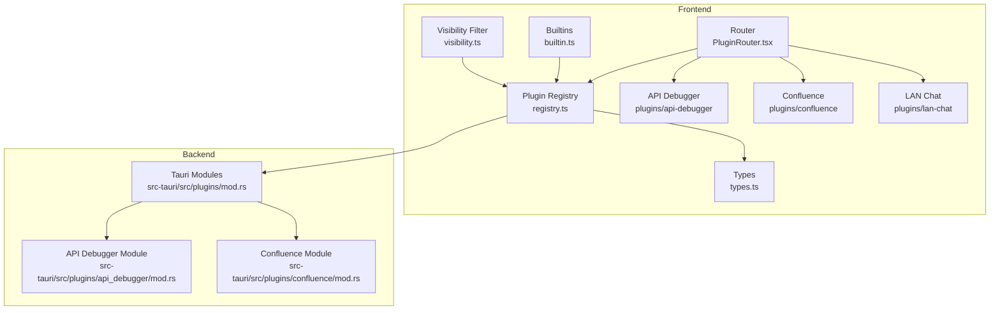
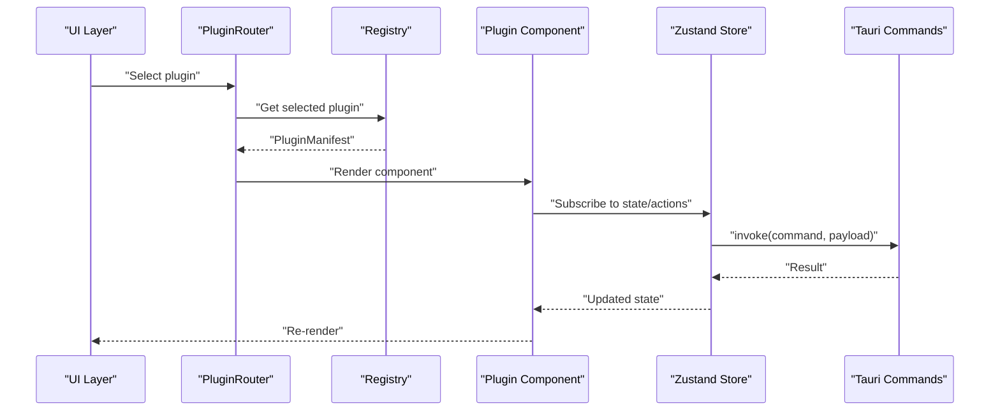
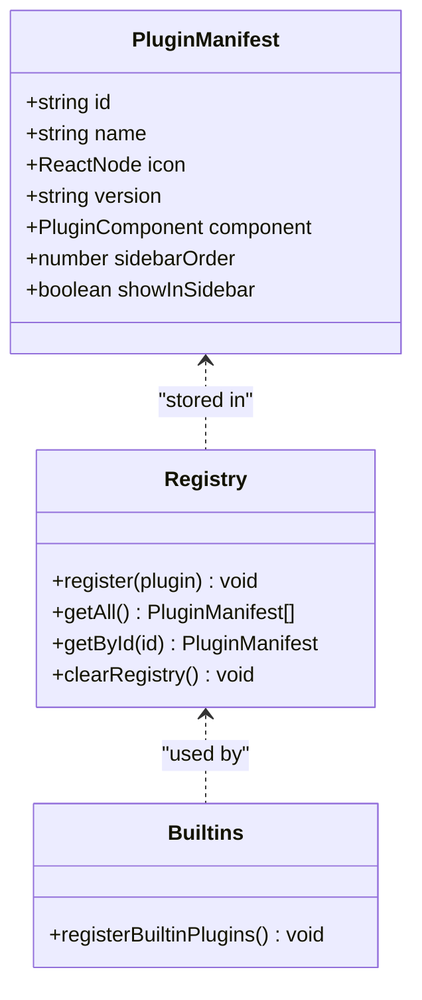
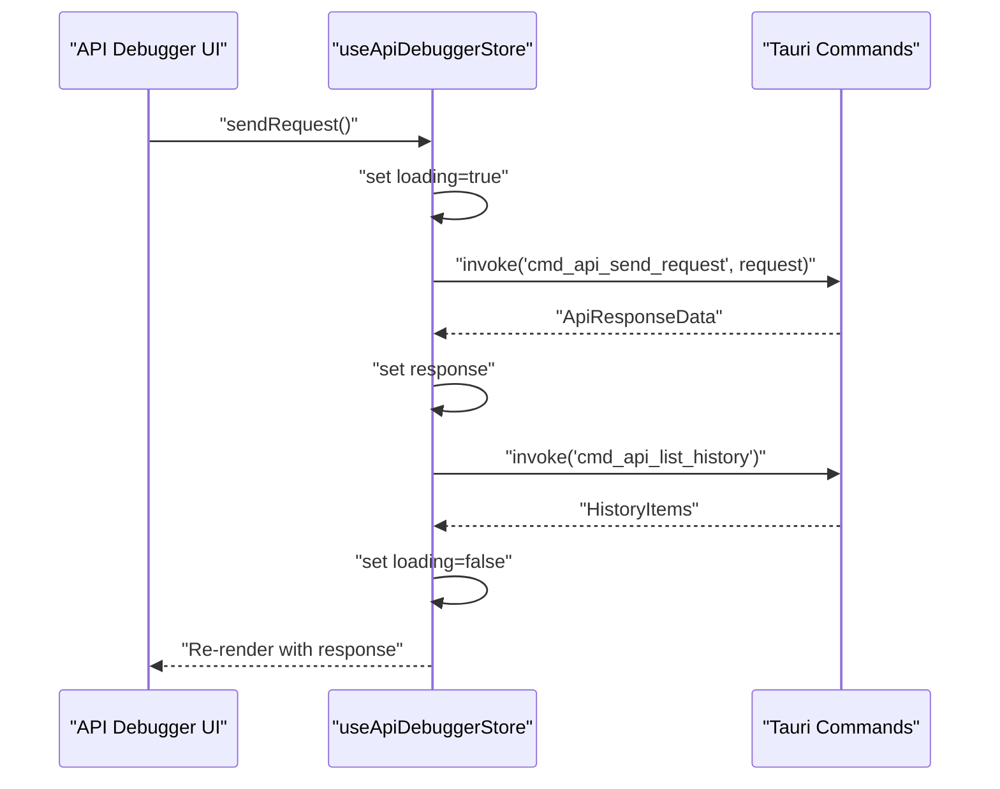
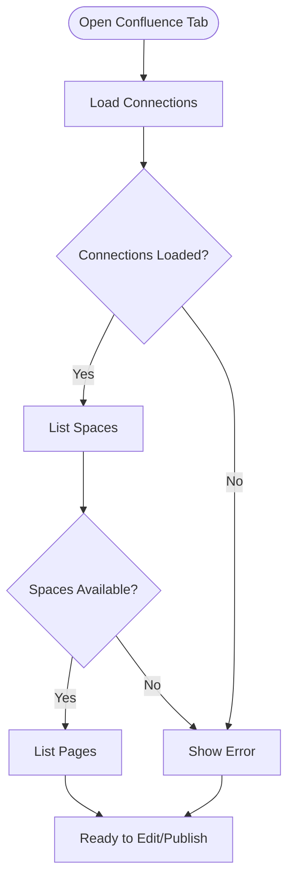
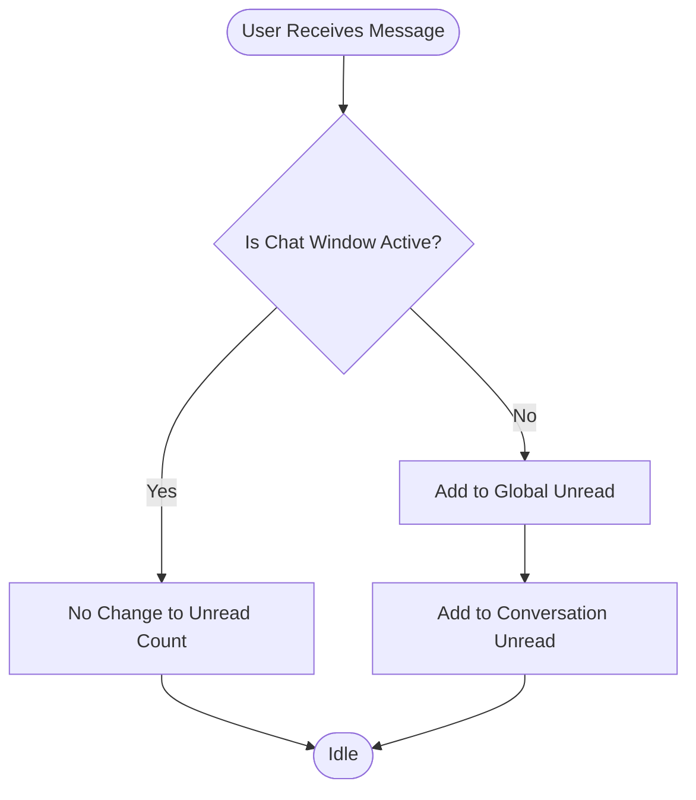
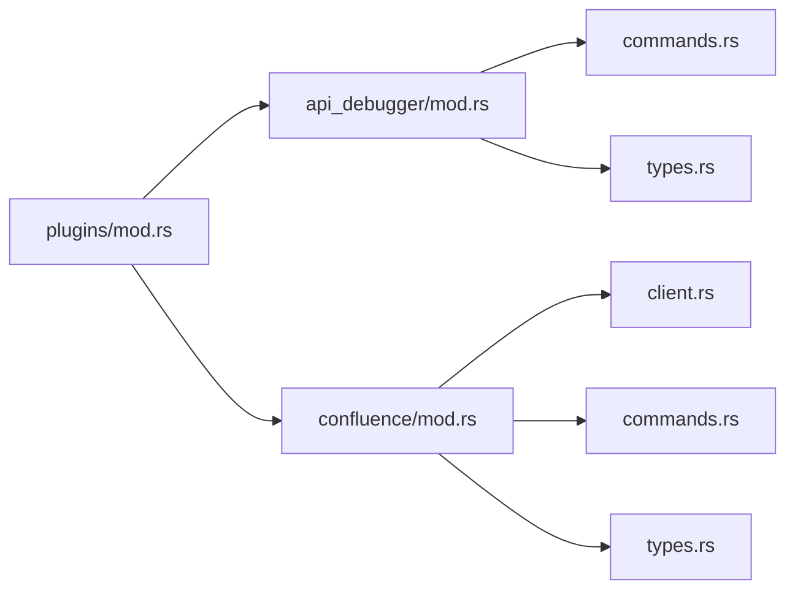
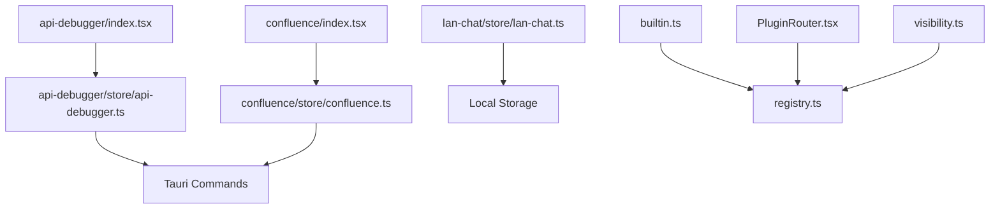

# Plugin Implementations

<cite>
**Referenced Files in This Document**
- [registry.ts](file://src/app/plugin-registry/registry.ts)
- [types.ts](file://src/app/plugin-registry/types.ts)
- [builtin.ts](file://src/app/plugin-registry/builtin.ts)
- [visibility.ts](file://src/app/plugin-registry/visibility.ts)
- [PluginRouter.tsx](file://src/app/plugin-registry/PluginRouter.tsx)
- [api-debugger/index.tsx](file://src/plugins/api-debugger/index.tsx)
- [api-debugger/store/api-debugger.ts](file://src/plugins/api-debugger/store/api-debugger.ts)
- [confluence/index.tsx](file://src/plugins/confluence/index.tsx)
- [confluence/store/confluence.ts](file://src/plugins/confluence/store/confluence.ts)
- [lan-chat/store/lan-chat.ts](file://src/plugins/lan-chat/store/lan-chat.ts)
- [mod.rs](file://src-tauri/src/plugins/mod.rs)
- [api_debugger/mod.rs](file://src-tauri/src/plugins/api_debugger/mod.rs)
- [confluence/mod.rs](file://src-tauri/src/plugins/confluence/mod.rs)
</cite>

## Table of Contents
1. [Introduction](#introduction)
2. [Project Structure](#project-structure)
3. [Core Components](#core-components)
4. [Architecture Overview](#architecture-overview)
5. [Detailed Component Analysis](#detailed-component-analysis)
6. [Dependency Analysis](#dependency-analysis)
7. [Performance Considerations](#performance-considerations)
8. [Troubleshooting Guide](#troubleshooting-guide)
9. [Conclusion](#conclusion)
10. [Appendices](#appendices)

## Introduction
This document explains RDMM’s plugin implementation system that extends backend functionality through modular components. It covers the plugin architecture, command registration, state management patterns, and the lifecycle of built-in plugins such as API debugger, Confluence editor, LAN chat, database clients, and network tools. Practical guidance is included for implementing custom plugins, handling dependencies, managing state, ensuring isolation, and optimizing performance. The document also describes how plugins relate to the main application and communicate with each other.

## Project Structure
RDMM organizes plugins into two layers:
- Frontend plugins: React components and Zustand stores under src/plugins/<plugin-name>.
- Backend plugins: Tauri commands and Rust modules under src-tauri/src/plugins/<plugin-name>.

The frontend plugin registry manages plugin manifests, ordering, and routing. Built-in plugins are registered centrally and exposed via a router that renders the active plugin component.

**Diagram sources**
- [registry.ts:1-26](file://src/app/plugin-registry/registry.ts#L1-L26)
- [types.ts:1-14](file://src/app/plugin-registry/types.ts#L1-L14)
- [builtin.ts:1-31](file://src/app/plugin-registry/builtin.ts#L1-L31)
- [visibility.ts:1-6](file://src/app/plugin-registry/visibility.ts#L1-L6)
- [PluginRouter.tsx:1-29](file://src/app/plugin-registry/PluginRouter.tsx#L1-L29)
- [mod.rs:1-11](file://src-tauri/src/plugins/mod.rs#L1-L11)
- [api_debugger/mod.rs:1-3](file://src-tauri/src/plugins/api_debugger/mod.rs#L1-L3)
- [confluence/mod.rs:1-4](file://src-tauri/src/plugins/confluence/mod.rs#L1-L4)

**Section sources**
- [registry.ts:1-26](file://src/app/plugin-registry/registry.ts#L1-L26)
- [types.ts:1-14](file://src/app/plugin-registry/types.ts#L1-L14)
- [builtin.ts:1-31](file://src/app/plugin-registry/builtin.ts#L1-L31)
- [visibility.ts:1-6](file://src/app/plugin-registry/visibility.ts#L1-L6)
- [PluginRouter.tsx:1-29](file://src/app/plugin-registry/PluginRouter.tsx#L1-L29)
- [mod.rs:1-11](file://src-tauri/src/plugins/mod.rs#L1-L11)
- [api_debugger/mod.rs:1-3](file://src-tauri/src/plugins/api_debugger/mod.rs#L1-L3)
- [confluence/mod.rs:1-4](file://src-tauri/src/plugins/confluence/mod.rs#L1-L4)

## Core Components
- Plugin manifest: Defines plugin identity, metadata, icon, order, and the React component to render.
- Registry: Central store for plugin manifests with registration, retrieval, sorting, and clearing.
- Built-in registration: Initializes and registers all built-in plugins once.
- Visibility filter: Filters plugins to show in the sidebar.
- Router: Selects and renders the active plugin component based on user selection.
- Stores: Each plugin exposes a Zustand store encapsulating state and actions for UI and backend commands.

Key responsibilities:
- Manifest definition and ordering ensure predictable sidebar presentation.
- Registry prevents duplicates and supports deterministic ordering.
- Router binds UI selection to the active plugin component.
- Stores encapsulate plugin-specific state and orchestrate Tauri command invocations.

**Section sources**
- [types.ts:5-13](file://src/app/plugin-registry/types.ts#L5-L13)
- [registry.ts:3-25](file://src/app/plugin-registry/registry.ts#L3-L25)
- [builtin.ts:14-29](file://src/app/plugin-registry/builtin.ts#L14-L29)
- [visibility.ts:3-5](file://src/app/plugin-registry/visibility.ts#L3-L5)
- [PluginRouter.tsx:7-28](file://src/app/plugin-registry/PluginRouter.tsx#L7-L28)

## Architecture Overview
The plugin architecture separates concerns across layers:
- Frontend: React components and stores manage UI state and user interactions.
- Backend: Tauri commands expose typed operations to the frontend.
- Registry: Provides discovery, ordering, and rendering of plugins.

**Diagram sources**
- [PluginRouter.tsx:7-28](file://src/app/plugin-registry/PluginRouter.tsx#L7-L28)
- [registry.ts:13-21](file://src/app/plugin-registry/registry.ts#L13-L21)
- [api-debugger/store/api-debugger.ts:62-81](file://src/plugins/api-debugger/store/api-debugger.ts#L62-L81)

## Detailed Component Analysis

### Plugin Manifest and Registry
- PluginManifest defines id, name, icon, version, component, sidebarOrder, and optional sidebar visibility.
- Registry maintains a Map keyed by plugin id, enforces uniqueness, and provides getters and sorting by sidebarOrder.
- Built-in registration centralizes plugin registration and guards against re-initialization.
- Visibility filter ensures only visible plugins appear in the sidebar.

**Diagram sources**
- [types.ts:5-13](file://src/app/plugin-registry/types.ts#L5-L13)
- [registry.ts:3-25](file://src/app/plugin-registry/registry.ts#L3-L25)
- [builtin.ts:14-29](file://src/app/plugin-registry/builtin.ts#L14-L29)

**Section sources**
- [types.ts:5-13](file://src/app/plugin-registry/types.ts#L5-L13)
- [registry.ts:3-25](file://src/app/plugin-registry/registry.ts#L3-L25)
- [builtin.ts:14-29](file://src/app/plugin-registry/builtin.ts#L14-L29)
- [visibility.ts:3-5](file://src/app/plugin-registry/visibility.ts#L3-L5)

### API Debugger Plugin
- Component: Renders tabs for Workspace, Collections, Environments, and History, and binds active environment display.
- Store: Manages UI tab, active request, response, preview, collections, folders, requests, environments, history, and loading state.
- Actions: CRUD for collections/folders/requests/environments/history, request sending, preview, cancellation, import/export, and fetching data.
- Backend integration: Uses invoke to call backend commands for all operations.

**Diagram sources**
- [api-debugger/index.tsx:13-36](file://src/plugins/api-debugger/index.tsx#L13-L36)
- [api-debugger/store/api-debugger.ts:62-81](file://src/plugins/api-debugger/store/api-debugger.ts#L62-L81)
- [api-debugger/store/api-debugger.ts:90-100](file://src/plugins/api-debugger/store/api-debugger.ts#L90-L100)

**Section sources**
- [api-debugger/index.tsx:13-39](file://src/plugins/api-debugger/index.tsx#L13-L39)
- [api-debugger/store/api-debugger.ts:7-45](file://src/plugins/api-debugger/store/api-debugger.ts#L7-L45)
- [api-debugger/store/api-debugger.ts:47-129](file://src/plugins/api-debugger/store/api-debugger.ts#L47-L129)

### Confluence Editor Plugin
- Component: Root component renders the ConfluenceEditor.
- Store: Manages active tab, connections, active connection, markdown content, file mappings, publish history, and loading state.
- Actions: Fetch/save/delete connections, test connection, list spaces/pages, create/update pages, upload attachments, manage publish history, and synchronize file-to-page mappings with local storage.

**Diagram sources**
- [confluence/index.tsx:6-17](file://src/plugins/confluence/index.tsx#L6-L17)
- [confluence/store/confluence.ts:84-122](file://src/plugins/confluence/store/confluence.ts#L84-L122)

**Section sources**
- [confluence/index.tsx:6-17](file://src/plugins/confluence/index.tsx#L6-L17)
- [confluence/store/confluence.ts:19-51](file://src/plugins/confluence/store/confluence.ts#L19-L51)
- [confluence/store/confluence.ts:67-146](file://src/plugins/confluence/store/confluence.ts#L67-L146)

### LAN Chat Plugin
- Store: Encapsulates chat window state (open/minimized/position/size/unread counts) and per-conversation unread counters.
- Persistence: Uses Zustand middleware to persist window state and unread counters to storage.
- Actions: Open/close/minimize/maximize, move/resizing, increment/decrement unread counts, and set active conversation.

**Diagram sources**
- [lan-chat/store/lan-chat.ts:59-71](file://src/plugins/lan-chat/store/lan-chat.ts#L59-L71)
- [lan-chat/store/lan-chat.ts:155-174](file://src/plugins/lan-chat/store/lan-chat.ts#L155-L174)

**Section sources**
- [lan-chat/store/lan-chat.ts:73-87](file://src/plugins/lan-chat/store/lan-chat.ts#L73-L87)
- [lan-chat/store/lan-chat.ts:89-201](file://src/plugins/lan-chat/store/lan-chat.ts#L89-L201)

### Backend Plugin Modules
- Tauri module aggregator lists all plugin modules.
- API Debugger module exposes commands and types.
- Confluence module exposes client, commands, and types.

**Diagram sources**
- [mod.rs:1-11](file://src-tauri/src/plugins/mod.rs#L1-L11)
- [api_debugger/mod.rs:1-3](file://src-tauri/src/plugins/api_debugger/mod.rs#L1-L3)
- [confluence/mod.rs:1-4](file://src-tauri/src/plugins/confluence/mod.rs#L1-L4)

**Section sources**
- [mod.rs:1-11](file://src-tauri/src/plugins/mod.rs#L1-L11)
- [api_debugger/mod.rs:1-3](file://src-tauri/src/plugins/api_debugger/mod.rs#L1-L3)
- [confluence/mod.rs:1-4](file://src-tauri/src/plugins/confluence/mod.rs#L1-L4)

## Dependency Analysis
- Frontend plugin components depend on their respective stores and the registry/router for rendering.
- Stores depend on Tauri invoke to call backend commands.
- Backend modules are declared in the Tauri module aggregator and expose commands for frontend consumption.
- Built-in registration depends on the registry to avoid duplicates and ensure consistent ordering.

**Diagram sources**
- [api-debugger/index.tsx:13-36](file://src/plugins/api-debugger/index.tsx#L13-L36)
- [api-debugger/store/api-debugger.ts:62-81](file://src/plugins/api-debugger/store/api-debugger.ts#L62-L81)
- [confluence/index.tsx:6-17](file://src/plugins/confluence/index.tsx#L6-L17)
- [confluence/store/confluence.ts:84-122](file://src/plugins/confluence/store/confluence.ts#L84-L122)
- [builtin.ts:19-27](file://src/app/plugin-registry/builtin.ts#L19-L27)
- [registry.ts:3-25](file://src/app/plugin-registry/registry.ts#L3-L25)
- [PluginRouter.tsx:7-28](file://src/app/plugin-registry/PluginRouter.tsx#L7-L28)
- [visibility.ts:3-5](file://src/app/plugin-registry/visibility.ts#L3-L5)

**Section sources**
- [builtin.ts:19-27](file://src/app/plugin-registry/builtin.ts#L19-L27)
- [registry.ts:3-25](file://src/app/plugin-registry/registry.ts#L3-L25)
- [PluginRouter.tsx:7-28](file://src/app/plugin-registry/PluginRouter.tsx#L7-L28)
- [visibility.ts:3-5](file://src/app/plugin-registry/visibility.ts#L3-L5)

## Performance Considerations
- Minimize unnecessary re-renders by selecting only required slices of state in plugin components.
- Batch backend calls when possible (e.g., fetchAll performs parallel invocations).
- Persist critical UI state (e.g., LAN chat window) to reduce initialization overhead.
- Avoid heavy synchronous operations in UI threads; delegate to backend commands.
- Use selective updates in stores to prevent full-state churn.

## Troubleshooting Guide
Common issues and resolutions:
- No plugin registered: The router displays a warning when no plugin is present. Ensure built-in registration runs once and plugins are registered.
- Duplicate plugin ids: The registry prevents duplicate registration; verify plugin id uniqueness.
- Sidebar visibility: Use showInSidebar flag to hide plugins from the sidebar when necessary.
- Backend command failures: Inspect store actions that invoke commands and wrap them with appropriate error handling and loading states.

**Section sources**
- [PluginRouter.tsx:15-24](file://src/app/plugin-registry/PluginRouter.tsx#L15-L24)
- [registry.ts:6-8](file://src/app/plugin-registry/registry.ts#L6-L8)
- [builtin.ts:15-17](file://src/app/plugin-registry/builtin.ts#L15-L17)

## Conclusion
RDMM’s plugin system cleanly separates frontend UI and state management from backend command execution. The registry and router provide a robust foundation for plugin discovery and rendering, while each plugin encapsulates its own state and interactions with the backend. Following the patterns demonstrated by API debugger, Confluence, and LAN chat enables consistent implementation of custom plugins with proper lifecycle, isolation, and performance characteristics.

## Appendices

### Implementing a Custom Plugin
Steps:
- Define a React component for the plugin root and export a PluginManifest with id, name, icon, version, sidebarOrder, and component.
- Register the plugin manifest via the registry during app initialization.
- Implement a Zustand store for plugin state and actions, invoking backend commands via Tauri.
- Expose backend commands in the Tauri module for the plugin.

Reference paths:
- [types.ts:5-13](file://src/app/plugin-registry/types.ts#L5-L13)
- [registry.ts:5-11](file://src/app/plugin-registry/registry.ts#L5-L11)
- [builtin.ts:14-29](file://src/app/plugin-registry/builtin.ts#L14-L29)
- [api-debugger/store/api-debugger.ts:47-129](file://src/plugins/api-debugger/store/api-debugger.ts#L47-L129)

### Managing Plugin Dependencies
- Prefer explicit imports of plugin components and stores within the plugin root.
- Use the registry to resolve dependencies at runtime (e.g., sidebar ordering).
- Keep backend dependencies isolated within the plugin’s Tauri module.

### Inter-Plugin Communication Patterns
- Direct communication: Not recommended; keep plugins decoupled.
- Shared state: Use a shared store or settings store if cross-plugin coordination is necessary.
- Event-like patterns: Emit notifications via the main application shell and subscribe in plugin stores.