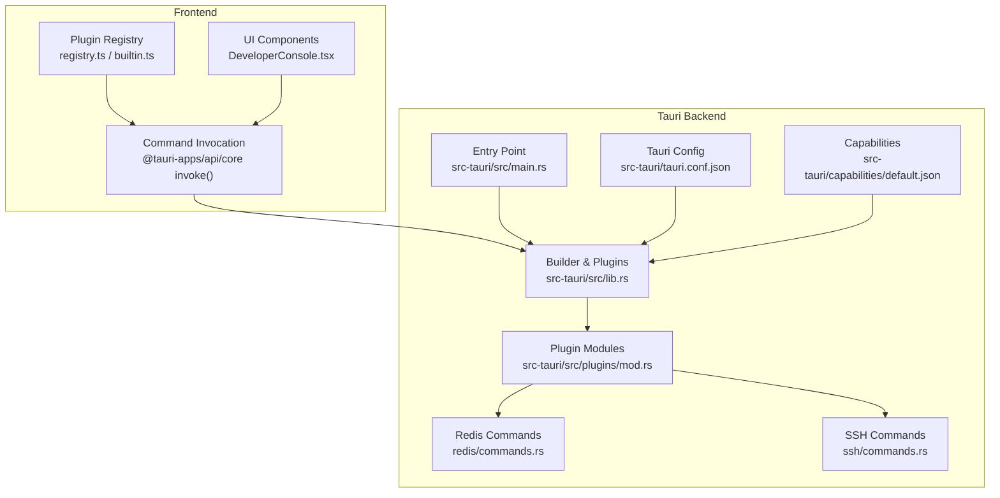
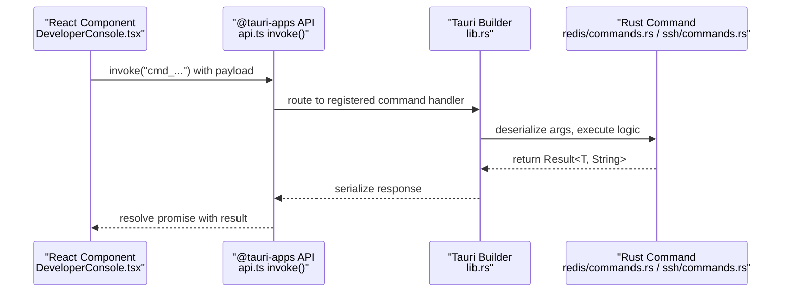
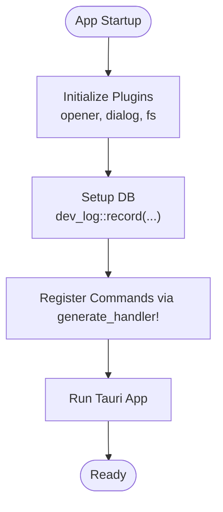
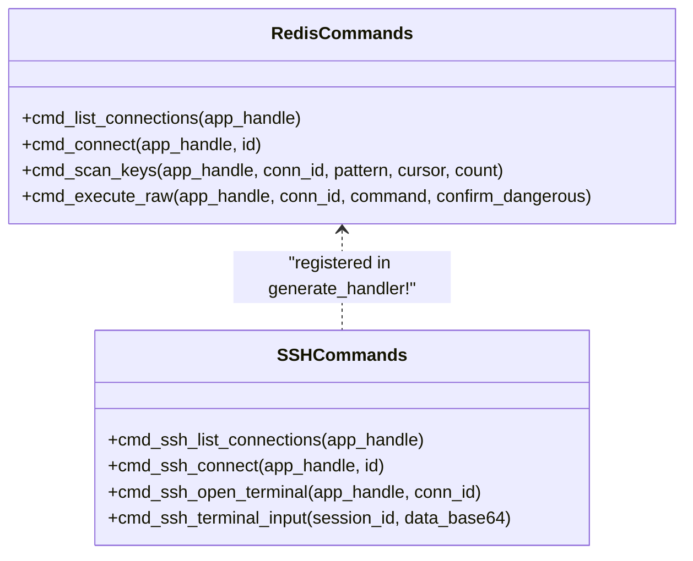
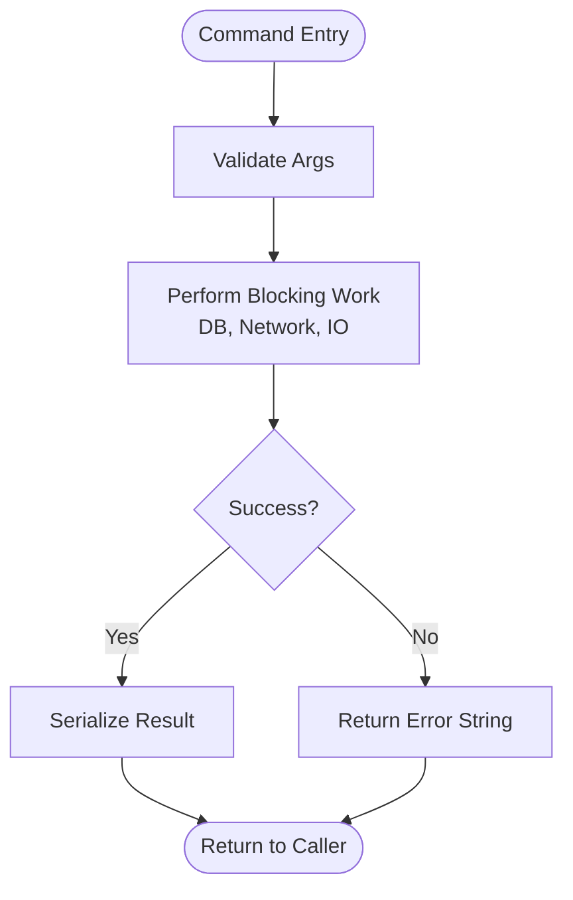
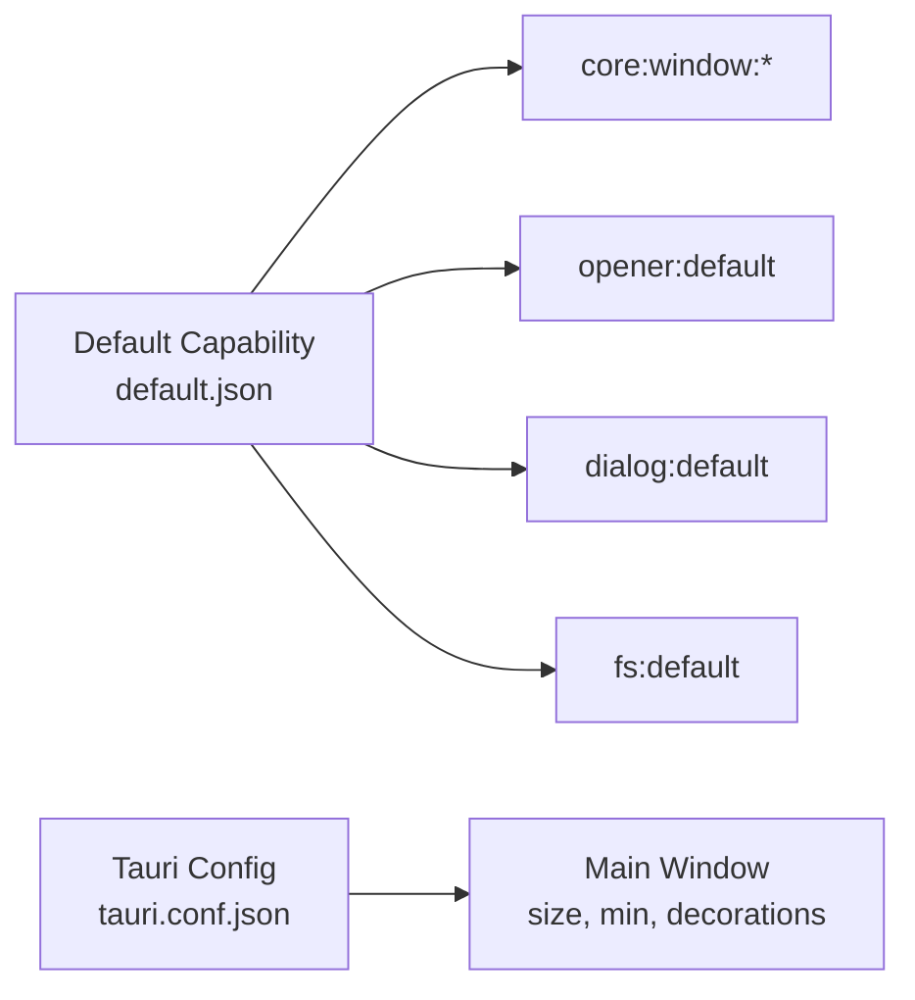
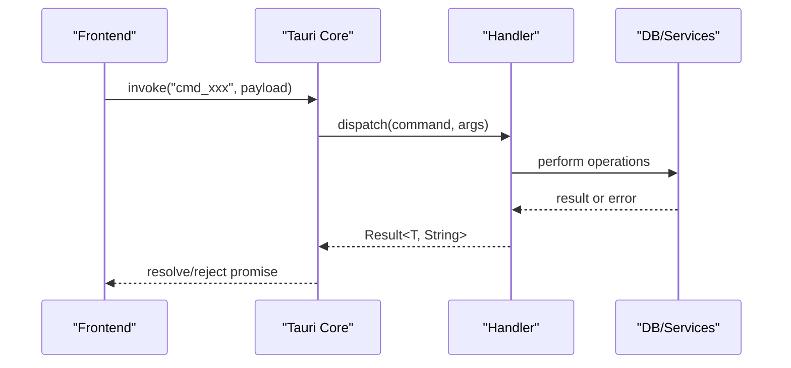
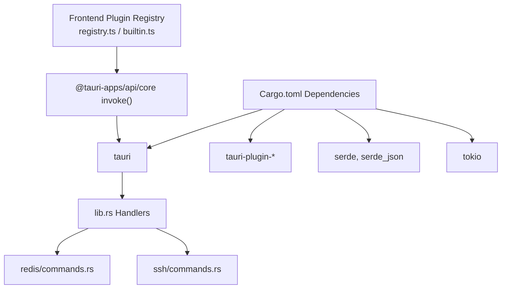
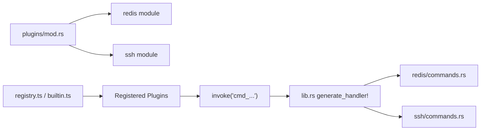

# Tauri Commands

<cite>
**Referenced Files in This Document**
- [main.rs](file://src-tauri/src/main.rs)
- [lib.rs](file://src-tauri/src/lib.rs)
- [tauri.conf.json](file://src-tauri/tauri.conf.json)
- [Cargo.toml](file://src-tauri/Cargo.toml)
- [default.json](file://src-tauri/capabilities/default.json)
- [plugins/mod.rs](file://src-tauri/src/plugins/mod.rs)
- [redis/commands.rs](file://src-tauri/src/plugins/redis/commands.rs)
- [ssh/commands.rs](file://src-tauri/src/plugins/ssh/commands.rs)
- [registry.ts](file://src/app/plugin-registry/registry.ts)
- [builtin.ts](file://src/app/plugin-registry/builtin.ts)
- [DeveloperConsole.tsx](file://src/app/developer-console/DeveloperConsole.tsx)
- [api.ts](file://src/app/developer-console/api.ts)
</cite>

## Table of Contents
1. [Introduction](#introduction)
2. [Project Structure](#project-structure)
3. [Core Components](#core-components)
4. [Architecture Overview](#architecture-overview)
5. [Detailed Component Analysis](#detailed-component-analysis)
6. [Dependency Analysis](#dependency-analysis)
7. [Performance Considerations](#performance-considerations)
8. [Troubleshooting Guide](#troubleshooting-guide)
9. [Conclusion](#conclusion)
10. [Appendices](#appendices)

## Introduction
This document explains RDMM’s Tauri command system for frontend-backend communication. It covers how commands are registered, how parameters are serialized and deserialized, how asynchronous operations are handled, and how the security model (capability-based permissions, window management, and IPC) governs access. It also documents the end-to-end command lifecycle, error propagation, response handling, and practical guidance for building robust commands, including long-running operations, debugging, performance optimization, and best practices. Finally, it clarifies the relationship between Tauri commands and the plugin system.

## Project Structure
RDMM organizes its Tauri backend under src-tauri with a central entrypoint and a modular plugin system. The frontend registers plugins and invokes commands via @tauri-apps/api. The Tauri configuration defines the main window and security policies. Capabilities define what the app can do by default.

**Diagram sources**
- [main.rs:4-7](file://src-tauri/src/main.rs#L4-L7)
- [lib.rs:10-263](file://src-tauri/src/lib.rs#L10-L263)
- [tauri.conf.json:1-39](file://src-tauri/tauri.conf.json#L1-L39)
- [default.json:1-18](file://src-tauri/capabilities/default.json#L1-L18)
- [plugins/mod.rs:1-11](file://src-tauri/src/plugins/mod.rs#L1-L11)
- [redis/commands.rs:1-1016](file://src-tauri/src/plugins/redis/commands.rs#L1-L1016)
- [ssh/commands.rs:1-266](file://src-tauri/src/plugins/ssh/commands.rs#L1-L266)
- [registry.ts:1-26](file://src/app/plugin-registry/registry.ts#L1-L26)
- [builtin.ts:1-31](file://src/app/plugin-registry/builtin.ts#L1-L31)
- [DeveloperConsole.tsx:1-132](file://src/app/developer-console/DeveloperConsole.tsx#L1-L132)

**Section sources**
- [main.rs:1-7](file://src-tauri/src/main.rs#L1-L7)
- [lib.rs:10-263](file://src-tauri/src/lib.rs#L10-L263)
- [tauri.conf.json:1-39](file://src-tauri/tauri.conf.json#L1-L39)
- [default.json:1-18](file://src-tauri/capabilities/default.json#L1-L18)
- [plugins/mod.rs:1-11](file://src-tauri/src/plugins/mod.rs#L1-L11)

## Core Components
- Command Registration: The Tauri Builder registers all Rust command handlers using generate_handler! and a comprehensive list of plugin commands.
- Parameter Serialization/Deserialization: Tauri automatically serializes/deserializes arguments and return values using serde. Complex types are supported via serde-compatible structs.
- Async Operations: Long-running tasks are executed in blocking contexts or via async pools; commands return immediately with results or errors.
- Security Model: Capability-based permissions restrict what commands and APIs are available per window; the default capability grants core window actions, opener, dialog, and fs permissions.
- Window Management: The main window is configured in tauri.conf.json with size, minimum sizes, and decorations.
- IPC Protocols: Frontend invokes commands via @tauri-apps/api/core invoke() and receives typed responses.

**Section sources**
- [lib.rs:26-259](file://src-tauri/src/lib.rs#L26-L259)
- [default.json:1-18](file://src-tauri/capabilities/default.json#L1-L18)
- [tauri.conf.json:13-22](file://src-tauri/tauri.conf.json#L13-L22)
- [Cargo.toml:20-49](file://src-tauri/Cargo.toml#L20-L49)

## Architecture Overview
The command pipeline flows from frontend React components to Tauri commands and back. The plugin system organizes domain-specific commands (e.g., Redis, SSH) under a unified registration surface.

**Diagram sources**
- [DeveloperConsole.tsx:15-22](file://src/app/developer-console/DeveloperConsole.tsx#L15-L22)
- [api.ts:5-11](file://src/app/developer-console/api.ts#L5-L11)
- [lib.rs:26-259](file://src-tauri/src/lib.rs#L26-L259)
- [redis/commands.rs:139-142](file://src-tauri/src/plugins/redis/commands.rs#L139-L142)
- [ssh/commands.rs:8-13](file://src-tauri/src/plugins/ssh/commands.rs#L8-L13)

## Detailed Component Analysis

### Command Registration and Handler Surface
- The backend initializes Tauri, registers plugins, sets up database, and wires a massive generate_handler! list of commands spanning Redis, SSH, S3, MongoDB, MySQL, MQ, Network, API Debugger, LAN Chat, and Confluence.
- The list enumerates fully qualified command paths for each plugin module.

**Diagram sources**
- [lib.rs:10-263](file://src-tauri/src/lib.rs#L10-L263)

**Section sources**
- [lib.rs:10-263](file://src-tauri/src/lib.rs#L10-L263)

### Parameter Serialization and Deserialization
- Tauri uses serde for automatic serialization/deserialization of command arguments and return values.
- Complex types are modeled as serde-compatible structs and enums in plugin command modules.

**Diagram sources**
- [redis/commands.rs:139-142](file://src-tauri/src/plugins/redis/commands.rs#L139-L142)
- [ssh/commands.rs:8-13](file://src-tauri/src/plugins/ssh/commands.rs#L8-L13)
- [lib.rs:26-259](file://src-tauri/src/lib.rs#L26-L259)

**Section sources**
- [Cargo.toml:25-26](file://src-tauri/Cargo.toml#L25-L26)
- [redis/commands.rs:139-142](file://src-tauri/src/plugins/redis/commands.rs#L139-L142)
- [ssh/commands.rs:8-13](file://src-tauri/src/plugins/ssh/commands.rs#L8-L13)

### Async Operation Handling
- Long-running operations (e.g., network latency checks, database queries, external service calls) are executed synchronously in command handlers. For heavy workloads, consider offloading to async pools or background tasks.
- Example patterns:
  - Latency test commands compute elapsed time and return durations.
  - Database-backed history and metadata retrieval use prepared statements and map results to typed structures.

**Diagram sources**
- [ssh/commands.rs:29-62](file://src-tauri/src/plugins/ssh/commands.rs#L29-L62)
- [redis/commands.rs:92-137](file://src-tauri/src/plugins/redis/commands.rs#L92-L137)

**Section sources**
- [ssh/commands.rs:29-62](file://src-tauri/src/plugins/ssh/commands.rs#L29-L62)
- [redis/commands.rs:92-137](file://src-tauri/src/plugins/redis/commands.rs#L92-L137)

### Security Model: Capabilities, Permissions, and Windows
- Capability-based permissions define what the app can do. The default capability grants core window actions, opener, dialog, and fs permissions for the main window.
- Tauri configuration controls window properties such as size, minimum dimensions, and decorations.

**Diagram sources**
- [default.json:1-18](file://src-tauri/capabilities/default.json#L1-L18)
- [tauri.conf.json:13-22](file://src-tauri/tauri.conf.json#L13-L22)

**Section sources**
- [default.json:1-18](file://src-tauri/capabilities/default.json#L1-L18)
- [tauri.conf.json:13-22](file://src-tauri/tauri.conf.json#L13-L22)

### Command Lifecycle: From Invocation to Execution
- Frontend: Components call invoke("cmd_...") with a payload. Responses are awaited and handled in UI callbacks.
- Backend: The Builder routes the command to the registered handler, which validates inputs, performs work, and returns a Result<T, String>.
- Error Propagation: Errors are returned as strings and surfaced to the frontend as rejections.

**Diagram sources**
- [api.ts:5-11](file://src/app/developer-console/api.ts#L5-L11)
- [lib.rs:26-259](file://src-tauri/src/lib.rs#L26-L259)
- [DeveloperConsole.tsx:15-22](file://src/app/developer-console/DeveloperConsole.tsx#L15-L22)

**Section sources**
- [api.ts:5-11](file://src/app/developer-console/api.ts#L5-L11)
- [DeveloperConsole.tsx:15-22](file://src/app/developer-console/DeveloperConsole.tsx#L15-L22)
- [lib.rs:26-259](file://src-tauri/src/lib.rs#L26-L259)

### Practical Examples

#### Implementing a Custom Command
- Define a #[tauri::command] function in a plugin module with serde-compatible parameters and return types.
- Add the command to the generate_handler! list in lib.rs.
- Invoke from frontend using @tauri-apps/api/core invoke().

References:
- [redis/commands.rs:139-142](file://src-tauri/src/plugins/redis/commands.rs#L139-L142)
- [ssh/commands.rs:8-13](file://src-tauri/src/plugins/ssh/commands.rs#L8-L13)
- [lib.rs:26-259](file://src-tauri/src/lib.rs#L26-L259)

#### Handling Complex Data Types
- Use serde-compatible structs/enums for complex inputs/outputs. The Redis command module demonstrates mapping heterogeneous Redis values to a unified enum-like structure for safe transport.

References:
- [redis/commands.rs:59-90](file://src-tauri/src/plugins/redis/commands.rs#L59-L90)

#### Managing Long-Running Operations
- Offload heavy work to background threads or async pools to avoid blocking the main thread. For network-bound operations, consider timeouts and cancellation where applicable.

References:
- [ssh/commands.rs:29-62](file://src-tauri/src/plugins/ssh/commands.rs#L29-L62)

### Debugging Techniques
- Developer Console: A hidden drawer listens to dev-log events and displays entries with level, scope, and message. It supports copying logs and clearing.
- Frontend API: Uses invoke() to list and clear dev logs.

References:
- [DeveloperConsole.tsx:10-131](file://src/app/developer-console/DeveloperConsole.tsx#L10-L131)
- [api.ts:5-11](file://src/app/developer-console/api.ts#L5-L11)

### Best Practices for Command Design
- Keep commands small and cohesive; favor composition over monolithic handlers.
- Validate inputs early; fail fast with descriptive errors.
- Use serde for type-safe serialization; keep payloads minimal.
- Prefer async pools for heavy work; avoid blocking the Tauri runtime.
- Centralize shared logic (e.g., DB connections, auth) in reusable modules.
- Document capabilities and permissions clearly; minimize granted privileges.

## Dependency Analysis
The backend depends on Tauri and several plugins. The frontend registers built-in plugins and invokes commands via @tauri-apps/api.

**Diagram sources**
- [Cargo.toml:20-49](file://src-tauri/Cargo.toml#L20-L49)
- [registry.ts:1-26](file://src/app/plugin-registry/registry.ts#L1-L26)
- [builtin.ts:1-31](file://src/app/plugin-registry/builtin.ts#L1-L31)
- [lib.rs:26-259](file://src-tauri/src/lib.rs#L26-L259)
- [redis/commands.rs:1-1016](file://src-tauri/src/plugins/redis/commands.rs#L1-L1016)
- [ssh/commands.rs:1-266](file://src-tauri/src/plugins/ssh/commands.rs#L1-L266)

**Section sources**
- [Cargo.toml:20-49](file://src-tauri/Cargo.toml#L20-L49)
- [registry.ts:1-26](file://src/app/plugin-registry/registry.ts#L1-L26)
- [builtin.ts:1-31](file://src/app/plugin-registry/builtin.ts#L1-L31)

## Performance Considerations
- Minimize payload sizes; prefer streaming or paginated results for large datasets.
- Use connection pooling for external services (e.g., Redis, SSH) to reduce overhead.
- Avoid synchronous I/O in hot paths; leverage async where feasible.
- Cache frequently accessed metadata and configuration to reduce repeated lookups.
- Monitor slowlog/history for expensive commands and optimize accordingly.

## Troubleshooting Guide
- Command not found: Verify the command is included in generate_handler! and the plugin module is compiled.
- Permission denied: Confirm the capability includes required permissions for the invoked action (e.g., fs, dialog, opener).
- Serialization errors: Ensure argument and return types are serde-compatible and match frontend expectations.
- Long-running commands: Move heavy work off the main thread; consider progress reporting or cancellation.

**Section sources**
- [lib.rs:26-259](file://src-tauri/src/lib.rs#L26-L259)
- [default.json:1-18](file://src-tauri/capabilities/default.json#L1-L18)

## Conclusion
RDMM’s Tauri command system provides a robust, capability-guarded bridge between frontend and backend. By registering commands centrally, leveraging serde for type-safe IPC, and enforcing permissions via capabilities, the system supports scalable plugin-driven functionality. Following the outlined patterns and best practices ensures maintainable, performant, and secure command implementations.

## Appendices

### Appendix A: Relationship Between Tauri Commands and the Plugin System
- Plugins are declared in a central module and exposed via the plugin registry in the frontend. Each plugin contributes a set of commands that are registered in the Tauri Builder.

**Diagram sources**
- [plugins/mod.rs:1-11](file://src-tauri/src/plugins/mod.rs#L1-L11)
- [registry.ts:1-26](file://src/app/plugin-registry/registry.ts#L1-L26)
- [builtin.ts:1-31](file://src/app/plugin-registry/builtin.ts#L1-L31)
- [lib.rs:26-259](file://src-tauri/src/lib.rs#L26-L259)
- [redis/commands.rs:1-1016](file://src-tauri/src/plugins/redis/commands.rs#L1-L1016)
- [ssh/commands.rs:1-266](file://src-tauri/src/plugins/ssh/commands.rs#L1-L266)