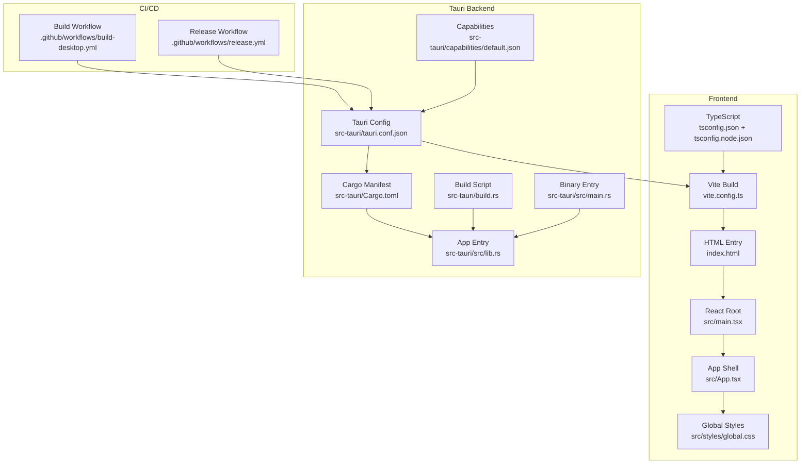
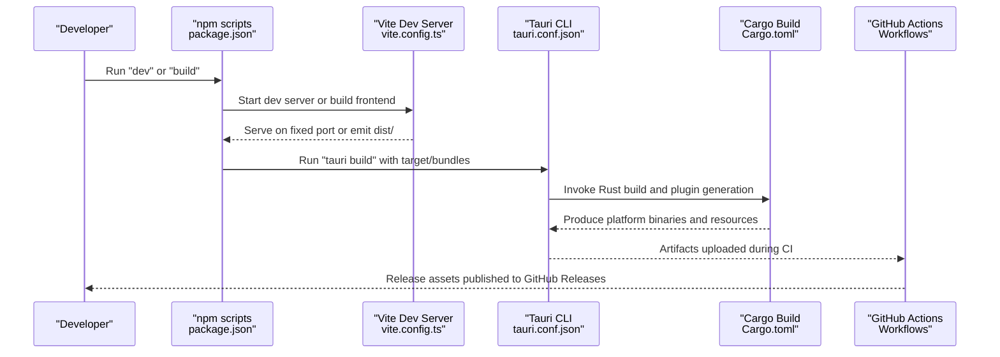
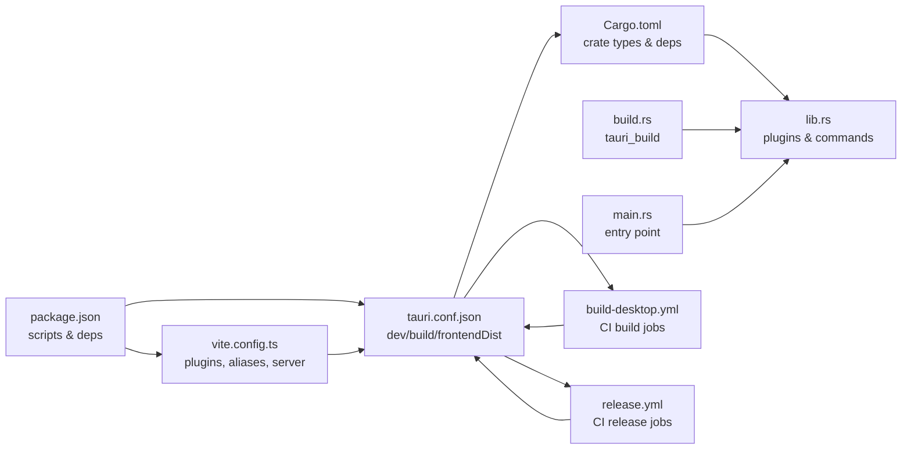

# Build and Deployment

<cite>
**Referenced Files in This Document**
- [package.json](file://package.json)
- [vite.config.ts](file://vite.config.ts)
- [tsconfig.json](file://tsconfig.json)
- [tsconfig.node.json](file://tsconfig.node.json)
- [src\vite-env.d.ts](file://src\vite-env.d.ts)
- [src-tauri\tauri.conf.json](file://src-tauri\tauri.conf.json)
- [src-tauri\Cargo.toml](file://src-tauri\Cargo.toml)
- [src-tauri\build.rs](file://src-tauri\build.rs)
- [src-tauri\src\main.rs](file://src-tauri\src\main.rs)
- [src-tauri\src\lib.rs](file://src-tauri\src\lib.rs)
- [src-tauri\capabilities\default.json](file://src-tauri\capabilities\default.json)
- [.github\workflows\build-desktop.yml](file://.github\workflows\build-desktop.yml)
- [.github\workflows\release.yml](file://.github\workflows\release.yml)
- [src\main.tsx](file://src\main.tsx)
- [src\App.tsx](file://src\App.tsx)
- [index.html](file://index.html)
- [src\styles\global.css](file://src\styles\global.css)
</cite>

## Table of Contents
1. [Introduction](#introduction)
2. [Project Structure](#project-structure)
3. [Core Components](#core-components)
4. [Architecture Overview](#architecture-overview)
5. [Detailed Component Analysis](#detailed-component-analysis)
6. [Dependency Analysis](#dependency-analysis)
7. [Performance Considerations](#performance-considerations)
8. [Troubleshooting Guide](#troubleshooting-guide)
9. [Conclusion](#conclusion)
10. [Appendices](#appendices)

## Introduction
This document explains RDMM’s build configuration and deployment processes with a focus on the development workflow and distribution pipeline. It covers the Vite build system, TypeScript setup, asset management, the Tauri build and packaging process, platform-specific compilation, CI/CD automation, testing, release management, optimization strategies, and troubleshooting. Practical examples demonstrate local development setup, cross-platform builds, and release distribution.

## Project Structure
RDMM is a Tauri 2 desktop application with a React + TypeScript frontend and a Rust backend. The build system integrates Vite for frontend bundling and Tauri for native packaging across Windows, macOS, and Linux.

**Diagram sources**
- [vite.config.ts:1-42](file://vite.config.ts#L1-L42)
- [tsconfig.json:1-30](file://tsconfig.json#L1-L30)
- [tsconfig.node.json:1-11](file://tsconfig.node.json#L1-L11)
- [index.html:1-15](file://index.html#L1-L15)
- [src\main.tsx:1-38](file://src\main.tsx#L1-L38)
- [src\App.tsx:1-11](file://src\App.tsx#L1-L11)
- [src\styles\global.css:1-973](file://src\styles\global.css#L1-L973)
- [src-tauri\tauri.conf.json:1-39](file://src-tauri\tauri.conf.json#L1-L39)
- [src-tauri\Cargo.toml:1-49](file://src-tauri\Cargo.toml#L1-L49)
- [src-tauri\build.rs:1-4](file://src-tauri\build.rs#L1-L4)
- [src-tauri\src\lib.rs:1-263](file://src-tauri\src\lib.rs#L1-L263)
- [src-tauri\src\main.rs:1-7](file://src-tauri\src\main.rs#L1-L7)
- [src-tauri\capabilities\default.json:1-18](file://src-tauri\capabilities\default.json#L1-L18)
- [.github\workflows\build-desktop.yml:1-142](file://.github\workflows\build-desktop.yml#L1-L142)
- [.github\workflows\release.yml:1-194](file://.github\workflows\release.yml#L1-L194)

**Section sources**
- [package.json:1-47](file://package.json#L1-L47)
- [vite.config.ts:1-42](file://vite.config.ts#L1-L42)
- [tsconfig.json:1-30](file://tsconfig.json#L1-L30)
- [tsconfig.node.json:1-11](file://tsconfig.node.json#L1-L11)
- [index.html:1-15](file://index.html#L1-L15)
- [src\main.tsx:1-38](file://src\main.tsx#L1-L38)
- [src\App.tsx:1-11](file://src\App.tsx#L1-L11)
- [src\styles\global.css:1-973](file://src\styles\global.css#L1-L973)
- [src-tauri\tauri.conf.json:1-39](file://src-tauri\tauri.conf.json#L1-L39)
- [src-tauri\Cargo.toml:1-49](file://src-tauri\Cargo.toml#L1-L49)
- [src-tauri\build.rs:1-4](file://src-tauri\build.rs#L1-L4)
- [src-tauri\src\lib.rs:1-263](file://src-tauri\src\lib.rs#L1-L263)
- [src-tauri\src\main.rs:1-7](file://src-tauri\src\main.rs#L1-L7)
- [src-tauri\capabilities\default.json:1-18](file://src-tauri\capabilities\default.json#L1-L18)
- [.github\workflows\build-desktop.yml:1-142](file://.github\workflows\build-desktop.yml#L1-L142)
- [.github\workflows\release.yml:1-194](file://.github\workflows\release.yml#L1-L194)

## Core Components
- Frontend build and dev server powered by Vite with React plugin and TypeScript support.
- TypeScript configuration for both browser and Node environments.
- Tauri configuration orchestrating dev/build URLs, bundling, and capability permissions.
- Rust backend with Cargo-managed dependencies and Tauri plugins.
- GitHub Actions workflows automating desktop builds and releases across platforms.

Key build scripts and entry points:
- Scripts: dev, build, lint, test, preview, tauri.
- Vite dev server port and HMR configuration for Tauri integration.
- Tauri dev URL and frontend build output path.
- Rust crate types and plugin registrations.

**Section sources**
- [package.json:6-14](file://package.json#L6-L14)
- [vite.config.ts:9-42](file://vite.config.ts#L9-L42)
- [tsconfig.json:2-26](file://tsconfig.json#L2-L26)
- [tsconfig.node.json:2-8](file://tsconfig.node.json#L2-L8)
- [src-tauri\tauri.conf.json:6-11](file://src-tauri\tauri.conf.json#L6-L11)
- [src-tauri\Cargo.toml:10-15](file://src-tauri\Cargo.toml#L10-L15)
- [src-tauri\src\lib.rs:9-263](file://src-tauri\src\lib.rs#L9-L263)

## Architecture Overview
The build and deployment pipeline connects the frontend and backend through Tauri, with CI/CD workflows generating platform-specific installers and distributing them via GitHub Releases.

**Diagram sources**
- [package.json:6-14](file://package.json#L6-L14)
- [vite.config.ts:25-40](file://vite.config.ts#L25-L40)
- [src-tauri\tauri.conf.json:6-11](file://src-tauri\tauri.conf.json#L6-L11)
- [src-tauri\Cargo.toml:17-49](file://src-tauri\Cargo.toml#L17-L49)
- [.github\workflows\build-desktop.yml:31-33](file://.github\workflows\build-desktop.yml#L31-L33)
- [.github\workflows\release.yml:30-31](file://.github\workflows\release.yml#L30-L31)

## Detailed Component Analysis

### Vite Build System and Asset Management
- Fixed dev server port and strict port enforcement for Tauri integration.
- HMR configuration supports remote host when developing with Tauri.
- Path aliases enable concise imports from the src directory.
- Test configuration targets test files under tests/.
- Vite ignores src-tauri to avoid unnecessary reloads during Rust development.

Asset and entry points:
- HTML entry defines the root element and script module.
- Global CSS establishes layout and theming for the app.
- React root initializes plugins, theme, and the App shell.

Optimization and bundling:
- Use Vite’s built-in code splitting and lazy loading for plugin-heavy UI.
- Keep static assets under public or import them to leverage Vite’s asset handling.

**Section sources**
- [vite.config.ts:9-42](file://vite.config.ts#L9-L42)
- [index.html:1-15](file://index.html#L1-L15)
- [src\styles\global.css:1-973](file://src\styles\global.css#L1-L973)
- [src\main.tsx:1-38](file://src\main.tsx#L1-L38)
- [src\App.tsx:1-11](file://src\App.tsx#L1-L11)

### TypeScript Setup
- Browser-side TS config targets ES2020, uses bundler module resolution, and JSX with react-jsx.
- Node-side TS config enables bundler resolution for Vite config.
- Strictness and unused checks improve code quality.

Best practices:
- Keep tsconfig.json aligned with Vite’s bundler mode.
- Add path aliases consistently to reduce relative imports.

**Section sources**
- [tsconfig.json:2-26](file://tsconfig.json#L2-L26)
- [tsconfig.node.json:2-8](file://tsconfig.node.json#L2-L8)
- [src\vite-env.d.ts:1-2](file://src\vite-env.d.ts#L1-L2)

### Tauri Build and Packaging
- Tauri configuration:
  - Dev command invokes npm run dev; dev URL set to Vite’s fixed port.
  - FrontendDist points to Vite’s emitted dist folder.
  - Window defaults and CSP policy configured.
  - Bundling enabled for all targets with icon assets.
- Rust backend:
  - Crate types include staticlib, cdylib, rlib for flexibility.
  - Plugins registered at startup (opener, dialog, fs).
  - Command handlers enumerate all plugin commands.
- Build script delegates to tauri_build.

Platform-specific notes:
- CI workflows compile for Windows (NSIS), macOS (universal app/dmg), and Linux (deb/AppImage).
- macOS builds target x86_64 and aarch64 runners.

**Section sources**
- [src-tauri\tauri.conf.json:1-39](file://src-tauri\tauri.conf.json#L1-L39)
- [src-tauri\Cargo.toml:10-15](file://src-tauri\Cargo.toml#L10-L15)
- [src-tauri\src\lib.rs:9-263](file://src-tauri\src\lib.rs#L9-L263)
- [src-tauri\build.rs:1-4](file://src-tauri\build.rs#L1-L4)

### CI/CD Workflows
- Desktop build workflow:
  - Windows: builds NSIS installer and uploads artifacts.
  - macOS: builds universal app/dmg per matrix; uploads app and dmg artifacts.
  - Linux: installs system deps, builds deb and AppImage, uploads artifacts.
- Release workflow:
  - Mirrors desktop build steps and additionally packages a Windows portable zip.
  - Downloads all artifacts and publishes a GitHub Release with release notes.
  - Triggers downstream documentation site rebuild via dispatch.

Automated testing:
- Vitest configured for unit tests under tests/.

**Section sources**
- [.github\workflows\build-desktop.yml:1-142](file://.github\workflows\build-desktop.yml#L1-L142)
- [.github\workflows\release.yml:1-194](file://.github\workflows\release.yml#L1-L194)
- [package.json:16-12](file://package.json#L16-L12)

### Local Development Setup
- Install dependencies: npm ci
- Start dev server and Tauri dev: npm run dev
- Preview production build locally: npm run preview
- Run tests: npm run test or npm run test:watch

Notes:
- Vite runs on a fixed port to satisfy Tauri dev expectations.
- HMR is enabled when a remote host is specified for Tauri dev.

**Section sources**
- [package.json:6-14](file://package.json#L6-L14)
- [vite.config.ts:25-40](file://vite.config.ts#L25-L40)

### Building for Different Platforms
- Windows:
  - Use NSIS bundle: npm run tauri build -- --bundles nsis
- macOS:
  - Universal build: npm run tauri build -- --target x86_64-apple-darwin,aarch64-apple-darwin --bundles app,dmg
- Linux:
  - deb and AppImage: npm run tauri build -- --bundles deb,appimage

System dependencies (Linux):
- WebKit GTK, GTK3, AppIndicator, RSVG, curl, patchelf installed before building.

**Section sources**
- [.github\workflows\build-desktop.yml:31-33](file://.github\workflows\build-desktop.yml#L31-L33)
- [.github\workflows\build-desktop.yml:72-73](file://.github\workflows\build-desktop.yml#L72-L73)
- [.github\workflows\build-desktop.yml:126-127](file://.github\workflows\build-desktop.yml#L126-L127)
- [.github\workflows\release.yml:30-31](file://.github\workflows\release.yml#L30-L31)
- [.github\workflows\release.yml:93-94](file://.github\workflows\release.yml#L93-L94)
- [.github\workflows\release.yml:139-140](file://.github\workflows\release.yml#L139-L140)

### Deploying Releases
- Tag a semantic version (e.g., v0.x.y) to trigger the release workflow.
- The workflow builds all platforms, packages Windows portable zip, collects artifacts, and creates a GitHub Release.
- Release notes are taken from docs/releases/<tag>.md.

Distribution channels:
- GitHub Releases hosting installers and portable archives.
- Downstream documentation site rebuild triggered post-release.

**Section sources**
- [.github\workflows\release.yml:3-7](file://.github\workflows\release.yml#L3-L7)
- [.github\workflows\release.yml:166-178](file://.github\workflows\release.yml#L166-L178)
- [.github\workflows\release.yml:179-194](file://.github\workflows\release.yml#L179-L194)

### Security and Permissions
- Tauri capabilities define permissions for the main window, including window controls and default plugins.
- These are embedded and validated during Tauri build.

**Section sources**
- [src-tauri\capabilities\default.json:1-18](file://src-tauri\capabilities\default.json#L1-L18)

## Dependency Analysis
The build pipeline couples frontend and backend through Tauri configuration and scripts. The following diagram highlights key dependencies and their roles.

**Diagram sources**
- [package.json:6-14](file://package.json#L6-L14)
- [vite.config.ts:9-42](file://vite.config.ts#L9-L42)
- [src-tauri\tauri.conf.json:6-11](file://src-tauri\tauri.conf.json#L6-L11)
- [src-tauri\Cargo.toml:10-15](file://src-tauri\Cargo.toml#L10-L15)
- [src-tauri\src\lib.rs:9-263](file://src-tauri\src\lib.rs#L9-L263)
- [src-tauri\src\main.rs:1-7](file://src-tauri\src\main.rs#L1-L7)
- [src-tauri\build.rs:1-4](file://src-tauri\build.rs#L1-L4)
- [.github\workflows\build-desktop.yml:31-33](file://.github\workflows\build-desktop.yml#L31-L33)
- [.github\workflows\release.yml:30-31](file://.github\workflows\release.yml#L30-L31)

**Section sources**
- [package.json:6-14](file://package.json#L6-L14)
- [vite.config.ts:9-42](file://vite.config.ts#L9-L42)
- [src-tauri\tauri.conf.json:6-11](file://src-tauri\tauri.conf.json#L6-L11)
- [src-tauri\Cargo.toml:10-15](file://src-tauri\Cargo.toml#L10-L15)
- [src-tauri\src\lib.rs:9-263](file://src-tauri\src\lib.rs#L9-L263)
- [src-tauri\src\main.rs:1-7](file://src-tauri\src\main.rs#L1-L7)
- [src-tauri\build.rs:1-4](file://src-tauri\build.rs#L1-L4)
- [.github\workflows\build-desktop.yml:31-33](file://.github\workflows\build-desktop.yml#L31-L33)
- [.github\workflows\release.yml:30-31](file://.github\workflows\release.yml#L30-L31)

## Performance Considerations
- Bundle size management:
  - Prefer dynamic imports for plugin routes and heavy components.
  - Split vendor and app code using Vite’s code splitting.
  - Audit third-party dependencies and remove unused ones.
- Asset optimization:
  - Inline small assets, defer large assets.
  - Use appropriate image formats and sizes.
- Build performance:
  - Use npm ci for deterministic installs.
  - Cache node_modules and Cargo registries in CI.
- Runtime performance:
  - Minimize synchronous work on the main thread.
  - Offload heavy tasks to background threads or Rust plugins.

[No sources needed since this section provides general guidance]

## Troubleshooting Guide
Common issues and resolutions:
- Vite dev server port conflicts:
  - Ensure strictPort is true and the port is free; Tauri requires a fixed port.
- HMR not working with remote host:
  - Set TAURI_DEV_HOST to the host IP so Vite HMR uses ws protocol with the configured host and port.
- Tauri dev URL mismatch:
  - Confirm devUrl matches Vite’s port and that beforeDevCommand runs the frontend build.
- Linux build failures:
  - Install required system dependencies before running the build.
- Capability permission errors:
  - Verify permissions in capabilities/default.json match intended plugin usage.
- CI release missing artifacts:
  - Check artifact upload paths and ensure build steps produce the expected files.

**Section sources**
- [vite.config.ts:25-40](file://vite.config.ts#L25-L40)
- [src-tauri\tauri.conf.json:6-11](file://src-tauri\tauri.conf.json#L6-L11)
- [.github\workflows\build-desktop.yml:112-121](file://.github\workflows\build-desktop.yml#L112-L121)
- [src-tauri\capabilities\default.json:6-16](file://src-tauri\capabilities\default.json#L6-L16)

## Conclusion
RDMM’s build and deployment pipeline integrates Vite, TypeScript, and Tauri to deliver a robust development and distribution workflow. The CI/CD processes automate cross-platform builds and releases, while the Tauri configuration and Rust backend provide secure, extensible capabilities. Following the optimization and troubleshooting guidance ensures reliable builds and smooth deployments.

[No sources needed since this section summarizes without analyzing specific files]

## Appendices

### Practical Examples

- Local development
  - Install dependencies: npm ci
  - Start dev: npm run dev
  - Preview build: npm run preview
  - Run tests: npm run test

- Cross-platform builds
  - Windows: npm run tauri build -- --bundles nsis
  - macOS: npm run tauri build -- --target x86_64-apple-darwin,aarch64-apple-darwin --bundles app,dmg
  - Linux: npm run tauri build -- --bundles deb,appimage

- Release process
  - Tag a version (e.g., v0.x.y) to trigger release workflow.
  - Review artifacts uploaded to GitHub Releases.

**Section sources**
- [package.json:6-14](file://package.json#L6-L14)
- [.github\workflows\build-desktop.yml:31-33](file://.github\workflows\build-desktop.yml#L31-L33)
- [.github\workflows\build-desktop.yml:72-73](file://.github\workflows\build-desktop.yml#L72-L73)
- [.github\workflows\build-desktop.yml:126-127](file://.github\workflows\build-desktop.yml#L126-L127)
- [.github\workflows\release.yml:30-31](file://.github\workflows\release.yml#L30-L31)
- [.github\workflows\release.yml:93-94](file://.github\workflows\release.yml#L93-L94)
- [.github\workflows\release.yml:139-140](file://.github\workflows\release.yml#L139-L140)