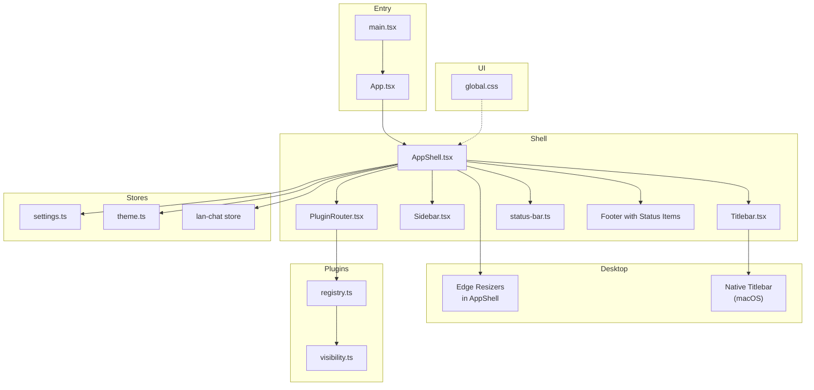
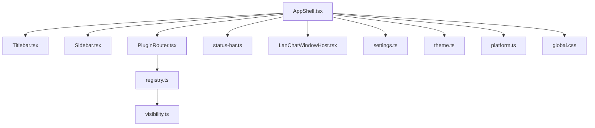
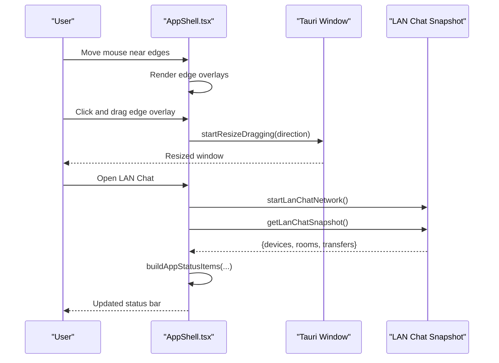
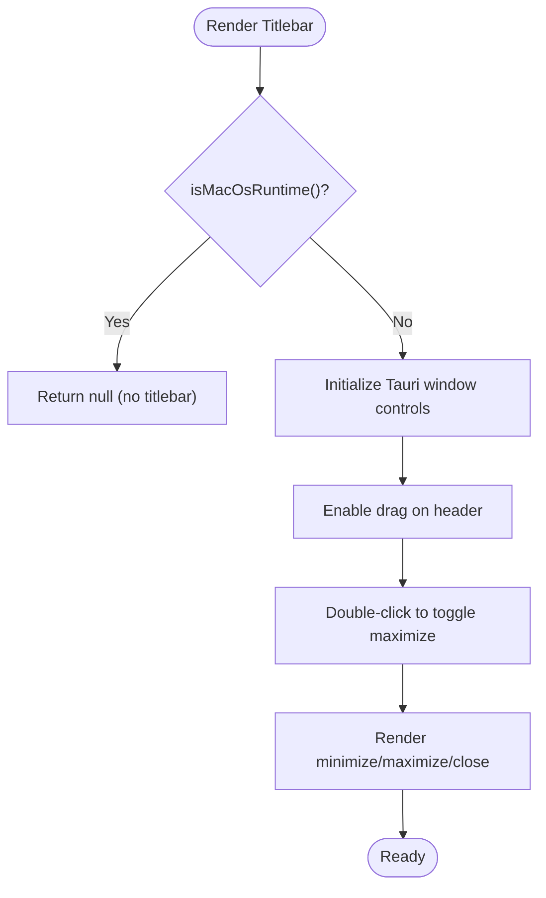
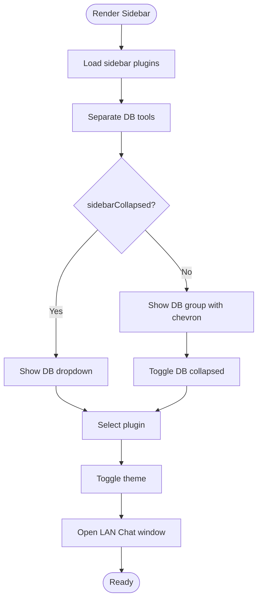
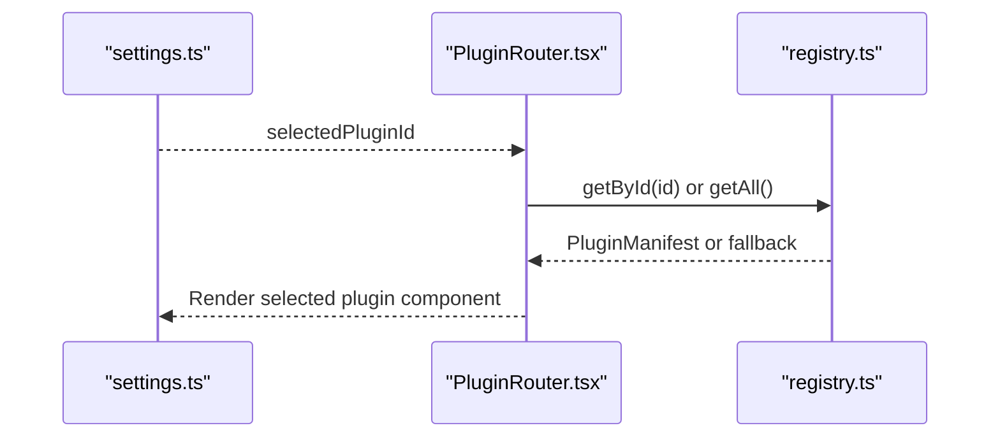
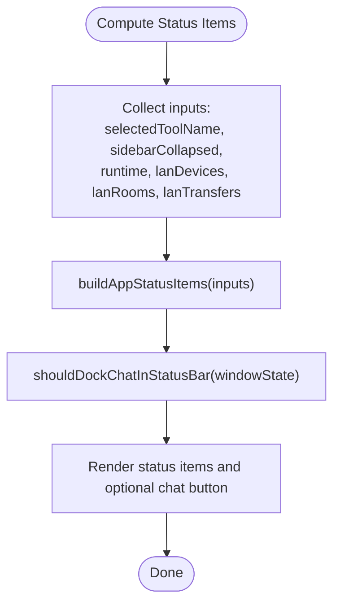
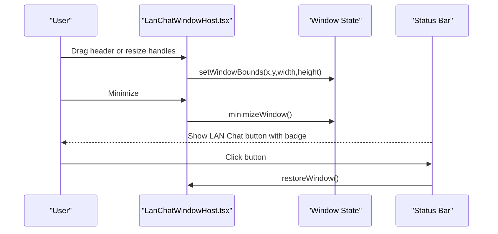
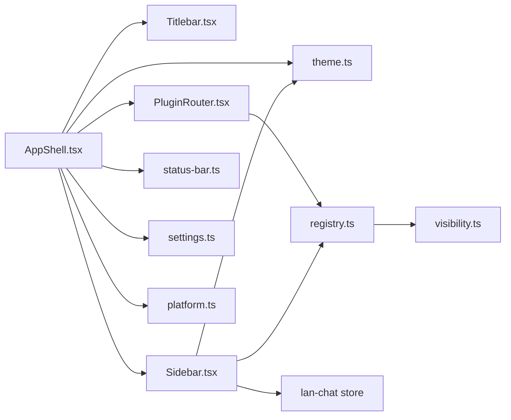

# Application Shell

<cite>
**Referenced Files in This Document**
- [AppShell.tsx](file://src/app/layout/AppShell.tsx)
- [Sidebar.tsx](file://src/app/layout/Sidebar.tsx)
- [Titlebar.tsx](file://src/app/layout/Titlebar.tsx)
- [status-bar.ts](file://src/app/layout/status-bar.ts)
- [PluginRouter.tsx](file://src/app/plugin-registry/PluginRouter.tsx)
- [registry.ts](file://src/app/plugin-registry/registry.ts)
- [visibility.ts](file://src/app/plugin-registry/visibility.ts)
- [platform.ts](file://src/app/runtime/platform.ts)
- [settings.ts](file://src/app/store/settings.ts)
- [theme.ts](file://src/app/store/theme.ts)
- [LanChatWindowHost.tsx](file://src/plugins/lan-chat/components/LanChatWindowHost.tsx)
- [App.tsx](file://src/App.tsx)
- [main.tsx](file://src/main.tsx)
- [global.css](file://src/styles/global.css)
</cite>

## Table of Contents
1. [Introduction](#introduction)
2. [Project Structure](#project-structure)
3. [Core Components](#core-components)
4. [Architecture Overview](#architecture-overview)
5. [Detailed Component Analysis](#detailed-component-analysis)
6. [Dependency Analysis](#dependency-analysis)
7. [Performance Considerations](#performance-considerations)
8. [Troubleshooting Guide](#troubleshooting-guide)
9. [Conclusion](#conclusion)
10. [Appendices](#appendices)

## Introduction
This document explains RDMM’s application shell system with a focus on the main layout container and desktop window management. It covers the AppShell component architecture built on Ant Design Layout, the sidebar integration, the plugin routing system, the title bar behavior across platforms, the status bar with real-time system information and LAN chat integration, and practical guidance for customizing the layout, managing window resizing with edge overlays, and implementing cross-platform desktop features. Accessibility and responsive design patterns are addressed alongside integration with the plugin architecture.

## Project Structure
The application shell is centered around a top-level React component that composes the Ant Design Layout, a draggable title bar for non-macOS desktop builds, a collapsible sidebar, a plugin router for dynamic content, a status bar, and a LAN chat overlay window. Global CSS defines layout and theming variables.

**Diagram sources**
- [main.tsx:12-31](file://src/main.tsx#L12-L31)
- [App.tsx:4-10](file://src/App.tsx#L4-L10)
- [AppShell.tsx:31-206](file://src/app/layout/AppShell.tsx#L31-L206)
- [Titlebar.tsx:12-74](file://src/app/layout/Titlebar.tsx#L12-L74)
- [Sidebar.tsx:21-176](file://src/app/layout/Sidebar.tsx#L21-L176)
- [PluginRouter.tsx:7-28](file://src/app/plugin-registry/PluginRouter.tsx#L7-L28)
- [status-bar.ts:15-28](file://src/app/layout/status-bar.ts#L15-L28)
- [registry.ts:3-25](file://src/app/plugin-registry/registry.ts#L3-L25)
- [visibility.ts:3-5](file://src/app/plugin-registry/visibility.ts#L3-L5)
- [settings.ts:13-27](file://src/app/store/settings.ts#L13-L27)
- [theme.ts:12-26](file://src/app/store/theme.ts#L12-L26)
- [global.css:36-101](file://src/styles/global.css#L36-L101)

**Section sources**
- [main.tsx:12-31](file://src/main.tsx#L12-L31)
- [App.tsx:4-10](file://src/App.tsx#L4-L10)
- [global.css:36-101](file://src/styles/global.css#L36-L101)

## Core Components
- AppShell orchestrates the main layout, integrates the title bar, sidebar, plugin content area, footer status bar, LAN chat overlay, and desktop edge resize overlays. It computes status items and decides whether to dock LAN chat in the status bar.
- Sidebar renders plugin navigation groups, handles collapse/expand, toggles dark/light mode, and exposes LAN chat quick access with unread indicators.
- Titlebar provides draggable header and window controls for non-macOS desktop builds; macOS uses native title bar.
- PluginRouter selects and renders the active plugin component based on the settings store.
- Status bar displays runtime diagnostics and LAN chat metrics.
- Stores manage UI state (sidebar, selected plugin, theme) and integrate with the LAN chat plugin.

**Section sources**
- [AppShell.tsx:31-206](file://src/app/layout/AppShell.tsx#L31-L206)
- [Sidebar.tsx:21-176](file://src/app/layout/Sidebar.tsx#L21-L176)
- [Titlebar.tsx:12-74](file://src/app/layout/Titlebar.tsx#L12-L74)
- [PluginRouter.tsx:7-28](file://src/app/plugin-registry/PluginRouter.tsx#L7-L28)
- [status-bar.ts:15-28](file://src/app/layout/status-bar.ts#L15-L28)
- [settings.ts:13-27](file://src/app/store/settings.ts#L13-L27)
- [theme.ts:12-26](file://src/app/store/theme.ts#L12-L26)

## Architecture Overview
The shell follows a layered pattern:
- Presentation layer: AppShell, Titlebar, Sidebar, PluginRouter, Status bar.
- State layer: Zustand stores for settings, theme, and LAN chat.
- Platform/runtime layer: Tauri APIs and macOS detection.
- Plugin layer: Registry and visibility filters.

**Diagram sources**
- [AppShell.tsx:31-206](file://src/app/layout/AppShell.tsx#L31-L206)
- [Titlebar.tsx:12-74](file://src/app/layout/Titlebar.tsx#L12-L74)
- [Sidebar.tsx:21-176](file://src/app/layout/Sidebar.tsx#L21-L176)
- [PluginRouter.tsx:7-28](file://src/app/plugin-registry/PluginRouter.tsx#L7-L28)
- [registry.ts:3-25](file://src/app/plugin-registry/registry.ts#L3-L25)
- [visibility.ts:3-5](file://src/app/plugin-registry/visibility.ts#L3-L5)
- [settings.ts:13-27](file://src/app/store/settings.ts#L13-L27)
- [theme.ts:12-26](file://src/app/store/theme.ts#L12-L26)
- [platform.ts:1-9](file://src/app/runtime/platform.ts#L1-L9)
- [global.css:36-101](file://src/styles/global.css#L36-L101)

## Detailed Component Analysis

### AppShell: Main Layout Container
AppShell composes the Ant Design Layout with:
- A conditional native title bar class for macOS.
- Edge overlays for window resizing on desktop builds.
- Titlebar, Sidebar, PluginRouter, Developer Console, and Footer with status items.
- LAN Chat window host and status bar integration.

Key behaviors:
- Desktop runtime detection and native title bar flagging.
- Edge resize overlays mapped to directional cursors and Tauri window dragging.
- Status items computed from selected plugin, sidebar state, runtime, and LAN chat snapshot.
- LAN chat monitoring via periodic snapshots and unread counters.

**Diagram sources**
- [AppShell.tsx:94-145](file://src/app/layout/AppShell.tsx#L94-L145)
- [AppShell.tsx:45-56](file://src/app/layout/AppShell.tsx#L45-L56)
- [AppShell.tsx:59-92](file://src/app/layout/AppShell.tsx#L59-L92)

**Section sources**
- [AppShell.tsx:31-206](file://src/app/layout/AppShell.tsx#L31-L206)
- [status-bar.ts:15-28](file://src/app/layout/status-bar.ts#L15-L28)

### Titlebar: Cross-Platform Window Controls
Titlebar provides:
- Draggable region to move the window (non-macOS).
- Double-click to maximize/minimize.
- Minimize, maximize, and close buttons using Tauri APIs.
- No title bar on macOS; relies on native macOS title bar.

**Diagram sources**
- [Titlebar.tsx:12-74](file://src/app/layout/Titlebar.tsx#L12-L74)
- [platform.ts:1-9](file://src/app/runtime/platform.ts#L1-L9)

**Section sources**
- [Titlebar.tsx:12-74](file://src/app/layout/Titlebar.tsx#L12-L74)
- [platform.ts:1-9](file://src/app/runtime/platform.ts#L1-L9)

### Sidebar: Navigation and Utilities
Sidebar organizes plugins into groups:
- Top-level plugins and a database tools group with nested items.
- Collapsible sections and active selection highlighting.
- Utility buttons for LAN Chat and theme toggle with unread badges.

Responsive behavior:
- Collapsed mode reduces width and shows icons-only with tooltips.
- Nested plugin buttons adjust padding and typography.

**Diagram sources**
- [Sidebar.tsx:21-176](file://src/app/layout/Sidebar.tsx#L21-L176)
- [visibility.ts:3-5](file://src/app/plugin-registry/visibility.ts#L3-L5)
- [registry.ts:13-21](file://src/app/plugin-registry/registry.ts#L13-L21)

**Section sources**
- [Sidebar.tsx:21-176](file://src/app/layout/Sidebar.tsx#L21-L176)
- [settings.ts:13-27](file://src/app/store/settings.ts#L13-L27)
- [theme.ts:12-26](file://src/app/store/theme.ts#L12-L26)

### Plugin Router: Dynamic Content Routing
PluginRouter selects the active plugin component based on the settings store, falling back to the first registered plugin if none is selected.

**Diagram sources**
- [PluginRouter.tsx:7-28](file://src/app/plugin-registry/PluginRouter.tsx#L7-L28)
- [registry.ts:13-21](file://src/app/plugin-registry/registry.ts#L13-L21)
- [settings.ts:13-27](file://src/app/store/settings.ts#L13-L27)

**Section sources**
- [PluginRouter.tsx:7-28](file://src/app/plugin-registry/PluginRouter.tsx#L7-L28)
- [registry.ts:13-21](file://src/app/plugin-registry/registry.ts#L13-L21)

### Status Bar: Real-Time System Information
The status bar aggregates:
- Selected tool name.
- Sidebar collapsed state.
- Runtime environment (desktop or browser).
- LAN devices, rooms, and transfers.

It also decides whether to dock LAN Chat in the status bar based on window state.

**Diagram sources**
- [status-bar.ts:15-28](file://src/app/layout/status-bar.ts#L15-L28)
- [AppShell.tsx:45-56](file://src/app/layout/AppShell.tsx#L45-L56)
- [AppShell.tsx:57-57](file://src/app/layout/AppShell.tsx#L57-L57)

**Section sources**
- [status-bar.ts:15-28](file://src/app/layout/status-bar.ts#L15-L28)
- [AppShell.tsx:45-56](file://src/app/layout/AppShell.tsx#L45-L56)

### LAN Chat Overlay: Desktop Window Management
The LAN Chat window is a floating overlay with:
- Draggable header and resize handles for window and panes.
- Conversation list, chat area, and member/transfers panels.
- Minimization to docked status and restoration via status bar.

**Diagram sources**
- [LanChatWindowHost.tsx:67-176](file://src/plugins/lan-chat/components/LanChatWindowHost.tsx#L67-L176)
- [LanChatWindowHost.tsx:221-239](file://src/plugins/lan-chat/components/LanChatWindowHost.tsx#L221-L239)
- [AppShell.tsx:188-200](file://src/app/layout/AppShell.tsx#L188-L200)

**Section sources**
- [LanChatWindowHost.tsx:67-176](file://src/plugins/lan-chat/components/LanChatWindowHost.tsx#L67-L176)
- [LanChatWindowHost.tsx:221-239](file://src/plugins/lan-chat/components/LanChatWindowHost.tsx#L221-L239)
- [AppShell.tsx:188-200](file://src/app/layout/AppShell.tsx#L188-L200)

## Dependency Analysis
- AppShell depends on:
  - Ant Design components and Tauri APIs for window management.
  - Sidebar and PluginRouter for content composition.
  - Status bar utilities for runtime diagnostics.
  - Settings and theme stores for UI state.
  - LAN chat plugin for chat integration and monitoring.
- Sidebar depends on:
  - Plugin registry and visibility filters.
  - Theme store for mode toggle.
  - LAN chat store for unread counts.
- PluginRouter depends on:
  - Registry for manifest resolution.
  - Settings store for selection.

**Diagram sources**
- [AppShell.tsx:31-206](file://src/app/layout/AppShell.tsx#L31-L206)
- [Titlebar.tsx:12-74](file://src/app/layout/Titlebar.tsx#L12-L74)
- [Sidebar.tsx:21-176](file://src/app/layout/Sidebar.tsx#L21-L176)
- [PluginRouter.tsx:7-28](file://src/app/plugin-registry/PluginRouter.tsx#L7-L28)
- [registry.ts:3-25](file://src/app/plugin-registry/registry.ts#L3-L25)
- [visibility.ts:3-5](file://src/app/plugin-registry/visibility.ts#L3-L5)
- [settings.ts:13-27](file://src/app/store/settings.ts#L13-L27)
- [theme.ts:12-26](file://src/app/store/theme.ts#L12-L26)
- [platform.ts:1-9](file://src/app/runtime/platform.ts#L1-L9)

**Section sources**
- [AppShell.tsx:31-206](file://src/app/layout/AppShell.tsx#L31-L206)
- [PluginRouter.tsx:7-28](file://src/app/plugin-registry/PluginRouter.tsx#L7-L28)
- [registry.ts:3-25](file://src/app/plugin-registry/registry.ts#L3-L25)

## Performance Considerations
- Prefer memoization for derived status items to avoid unnecessary re-renders.
- Debounce or throttle frequent polling for LAN chat snapshots.
- Use CSS containment and isolation for heavy plugin content areas.
- Minimize DOM nodes in the title bar and status bar for smooth scrolling and interactions.
- Avoid excessive re-computation in edge overlay handlers; cache computed cursors and directions.

## Troubleshooting Guide
Common issues and remedies:
- Native title bar not appearing on macOS:
  - Verify macOS runtime detection and ensure the layout class enables native title bar.
- Window controls not responding:
  - Confirm Tauri window initialization and that the title bar is rendered only when not on macOS.
- Sidebar not updating selections:
  - Ensure settings store updates propagate and that plugin visibility filtering is applied.
- LAN chat unread counters not resetting:
  - Verify conversation activation clears unread state and timers are cleared on unmount.
- Status bar not reflecting runtime:
  - Confirm desktop runtime detection and that status items rebuild when inputs change.

**Section sources**
- [platform.ts:1-9](file://src/app/runtime/platform.ts#L1-L9)
- [AppShell.tsx:45-56](file://src/app/layout/AppShell.tsx#L45-L56)
- [Sidebar.tsx:40-41](file://src/app/layout/Sidebar.tsx#L40-L41)
- [LanChatWindowHost.tsx:148-150](file://src/plugins/lan-chat/components/LanChatWindowHost.tsx#L148-L150)

## Conclusion
RDMM’s application shell integrates Ant Design Layout with platform-aware window controls, a flexible sidebar, dynamic plugin routing, and a real-time status bar. Desktop edge overlays and the LAN chat overlay provide advanced window management and communication features. The system balances responsiveness, accessibility, and extensibility through clear component boundaries, stores, and plugin registries.

## Appendices

### Practical Customization Examples
- Customize layout spacing and colors via CSS variables in global styles.
- Add new status bar items by extending the status builder with additional inputs.
- Introduce new plugin categories in the sidebar by registering plugins and adjusting visibility filters.
- Extend edge overlays with additional directions or constraints by adding new overlay entries.

**Section sources**
- [global.css:1-973](file://src/styles/global.css#L1-L973)
- [status-bar.ts:15-28](file://src/app/layout/status-bar.ts#L15-L28)
- [registry.ts:3-25](file://src/app/plugin-registry/registry.ts#L3-L25)
- [visibility.ts:3-5](file://src/app/plugin-registry/visibility.ts#L3-L5)