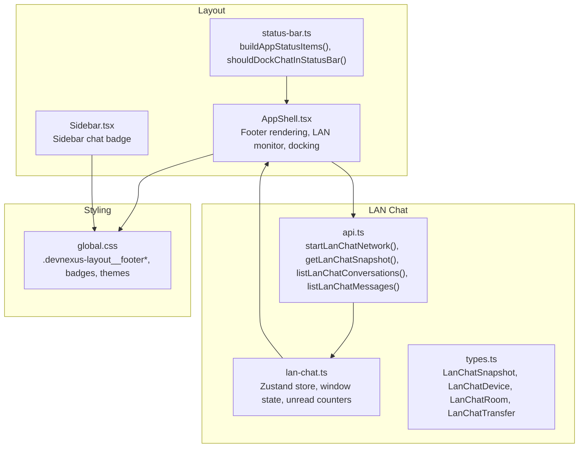
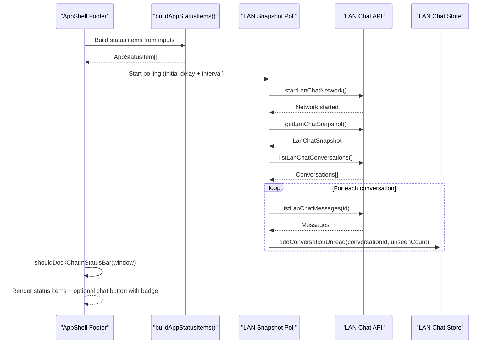
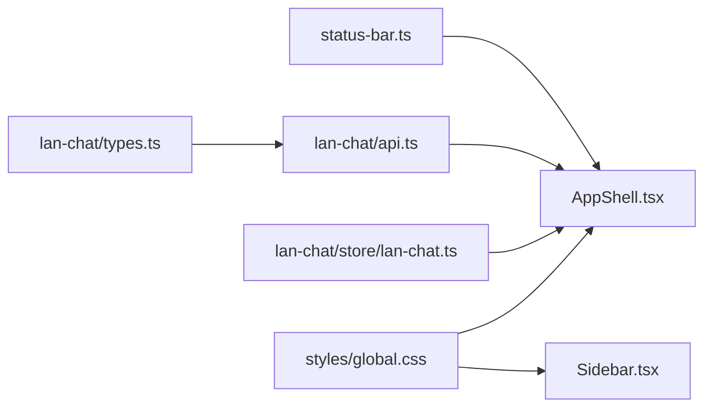

# Status Bar System

<cite>
**Referenced Files in This Document**
- [status-bar.ts](file://src/app/layout/status-bar.ts)
- [AppShell.tsx](file://src/app/layout/AppShell.tsx)
- [Sidebar.tsx](file://src/app/layout/Sidebar.tsx)
- [lan-chat.ts](file://src/plugins/lan-chat/store/lan-chat.ts)
- [types.ts](file://src/plugins/lan-chat/types.ts)
- [api.ts](file://src/plugins/lan-chat/api.ts)
- [global.css](file://src/styles/global.css)
- [status-bar.test.ts](file://tests/app/status-bar.test.ts)
</cite>

## Table of Contents
1. [Introduction](#introduction)
2. [Project Structure](#project-structure)
3. [Core Components](#core-components)
4. [Architecture Overview](#architecture-overview)
5. [Detailed Component Analysis](#detailed-component-analysis)
6. [Dependency Analysis](#dependency-analysis)
7. [Performance Considerations](#performance-considerations)
8. [Troubleshooting Guide](#troubleshooting-guide)
9. [Conclusion](#conclusion)

## Introduction
This document describes the status bar system responsible for real-time system information display and application status monitoring. It covers dynamic status item generation, runtime detection, LAN chat integration, badge counting, conditional rendering, styling patterns, responsive behavior, and accessibility considerations. The system presents a compact row of label-value pairs in the application footer and integrates with LAN chat to show unread counts and provide quick access to the minimized chat window.

## Project Structure
The status bar system spans several modules:
- Status item builder and docking logic
- Application shell that orchestrates status rendering and LAN chat monitoring
- LAN chat store and APIs for device/room/transfer snapshots and unread tracking
- Global styles for responsive and theme-aware status bar presentation

**Diagram sources**
- [status-bar.ts:1-29](file://src/app/layout/status-bar.ts#L1-L29)
- [AppShell.tsx:1-207](file://src/app/layout/AppShell.tsx#L1-L207)
- [Sidebar.tsx:1-177](file://src/app/layout/Sidebar.tsx#L1-L177)
- [api.ts:1-117](file://src/plugins/lan-chat/api.ts#L1-L117)
- [lan-chat.ts:1-202](file://src/plugins/lan-chat/store/lan-chat.ts#L1-L202)
- [types.ts:1-74](file://src/plugins/lan-chat/types.ts#L1-L74)
- [global.css:858-890](file://src/styles/global.css#L858-L890)

**Section sources**
- [status-bar.ts:1-29](file://src/app/layout/status-bar.ts#L1-L29)
- [AppShell.tsx:31-92](file://src/app/layout/AppShell.tsx#L31-L92)
- [api.ts:11-62](file://src/plugins/lan-chat/api.ts#L11-L62)
- [lan-chat.ts:4-29](file://src/plugins/lan-chat/store/lan-chat.ts#L4-L29)
- [types.ts:68-73](file://src/plugins/lan-chat/types.ts#L68-L73)
- [global.css:858-890](file://src/styles/global.css#L858-L890)

## Core Components
- Status item builder: Transforms runtime and LAN state into a flat array of label-value pairs.
- Docking decision: Determines whether the LAN chat button should be shown in the status bar based on window state.
- LAN chat monitor: Periodically queries LAN chat snapshots and computes unread deltas per conversation.
- Store and APIs: Provide device/room/transfer snapshots and conversation/message listings for monitoring.
- Rendering: The footer displays status items and conditionally renders a chat button with a badge.

Key responsibilities:
- Dynamic status item generation from selected tool, sidebar collapsed state, runtime, and LAN metrics.
- Real-time updates via periodic polling with debounced initial delay.
- Unread tracking across conversations and aggregation into a total unread counter.
- Conditional rendering of the chat button in the status bar when the chat window is minimized.

**Section sources**
- [status-bar.ts:15-28](file://src/app/layout/status-bar.ts#L15-L28)
- [AppShell.tsx:45-56](file://src/app/layout/AppShell.tsx#L45-L56)
- [AppShell.tsx:59-92](file://src/app/layout/AppShell.tsx#L59-L92)
- [api.ts:11-62](file://src/plugins/lan-chat/api.ts#L11-L62)
- [lan-chat.ts:73-87](file://src/plugins/lan-chat/store/lan-chat.ts#L73-L87)
- [global.css:858-890](file://src/styles/global.css#L858-L890)

## Architecture Overview
The status bar architecture consists of:
- Pure status item builder that depends on app state inputs.
- App shell that composes inputs, builds status items, monitors LAN chat, and decides docking.
- LAN chat subsystem that exposes snapshots and conversation/message lists.
- Store that aggregates unread counts and manages window state.
- Styles that define responsive layout and theme-aware appearance.

**Diagram sources**
- [AppShell.tsx:45-92](file://src/app/layout/AppShell.tsx#L45-L92)
- [status-bar.ts:15-28](file://src/app/layout/status-bar.ts#L15-L28)
- [api.ts:11-62](file://src/plugins/lan-chat/api.ts#L11-L62)
- [lan-chat.ts:155-174](file://src/plugins/lan-chat/store/lan-chat.ts#L155-L174)

## Detailed Component Analysis

### Status Item Builder and Docking Logic
- AppStatusInput defines the inputs used to build status items: selected tool name, sidebar collapsed state, runtime, LAN device count, room count, and transfer count.
- AppStatusItem defines a simple label-value pair structure.
- buildAppStatusItems transforms inputs into a deterministic list of status items, ensuring labels reflect actual app state rather than placeholders.
- shouldDockChatInStatusBar returns true only when the chat window is both open and minimized, enabling a compact status bar presence.

Practical implications:
- Adding a new status item requires extending the input interface and the builder function.
- Conditional rendering of the chat button depends solely on window state.

**Section sources**
- [status-bar.ts:1-29](file://src/app/layout/status-bar.ts#L1-L29)
- [status-bar.test.ts:6-25](file://tests/app/status-bar.test.ts#L6-L25)

### App Shell Integration and Real-Time Updates
- Composes inputs for status items: selected tool name, sidebar collapsed flag, runtime detection, and LAN snapshot counts.
- Uses a memoized computation to avoid unnecessary re-renders.
- Sets up a polling mechanism:
  - Initial delay to allow network initialization.
  - Subsequent intervals to refresh LAN snapshot and compute unread deltas.
- Tracks message IDs to avoid counting the same message multiple times.
- Computes unread counts per conversation and aggregates them into the total unread counter when the conversation is not visible.

Rendering:
- Iterates over status items and renders label-value pairs with Ant Design Typography and Tag.
- Conditionally renders a chat button with a badge when docking criteria are met.

Accessibility and responsiveness:
- Uses Ant Design components with semantic text and tags.
- Footer container supports horizontal overflow and wraps gracefully.

**Section sources**
- [AppShell.tsx:31-56](file://src/app/layout/AppShell.tsx#L31-L56)
- [AppShell.tsx:59-92](file://src/app/layout/AppShell.tsx#L59-L92)
- [AppShell.tsx:179-201](file://src/app/layout/AppShell.tsx#L179-L201)
- [global.css:858-890](file://src/styles/global.css#L858-L890)

### LAN Chat Integration and Unread Tracking
- Snapshot model includes identity, devices, rooms, and transfers.
- APIs expose:
  - Discovery snapshot retrieval.
  - Conversation and message listing.
  - Network start and device settings update.
- Store maintains:
  - Window state (open, minimized, bounds, unread count).
  - Per-conversation unread counters.
  - Actions to add/clear unread and manage window state.

Monitoring logic:
- For each conversation, fetch recent messages and compare against a set of seen message IDs.
- Count unseen messages from other devices and add to conversation unread.
- Aggregate unread into the total unread counter when the conversation is not currently visible.

**Section sources**
- [types.ts:68-73](file://src/plugins/lan-chat/types.ts#L68-L73)
- [api.ts:11-62](file://src/plugins/lan-chat/api.ts#L11-L62)
- [lan-chat.ts:4-29](file://src/plugins/lan-chat/store/lan-chat.ts#L4-L29)
- [lan-chat.ts:155-174](file://src/plugins/lan-chat/store/lan-chat.ts#L155-L174)

### Sidebar Chat Badge (Contextual Reference)
- Sidebar also shows a chat badge reflecting the total unread count, complementing the status bar integration.
- Useful for users who keep the chat window maximized or expanded.

**Section sources**
- [Sidebar.tsx:151-162](file://src/app/layout/Sidebar.tsx#L151-L162)

### Styling Patterns and Responsive Behavior
- Footer container:
  - Horizontal layout with spacing and secondary text styling.
  - Flexible status area with overflow handling.
- Status item:
  - Label followed by a tag containing the value.
  - Non-wrapping text to maintain compactness.
- Chat button:
  - Rounded pill shape with border and light background.
  - Badge with overflow threshold for large counts.
- Theme support:
  - Dark mode variants adjust borders, backgrounds, and shadows for chat windows and related UI.

Responsive behavior:
- Footer adapts to available space; long labels truncate gracefully.
- Badge caps unread counts to prevent visual overflow.

**Section sources**
- [global.css:858-890](file://src/styles/global.css#L858-L890)

### Accessibility Considerations
- Semantic typography and tags improve screen reader compatibility.
- Clear labels and concise values aid readability.
- Avoid excessive truncation; ensure meaningful information remains visible.

[No sources needed since this section provides general guidance]

## Dependency Analysis
The status bar system exhibits low coupling and clear separation of concerns:
- status-bar.ts is a pure function module with no external dependencies.
- AppShell.tsx depends on status-bar.ts, LAN chat APIs, and store hooks.
- LAN chat APIs depend on Tauri invocations and return typed models.
- Store encapsulates state transitions and unread aggregation.
- Styles are decoupled and theme-aware.

**Diagram sources**
- [status-bar.ts:1-29](file://src/app/layout/status-bar.ts#L1-L29)
- [AppShell.tsx:1-207](file://src/app/layout/AppShell.tsx#L1-L207)
- [api.ts:1-117](file://src/plugins/lan-chat/api.ts#L1-L117)
- [lan-chat.ts:1-202](file://src/plugins/lan-chat/store/lan-chat.ts#L1-L202)
- [types.ts:1-74](file://src/plugins/lan-chat/types.ts#L1-L74)
- [global.css:858-890](file://src/styles/global.css#L858-L890)
- [Sidebar.tsx:1-177](file://src/app/layout/Sidebar.tsx#L1-L177)

**Section sources**
- [status-bar.ts:1-29](file://src/app/layout/status-bar.ts#L1-L29)
- [AppShell.tsx:1-207](file://src/app/layout/AppShell.tsx#L1-L207)
- [api.ts:1-117](file://src/plugins/lan-chat/api.ts#L1-L117)
- [lan-chat.ts:1-202](file://src/plugins/lan-chat/store/lan-chat.ts#L1-L202)
- [types.ts:1-74](file://src/plugins/lan-chat/types.ts#L1-L74)
- [global.css:858-890](file://src/styles/global.css#L858-L890)
- [Sidebar.tsx:1-177](file://src/app/layout/Sidebar.tsx#L1-L177)

## Performance Considerations
- Memoization: Status items are recomputed only when relevant inputs change, reducing render overhead.
- Polling cadence: Initial delay prevents immediate redundant work; subsequent intervals balance freshness and resource usage.
- Message ID tracking: Maintains a set of seen message IDs to avoid repeated processing.
- Badge overflow: Caps unread counts to prevent excessive DOM updates and rendering costs.

[No sources needed since this section provides general guidance]

## Troubleshooting Guide
Common issues and resolutions:
- Status items not updating:
  - Verify inputs to the status item builder are changing as expected.
  - Confirm the memoization dependency array includes all relevant inputs.
- LAN chat unread not incrementing:
  - Ensure network is started and snapshots are being retrieved.
  - Check that unseen messages from other devices are detected and IDs are recorded.
- Chat button not appearing in status bar:
  - Docking occurs only when the chat window is open and minimized.
  - Confirm window state transitions are occurring as expected.

Validation references:
- Status item labels and docking logic are covered by unit tests.

**Section sources**
- [status-bar.test.ts:6-25](file://tests/app/status-bar.test.ts#L6-L25)
- [AppShell.tsx:59-92](file://src/app/layout/AppShell.tsx#L59-L92)
- [lan-chat.ts:155-174](file://src/plugins/lan-chat/store/lan-chat.ts#L155-L174)

## Conclusion
The status bar system provides a clean, extensible foundation for real-time status display and LAN chat integration. Its modular design enables straightforward customization of status items, robust unread tracking, and responsive presentation across themes. By leveraging memoization, controlled polling, and clear conditional rendering, it balances performance and user experience.