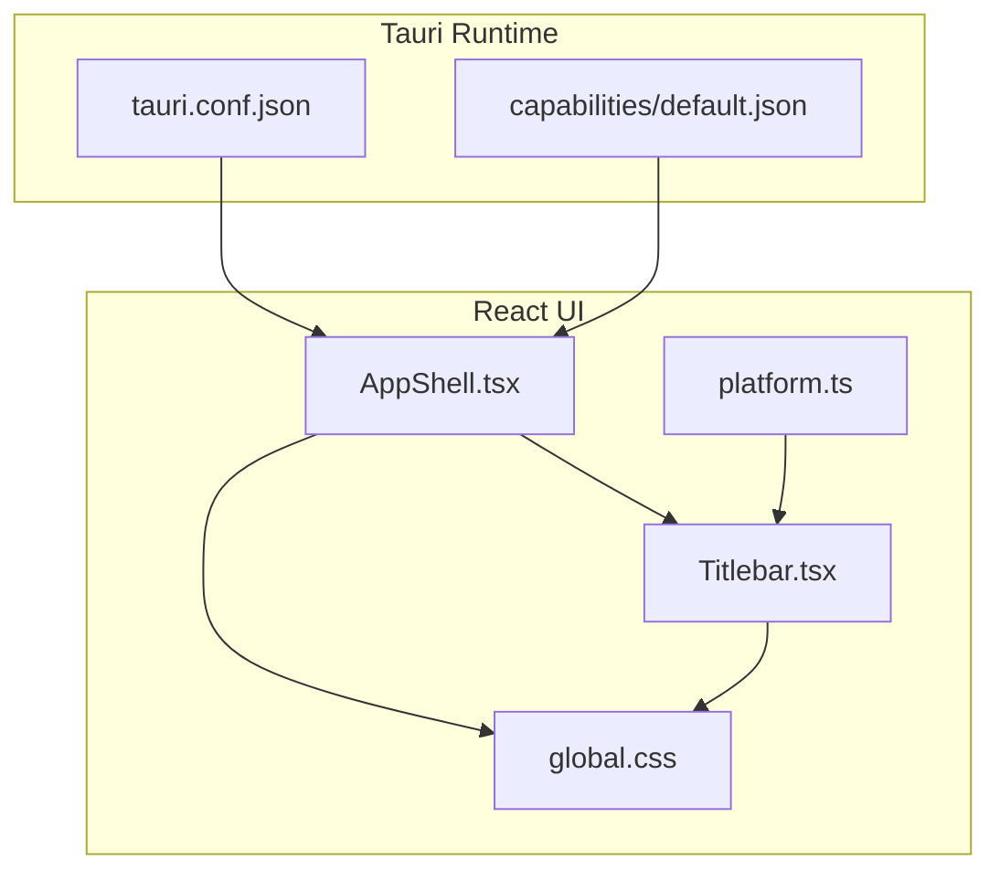
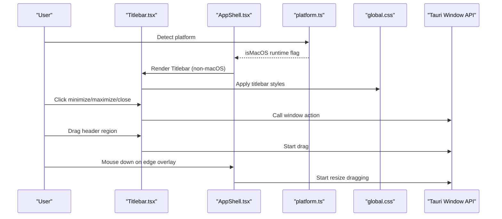
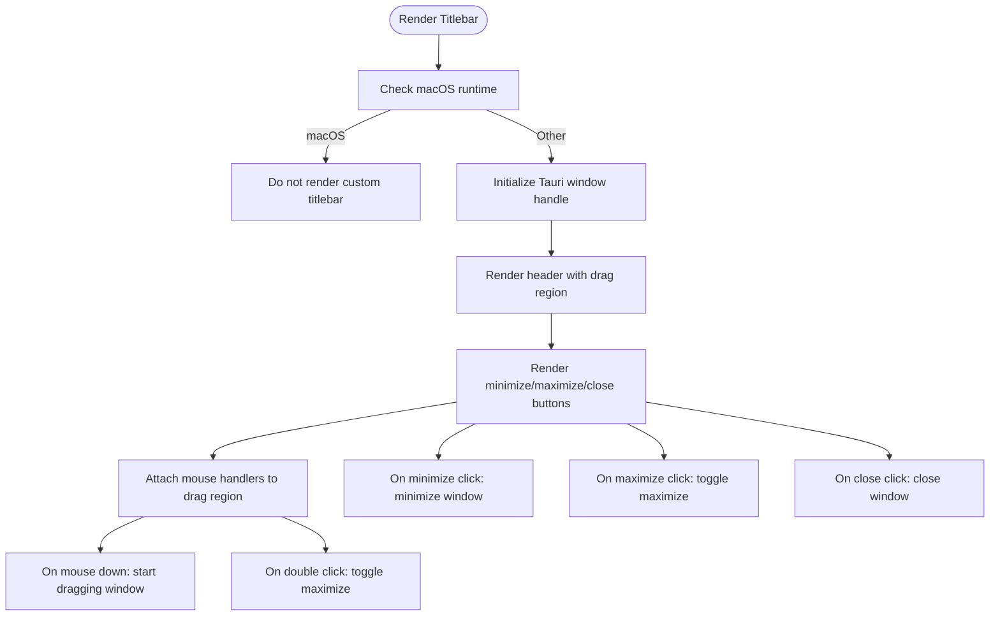
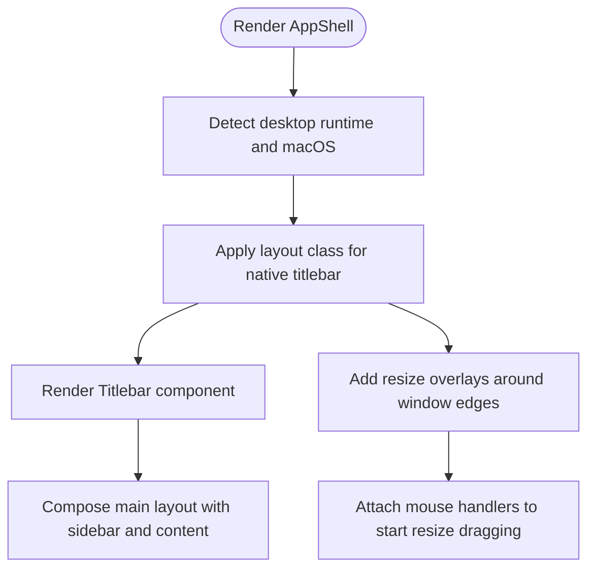
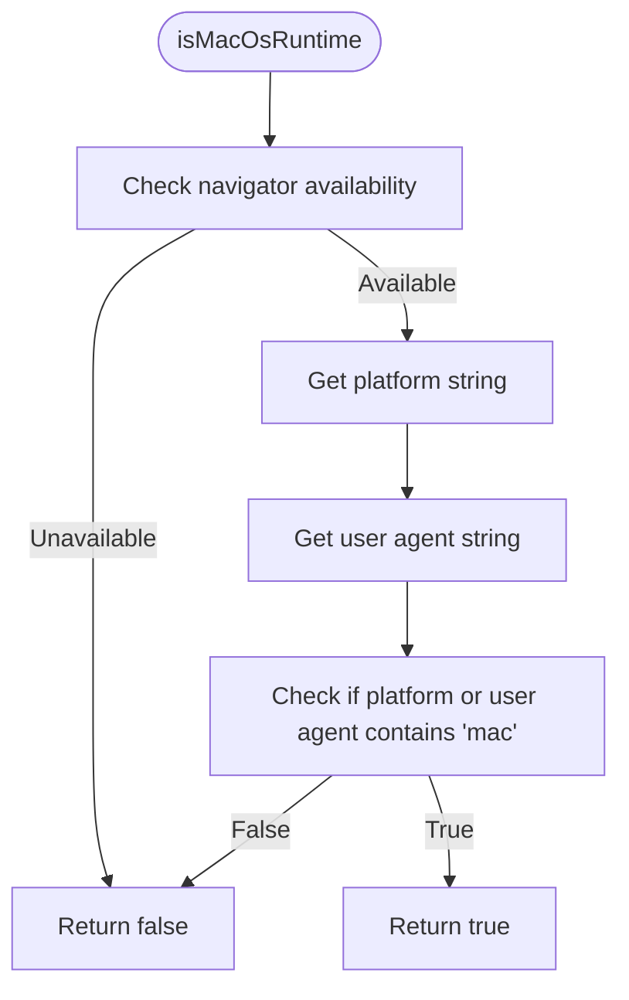
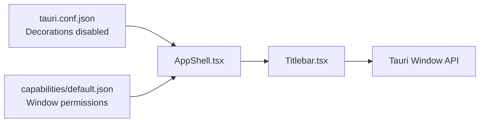
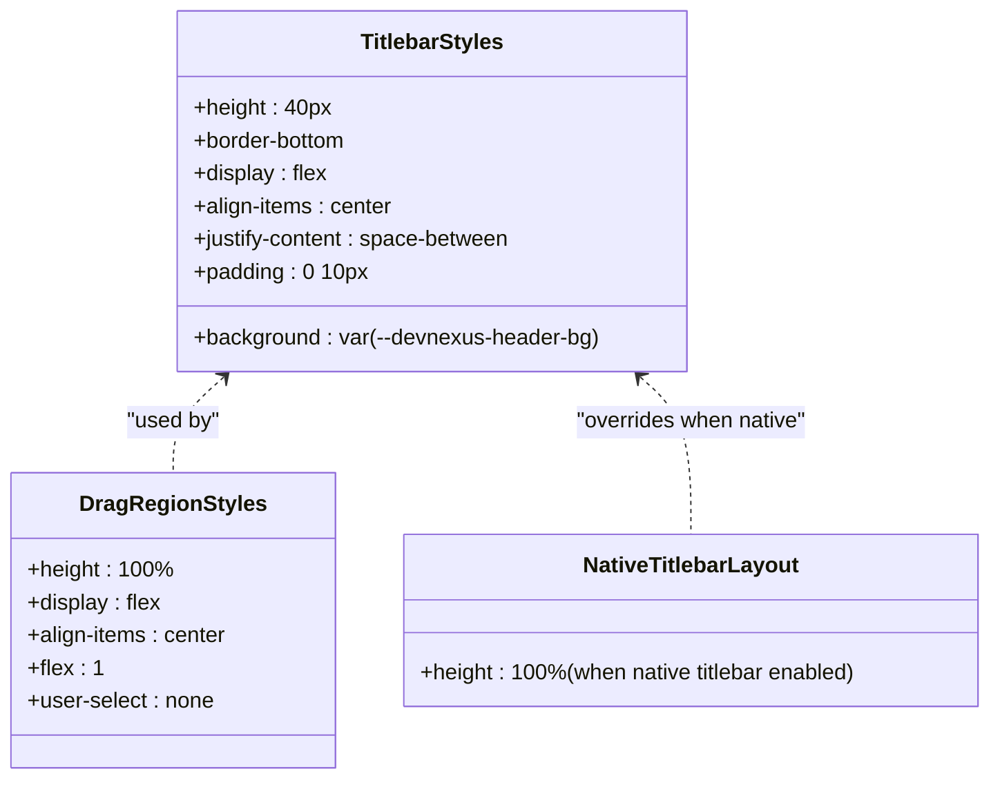
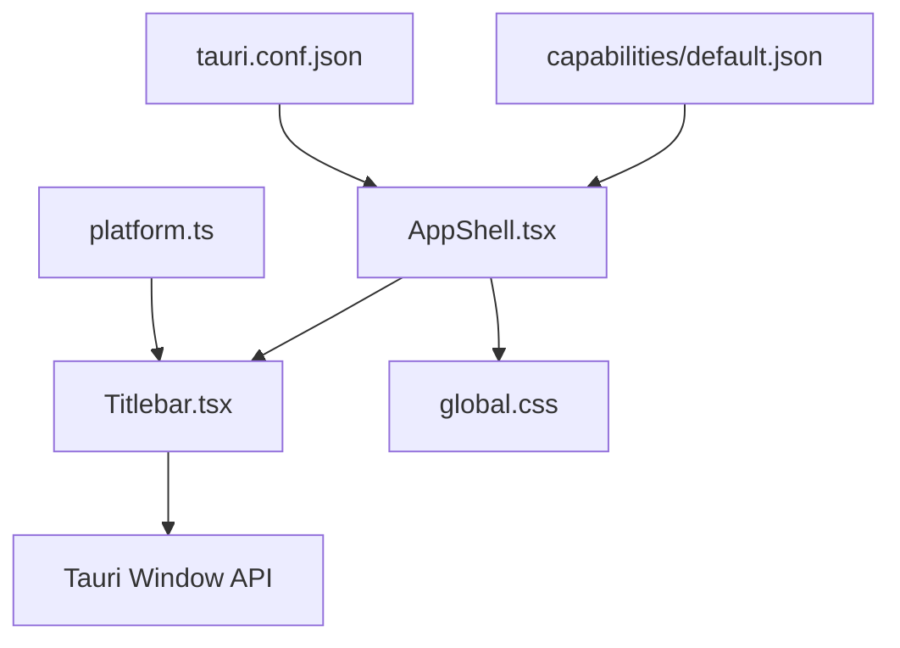

# Titlebar Management

<cite>
**Referenced Files in This Document**
- [Titlebar.tsx](file://src/app/layout/Titlebar.tsx)
- [AppShell.tsx](file://src/app/layout/AppShell.tsx)
- [platform.ts](file://src/app/runtime/platform.ts)
- [global.css](file://src/styles/global.css)
- [tauri.conf.json](file://src-tauri/tauri.conf.json)
- [default.json](file://src-tauri/capabilities/default.json)
</cite>

## Table of Contents
1. [Introduction](#introduction)
2. [Project Structure](#project-structure)
3. [Core Components](#core-components)
4. [Architecture Overview](#architecture-overview)
5. [Detailed Component Analysis](#detailed-component-analysis)
6. [Dependency Analysis](#dependency-analysis)
7. [Performance Considerations](#performance-considerations)
8. [Troubleshooting Guide](#troubleshooting-guide)
9. [Conclusion](#conclusion)

## Introduction
This document describes the titlebar management system for cross-platform desktop applications built with Tauri. It explains how the application integrates native title bars on macOS while providing a custom titlebar on Windows, including window control buttons (minimize, maximize, close), drag regions, and resize handles. It also documents platform detection, Tauri permission configuration, and styling considerations for a cohesive user experience across platforms.

## Project Structure
The titlebar system spans React components, platform detection utilities, and Tauri configuration:
- Titlebar component renders custom controls and drag area on non-macOS platforms
- AppShell orchestrates layout, applies native titlebar class when applicable, and adds resize overlays
- Platform detection determines whether to render a custom titlebar or rely on the OS-native one
- Tauri configuration and capabilities define window decorations and permissions for window controls
- Global CSS defines layout and styling for the titlebar and surrounding areas

**Diagram sources**
- [Titlebar.tsx:12-74](file://src/app/layout/Titlebar.tsx#L12-L74)
- [AppShell.tsx:31-206](file://src/app/layout/AppShell.tsx#L31-L206)
- [platform.ts:1-9](file://src/app/runtime/platform.ts#L1-L9)
- [global.css:43-74](file://src/styles/global.css#L43-L74)
- [tauri.conf.json:13-22](file://src-tauri/tauri.conf.json#L13-L22)
- [default.json:6-12](file://src-tauri/capabilities/default.json#L6-L12)

**Section sources**
- [Titlebar.tsx:12-74](file://src/app/layout/Titlebar.tsx#L12-L74)
- [AppShell.tsx:31-206](file://src/app/layout/AppShell.tsx#L31-L206)
- [platform.ts:1-9](file://src/app/runtime/platform.ts#L1-L9)
- [global.css:43-74](file://src/styles/global.css#L43-L74)
- [tauri.conf.json:13-22](file://src-tauri/tauri.conf.json#L13-L22)
- [default.json:6-12](file://src-tauri/capabilities/default.json#L6-L12)

## Core Components
- Titlebar component
  - Renders only on non-macOS platforms
  - Provides minimize, maximize/toggle, and close buttons via Tauri window APIs
  - Implements a draggable region and double-click maximize behavior
- AppShell component
  - Applies a layout class when using a native macOS titlebar
  - Adds invisible overlay regions around the window edges for resizing
  - Integrates the Titlebar component into the main layout
- Platform detection
  - Detects macOS runtime to decide whether to show a custom titlebar
- Tauri configuration and capabilities
  - Disables window decorations on Windows/Linux to enable custom titlebar
  - Grants permissions for window controls and dragging

**Section sources**
- [Titlebar.tsx:12-74](file://src/app/layout/Titlebar.tsx#L12-L74)
- [AppShell.tsx:31-206](file://src/app/layout/AppShell.tsx#L31-L206)
- [platform.ts:1-9](file://src/app/runtime/platform.ts#L1-L9)
- [tauri.conf.json:20-20](file://src-tauri/tauri.conf.json#L20-L20)
- [default.json:6-12](file://src-tauri/capabilities/default.json#L6-L12)

## Architecture Overview
The titlebar architecture separates concerns between UI rendering, platform awareness, and Tauri integration:
- Platform detection decides whether to render a custom titlebar
- AppShell composes the layout and injects resize overlays
- Titlebar provides window controls and drag behavior
- Tauri configuration enables custom decorations and grants necessary permissions

**Diagram sources**
- [Titlebar.tsx:12-74](file://src/app/layout/Titlebar.tsx#L12-L74)
- [AppShell.tsx:31-206](file://src/app/layout/AppShell.tsx#L31-L206)
- [platform.ts:1-9](file://src/app/runtime/platform.ts#L1-L9)
- [global.css:43-74](file://src/styles/global.css#L43-L74)

## Detailed Component Analysis

### Titlebar Component
The Titlebar component encapsulates:
- Conditional rendering for non-macOS platforms
- Window control buttons (minimize, toggle maximize, close)
- Drag region for moving the window
- Double-click on drag region to toggle maximize
- Disabled state when not in a Tauri desktop runtime

**Diagram sources**
- [Titlebar.tsx:12-74](file://src/app/layout/Titlebar.tsx#L12-L74)

**Section sources**
- [Titlebar.tsx:12-74](file://src/app/layout/Titlebar.tsx#L12-L74)

### AppShell Component
AppShell manages:
- Layout class selection based on native titlebar usage
- Edge overlays for resizing the window
- Integration of the Titlebar component
- Status bar and footer composition

**Diagram sources**
- [AppShell.tsx:31-206](file://src/app/layout/AppShell.tsx#L31-L206)

**Section sources**
- [AppShell.tsx:31-206](file://src/app/layout/AppShell.tsx#L31-L206)

### Platform Detection
Platform detection determines whether to use a native macOS titlebar or a custom one:
- Uses navigator platform and user agent checks
- Returns a boolean indicating macOS runtime

**Diagram sources**
- [platform.ts:1-9](file://src/app/runtime/platform.ts#L1-L9)

**Section sources**
- [platform.ts:1-9](file://src/app/runtime/platform.ts#L1-L9)

### Tauri Configuration and Permissions
Tauri configuration and capabilities define:
- Window decorations disabled to enable custom titlebar
- Permissions granted for window actions and dragging
- Window sizing constraints

**Diagram sources**
- [tauri.conf.json:20-20](file://src-tauri/tauri.conf.json#L20-L20)
- [default.json:6-12](file://src-tauri/capabilities/default.json#L6-L12)
- [AppShell.tsx:31-206](file://src/app/layout/AppShell.tsx#L31-L206)
- [Titlebar.tsx:12-74](file://src/app/layout/Titlebar.tsx#L12-L74)

**Section sources**
- [tauri.conf.json:13-22](file://src-tauri/tauri.conf.json#L13-L22)
- [default.json:6-12](file://src-tauri/capabilities/default.json#L6-L12)

### Styling and Responsive Layout
Styling ensures:
- Titlebar height, background, and typography
- Drag region behavior and disabled selection
- Layout adjustments when using native titlebar
- Edge overlay sizes and cursors for resizing

**Diagram sources**
- [global.css:43-74](file://src/styles/global.css#L43-L74)

**Section sources**
- [global.css:43-74](file://src/styles/global.css#L43-L74)

## Dependency Analysis
The titlebar system exhibits clear separation of responsibilities:
- Titlebar depends on platform detection and Tauri window APIs
- AppShell depends on platform detection and global styles
- Tauri configuration and capabilities are external dependencies that enable the custom titlebar behavior

**Diagram sources**
- [platform.ts:1-9](file://src/app/runtime/platform.ts#L1-L9)
- [Titlebar.tsx:12-74](file://src/app/layout/Titlebar.tsx#L12-L74)
- [AppShell.tsx:31-206](file://src/app/layout/AppShell.tsx#L31-L206)
- [global.css:43-74](file://src/styles/global.css#L43-L74)
- [tauri.conf.json:13-22](file://src-tauri/tauri.conf.json#L13-L22)
- [default.json:6-12](file://src-tauri/capabilities/default.json#L6-L12)

**Section sources**
- [platform.ts:1-9](file://src/app/runtime/platform.ts#L1-L9)
- [Titlebar.tsx:12-74](file://src/app/layout/Titlebar.tsx#L12-L74)
- [AppShell.tsx:31-206](file://src/app/layout/AppShell.tsx#L31-L206)
- [global.css:43-74](file://src/styles/global.css#L43-L74)
- [tauri.conf.json:13-22](file://src-tauri/tauri.conf.json#L13-L22)
- [default.json:6-12](file://src-tauri/capabilities/default.json#L6-L12)

## Performance Considerations
- Event handler filtering: The drag region and buttons check for primary mouse button and prevent propagation to avoid unintended interactions
- Conditional rendering: The custom titlebar is only rendered on non-macOS platforms, reducing unnecessary DOM and event overhead
- Overlay resizing: Edge overlays are lightweight and only active during resize operations
- CSS-based layout: Using CSS for drag regions and overlays avoids heavy JavaScript computations

## Troubleshooting Guide
Common issues and resolutions:
- Buttons disabled on non-Tauri environments
  - Cause: Running in a browser without Tauri context
  - Resolution: Ensure the app runs in a Tauri desktop environment or guard button actions with a runtime check
- Drag region does not work on macOS
  - Cause: Custom titlebar is intentionally not rendered on macOS
  - Resolution: Rely on the native titlebar for drag behavior on macOS
- Resize overlays not triggering
  - Cause: Missing Tauri permissions or incorrect event handling
  - Resolution: Verify Tauri capabilities include window resize permissions and that mouse events are not prevented by parent elements
- Titlebar overlaps content
  - Cause: Layout height calculations when using native titlebar
  - Resolution: Confirm the layout class for native titlebar is applied and adjust content height accordingly

**Section sources**
- [Titlebar.tsx:12-74](file://src/app/layout/Titlebar.tsx#L12-L74)
- [AppShell.tsx:31-206](file://src/app/layout/AppShell.tsx#L31-L206)
- [platform.ts:1-9](file://src/app/runtime/platform.ts#L1-L9)
- [default.json:6-12](file://src-tauri/capabilities/default.json#L6-L12)

## Conclusion
The titlebar management system provides a consistent cross-platform experience by combining platform-aware rendering, Tauri window control APIs, and carefully crafted CSS. On macOS, the native titlebar is used, while Windows and Linux receive a custom titlebar with draggable regions and window controls. Tauri configuration and capabilities enable these features safely and efficiently, ensuring a polished desktop application interface.