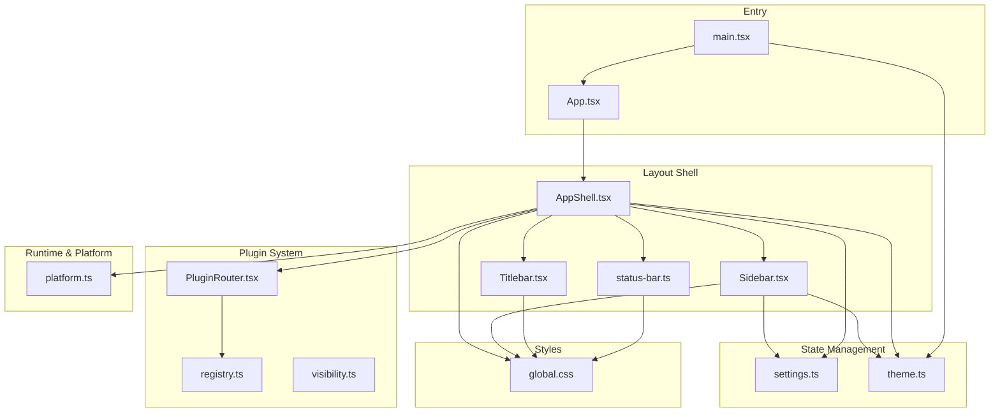
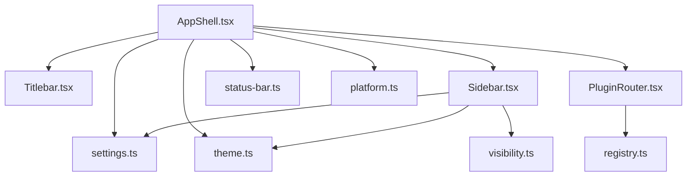
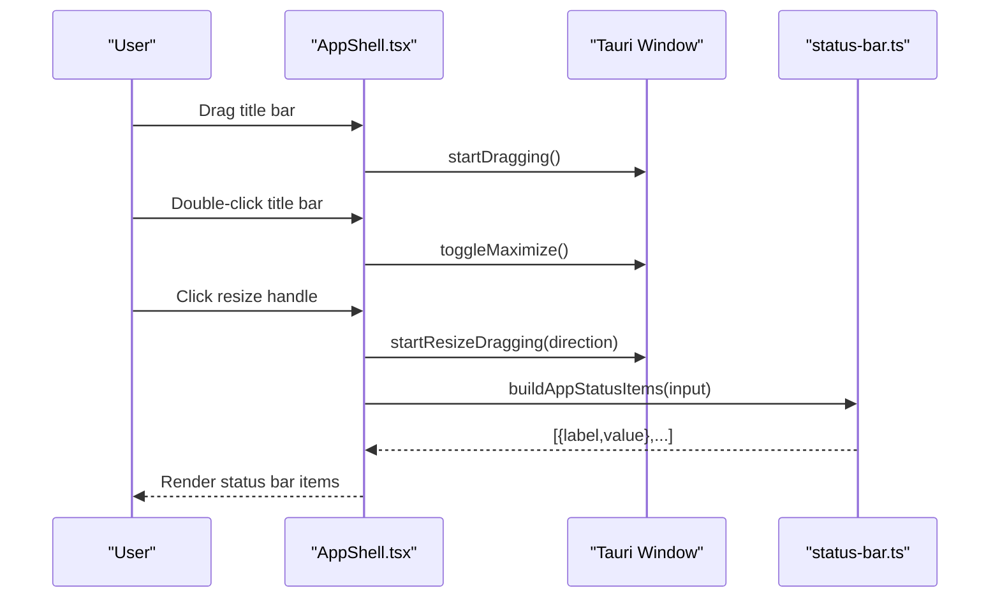
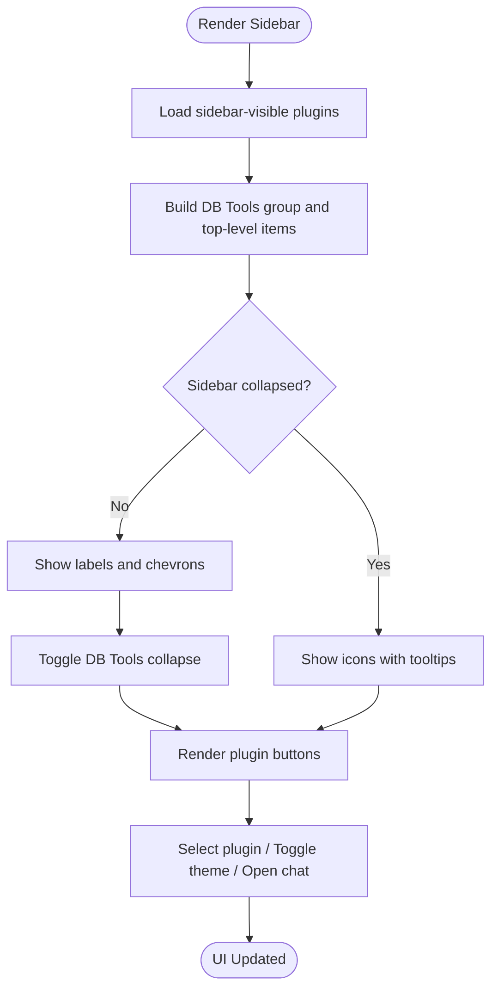
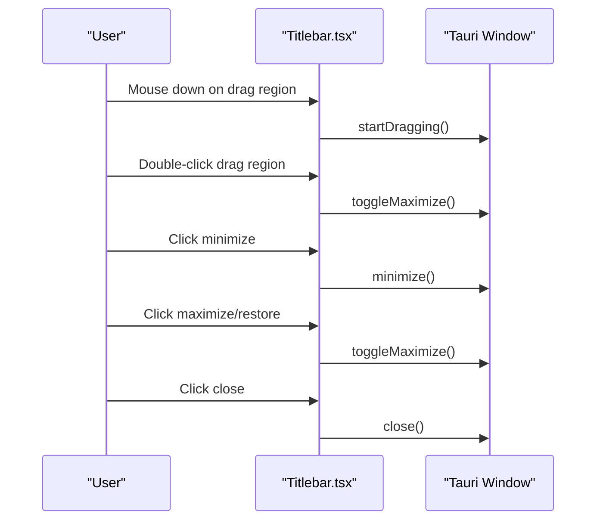
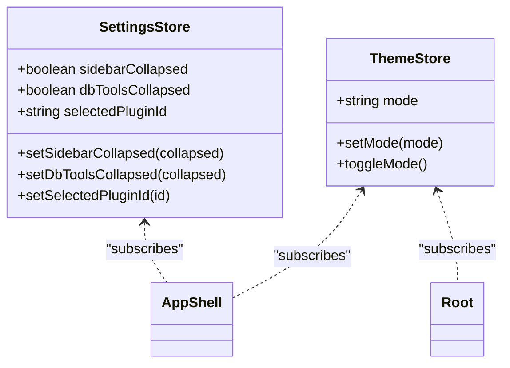
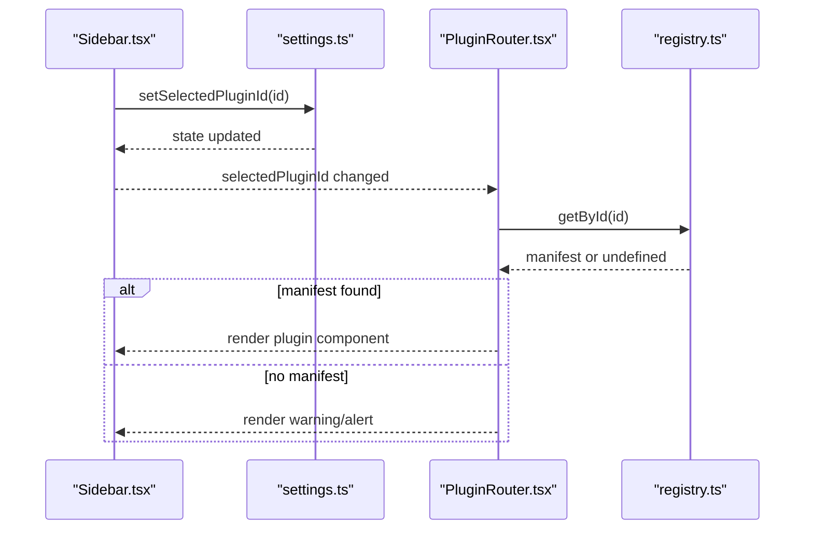
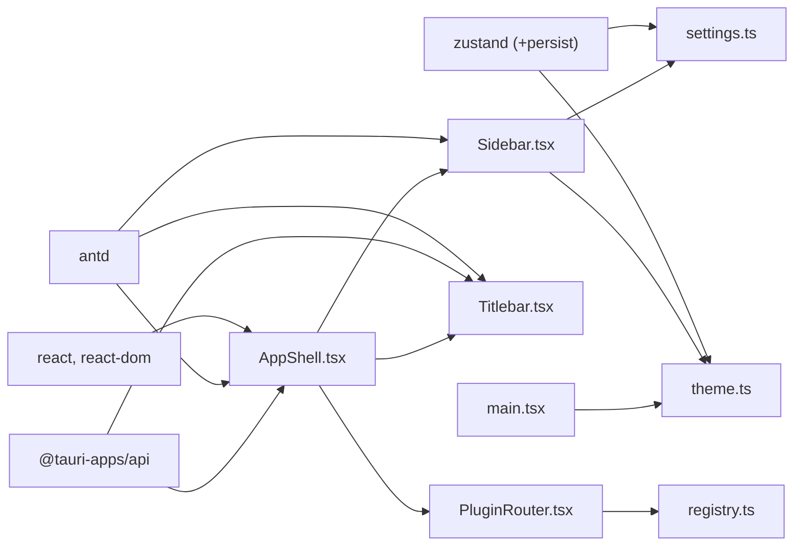

# Core Application Components

<cite>
**Referenced Files in This Document**
- [AppShell.tsx](file://src/app/layout/AppShell.tsx)
- [Sidebar.tsx](file://src/app/layout/Sidebar.tsx)
- [Titlebar.tsx](file://src/app/layout/Titlebar.tsx)
- [status-bar.ts](file://src/app/layout/status-bar.ts)
- [settings.ts](file://src/app/store/settings.ts)
- [theme.ts](file://src/app/store/theme.ts)
- [PluginRouter.tsx](file://src/app/plugin-registry/PluginRouter.tsx)
- [registry.ts](file://src/app/plugin-registry/registry.ts)
- [visibility.ts](file://src/app/plugin-registry/visibility.ts)
- [platform.ts](file://src/app/runtime/platform.ts)
- [main.tsx](file://src/main.tsx)
- [App.tsx](file://src/App.tsx)
- [global.css](file://src/styles/global.css)
- [vite.config.ts](file://vite.config.ts)
- [package.json](file://package.json)
</cite>

## Table of Contents
1. [Introduction](#introduction)
2. [Project Structure](#project-structure)
3. [Core Components](#core-components)
4. [Architecture Overview](#architecture-overview)
5. [Detailed Component Analysis](#detailed-component-analysis)
6. [Dependency Analysis](#dependency-analysis)
7. [Performance Considerations](#performance-considerations)
8. [Troubleshooting Guide](#troubleshooting-guide)
9. [Conclusion](#conclusion)
10. [Appendices](#appendices)

## Introduction
This document explains RDMM’s core application shell and foundational systems. It covers the application shell layout, sidebar navigation, title bar, and status bar implementation. It documents the state management system using Zustand stores for settings and theme, window management capabilities, responsive design patterns, and cross-platform desktop integration. Practical examples demonstrate customizing the UI, managing application state, and extending the layout system. Accessibility considerations, performance optimization, and integration with the plugin architecture are also addressed.

## Project Structure
The application is structured around a React + Ant Design front-end with Tauri for desktop integration. The shell orchestrates layout, state, and plugin routing. Styles are centralized in a global stylesheet supporting light/dark themes and responsive behavior.

**Diagram sources**
- [main.tsx:12-31](file://src/main.tsx#L12-L31)
- [App.tsx:4-10](file://src/App.tsx#L4-L10)
- [AppShell.tsx:31-206](file://src/app/layout/AppShell.tsx#L31-L206)
- [Titlebar.tsx:12-74](file://src/app/layout/Titlebar.tsx#L12-L74)
- [Sidebar.tsx:21-176](file://src/app/layout/Sidebar.tsx#L21-L176)
- [status-bar.ts:15-28](file://src/app/layout/status-bar.ts#L15-L28)
- [settings.ts:13-27](file://src/app/store/settings.ts#L13-L27)
- [theme.ts:12-26](file://src/app/store/theme.ts#L12-L26)
- [PluginRouter.tsx:7-28](file://src/app/plugin-registry/PluginRouter.tsx#L7-L28)
- [registry.ts:3-25](file://src/app/plugin-registry/registry.ts#L3-L25)
- [visibility.ts:3-5](file://src/app/plugin-registry/visibility.ts#L3-L5)
- [platform.ts:1-9](file://src/app/runtime/platform.ts#L1-L9)
- [global.css:36-81](file://src/styles/global.css#L36-L81)

**Section sources**
- [main.tsx:12-31](file://src/main.tsx#L12-L31)
- [App.tsx:4-10](file://src/App.tsx#L4-L10)
- [vite.config.ts:9-41](file://vite.config.ts#L9-L41)
- [package.json:15-36](file://package.json#L15-L36)

## Core Components
- Application Shell: Orchestrates layout, integrates desktop window controls, LAN chat docking, and status bar items.
- Sidebar Navigation: Provides collapsible plugin navigation, grouped database tools, theme toggle, and LAN chat access.
- Title Bar: Implements draggable header and native window controls for non-macOS platforms.
- Status Bar: Displays runtime diagnostics and LAN connectivity metrics.
- State Stores: Persisted Zustand stores for settings and theme.
- Plugin Router: Selects and renders the active plugin component based on selection.
- Registry and Visibility: Centralized plugin registration and sidebar filtering.
- Runtime Platform Detection: Detects macOS for native titlebar behavior.
- Global Styles: CSS custom properties and layout classes for responsive design and theming.

**Section sources**
- [AppShell.tsx:31-206](file://src/app/layout/AppShell.tsx#L31-L206)
- [Sidebar.tsx:21-176](file://src/app/layout/Sidebar.tsx#L21-L176)
- [Titlebar.tsx:12-74](file://src/app/layout/Titlebar.tsx#L12-L74)
- [status-bar.ts:15-28](file://src/app/layout/status-bar.ts#L15-L28)
- [settings.ts:13-27](file://src/app/store/settings.ts#L13-L27)
- [theme.ts:12-26](file://src/app/store/theme.ts#L12-L26)
- [PluginRouter.tsx:7-28](file://src/app/plugin-registry/PluginRouter.tsx#L7-L28)
- [registry.ts:3-25](file://src/app/plugin-registry/registry.ts#L3-L25)
- [visibility.ts:3-5](file://src/app/plugin-registry/visibility.ts#L3-L5)
- [platform.ts:1-9](file://src/app/runtime/platform.ts#L1-L9)
- [global.css:36-81](file://src/styles/global.css#L36-L81)

## Architecture Overview
The shell composes the title bar, sidebar, plugin router, developer console, LAN chat window host, and status bar. Desktop-specific behaviors (dragging, resizing, maximize) are gated via Tauri APIs. Theme and settings are managed by Zustand stores with persistence. The plugin system registers manifests and filters sidebar entries.

**Diagram sources**
- [AppShell.tsx:31-206](file://src/app/layout/AppShell.tsx#L31-L206)
- [Titlebar.tsx:12-74](file://src/app/layout/Titlebar.tsx#L12-L74)
- [Sidebar.tsx:21-176](file://src/app/layout/Sidebar.tsx#L21-L176)
- [PluginRouter.tsx:7-28](file://src/app/plugin-registry/PluginRouter.tsx#L7-L28)
- [status-bar.ts:15-28](file://src/app/layout/status-bar.ts#L15-L28)
- [settings.ts:13-27](file://src/app/store/settings.ts#L13-L27)
- [theme.ts:12-26](file://src/app/store/theme.ts#L12-L26)
- [registry.ts:3-25](file://src/app/plugin-registry/registry.ts#L3-L25)
- [visibility.ts:3-5](file://src/app/plugin-registry/visibility.ts#L3-L5)
- [platform.ts:1-9](file://src/app/runtime/platform.ts#L1-L9)

## Detailed Component Analysis

### Application Shell (AppShell)
Responsibilities:
- Compose layout: title bar, sidebar, plugin content area, footer status bar, LAN chat host, and developer console.
- Desktop window controls: drag region, resize edges, minimize/maximize/close via Tauri.
- Runtime detection: macOS uses native titlebar; Windows/Linux show custom titlebar.
- Status bar items: derived from selected tool, sidebar state, runtime, and LAN chat metrics.
- LAN chat monitoring: periodic polling for device/room/transfer counts and unread counters.

Key behaviors:
- Uses Ant Design Layout primitives and CSS classes for consistent spacing and overflow.
- Conditionally mounts resize overlays for edge resizing when running as a desktop app.
- Integrates Zustand stores for settings and LAN chat state.
- Delegates status item construction to a dedicated builder.

Practical customization examples:
- Add a new status indicator by extending the builder input and rendering additional items in the footer.
- Introduce a new overlay edge by adding another overlay definition and attaching a startResizeDragging handler.
- Swap the developer console or LAN chat host positions by reordering children within the content area.

**Diagram sources**
- [AppShell.tsx:148-205](file://src/app/layout/AppShell.tsx#L148-L205)
- [Titlebar.tsx:24-44](file://src/app/layout/Titlebar.tsx#L24-L44)
- [status-bar.ts:15-24](file://src/app/layout/status-bar.ts#L15-L24)

**Section sources**
- [AppShell.tsx:31-206](file://src/app/layout/AppShell.tsx#L31-L206)
- [status-bar.ts:15-28](file://src/app/layout/status-bar.ts#L15-L28)

### Sidebar Navigation
Responsibilities:
- Render collapsible plugin buttons with tooltips and icons.
- Group database tools under a collapsible “DB Tools” section.
- Toggle theme mode and open LAN chat window.
- Reflect current selection and highlight active plugin.

Responsive behavior:
- Collapsed mode reduces width and shows only icons; tooltips provide labels.
- Nested plugin buttons are visually distinguished.

Extensibility:
- New plugins appear automatically if marked for sidebar visibility.
- Active group highlighting and chevron rotation improve UX.

**Diagram sources**
- [Sidebar.tsx:21-176](file://src/app/layout/Sidebar.tsx#L21-L176)
- [visibility.ts:3-5](file://src/app/plugin-registry/visibility.ts#L3-L5)

**Section sources**
- [Sidebar.tsx:21-176](file://src/app/layout/Sidebar.tsx#L21-L176)
- [visibility.ts:3-5](file://src/app/plugin-registry/visibility.ts#L3-L5)

### Title Bar
Responsibilities:
- Provide a draggable region for moving the window.
- Offer minimize, maximize/restore, and close actions.
- Adapt to macOS by not rendering custom controls when native titlebar is used.

Desktop integration:
- Uses Tauri window APIs guarded by runtime checks.

Accessibility:
- Keyboard focus and screen reader compatibility rely on Ant Design button semantics and proper labeling.

**Diagram sources**
- [Titlebar.tsx:24-70](file://src/app/layout/Titlebar.tsx#L24-L70)

**Section sources**
- [Titlebar.tsx:12-74](file://src/app/layout/Titlebar.tsx#L12-L74)
- [platform.ts:1-9](file://src/app/runtime/platform.ts#L1-L9)

### Status Bar Builder
Responsibilities:
- Construct status items from runtime inputs: selected tool, sidebar state, runtime type, and LAN metrics.
- Provide a predicate to decide whether to dock LAN chat in the status bar.

Extensibility:
- Add new status items by augmenting the builder input and output arrays.

**Section sources**
- [status-bar.ts:15-28](file://src/app/layout/status-bar.ts#L15-L28)

### State Management (Zustand Stores)
Settings Store:
- Tracks sidebar collapsed state, DB tools collapsed state, and selected plugin ID.
- Persists to storage for continuity across sessions.

Theme Store:
- Tracks light/dark mode, exposes toggle and setter.
- Applied globally via ConfigProvider and dataset attribute.

**Diagram sources**
- [settings.ts:13-27](file://src/app/store/settings.ts#L13-L27)
- [theme.ts:12-26](file://src/app/store/theme.ts#L12-L26)
- [main.tsx:12-31](file://src/main.tsx#L12-L31)

**Section sources**
- [settings.ts:13-27](file://src/app/store/settings.ts#L13-L27)
- [theme.ts:12-26](file://src/app/store/theme.ts#L12-L26)
- [main.tsx:12-31](file://src/main.tsx#L12-L31)

### Plugin Registry and Router
Plugin Router:
- Resolves the currently selected plugin and renders its component.
- Falls back to the first available plugin if none is selected.

Registry:
- Maintains a map of plugin manifests with getters for all or by ID.
- Sidebar visibility filter excludes plugins marked otherwise.

**Diagram sources**
- [Sidebar.tsx:34-41](file://src/app/layout/Sidebar.tsx#L34-L41)
- [settings.ts:13-27](file://src/app/store/settings.ts#L13-L27)
- [PluginRouter.tsx:7-28](file://src/app/plugin-registry/PluginRouter.tsx#L7-L28)
- [registry.ts:13-21](file://src/app/plugin-registry/registry.ts#L13-L21)

**Section sources**
- [PluginRouter.tsx:7-28](file://src/app/plugin-registry/PluginRouter.tsx#L7-L28)
- [registry.ts:3-25](file://src/app/plugin-registry/registry.ts#L3-L25)
- [visibility.ts:3-5](file://src/app/plugin-registry/visibility.ts#L3-L5)

### Responsive Design Patterns and Global Styles
Global CSS defines:
- CSS custom properties for theme-aware colors and typography.
- Layout classes for the shell, title bar, sidebar, content, and footer.
- Collapsed sidebar behavior via width transitions and icon-only layouts.
- Scroll regions and overflow handling for content areas.

Responsive patterns:
- Flexbox-based layout with min-height: 0 to enable inner scrolling.
- Sidebar width transitions and collapsing animations.
- Ant Design integration via ConfigProvider for theme algorithms.

**Section sources**
- [global.css:36-81](file://src/styles/global.css#L36-L81)
- [global.css:83-101](file://src/styles/global.css#L83-L101)
- [global.css:251-271](file://src/styles/global.css#L251-L271)
- [main.tsx:20-29](file://src/main.tsx#L20-L29)

### Cross-Platform Desktop Integration
Integration points:
- Tauri window APIs for dragging, resizing, and window controls.
- Platform detection for macOS to conditionally render native titlebar.
- Persistent stores for settings and theme to maintain user preferences across platforms.

**Section sources**
- [AppShell.tsx:40-42](file://src/app/layout/AppShell.tsx#L40-L42)
- [Titlebar.tsx:17-18](file://src/app/layout/Titlebar.tsx#L17-L18)
- [platform.ts:1-9](file://src/app/runtime/platform.ts#L1-L9)
- [settings.ts:23-26](file://src/app/store/settings.ts#L23-L26)
- [theme.ts:22-25](file://src/app/store/theme.ts#L22-L25)

## Dependency Analysis
External libraries and frameworks:
- React and ReactDOM for UI rendering.
- Ant Design for UI primitives and theming.
- Zustand for lightweight state management with persistence.
- Tauri APIs for desktop window controls and platform detection.

Internal dependencies:
- Shell depends on sidebar, titlebar, status builder, plugin router, and stores.
- Sidebar depends on settings and theme stores and visibility filtering.
- Plugin router depends on registry and settings store.
- Root applies theme configuration globally.

**Diagram sources**
- [package.json:15-36](file://package.json#L15-L36)
- [main.tsx:12-31](file://src/main.tsx#L12-L31)
- [AppShell.tsx:31-206](file://src/app/layout/AppShell.tsx#L31-L206)
- [Sidebar.tsx:21-176](file://src/app/layout/Sidebar.tsx#L21-L176)
- [Titlebar.tsx:12-74](file://src/app/layout/Titlebar.tsx#L12-L74)
- [PluginRouter.tsx:7-28](file://src/app/plugin-registry/PluginRouter.tsx#L7-L28)
- [registry.ts:3-25](file://src/app/plugin-registry/registry.ts#L3-L25)
- [settings.ts:13-27](file://src/app/store/settings.ts#L13-L27)
- [theme.ts:12-26](file://src/app/store/theme.ts#L12-L26)

**Section sources**
- [package.json:15-36](file://package.json#L15-L36)
- [vite.config.ts:9-41](file://vite.config.ts#L9-L41)

## Performance Considerations
- Minimize re-renders: Use memoization for status items and avoid unnecessary subscriptions.
- Efficient polling: Debounce or throttle LAN chat refresh intervals; consider abortable fetches.
- CSS containment: Apply contain: layout/size on heavy panels to limit layout recalculation.
- Virtualization: For large lists (e.g., LAN chat sessions), leverage virtual lists to reduce DOM nodes.
- Lazy loading: Defer non-critical plugin initialization until after shell mount.
- Bundle size: Keep plugin components tree-shaken; avoid importing large libraries in the shell.

## Troubleshooting Guide
Common issues and resolutions:
- Titlebar controls disabled: Ensure Tauri runtime is detected and window APIs are available.
- Sidebar not responding: Verify settings store subscription and that selected plugin ID is valid.
- Theme not applying: Confirm dataset theme attribute is set and ConfigProvider algorithm matches mode.
- LAN chat unread counters not updating: Check polling timers and ensure store updates are dispatched.
- Desktop resizing not working: Validate overlay handlers and Tauri window startResizeDragging support.

**Section sources**
- [Titlebar.tsx:17-18](file://src/app/layout/Titlebar.tsx#L17-L18)
- [AppShell.tsx:59-92](file://src/app/layout/AppShell.tsx#L59-L92)
- [main.tsx:15-17](file://src/main.tsx#L15-L17)
- [settings.ts:13-27](file://src/app/store/settings.ts#L13-L27)
- [theme.ts:12-26](file://src/app/store/theme.ts#L12-L26)

## Conclusion
RDMM’s core application components form a cohesive shell that integrates desktop window controls, a flexible sidebar, a dynamic plugin router, and persistent state management. The design emphasizes responsiveness, cross-platform compatibility, and extensibility through the plugin architecture. By leveraging Ant Design, Zustand, and Tauri, the system balances developer productivity with a polished user experience.

## Appendices

### Practical Examples

- Customize the UI:
  - Extend the status bar by adding new items in the builder and rendering them in the footer.
  - Modify sidebar grouping by adjusting the DB tools set and visibility filtering.
  - Adjust theme variables in the global stylesheet to match brand guidelines.

- Manage application state:
  - Persisted settings: update defaults or add new keys in the settings store and initialize in the store setup.
  - Theme toggling: call the theme store toggle function from a UI control and ensure the dataset attribute is applied.

- Extend the layout system:
  - Add a new overlay edge by defining a new overlay element and wiring startResizeDragging.
  - Insert a new panel between the sidebar and content by adding a new layout child in the shell.

- Accessibility:
  - Ensure all interactive elements have appropriate ARIA roles and labels.
  - Test keyboard navigation and screen reader compatibility with Ant Design components.

- Performance:
  - Monitor re-renders using React DevTools Profiler.
  - Optimize heavy plugin components with lazy loading and virtualization.

[No sources needed since this section provides general guidance]