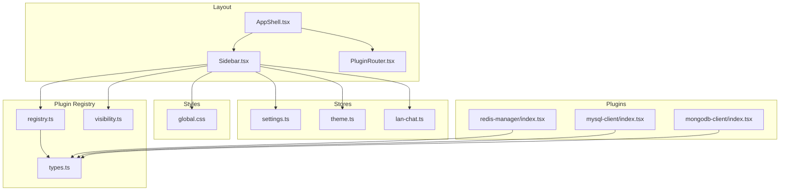
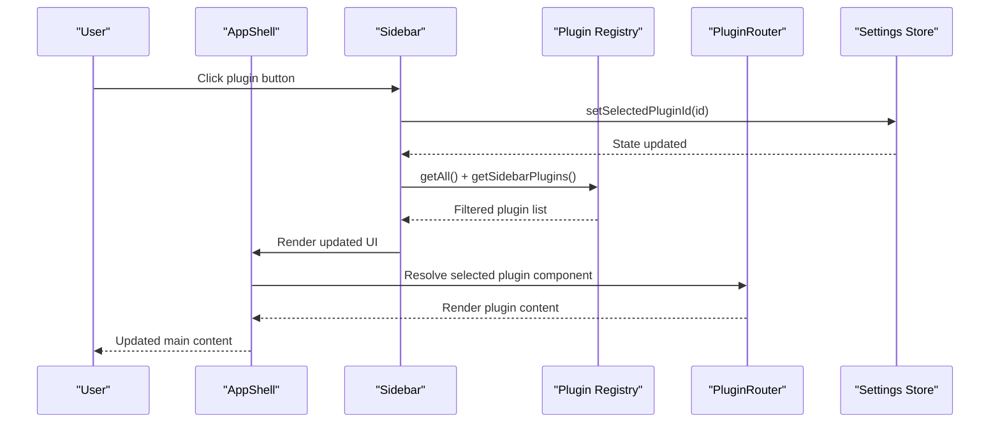
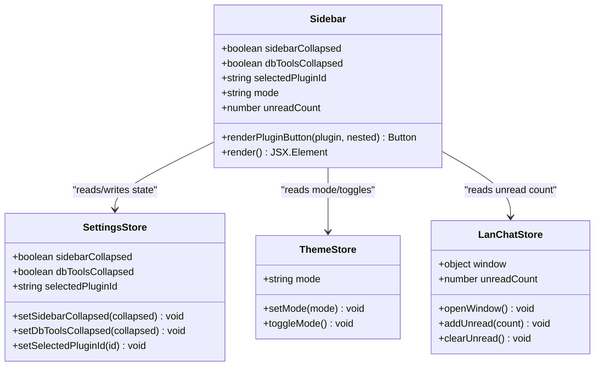
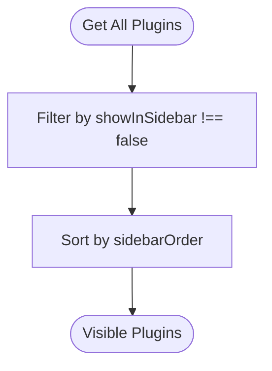
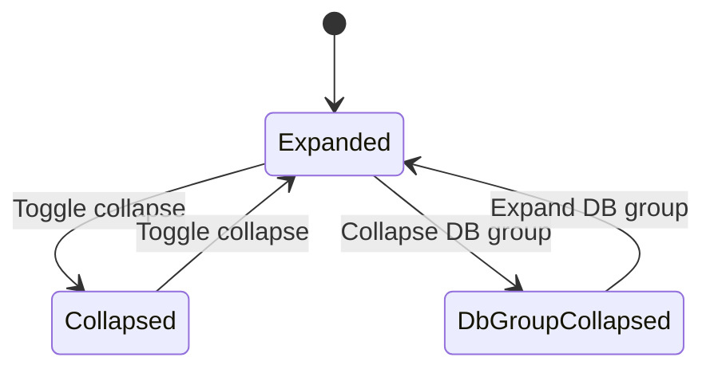
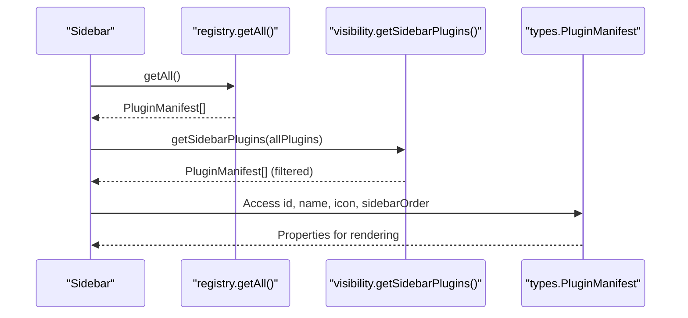
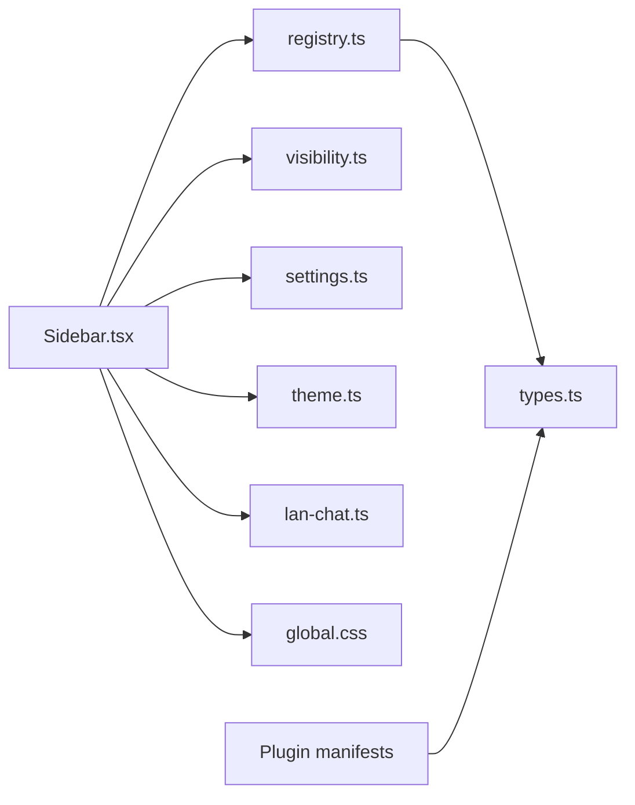

# Sidebar Navigation

<cite>
**Referenced Files in This Document**
- [Sidebar.tsx](file://src/app/layout/Sidebar.tsx)
- [AppShell.tsx](file://src/app/layout/AppShell.tsx)
- [visibility.ts](file://src/app/plugin-registry/visibility.ts)
- [registry.ts](file://src/app/plugin-registry/registry.ts)
- [types.ts](file://src/app/plugin-registry/types.ts)
- [settings.ts](file://src/app/store/settings.ts)
- [theme.ts](file://src/app/store/theme.ts)
- [lan-chat.ts](file://src/plugins/lan-chat/store/lan-chat.ts)
- [PluginRouter.tsx](file://src/app/plugin-registry/PluginRouter.tsx)
- [global.css](file://src/styles/global.css)
- [redis-manager/index.tsx](file://src/plugins/redis-manager/index.tsx)
- [mysql-client/index.tsx](file://src/plugins/mysql-client/index.tsx)
- [mongodb-client/index.tsx](file://src/plugins/mongodb-client/index.tsx)
</cite>

## Table of Contents
1. [Introduction](#introduction)
2. [Project Structure](#project-structure)
3. [Core Components](#core-components)
4. [Architecture Overview](#architecture-overview)
5. [Detailed Component Analysis](#detailed-component-analysis)
6. [Dependency Analysis](#dependency-analysis)
7. [Performance Considerations](#performance-considerations)
8. [Accessibility and Responsive Design](#accessibility-and-responsive-design)
9. [Practical Customization Examples](#practical-customization-examples)
10. [Troubleshooting Guide](#troubleshooting-guide)
11. [Conclusion](#conclusion)

## Introduction
This document provides comprehensive technical documentation for RDMM's sidebar navigation system, focusing on plugin selection and menu management. It explains the sidebar component implementation, plugin listing and selection handling, visibility controls, collapse/expand functionality, responsive behavior, and integration with the plugin registry. It also covers customization patterns, accessibility considerations, and mobile-responsive design approaches.

## Project Structure
The sidebar navigation system spans several key areas:
- Layout shell that hosts the sidebar and routes plugin content
- Sidebar component that renders plugin menus and utilities
- Plugin registry that manages plugin manifests and ordering
- Visibility filtering that determines which plugins appear in the sidebar
- Stores that manage sidebar state, theme, and plugin selection
- Global styles that define responsive behavior and visual appearance

**Diagram sources**
- [AppShell.tsx:31-206](file://src/app/layout/AppShell.tsx#L31-L206)
- [Sidebar.tsx:21-176](file://src/app/layout/Sidebar.tsx#L21-L176)
- [registry.ts:1-26](file://src/app/plugin-registry/registry.ts#L1-L26)
- [visibility.ts:1-6](file://src/app/plugin-registry/visibility.ts#L1-L6)
- [types.ts:1-14](file://src/app/plugin-registry/types.ts#L1-L14)
- [settings.ts:1-28](file://src/app/store/settings.ts#L1-L28)
- [theme.ts:1-27](file://src/app/store/theme.ts#L1-L27)
- [lan-chat.ts:1-202](file://src/plugins/lan-chat/store/lan-chat.ts#L1-L202)
- [global.css:83-239](file://src/styles/global.css#L83-L239)
- [redis-manager/index.tsx:59-67](file://src/plugins/redis-manager/index.tsx#L59-L67)
- [mysql-client/index.tsx:37](file://src/plugins/mysql-client/index.tsx#L37)
- [mongodb-client/index.tsx:79-87](file://src/plugins/mongodb-client/index.tsx#L79-L87)

**Section sources**
- [AppShell.tsx:31-206](file://src/app/layout/AppShell.tsx#L31-L206)
- [Sidebar.tsx:21-176](file://src/app/layout/Sidebar.tsx#L21-L176)
- [registry.ts:1-26](file://src/app/plugin-registry/registry.ts#L1-L26)
- [visibility.ts:1-6](file://src/app/plugin-registry/visibility.ts#L1-L6)
- [types.ts:1-14](file://src/app/plugin-registry/types.ts#L1-L14)
- [settings.ts:1-28](file://src/app/store/settings.ts#L1-L28)
- [theme.ts:1-27](file://src/app/store/theme.ts#L1-L27)
- [lan-chat.ts:1-202](file://src/plugins/lan-chat/store/lan-chat.ts#L1-L202)
- [global.css:83-239](file://src/styles/global.css#L83-L239)

## Core Components
This section examines the primary building blocks of the sidebar navigation system.

- Sidebar component: Renders plugin groups, handles selection, and manages collapse/expand states
- Plugin registry: Provides ordered plugin manifests and filtering by visibility
- Settings store: Manages sidebar collapsed state, database tools group collapsed state, and selected plugin ID
- Theme store: Controls light/dark mode toggling
- LAN Chat integration: Provides utility button with unread badge and window management
- Global styles: Define responsive widths, transitions, and visual hierarchy

Key responsibilities:
- Plugin listing: Filters visible plugins and sorts by sidebar order
- Selection handling: Updates selected plugin ID and reflects active state
- Visibility controls: Conditional rendering based on collapsed states and plugin capabilities
- Responsive behavior: Adapts layout and spacing for collapsed and expanded modes

**Section sources**
- [Sidebar.tsx:21-176](file://src/app/layout/Sidebar.tsx#L21-L176)
- [registry.ts:13-17](file://src/app/plugin-registry/registry.ts#L13-L17)
- [visibility.ts:3-5](file://src/app/plugin-registry/visibility.ts#L3-L5)
- [settings.ts:4-21](file://src/app/store/settings.ts#L4-L21)
- [theme.ts:6-20](file://src/app/store/theme.ts#L6-L20)
- [lan-chat.ts:73-195](file://src/plugins/lan-chat/store/lan-chat.ts#L73-L195)
- [global.css:83-239](file://src/styles/global.css#L83-L239)

## Architecture Overview
The sidebar integrates tightly with the application shell and plugin registry. The shell orchestrates layout and passes state to the sidebar, which queries the registry for available plugins, applies visibility filters, and renders navigation items. Selected plugins are routed to the main content area via the plugin router.

**Diagram sources**
- [AppShell.tsx:31-206](file://src/app/layout/AppShell.tsx#L31-L206)
- [Sidebar.tsx:21-176](file://src/app/layout/Sidebar.tsx#L21-L176)
- [registry.ts:13-17](file://src/app/plugin-registry/registry.ts#L13-L17)
- [visibility.ts:3-5](file://src/app/plugin-registry/visibility.ts#L3-L5)
- [PluginRouter.tsx:7-28](file://src/app/plugin-registry/PluginRouter.tsx#L7-L28)
- [settings.ts:9-21](file://src/app/store/settings.ts#L9-L21)

## Detailed Component Analysis

### Sidebar Component Implementation
The sidebar component encapsulates:
- Plugin retrieval and grouping: Separates database tools from top-level plugins
- Collapsible groups: Supports expand/collapse for database tools
- Selection handling: Updates selected plugin ID and reflects active state
- Utility buttons: LAN Chat and theme toggle with badges and tooltips
- Responsive rendering: Adapts labels and layouts when collapsed

**Diagram sources**
- [Sidebar.tsx:21-176](file://src/app/layout/Sidebar.tsx#L21-L176)
- [settings.ts:4-21](file://src/app/store/settings.ts#L4-L21)
- [theme.ts:6-20](file://src/app/store/theme.ts#L6-L20)
- [lan-chat.ts:73-195](file://src/plugins/lan-chat/store/lan-chat.ts#L73-L195)

**Section sources**
- [Sidebar.tsx:21-176](file://src/app/layout/Sidebar.tsx#L21-L176)
- [settings.ts:4-21](file://src/app/store/settings.ts#L4-L21)
- [theme.ts:6-20](file://src/app/store/theme.ts#L6-L20)
- [lan-chat.ts:73-195](file://src/plugins/lan-chat/store/lan-chat.ts#L73-L195)

### Plugin Visibility System
Visibility is controlled by the plugin manifest flag and a filter function:
- Manifest property: Plugins can opt out of sidebar display
- Filter function: Returns only plugins where the flag is not explicitly false
- Ordering: Plugins are sorted by sidebarOrder for consistent presentation

**Diagram sources**
- [visibility.ts:3-5](file://src/app/plugin-registry/visibility.ts#L3-L5)
- [registry.ts:13-17](file://src/app/plugin-registry/registry.ts#L13-L17)
- [types.ts:11-12](file://src/app/plugin-registry/types.ts#L11-L12)

**Section sources**
- [visibility.ts:3-5](file://src/app/plugin-registry/visibility.ts#L3-L5)
- [registry.ts:13-17](file://src/app/plugin-registry/registry.ts#L13-L17)
- [types.ts:11-12](file://src/app/plugin-registry/types.ts#L11-L12)

### Sidebar Collapse/Expand Functionality
The sidebar supports two levels of collapsibility:
- Top-level collapse: Reduces width and hides labels
- Database tools group collapse: Collapses nested plugin list while keeping the group header

Responsive behavior:
- Width transitions: Smooth 0.25s width change
- Label visibility: Hidden when collapsed
- Icon-only mode: Centered icons when collapsed
- Chevron rotation: Indicates expand/collapse state

**Diagram sources**
- [Sidebar.tsx:80-174](file://src/app/layout/Sidebar.tsx#L80-L174)
- [global.css:83-101](file://src/styles/global.css#L83-L101)
- [global.css:127-130](file://src/styles/global.css#L127-L130)
- [global.css:185-193](file://src/styles/global.css#L185-L193)

**Section sources**
- [Sidebar.tsx:80-174](file://src/app/layout/Sidebar.tsx#L80-L174)
- [global.css:83-101](file://src/styles/global.css#L83-L101)
- [global.css:127-130](file://src/styles/global.css#L127-L130)
- [global.css:185-193](file://src/styles/global.css#L185-L193)

### Integration with Plugin Registry
The sidebar integrates with the plugin registry to:
- Retrieve all registered plugins
- Apply visibility filtering
- Sort by sidebarOrder
- Group database tools separately

**Diagram sources**
- [Sidebar.tsx:22-25](file://src/app/layout/Sidebar.tsx#L22-L25)
- [registry.ts:13-17](file://src/app/plugin-registry/registry.ts#L13-L17)
- [visibility.ts:3-5](file://src/app/plugin-registry/visibility.ts#L3-L5)
- [types.ts:5-13](file://src/app/plugin-registry/types.ts#L5-L13)

**Section sources**
- [Sidebar.tsx:22-25](file://src/app/layout/Sidebar.tsx#L22-L25)
- [registry.ts:13-17](file://src/app/plugin-registry/registry.ts#L13-L17)
- [visibility.ts:3-5](file://src/app/plugin-registry/visibility.ts#L3-L5)
- [types.ts:5-13](file://src/app/plugin-registry/types.ts#L5-L13)

### Plugin-Specific Sidebar Features
Plugins can customize their sidebar presence through the manifest:
- Unique identifiers enable selection routing
- Icons and names drive visual representation
- Order values control positioning
- Visibility flags control inclusion

Examples from built-in plugins demonstrate:
- Redis Manager: Uses database icon and defines sidebarOrder
- MySQL Client: Defines sidebarOrder and component
- MongoDB Client: Defines sidebarOrder and component

**Section sources**
- [redis-manager/index.tsx:59-67](file://src/plugins/redis-manager/index.tsx#L59-L67)
- [mysql-client/index.tsx:37](file://src/plugins/mysql-client/index.tsx#L37)
- [mongodb-client/index.tsx:79-87](file://src/plugins/mongodb-client/index.tsx#L79-L87)

## Dependency Analysis
The sidebar navigation system exhibits clear separation of concerns:
- Sidebar depends on registry, visibility, stores, and styles
- Stores manage cross-cutting concerns (state persistence)
- Plugin manifests define plugin metadata and behavior
- Styles enforce responsive design and visual consistency

**Diagram sources**
- [Sidebar.tsx:15-19](file://src/app/layout/Sidebar.tsx#L15-L19)
- [registry.ts:1-26](file://src/app/plugin-registry/registry.ts#L1-L26)
- [visibility.ts:1-6](file://src/app/plugin-registry/visibility.ts#L1-L6)
- [settings.ts:1-28](file://src/app/store/settings.ts#L1-L28)
- [theme.ts:1-27](file://src/app/store/theme.ts#L1-L27)
- [lan-chat.ts:1-202](file://src/plugins/lan-chat/store/lan-chat.ts#L1-L202)
- [global.css:83-239](file://src/styles/global.css#L83-L239)
- [types.ts:1-14](file://src/app/plugin-registry/types.ts#L1-L14)

**Section sources**
- [Sidebar.tsx:15-19](file://src/app/layout/Sidebar.tsx#L15-L19)
- [registry.ts:1-26](file://src/app/plugin-registry/registry.ts#L1-L26)
- [visibility.ts:1-6](file://src/app/plugin-registry/visibility.ts#L1-L6)
- [settings.ts:1-28](file://src/app/store/settings.ts#L1-L28)
- [theme.ts:1-27](file://src/app/store/theme.ts#L1-L27)
- [lan-chat.ts:1-202](file://src/plugins/lan-chat/store/lan-chat.ts#L1-L202)
- [global.css:83-239](file://src/styles/global.css#L83-L239)
- [types.ts:1-14](file://src/app/plugin-registry/types.ts#L1-L14)

## Performance Considerations
- Efficient filtering: Visibility filtering operates on the registry's internal array, minimizing re-renders
- Stable sorting: Sorting by sidebarOrder ensures consistent ordering without expensive recomputation
- Minimal state updates: Selection updates only affect the active plugin and related UI states
- CSS transitions: Smooth width transitions leverage GPU-accelerated transforms for fluid animations

## Accessibility and Responsive Design
Accessibility features observed:
- Tooltips provide contextual labels for collapsed icons
- Semantic roles and labels in plugin UIs (e.g., separators, resize handles)
- Keyboard-friendly Ant Design components

Responsive behavior:
- Collapsible sidebar reduces width from 200px to 64px with smooth transitions
- Icon-only mode when collapsed maintains discoverability
- Adaptive spacing and alignment for top/bottom utility areas

Mobile considerations:
- Touch-friendly button sizes and spacing
- Collapsed mode reduces horizontal space requirements
- Utility badges clearly indicate notification counts

**Section sources**
- [Sidebar.tsx:68-77](file://src/app/layout/Sidebar.tsx#L68-L77)
- [Sidebar.tsx:109-118](file://src/app/layout/Sidebar.tsx#L109-L118)
- [global.css:83-101](file://src/styles/global.css#L83-L101)
- [global.css:127-130](file://src/styles/global.css#L127-L130)

## Practical Customization Examples

### Customizing Sidebar Appearance
- Adjust width and transition timing in global styles
- Modify color variables for sidebar background and borders
- Customize button heights, paddings, and border radii for consistent spacing

Reference paths:
- [global.css:83-101](file://src/styles/global.css#L83-L101)
- [global.css:159-166](file://src/styles/global.css#L159-L166)
- [global.css:173-179](file://src/styles/global.css#L173-L179)

### Adding New Navigation Items
- Register a new plugin manifest with a unique ID and sidebarOrder
- Export the manifest from the plugin's entry file
- Ensure the component renders appropriate content for the main area

Reference paths:
- [types.ts:5-13](file://src/app/plugin-registry/types.ts#L5-L13)
- [registry.ts:5-11](file://src/app/plugin-registry/registry.ts#L5-L11)
- [redis-manager/index.tsx:59-67](file://src/plugins/redis-manager/index.tsx#L59-L67)

### Implementing Plugin-Specific Sidebar Features
- Use the plugin's ID to detect selection and apply active states
- Integrate utility badges (e.g., unread counts) for dynamic indicators
- Group related plugins under collapsible sections for better organization

Reference paths:
- [Sidebar.tsx:44-48](file://src/app/layout/Sidebar.tsx#L44-L48)
- [Sidebar.tsx:151-162](file://src/app/layout/Sidebar.tsx#L151-L162)
- [lan-chat.ts:146-174](file://src/plugins/lan-chat/store/lan-chat.ts#L146-L174)

## Troubleshooting Guide
Common issues and resolutions:
- No plugins displayed: Verify at least one plugin is registered and visible
- Incorrect ordering: Check sidebarOrder values in plugin manifests
- Selection not updating: Confirm selectedPluginId is being set in the settings store
- Collapsed state not persisting: Ensure settings store persistence configuration is active

**Section sources**
- [PluginRouter.tsx:15-24](file://src/app/plugin-registry/PluginRouter.tsx#L15-L24)
- [registry.ts:19-21](file://src/app/plugin-registry/registry.ts#L19-L21)
- [settings.ts:13-27](file://src/app/store/settings.ts#L13-L27)

## Conclusion
RDMM's sidebar navigation system provides a robust, extensible foundation for plugin-driven applications. Its modular design separates concerns between layout, registry, visibility, and state management, enabling easy customization and maintenance. The responsive behavior and accessibility features ensure usability across devices and user needs.