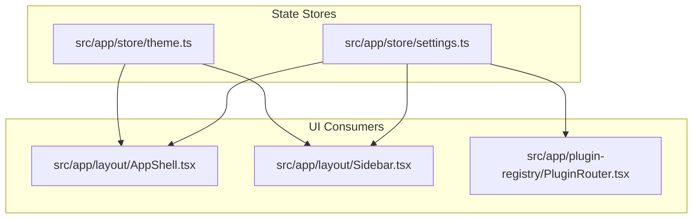
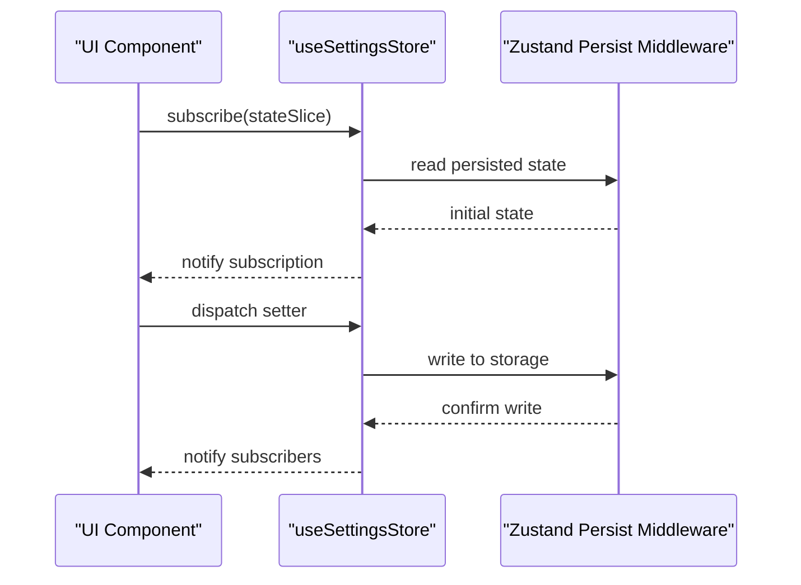
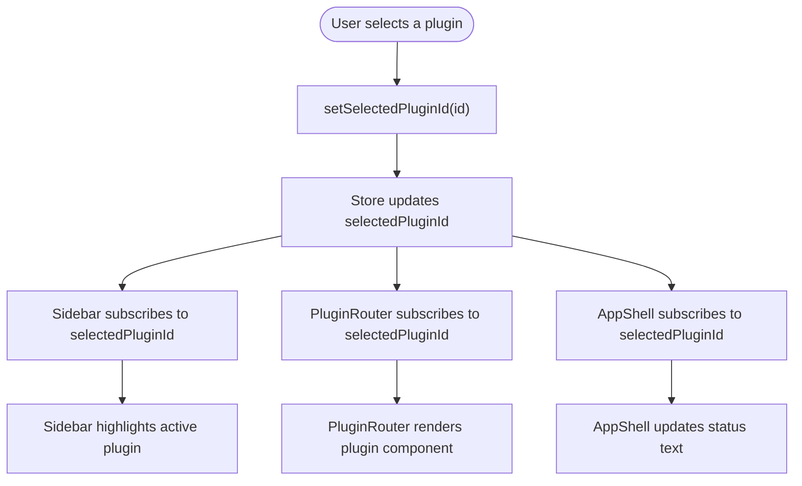
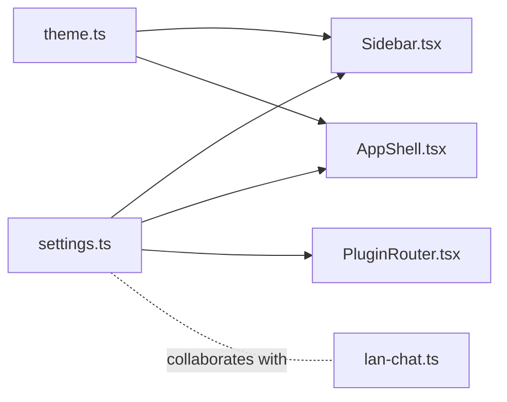

# Settings Store

<cite>
**Referenced Files in This Document**
- [settings.ts](file://src/app/store/settings.ts)
- [theme.ts](file://src/app/store/theme.ts)
- [AppShell.tsx](file://src/app/layout/AppShell.tsx)
- [Sidebar.tsx](file://src/app/layout/Sidebar.tsx)
- [PluginRouter.tsx](file://src/app/plugin-registry/PluginRouter.tsx)
- [lan-chat.ts](file://src/plugins/lan-chat/store/lan-chat.ts)
</cite>

## Table of Contents
1. [Introduction](#introduction)
2. [Project Structure](#project-structure)
3. [Core Components](#core-components)
4. [Architecture Overview](#architecture-overview)
5. [Detailed Component Analysis](#detailed-component-analysis)
6. [Dependency Analysis](#dependency-analysis)
7. [Performance Considerations](#performance-considerations)
8. [Troubleshooting Guide](#troubleshooting-guide)
9. [Conclusion](#conclusion)

## Introduction
This document explains the settings store implementation in RDMM's state management system. It covers the SettingsState interface and its properties, the Zustand store creation pattern with the persist middleware for local storage integration, setter functions and their usage patterns, practical examples of accessing and modifying settings state, reactive UI updates, integration with the plugin system, and state persistence mechanisms including defaults and migration strategies.

## Project Structure
The settings store is part of the application's frontend state management layer alongside the theme store. It is consumed by UI components such as the sidebar and plugin router, and integrates with the broader application shell.

**Diagram sources**
- [settings.ts:1-28](file://src/app/store/settings.ts#L1-L28)
- [theme.ts:1-27](file://src/app/store/theme.ts#L1-L27)
- [AppShell.tsx:1-207](file://src/app/layout/AppShell.tsx#L1-L207)
- [Sidebar.tsx:1-177](file://src/app/layout/Sidebar.tsx#L1-L177)
- [PluginRouter.tsx:1-29](file://src/app/plugin-registry/PluginRouter.tsx#L1-L29)

**Section sources**
- [settings.ts:1-28](file://src/app/store/settings.ts#L1-L28)
- [theme.ts:1-27](file://src/app/store/theme.ts#L1-L27)
- [AppShell.tsx:1-207](file://src/app/layout/AppShell.tsx#L1-L207)
- [Sidebar.tsx:1-177](file://src/app/layout/Sidebar.tsx#L1-L177)
- [PluginRouter.tsx:1-29](file://src/app/plugin-registry/PluginRouter.tsx#L1-L29)

## Core Components
The settings store defines a small, focused state shape with three primary properties and their setters:
- sidebarCollapsed: boolean — controls whether the main sidebar is collapsed.
- dbToolsCollapsed: boolean — controls whether the database tools group within the sidebar is collapsed.
- selectedPluginId: string — identifies the currently selected plugin to render in the main content area.

It exposes setter functions for each property to mutate state immutably via Zustand’s set updater.

Default values:
- sidebarCollapsed: false
- dbToolsCollapsed: false
- selectedPluginId: "redis-manager"

Persistence:
- The store is wrapped with Zustand’s persist middleware and stored under the key "devnexus-settings".

Reactive consumption:
- Components subscribe to specific slices of the store using selector functions to minimize re-renders.

**Section sources**
- [settings.ts:4-27](file://src/app/store/settings.ts#L4-L27)

## Architecture Overview
The settings store follows a straightforward pattern:
- Define a typed state interface with getters and setters.
- Create the store with Zustand’s create and wrap with persist middleware.
- Export a hook-like accessor for consumers.
- Subscribe to specific state slices in UI components.

**Diagram sources**
- [settings.ts:13-27](file://src/app/store/settings.ts#L13-L27)

## Detailed Component Analysis

### SettingsState Interface and Properties
- sidebarCollapsed: boolean
  - Purpose: Controls the sidebar collapse state.
  - Setter: setSidebarCollapsed(collapsed: boolean)
  - Defaults: false
- dbToolsCollapsed: boolean
  - Purpose: Controls the database tools group collapse state.
  - Setter: setDbToolsCollapsed(collapsed: boolean)
  - Defaults: false
- selectedPluginId: string
  - Purpose: Identifies the active plugin rendered in the main content area.
  - Setter: setSelectedPluginId(id: string)
  - Defaults: "redis-manager"

Setter usage patterns:
- Direct assignment via the exposed setter functions.
- Conditional toggling by reading current state and negating it before setting.

Integration points:
- Sidebar component reads and writes sidebarCollapsed and dbToolsCollapsed.
- Sidebar and AppShell read selectedPluginId to compute derived UI state.
- PluginRouter renders the component associated with selectedPluginId.

**Section sources**
- [settings.ts:4-27](file://src/app/store/settings.ts#L4-L27)
- [Sidebar.tsx:26-37](file://src/app/layout/Sidebar.tsx#L26-L37)
- [AppShell.tsx:32-33](file://src/app/layout/AppShell.tsx#L32-L33)
- [PluginRouter.tsx:7-13](file://src/app/plugin-registry/PluginRouter.tsx#L7-L13)

### Zustand Store Creation Pattern with Persist Middleware
- Store creation: Uses Zustand’s create with a typed state interface.
- Persist middleware: Wraps the store creator with persist configuration.
- Storage key: "devnexus-settings".
- Persistence behavior: Automatically syncs state to storage on updates and hydrates on initialization.

Practical examples:
- Accessing state: Components use selector functions to subscribe to specific fields.
- Modifying state: Components call the corresponding setter functions.
- Reactive updates: Components re-render only when their subscribed slice changes.

**Section sources**
- [settings.ts:13-27](file://src/app/store/settings.ts#L13-L27)

### Setter Functions and Usage Patterns
Common patterns observed in the codebase:
- Toggle behavior: Read current value, negate it, and pass to the setter.
- Direct assignment: Pass a constant or computed value to the setter.
- Derived state computation: Components derive UI behavior from selectedPluginId (e.g., computing tool name or active group).

Examples in UI:
- Sidebar toggles sidebarCollapsed and dbToolsCollapsed.
- Sidebar sets selectedPluginId when a plugin button is clicked.
- AppShell derives selectedToolName from selectedPluginId for status bar rendering.
- PluginRouter selects the plugin component based on selectedPluginId.

**Section sources**
- [Sidebar.tsx:94-106](file://src/app/layout/Sidebar.tsx#L94-L106)
- [Sidebar.tsx:60-60](file://src/app/layout/Sidebar.tsx#L60-L60)
- [AppShell.tsx:44-44](file://src/app/layout/AppShell.tsx#L44-L44)
- [PluginRouter.tsx:10-13](file://src/app/plugin-registry/PluginRouter.tsx#L10-L13)

### Practical Examples: Accessing and Modifying Settings State
- Accessing state:
  - Subscribe to a single field: useSettingsStore((state) => state.sidebarCollapsed)
  - Compute derived values: useMemo(() => getById(selectedPluginId), [selectedPluginId])
- Modifying state:
  - Toggle a boolean: setSidebarCollapsed(!sidebarCollapsed)
  - Switch plugin selection: setSelectedPluginId(targetPluginId)

Reactive UI updates:
- Sidebar conditionally renders plugin groups and tooltips based on collapsed flags.
- AppShell displays the selected tool name in the footer based on selectedPluginId.
- PluginRouter switches the main content component reactively.

**Section sources**
- [Sidebar.tsx:26-37](file://src/app/layout/Sidebar.tsx#L26-L37)
- [Sidebar.tsx:94-106](file://src/app/layout/Sidebar.tsx#L94-L106)
- [AppShell.tsx:44-55](file://src/app/layout/AppShell.tsx#L44-L55)
- [PluginRouter.tsx:7-13](file://src/app/plugin-registry/PluginRouter.tsx#L7-L13)

### Integration with the Plugin System
- selectedPluginId drives the active plugin selection.
- PluginRouter resolves the component to render based on selectedPluginId.
- Sidebar maintains a mapping of plugin categories and highlights the active plugin.
- AppShell computes the human-readable tool name from selectedPluginId for status reporting.

**Diagram sources**
- [settings.ts:9-21](file://src/app/store/settings.ts#L9-L21)
- [Sidebar.tsx:42-48](file://src/app/layout/Sidebar.tsx#L42-L48)
- [PluginRouter.tsx:7-13](file://src/app/plugin-registry/PluginRouter.tsx#L7-L13)
- [AppShell.tsx:44-55](file://src/app/layout/AppShell.tsx#L44-L55)

**Section sources**
- [settings.ts:9-21](file://src/app/store/settings.ts#L9-L21)
- [Sidebar.tsx:42-48](file://src/app/layout/Sidebar.tsx#L42-L48)
- [PluginRouter.tsx:7-13](file://src/app/plugin-registry/PluginRouter.tsx#L7-L13)
- [AppShell.tsx:44-55](file://src/app/layout/AppShell.tsx#L44-L55)

### State Persistence Mechanisms, Defaults, and Migration Strategies
- Persistence key: "devnexus-settings"
- Defaults: Defined in the store initializer
  - sidebarCollapsed: false
  - dbToolsCollapsed: false
  - selectedPluginId: "redis-manager"
- Migration strategy: The current implementation does not define a migrate function in the persist configuration. If migrations are needed in the future, add a migrate option to the persist config to handle version upgrades.

Comparison with theme store:
- Theme store also uses persist middleware with a dedicated storage key ("devnexus-theme") and similar patterns for defaults and setters.

**Section sources**
- [settings.ts:23-25](file://src/app/store/settings.ts#L23-L25)
- [settings.ts:16-21](file://src/app/store/settings.ts#L16-L21)
- [theme.ts:22-24](file://src/app/store/theme.ts#L22-L24)
- [theme.ts:15-19](file://src/app/store/theme.ts#L15-L19)

## Dependency Analysis
The settings store is consumed by several UI components. The following diagram shows the key dependencies:

**Diagram sources**
- [settings.ts:1-28](file://src/app/store/settings.ts#L1-L28)
- [Sidebar.tsx:1-177](file://src/app/layout/Sidebar.tsx#L1-L177)
- [AppShell.tsx:1-207](file://src/app/layout/AppShell.tsx#L1-L207)
- [PluginRouter.tsx:1-29](file://src/app/plugin-registry/PluginRouter.tsx#L1-L29)
- [theme.ts:1-27](file://src/app/store/theme.ts#L1-L27)
- [lan-chat.ts:1-59](file://src/plugins/lan-chat/store/lan-chat.ts#L1-L59)

**Section sources**
- [settings.ts:1-28](file://src/app/store/settings.ts#L1-L28)
- [Sidebar.tsx:1-177](file://src/app/layout/Sidebar.tsx#L1-L177)
- [AppShell.tsx:1-207](file://src/app/layout/AppShell.tsx#L1-L207)
- [PluginRouter.tsx:1-29](file://src/app/plugin-registry/PluginRouter.tsx#L1-L29)
- [theme.ts:1-27](file://src/app/store/theme.ts#L1-L27)
- [lan-chat.ts:1-59](file://src/plugins/lan-chat/store/lan-chat.ts#L1-L59)

## Performance Considerations
- Selective subscriptions: Components subscribe to narrow slices of state to reduce unnecessary re-renders.
- Minimal state shape: Keeping state minimal helps avoid excessive updates.
- Persist overhead: Persist middleware introduces serialization/deserialization costs; ensure only essential fields are persisted.
- Avoid frequent writes: Batch updates when possible to minimize storage churn.

## Troubleshooting Guide
Common issues and resolutions:
- State not persisting:
  - Verify the storage key "devnexus-settings" exists in browser storage/local storage.
  - Confirm the persist middleware is properly configured and not overridden elsewhere.
- Unexpected default values:
  - Check the initializer defaults in the store definition.
  - Ensure no code is resetting the state immediately after hydration.
- UI not updating:
  - Confirm components subscribe using selector functions rather than subscribing to the entire store.
  - Verify setter functions are called with the intended values.
- Migration scenarios:
  - Add a migrate function in the persist config to transform old persisted state to the new schema when fields change.

**Section sources**
- [settings.ts:23-25](file://src/app/store/settings.ts#L23-L25)
- [settings.ts:16-21](file://src/app/store/settings.ts#L16-L21)

## Conclusion
The settings store provides a concise, strongly-typed state model for UI preferences and plugin selection, integrated seamlessly with React components via selective subscriptions. Its persist middleware ensures user preferences survive reloads. The current implementation establishes sensible defaults and straightforward setter patterns, enabling predictable reactive UI behavior. Future enhancements can include explicit migration strategies if the state model evolves.