# State Management

<cite>
**Referenced Files in This Document**
- [settings.ts](file://src/app/store/settings.ts)
- [theme.ts](file://src/app/store/theme.ts)
- [PluginRouter.tsx](file://src/app/plugin-registry/PluginRouter.tsx)
- [registry.ts](file://src/app/plugin-registry/registry.ts)
- [workspace.ts](file://src/plugins/redis-manager/store/workspace.ts)
- [connections.ts](file://src/plugins/redis-manager/store/connections.ts)
- [key-browser.ts](file://src/plugins/redis-manager/store/key-browser.ts)
- [console.ts](file://src/plugins/redis-manager/store/console.ts)
- [server-info.ts](file://src/plugins/redis-manager/store/server-info.ts)
- [lan-chat.ts](file://src/plugins/lan-chat/store/lan-chat.ts)
- [KeyBrowser.tsx](file://src/plugins/redis-manager/views/KeyBrowser.tsx)
</cite>

## Table of Contents
1. [Introduction](#introduction)
2. [Project Structure](#project-structure)
3. [Core Components](#core-components)
4. [Architecture Overview](#architecture-overview)
5. [Detailed Component Analysis](#detailed-component-analysis)
6. [Dependency Analysis](#dependency-analysis)
7. [Performance Considerations](#performance-considerations)
8. [Troubleshooting Guide](#troubleshooting-guide)
9. [Conclusion](#conclusion)
10. [Appendices](#appendices)

## Introduction
This document explains RDMM’s state management system built on Zustand for application-wide state. It focuses on:
- Settings store for user preferences, plugin selection, and UI state
- Theme store for light/dark mode and persistence
- Persistence via Zustand middleware
- Reactive updates across components
- Integration with the plugin system
- Practical patterns for creating new stores, managing complex state, and synchronizing state across components
- Performance optimization, debugging, and best practices for desktop apps

## Project Structure
RDMM organizes state by domain and feature:
- Application-wide stores live under src/app/store
- Plugin-specific stores live under src/plugins/<plugin>/store
- UI components subscribe to stores and orchestrate actions

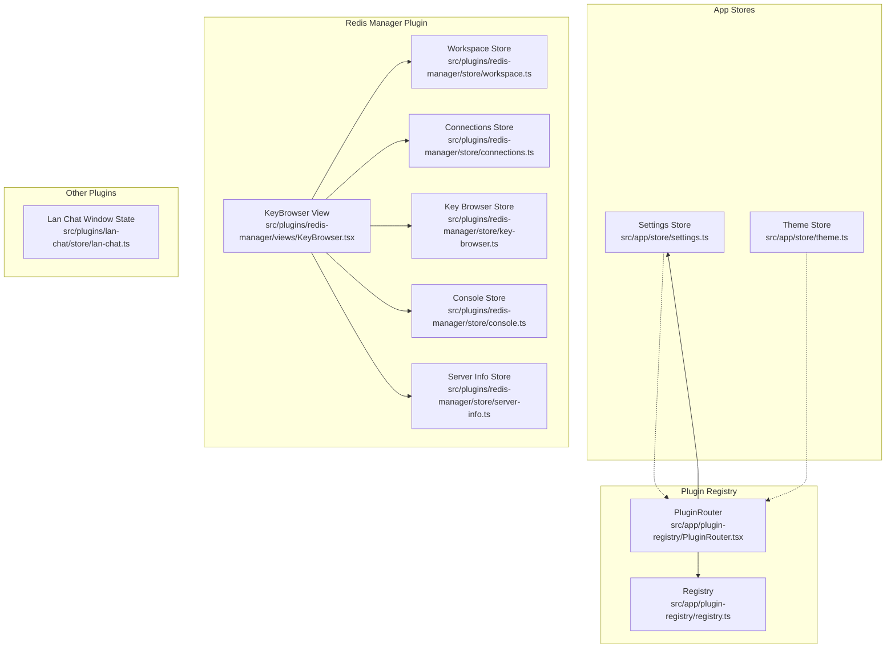

**Diagram sources**
- [settings.ts:1-27](file://src/app/store/settings.ts#L1-L27)
- [theme.ts:1-26](file://src/app/store/theme.ts#L1-L26)
- [PluginRouter.tsx:1-28](file://src/app/plugin-registry/PluginRouter.tsx#L1-L28)
- [registry.ts:1-26](file://src/app/plugin-registry/registry.ts#L1-L26)
- [workspace.ts:1-26](file://src/plugins/redis-manager/store/workspace.ts#L1-L26)
- [connections.ts:1-91](file://src/plugins/redis-manager/store/connections.ts#L1-L91)
- [key-browser.ts:1-224](file://src/plugins/redis-manager/store/key-browser.ts#L1-L224)
- [console.ts:1-75](file://src/plugins/redis-manager/store/console.ts#L1-L75)
- [server-info.ts:1-48](file://src/plugins/redis-manager/store/server-info.ts#L1-L48)
- [lan-chat.ts:1-59](file://src/plugins/lan-chat/store/lan-chat.ts#L1-L59)
- [KeyBrowser.tsx:33-74](file://src/plugins/redis-manager/views/KeyBrowser.tsx#L33-L74)

**Section sources**
- [settings.ts:1-27](file://src/app/store/settings.ts#L1-L27)
- [theme.ts:1-26](file://src/app/store/theme.ts#L1-L26)
- [PluginRouter.tsx:1-28](file://src/app/plugin-registry/PluginRouter.tsx#L1-L28)
- [registry.ts:1-26](file://src/app/plugin-registry/registry.ts#L1-L26)
- [workspace.ts:1-26](file://src/plugins/redis-manager/store/workspace.ts#L1-L26)
- [connections.ts:1-91](file://src/plugins/redis-manager/store/connections.ts#L1-L91)
- [key-browser.ts:1-224](file://src/plugins/redis-manager/store/key-browser.ts#L1-L224)
- [console.ts:1-75](file://src/plugins/redis-manager/store/console.ts#L1-L75)
- [server-info.ts:1-48](file://src/plugins/redis-manager/store/server-info.ts#L1-L48)
- [lan-chat.ts:1-59](file://src/plugins/lan-chat/store/lan-chat.ts#L1-L59)
- [KeyBrowser.tsx:33-74](file://src/plugins/redis-manager/views/KeyBrowser.tsx#L33-L74)

## Core Components
- Settings store: manages UI state (sidebar/db tools collapsed) and plugin selection. Persisted to local storage.
- Theme store: manages light/dark mode and toggling. Persisted to local storage.
- Plugin router: selects which plugin view to render based on the selected plugin ID from settings.
- Redis manager stores: manage workspace, connections, key browsing, console, and server info.

Key implementation patterns:
- Zustand create with functional reducers
- Optional persistence via Zustand middleware
- Component subscriptions via selector functions to minimize re-renders
- Asynchronous actions using Tauri invoke for backend calls

**Section sources**
- [settings.ts:1-27](file://src/app/store/settings.ts#L1-L27)
- [theme.ts:1-26](file://src/app/store/theme.ts#L1-L26)
- [PluginRouter.tsx:1-28](file://src/app/plugin-registry/PluginRouter.tsx#L1-L28)
- [workspace.ts:1-26](file://src/plugins/redis-manager/store/workspace.ts#L1-L26)
- [connections.ts:1-91](file://src/plugins/redis-manager/store/connections.ts#L1-L91)
- [key-browser.ts:1-224](file://src/plugins/redis-manager/store/key-browser.ts#L1-L224)
- [console.ts:1-75](file://src/plugins/redis-manager/store/console.ts#L1-L75)
- [server-info.ts:1-48](file://src/plugins/redis-manager/store/server-info.ts#L1-L48)

## Architecture Overview
Zustand stores are the single source of truth for UI and plugin state. Components subscribe to slices of state and dispatch actions. The plugin router reads the selected plugin ID from settings to render the appropriate plugin view.

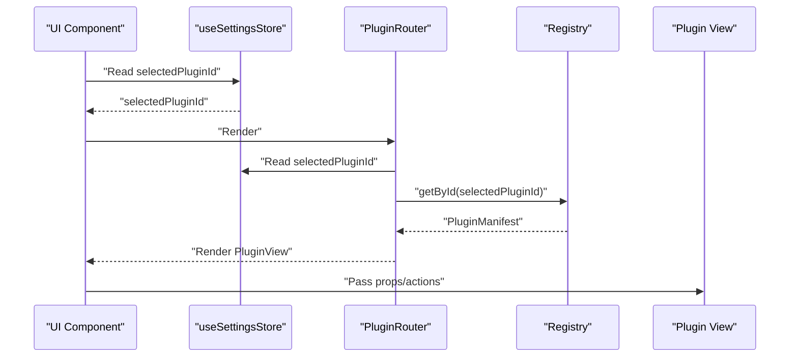

**Diagram sources**
- [settings.ts:1-27](file://src/app/store/settings.ts#L1-L27)
- [PluginRouter.tsx:1-28](file://src/app/plugin-registry/PluginRouter.tsx#L1-L28)
- [registry.ts:1-26](file://src/app/plugin-registry/registry.ts#L1-L26)

**Section sources**
- [settings.ts:1-27](file://src/app/store/settings.ts#L1-L27)
- [PluginRouter.tsx:1-28](file://src/app/plugin-registry/PluginRouter.tsx#L1-L28)
- [registry.ts:1-26](file://src/app/plugin-registry/registry.ts#L1-L26)

## Detailed Component Analysis

### Settings Store
Purpose:
- Track UI state: sidebarCollapsed, dbToolsCollapsed
- Track user selection: selectedPluginId
- Persisted to local storage for continuity across sessions

Implementation highlights:
- Uses Zustand create with a reducer returning state and actions
- Persists state under a dedicated storage key
- Actions update single fields atomically

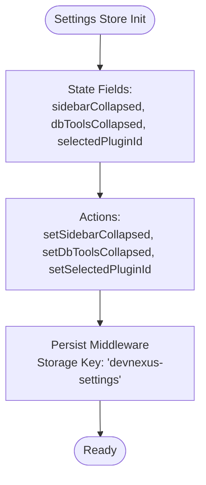

**Diagram sources**
- [settings.ts:1-27](file://src/app/store/settings.ts#L1-L27)

**Section sources**
- [settings.ts:1-27](file://src/app/store/settings.ts#L1-L27)

### Theme Store
Purpose:
- Manage theme mode (light/dark)
- Toggle mode and persist preference

Implementation highlights:
- Uses Zustand create with set/get helpers
- Provides imperative toggle using get() to compute next mode
- Persisted under a dedicated storage key

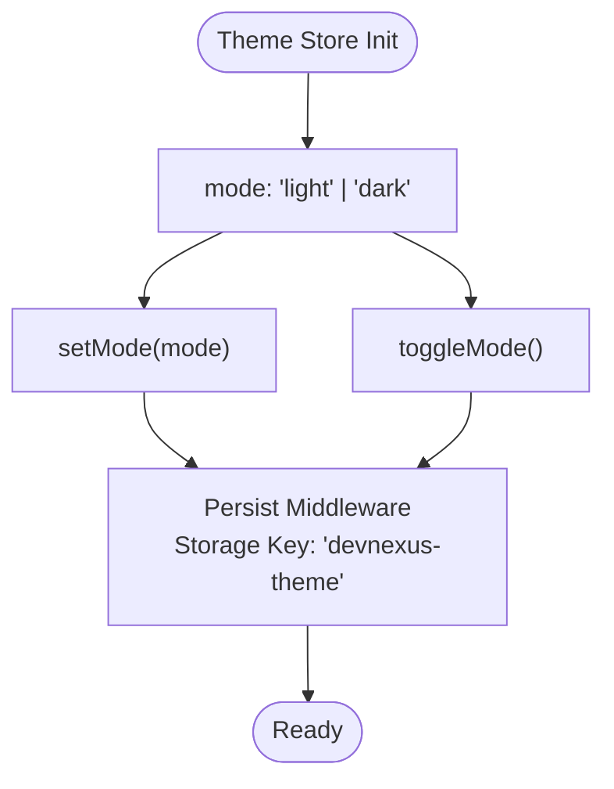

**Diagram sources**
- [theme.ts:1-26](file://src/app/store/theme.ts#L1-L26)

**Section sources**
- [theme.ts:1-26](file://src/app/store/theme.ts#L1-L26)

### Plugin Router and Registry
Purpose:
- Render the currently selected plugin view
- Provide a registry of available plugins

Key behaviors:
- Reads selectedPluginId from settings
- Resolves manifest via registry
- Falls back to the first plugin if none is selected

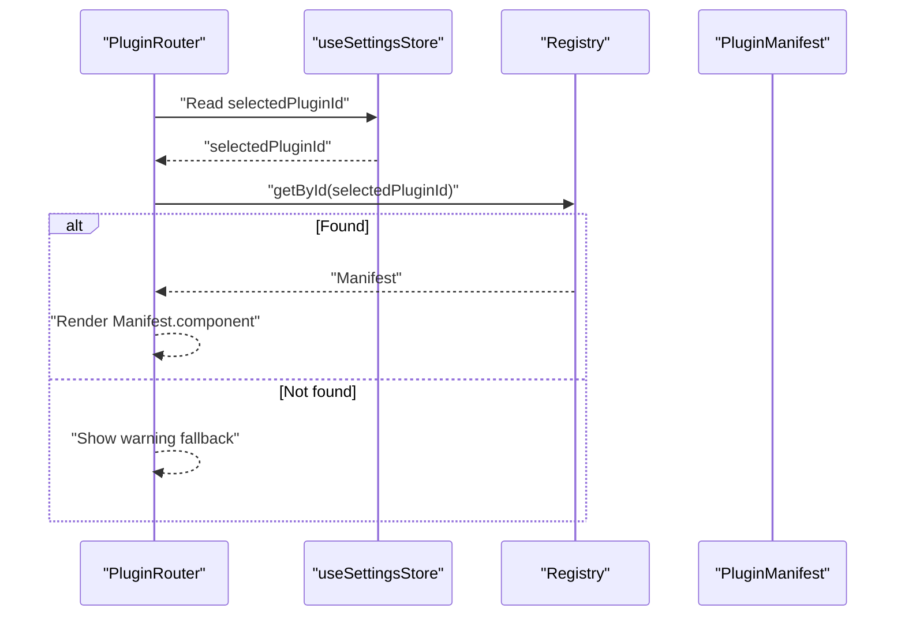

**Diagram sources**
- [PluginRouter.tsx:1-28](file://src/app/plugin-registry/PluginRouter.tsx#L1-L28)
- [settings.ts:1-27](file://src/app/store/settings.ts#L1-L27)
- [registry.ts:1-26](file://src/app/plugin-registry/registry.ts#L1-L26)

**Section sources**
- [PluginRouter.tsx:1-28](file://src/app/plugin-registry/PluginRouter.tsx#L1-L28)
- [settings.ts:1-27](file://src/app/store/settings.ts#L1-L27)
- [registry.ts:1-26](file://src/app/plugin-registry/registry.ts#L1-L26)

### Redis Manager: Workspace Store
Purpose:
- Track active connection, database index, selected key, and active view
- Coordinate navigation within the Redis plugin

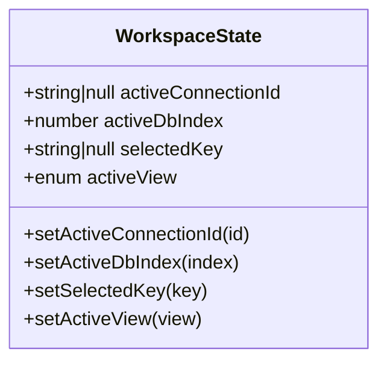

**Diagram sources**
- [workspace.ts:1-26](file://src/plugins/redis-manager/store/workspace.ts#L1-L26)

**Section sources**
- [workspace.ts:1-26](file://src/plugins/redis-manager/store/workspace.ts#L1-L26)

### Redis Manager: Connections Store
Purpose:
- Manage connection lifecycle and metadata
- Keep track of connected IDs, server info, latency, and loading states

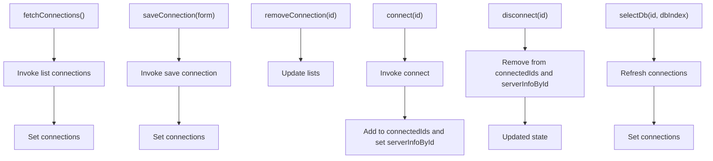

**Diagram sources**
- [connections.ts:1-91](file://src/plugins/redis-manager/store/connections.ts#L1-L91)

**Section sources**
- [connections.ts:1-91](file://src/plugins/redis-manager/store/connections.ts#L1-L91)

### Redis Manager: Key Browser Store
Purpose:
- Scan and filter keys
- Load key details by type (string/hash/list/set/zset)
- Mutate key values and metadata
- Maintain loading and selection state

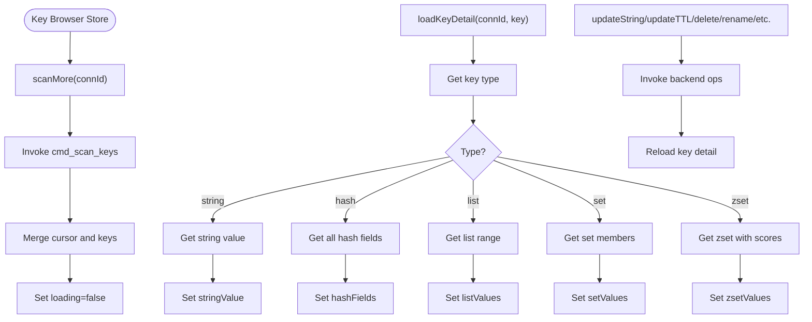

**Diagram sources**
- [key-browser.ts:1-224](file://src/plugins/redis-manager/store/key-browser.ts#L1-L224)

**Section sources**
- [key-browser.ts:1-224](file://src/plugins/redis-manager/store/key-browser.ts#L1-L224)

### Redis Manager: Console Store
Purpose:
- Manage command input, history, and logs
- Navigate history and execute commands via Tauri

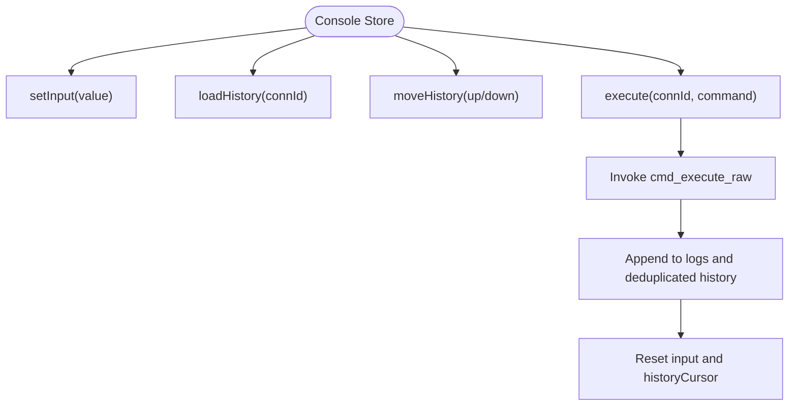

**Diagram sources**
- [console.ts:1-75](file://src/plugins/redis-manager/store/console.ts#L1-L75)

**Section sources**
- [console.ts:1-75](file://src/plugins/redis-manager/store/console.ts#L1-L75)

### Redis Manager: Server Info Store
Purpose:
- Fetch and cache server info, slow logs, and DB sizes
- Maintain rolling series for memory and operations metrics

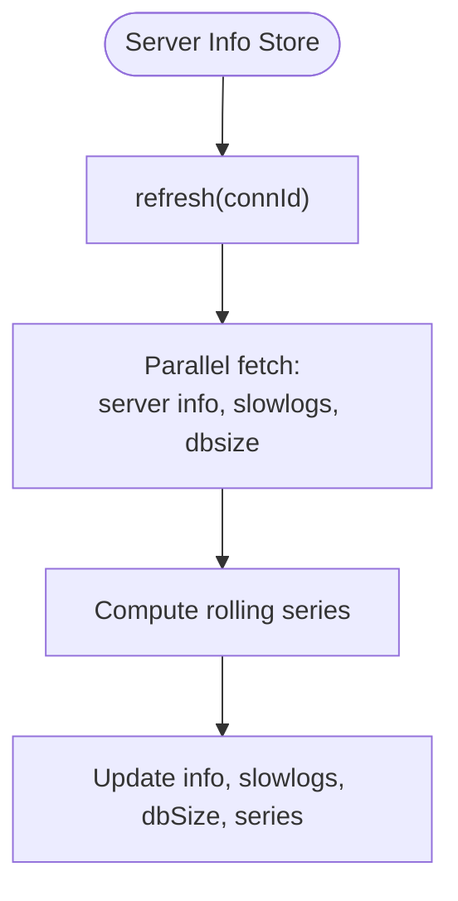

**Diagram sources**
- [server-info.ts:1-48](file://src/plugins/redis-manager/store/server-info.ts#L1-L48)

**Section sources**
- [server-info.ts:1-48](file://src/plugins/redis-manager/store/server-info.ts#L1-L48)

### Lan Chat Window State Snapshot
Purpose:
- Encapsulate window geometry, visibility, and unread counts
- Provide helpers to toggle window and update unread counters

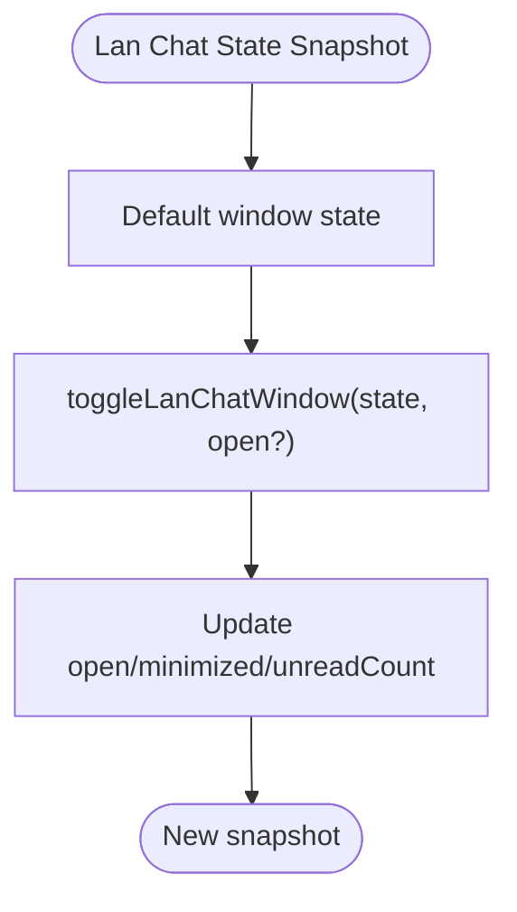

**Diagram sources**
- [lan-chat.ts:1-59](file://src/plugins/lan-chat/store/lan-chat.ts#L1-L59)

**Section sources**
- [lan-chat.ts:1-59](file://src/plugins/lan-chat/store/lan-chat.ts#L1-L59)

### Component-Level Subscription Patterns
Example: KeyBrowser view subscribes to multiple slices of the key browser store and workspace/connections stores to coordinate UI and actions.

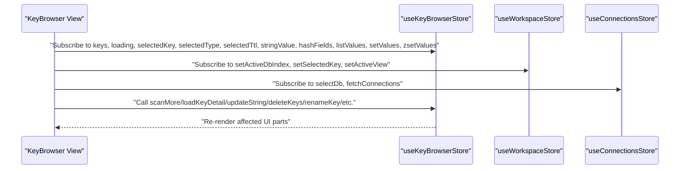

**Diagram sources**
- [KeyBrowser.tsx:33-74](file://src/plugins/redis-manager/views/KeyBrowser.tsx#L33-L74)
- [key-browser.ts:1-224](file://src/plugins/redis-manager/store/key-browser.ts#L1-L224)
- [workspace.ts:1-26](file://src/plugins/redis-manager/store/workspace.ts#L1-L26)
- [connections.ts:1-91](file://src/plugins/redis-manager/store/connections.ts#L1-L91)

**Section sources**
- [KeyBrowser.tsx:33-74](file://src/plugins/redis-manager/views/KeyBrowser.tsx#L33-L74)
- [key-browser.ts:1-224](file://src/plugins/redis-manager/store/key-browser.ts#L1-L224)
- [workspace.ts:1-26](file://src/plugins/redis-manager/store/workspace.ts#L1-L26)
- [connections.ts:1-91](file://src/plugins/redis-manager/store/connections.ts#L1-L91)

## Dependency Analysis
- Settings store depends on:
  - Plugin router for rendering
  - Theme store for UI mode
- Plugin router depends on:
  - Settings store for selected plugin ID
  - Registry for manifests
- Redis manager stores depend on:
  - Tauri invoke for backend operations
  - Each other for coordinated UI state (e.g., workspace and connections influence key browser)

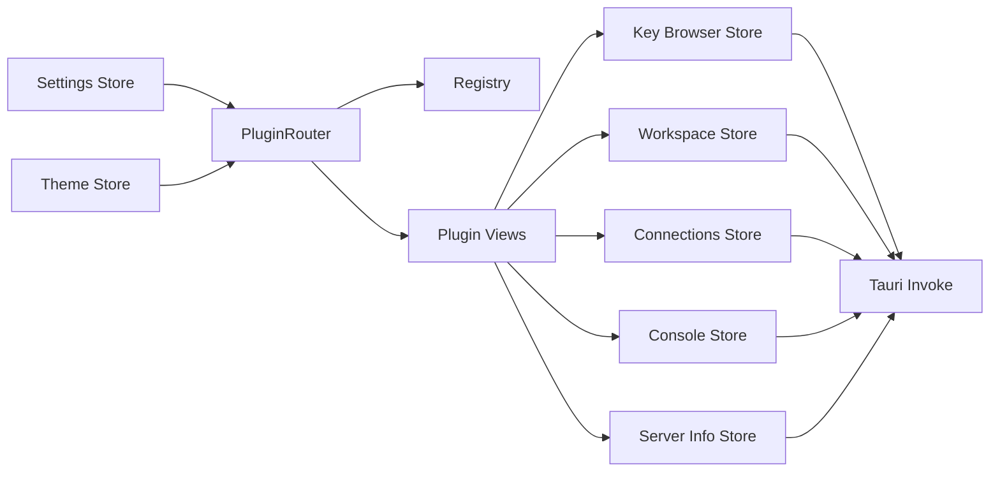

**Diagram sources**
- [settings.ts:1-27](file://src/app/store/settings.ts#L1-L27)
- [theme.ts:1-26](file://src/app/store/theme.ts#L1-L26)
- [PluginRouter.tsx:1-28](file://src/app/plugin-registry/PluginRouter.tsx#L1-L28)
- [registry.ts:1-26](file://src/app/plugin-registry/registry.ts#L1-L26)
- [workspace.ts:1-26](file://src/plugins/redis-manager/store/workspace.ts#L1-L26)
- [connections.ts:1-91](file://src/plugins/redis-manager/store/connections.ts#L1-L91)
- [key-browser.ts:1-224](file://src/plugins/redis-manager/store/key-browser.ts#L1-L224)
- [console.ts:1-75](file://src/plugins/redis-manager/store/console.ts#L1-L75)
- [server-info.ts:1-48](file://src/plugins/redis-manager/store/server-info.ts#L1-L48)

**Section sources**
- [settings.ts:1-27](file://src/app/store/settings.ts#L1-L27)
- [theme.ts:1-26](file://src/app/store/theme.ts#L1-L26)
- [PluginRouter.tsx:1-28](file://src/app/plugin-registry/PluginRouter.tsx#L1-L28)
- [registry.ts:1-26](file://src/app/plugin-registry/registry.ts#L1-L26)
- [workspace.ts:1-26](file://src/plugins/redis-manager/store/workspace.ts#L1-L26)
- [connections.ts:1-91](file://src/plugins/redis-manager/store/connections.ts#L1-L91)
- [key-browser.ts:1-224](file://src/plugins/redis-manager/store/key-browser.ts#L1-L224)
- [console.ts:1-75](file://src/plugins/redis-manager/store/console.ts#L1-L75)
- [server-info.ts:1-48](file://src/plugins/redis-manager/store/server-info.ts#L1-L48)

## Performance Considerations
- Prefer narrow selectors to reduce re-renders:
  - Subscribe to only the fields needed by the component
  - Example: use a selector that extracts a single slice of state
- Batch updates when possible:
  - Group related state changes in a single set callback
- Avoid unnecessary renders:
  - Use useMemo/useCallback for derived values
- Debounce or throttle expensive operations:
  - For scanning or history navigation, consider throttling
- Use optimistic updates for immediate feedback:
  - Update UI before awaiting backend completion, then reconcile on failure
- Limit persisted payload size:
  - Persist only essential fields; avoid storing large transient arrays
- Parallelize independent async calls:
  - Use Promise.all for independent fetches (as seen in server info store)

[No sources needed since this section provides general guidance]

## Troubleshooting Guide
Common issues and remedies:
- State not persisting:
  - Verify middleware is applied and storage key matches expectations
  - Check browser/local storage permissions
- Unexpected re-renders:
  - Ensure selectors are stable and not recreated per render
  - Use shallow equality checks for object/array fields
- Async action errors:
  - Wrap async actions in try/catch and surface user-friendly messages
  - Ensure cleanup sets loading flags back to false
- Stale data after mutation:
  - Re-fetch or reload dependent slices after mutating backend state
  - Use optimistic updates with rollback on failure

**Section sources**
- [settings.ts:1-27](file://src/app/store/settings.ts#L1-L27)
- [theme.ts:1-26](file://src/app/store/theme.ts#L1-L26)
- [server-info.ts:1-48](file://src/plugins/redis-manager/store/server-info.ts#L1-L48)

## Conclusion
RDMM’s state management leverages Zustand for simplicity and performance, with persistence for continuity. The settings and theme stores provide foundational UI state, while plugin-specific stores encapsulate domain logic. The plugin router coordinates rendering based on user selection. Following the subscription and mutation patterns outlined here ensures predictable, maintainable state management across the application.

[No sources needed since this section summarizes without analyzing specific files]

## Appendices

### Practical Recipes

- Creating a new store
  - Define state shape and action signatures
  - Use Zustand create with a reducer
  - Add optional persistence middleware with a unique storage key
  - Export the hook for component consumption

- Managing complex state objects
  - Split monolithic state into focused stores by domain
  - Use nested selectors to subscribe to specific fields
  - Normalize data to minimize deep updates

- Implementing state synchronization across components
  - Derive UI state from shared stores (e.g., active connection, selected key)
  - Use async actions to mutate backend state and then refresh dependent slices
  - Keep loading flags to reflect ongoing operations

- Best practices for desktop apps
  - Persist user preferences and UI layout
  - Use Tauri invoke for heavy operations off the UI thread
  - Provide undo/rollback for destructive operations
  - Keep stores serializable for persistence

[No sources needed since this section provides general guidance]