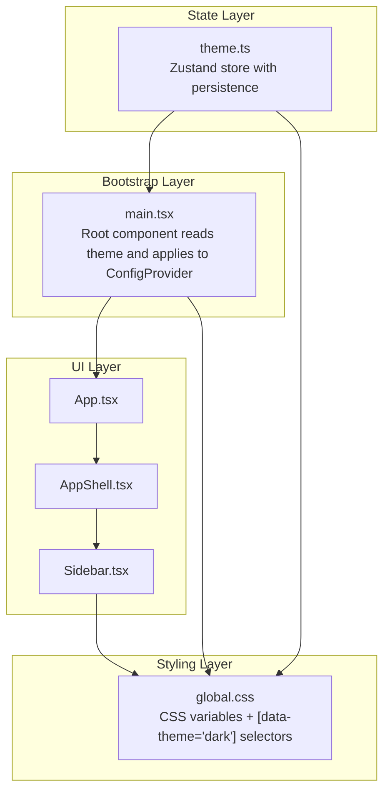
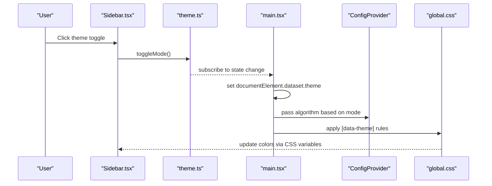
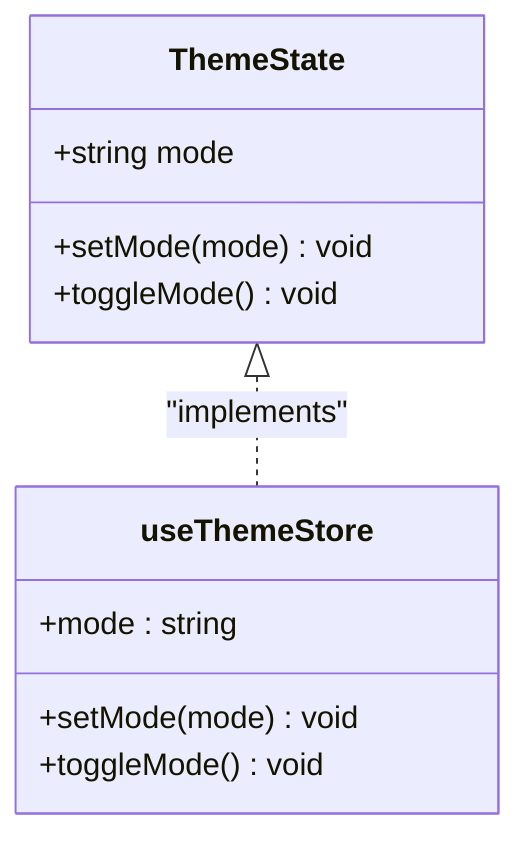
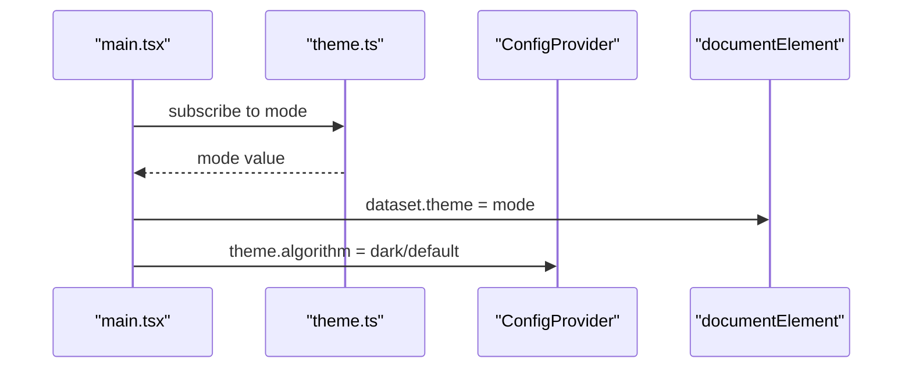
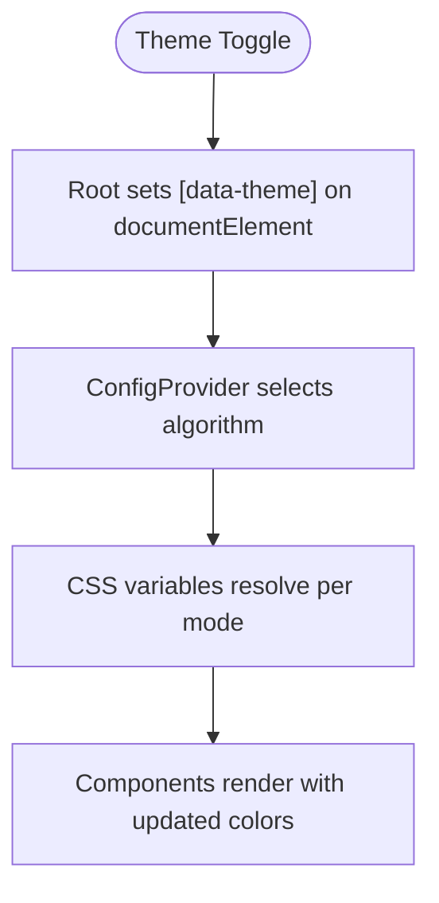
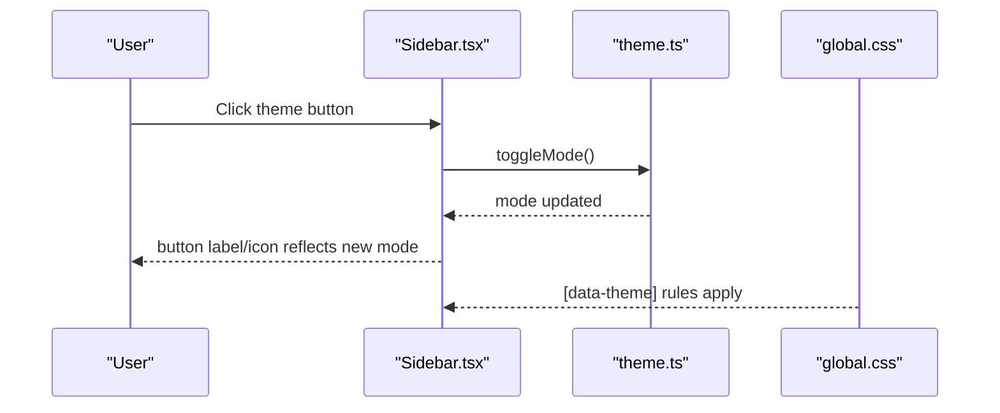
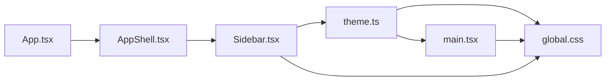

# Theme Store

<cite>
**Referenced Files in This Document**
- [theme.ts](file://src/app/store/theme.ts)
- [main.tsx](file://src/main.tsx)
- [global.css](file://src/styles/global.css)
- [Sidebar.tsx](file://src/app/layout/Sidebar.tsx)
- [AppShell.tsx](file://src/app/layout/AppShell.tsx)
- [App.tsx](file://src/App.tsx)
- [settings.ts](file://src/app/store/settings.ts)
</cite>

## Table of Contents
1. [Introduction](#introduction)
2. [Project Structure](#project-structure)
3. [Core Components](#core-components)
4. [Architecture Overview](#architecture-overview)
5. [Detailed Component Analysis](#detailed-component-analysis)
6. [Dependency Analysis](#dependency-analysis)
7. [Performance Considerations](#performance-considerations)
8. [Troubleshooting Guide](#troubleshooting-guide)
9. [Conclusion](#conclusion)

## Introduction
This document explains the theme store implementation in RDMM’s state management system. It covers how the theme state is modeled, persisted, and applied across the UI, including dark/light mode switching, CSS variable management, and component styling patterns. It also documents reactive theme updates, cross-component coordination, practical customization examples, and performance and accessibility considerations.

## Project Structure
The theme system spans three primary areas:
- State management: a lightweight Zustand store with persistence
- Application bootstrap: a single place where the theme is read and applied to the root
- Styles: CSS custom properties and data-theme selectors for coordinated light/dark styling

**Diagram sources**
- [theme.ts:12-26](file://src/app/store/theme.ts#L12-L26)
- [main.tsx:12-31](file://src/main.tsx#L12-L31)
- [global.css:1-17](file://src/styles/global.css#L1-L17)
- [global.css:892-900](file://src/styles/global.css#L892-L900)
- [App.tsx:4-10](file://src/App.tsx#L4-L10)
- [AppShell.tsx:31-206](file://src/app/layout/AppShell.tsx#L31-L206)
- [Sidebar.tsx:21-176](file://src/app/layout/Sidebar.tsx#L21-L176)

**Section sources**
- [theme.ts:12-26](file://src/app/store/theme.ts#L12-L26)
- [main.tsx:12-31](file://src/main.tsx#L12-L31)
- [global.css:1-17](file://src/styles/global.css#L1-L17)
- [global.css:892-900](file://src/styles/global.css#L892-L900)
- [App.tsx:4-10](file://src/App.tsx#L4-L10)
- [AppShell.tsx:31-206](file://src/app/layout/AppShell.tsx#L31-L206)
- [Sidebar.tsx:21-176](file://src/app/layout/Sidebar.tsx#L21-L176)

## Core Components
- Theme store: manages current mode ("light" | "dark"), provides setters and a toggle function, persists to storage
- Root provider: reads the current theme and passes the appropriate Ant Design algorithm to ConfigProvider
- CSS variables: central palette via CSS custom properties; dark overrides under [data-theme="dark"]
- UI integration: Sidebar exposes a theme toggle button wired to the store

Key responsibilities:
- Centralized theme state with persistence
- Reactive DOM attribute propagation ([data-theme]) for CSS targeting
- Ant Design algorithm selection for consistent component theming
- Component-level theme-awareness through CSS variable resolution

**Section sources**
- [theme.ts:4-10](file://src/app/store/theme.ts#L4-L10)
- [theme.ts:12-26](file://src/app/store/theme.ts#L12-L26)
- [main.tsx:12-31](file://src/main.tsx#L12-L31)
- [global.css:1-17](file://src/styles/global.css#L1-L17)
- [global.css:892-900](file://src/styles/global.css#L892-L900)
- [Sidebar.tsx:38-42](file://src/app/layout/Sidebar.tsx#L38-L42)

## Architecture Overview
The theme lifecycle:
1. Store initializes with a default mode and persists it
2. Root component subscribes to the store and sets a dataset flag on the document element
3. Ant Design ConfigProvider receives a theme algorithm based on the current mode
4. Global CSS variables resolve differently under [data-theme="dark"]
5. Components consume CSS variables and dark-mode-specific rules

**Diagram sources**
- [Sidebar.tsx:163-172](file://src/app/layout/Sidebar.tsx#L163-L172)
- [theme.ts:17-20](file://src/app/store/theme.ts#L17-L20)
- [main.tsx:13-17](file://src/main.tsx#L13-L17)
- [main.tsx:20-26](file://src/main.tsx#L20-L26)
- [global.css:892-900](file://src/styles/global.css#L892-L900)

## Detailed Component Analysis

### Theme Store
The theme store defines a minimal contract:
- mode: current theme mode
- setMode(mode): explicit setter
- toggleMode(): flips between modes

Persistence ensures the last-used theme persists across sessions.

**Diagram sources**
- [theme.ts:6-10](file://src/app/store/theme.ts#L6-L10)
- [theme.ts:12-26](file://src/app/store/theme.ts#L12-L26)

**Section sources**
- [theme.ts:4-10](file://src/app/store/theme.ts#L4-L10)
- [theme.ts:12-26](file://src/app/store/theme.ts#L12-L26)

### Root Provider and Ant Design Integration
The root component reads the theme from the store and sets a dataset flag on the document element. It also selects the Ant Design algorithm based on the current mode, ensuring all Ant Design components reflect the chosen theme.

**Diagram sources**
- [main.tsx:13-17](file://src/main.tsx#L13-L17)
- [main.tsx:20-26](file://src/main.tsx#L20-L26)
- [theme.ts:7-9](file://src/app/store/theme.ts#L7-L9)

**Section sources**
- [main.tsx:12-31](file://src/main.tsx#L12-L31)
- [theme.ts:7-9](file://src/app/store/theme.ts#L7-L9)

### CSS Variable Management and Dark Mode Coordination
The global stylesheet defines a palette of CSS custom properties at the root. A dedicated dark-mode override block redefines those variables when [data-theme="dark"] is present. Many component classes then reference these variables, ensuring consistent theming across the app.

Highlights:
- Root-level variables define base colors
- Dark-mode block overrides variables under [data-theme="dark"]
- Component classes reference variables for backgrounds, borders, and text

**Diagram sources**
- [main.tsx:13-17](file://src/main.tsx#L13-L17)
- [main.tsx:20-26](file://src/main.tsx#L20-L26)
- [global.css:1-17](file://src/styles/global.css#L1-L17)
- [global.css:892-900](file://src/styles/global.css#L892-L900)

**Section sources**
- [global.css:1-17](file://src/styles/global.css#L1-L17)
- [global.css:892-900](file://src/styles/global.css#L892-L900)

### Component Styling Patterns
The Sidebar integrates theme awareness:
- Reads current mode from the theme store
- Renders an icon and label appropriate to the current mode
- Calls toggleMode on click

This pattern demonstrates a small, focused integration point that coordinates with the store and CSS variables to update the UI immediately.

**Diagram sources**
- [Sidebar.tsx:38-42](file://src/app/layout/Sidebar.tsx#L38-L42)
- [Sidebar.tsx:163-172](file://src/app/layout/Sidebar.tsx#L163-L172)
- [theme.ts:17-20](file://src/app/store/theme.ts#L17-L20)
- [global.css:892-900](file://src/styles/global.css#L892-L900)

**Section sources**
- [Sidebar.tsx:38-42](file://src/app/layout/Sidebar.tsx#L38-L42)
- [Sidebar.tsx:163-172](file://src/app/layout/Sidebar.tsx#L163-L172)
- [theme.ts:17-20](file://src/app/store/theme.ts#L17-L20)
- [global.css:892-900](file://src/styles/global.css#L892-L900)

### Practical Examples

- Switching themes programmatically
  - Call the store’s setMode to force a specific mode
  - Example path: [theme.ts:setMode:8-9](file://src/app/store/theme.ts#L8-L9)

- Implementing a theme toggle UI
  - Use the store’s toggleMode in a button handler
  - Example path: [Sidebar.tsx:toggleMode](file://src/app/layout/Sidebar.tsx#L39)

- Coordinating theme changes across components
  - Subscribe to the store in any component to react to theme changes
  - Example path: [Sidebar.tsx:mode subscription](file://src/app/layout/Sidebar.tsx#L38)

- Customizing the palette
  - Adjust variables in the root block
  - Example path: [global.css:root variables:1-17](file://src/styles/global.css#L1-L17)
  - Add or refine dark-mode overrides under [data-theme="dark"]
  - Example path: [global.css:dark overrides:892-900](file://src/styles/global.css#L892-L900)

**Section sources**
- [theme.ts:8-9](file://src/app/store/theme.ts#L8-L9)
- [Sidebar.tsx:39](file://src/app/layout/Sidebar.tsx#L39)
- [Sidebar.tsx:38](file://src/app/layout/Sidebar.tsx#L38)
- [global.css:1-17](file://src/styles/global.css#L1-L17)
- [global.css:892-900](file://src/styles/global.css#L892-L900)

## Dependency Analysis
The theme system exhibits low coupling and high cohesion:
- theme.ts depends only on Zustand and its persistence middleware
- main.tsx depends on theme.ts and Ant Design ConfigProvider
- global.css depends on the dataset flag and the presence of the store
- Sidebar depends on theme.ts and uses the dataset flag indirectly via CSS

**Diagram sources**
- [theme.ts:12-26](file://src/app/store/theme.ts#L12-L26)
- [main.tsx:12-31](file://src/main.tsx#L12-L31)
- [global.css:1-17](file://src/styles/global.css#L1-L17)
- [Sidebar.tsx:21-176](file://src/app/layout/Sidebar.tsx#L21-L176)
- [AppShell.tsx:31-206](file://src/app/layout/AppShell.tsx#L31-L206)

**Section sources**
- [theme.ts:12-26](file://src/app/store/theme.ts#L12-L26)
- [main.tsx:12-31](file://src/main.tsx#L12-L31)
- [global.css:1-17](file://src/styles/global.css#L1-L17)
- [Sidebar.tsx:21-176](file://src/app/layout/Sidebar.tsx#L21-L176)
- [AppShell.tsx:31-206](file://src/app/layout/AppShell.tsx#L31-L206)

## Performance Considerations
- Minimal re-renders: The root component subscribes only to the mode field, minimizing unnecessary renders
- CSS variable updates are efficient and avoid expensive recalculations
- Persistence avoids repeated theme computations across sessions
- Ant Design algorithm switching occurs at the provider level and is optimized by the library

Recommendations:
- Keep theme store actions minimal to reduce store churn
- Prefer CSS variables for colors to leverage browser caching and recalculation efficiency
- Avoid frequent forced reflows during theme transitions

[No sources needed since this section provides general guidance]

## Troubleshooting Guide
Common issues and resolutions:
- Theme toggle does nothing
  - Verify the Sidebar is subscribed to the store and calls toggleMode
  - Confirm the dataset flag is being set on the document element
  - Example path: [Sidebar.tsx:toggleMode](file://src/app/layout/Sidebar.tsx#L39), [main.tsx:dataset flag](file://src/main.tsx#L16)

- Ant Design components not reflecting dark mode
  - Ensure the ConfigProvider receives the correct algorithm based on mode
  - Example path: [main.tsx:algorithm selection:20-26](file://src/main.tsx#L20-L26)

- Colors not updating after switching
  - Confirm CSS variables are defined and overridden under [data-theme="dark"]
  - Example path: [global.css:root variables:1-17](file://src/styles/global.css#L1-L17), [global.css:dark overrides:892-900](file://src/styles/global.css#L892-L900)

- Persisted theme not loading
  - Check the store’s persistence name and local storage availability
  - Example path: [theme.ts:persistence config:22-25](file://src/app/store/theme.ts#L22-L25)

**Section sources**
- [Sidebar.tsx:39](file://src/app/layout/Sidebar.tsx#L39)
- [main.tsx:16](file://src/main.tsx#L16)
- [main.tsx:20-26](file://src/main.tsx#L20-L26)
- [global.css:1-17](file://src/styles/global.css#L1-L17)
- [global.css:892-900](file://src/styles/global.css#L892-L900)
- [theme.ts:22-25](file://src/app/store/theme.ts#L22-L25)

## Conclusion
RDMM’s theme store provides a concise, robust foundation for theme management:
- A minimal Zustand store with persistence
- A root-level provider that propagates the theme to Ant Design and the DOM
- A CSS-driven palette with targeted dark-mode overrides
- Simple, reusable integration patterns across components

This design enables smooth theme switching, predictable styling across components, and straightforward extensibility for future themes or brand customizations.