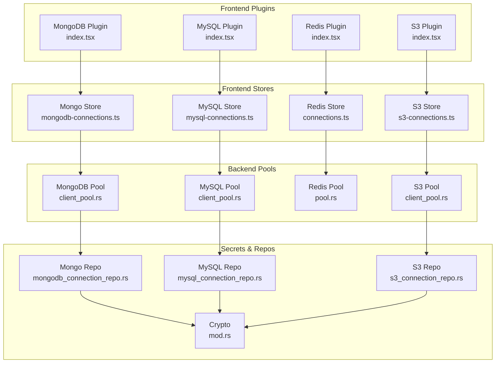
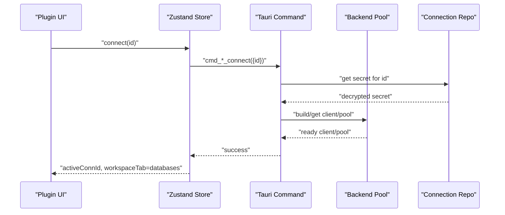
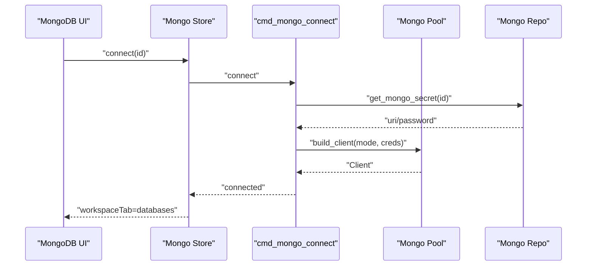
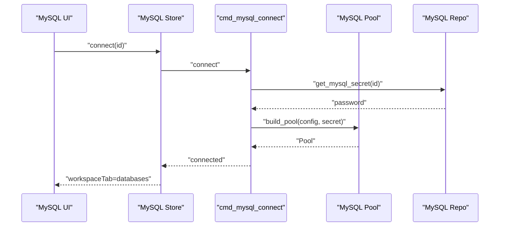
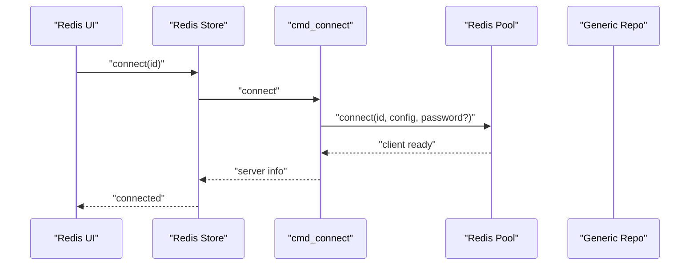
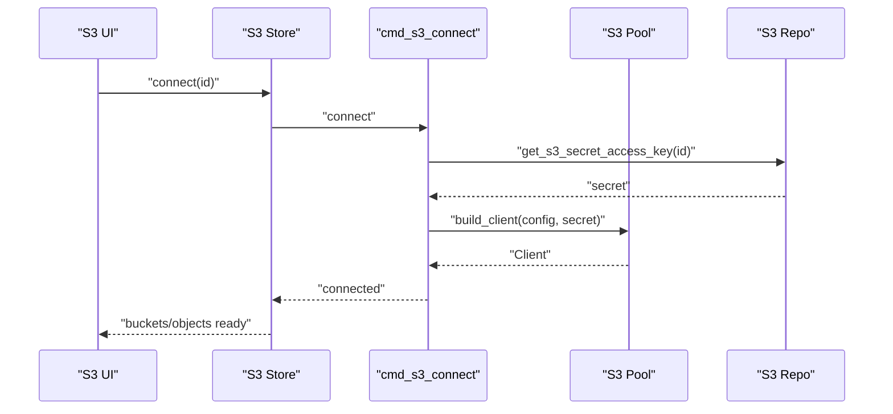
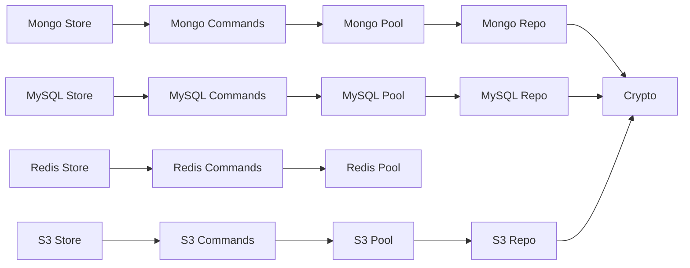

# Database Client Plugins

<cite>
**Referenced Files in This Document**
- [index.tsx](file://src/plugins/mongodb-client/index.tsx)
- [mongodb-connections.ts](file://src/plugins/mongodb-client/store/mongodb-connections.ts)
- [MongoConnectionForm.tsx](file://src/plugins/mongodb-client/components/MongoConnectionForm.tsx)
- [index.tsx](file://src/plugins/mysql-client/index.tsx)
- [mysql-connections.ts](file://src/plugins/mysql-client/store/mysql-connections.ts)
- [index.tsx](file://src/plugins/redis-manager/index.tsx)
- [connections.ts](file://src/plugins/redis-manager/store/connections.ts)
- [index.tsx](file://src/plugins/s3-client/index.tsx)
- [s3-connections.ts](file://src/plugins/s3-client/store/s3-connections.ts)
- [client_pool.rs (MongoDB)](file://src-tauri/src/plugins/mongodb/client_pool.rs)
- [client_pool.rs (MySQL)](file://src-tauri/src/plugins/mysql/client_pool.rs)
- [pool.rs (Redis)](file://src-tauri/src/plugins/redis/pool.rs)
- [client_pool.rs (S3)](file://src-tauri/src/plugins/s3/client_pool.rs)
- [mongodb_connection_repo.rs](file://src-tauri/src/db/mongodb_connection_repo.rs)
- [mysql_connection_repo.rs](file://src-tauri/src/db/mysql_connection_repo.rs)
- [s3_connection_repo.rs](file://src-tauri/src/db/s3_connection_repo.rs)
- [mod.rs (Crypto)](file://src-tauri/src/crypto/mod.rs)
</cite>

## Table of Contents
1. [Introduction](#introduction)
2. [Project Structure](#project-structure)
3. [Core Components](#core-components)
4. [Architecture Overview](#architecture-overview)
5. [Detailed Component Analysis](#detailed-component-analysis)
6. [Dependency Analysis](#dependency-analysis)
7. [Performance Considerations](#performance-considerations)
8. [Troubleshooting Guide](#troubleshooting-guide)
9. [Conclusion](#conclusion)

## Introduction
This document explains RDMM’s database client plugins that provide a unified, plugin-based interface for managing multiple database and storage systems: MongoDB, MySQL, Redis, and S3. The goal is to help both developers and operators understand how connections are managed, how query and browsing workspaces operate, and how authentication, connection pooling, and security are implemented consistently across plugins. Practical examples show how to connect, execute queries, manage schemas, and perform administrative tasks, along with performance tips and best practices tailored to each backend.

## Project Structure
Each database plugin follows a similar structure:
- A plugin manifest that registers the plugin and its UI shell
- A Zustand store orchestrating state, actions, and invocations to backend commands
- Views and components for connection management, browsing, and workspaces
- Backend pools and repositories for secure connection lifecycle and secrets

**Diagram sources**
- [index.tsx:14-86](file://src/plugins/mongodb-client/index.tsx#L14-L86)
- [index.tsx:14-37](file://src/plugins/mysql-client/index.tsx#L14-L37)
- [index.tsx:14-66](file://src/plugins/redis-manager/index.tsx#L14-L66)
- [index.tsx:10-75](file://src/plugins/s3-client/index.tsx#L10-L75)
- [mongodb-connections.ts:96-295](file://src/plugins/mongodb-client/store/mongodb-connections.ts#L96-L295)
- [mysql-connections.ts:77-152](file://src/plugins/mysql-client/store/mysql-connections.ts#L77-L152)
- [connections.ts:27-90](file://src/plugins/redis-manager/store/connections.ts#L27-L90)
- [s3-connections.ts:137-431](file://src/plugins/s3-client/store/s3-connections.ts#L137-L431)
- [client_pool.rs (MongoDB):9-131](file://src-tauri/src/plugins/mongodb/client_pool.rs#L9-L131)
- [client_pool.rs (MySQL):7-63](file://src-tauri/src/plugins/mysql/client_pool.rs#L7-L63)
- [pool.rs (Redis):10-75](file://src-tauri/src/plugins/redis/pool.rs#L10-L75)
- [client_pool.rs (S3):10-85](file://src-tauri/src/plugins/s3/client_pool.rs#L10-L85)
- [mongodb_connection_repo.rs:72-248](file://src-tauri/src/db/mongodb_connection_repo.rs#L72-L248)
- [mysql_connection_repo.rs:69-208](file://src-tauri/src/db/mysql_connection_repo.rs#L69-L208)
- [s3_connection_repo.rs:38-187](file://src-tauri/src/db/s3_connection_repo.rs#L38-L187)
- [mod.rs (Crypto):40-74](file://src-tauri/src/crypto/mod.rs#L40-L74)

**Section sources**
- [index.tsx:14-86](file://src/plugins/mongodb-client/index.tsx#L14-L86)
- [index.tsx:14-37](file://src/plugins/mysql-client/index.tsx#L14-L37)
- [index.tsx:14-66](file://src/plugins/redis-manager/index.tsx#L14-L66)
- [index.tsx:10-75](file://src/plugins/s3-client/index.tsx#L10-L75)

## Core Components
- Unified plugin manifest: Each plugin exports a manifest with metadata and a root component that renders a segmented workspace with tabs for connections, browsing, and admin views.
- Shared state via Zustand stores: Each store defines actions to list/save/delete connections, test connectivity, connect/disconnect, and perform domain-specific operations (e.g., list databases/collections, run SQL, browse S3 objects).
- Backend command invocation: Frontend actions call Tauri commands that delegate to backend pools and repositories.
- Security: Secrets are stored encrypted and decrypted only when needed by backend pools.

**Section sources**
- [index.tsx:79-86](file://src/plugins/mongodb-client/index.tsx#L79-L86)
- [index.tsx](file://src/plugins/mysql-client/index.tsx#L37)
- [index.tsx:59-66](file://src/plugins/redis-manager/index.tsx#L59-L66)
- [index.tsx:68-75](file://src/plugins/s3-client/index.tsx#L68-L75)
- [mongodb-connections.ts:96-295](file://src/plugins/mongodb-client/store/mongodb-connections.ts#L96-L295)
- [mysql-connections.ts:77-152](file://src/plugins/mysql-client/store/mysql-connections.ts#L77-L152)
- [connections.ts:27-90](file://src/plugins/redis-manager/store/connections.ts#L27-L90)
- [s3-connections.ts:137-431](file://src/plugins/s3-client/store/s3-connections.ts#L137-L431)

## Architecture Overview
The frontend plugins expose a consistent UI shell and dispatch actions to backend pools. The backend pools maintain long-lived clients/pools per connection ID and rely on repositories to persist and retrieve secrets securely.

**Diagram sources**
- [mongodb-connections.ts:147-161](file://src/plugins/mongodb-client/store/mongodb-connections.ts#L147-L161)
- [mysql-connections.ts:109-113](file://src/plugins/mysql-client/store/mysql-connections.ts#L109-L113)
- [connections.ts:59-68](file://src/plugins/redis-manager/store/connections.ts#L59-L68)
- [s3-connections.ts:178-184](file://src/plugins/s3-client/store/s3-connections.ts#L178-L184)
- [client_pool.rs (MongoDB):107-123](file://src-tauri/src/plugins/mongodb/client_pool.rs#L107-L123)
- [client_pool.rs (MySQL):32-48](file://src-tauri/src/plugins/mysql/client_pool.rs#L32-L48)
- [pool.rs (Redis):39-47](file://src-tauri/src/plugins/redis/pool.rs#L39-L47)
- [client_pool.rs (S3):61-76](file://src-tauri/src/plugins/s3/client_pool.rs#L61-L76)
- [mongodb_connection_repo.rs:217-248](file://src-tauri/src/db/mongodb_connection_repo.rs#L217-L248)
- [mysql_connection_repo.rs:185-208](file://src-tauri/src/db/mysql_connection_repo.rs#L185-L208)
- [s3_connection_repo.rs:170-187](file://src-tauri/src/db/s3_connection_repo.rs#L170-L187)

## Detailed Component Analysis

### MongoDB Client
- Workspace tabs: Connections, Databases, Documents, Query, Indexes, Import/Export, Server
- Key store actions:
  - Connect/disconnect, list databases/collections, select namespace
  - CRUD on documents, aggregation, indexes
  - Export/import documents, query history, server status
- Authentication modes: URI or form-based; supports SRV, TLS, auth database, replica set
- Security: Secrets persisted encrypted; decrypted only during pool creation

**Diagram sources**
- [index.tsx:14-77](file://src/plugins/mongodb-client/index.tsx#L14-L77)
- [mongodb-connections.ts:147-161](file://src/plugins/mongodb-client/store/mongodb-connections.ts#L147-L161)
- [MongoConnectionForm.tsx:107-138](file://src/plugins/mongodb-client/components/MongoConnectionForm.tsx#L107-L138)
- [client_pool.rs (MongoDB):14-105](file://src-tauri/src/plugins/mongodb/client_pool.rs#L14-L105)
- [mongodb_connection_repo.rs:217-248](file://src-tauri/src/db/mongodb_connection_repo.rs#L217-L248)

Practical examples
- Connecting: Use the connection form (URI or host/port) and click Test/Save, then Connect. The store invokes the backend connect command and switches to the Databases tab.
- Executing queries: Switch to the Query tab and run ad-hoc find/aggregation queries; results appear in the editor/workspace.
- Managing schema: Select a collection, go to Indexes to list/create/drop indexes; use Import/Export to bulk operations.
- Administrative tasks: Open Server to view server status and metrics.

Best practices
- Prefer URI mode for Atlas/SRV setups; otherwise use form mode with TLS enabled.
- Keep passwords and URIs encrypted; avoid storing plaintext secrets.
- Use indexes to optimize queries; monitor server metrics via the Server tab.

**Section sources**
- [index.tsx:14-86](file://src/plugins/mongodb-client/index.tsx#L14-L86)
- [mongodb-connections.ts:96-295](file://src/plugins/mongodb-client/store/mongodb-connections.ts#L96-L295)
- [MongoConnectionForm.tsx:107-138](file://src/plugins/mongodb-client/components/MongoConnectionForm.tsx#L107-L138)
- [client_pool.rs (MongoDB):14-105](file://src-tauri/src/plugins/mongodb/client_pool.rs#L14-L105)
- [mongodb_connection_repo.rs:115-202](file://src-tauri/src/db/mongodb_connection_repo.rs#L115-L202)

### MySQL Client
- Workspace tabs: Connections, Databases, Table Data, SQL, Indexes, Import/Export, Server
- Key store actions:
  - Connect/disconnect, list databases/tables, describe table and status
  - Paginated row loading, insert/update/delete rows
  - Execute SQL, manage indexes, import/export rows, server status
- Authentication: Username/password optional; defaults to configured charset and SSL mode
- Security: Passwords stored encrypted and decrypted only when building the pool

**Diagram sources**
- [index.tsx:14-35](file://src/plugins/mysql-client/index.tsx#L14-L35)
- [mysql-connections.ts:109-113](file://src/plugins/mysql-client/store/mysql-connections.ts#L109-L113)
- [client_pool.rs (MySQL):12-30](file://src-tauri/src/plugins/mysql/client_pool.rs#L12-L30)
- [mysql_connection_repo.rs:185-208](file://src-tauri/src/db/mysql_connection_repo.rs#L185-L208)

Practical examples
- Connecting: Save a connection with host/port/username; optionally set default database and charset; connect and switch to Databases.
- Executing SQL: Open SQL workspace, select a database, and run statements; results appear with column metadata.
- Managing schema: Select a table, go to Indexes to manage indexes; use Import/Export to bulk load or dump data.
- Administrative tasks: Open Server to view server status and global variables.

Best practices
- Set charset and SSL mode appropriate for your deployment.
- Use pagination when browsing large datasets; prefer prepared statements in production environments.
- Back up schema and data regularly using Import/Export.

**Section sources**
- [index.tsx:14-37](file://src/plugins/mysql-client/index.tsx#L14-L37)
- [mysql-connections.ts:77-152](file://src/plugins/mysql-client/store/mysql-connections.ts#L77-L152)
- [client_pool.rs (MySQL):12-30](file://src-tauri/src/plugins/mysql/client_pool.rs#L12-L30)
- [mysql_connection_repo.rs:108-176](file://src-tauri/src/db/mysql_connection_repo.rs#L108-L176)

### Redis Manager
- Workspace tabs: Connections, Keys, Console, Server
- Key features: Manage connections, browse keyspace, run console commands, view server info
- Security: Passwords embedded in connection URLs; tested via PING before storing client

**Diagram sources**
- [index.tsx:14-57](file://src/plugins/redis-manager/index.tsx#L14-L57)
- [connections.ts:59-68](file://src/plugins/redis-manager/store/connections.ts#L59-L68)
- [pool.rs (Redis):39-47](file://src-tauri/src/plugins/redis/pool.rs#L39-L47)

Practical examples
- Connecting: Save host/port/db index; optionally supply password; test and connect.
- Browsing keys: Switch to Keys tab, select a DB, and navigate the key tree.
- Console: Run Redis commands interactively; useful for administration and diagnostics.
- Server info: Inspect memory, clients, and configuration.

Best practices
- Limit DB index usage to logical separation; avoid exposing sensitive data unintentionally.
- Use ACLs and TLS in production; avoid plaintext passwords.

**Section sources**
- [index.tsx:14-66](file://src/plugins/redis-manager/index.tsx#L14-L66)
- [connections.ts:27-90](file://src/plugins/redis-manager/store/connections.ts#L27-L90)
- [pool.rs (Redis):15-47](file://src-tauri/src/plugins/redis/pool.rs#L15-L47)

### S3 Client
- Workspace tabs: Connections, Buckets, Objects
- Key store actions:
  - List/create/delete buckets
  - List objects with pagination and prefixes
  - Delete single/multiple/folder objects
  - Copy/rename/head object, manage tags
  - Upload/download files and folders
  - Generate presigned URLs
- Security: Access key and secret are stored encrypted; endpoint resolution supports providers (Aliyun, Tencent, Cloudflare R2)

**Diagram sources**
- [index.tsx:10-66](file://src/plugins/s3-client/index.tsx#L10-L66)
- [s3-connections.ts:178-184](file://src/plugins/s3-client/store/s3-connections.ts#L178-L184)
- [client_pool.rs (S3):34-58](file://src-tauri/src/plugins/s3/client_pool.rs#L34-L58)
- [s3_connection_repo.rs:170-187](file://src-tauri/src/db/s3_connection_repo.rs#L170-L187)

Practical examples
- Connecting: Save provider/region/access key; optionally set endpoint; connect and list buckets.
- Managing objects: Browse objects with prefix filtering; upload/download files and folders; tag objects; delete multiple items.
- Presigned URLs: Generate temporary access URLs for secure sharing.

Best practices
- Use least-privilege credentials; rotate secrets regularly.
- Enable server-side encryption and versioning where supported.
- Use path-style or virtual-hosted addressing depending on provider compatibility.

**Section sources**
- [index.tsx:10-75](file://src/plugins/s3-client/index.tsx#L10-L75)
- [s3-connections.ts:137-431](file://src/plugins/s3-client/store/s3-connections.ts#L137-L431)
- [client_pool.rs (S3):34-58](file://src-tauri/src/plugins/s3/client_pool.rs#L34-L58)
- [s3_connection_repo.rs:110-161](file://src-tauri/src/db/s3_connection_repo.rs#L110-L161)

## Dependency Analysis
- Frontend stores depend on Tauri invoke to call backend commands.
- Backend pools depend on repositories to retrieve decrypted secrets.
- Crypto module centralizes encryption/decryption for secrets.

**Diagram sources**
- [mongodb-connections.ts:123-146](file://src/plugins/mongodb-client/store/mongodb-connections.ts#L123-L146)
- [mysql-connections.ts:94-108](file://src/plugins/mysql-client/store/mysql-connections.ts#L94-L108)
- [connections.ts:33-55](file://src/plugins/redis-manager/store/connections.ts#L33-L55)
- [s3-connections.ts:151-174](file://src/plugins/s3-client/store/s3-connections.ts#L151-L174)
- [client_pool.rs (MongoDB):107-123](file://src-tauri/src/plugins/mongodb/client_pool.rs#L107-L123)
- [client_pool.rs (MySQL):32-48](file://src-tauri/src/plugins/mysql/client_pool.rs#L32-L48)
- [pool.rs (Redis):39-47](file://src-tauri/src/plugins/redis/pool.rs#L39-L47)
- [client_pool.rs (S3):61-76](file://src-tauri/src/plugins/s3/client_pool.rs#L61-L76)
- [mongodb_connection_repo.rs:217-248](file://src-tauri/src/db/mongodb_connection_repo.rs#L217-L248)
- [mysql_connection_repo.rs:185-208](file://src-tauri/src/db/mysql_connection_repo.rs#L185-L208)
- [s3_connection_repo.rs:170-187](file://src-tauri/src/db/s3_connection_repo.rs#L170-L187)
- [mod.rs (Crypto):40-74](file://src-tauri/src/crypto/mod.rs#L40-L74)

**Section sources**
- [mongodb-connections.ts:123-146](file://src/plugins/mongodb-client/store/mongodb-connections.ts#L123-L146)
- [mysql-connections.ts:94-108](file://src/plugins/mysql-client/store/mysql-connections.ts#L94-L108)
- [connections.ts:33-55](file://src/plugins/redis-manager/store/connections.ts#L33-L55)
- [s3-connections.ts:151-174](file://src/plugins/s3-client/store/s3-connections.ts#L151-L174)

## Performance Considerations
- Connection pooling
  - MongoDB: Pool holds a Client per connection ID; reuse existing clients to avoid reconnect overhead.
  - MySQL: Pool holds a mysql_async Pool; ensure proper pool sizing and timeouts.
  - Redis: Pool holds redis::Client instances; PING validates liveness before use.
  - S3: Pool holds aws_sdk_s3::Client; reuse clients across operations.
- Pagination and limits
  - MongoDB: Use skip/limit or cursor-based pagination for large result sets.
  - MySQL: Use LIMIT/OFFSET for paginated row loads; leverage indexes to reduce scan cost.
  - S3: Use continuation tokens and maxKeys to iterate object listings efficiently.
- Network and TLS
  - Enable TLS where supported to protect traffic; consider connection timeouts and retry policies.
- UI responsiveness
  - Debounce heavy operations (e.g., object listing) and batch updates to minimize re-renders.

[No sources needed since this section provides general guidance]

## Troubleshooting Guide
Common issues and remedies
- Cannot connect
  - Verify credentials and endpoints; test connection via the plugin’s connection form.
  - Check backend logs for pool initialization errors.
- Authentication failures
  - Ensure secrets are present and decrypted correctly; confirm username/password or URI format.
  - For MongoDB, verify auth database and replica set settings.
- Slow operations
  - Use indexes and pagination; avoid scanning entire collections/tables.
  - For S3, enable path-style addressing if required by provider.
- Security warnings
  - Confirm encryption keys exist and are readable; rotate keys if necessary.

**Section sources**
- [client_pool.rs (MongoDB):14-105](file://src-tauri/src/plugins/mongodb/client_pool.rs#L14-L105)
- [client_pool.rs (MySQL):12-30](file://src-tauri/src/plugins/mysql/client_pool.rs#L12-L30)
- [pool.rs (Redis):28-47](file://src-tauri/src/plugins/redis/pool.rs#L28-L47)
- [client_pool.rs (S3):34-58](file://src-tauri/src/plugins/s3/client_pool.rs#L34-L58)
- [mod.rs (Crypto):40-74](file://src-tauri/src/crypto/mod.rs#L40-L74)

## Conclusion
RDMM’s database client plugins deliver a consistent, extensible framework for managing MongoDB, MySQL, Redis, and S3. By unifying connection management, query workspaces, and browser interfaces behind a shared plugin architecture, teams can streamline operations across heterogeneous backends. Robust connection pooling, secure secret handling, and clear operational patterns make these plugins suitable for both development and production use.