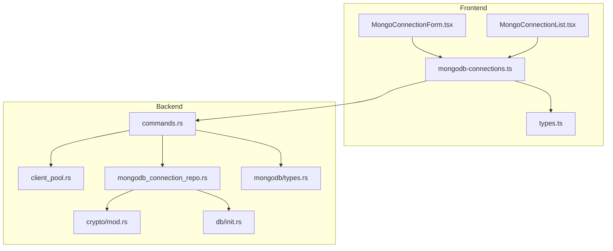
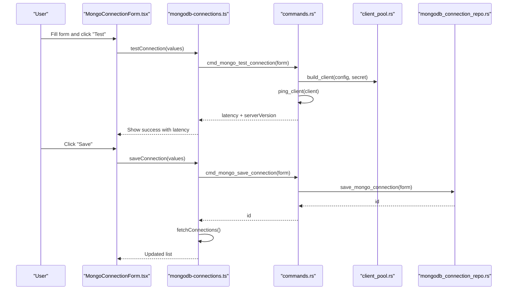
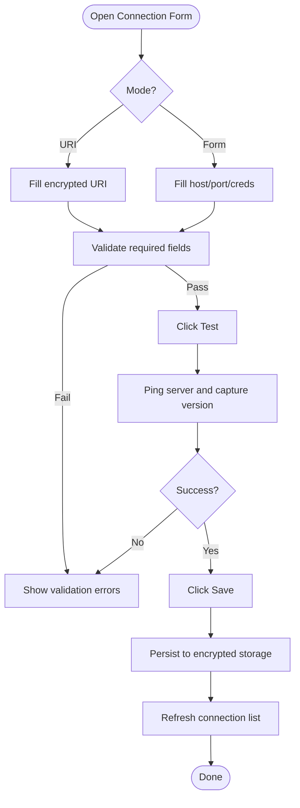
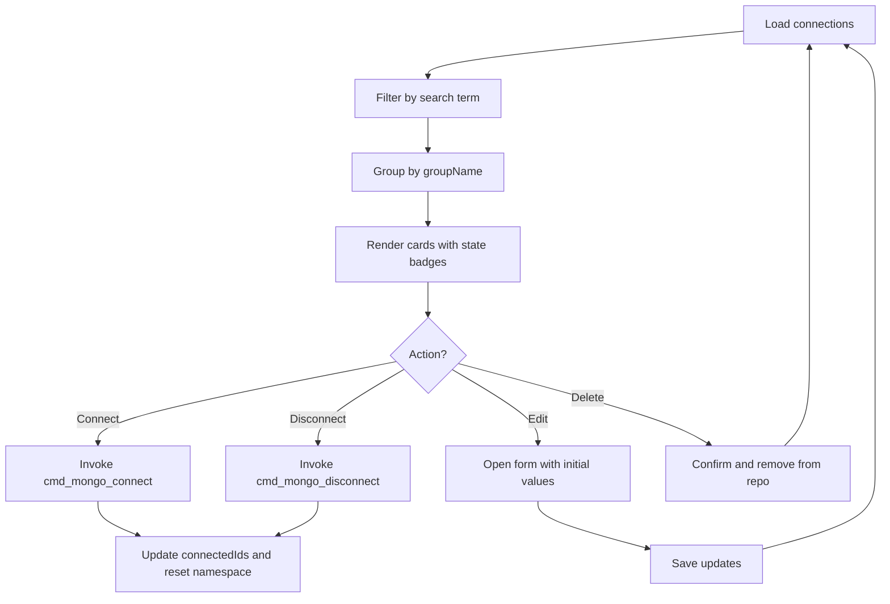
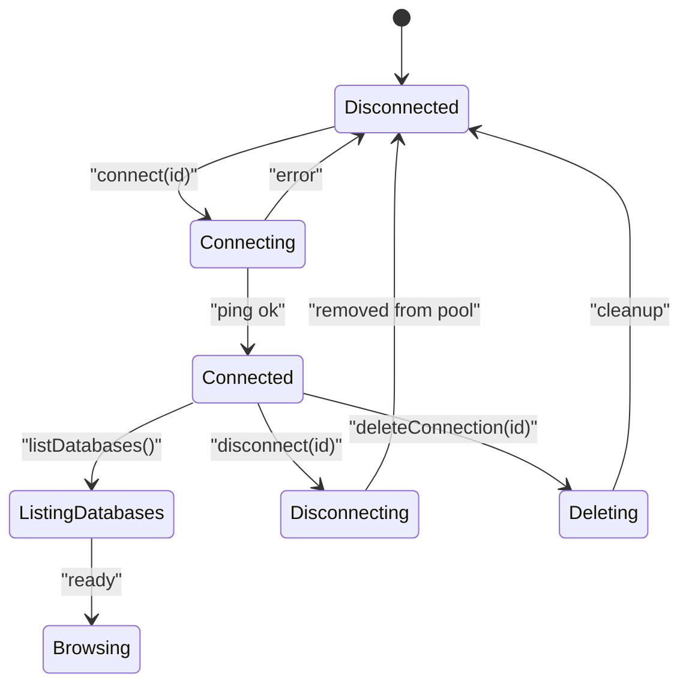
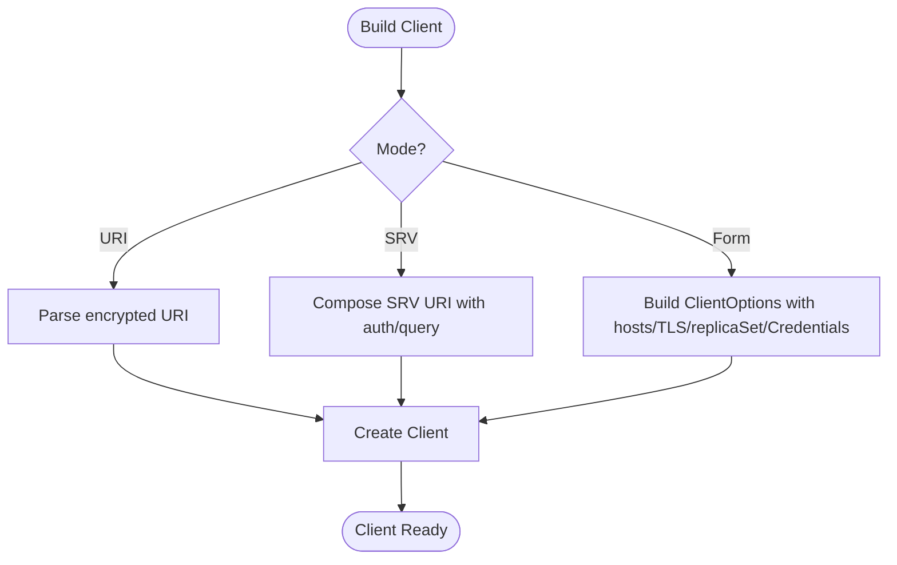
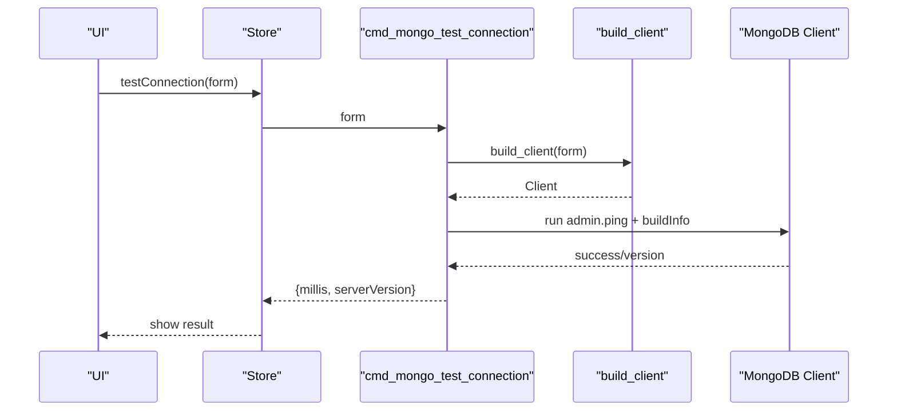
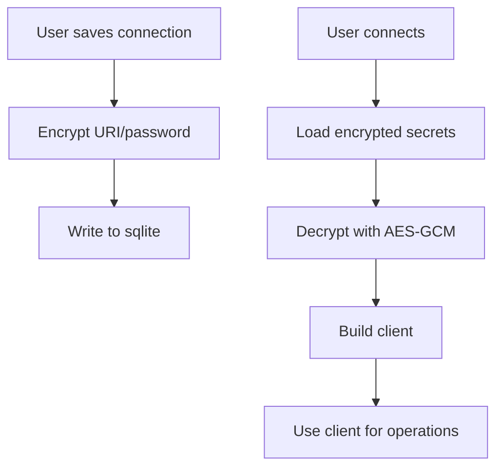
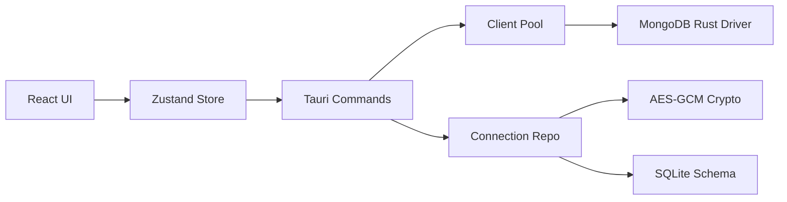
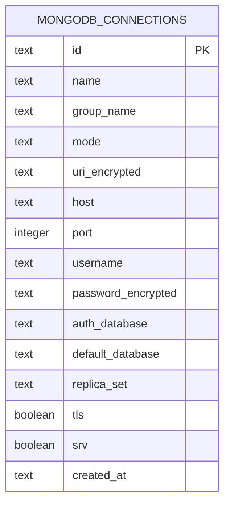

# Connection Management

<cite>
**Referenced Files in This Document**
- [MongoConnectionForm.tsx](file://src/plugins/mongodb-client/components/MongoConnectionForm.tsx)
- [MongoConnectionList.tsx](file://src/plugins/mongodb-client/views/MongoConnectionList.tsx)
- [mongodb-connections.ts](file://src/plugins/mongodb-client/store/mongodb-connections.ts)
- [types.ts](file://src/plugins/mongodb-client/types.ts)
- [commands.rs](file://src-tauri/src/plugins/mongodb/commands.rs)
- [client_pool.rs](file://src-tauri/src/plugins/mongodb/client_pool.rs)
- [mongodb_connection_repo.rs](file://src-tauri/src/db/mongodb_connection_repo.rs)
- [types.rs](file://src-tauri/src/plugins/mongodb/types.rs)
- [init.rs](file://src-tauri/src/db/init.rs)
- [mod.rs](file://src-tauri/src/plugins/mongodb/mod.rs)
- [mod.rs](file://src-tauri/src/crypto/mod.rs)
</cite>

## Table of Contents
1. [Introduction](#introduction)
2. [Project Structure](#project-structure)
3. [Core Components](#core-components)
4. [Architecture Overview](#architecture-overview)
5. [Detailed Component Analysis](#detailed-component-analysis)
6. [Dependency Analysis](#dependency-analysis)
7. [Performance Considerations](#performance-considerations)
8. [Troubleshooting Guide](#troubleshooting-guide)
9. [Conclusion](#conclusion)
10. [Appendices](#appendices)

## Introduction
This document explains how RDMM manages MongoDB connections across the frontend React UI and the Tauri backend. It covers the connection form interface, authentication and TLS options, connection list management, validation and testing, connection state and lifecycle, error handling, and security considerations including credential encryption. Practical examples demonstrate connecting to local instances, MongoDB Atlas (cloud), replica sets, and sharded clusters.

## Project Structure
RDMM’s MongoDB connection management spans three layers:
- Frontend UI and state: React components and a Zustand store orchestrate user interactions, connection CRUD, and navigation.
- Backend commands: Tauri commands translate UI actions into database operations and client lifecycle management.
- Persistence and crypto: SQLite-backed storage persists connection definitions and secrets, with AES-GCM encryption for sensitive data.

**Diagram sources**
- [MongoConnectionForm.tsx:1-169](file://src/plugins/mongodb-client/components/MongoConnectionForm.tsx#L1-L169)
- [MongoConnectionList.tsx:1-143](file://src/plugins/mongodb-client/views/MongoConnectionList.tsx#L1-L143)
- [mongodb-connections.ts:1-296](file://src/plugins/mongodb-client/store/mongodb-connections.ts#L1-L296)
- [types.ts:1-95](file://src/plugins/mongodb-client/types.ts#L1-L95)
- [commands.rs:1-788](file://src-tauri/src/plugins/mongodb/commands.rs#L1-L788)
- [client_pool.rs:1-132](file://src-tauri/src/plugins/mongodb/client_pool.rs#L1-L132)
- [mongodb_connection_repo.rs:1-249](file://src-tauri/src/db/mongodb_connection_repo.rs#L1-L249)
- [init.rs:117-133](file://src-tauri/src/db/init.rs#L117-L133)
- [mod.rs:1-75](file://src-tauri/src/crypto/mod.rs#L1-L75)
- [types.rs:1-80](file://src-tauri/src/plugins/mongodb/types.rs#L1-L80)

**Section sources**
- [MongoConnectionForm.tsx:1-169](file://src/plugins/mongodb-client/components/MongoConnectionForm.tsx#L1-L169)
- [MongoConnectionList.tsx:1-143](file://src/plugins/mongodb-client/views/MongoConnectionList.tsx#L1-L143)
- [mongodb-connections.ts:1-296](file://src/plugins/mongodb-client/store/mongodb-connections.ts#L1-L296)
- [types.ts:1-95](file://src/plugins/mongodb-client/types.ts#L1-L95)
- [commands.rs:1-788](file://src-tauri/src/plugins/mongodb/commands.rs#L1-L788)
- [client_pool.rs:1-132](file://src-tauri/src/plugins/mongodb/client_pool.rs#L1-L132)
- [mongodb_connection_repo.rs:1-249](file://src-tauri/src/db/mongodb_connection_repo.rs#L1-L249)
- [init.rs:117-133](file://src-tauri/src/db/init.rs#L117-L133)
- [mod.rs:1-75](file://src-tauri/src/crypto/mod.rs#L1-L75)
- [types.rs:1-80](file://src-tauri/src/plugins/mongodb/types.rs#L1-L80)

## Core Components
- Connection form: Supports two modes—URI and form-based—and collects host/port, credentials, auth database, default database, replica set, TLS, and SRV toggles. Includes “Test” to validate connectivity and “Save” to persist.
- Connection list: Displays saved connections, grouped by group name, with quick connect/disconnect, edit, and delete actions. Shows connection state and TLS/SRV badges.
- Store: Centralizes connection CRUD, connect/disconnect, and navigation state. Invokes Tauri commands via invoke.
- Commands: Implements backend operations for listing, saving, deleting, testing, connecting, disconnecting, and listing databases/collections.
- Client pool: Builds MongoDB clients from either a parsed URI or constructed options, and maintains an in-memory pool keyed by connection ID.
- Secrets and persistence: Stores encrypted URI and password per connection; decryption occurs only when building clients.
- Crypto: Provides AES-GCM encryption/decryption for secrets with a per-installation key.

**Section sources**
- [MongoConnectionForm.tsx:1-169](file://src/plugins/mongodb-client/components/MongoConnectionForm.tsx#L1-L169)
- [MongoConnectionList.tsx:1-143](file://src/plugins/mongodb-client/views/MongoConnectionList.tsx#L1-L143)
- [mongodb-connections.ts:1-296](file://src/plugins/mongodb-client/store/mongodb-connections.ts#L1-L296)
- [commands.rs:124-169](file://src-tauri/src/plugins/mongodb/commands.rs#L124-L169)
- [client_pool.rs:14-105](file://src-tauri/src/plugins/mongodb/client_pool.rs#L14-L105)
- [mongodb_connection_repo.rs:115-202](file://src-tauri/src/db/mongodb_connection_repo.rs#L115-L202)
- [mod.rs:40-74](file://src-tauri/src/crypto/mod.rs#L40-L74)

## Architecture Overview
The connection lifecycle flows from UI to backend and back to UI:

**Diagram sources**
- [MongoConnectionForm.tsx:54-63](file://src/plugins/mongodb-client/components/MongoConnectionForm.tsx#L54-L63)
- [mongodb-connections.ts:146-146](file://src/plugins/mongodb-client/store/mongodb-connections.ts#L146-L146)
- [commands.rs:145-154](file://src-tauri/src/plugins/mongodb/commands.rs#L145-L154)
- [client_pool.rs:14-105](file://src-tauri/src/plugins/mongodb/client_pool.rs#L14-L105)
- [mongodb_connection_repo.rs:115-202](file://src-tauri/src/db/mongodb_connection_repo.rs#L115-L202)

## Detailed Component Analysis

### Connection Form Interface
- Modes:
  - URI mode: Accepts a single encrypted URI field; optional to keep existing encrypted value when editing.
  - Form mode: Host, port, username, password; optional auth/default databases, replica set, TLS, SRV.
- Validation:
  - Required fields vary by mode; form enforces presence of URI for new URI-mode connections and host for form-mode connections.
- Advanced options:
  - Auth database, default database, replica set, TLS toggle, SRV toggle.
- Actions:
  - Test validates connectivity and reports latency and server version.
  - Save persists the connection and refreshes the list.

**Diagram sources**
- [MongoConnectionForm.tsx:84-167](file://src/plugins/mongodb-client/components/MongoConnectionForm.tsx#L84-L167)
- [commands.rs:145-154](file://src-tauri/src/plugins/mongodb/commands.rs#L145-L154)

**Section sources**
- [MongoConnectionForm.tsx:1-169](file://src/plugins/mongodb-client/components/MongoConnectionForm.tsx#L1-L169)
- [types.ts:3-18](file://src/plugins/mongodb-client/types.ts#L3-L18)

### Connection List View
- Displays connections grouped by group name, searchable by name/host.
- Shows connection state (Connected/Disconnected) and badges for TLS and SRV.
- Actions:
  - Double-click to connect.
  - Connect/Disconnect toggles connection state.
  - Edit opens the form pre-filled with saved values.
  - Delete confirms removal and ensures client is removed from pool.

**Diagram sources**
- [MongoConnectionList.tsx:9-142](file://src/plugins/mongodb-client/views/MongoConnectionList.tsx#L9-L142)
- [mongodb-connections.ts:147-168](file://src/plugins/mongodb-client/store/mongodb-connections.ts#L147-L168)
- [commands.rs:157-169](file://src-tauri/src/plugins/mongodb/commands.rs#L157-L169)

**Section sources**
- [MongoConnectionList.tsx:1-143](file://src/plugins/mongodb-client/views/MongoConnectionList.tsx#L1-L143)
- [mongodb-connections.ts:1-296](file://src/plugins/mongodb-client/store/mongodb-connections.ts#L1-L296)

### Connection State and Lifecycle
- Active connection ID and namespace (database/collection) are tracked in the store.
- Connecting:
  - Loads persisted config and secrets.
  - Builds a client and pings to validate.
  - Puts the client into the pool keyed by connection ID.
  - Updates UI state and lists databases.
- Disconnecting:
  - Removes the client from the pool.
  - Clears active namespace and resets UI state.
- Deleting:
  - Removes client from pool and deletes persisted record.

**Diagram sources**
- [mongodb-connections.ts:147-168](file://src/plugins/mongodb-client/store/mongodb-connections.ts#L147-L168)
- [commands.rs:157-169](file://src-tauri/src/plugins/mongodb/commands.rs#L157-L169)
- [client_pool.rs:107-131](file://src-tauri/src/plugins/mongodb/client_pool.rs#L107-L131)

**Section sources**
- [mongodb-connections.ts:147-168](file://src/plugins/mongodb-client/store/mongodb-connections.ts#L147-L168)
- [commands.rs:157-169](file://src-tauri/src/plugins/mongodb/commands.rs#L157-L169)
- [client_pool.rs:107-131](file://src-tauri/src/plugins/mongodb/client_pool.rs#L107-L131)

### Authentication and TLS Settings
- Supported inputs:
  - Username/password (form mode) or embedded in URI (URI mode).
  - Auth database selection.
  - TLS toggle enables TLS options.
  - SRV toggle builds a proper SRV URI with optional auth, authSource, replicaSet, and TLS parameters.
- Client construction:
  - URI mode parses the provided encrypted URI.
  - SRV mode composes a URI with encoded credentials and query parameters.
  - Form mode constructs ClientOptions with hosts, TLS, replica set, and Credential (username/password/source).
- TLS behavior:
  - When TLS is enabled, the client uses TLS options; SRV also appends tls=true in query string.

**Diagram sources**
- [client_pool.rs:14-105](file://src-tauri/src/plugins/mongodb/client_pool.rs#L14-L105)
- [types.rs:1-80](file://src-tauri/src/plugins/mongodb/types.rs#L1-L80)

**Section sources**
- [client_pool.rs:14-105](file://src-tauri/src/plugins/mongodb/client_pool.rs#L14-L105)
- [MongoConnectionForm.tsx:142-159](file://src/plugins/mongodb-client/components/MongoConnectionForm.tsx#L142-L159)

### Connection Validation and Testing
- The “Test” action:
  - Validates form fields.
  - Builds a temporary client from form inputs and secrets.
  - Pings the server and captures server version.
  - Returns latency and server version to the UI.

**Diagram sources**
- [MongoConnectionForm.tsx:54-63](file://src/plugins/mongodb-client/components/MongoConnectionForm.tsx#L54-L63)
- [commands.rs:145-154](file://src-tauri/src/plugins/mongodb/commands.rs#L145-L154)
- [client_pool.rs:87-105](file://src-tauri/src/plugins/mongodb/client_pool.rs#L87-L105)

**Section sources**
- [MongoConnectionForm.tsx:54-63](file://src/plugins/mongodb-client/components/MongoConnectionForm.tsx#L54-L63)
- [commands.rs:145-154](file://src-tauri/src/plugins/mongodb/commands.rs#L145-L154)

### Security and Credential Encryption
- Encrypted storage:
  - URI and password are stored encrypted in the SQLite database under dedicated columns.
- Decryption:
  - Secrets are decrypted only when constructing clients for testing/connecting.
- Key management:
  - AES-GCM key is stored per installation and loaded lazily; legacy key migration supported.

**Diagram sources**
- [mongodb_connection_repo.rs:115-202](file://src-tauri/src/db/mongodb_connection_repo.rs#L115-L202)
- [mod.rs:40-74](file://src-tauri/src/crypto/mod.rs#L40-L74)

**Section sources**
- [mongodb_connection_repo.rs:115-202](file://src-tauri/src/db/mongodb_connection_repo.rs#L115-L202)
- [mod.rs:1-75](file://src-tauri/src/crypto/mod.rs#L1-L75)

### Practical Connection Examples
- Local MongoDB instance:
  - Use form mode with host=localhost, port=27017, optional username/password, TLS disabled.
- MongoDB Atlas (cloud):
  - Use URI mode with a full MongoDB URI including cluster host, credentials, auth database, and TLS enabled.
- Replica set:
  - Use form mode and set replicaSet to the RS name; optionally enable TLS and SRV.
- Sharded cluster:
  - Use URI mode pointing to the mongos host or SRV record; ensure TLS is enabled and credentials are valid.

Note: These examples describe configuration fields and modes; actual URIs and credentials are handled securely and encrypted at rest.

**Section sources**
- [MongoConnectionForm.tsx:142-159](file://src/plugins/mongodb-client/components/MongoConnectionForm.tsx#L142-L159)
- [client_pool.rs:23-75](file://src-tauri/src/plugins/mongodb/client_pool.rs#L23-L75)

## Dependency Analysis
- Frontend depends on:
  - Zustand store for state and command invocation.
  - Ant Design components for UI.
- Backend depends on:
  - MongoDB Rust driver for client operations.
  - SQLite via rusqlite for persistent storage.
  - AES-GCM crypto module for secrets.
- Cross-cutting concerns:
  - Tauri commands bridge UI and backend.
  - Client pool centralizes client lifecycle.

**Diagram sources**
- [mongodb-connections.ts:1-296](file://src/plugins/mongodb-client/store/mongodb-connections.ts#L1-L296)
- [commands.rs:1-788](file://src-tauri/src/plugins/mongodb/commands.rs#L1-L788)
- [client_pool.rs:1-132](file://src-tauri/src/plugins/mongodb/client_pool.rs#L1-L132)
- [mongodb_connection_repo.rs:1-249](file://src-tauri/src/db/mongodb_connection_repo.rs#L1-L249)
- [init.rs:117-133](file://src-tauri/src/db/init.rs#L117-L133)
- [mod.rs:1-75](file://src-tauri/src/crypto/mod.rs#L1-L75)

**Section sources**
- [mongodb-connections.ts:1-296](file://src/plugins/mongodb-client/store/mongodb-connections.ts#L1-L296)
- [commands.rs:1-788](file://src-tauri/src/plugins/mongodb/commands.rs#L1-L788)
- [client_pool.rs:1-132](file://src-tauri/src/plugins/mongodb/client_pool.rs#L1-L132)
- [mongodb_connection_repo.rs:1-249](file://src-tauri/src/db/mongodb_connection_repo.rs#L1-L249)
- [init.rs:117-133](file://src-tauri/src/db/init.rs#L117-L133)
- [mod.rs:1-75](file://src-tauri/src/crypto/mod.rs#L1-L75)

## Performance Considerations
- Connection reuse:
  - Clients are pooled by connection ID to avoid repeated parsing and handshake overhead.
- Batch operations:
  - Export uses controlled batch sizes to manage memory and disk I/O.
- UI responsiveness:
  - Long-running operations (find, aggregate, import) are asynchronous; loading states are managed in the store.

[No sources needed since this section provides general guidance]

## Troubleshooting Guide
- Cannot connect:
  - Use “Test” to validate URI/form inputs and reachability; note latency and server version.
  - Verify TLS settings match server configuration.
  - Confirm SRV records and replica set names align with deployment.
- Credentials rejected:
  - Ensure auth database matches the user’s source database.
  - Re-enter passwords in the form; encrypted values are preserved when left blank during edits.
- Connection disappears after restart:
  - Connections are stored locally; ensure the app data directory exists and is writable.
- Export/import issues:
  - Confirm file formats and sizes; JSONL vs JSON differences are supported.

**Section sources**
- [MongoConnectionForm.tsx:54-63](file://src/plugins/mongodb-client/components/MongoConnectionForm.tsx#L54-L63)
- [commands.rs:637-672](file://src-tauri/src/plugins/mongodb/commands.rs#L637-L672)
- [mongodb_connection_repo.rs:115-202](file://src-tauri/src/db/mongodb_connection_repo.rs#L115-L202)

## Conclusion
RDMM provides a robust, secure, and user-friendly MongoDB connection management system. The UI supports flexible configuration modes, while the backend handles client lifecycle, encryption, and persistence. With built-in validation, TLS support, and SRV/replica set options, it accommodates local, cloud, and clustered deployments. Adhering to the best practices outlined here ensures reliable and secure connections.

[No sources needed since this section summarizes without analyzing specific files]

## Appendices

### Data Model: MongoDB Connections

**Diagram sources**
- [init.rs:117-133](file://src-tauri/src/db/init.rs#L117-L133)

### Backend Types Overview
- Latency and server info returned by ping.
- Database, collection, and index metadata.
- Query history and server status structures.

**Section sources**
- [types.rs:1-80](file://src-tauri/src/plugins/mongodb/types.rs#L1-L80)
- [types.ts:36-95](file://src/plugins/mongodb-client/types.ts#L36-L95)