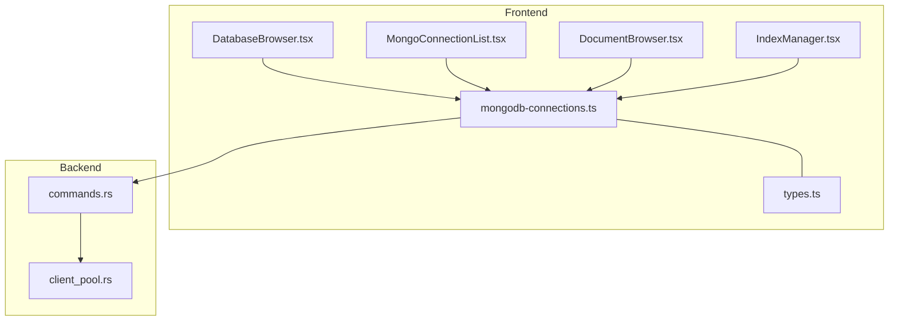
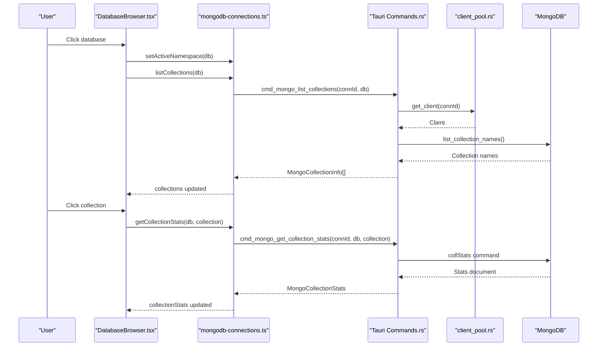
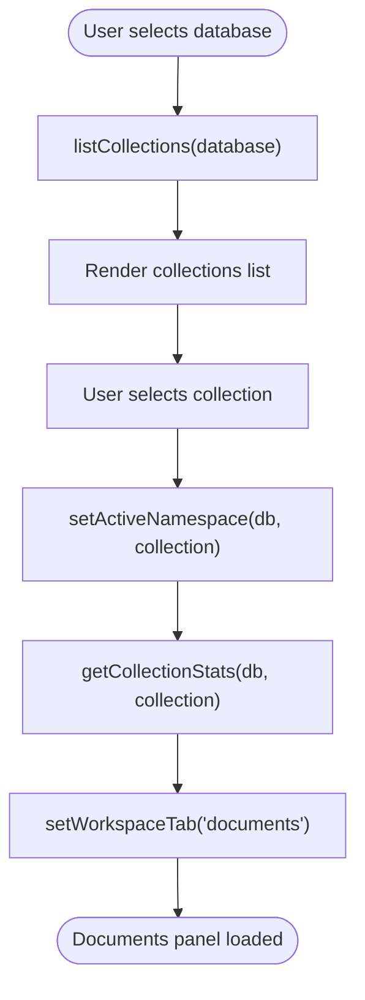
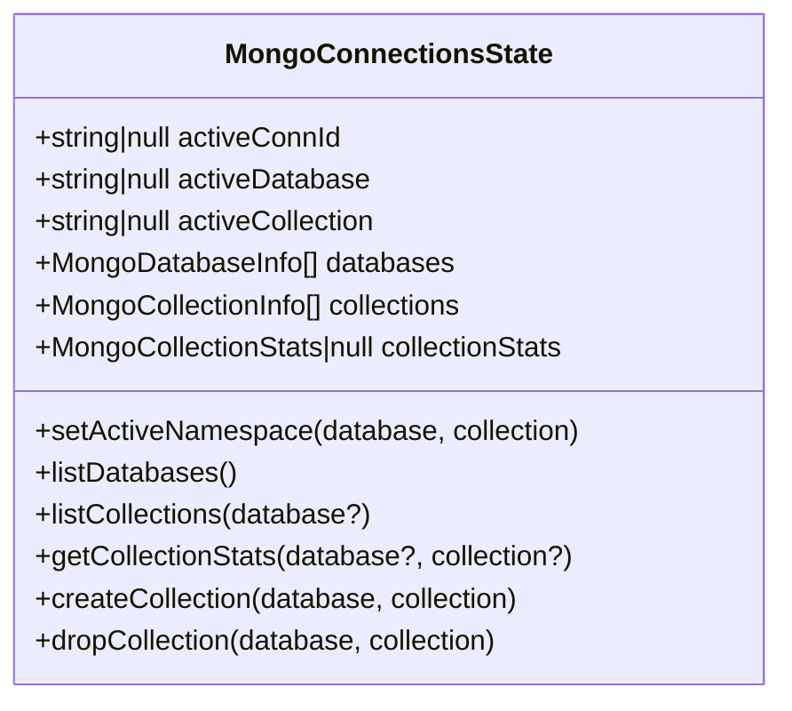
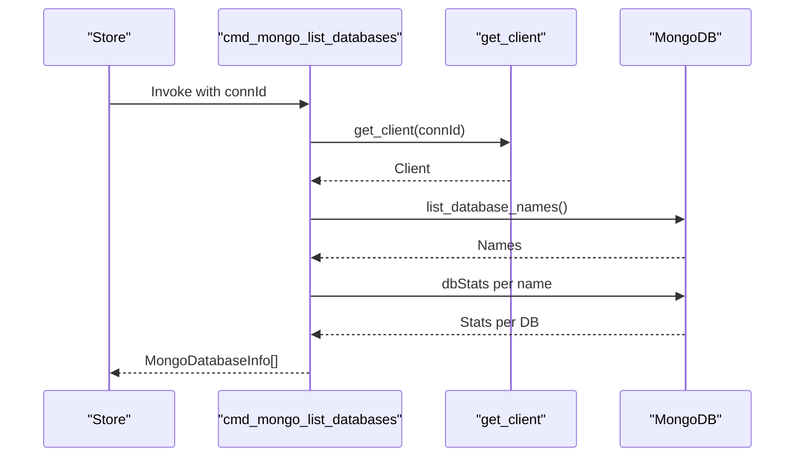
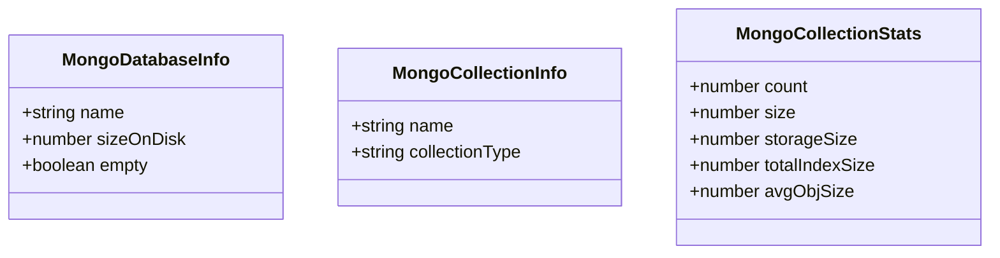
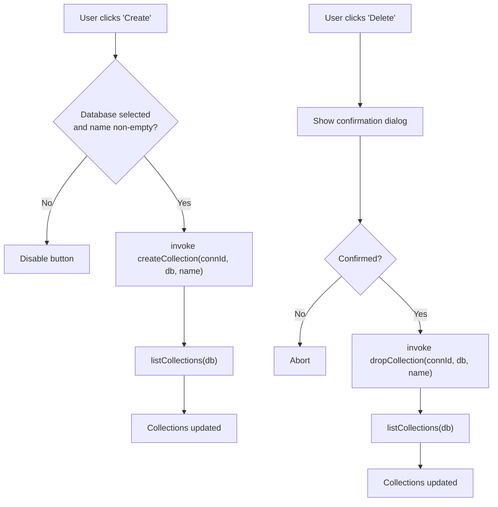
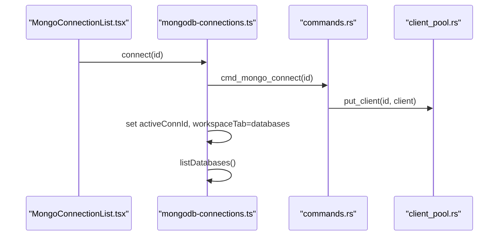
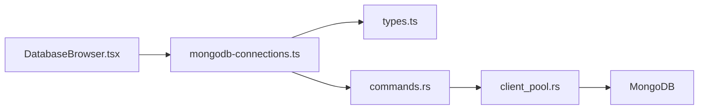

# Database Browser

<cite>
**Referenced Files in This Document**
- [DatabaseBrowser.tsx](file://src/plugins/mongodb-client/views/DatabaseBrowser.tsx)
- [mongodb-connections.ts](file://src/plugins/mongodb-client/store/mongodb-connections.ts)
- [types.ts](file://src/plugins/mongodb-client/types.ts)
- [commands.rs](file://src-tauri/src/plugins/mongodb/commands.rs)
- [client_pool.rs](file://src-tauri/src/plugins/mongodb/client_pool.rs)
- [MongoConnectionList.tsx](file://src/plugins/mongodb-client/views/MongoConnectionList.tsx)
- [DocumentBrowser.tsx](file://src/plugins/mongodb-client/views/DocumentBrowser.tsx)
- [IndexManager.tsx](file://src/plugins/mongodb-client/views/IndexManager.tsx)
</cite>

## Table of Contents
1. [Introduction](#introduction)
2. [Project Structure](#project-structure)
3. [Core Components](#core-components)
4. [Architecture Overview](#architecture-overview)
5. [Detailed Component Analysis](#detailed-component-analysis)
6. [Dependency Analysis](#dependency-analysis)
7. [Performance Considerations](#performance-considerations)
8. [Troubleshooting Guide](#troubleshooting-guide)
9. [Conclusion](#conclusion)

## Introduction
This document describes the MongoDB database browser interface within RDMM, focusing on how users explore and navigate databases and collections, filter and search collections, view collection metadata, and manage collections via context actions. It also explains integration with the active connection management, real-time refresh mechanisms, and performance strategies for large datasets. Practical examples demonstrate browsing collection structures, interpreting collection properties, and navigating complex schemas efficiently.

## Project Structure
The MongoDB database browser is implemented as a React view backed by a Zustand store that invokes Tauri commands. The backend Rust module handles MongoDB connectivity, command execution, and caching of active clients.

**Diagram sources**
- [DatabaseBrowser.tsx:1-137](file://src/plugins/mongodb-client/views/DatabaseBrowser.tsx#L1-L137)
- [mongodb-connections.ts:1-296](file://src/plugins/mongodb-client/store/mongodb-connections.ts#L1-L296)
- [types.ts:1-95](file://src/plugins/mongodb-client/types.ts#L1-L95)
- [commands.rs:1-788](file://src-tauri/src/plugins/mongodb/commands.rs#L1-L788)
- [client_pool.rs:1-132](file://src-tauri/src/plugins/mongodb/client_pool.rs#L1-L132)

**Section sources**
- [DatabaseBrowser.tsx:1-137](file://src/plugins/mongodb-client/views/DatabaseBrowser.tsx#L1-L137)
- [mongodb-connections.ts:1-296](file://src/plugins/mongodb-client/store/mongodb-connections.ts#L1-L296)
- [types.ts:1-95](file://src/plugins/mongodb-client/types.ts#L1-L95)
- [commands.rs:1-788](file://src-tauri/src/plugins/mongodb/commands.rs#L1-L788)
- [client_pool.rs:1-132](file://src-tauri/src/plugins/mongodb/client_pool.rs#L1-L132)

## Core Components
- DatabaseBrowser view: Presents a three-column layout with Databases, Collections, and Collection Stats panels. Supports creating new collections, dropping collections, and navigating to the Documents panel.
- MongoDB connections store: Centralized state for active connection, databases, collections, and collection stats. Exposes actions to list databases/collections, fetch stats, and manage collections.
- Backend commands: Implements Tauri commands for listing databases/collections, retrieving collection stats, creating/dropping collections, and other MongoDB operations.
- Active connection management: Maintains an active connection ID and client pool for efficient reuse.

Key responsibilities:
- Hierarchical navigation: Selecting a database populates collections; selecting a collection loads stats and navigates to the Documents panel.
- Metadata display: Shows collection counts, data size, storage size, and index size.
- Context actions: Create and drop collections with confirmation dialogs.
- Real-time refresh: Stats panel updates on selection; database lists refresh on demand.

**Section sources**
- [DatabaseBrowser.tsx:7-137](file://src/plugins/mongodb-client/views/DatabaseBrowser.tsx#L7-L137)
- [mongodb-connections.ts:27-122](file://src/plugins/mongodb-client/store/mongodb-connections.ts#L27-L122)
- [commands.rs:171-264](file://src-tauri/src/plugins/mongodb/commands.rs#L171-L264)

## Architecture Overview
The frontend view triggers store actions, which invoke Tauri commands. The backend resolves the active client from the pool and executes MongoDB operations, returning structured data to the frontend.

**Diagram sources**
- [DatabaseBrowser.tsx:44-112](file://src/plugins/mongodb-client/views/DatabaseBrowser.tsx#L44-L112)
- [mongodb-connections.ts:113-197](file://src/plugins/mongodb-client/store/mongodb-connections.ts#L113-L197)
- [commands.rs:194-233](file://src-tauri/src/plugins/mongodb/commands.rs#L194-L233)
- [client_pool.rs:107-115](file://src-tauri/src/plugins/mongodb/client_pool.rs#L107-L115)

## Detailed Component Analysis

### DatabaseBrowser View
The view renders:
- Databases panel: Lists databases with size-on-disk and empty status; clicking selects the database and loads its collections.
- Collections panel: Lists collections with type metadata; supports creating new collections and dropping existing ones; clicking navigates to the Documents panel and loads stats.
- Collection Stats panel: Displays document count, data size, storage size, and total index size for the selected collection.

User interactions:
- Database selection triggers listing collections for that database.
- Collection selection sets the active namespace, loads stats, and switches to the Documents tab.
- Create collection action validates inputs and calls the store action to create and refresh the collection list.
- Drop collection action confirms deletion and refreshes the collection list.

**Diagram sources**
- [DatabaseBrowser.tsx:44-112](file://src/plugins/mongodb-client/views/DatabaseBrowser.tsx#L44-L112)
- [mongodb-connections.ts:113-122](file://src/plugins/mongodb-client/store/mongodb-connections.ts#L113-L122)

**Section sources**
- [DatabaseBrowser.tsx:32-136](file://src/plugins/mongodb-client/views/DatabaseBrowser.tsx#L32-L136)
- [mongodb-connections.ts:113-197](file://src/plugins/mongodb-client/store/mongodb-connections.ts#L113-L197)

### MongoDB Connections Store
The store manages:
- Active connection ID and namespace (database and collection).
- Databases and collections arrays.
- Collection stats object.
- Actions to list databases/collections, fetch stats, create/drop collections, and navigate tabs.

Behavior highlights:
- setActiveNamespace clears dependent state when switching namespaces.
- listCollections requires an active database and throws if missing.
- getCollectionStats requires both database and collection.
- createCollection and dropCollection refresh the collection list after operation.

**Diagram sources**
- [mongodb-connections.ts:27-77](file://src/plugins/mongodb-client/store/mongodb-connections.ts#L27-L77)

**Section sources**
- [mongodb-connections.ts:96-197](file://src/plugins/mongodb-client/store/mongodb-connections.ts#L96-L197)

### Backend Commands and Client Pool
Backend responsibilities:
- cmd_mongo_list_databases: Iterates database names and runs dbStats to compute sizeOnDisk and empty flag.
- cmd_mongo_list_collections: Returns collection names with a fixed collectionType field.
- cmd_mongo_get_collection_stats: Executes collStats and maps numeric fields to the stats model.
- cmd_mongo_create_collection and cmd_mongo_drop_collection: Manage collections via MongoDB commands.
- Client lifecycle: build_client constructs clients from URI or form; get_client retrieves from a static pool keyed by connection ID.

**Diagram sources**
- [commands.rs:171-192](file://src-tauri/src/plugins/mongodb/commands.rs#L171-L192)
- [client_pool.rs:107-115](file://src-tauri/src/plugins/mongodb/client_pool.rs#L107-L115)

**Section sources**
- [commands.rs:171-233](file://src-tauri/src/plugins/mongodb/commands.rs#L171-L233)
- [client_pool.rs:14-105](file://src-tauri/src/plugins/mongodb/client_pool.rs#L14-L105)

### Data Models
The TypeScript types define the shape of data exchanged between frontend and backend.

**Diagram sources**
- [types.ts:41-58](file://src/plugins/mongodb-client/types.ts#L41-L58)

**Section sources**
- [types.ts:41-58](file://src/plugins/mongodb-client/types.ts#L41-L58)

### Context Menu Operations
- Create collection: Enabled when a database is selected and the input is non-empty; triggers a backend create command and refreshes the collection list.
- Drop collection: Requires confirmation; triggers a backend drop command and refreshes the collection list.
- Navigate to Documents: Selecting a collection sets the active namespace and switches to the Documents tab, enabling further exploration.

**Diagram sources**
- [DatabaseBrowser.tsx:69-102](file://src/plugins/mongodb-client/views/DatabaseBrowser.tsx#L69-L102)
- [mongodb-connections.ts:198-205](file://src/plugins/mongodb-client/store/mongodb-connections.ts#L198-L205)

**Section sources**
- [DatabaseBrowser.tsx:69-102](file://src/plugins/mongodb-client/views/DatabaseBrowser.tsx#L69-L102)
- [mongodb-connections.ts:198-205](file://src/plugins/mongodb-client/store/mongodb-connections.ts#L198-L205)

### Filtering and Search Capabilities
- DatabaseBrowser does not implement a dedicated filter/search bar for databases or collections. Users rely on the native OS window controls and list scrolling.
- MongoConnectionList provides a search bar to filter connections by name/group/host.
- DocumentBrowser supports filtering, projection, and sorting via JSON inputs, enabling targeted queries against collections.

Practical guidance:
- For large numbers of collections, prefer using the Documents panel with precise filters to reduce payload size.
- Use pagination controls to manage large result sets.

**Section sources**
- [MongoConnectionList.tsx:25-33](file://src/plugins/mongodb-client/views/MongoConnectionList.tsx#L25-L33)
- [DocumentBrowser.tsx:39-52](file://src/plugins/mongodb-client/views/DocumentBrowser.tsx#L39-L52)

### Metadata Display
The Collection Stats panel shows:
- Document count
- Data size (bytes)
- Storage size (bytes)
- Total index size (bytes)
- Average object size (when available)

These metrics are populated from the backend collStats command response and displayed using Ant Design Statistic components.

**Section sources**
- [DatabaseBrowser.tsx:117-132](file://src/plugins/mongodb-client/views/DatabaseBrowser.tsx#L117-L132)
- [commands.rs:214-233](file://src-tauri/src/plugins/mongodb/commands.rs#L214-L233)

### Integration with Active Connection Management
- The store maintains an activeConnId and resets state when connecting/disconnecting.
- Connecting transitions the workspace to the databases view and automatically lists databases.
- Disconnecting removes the client from the pool and clears active state.

**Diagram sources**
- [MongoConnectionList.tsx:76-83](file://src/plugins/mongodb-client/views/MongoConnectionList.tsx#L76-L83)
- [mongodb-connections.ts:147-161](file://src/plugins/mongodb-client/store/mongodb-connections.ts#L147-L161)
- [commands.rs:156-164](file://src-tauri/src/plugins/mongodb/commands.rs#L156-L164)
- [client_pool.rs:117-123](file://src-tauri/src/plugins/mongodb/client_pool.rs#L117-L123)

**Section sources**
- [mongodb-connections.ts:147-161](file://src/plugins/mongodb-client/store/mongodb-connections.ts#L147-L161)
- [client_pool.rs:107-123](file://src-tauri/src/plugins/mongodb/client_pool.rs#L107-L123)

### Real-Time Refresh Mechanisms
- Database list refresh: Manual refresh via the reload button; automatic refresh occurs when the active connection changes.
- Collection stats refresh: Automatically updated when a collection is selected.
- Server status: Periodic polling (every 5 seconds) in the Server Status view; not directly tied to the database browser but demonstrates the pattern.

Recommendation:
- For frequent updates, trigger refresh actions explicitly rather than relying on periodic polling in the database browser.

**Section sources**
- [DatabaseBrowser.tsx:36-38](file://src/plugins/mongodb-client/views/DatabaseBrowser.tsx#L36-L38)
- [DatabaseBrowser.tsx:104-109](file://src/plugins/mongodb-client/views/DatabaseBrowser.tsx#L104-L109)
- [ServerStatus.tsx:15-22](file://src/plugins/mongodb-client/views/ServerStatus.tsx#L15-L22)

### Practical Examples

#### Example 1: Browsing Collection Structures
- Steps:
  1. Connect to a MongoDB instance.
  2. Select a database from the Databases panel.
  3. Review the Collections panel for collection names and types.
  4. Select a collection to load its stats and navigate to the Documents panel.
- Outcome: Users can inspect document counts, sizes, and index usage for quick schema understanding.

#### Example 2: Understanding Collection Properties
- Use the Collection Stats panel to compare:
  - count vs storageSize to estimate fragmentation.
  - totalIndexSize to assess indexing overhead.
- Combine with the Index Manager to review and adjust indexes.

#### Example 3: Navigating Complex Schemas
- For schemas with many collections:
  - Use the Documents panel with targeted filters to explore subsets.
  - Export filtered results for offline analysis using the export capability.

**Section sources**
- [DatabaseBrowser.tsx:117-132](file://src/plugins/mongodb-client/views/DatabaseBrowser.tsx#L117-L132)
- [DocumentBrowser.tsx:19-52](file://src/plugins/mongodb-client/views/DocumentBrowser.tsx#L19-L52)
- [IndexManager.tsx:7-27](file://src/plugins/mongodb-client/views/IndexManager.tsx#L7-L27)

## Dependency Analysis
The frontend depends on the store for state and actions; the store depends on Tauri commands; the backend depends on the client pool and MongoDB.

**Diagram sources**
- [DatabaseBrowser.tsx:1-137](file://src/plugins/mongodb-client/views/DatabaseBrowser.tsx#L1-L137)
- [mongodb-connections.ts:1-296](file://src/plugins/mongodb-client/store/mongodb-connections.ts#L1-L296)
- [types.ts:1-95](file://src/plugins/mongodb-client/types.ts#L1-L95)
- [commands.rs:1-788](file://src-tauri/src/plugins/mongodb/commands.rs#L1-L788)
- [client_pool.rs:1-132](file://src-tauri/src/plugins/mongodb/client_pool.rs#L1-L132)

**Section sources**
- [mongodb-connections.ts:1-296](file://src/plugins/mongodb-client/store/mongodb-connections.ts#L1-L296)
- [commands.rs:1-788](file://src-tauri/src/plugins/mongodb/commands.rs#L1-L788)
- [client_pool.rs:1-132](file://src-tauri/src/plugins/mongodb/client_pool.rs#L1-L132)

## Performance Considerations
- Efficient data loading:
  - Use targeted filters in the Documents panel to limit result sets.
  - Adjust pagination to balance responsiveness and throughput.
- Backend limits:
  - Export operations cap batch sizes to avoid excessive memory usage.
- Frontend rendering:
  - Large lists are scrollable; consider virtualization for very large datasets.
- Connection pooling:
  - Clients are reused via the pool to minimize reconnect overhead.

[No sources needed since this section provides general guidance]

## Troubleshooting Guide
Common issues and resolutions:
- No active connection:
  - The view displays a message prompting to connect first. Establish a connection via the Connections panel.
- Select database before listing collections:
  - The store enforces requiring an active database for listing collections; select a database first.
- Select database and collection before fetching stats:
  - The store checks for both; ensure both are selected before viewing stats.
- Drop collection confirmation:
  - Confirm the action in the dialog; the operation is irreversible.

Operational tips:
- Use the reload buttons to refresh database and collection lists after external changes.
- Verify credentials and connection parameters in the connection form if connectivity fails.

**Section sources**
- [DatabaseBrowser.tsx:28-30](file://src/plugins/mongodb-client/views/DatabaseBrowser.tsx#L28-L30)
- [mongodb-connections.ts:174-197](file://src/plugins/mongodb-client/store/mongodb-connections.ts#L174-L197)
- [MongoConnectionList.tsx:94-102](file://src/plugins/mongodb-client/views/MongoConnectionList.tsx#L94-L102)

## Conclusion
The MongoDB database browser provides a streamlined interface for exploring databases and collections, viewing essential collection statistics, and performing common management tasks. Its integration with active connection management and the backend command layer ensures reliable and responsive interactions. By leveraging targeted queries, pagination, and the client pool, users can efficiently navigate complex schemas and large datasets.