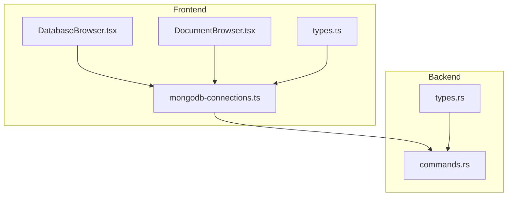
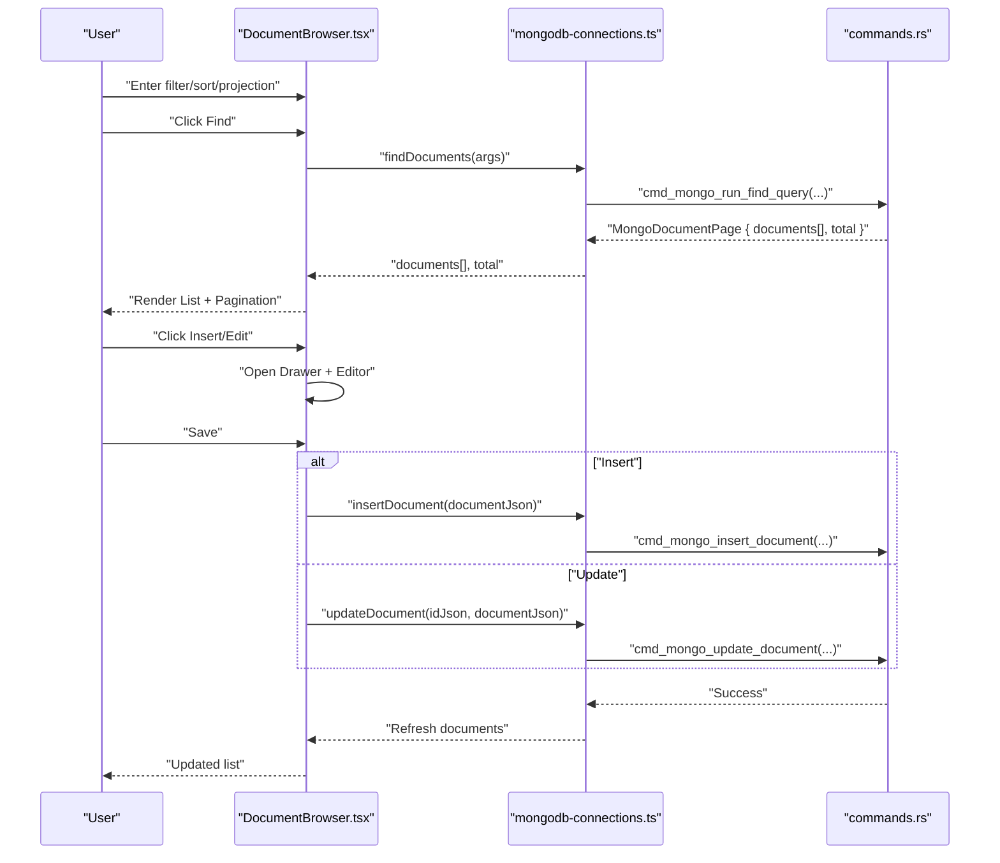
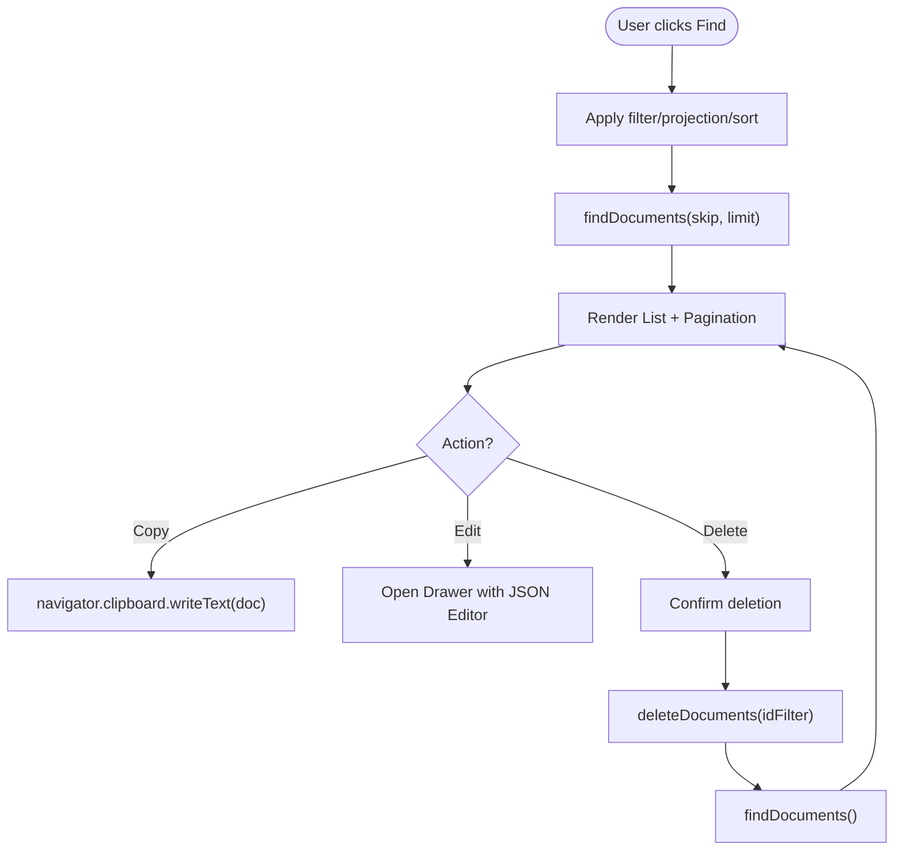
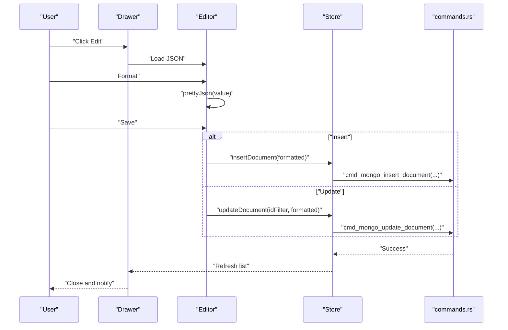
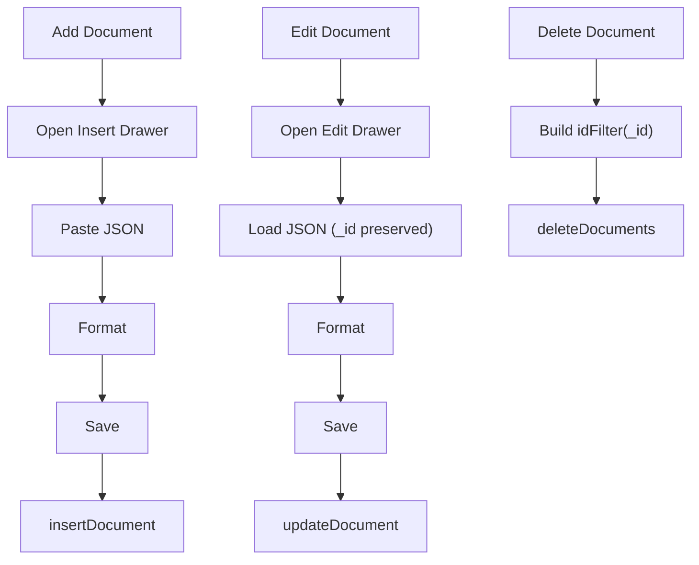
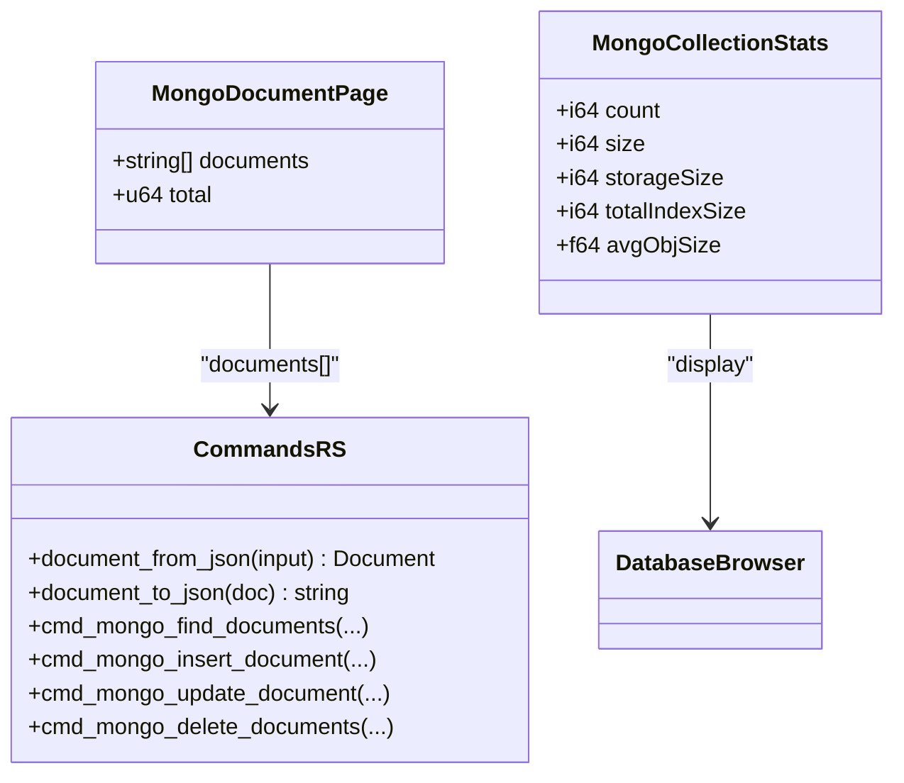
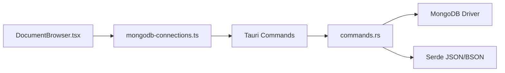

# Document Browser

<cite>
**Referenced Files in This Document**
- [DocumentBrowser.tsx](file://src/plugins/mongodb-client/views/DocumentBrowser.tsx)
- [mongodb-connections.ts](file://src/plugins/mongodb-client/store/mongodb-connections.ts)
- [types.ts](file://src/plugins/mongodb-client/types.ts)
- [commands.rs](file://src-tauri/src/plugins/mongodb/commands.rs)
- [types.rs](file://src-tauri/src/plugins/mongodb/types.rs)
- [DatabaseBrowser.tsx](file://src/plugins/mongodb-client/views/DatabaseBrowser.tsx)
</cite>

## Table of Contents
1. [Introduction](#introduction)
2. [Project Structure](#project-structure)
3. [Core Components](#core-components)
4. [Architecture Overview](#architecture-overview)
5. [Detailed Component Analysis](#detailed-component-analysis)
6. [Dependency Analysis](#dependency-analysis)
7. [Performance Considerations](#performance-considerations)
8. [Troubleshooting Guide](#troubleshooting-guide)
9. [Conclusion](#conclusion)

## Introduction
This document describes the MongoDB document browser, a feature-rich UI for viewing, editing, and managing individual documents within MongoDB collections. It covers:
- The document grid interface with pagination, sorting, filtering, and inline actions
- The JSON editor for creating and updating documents, including validation and formatting
- Document operations: insert, edit, delete, and bulk import/export
- Metadata display and integration with ObjectId/BSON handling
- Practical workflows, error handling, and performance considerations

## Project Structure
The document browser is implemented as a React component backed by a Zustand store and Tauri commands. The frontend handles UI interactions and state, while the backend performs MongoDB operations and serializes BSON to/from JSON.

**Diagram sources**
- [DocumentBrowser.tsx](file://src/plugins/mongodb-client/views/DocumentBrowser.tsx)
- [mongodb-connections.ts](file://src/plugins/mongodb-client/store/mongodb-connections.ts)
- [types.ts](file://src/plugins/mongodb-client/types.ts)
- [commands.rs](file://src-tauri/src/plugins/mongodb/commands.rs)
- [types.rs](file://src-tauri/src/plugins/mongodb/types.rs)
- [DatabaseBrowser.tsx](file://src/plugins/mongodb-client/views/DatabaseBrowser.tsx)

**Section sources**
- [DocumentBrowser.tsx:1-204](file://src/plugins/mongodb-client/views/DocumentBrowser.tsx#L1-L204)
- [mongodb-connections.ts:1-296](file://src/plugins/mongodb-client/store/mongodb-connections.ts#L1-L296)
- [types.ts:1-95](file://src/plugins/mongodb-client/types.ts#L1-L95)
- [commands.rs:1-788](file://src-tauri/src/plugins/mongodb/commands.rs#L1-L788)
- [types.rs:1-80](file://src-tauri/src/plugins/mongodb/types.rs#L1-L80)
- [DatabaseBrowser.tsx:1-137](file://src/plugins/mongodb-client/views/DatabaseBrowser.tsx#L1-L137)

## Core Components
- DocumentGrid: Displays collection documents as JSON strings in a paginated list with filter/projection/sort controls.
- JSONEditor: A drawer-based editor for inserting or editing documents with formatting and validation.
- Operations: Insert, update, delete, refresh, and pagination handlers wired to store actions.
- Store: Centralized state for active connection, database, collection, documents, and totals; exposes CRUD and query actions.
- Backend Commands: Convert JSON to BSON, run queries, updates, deletes, and manage imports/exports.

Key responsibilities:
- UI: Filter/sort/projection inputs, pagination controls, copy/edit/delete actions per document.
- Validation: Pretty-printing/formatting, ObjectId extraction for edits, and error messaging.
- Serialization: JSON-to-BSON conversion and BSON-to-JSON rendering for display.

**Section sources**
- [DocumentBrowser.tsx:19-204](file://src/plugins/mongodb-client/views/DocumentBrowser.tsx#L19-L204)
- [mongodb-connections.ts:56-77](file://src/plugins/mongodb-client/store/mongodb-connections.ts#L56-L77)
- [commands.rs:24-67](file://src-tauri/src/plugins/mongodb/commands.rs#L24-L67)

## Architecture Overview
The document browser follows a unidirectional data flow:
- User interacts with the DocumentBrowser UI
- Store actions dispatch to Tauri commands
- Backend executes MongoDB operations and returns JSON strings
- Frontend updates the document list and metadata

**Diagram sources**
- [DocumentBrowser.tsx:44-52](file://src/plugins/mongodb-client/views/DocumentBrowser.tsx#L44-L52)
- [mongodb-connections.ts:206-236](file://src/plugins/mongodb-client/store/mongodb-connections.ts#L206-L236)
- [commands.rs:438-477](file://src-tauri/src/plugins/mongodb/commands.rs#L438-L477)

## Detailed Component Analysis

### Document Grid Interface
- Controls:
  - Filter JSON textarea for query conditions
  - Projection JSON input for field selection
  - Sort JSON input for ordering
  - Find button to apply filters and reload
- Rendering:
  - List.Item displays each document as a pre-formatted JSON block
  - Actions per item: Copy, Edit, Delete
- Pagination:
  - Controlled by current page and page size
  - On change, re-runs find with skip/limit

**Diagram sources**
- [DocumentBrowser.tsx:86-104](file://src/plugins/mongodb-client/views/DocumentBrowser.tsx#L86-L104)
- [DocumentBrowser.tsx:105-163](file://src/plugins/mongodb-client/views/DocumentBrowser.tsx#L105-L163)
- [DocumentBrowser.tsx:135-146](file://src/plugins/mongodb-client/views/DocumentBrowser.tsx#L135-L146)

**Section sources**
- [DocumentBrowser.tsx:86-163](file://src/plugins/mongodb-client/views/DocumentBrowser.tsx#L86-L163)
- [mongodb-connections.ts:206-211](file://src/plugins/mongodb-client/store/mongodb-connections.ts#L206-L211)

### JSON Editor and Inline Editing
- Editor features:
  - Monospace textarea for JSON editing
  - Format button to pretty-print JSON
  - Save persists either insert or update
- ObjectId handling:
  - Extracts _id from the selected document for edit mode
  - Uses idFilterFromDocument to construct safe filter for updates/deletes
- Validation feedback:
  - Pretty printing validates JSON; errors surfaced via messages
  - Backend converts JSON to BSON; failures reported to the UI

**Diagram sources**
- [DocumentBrowser.tsx:165-200](file://src/plugins/mongodb-client/views/DocumentBrowser.tsx#L165-L200)
- [DocumentBrowser.tsx:175-188](file://src/plugins/mongodb-client/views/DocumentBrowser.tsx#L175-L188)
- [DocumentBrowser.tsx:13-17](file://src/plugins/mongodb-client/views/DocumentBrowser.tsx#L13-L17)
- [commands.rs:309-325](file://src-tauri/src/plugins/mongodb/commands.rs#L309-L325)
- [commands.rs:327-350](file://src-tauri/src/plugins/mongodb/commands.rs#L327-L350)

**Section sources**
- [DocumentBrowser.tsx:165-200](file://src/plugins/mongodb-client/views/DocumentBrowser.tsx#L165-L200)
- [DocumentBrowser.tsx:13-17](file://src/plugins/mongodb-client/views/DocumentBrowser.tsx#L13-L17)
- [commands.rs:24-38](file://src-tauri/src/plugins/mongodb/commands.rs#L24-L38)

### Document Operations
- Add new document:
  - Click Insert → open editor → paste JSON → Save → insertDocument
- Edit existing document:
  - Select Edit → pre-fill JSON → Format → Save → updateDocument
- Delete document:
  - Select Delete → confirm → deleteDocuments using idFilter derived from _id
- Bulk operations:
  - Export documents to JSON/JSONL
  - Preview and import JSON/JSONL files with modes: insertOnly, replaceById, upsertById

**Diagram sources**
- [DocumentBrowser.tsx:68-81](file://src/plugins/mongodb-client/views/DocumentBrowser.tsx#L68-L81)
- [DocumentBrowser.tsx:120-146](file://src/plugins/mongodb-client/views/DocumentBrowser.tsx#L120-L146)
- [mongodb-connections.ts:212-236](file://src/plugins/mongodb-client/store/mongodb-connections.ts#L212-L236)
- [commands.rs:309-325](file://src-tauri/src/plugins/mongodb/commands.rs#L309-L325)
- [commands.rs:327-350](file://src-tauri/src/plugins/mongodb/commands.rs#L327-L350)
- [commands.rs:352-371](file://src-tauri/src/plugins/mongodb/commands.rs#L352-L371)

**Section sources**
- [DocumentBrowser.tsx:68-81](file://src/plugins/mongodb-client/views/DocumentBrowser.tsx#L68-L81)
- [DocumentBrowser.tsx:120-146](file://src/plugins/mongodb-client/views/DocumentBrowser.tsx#L120-L146)
- [mongodb-connections.ts:212-236](file://src/plugins/mongodb-client/store/mongodb-connections.ts#L212-L236)
- [commands.rs:636-672](file://src-tauri/src/plugins/mongodb/commands.rs#L636-L672)
- [commands.rs:674-755](file://src-tauri/src/plugins/mongodb/commands.rs#L674-L755)

### Metadata Display and ObjectId/BSON Integration
- Metadata:
  - Collection stats card shows counts and sizes after selecting a collection
- ObjectId handling:
  - Editor extracts _id for update/delete operations
  - Backend replaces documents without _id in the replacement payload
- BSON/JSON serialization:
  - Frontend pretty-prints JSON for editing
  - Backend converts JSON to BSON for MongoDB operations and renders BSON back to JSON for display

**Diagram sources**
- [types.ts:60-63](file://src/plugins/mongodb-client/types.ts#L60-L63)
- [types.ts:52-58](file://src/plugins/mongodb-client/types.ts#L52-L58)
- [types.rs:35-40](file://src-tauri/src/plugins/mongodb/types.rs#L35-L40)
- [types.rs:25-33](file://src-tauri/src/plugins/mongodb/types.rs#L25-L33)
- [commands.rs:24-67](file://src-tauri/src/plugins/mongodb/commands.rs#L24-L67)
- [commands.rs:266-306](file://src-tauri/src/plugins/mongodb/commands.rs#L266-L306)
- [DatabaseBrowser.tsx:117-132](file://src/plugins/mongodb-client/views/DatabaseBrowser.tsx#L117-L132)

**Section sources**
- [DatabaseBrowser.tsx:117-132](file://src/plugins/mongodb-client/views/DatabaseBrowser.tsx#L117-L132)
- [DocumentBrowser.tsx:13-17](file://src/plugins/mongodb-client/views/DocumentBrowser.tsx#L13-L17)
- [commands.rs:24-38](file://src-tauri/src/plugins/mongodb/commands.rs#L24-L38)
- [commands.rs:327-350](file://src-tauri/src/plugins/mongodb/commands.rs#L327-L350)

## Dependency Analysis
- Frontend depends on:
  - Zustand store for state and action dispatch
  - Ant Design components for UI
  - Tauri invoke for backend commands
- Backend depends on:
  - MongoDB Rust driver for operations
  - Serde for JSON/BSON conversions
  - Local filesystem for import/export

**Diagram sources**
- [DocumentBrowser.tsx:19-30](file://src/plugins/mongodb-client/views/DocumentBrowser.tsx#L19-L30)
- [mongodb-connections.ts:56-77](file://src/plugins/mongodb-client/store/mongodb-connections.ts#L56-L77)
- [commands.rs:1-17](file://src-tauri/src/plugins/mongodb/commands.rs#L1-L17)

**Section sources**
- [mongodb-connections.ts:1-16](file://src/plugins/mongodb-client/store/mongodb-connections.ts#L1-L16)
- [commands.rs:1-17](file://src-tauri/src/plugins/mongodb/commands.rs#L1-L17)

## Performance Considerations
- Pagination defaults to 50 items; adjust page size for large collections to reduce render cost.
- Prefer targeted projections to minimize document size in lists.
- Use server-side sort and filter to avoid transferring unnecessary data.
- Large imports/exports are batched; consider splitting very large files for better UX.

## Troubleshooting Guide
Common issues and resolutions:
- Invalid JSON in editor:
  - Symptom: Save fails with JSON parse error
  - Resolution: Use Format to validate and fix indentation; ensure top-level object
  - Reference: [DocumentBrowser.tsx:175-188](file://src/plugins/mongodb-client/views/DocumentBrowser.tsx#L175-L188), [commands.rs:24-38](file://src-tauri/src/plugins/mongodb/commands.rs#L24-L38)
- Permission errors:
  - Symptom: Find/Insert/Update/Delete commands fail
  - Resolution: Verify credentials and permissions; test connection first
  - Reference: [commands.rs:145-154](file://src-tauri/src/plugins/mongodb/commands.rs#L145-L154)
- Empty delete filter:
  - Symptom: Delete operation rejected
  - Resolution: Ensure filter contains meaningful criteria; the backend rejects empty filters
  - Reference: [commands.rs:352-371](file://src-tauri/src/plugins/mongodb/commands.rs#L352-L371)
- ObjectId mismatch:
  - Symptom: Update fails to match document
  - Resolution: Ensure _id is present in the edited document; the editor derives idFilter from _id
  - Reference: [DocumentBrowser.tsx:13-17](file://src/plugins/mongodb-client/views/DocumentBrowser.tsx#L13-L17), [commands.rs:327-350](file://src-tauri/src/plugins/mongodb/commands.rs#L327-L350)
- Large document size:
  - Symptom: Slow rendering or timeouts
  - Resolution: Use filters and projections; avoid deep nesting; consider exporting/importing in chunks
  - Reference: [commands.rs:636-672](file://src-tauri/src/plugins/mongodb/commands.rs#L636-L672)

**Section sources**
- [DocumentBrowser.tsx:13-17](file://src/plugins/mongodb-client/views/DocumentBrowser.tsx#L13-L17)
- [DocumentBrowser.tsx:175-188](file://src/plugins/mongodb-client/views/DocumentBrowser.tsx#L175-L188)
- [commands.rs:24-38](file://src-tauri/src/plugins/mongodb/commands.rs#L24-L38)
- [commands.rs:352-371](file://src-tauri/src/plugins/mongodb/commands.rs#L352-L371)
- [commands.rs:636-672](file://src-tauri/src/plugins/mongodb/commands.rs#L636-L672)

## Conclusion
The MongoDB document browser provides a robust, JSON-centric interface for working with documents. It integrates tightly with MongoDB’s ObjectId and BSON handling, offers powerful filtering/sorting/projection, and supports safe inline editing with validation. Bulk operations and metadata insights round out a practical toolkit for day-to-day document management.