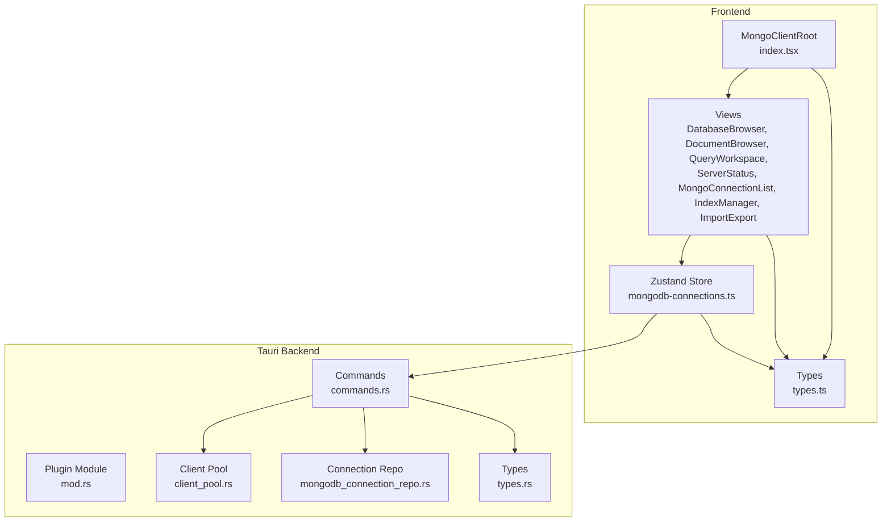
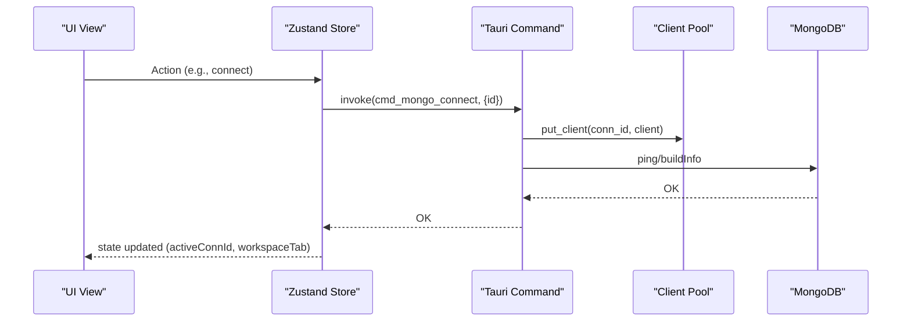
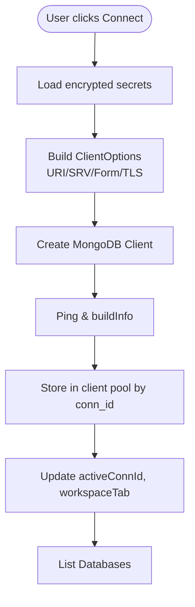
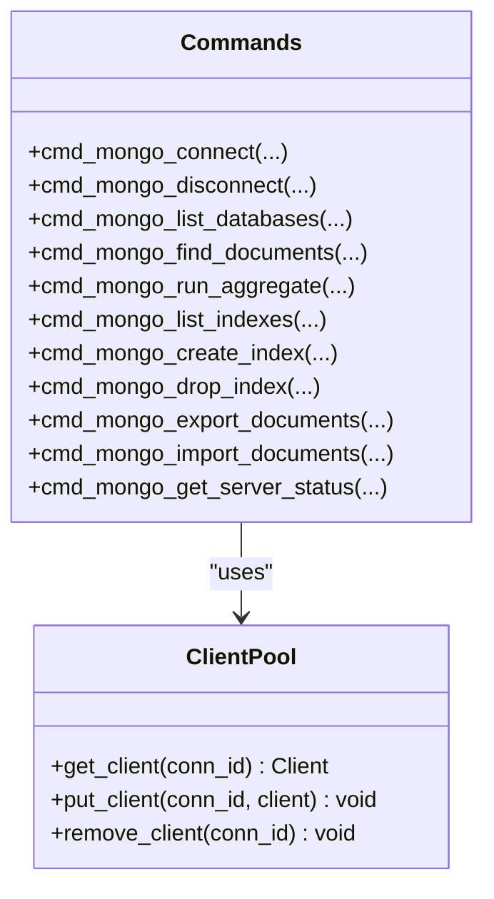
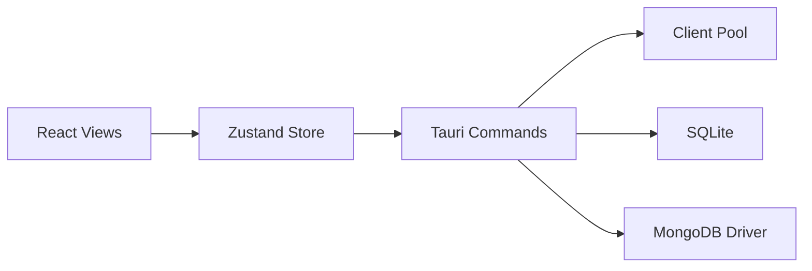

# MongoDB Client

<cite>
**Referenced Files in This Document**
- [index.tsx](file://src/plugins/mongodb-client/index.tsx)
- [types.ts](file://src/plugins/mongodb-client/types.ts)
- [mongodb-connections.ts](file://src/plugins/mongodb-client/store/mongodb-connections.ts)
- [MongoConnectionForm.tsx](file://src/plugins/mongodb-client/components/MongoConnectionForm.tsx)
- [DatabaseBrowser.tsx](file://src/plugins/mongodb-client/views/DatabaseBrowser.tsx)
- [DocumentBrowser.tsx](file://src/plugins/mongodb-client/views/DocumentBrowser.tsx)
- [QueryWorkspace.tsx](file://src/plugins/mongodb-client/views/QueryWorkspace.tsx)
- [ServerStatus.tsx](file://src/plugins/mongodb-client/views/ServerStatus.tsx)
- [MongoConnectionList.tsx](file://src/plugins/mongodb-client/views/MongoConnectionList.tsx)
- [IndexManager.tsx](file://src/plugins/mongodb-client/views/IndexManager.tsx)
- [ImportExport.tsx](file://src/plugins/mongodb-client/views/ImportExport.tsx)
- [mod.rs](file://src-tauri/src/plugins/mongodb/mod.rs)
- [client_pool.rs](file://src-tauri/src/plugins/mongodb/client_pool.rs)
- [commands.rs](file://src-tauri/src/plugins/mongodb/commands.rs)
- [mongodb_connection_repo.rs](file://src-tauri/src/db/mongodb_connection_repo.rs)
- [types.rs](file://src-tauri/src/plugins/mongodb/types.rs)
- [registry.ts](file://src/app/plugin-registry/registry.ts)
</cite>

## Table of Contents
1. [Introduction](#introduction)
2. [Project Structure](#project-structure)
3. [Core Components](#core-components)
4. [Architecture Overview](#architecture-overview)
5. [Detailed Component Analysis](#detailed-component-analysis)
6. [Dependency Analysis](#dependency-analysis)
7. [Performance Considerations](#performance-considerations)
8. [Troubleshooting Guide](#troubleshooting-guide)
9. [Conclusion](#conclusion)
10. [Appendices](#appendices)

## Introduction
This document describes the MongoDB client plugin for RDMM, focusing on connection management, authentication, connection pooling, and the user interface for browsing databases and collections, executing queries, importing/exporting data, and managing indexes. It also covers server status monitoring, integration with RDMM’s plugin architecture, and shared state management patterns.

## Project Structure
The MongoDB client plugin is organized into React views, a Zustand store, and Tauri backend commands. The frontend communicates with the backend via Tauri commands, which manage MongoDB connections and operations.

**Diagram sources**
- [index.tsx:14-86](file://src/plugins/mongodb-client/index.tsx#L14-L86)
- [mongodb-connections.ts:96-295](file://src/plugins/mongodb-client/store/mongodb-connections.ts#L96-L295)
- [mod.rs:1-4](file://src-tauri/src/plugins/mongodb/mod.rs#L1-L4)
- [client_pool.rs:9-132](file://src-tauri/src/plugins/mongodb/client_pool.rs#L9-L132)
- [commands.rs:124-787](file://src-tauri/src/plugins/mongodb/commands.rs#L124-L787)
- [mongodb_connection_repo.rs:72-249](file://src-tauri/src/db/mongodb_connection_repo.rs#L72-L249)
- [types.ts:1-95](file://src/plugins/mongodb-client/types.ts#L1-L95)
- [types.rs:1-80](file://src-tauri/src/plugins/mongodb/types.rs#L1-L80)

**Section sources**
- [index.tsx:1-87](file://src/plugins/mongodb-client/index.tsx#L1-L87)
- [registry.ts:1-26](file://src/app/plugin-registry/registry.ts#L1-L26)

## Core Components
- Plugin manifest and root container: Defines the plugin identity, icon, order, and the segmented workspace tabs that switch between connections, databases, documents, query, indexes, import/export, and server status.
- Shared state store: Centralized state for connections, active namespace, databases, collections, documents, indexes, history, and server status. Exposes actions to connect/disconnect, list namespaces, run queries, manage indexes, import/export, and load server status.
- UI views: Modular React components for each workspace tab, rendering lists, forms, and results.
- Backend commands: Tauri commands bridging UI actions to MongoDB operations, including connection lifecycle, CRUD, aggregation, indexing, import/export, and server status.

**Section sources**
- [index.tsx:79-86](file://src/plugins/mongodb-client/index.tsx#L79-L86)
- [mongodb-connections.ts:27-77](file://src/plugins/mongodb-client/store/mongodb-connections.ts#L27-L77)
- [registry.ts:5-21](file://src/app/plugin-registry/registry.ts#L5-L21)

## Architecture Overview
The plugin follows a layered architecture:
- Frontend (React + Zustand): Renders UI and manages state.
- Backend (Tauri): Executes MongoDB operations and maintains a process-wide client pool keyed by connection ID.
- Persistence: SQLite-backed connection storage and query history.

**Diagram sources**
- [mongodb-connections.ts:147-161](file://src/plugins/mongodb-client/store/mongodb-connections.ts#L147-L161)
- [commands.rs:157-169](file://src-tauri/src/plugins/mongodb/commands.rs#L157-L169)
- [client_pool.rs:107-123](file://src-tauri/src/plugins/mongodb/client_pool.rs#L107-L123)

## Detailed Component Analysis

### Connection Management System
- Connection creation and persistence: Supports URI and form modes, storing encrypted secrets and metadata in SQLite.
- Connection lifecycle: Test, connect, disconnect, and delete. Connect triggers a ping and stores the client in the pool.
- Active connection tracking: Workspace updates to “databases” after successful connect, clearing dependent state.

**Diagram sources**
- [MongoConnectionForm.tsx:13-63](file://src/plugins/mongodb-client/components/MongoConnectionForm.tsx#L13-L63)
- [mongodb-connections.ts:132-161](file://src/plugins/mongodb-client/store/mongodb-connections.ts#L132-L161)
- [commands.rs:132-169](file://src-tauri/src/plugins/mongodb/commands.rs#L132-L169)
- [client_pool.rs:14-105](file://src-tauri/src/plugins/mongodb/client_pool.rs#L14-L105)

**Section sources**
- [MongoConnectionForm.tsx:13-63](file://src/plugins/mongodb-client/components/MongoConnectionForm.tsx#L13-L63)
- [mongodb-connections.ts:132-161](file://src/plugins/mongodb-client/store/mongodb-connections.ts#L132-L161)
- [commands.rs:132-169](file://src-tauri/src/plugins/mongodb/commands.rs#L132-L169)
- [mongodb_connection_repo.rs:115-202](file://src-tauri/src/db/mongodb_connection_repo.rs#L115-L202)

### Authentication Mechanisms
- URI mode: Uses provided URI; secrets are stored encrypted.
- Form mode: Builds ClientOptions with optional credentials, auth source, replica set, TLS, and SRV.
- Secret handling: Secrets are persisted encrypted and decrypted on demand for connection building.

**Section sources**
- [client_pool.rs:23-102](file://src-tauri/src/plugins/mongodb/client_pool.rs#L23-L102)
- [mongodb_connection_repo.rs:217-249](file://src-tauri/src/db/mongodb_connection_repo.rs#L217-L249)

### Connection Pooling Strategies
- Process-wide singleton pool keyed by connection ID.
- Thread-safe HashMap guarded by a mutex.
- Operations retrieve the client by connection ID from the pool.

**Diagram sources**
- [client_pool.rs:9-132](file://src-tauri/src/plugins/mongodb/client_pool.rs#L9-L132)
- [commands.rs:157-781](file://src-tauri/src/plugins/mongodb/commands.rs#L157-L781)

**Section sources**
- [client_pool.rs:9-132](file://src-tauri/src/plugins/mongodb/client_pool.rs#L9-L132)

### Database Browser
- Lists databases and their stats; selects a database to list collections.
- Displays collection stats and navigates to the Documents tab.

**Section sources**
- [DatabaseBrowser.tsx:7-137](file://src/plugins/mongodb-client/views/DatabaseBrowser.tsx#L7-L137)
- [commands.rs:172-233](file://src-tauri/src/plugins/mongodb/commands.rs#L172-L233)

### Document Browser
- Executes find queries with filter/projection/sort, pagination, and displays results.
- Provides inline edit, insert, and delete actions with confirmation dialogs.
- Uses JSON editor drawer with formatting and Extended JSON support.

**Section sources**
- [DocumentBrowser.tsx:19-204](file://src/plugins/mongodb-client/views/DocumentBrowser.tsx#L19-L204)
- [commands.rs:267-371](file://src-tauri/src/plugins/mongodb/commands.rs#L267-L371)

### Query Workspace
- Runs aggregation pipelines and database commands.
- Includes a safety check for potentially destructive commands and a history panel.

**Section sources**
- [QueryWorkspace.tsx:9-134](file://src/plugins/mongodb-client/views/QueryWorkspace.tsx#L9-L134)
- [commands.rs:479-545](file://src-tauri/src/plugins/mongodb/commands.rs#L479-L545)

### Index Manager
- Lists indexes with keys and options, supports creating and dropping indexes.

**Section sources**
- [IndexManager.tsx:7-109](file://src/plugins/mongodb-client/views/IndexManager.tsx#L7-L109)
- [commands.rs:548-634](file://src-tauri/src/plugins/mongodb/commands.rs#L548-L634)

### Import/Export
- Exports documents to JSON or JSON Lines with filtering.
- Imports JSON/JSON Lines with modes: insertOnly, upsertById, replaceById.
- Provides preview and error reporting.

**Section sources**
- [ImportExport.tsx:6-100](file://src/plugins/mongodb-client/views/ImportExport.tsx#L6-L100)
- [commands.rs:637-755](file://src-tauri/src/plugins/mongodb/commands.rs#L637-L755)

### Server Status Monitoring
- Periodically loads serverStatus, buildInfo, and renders version, connections, memory, and opcounters.

**Section sources**
- [ServerStatus.tsx:10-86](file://src/plugins/mongodb-client/views/ServerStatus.tsx#L10-L86)
- [commands.rs:758-781](file://src-tauri/src/plugins/mongodb/commands.rs#L758-L781)

### Connection List and Forms
- Lists saved connections, supports search, grouping, connect/disconnect, edit, and delete.
- Modal form supports URI and form modes with advanced TLS/SRV options.

**Section sources**
- [MongoConnectionList.tsx:9-143](file://src/plugins/mongodb-client/views/MongoConnectionList.tsx#L9-L143)
- [MongoConnectionForm.tsx:13-169](file://src/plugins/mongodb-client/components/MongoConnectionForm.tsx#L13-L169)

## Dependency Analysis
- Frontend depends on:
  - Zustand store for state and actions.
  - Ant Design components for UI.
  - Tauri invoke for backend commands.
- Backend depends on:
  - MongoDB Rust driver for operations.
  - SQLite via rusqlite for connection and history persistence.
  - A process-wide client pool for connection reuse.

**Diagram sources**
- [mongodb-connections.ts:96-295](file://src/plugins/mongodb-client/store/mongodb-connections.ts#L96-L295)
- [commands.rs:124-787](file://src-tauri/src/plugins/mongodb/commands.rs#L124-L787)
- [client_pool.rs:9-132](file://src-tauri/src/plugins/mongodb/client_pool.rs#L9-L132)
- [mongodb_connection_repo.rs:72-249](file://src-tauri/src/db/mongodb_connection_repo.rs#L72-L249)

**Section sources**
- [commands.rs:124-787](file://src-tauri/src/plugins/mongodb/commands.rs#L124-L787)
- [mongodb_connection_repo.rs:72-249](file://src-tauri/src/db/mongodb_connection_repo.rs#L72-L249)

## Performance Considerations
- Connection reuse: The client pool avoids reconnect overhead per operation.
- Pagination: Document browsing uses skip/limit to prevent large result sets.
- Export limits: Controlled batch sizes during export to avoid memory pressure.
- Aggregation streaming: Results are streamed from the cursor to reduce memory footprint.
- UI responsiveness: Long-running operations should be offloaded to background threads; the current implementation relies on Tauri async commands.

[No sources needed since this section provides general guidance]

## Troubleshooting Guide
- Connection failures:
  - Verify URI/form correctness and credentials.
  - Check TLS/SRV flags and auth database.
  - Use the test connection action to measure latency and detect server version.
- Authentication errors:
  - Ensure username/password and auth database are set when using form mode.
  - Confirm the user exists and has appropriate roles.
- Empty results:
  - Validate filter/projection/sort JSON syntax.
  - Check collection existence and permissions.
- Dangerous commands:
  - The query workspace warns before executing potentially destructive commands.
- Import/Export issues:
  - Ensure JSON/JSON Lines validity.
  - Confirm file paths and modes.

**Section sources**
- [MongoConnectionForm.tsx:54-63](file://src/plugins/mongodb-client/components/MongoConnectionForm.tsx#L54-L63)
- [QueryWorkspace.tsx:31-65](file://src/plugins/mongodb-client/views/QueryWorkspace.tsx#L31-L65)
- [commands.rs:24-63](file://src-tauri/src/plugins/mongodb/commands.rs#L24-L63)

## Conclusion
The MongoDB client plugin integrates tightly with RDMM’s plugin architecture, providing a comprehensive NoSQL management experience. It leverages a persistent client pool, robust authentication, and a modular UI to support everyday database administration tasks, from connection management to schema operations and monitoring.

[No sources needed since this section summarizes without analyzing specific files]

## Appendices

### Practical Examples

- Connecting to MongoDB:
  - Use the connection list to add/edit a connection in URI or form mode.
  - Click connect; the workspace switches to the databases tab upon success.

- Executing CRUD operations:
  - Navigate to the Documents tab, apply filters/projections/sorts, and use inline actions to insert/update/delete.

- Querying with aggregation pipelines:
  - Open the Query tab, select “Aggregate,” paste a pipeline, and run to see results.

- Managing indexes:
  - Go to the Indexes tab, list existing indexes, and create/drop indexes with keys and options.

- Server status monitoring:
  - Switch to the Server tab to view live metrics refreshed periodically.

- Import/Export:
  - Use Import/Export to move data in JSON or JSON Lines formats with preview and error reporting.

**Section sources**
- [MongoConnectionList.tsx:6-23](file://src/plugins/mongodb-client/views/MongoConnectionList.tsx#L6-L23)
- [DocumentBrowser.tsx:44-57](file://src/plugins/mongodb-client/views/DocumentBrowser.tsx#L44-L57)
- [QueryWorkspace.tsx:23-52](file://src/plugins/mongodb-client/views/QueryWorkspace.tsx#L23-L52)
- [IndexManager.tsx:20-22](file://src/plugins/mongodb-client/views/IndexManager.tsx#L20-L22)
- [ServerStatus.tsx:15-22](file://src/plugins/mongodb-client/views/ServerStatus.tsx#L15-L22)
- [ImportExport.tsx:41-87](file://src/plugins/mongodb-client/views/ImportExport.tsx#L41-L87)

### Best Practices
- Prefer URI mode for complex configurations; otherwise, use form mode with TLS enabled.
- Use indexes to optimize queries; monitor index usage via server status.
- Back up data before destructive operations; leverage server status and history.
- Keep connection secrets encrypted; avoid exposing sensitive URIs.

[No sources needed since this section provides general guidance]