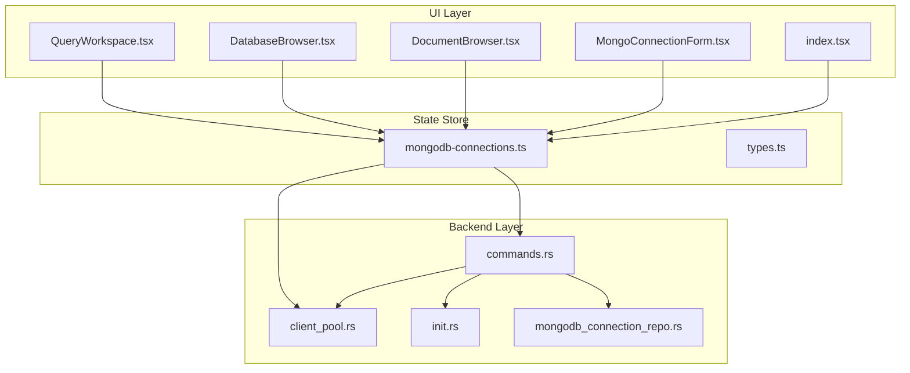
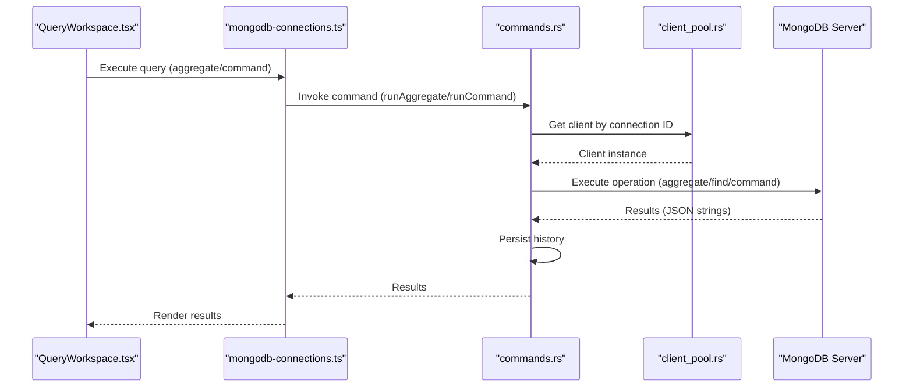
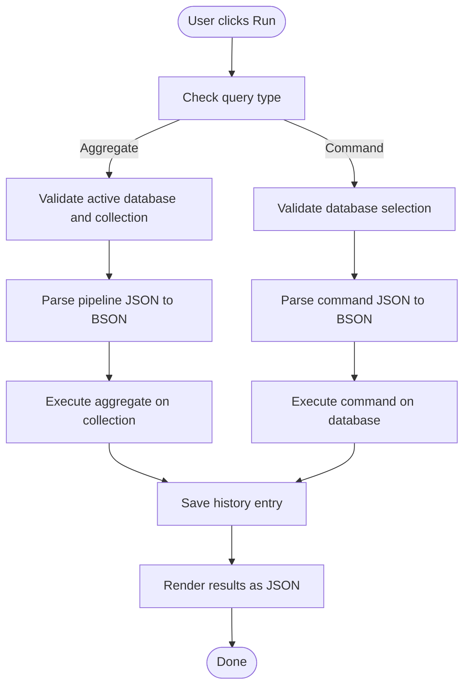
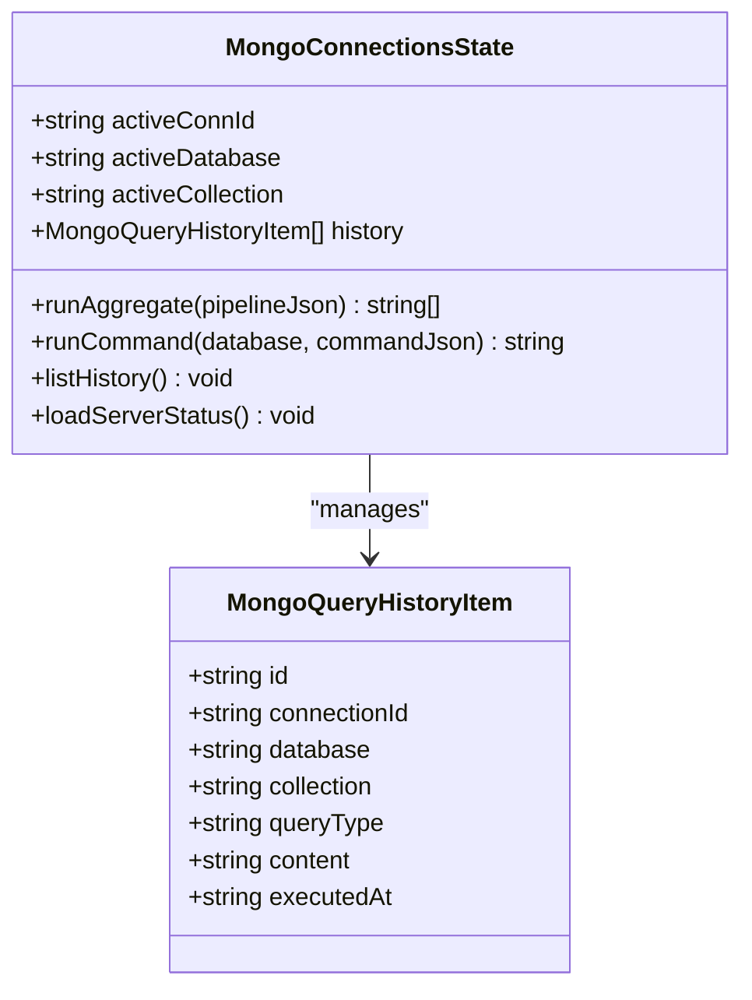
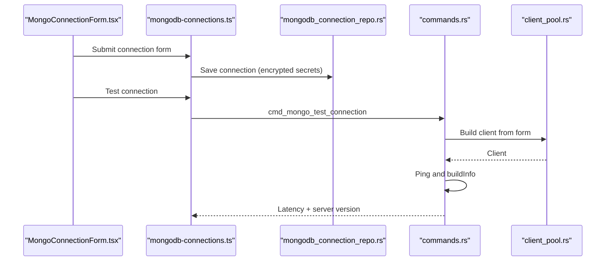
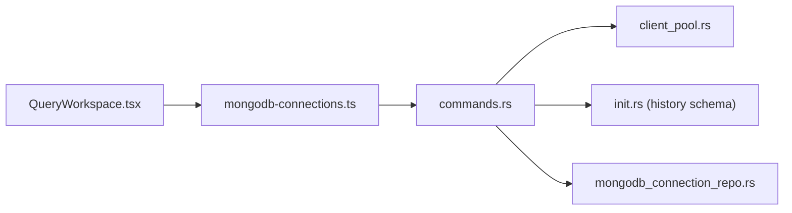

# Query Workspace

<cite>
**Referenced Files in This Document**
- [QueryWorkspace.tsx](file://src/plugins/mongodb-client/views/QueryWorkspace.tsx)
- [mongodb-connections.ts](file://src/plugins/mongodb-client/store/mongodb-connections.ts)
- [types.ts](file://src/plugins/mongodb-client/types.ts)
- [MongoConnectionForm.tsx](file://src/plugins/mongodb-client/components/MongoConnectionForm.tsx)
- [index.tsx](file://src/plugins/mongodb-client/index.tsx)
- [DatabaseBrowser.tsx](file://src/plugins/mongodb-client/views/DatabaseBrowser.tsx)
- [DocumentBrowser.tsx](file://src/plugins/mongodb-client/views/DocumentBrowser.tsx)
- [commands.rs](file://src-tauri/src/plugins/mongodb/commands.rs)
- [client_pool.rs](file://src-tauri/src/plugins/mongodb/client_pool.rs)
- [init.rs](file://src-tauri/src/db/init.rs)
- [mongodb_connection_repo.rs](file://src-tauri/src/db/mongodb_connection_repo.rs)
</cite>

## Table of Contents
1. [Introduction](#introduction)
2. [Project Structure](#project-structure)
3. [Core Components](#core-components)
4. [Architecture Overview](#architecture-overview)
5. [Detailed Component Analysis](#detailed-component-analysis)
6. [Dependency Analysis](#dependency-analysis)
7. [Performance Considerations](#performance-considerations)
8. [Troubleshooting Guide](#troubleshooting-guide)
9. [Conclusion](#conclusion)
10. [Appendices](#appendices)

## Introduction
This document describes the MongoDB query workspace within RDMM, focusing on executing MongoDB queries and aggregation pipelines. It covers the query editor interface, execution environment, supported query types, result visualization, performance monitoring, and integration with MongoDB's query planner and debugging tools.

## Project Structure
The MongoDB plugin is organized around a React-based UI and a Tauri-backed backend. The query workspace is one of several tabs in the MongoDB client plugin, alongside connections, databases, documents, indexes, import/export, and server status.

**Diagram sources**
- [QueryWorkspace.tsx:1-134](file://src/plugins/mongodb-client/views/QueryWorkspace.tsx#L1-L134)
- [mongodb-connections.ts:1-296](file://src/plugins/mongodb-client/store/mongodb-connections.ts#L1-L296)
- [commands.rs:1-788](file://src-tauri/src/plugins/mongodb/commands.rs#L1-L788)
- [client_pool.rs:1-132](file://src-tauri/src/plugins/mongodb/client_pool.rs#L1-L132)
- [init.rs:1-393](file://src-tauri/src/db/init.rs#L1-L393)
- [mongodb_connection_repo.rs:1-249](file://src-tauri/src/db/mongodb_connection_repo.rs#L1-L249)

**Section sources**
- [index.tsx:1-87](file://src/plugins/mongodb-client/index.tsx#L1-L87)
- [QueryWorkspace.tsx:1-134](file://src/plugins/mongodb-client/views/QueryWorkspace.tsx#L1-L134)
- [mongodb-connections.ts:1-296](file://src/plugins/mongodb-client/store/mongodb-connections.ts#L1-L296)

## Core Components
- QueryWorkspace: Provides the query editor and result display for MongoDB operations.
- Store: Centralized state management for connections, databases, collections, and query execution.
- Backend Commands: Implements MongoDB operations including find, aggregate, and database commands.
- Connection Management: Handles connection creation, testing, and persistence.

Key capabilities:
- Query types: Aggregation pipelines and database commands.
- Execution environment: JSON-based query input with BSON conversion.
- Result visualization: Plain-text JSON output rendering.
- Safety: Dangerous command detection and confirmation dialog.
- History: Query history persisted locally.

**Section sources**
- [QueryWorkspace.tsx:1-134](file://src/plugins/mongodb-client/views/QueryWorkspace.tsx#L1-L134)
- [mongodb-connections.ts:66-76](file://src/plugins/mongodb-client/store/mongodb-connections.ts#L66-L76)
- [commands.rs:480-545](file://src-tauri/src/plugins/mongodb/commands.rs#L480-L545)
- [init.rs:135-143](file://src-tauri/src/db/init.rs#L135-L143)

## Architecture Overview
The query workspace integrates UI, state management, and backend commands. The UI triggers store actions, which invoke Tauri commands. The backend connects to MongoDB via a client pool, executes operations, and persists query history.

**Diagram sources**
- [QueryWorkspace.tsx:41-65](file://src/plugins/mongodb-client/views/QueryWorkspace.tsx#L41-L65)
- [mongodb-connections.ts:237-247](file://src/plugins/mongodb-client/store/mongodb-connections.ts#L237-L247)
- [commands.rs:480-545](file://src-tauri/src/plugins/mongodb/commands.rs#L480-L545)
- [client_pool.rs:107-123](file://src-tauri/src/plugins/mongodb/client_pool.rs#L107-L123)

## Detailed Component Analysis

### Query Editor and Execution Flow
The query workspace supports two modes:
- Aggregate: Executes aggregation pipelines against a selected collection.
- Command: Executes database commands against a specified database.

Safety checks:
- Dangerous command detection for commands that can drop data or shut down servers.
- Confirmation dialog for potentially destructive operations.

Execution steps:
- Parse JSON input to BSON for pipeline entries or command document.
- Execute against the active connection and database/collection.
- Persist query history with type, content, and timestamp.
- Render results as formatted JSON strings.

**Diagram sources**
- [QueryWorkspace.tsx:31-65](file://src/plugins/mongodb-client/views/QueryWorkspace.tsx#L31-L65)
- [commands.rs:480-545](file://src-tauri/src/plugins/mongodb/commands.rs#L480-L545)

**Section sources**
- [QueryWorkspace.tsx:1-134](file://src/plugins/mongodb-client/views/QueryWorkspace.tsx#L1-L134)
- [commands.rs:480-545](file://src-tauri/src/plugins/mongodb/commands.rs#L480-L545)

### State Management and Data Types
The store encapsulates:
- Connection lifecycle (list, save, connect, disconnect).
- Namespace management (active database and collection).
- Query execution (runAggregate, runCommand).
- History listing and server status.

Data types define the shape of stored data, including query history items and server status.

**Diagram sources**
- [mongodb-connections.ts:27-77](file://src/plugins/mongodb-client/store/mongodb-connections.ts#L27-L77)
- [types.ts:73-81](file://src/plugins/mongodb-client/types.ts#L73-L81)

**Section sources**
- [mongodb-connections.ts:1-296](file://src/plugins/mongodb-client/store/mongodb-connections.ts#L1-L296)
- [types.ts:1-95](file://src/plugins/mongodb-client/types.ts#L1-L95)

### Connection Management and Security
Connections support:
- URI and form-based configurations.
- Encrypted secrets storage for URIs and passwords.
- TLS and SRV options.
- Testing latency and server version retrieval.

**Diagram sources**
- [MongoConnectionForm.tsx:1-169](file://src/plugins/mongodb-client/components/MongoConnectionForm.tsx#L1-L169)
- [mongodb-connections.ts:132-146](file://src/plugins/mongodb-client/store/mongodb-connections.ts#L132-L146)
- [mongodb_connection_repo.rs:115-202](file://src-tauri/src/db/mongodb_connection_repo.rs#L115-L202)
- [commands.rs:146-154](file://src-tauri/src/plugins/mongodb/commands.rs#L146-L154)
- [client_pool.rs:14-105](file://src-tauri/src/plugins/mongodb/client_pool.rs#L14-L105)

**Section sources**
- [MongoConnectionForm.tsx:1-169](file://src/plugins/mongodb-client/components/MongoConnectionForm.tsx#L1-L169)
- [mongodb_connection_repo.rs:1-249](file://src-tauri/src/db/mongodb_connection_repo.rs#L1-L249)
- [commands.rs:146-169](file://src-tauri/src/plugins/mongodb/commands.rs#L146-L169)

### Supported Query Types
- Aggregation Pipeline: Executes a JSON array of pipeline stages against a collection.
- Database Command: Executes arbitrary database commands against a specified database.
- Find Queries: Available in the documents browser for filtering, projection, sorting, and pagination.

Notes:
- Map-Reduce operations are not exposed in the query workspace UI.
- Administrative commands are supported via the command mode with safety checks.

**Section sources**
- [QueryWorkspace.tsx:7-18](file://src/plugins/mongodb-client/views/QueryWorkspace.tsx#L7-L18)
- [commands.rs:480-545](file://src-tauri/src/plugins/mongodb/commands.rs#L480-L545)
- [DocumentBrowser.tsx:44-52](file://src/plugins/mongodb-client/views/DocumentBrowser.tsx#L44-L52)

### Result Visualization
Results are rendered as formatted JSON strings in a monospace font for readability. The workspace displays:
- Single or multiple result documents depending on the operation.
- A history panel showing recent queries with timestamps.

Visualization limitations:
- No built-in table or chart rendering for query results.
- JSON viewer is text-based with preserved formatting.

**Section sources**
- [QueryWorkspace.tsx:98-108](file://src/plugins/mongodb-client/views/QueryWorkspace.tsx#L98-L108)
- [commands.rs:511-519](file://src-tauri/src/plugins/mongodb/commands.rs#L511-L519)

### Parameter Binding and Variable Substitution
- The workspace does not implement parameter binding or variable substitution for queries.
- Users must paste complete JSON documents/pipelines into the editor.
- Find operations accept filter, projection, and sort JSON inputs with pagination controls.

**Section sources**
- [QueryWorkspace.tsx:93-97](file://src/plugins/mongodb-client/views/QueryWorkspace.tsx#L93-L97)
- [DocumentBrowser.tsx:30-52](file://src/plugins/mongodb-client/views/DocumentBrowser.tsx#L30-L52)

### Query Performance Monitoring and Execution Time Tracking
- Latency measurement during connection testing is available.
- Execution time is not tracked for individual queries in the workspace.
- Server status provides operational counters and memory metrics.

**Section sources**
- [commands.rs:146-154](file://src-tauri/src/plugins/mongodb/commands.rs#L146-L154)
- [commands.rs:758-781](file://src-tauri/src/plugins/mongodb/commands.rs#L758-L781)

### Result Pagination for Large Datasets
- Aggregation results are streamed and collected; there is no explicit pagination UI.
- Find operations in the documents browser support pagination with configurable page size.

**Section sources**
- [commands.rs:480-520](file://src-tauri/src/plugins/mongodb/commands.rs#L480-L520)
- [DocumentBrowser.tsx:153-163](file://src/plugins/mongodb-client/views/DocumentBrowser.tsx#L153-L163)

### Practical Examples and Patterns
Common patterns supported by the workspace:
- Aggregation pipeline: Limit, match, group, and project stages.
- Database command: Example administrative commands (e.g., ping, buildInfo).
- Find with filters, projections, and sorts.

Note: The workspace initializes with a sample pipeline that limits results, suitable for quick testing.

**Section sources**
- [QueryWorkspace.tsx:19-21](file://src/plugins/mongodb-client/views/QueryWorkspace.tsx#L19-L21)
- [commands.rs:522-545](file://src-tauri/src/plugins/mongodb/commands.rs#L522-L545)

### Integration with MongoDB Tools
- Query Planner and Explain: Not exposed in the query workspace UI.
- Debugging tools: Server status and basic connection testing are available.
- History: Local query history persists query type, content, and timestamp.

**Section sources**
- [commands.rs:402-435](file://src-tauri/src/plugins/mongodb/commands.rs#L402-L435)
- [commands.rs:758-781](file://src-tauri/src/plugins/mongodb/commands.rs#L758-L781)

## Dependency Analysis
The query workspace depends on:
- UI components for editing and displaying results.
- Store actions for execution and history.
- Backend commands for MongoDB connectivity and operations.
- Client pool for managing connections.
- Local database for query history persistence.

**Diagram sources**
- [QueryWorkspace.tsx:1-134](file://src/plugins/mongodb-client/views/QueryWorkspace.tsx#L1-L134)
- [mongodb-connections.ts:1-296](file://src/plugins/mongodb-client/store/mongodb-connections.ts#L1-L296)
- [commands.rs:1-788](file://src-tauri/src/plugins/mongodb/commands.rs#L1-L788)
- [client_pool.rs:1-132](file://src-tauri/src/plugins/mongodb/client_pool.rs#L1-L132)
- [init.rs:135-143](file://src-tauri/src/db/init.rs#L135-L143)
- [mongodb_connection_repo.rs:1-249](file://src-tauri/src/db/mongodb_connection_repo.rs#L1-L249)

**Section sources**
- [QueryWorkspace.tsx:1-134](file://src/plugins/mongodb-client/views/QueryWorkspace.tsx#L1-L134)
- [mongodb-connections.ts:1-296](file://src/plugins/mongodb-client/store/mongodb-connections.ts#L1-L296)
- [commands.rs:1-788](file://src-tauri/src/plugins/mongodb/commands.rs#L1-L788)

## Performance Considerations
- Connection pooling: Clients are cached by connection ID to reduce overhead.
- Streaming results: Aggregation results are streamed to avoid large memory spikes.
- Pagination: Find operations support skip/limit to manage large result sets.
- History writes: Query history is persisted asynchronously to minimize UI blocking.

[No sources needed since this section provides general guidance]

## Troubleshooting Guide
Common issues and resolutions:
- Connection failures: Use the connection form to test latency and verify credentials.
- Empty results: Verify active database and collection selections for aggregation mode.
- Dangerous commands: Confirm before executing commands that can drop data or shut down servers.
- History not updating: Ensure the connection is active and the workspace tab is set to Query.

**Section sources**
- [MongoConnectionForm.tsx:54-63](file://src/plugins/mongodb-client/components/MongoConnectionForm.tsx#L54-L63)
- [QueryWorkspace.tsx:31-65](file://src/plugins/mongodb-client/views/QueryWorkspace.tsx#L31-L65)
- [mongodb-connections.ts:283-289](file://src/plugins/mongodb-client/store/mongodb-connections.ts#L283-L289)

## Conclusion
The MongoDB query workspace provides a focused environment for executing aggregation pipelines and database commands against MongoDB. It emphasizes safety with dangerous command warnings, offers a straightforward JSON-based editor, and persists query history locally. While advanced features like parameter binding, result pagination for aggregation, and integrated explain/explainPlan are not present, the workspace integrates well with existing MongoDB tooling and provides a solid foundation for query development and iteration.

## Appendices

### Supported Operations Summary
- Aggregation: Pipeline execution against a collection.
- Commands: Database-level commands with safety checks.
- Find: Filtering, projection, sorting, and pagination in the documents browser.

**Section sources**
- [QueryWorkspace.tsx:7-18](file://src/plugins/mongodb-client/views/QueryWorkspace.tsx#L7-L18)
- [commands.rs:480-545](file://src-tauri/src/plugins/mongodb/commands.rs#L480-L545)
- [DocumentBrowser.tsx:44-52](file://src/plugins/mongodb-client/views/DocumentBrowser.tsx#L44-L52)