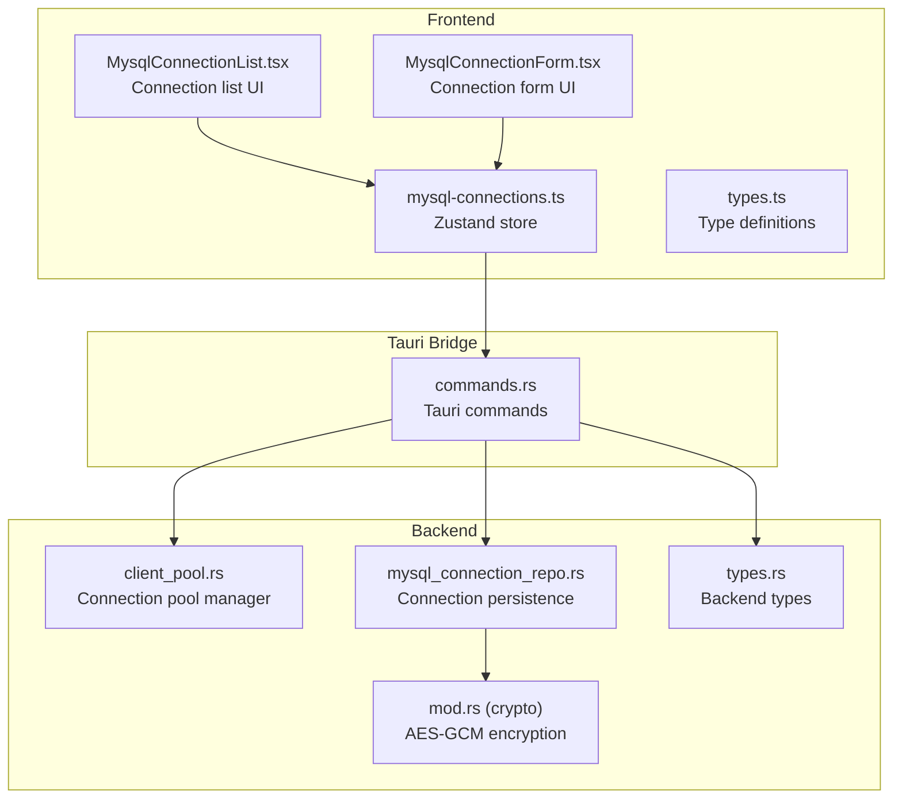
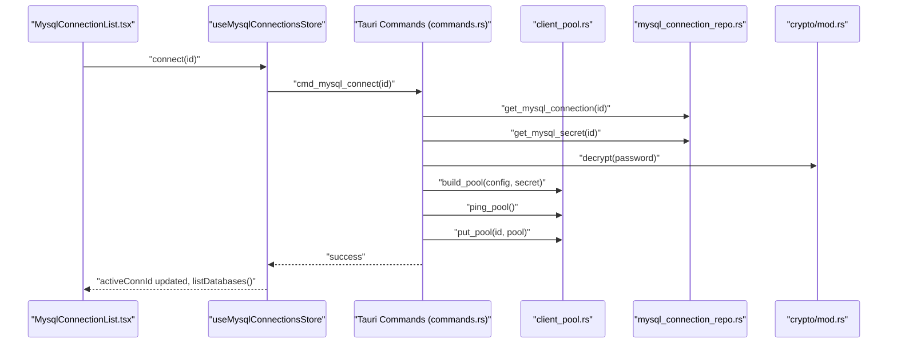
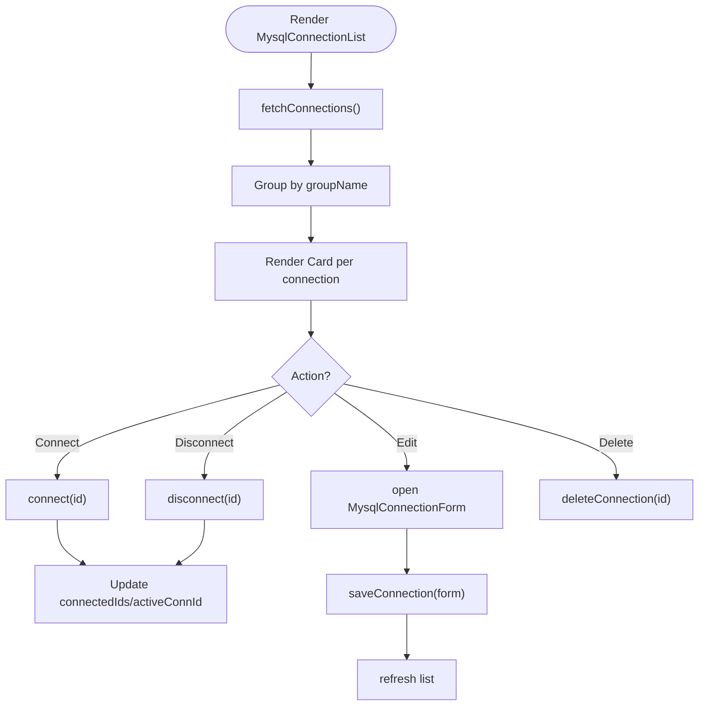
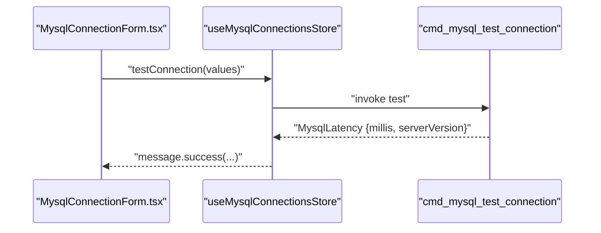
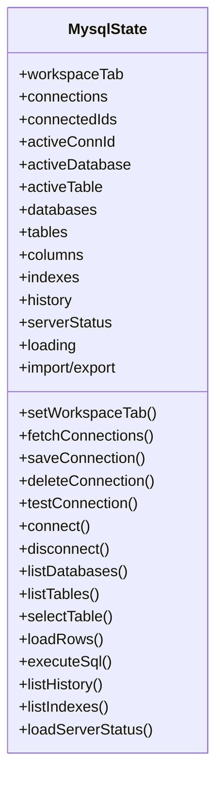
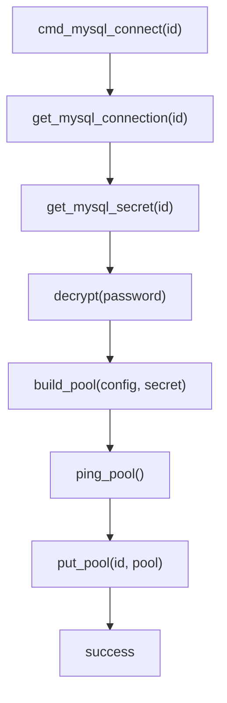
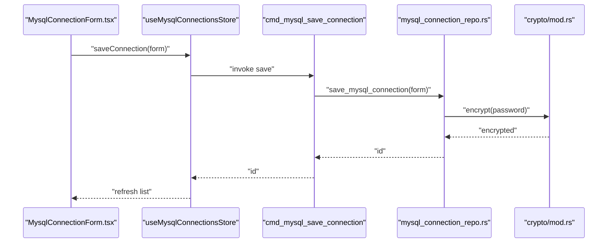
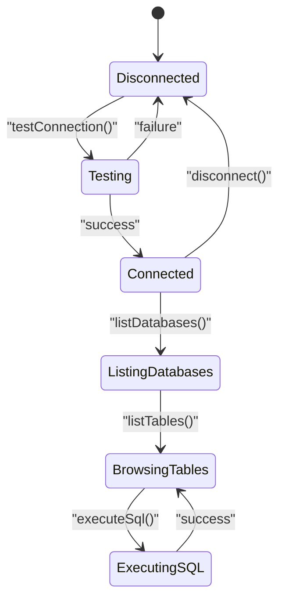
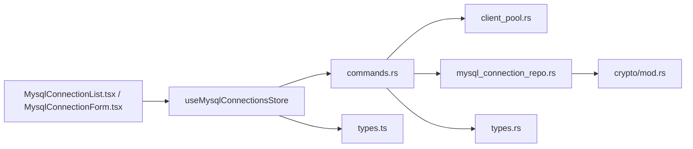

# Connection Management

<cite>
**Referenced Files in This Document**
- [mysql-connections.ts](file://src/plugins/mysql-client/store/mysql-connections.ts)
- [MysqlConnectionForm.tsx](file://src/plugins/mysql-client/components/MysqlConnectionForm.tsx)
- [MysqlConnectionList.tsx](file://src/plugins/mysql-client/views/MysqlConnectionList.tsx)
- [types.ts](file://src/plugins/mysql-client/types.ts)
- [mod.rs](file://src-tauri/src/plugins/mysql/mod.rs)
- [client_pool.rs](file://src-tauri/src/plugins/mysql/client_pool.rs)
- [commands.rs](file://src-tauri/src/plugins/mysql/commands.rs)
- [mysql_connection_repo.rs](file://src-tauri/src/db/mysql_connection_repo.rs)
- [mod.rs (crypto)](file://src-tauri/src/crypto/mod.rs)
- [types.rs](file://src-tauri/src/plugins/mysql/types.rs)
</cite>

## Table of Contents
1. [Introduction](#introduction)
2. [Project Structure](#project-structure)
3. [Core Components](#core-components)
4. [Architecture Overview](#architecture-overview)
5. [Detailed Component Analysis](#detailed-component-analysis)
6. [Dependency Analysis](#dependency-analysis)
7. [Performance Considerations](#performance-considerations)
8. [Troubleshooting Guide](#troubleshooting-guide)
9. [Conclusion](#conclusion)

## Introduction
This document describes the MySQL connection management system, covering the connection list interface, the connection form component, the connection store architecture using Zustand, and the backend implementation for secure connections, pooling, and lifecycle management. It explains how connections are viewed, added, edited, and removed; how authentication and SSL are configured; how encrypted credentials are stored; and how connection testing and validation work. It also provides guidance on connection pooling, failure handling, and best practices.

## Project Structure
The MySQL connection management spans three layers:
- Frontend React components and Zustand store for UI and state
- Tauri commands bridging frontend actions to backend operations
- Backend Rust modules for connection pooling, credential encryption, and database operations

**Diagram sources**
- [MysqlConnectionList.tsx:1-33](file://src/plugins/mysql-client/views/MysqlConnectionList.tsx#L1-L33)
- [MysqlConnectionForm.tsx:1-45](file://src/plugins/mysql-client/components/MysqlConnectionForm.tsx#L1-L45)
- [mysql-connections.ts:1-153](file://src/plugins/mysql-client/store/mysql-connections.ts#L1-L153)
- [types.ts:1-40](file://src/plugins/mysql-client/types.ts#L1-L40)
- [commands.rs:1-615](file://src-tauri/src/plugins/mysql/commands.rs#L1-L615)
- [client_pool.rs:1-65](file://src-tauri/src/plugins/mysql/client_pool.rs#L1-L65)
- [mysql_connection_repo.rs:1-209](file://src-tauri/src/db/mysql_connection_repo.rs#L1-L209)
- [mod.rs (crypto):1-75](file://src-tauri/src/crypto/mod.rs#L1-L75)
- [types.rs:1-97](file://src-tauri/src/plugins/mysql/types.rs#L1-L97)

**Section sources**
- [MysqlConnectionList.tsx:1-33](file://src/plugins/mysql-client/views/MysqlConnectionList.tsx#L1-L33)
- [MysqlConnectionForm.tsx:1-45](file://src/plugins/mysql-client/components/MysqlConnectionForm.tsx#L1-L45)
- [mysql-connections.ts:1-153](file://src/plugins/mysql-client/store/mysql-connections.ts#L1-L153)
- [types.ts:1-40](file://src/plugins/mysql-client/types.ts#L1-L40)
- [commands.rs:176-214](file://src-tauri/src/plugins/mysql/commands.rs#L176-L214)
- [client_pool.rs:1-65](file://src-tauri/src/plugins/mysql/client_pool.rs#L1-L65)
- [mysql_connection_repo.rs:1-209](file://src-tauri/src/db/mysql_connection_repo.rs#L1-L209)
- [mod.rs (crypto):1-75](file://src-tauri/src/crypto/mod.rs#L1-L75)
- [types.rs:1-97](file://src-tauri/src/plugins/mysql/types.rs#L1-L97)

## Core Components
- Connection list view: Displays saved connections, supports search, connect/disconnect, edit, and delete.
- Connection form: Captures host, port, credentials, default database, charset, SSL mode, and timeout; includes a connection test button.
- Zustand store: Manages connection lifecycle, active connection tracking, and data fetching for databases, tables, and rows.
- Backend commands: Persist, test, connect, disconnect, and query metadata and data.
- Connection pool: Reuses pooled connections per connection ID for performance.
- Encrypted secrets: Passwords are persisted encrypted and decrypted on demand.

**Section sources**
- [MysqlConnectionList.tsx:8-32](file://src/plugins/mysql-client/views/MysqlConnectionList.tsx#L8-L32)
- [MysqlConnectionForm.tsx:9-44](file://src/plugins/mysql-client/components/MysqlConnectionForm.tsx#L9-L44)
- [mysql-connections.ts:22-62](file://src/plugins/mysql-client/store/mysql-connections.ts#L22-L62)
- [commands.rs:176-214](file://src-tauri/src/plugins/mysql/commands.rs#L176-L214)
- [client_pool.rs:12-48](file://src-tauri/src/plugins/mysql/client_pool.rs#L12-L48)
- [mysql_connection_repo.rs:108-176](file://src-tauri/src/db/mysql_connection_repo.rs#L108-L176)
- [mod.rs (crypto):40-74](file://src-tauri/src/crypto/mod.rs#L40-L74)

## Architecture Overview
The system follows a layered architecture:
- UI layer: Ant Design forms and cards for managing connections
- Store layer: Zustand state orchestrating actions and data
- Command layer: Tauri commands invoking backend logic
- Persistence layer: SQLite-backed connection records with encrypted secrets
- Pooling layer: mysql-async pools keyed by connection ID

**Diagram sources**
- [MysqlConnectionList.tsx:21-21](file://src/plugins/mysql-client/views/MysqlConnectionList.tsx#L21-L21)
- [mysql-connections.ts:109-113](file://src/plugins/mysql-client/store/mysql-connections.ts#L109-L113)
- [commands.rs:202-209](file://src-tauri/src/plugins/mysql/commands.rs#L202-L209)
- [client_pool.rs:12-48](file://src-tauri/src/plugins/mysql/client_pool.rs#L12-L48)
- [mysql_connection_repo.rs:88-106](file://src-tauri/src/db/mysql_connection_repo.rs#L88-L106)
- [mod.rs (crypto):57-74](file://src-tauri/src/crypto/mod.rs#L57-L74)

## Detailed Component Analysis

### Connection List Interface
- Displays grouped connections by group name (defaults to "Default").
- Provides quick actions: Connect, Disconnect, Edit, Delete.
- Supports search by name or host.
- Double-click to connect; shows success messages.

**Diagram sources**
- [MysqlConnectionList.tsx:8-32](file://src/plugins/mysql-client/views/MysqlConnectionList.tsx#L8-L32)
- [mysql-connections.ts:94-107](file://src/plugins/mysql-client/store/mysql-connections.ts#L94-L107)

**Section sources**
- [MysqlConnectionList.tsx:8-32](file://src/plugins/mysql-client/views/MysqlConnectionList.tsx#L8-L32)
- [mysql-connections.ts:94-107](file://src/plugins/mysql-client/store/mysql-connections.ts#L94-L107)

### Connection Form Component
- Fields: Name, Group, Host, Port, Username, Password, Default Database, Charset, SSL Mode, Connect Timeout.
- Defaults: Port 3306, charset utf8mb4, sslMode preferred, connectTimeout 10.
- Test Connection: Validates connectivity and returns latency and server version.

**Diagram sources**
- [MysqlConnectionForm.tsx:19-40](file://src/plugins/mysql-client/components/MysqlConnectionForm.tsx#L19-L40)
- [mysql-connections.ts](file://src/plugins/mysql-client/store/mysql-connections.ts#L108)
- [commands.rs:192-199](file://src-tauri/src/plugins/mysql/commands.rs#L192-L199)

**Section sources**
- [MysqlConnectionForm.tsx:9-44](file://src/plugins/mysql-client/components/MysqlConnectionForm.tsx#L9-L44)
- [types.ts:1-13](file://src/plugins/mysql-client/types.ts#L1-L13)
- [mysql-connections.ts](file://src/plugins/mysql-client/store/mysql-connections.ts#L108)
- [commands.rs:192-199](file://src-tauri/src/plugins/mysql/commands.rs#L192-L199)

### Connection Store Architecture (Zustand)
- State: connections, connectedIds, activeConnId, activeDatabase, activeTable, metadata lists, loading flag.
- Actions: fetchConnections, saveConnection, deleteConnection, testConnection, connect, disconnect, listDatabases, listTables, selectTable, loadRows, SQL execution, history, indexes, import/export, server status.
- Validation helpers: requireConn, requireTable enforce active context.

**Diagram sources**
- [mysql-connections.ts:22-62](file://src/plugins/mysql-client/store/mysql-connections.ts#L22-L62)

**Section sources**
- [mysql-connections.ts:77-152](file://src/plugins/mysql-client/store/mysql-connections.ts#L77-L152)

### Backend Commands and Pooling
- Listing, saving, deleting connections via repository.
- Testing builds a temporary pool, pings the server, and disconnects.
- Connecting loads config and secrets, builds a pool, pings to validate, stores in pool map.
- Disconnecting removes the pool and disconnects connections.
- Pools are keyed by connection ID and reused for subsequent operations.

**Diagram sources**
- [commands.rs:202-209](file://src-tauri/src/plugins/mysql/commands.rs#L202-L209)
- [client_pool.rs:32-48](file://src-tauri/src/plugins/mysql/client_pool.rs#L32-L48)
- [mysql_connection_repo.rs:88-106](file://src-tauri/src/db/mysql_connection_repo.rs#L88-L106)
- [mod.rs (crypto):57-74](file://src-tauri/src/crypto/mod.rs#L57-L74)

**Section sources**
- [commands.rs:176-214](file://src-tauri/src/plugins/mysql/commands.rs#L176-L214)
- [client_pool.rs:12-63](file://src-tauri/src/plugins/mysql/client_pool.rs#L12-L63)
- [mysql_connection_repo.rs:108-176](file://src-tauri/src/db/mysql_connection_repo.rs#L108-L176)
- [mod.rs (crypto):40-74](file://src-tauri/src/crypto/mod.rs#L40-L74)

### Security: Encrypted Credential Storage
- Passwords are stored encrypted in the SQLite database under the "password_encrypted" field.
- Encryption uses AES-GCM with a device-scoped key file.
- Decryption occurs when building pools for live connections.

**Diagram sources**
- [MysqlConnectionForm.tsx:19-22](file://src/plugins/mysql-client/components/MysqlConnectionForm.tsx#L19-L22)
- [mysql-connections.ts:99-102](file://src/plugins/mysql-client/store/mysql-connections.ts#L99-L102)
- [commands.rs:182-184](file://src-tauri/src/plugins/mysql/commands.rs#L182-L184)
- [mysql_connection_repo.rs:108-176](file://src-tauri/src/db/mysql_connection_repo.rs#L108-L176)
- [mod.rs (crypto):40-54](file://src-tauri/src/crypto/mod.rs#L40-L54)

**Section sources**
- [mysql_connection_repo.rs:134-138](file://src-tauri/src/db/mysql_connection_repo.rs#L134-L138)
- [mod.rs (crypto):40-74](file://src-tauri/src/crypto/mod.rs#L40-L74)

### Connection Lifecycle Management
- Establishing a secure connection:
  - Fill form with host, port, username, optional password, default database, charset, SSL mode, timeout.
  - Click "Test Connection" to validate.
  - Save and connect; the store updates active connection and navigates to the databases tab.
- Managing multiple connections:
  - Keep several connections; switch active connection via connect/disconnect actions.
  - Active connection is required for listing databases, tables, and executing queries.
- Disconnection and cleanup:
  - Disconnect removes the pool and clears active state.

**Diagram sources**
- [MysqlConnectionForm.tsx:40-40](file://src/plugins/mysql-client/components/MysqlConnectionForm.tsx#L40-L40)
- [mysql-connections.ts:109-113](file://src/plugins/mysql-client/store/mysql-connections.ts#L109-L113)
- [commands.rs:216-230](file://src-tauri/src/plugins/mysql/commands.rs#L216-L230)

**Section sources**
- [MysqlConnectionForm.tsx:19-40](file://src/plugins/mysql-client/components/MysqlConnectionForm.tsx#L19-L40)
- [mysql-connections.ts:109-117](file://src/plugins/mysql-client/store/mysql-connections.ts#L109-L117)
- [commands.rs:216-230](file://src-tauri/src/plugins/mysql/commands.rs#L216-L230)

### Connection Pooling Parameters and Behavior
- Pool creation:
  - Builds a mysql-async Pool from connection config and decrypted secret.
  - Sets charset initialization statements.
- Pool retrieval and removal:
  - Pools are retrieved by connection ID and removed on disconnect.
- Limitations:
  - No explicit pool size or idle timeouts are exposed in the UI or commands; the pool defaults apply.

**Section sources**
- [client_pool.rs:12-30](file://src-tauri/src/plugins/mysql/client_pool.rs#L12-L30)
- [client_pool.rs:32-48](file://src-tauri/src/plugins/mysql/client_pool.rs#L32-L48)
- [commands.rs:202-209](file://src-tauri/src/plugins/mysql/commands.rs#L202-L209)

### Connection Validation and Error Handling
- Validation steps:
  - Test connection builds a temporary pool, pings the server, and disconnects.
  - Connect validates pool readiness and stores it.
- Error handling:
  - Errors propagate from backend commands to the UI via messages.
  - Missing active connection triggers explicit validation errors for downstream operations.

**Section sources**
- [commands.rs:192-199](file://src-tauri/src/plugins/mysql/commands.rs#L192-L199)
- [commands.rs:202-209](file://src-tauri/src/plugins/mysql/commands.rs#L202-L209)
- [mysql-connections.ts:66-75](file://src/plugins/mysql-client/store/mysql-connections.ts#L66-L75)

## Dependency Analysis
- Frontend depends on:
  - Zustand store for state orchestration
  - Tauri invoke for command execution
  - Ant Design for UI components
- Backend depends on:
  - mysql-async for connection pooling
  - rusqlite for local connection metadata
  - AES-GCM for credential encryption

**Diagram sources**
- [MysqlConnectionList.tsx:1-33](file://src/plugins/mysql-client/views/MysqlConnectionList.tsx#L1-L33)
- [MysqlConnectionForm.tsx:1-45](file://src/plugins/mysql-client/components/MysqlConnectionForm.tsx#L1-L45)
- [mysql-connections.ts:1-153](file://src/plugins/mysql-client/store/mysql-connections.ts#L1-L153)
- [commands.rs:1-615](file://src-tauri/src/plugins/mysql/commands.rs#L1-L615)
- [client_pool.rs:1-65](file://src-tauri/src/plugins/mysql/client_pool.rs#L1-L65)
- [mysql_connection_repo.rs:1-209](file://src-tauri/src/db/mysql_connection_repo.rs#L1-L209)
- [mod.rs (crypto):1-75](file://src-tauri/src/crypto/mod.rs#L1-L75)
- [types.rs:1-97](file://src-tauri/src/plugins/mysql/types.rs#L1-L97)
- [types.ts:1-40](file://src/plugins/mysql-client/types.ts#L1-L40)

**Section sources**
- [mysql-connections.ts:1-153](file://src/plugins/mysql-client/store/mysql-connections.ts#L1-L153)
- [commands.rs:1-615](file://src-tauri/src/plugins/mysql/commands.rs#L1-L615)
- [client_pool.rs:1-65](file://src-tauri/src/plugins/mysql/client_pool.rs#L1-L65)
- [mysql_connection_repo.rs:1-209](file://src-tauri/src/db/mysql_connection_repo.rs#L1-L209)
- [mod.rs (crypto):1-75](file://src-tauri/src/crypto/mod.rs#L1-L75)
- [types.rs:1-97](file://src-tauri/src/plugins/mysql/types.rs#L1-L97)
- [types.ts:1-40](file://src/plugins/mysql-client/types.ts#L1-L40)

## Performance Considerations
- Prefer connecting once and reusing the connection pool per connection ID rather than reconnecting frequently.
- Limit batch sizes for row operations; the backend caps limits for row selection.
- Use connection timeout settings appropriately to avoid long hangs on unstable networks.
- Avoid excessive concurrent operations; rely on the existing pool concurrency model.

[No sources needed since this section provides general guidance]

## Troubleshooting Guide
Common issues and resolutions:
- Cannot connect:
  - Use "Test Connection" to validate host/port/credentials/SSL mode.
  - Verify firewall and network access to the MySQL server.
- Wrong credentials:
  - Ensure the password is correct; passwords are encrypted and decrypted automatically during connect.
- SSL mode mismatch:
  - Adjust SSL Mode to match server configuration.
- Connection fails after save:
  - Confirm the connection was saved with the intended password; leaving password blank keeps the existing encrypted value.
- Active connection required:
  - Certain operations require an active connection; connect first and retry.

**Section sources**
- [MysqlConnectionForm.tsx:40-40](file://src/plugins/mysql-client/components/MysqlConnectionForm.tsx#L40-L40)
- [mysql-connections.ts:66-75](file://src/plugins/mysql-client/store/mysql-connections.ts#L66-L75)
- [commands.rs:192-199](file://src-tauri/src/plugins/mysql/commands.rs#L192-L199)
- [mysql_connection_repo.rs:127-138](file://src-tauri/src/db/mysql_connection_repo.rs#L127-L138)

## Conclusion
The MySQL connection management system provides a secure, efficient, and user-friendly way to manage connections. The frontend offers a clean interface for viewing, adding, editing, and removing connections, while the backend ensures secure credential storage, robust connection pooling, and reliable lifecycle management. By following the best practices outlined here—testing connections, leveraging pools, and handling errors gracefully—you can maintain stable and performant database access.