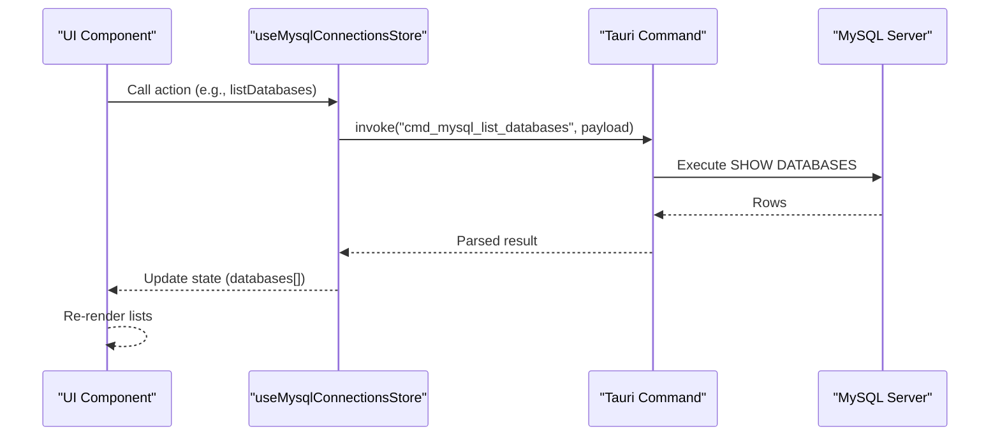
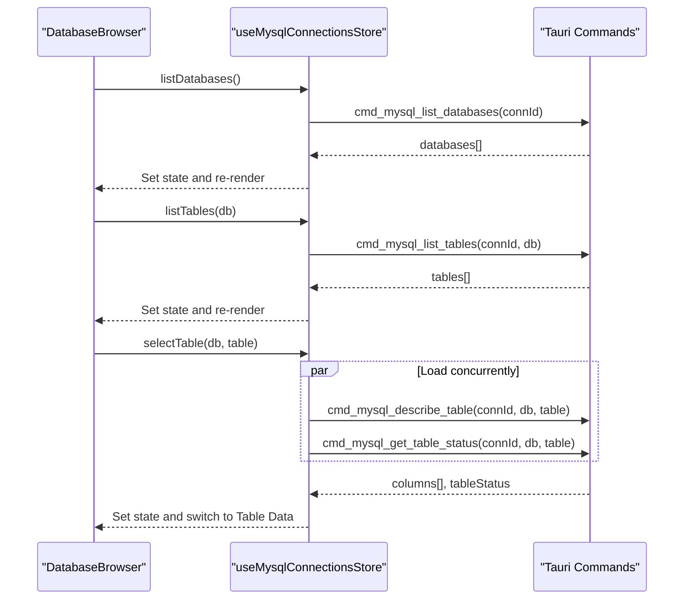
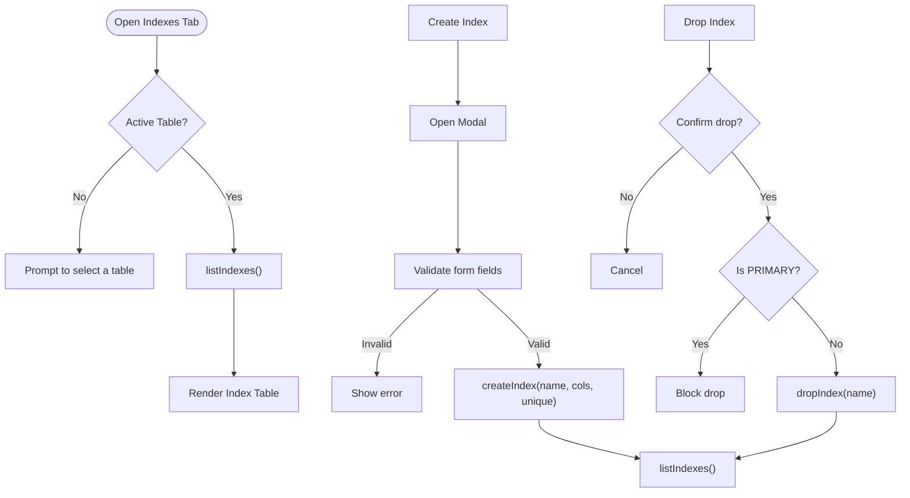
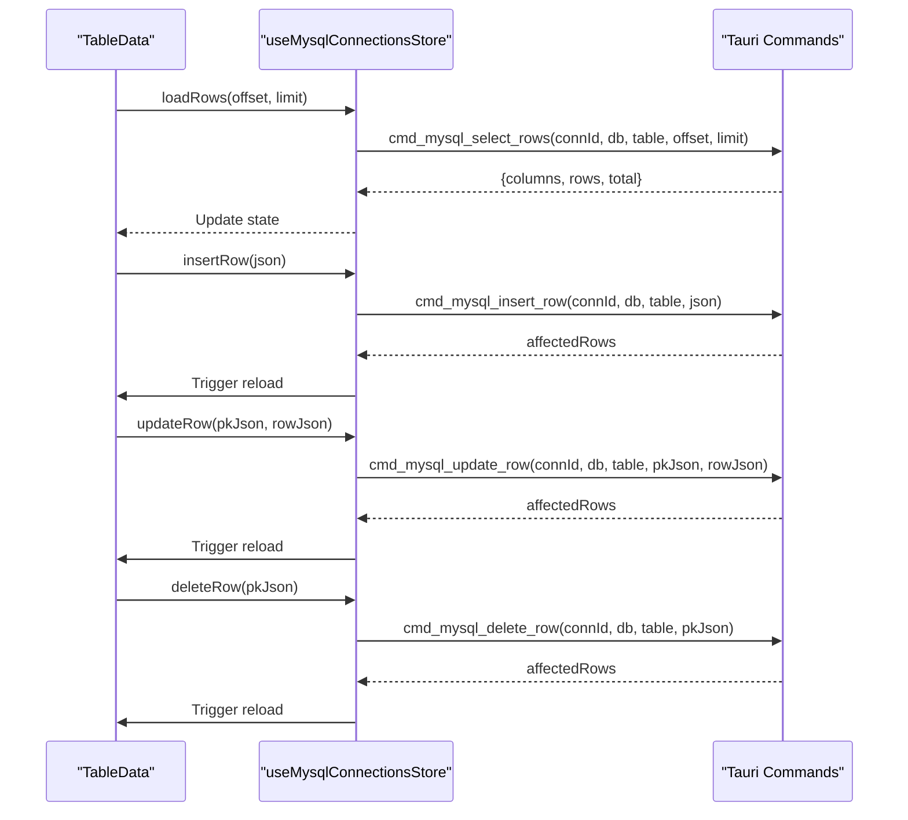
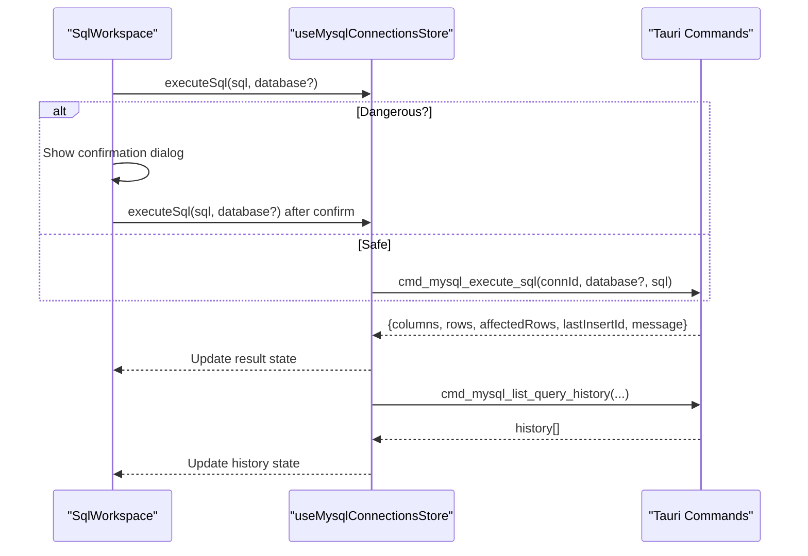
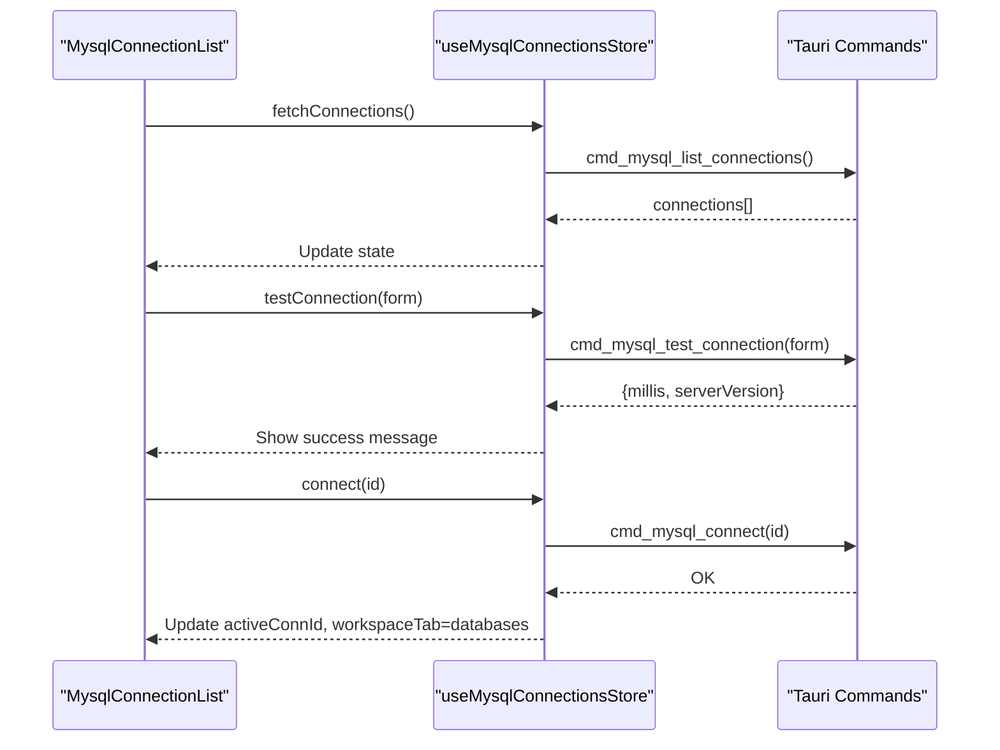
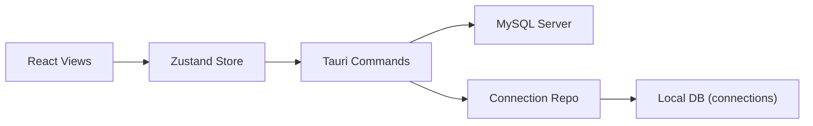

# Database Browser

<cite>
**Referenced Files in This Document**
- [DatabaseBrowser.tsx](file://src/plugins/mysql-client/views/DatabaseBrowser.tsx)
- [IndexManager.tsx](file://src/plugins/mysql-client/views/IndexManager.tsx)
- [TableData.tsx](file://src/plugins/mysql-client/views/TableData.tsx)
- [SqlWorkspace.tsx](file://src/plugins/mysql-client/views/SqlWorkspace.tsx)
- [ServerStatus.tsx](file://src/plugins/mysql-client/views/ServerStatus.tsx)
- [MysqlConnectionList.tsx](file://src/plugins/mysql-client/views/MysqlConnectionList.tsx)
- [MysqlConnectionForm.tsx](file://src/plugins/mysql-client/components/MysqlConnectionForm.tsx)
- [mysql-connections.ts](file://src/plugins/mysql-client/store/mysql-connections.ts)
- [types.ts](file://src/plugins/mysql-client/types.ts)
- [index.tsx](file://src/plugins/mysql-client/index.tsx)
- [commands.rs](file://src-tauri/src/plugins/mysql/commands.rs)
- [mysql_connection_repo.rs](file://src-tauri/src/db/mysql_connection_repo.rs)
- [builtin.ts](file://src/app/plugin-registry/builtin.ts)
</cite>

## Table of Contents
1. [Introduction](#introduction)
2. [Project Structure](#project-structure)
3. [Core Components](#core-components)
4. [Architecture Overview](#architecture-overview)
5. [Detailed Component Analysis](#detailed-component-analysis)
6. [Dependency Analysis](#dependency-analysis)
7. [Performance Considerations](#performance-considerations)
8. [Troubleshooting Guide](#troubleshooting-guide)
9. [Conclusion](#conclusion)
10. [Appendices](#appendices)

## Introduction
This document describes the MySQL database browser interface, focusing on schema exploration, hierarchical navigation, index management, and metadata display. It explains how the frontend React components integrate with the Tauri/Rust backend to provide a seamless experience for browsing databases, tables, views, stored procedures, indexes, and foreign keys, and for performing index-related operations with safety checks and performance considerations.

## Project Structure
The MySQL client is implemented as a plugin within the application. The plugin exposes a segmented workspace with tabs for connections, databases, table data, SQL, indexes, import/export, and server status. The UI is composed of view components backed by a centralized Zustand store, which invokes Tauri commands implemented in Rust.

```mermaid
graph TB
subgraph "Plugin UI"
Root["MysqlClientRoot<br/>index.tsx"]
ConnList["MysqlConnectionList<br/>MysqlConnectionList.tsx"]
DBBrowser["DatabaseBrowser<br/>DatabaseBrowser.tsx"]
TableData["TableData<br/>TableData.tsx"]
SqlWork["SqlWorkspace<br/>SqlWorkspace.tsx"]
IdxMgr["IndexManager<br/>IndexManager.tsx"]
Server["ServerStatus<br/>ServerStatus.tsx"]
end
subgraph "Store"
Store["useMysqlConnectionsStore<br/>mysql-connections.ts"]
end
subgraph "Backend (Tauri)"
Cmds["MySQL Commands<br/>commands.rs"]
Repo["Connection Repo<br/>mysql_connection_repo.rs"]
end
Root --> ConnList
Root --> DBBrowser
Root --> TableData
Root --> SqlWork
Root --> IdxMgr
Root --> Server
DBBrowser --> Store
TableData --> Store
SqlWork --> Store
IdxMgr --> Store
Server --> Store
Store --> Cmds
Cmds --> Repo
```

**Diagram sources**
- [index.tsx:14-37](file://src/plugins/mysql-client/index.tsx#L14-L37)
- [DatabaseBrowser.tsx:4-12](file://src/plugins/mysql-client/views/DatabaseBrowser.tsx#L4-L12)
- [TableData.tsx:5-21](file://src/plugins/mysql-client/views/TableData.tsx#L5-L21)
- [SqlWorkspace.tsx:11-25](file://src/plugins/mysql-client/views/SqlWorkspace.tsx#L11-L25)
- [IndexManager.tsx:5-14](file://src/plugins/mysql-client/views/IndexManager.tsx#L5-L14)
- [ServerStatus.tsx:5-14](file://src/plugins/mysql-client/views/ServerStatus.tsx#L5-L14)
- [mysql-connections.ts:77-152](file://src/plugins/mysql-client/store/mysql-connections.ts#L77-L152)
- [commands.rs:176-614](file://src-tauri/src/plugins/mysql/commands.rs#L176-L614)
- [mysql_connection_repo.rs:69-208](file://src-tauri/src/db/mysql_connection_repo.rs#L69-L208)

**Section sources**
- [index.tsx:14-37](file://src/plugins/mysql-client/index.tsx#L14-L37)
- [builtin.ts:14-29](file://src/app/plugin-registry/builtin.ts#L14-L29)

## Core Components
- DatabaseBrowser: Presents a three-column layout for browsing databases, tables, and table summary (including column definitions and basic stats).
- IndexManager: Lists existing indexes, supports creating new indexes, and dropping indexes with safeguards.
- TableData: Displays table rows with pagination, JSON editor for inserts/updates, and actions gated by primary key presence.
- SqlWorkspace: Executes SQL statements with safety checks for destructive operations and maintains a history drawer.
- ServerStatus: Shows server version and selected global status metrics.
- Connection Management: MysqlConnectionList and MysqlConnectionForm handle connection CRUD, grouping, and testing.

**Section sources**
- [DatabaseBrowser.tsx:4-12](file://src/plugins/mysql-client/views/DatabaseBrowser.tsx#L4-L12)
- [IndexManager.tsx:5-14](file://src/plugins/mysql-client/views/IndexManager.tsx#L5-L14)
- [TableData.tsx:5-21](file://src/plugins/mysql-client/views/TableData.tsx#L5-L21)
- [SqlWorkspace.tsx:11-25](file://src/plugins/mysql-client/views/SqlWorkspace.tsx#L11-L25)
- [ServerStatus.tsx:5-14](file://src/plugins/mysql-client/views/ServerStatus.tsx#L5-L14)
- [MysqlConnectionList.tsx:8-32](file://src/plugins/mysql-client/views/MysqlConnectionList.tsx#L8-L32)
- [MysqlConnectionForm.tsx:9-44](file://src/plugins/mysql-client/components/MysqlConnectionForm.tsx#L9-L44)

## Architecture Overview
The UI components dispatch actions via the store, which invokes Tauri commands. The Rust backend executes MySQL queries against the target server and returns typed results to the frontend.



**Diagram sources**
- [mysql-connections.ts:118-124](file://src/plugins/mysql-client/store/mysql-connections.ts#L118-L124)
- [commands.rs:217-230](file://src-tauri/src/plugins/mysql/commands.rs#L217-L230)

## Detailed Component Analysis

### Database Browser
- Purpose: Explore databases, tables, and table metadata.
- Behavior:
  - Left panel: Databases list with refresh and selection.
  - Middle panel: Tables list under the selected database with type hints.
  - Right panel: Table summary including row counts, sizes, engine, collation, and a column table.
- Navigation flow:
  - Click a database to populate tables.
  - Click a table to load column definitions and table status, and switch to the Table Data tab.



**Diagram sources**
- [DatabaseBrowser.tsx:4-12](file://src/plugins/mysql-client/views/DatabaseBrowser.tsx#L4-L12)
- [mysql-connections.ts:118-133](file://src/plugins/mysql-client/store/mysql-connections.ts#L118-L133)
- [commands.rs:233-294](file://src-tauri/src/plugins/mysql/commands.rs#L233-L294)

**Section sources**
- [DatabaseBrowser.tsx:4-12](file://src/plugins/mysql-client/views/DatabaseBrowser.tsx#L4-L12)
- [mysql-connections.ts:118-133](file://src/plugins/mysql-client/store/mysql-connections.ts#L118-L133)
- [types.ts:30-36](file://src/plugins/mysql-client/types.ts#L30-L36)

### Index Manager
- Purpose: Manage indexes for a selected table.
- Features:
  - Refresh indexes for the active table.
  - Create new indexes with name, columns, and uniqueness.
  - Drop indexes with confirmation; primary key drops are blocked.
- UX:
  - Modal form validates inputs and triggers creation.
  - Table displays index name, columns, uniqueness, type, and cardinality.



**Diagram sources**
- [IndexManager.tsx:5-14](file://src/plugins/mysql-client/views/IndexManager.tsx#L5-L14)
- [mysql-connections.ts:144-146](file://src/plugins/mysql-client/store/mysql-connections.ts#L144-L146)
- [commands.rs:447-501](file://src-tauri/src/plugins/mysql/commands.rs#L447-L501)

**Section sources**
- [IndexManager.tsx:5-14](file://src/plugins/mysql-client/views/IndexManager.tsx#L5-L14)
- [mysql-connections.ts:144-146](file://src/plugins/mysql-client/store/mysql-connections.ts#L144-L146)
- [types.ts:36](file://src/plugins/mysql-client/types.ts#L36)
- [commands.rs:447-501](file://src-tauri/src/plugins/mysql/commands.rs#L447-L501)

### Table Data Viewer
- Purpose: Browse and edit table rows.
- Features:
  - Pagination with configurable page size.
  - JSON editor for inserting or updating rows.
  - Actions disabled if no primary key exists.
  - Delete confirmed via popconfirm.



**Diagram sources**
- [TableData.tsx:5-21](file://src/plugins/mysql-client/views/TableData.tsx#L5-L21)
- [mysql-connections.ts:134-141](file://src/plugins/mysql-client/store/mysql-connections.ts#L134-L141)
- [commands.rs:297-385](file://src-tauri/src/plugins/mysql/commands.rs#L297-L385)

**Section sources**
- [TableData.tsx:5-21](file://src/plugins/mysql-client/views/TableData.tsx#L5-L21)
- [mysql-connections.ts:134-141](file://src/plugins/mysql-client/store/mysql-connections.ts#L134-L141)
- [types.ts:34-35](file://src/plugins/mysql-client/types.ts#L34-L35)

### SQL Workspace
- Purpose: Run ad-hoc SQL with safety checks and history.
- Safety:
  - Detects potentially dangerous statements (drop/truncate/alter without conditions, unsafe delete/update).
  - Prompts confirmation before executing.
- History:
  - Maintains a drawer of recent queries with database context and timestamps.



**Diagram sources**
- [SqlWorkspace.tsx:11-25](file://src/plugins/mysql-client/views/SqlWorkspace.tsx#L11-L25)
- [mysql-connections.ts:142-143](file://src/plugins/mysql-client/store/mysql-connections.ts#L142-L143)
- [commands.rs:387-444](file://src-tauri/src/plugins/mysql/commands.rs#L387-L444)

**Section sources**
- [SqlWorkspace.tsx:11-25](file://src/plugins/mysql-client/views/SqlWorkspace.tsx#L11-L25)
- [mysql-connections.ts:142-143](file://src/plugins/mysql-client/store/mysql-connections.ts#L142-L143)

### Server Status
- Purpose: Display server version and selected global status metrics.
- Behavior:
  - Loads status when an active connection exists.
  - Renders metrics in a compact table.

**Section sources**
- [ServerStatus.tsx:5-14](file://src/plugins/mysql-client/views/ServerStatus.tsx#L5-L14)
- [mysql-connections.ts:151](file://src/plugins/mysql-client/store/mysql-connections.ts#L151)
- [commands.rs:603-614](file://src-tauri/src/plugins/mysql/commands.rs#L603-L614)

### Connection Management
- Purpose: Manage MySQL connections (list, create/edit, test, connect/disconnect, delete).
- Features:
  - Group connections by group name.
  - Search by name or host.
  - Test latency and server version.
  - Connect/disconnect lifecycle updates active state and workspace tab.



**Diagram sources**
- [MysqlConnectionList.tsx:8-32](file://src/plugins/mysql-client/views/MysqlConnectionList.tsx#L8-L32)
- [mysql-connections.ts:94-113](file://src/plugins/mysql-client/store/mysql-connections.ts#L94-L113)
- [commands.rs:177-209](file://src-tauri/src/plugins/mysql/commands.rs#L177-L209)

**Section sources**
- [MysqlConnectionList.tsx:8-32](file://src/plugins/mysql-client/views/MysqlConnectionList.tsx#L8-L32)
- [MysqlConnectionForm.tsx:9-44](file://src/plugins/mysql-client/components/MysqlConnectionForm.tsx#L9-L44)
- [mysql-connections.ts:94-113](file://src/plugins/mysql-client/store/mysql-connections.ts#L94-L113)
- [commands.rs:177-209](file://src-tauri/src/plugins/mysql/commands.rs#L177-L209)

## Dependency Analysis
- Frontend store orchestrates all UI actions and delegates to Tauri commands.
- Backend commands encapsulate MySQL operations and return strongly typed results.
- Connection secrets are persisted and decrypted securely by the repository layer.



**Diagram sources**
- [mysql-connections.ts:77-152](file://src/plugins/mysql-client/store/mysql-connections.ts#L77-L152)
- [commands.rs:176-614](file://src-tauri/src/plugins/mysql/commands.rs#L176-L614)
- [mysql_connection_repo.rs:69-208](file://src-tauri/src/db/mysql_connection_repo.rs#L69-L208)

**Section sources**
- [mysql-connections.ts:77-152](file://src/plugins/mysql-client/store/mysql-connections.ts#L77-L152)
- [commands.rs:176-614](file://src-tauri/src/plugins/mysql/commands.rs#L176-L614)
- [mysql_connection_repo.rs:69-208](file://src-tauri/src/db/mysql_connection_repo.rs#L69-L208)

## Performance Considerations
- Pagination: TableData limits rows per page and uses OFFSET/LIMIT to avoid heavy loads.
- Metadata queries: DatabaseBrowser and IndexManager rely on INFORMATION_SCHEMA; ensure appropriate privileges and indexes on schema tables.
- Export: Export functionality reads up to a bounded number of rows to a file; consider server-side exports for very large datasets.
- Safety checks: SQL execution prevents destructive statements without explicit conditions; use explain plans in SQL Workspace for query analysis.

[No sources needed since this section provides general guidance]

## Troubleshooting Guide
- No active connection:
  - Many views show an empty state prompting to connect first. Use the Connections tab to establish a connection.
- Schema exploration fails:
  - Verify permissions to INFORMATION_SCHEMA and that the selected database exists.
- Index operations fail:
  - Dropping PRIMARY index is intentionally blocked; ensure index name is correct and not a primary key.
- Unsafe SQL warnings:
  - Confirm destructive statements or add WHERE clauses to avoid accidental data loss.
- Connection latency:
  - Use the Test Connection feature to measure latency and verify server availability.

**Section sources**
- [DatabaseBrowser.tsx:6](file://src/plugins/mysql-client/views/DatabaseBrowser.tsx#L6)
- [IndexManager.tsx:11](file://src/plugins/mysql-client/views/IndexManager.tsx#L11)
- [SqlWorkspace.tsx:6-9](file://src/plugins/mysql-client/views/SqlWorkspace.tsx#L6-L9)
- [commands.rs:494-496](file://src-tauri/src/plugins/mysql/commands.rs#L494-L496)

## Conclusion
The MySQL database browser provides a structured, safe, and efficient way to explore schemas, manage indexes, inspect table metadata, and execute SQL. Its layered architecture ensures clear separation between UI, state management, and backend operations, while built-in safety checks protect against common pitfalls during schema exploration and maintenance.

[No sources needed since this section summarizes without analyzing specific files]

## Appendices

### Practical Examples

- Browsing schema
  - Steps: Open Connections tab, connect to a MySQL instance, switch to Databases tab, select a database, choose a table, and review the Table Summary and Column definitions.
  - Related actions: listDatabases, listTables, describeTable, getTableStatus.

- Analyzing table structure
  - Steps: After selecting a table, examine the Engine, Collation, Row counts, and Data/Index sizes in the Table Summary card, and review the Column table for types and nullability.
  - Related actions: describeTable, getTableStatus.

- Managing indexes for performance
  - Steps: Open the Indexes tab, create a new index specifying name, columns, and uniqueness, then verify cardinality and type in the index list; drop unnecessary indexes after confirming impact.
  - Related actions: listIndexes, createIndex, dropIndex.

- Understanding relationships
  - Notes: The current implementation focuses on indexes and columns. Foreign key relationships are not directly exposed in the UI; consider using SQL queries or external tools for relationship analysis.

- Filtering and search
  - Notes: Connections support search by name or host; schema exploration relies on clicking through databases and tables. There is no global search across schema objects in the current UI.

**Section sources**
- [DatabaseBrowser.tsx:4-12](file://src/plugins/mysql-client/views/DatabaseBrowser.tsx#L4-L12)
- [IndexManager.tsx:5-14](file://src/plugins/mysql-client/views/IndexManager.tsx#L5-L14)
- [TableData.tsx:5-21](file://src/plugins/mysql-client/views/TableData.tsx#L5-L21)
- [MysqlConnectionList.tsx:14-17](file://src/plugins/mysql-client/views/MysqlConnectionList.tsx#L14-L17)