# MySQL Client

<cite>
**Referenced Files in This Document**
- [index.tsx](file://src/plugins/mysql-client/index.tsx)
- [types.ts](file://src/plugins/mysql-client/types.ts)
- [mysql-connections.ts](file://src/plugins/mysql-client/store/mysql-connections.ts)
- [MysqlConnectionForm.tsx](file://src/plugins/mysql-client/components/MysqlConnectionForm.tsx)
- [DatabaseBrowser.tsx](file://src/plugins/mysql-client/views/DatabaseBrowser.tsx)
- [TableData.tsx](file://src/plugins/mysql-client/views/TableData.tsx)
- [SqlWorkspace.tsx](file://src/plugins/mysql-client/views/SqlWorkspace.tsx)
- [ImportExport.tsx](file://src/plugins/mysql-client/views/ImportExport.tsx)
- [IndexManager.tsx](file://src/plugins/mysql-client/views/IndexManager.tsx)
- [ServerStatus.tsx](file://src/plugins/mysql-client/views/ServerStatus.tsx)
- [mod.rs](file://src-tauri/src/plugins/mysql/mod.rs)
- [client_pool.rs](file://src-tauri/src/plugins/mysql/client_pool.rs)
- [commands.rs](file://src-tauri/src/plugins/mysql/commands.rs)
- [types.rs](file://src-tauri/src/plugins/mysql/types.rs)
- [mysql_connection_repo.rs](file://src-tauri/src/db/mysql_connection_repo.rs)
</cite>

## Table of Contents
1. [Introduction](#introduction)
2. [Project Structure](#project-structure)
3. [Core Components](#core-components)
4. [Architecture Overview](#architecture-overview)
5. [Detailed Component Analysis](#detailed-component-analysis)
6. [Dependency Analysis](#dependency-analysis)
7. [Performance Considerations](#performance-considerations)
8. [Troubleshooting Guide](#troubleshooting-guide)
9. [Conclusion](#conclusion)
10. [Appendices](#appendices)

## Introduction
This document describes the MySQL client plugin for RDMM, focusing on connection management, authentication, connection pooling, and the integrated UI for browsing schemas, executing SQL, managing indexes, importing/exporting data, and monitoring server status. It also covers integration with RDMM’s plugin architecture and state management patterns, along with practical examples and best practices for secure and efficient MySQL administration.

## Project Structure
The MySQL client plugin is organized into frontend React components and a backend Tauri plugin with Rust implementation. The frontend uses Ant Design components and Zustand for state management, while the backend manages persistent connections via a process-wide connection pool and exposes Tauri commands for UI actions.

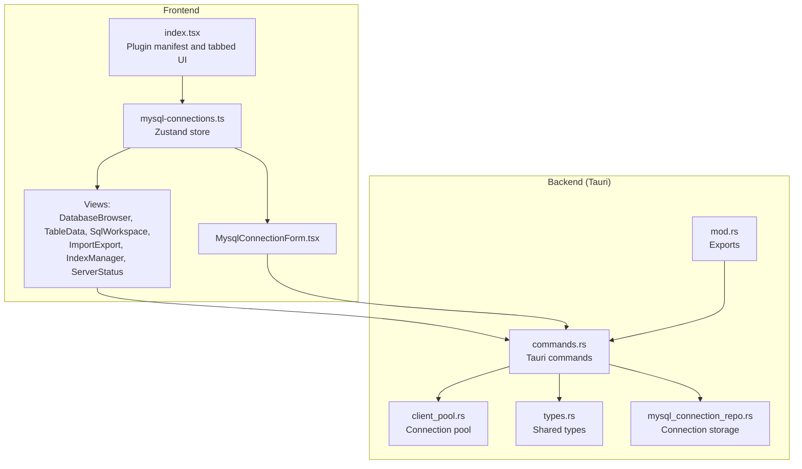

**Diagram sources**
- [index.tsx:1-38](file://src/plugins/mysql-client/index.tsx#L1-L38)
- [mysql-connections.ts:1-153](file://src/plugins/mysql-client/store/mysql-connections.ts#L1-L153)
- [DatabaseBrowser.tsx:1-13](file://src/plugins/mysql-client/views/DatabaseBrowser.tsx#L1-L13)
- [TableData.tsx:1-22](file://src/plugins/mysql-client/views/TableData.tsx#L1-L22)
- [SqlWorkspace.tsx:1-27](file://src/plugins/mysql-client/views/SqlWorkspace.tsx#L1-L27)
- [ImportExport.tsx:1-19](file://src/plugins/mysql-client/views/ImportExport.tsx#L1-L19)
- [IndexManager.tsx:1-15](file://src/plugins/mysql-client/views/IndexManager.tsx#L1-L15)
- [ServerStatus.tsx:1-15](file://src/plugins/mysql-client/views/ServerStatus.tsx#L1-L15)
- [mod.rs:1-4](file://src-tauri/src/plugins/mysql/mod.rs#L1-L4)
- [commands.rs:1-615](file://src-tauri/src/plugins/mysql/commands.rs#L1-L615)
- [client_pool.rs:1-65](file://src-tauri/src/plugins/mysql/client_pool.rs#L1-L65)
- [types.rs:1-97](file://src-tauri/src/plugins/mysql/types.rs#L1-L97)
- [mysql_connection_repo.rs:1-209](file://src-tauri/src/db/mysql_connection_repo.rs#L1-L209)

**Section sources**
- [index.tsx:1-38](file://src/plugins/mysql-client/index.tsx#L1-L38)
- [mysql-connections.ts:1-153](file://src/plugins/mysql-client/store/mysql-connections.ts#L1-L153)

## Core Components
- Plugin manifest and routing: Defines the plugin identity, icon, and tabbed workspace that switches between connections, databases, table data, SQL editor, indexes, import/export, and server status.
- Store: Centralized state for active connection, selected database/table, lists of databases/tables/columns/status, rows, indexes, history, and server status. Exposes async actions that invoke Tauri commands.
- Views: Specialized UI panels for browsing, editing, querying, importing/exporting, and monitoring.
- Backend commands: Implements all database operations (connect, list databases/tables, describe, select rows, DDL/DML, index management, import/export, server status) using a pooled MySQL connection.

**Section sources**
- [index.tsx:14-37](file://src/plugins/mysql-client/index.tsx#L14-L37)
- [mysql-connections.ts:22-62](file://src/plugins/mysql-client/store/mysql-connections.ts#L22-L62)
- [types.ts:1-40](file://src/plugins/mysql-client/types.ts#L1-L40)

## Architecture Overview
The plugin follows a layered architecture:
- Frontend UI renders tabs and invokes store actions.
- Store actions call Tauri commands via invoke.
- Backend commands resolve a pooled connection and execute SQL against MySQL.
- Results are serialized and returned to the frontend for rendering.

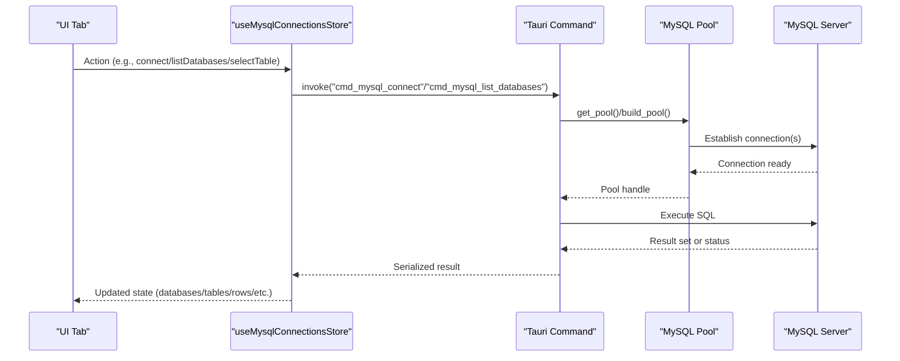

**Diagram sources**
- [mysql-connections.ts:94-113](file://src/plugins/mysql-client/store/mysql-connections.ts#L94-L113)
- [commands.rs:202-214](file://src-tauri/src/plugins/mysql/commands.rs#L202-L214)
- [client_pool.rs:32-48](file://src-tauri/src/plugins/mysql/client_pool.rs#L32-L48)

## Detailed Component Analysis

### Connection Management and Authentication
- Connection lifecycle:
  - Save/edit connection details via a form with host, port, username, optional password, default database, charset, SSL mode, and timeout.
  - Test connection by building a temporary pool and pinging the server.
  - Connect persists a pool keyed by connection ID; disconnect removes the pool.
- Secrets handling:
  - Passwords are stored encrypted in the local SQLite database and decrypted on-demand for connection attempts.
- Active selection:
  - The store tracks active connection ID, active database, and active table to scope subsequent operations.

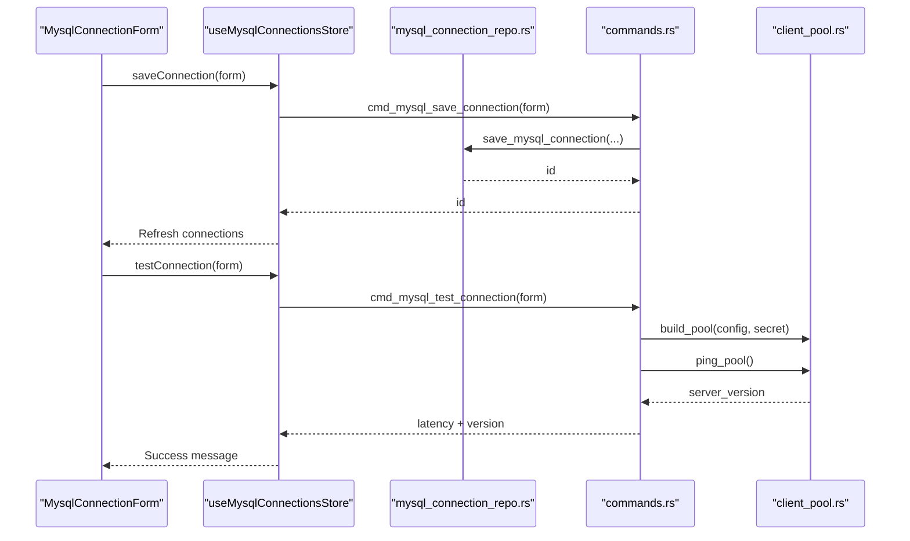

**Diagram sources**
- [MysqlConnectionForm.tsx:9-44](file://src/plugins/mysql-client/components/MysqlConnectionForm.tsx#L9-L44)
- [mysql-connections.ts:99-108](file://src/plugins/mysql-client/store/mysql-connections.ts#L99-L108)
- [mysql_connection_repo.rs:108-176](file://src-tauri/src/db/mysql_connection_repo.rs#L108-L176)
- [commands.rs:192-199](file://src-tauri/src/plugins/mysql/commands.rs#L192-L199)
- [client_pool.rs:12-30](file://src-tauri/src/plugins/mysql/client_pool.rs#L12-L30)

**Section sources**
- [MysqlConnectionForm.tsx:9-44](file://src/plugins/mysql-client/components/MysqlConnectionForm.tsx#L9-L44)
- [mysql-connections.ts:94-117](file://src/plugins/mysql-client/store/mysql-connections.ts#L94-L117)
- [mysql_connection_repo.rs:108-176](file://src-tauri/src/db/mysql_connection_repo.rs#L108-L176)
- [commands.rs:192-214](file://src-tauri/src/plugins/mysql/commands.rs#L192-L214)

### Connection Pooling Strategies
- Process-wide pool keyed by connection ID.
- Build pool with host/port/user/password/default database, charset initialization, and SSL mode.
- Get a connection from the pool for each operation; return it implicitly via short-lived handles.
- Disconnect removes the pool and closes connections.

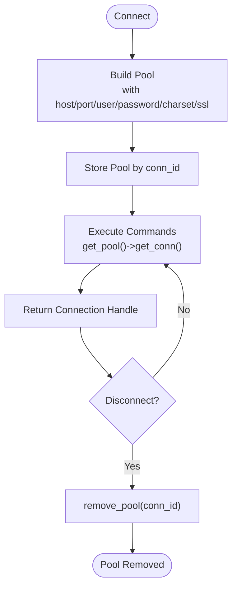

**Diagram sources**
- [client_pool.rs:12-48](file://src-tauri/src/plugins/mysql/client_pool.rs#L12-L48)
- [commands.rs:202-214](file://src-tauri/src/plugins/mysql/commands.rs#L202-L214)

**Section sources**
- [client_pool.rs:12-65](file://src-tauri/src/plugins/mysql/client_pool.rs#L12-L65)
- [commands.rs:202-214](file://src-tauri/src/plugins/mysql/commands.rs#L202-L214)

### Database Browser: Schema Exploration
- Lists databases for the active connection (excluding system schemas).
- Lists tables per selected database.
- Shows table summary (engine, rows, data/index lengths, collation) and column metadata.
- Selecting a table loads columns and a paginated row preview.

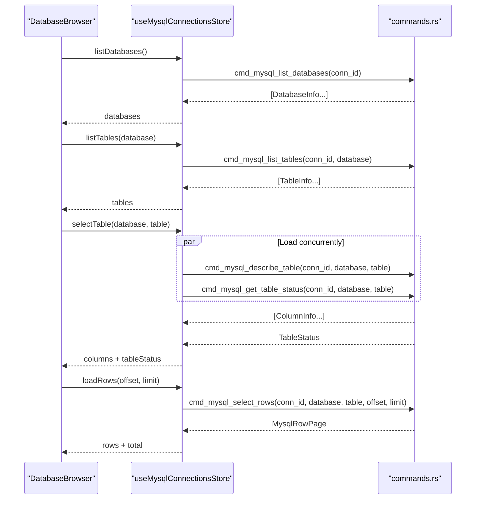

**Diagram sources**
- [DatabaseBrowser.tsx:4-12](file://src/plugins/mysql-client/views/DatabaseBrowser.tsx#L4-L12)
- [mysql-connections.ts:118-133](file://src/plugins/mysql-client/store/mysql-connections.ts#L118-L133)
- [commands.rs:217-294](file://src-tauri/src/plugins/mysql/commands.rs#L217-L294)

**Section sources**
- [DatabaseBrowser.tsx:4-12](file://src/plugins/mysql-client/views/DatabaseBrowser.tsx#L4-L12)
- [mysql-connections.ts:118-133](file://src/plugins/mysql-client/store/mysql-connections.ts#L118-L133)
- [commands.rs:217-294](file://src-tauri/src/plugins/mysql/commands.rs#L217-L294)

### SQL Workspace: Query Execution
- Executes arbitrary SQL; distinguishes queries vs. statements.
- Shows results in a table or JSON view; displays affected rows and last insert ID.
- Prevents destructive operations without confirmation.
- Maintains a recent history list persisted locally.

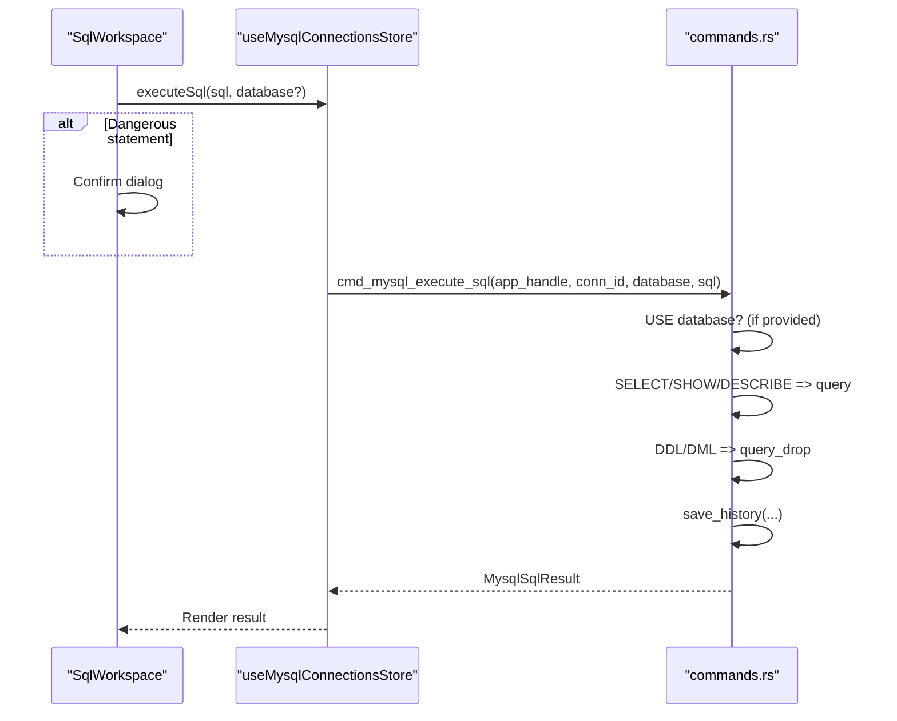

**Diagram sources**
- [SqlWorkspace.tsx:11-25](file://src/plugins/mysql-client/views/SqlWorkspace.tsx#L11-L25)
- [mysql-connections.ts:142](file://src/plugins/mysql-client/store/mysql-connections.ts#L142)
- [commands.rs:387-415](file://src-tauri/src/plugins/mysql/commands.rs#L387-L415)
- [commands.rs:157-174](file://src-tauri/src/plugins/mysql/commands.rs#L157-L174)

**Section sources**
- [SqlWorkspace.tsx:11-25](file://src/plugins/mysql-client/views/SqlWorkspace.tsx#L11-L25)
- [mysql-connections.ts:142](file://src/plugins/mysql-client/store/mysql-connections.ts#L142)
- [commands.rs:387-415](file://src-tauri/src/plugins/mysql/commands.rs#L387-L415)

### Table Data Viewer: Browse and Edit Records
- Loads paginated rows with total count.
- Requires a primary key to enable insert/update/delete.
- Provides JSON editor for row payloads; inserts/updates/deletes use prepared identifiers and safe quoting.

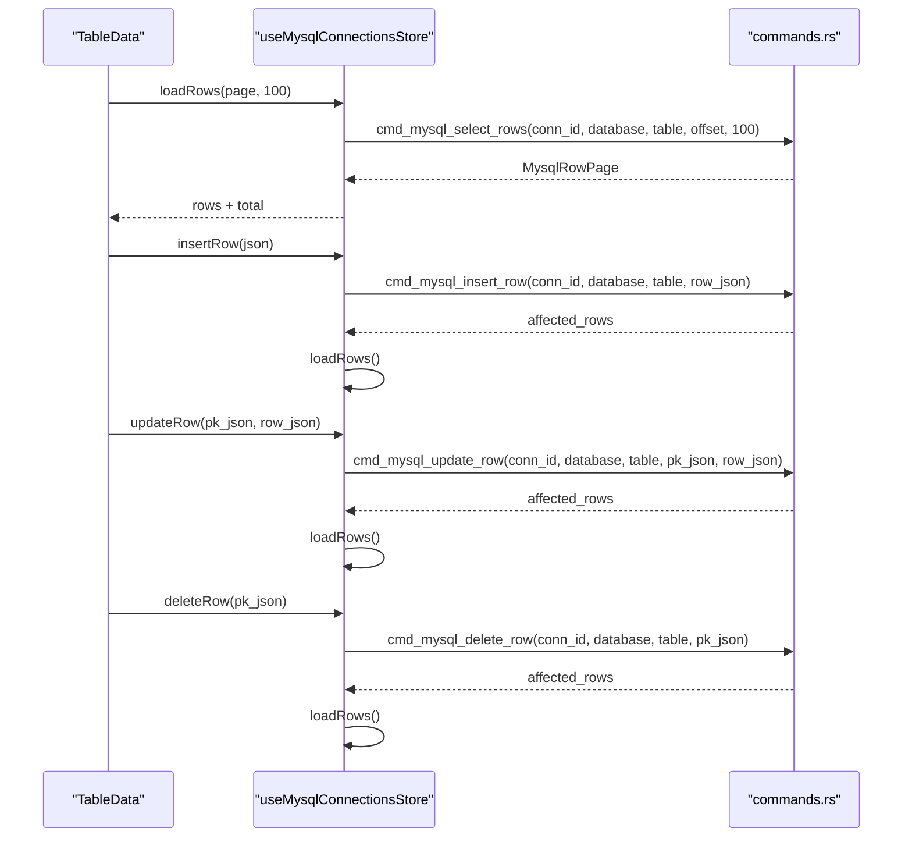

**Diagram sources**
- [TableData.tsx:5-21](file://src/plugins/mysql-client/views/TableData.tsx#L5-L21)
- [mysql-connections.ts:134-141](file://src/plugins/mysql-client/store/mysql-connections.ts#L134-L141)
- [commands.rs:296-385](file://src-tauri/src/plugins/mysql/commands.rs#L296-L385)

**Section sources**
- [TableData.tsx:5-21](file://src/plugins/mysql-client/views/TableData.tsx#L5-L21)
- [mysql-connections.ts:134-141](file://src/plugins/mysql-client/store/mysql-connections.ts#L134-L141)
- [commands.rs:296-385](file://src-tauri/src/plugins/mysql/commands.rs#L296-L385)

### Index Manager: DDL for Indexes
- Lists existing indexes with columns, uniqueness, type, and cardinality.
- Creates new indexes (unique or not) with comma-separated columns.
- Drops non-primary indexes after confirmation.

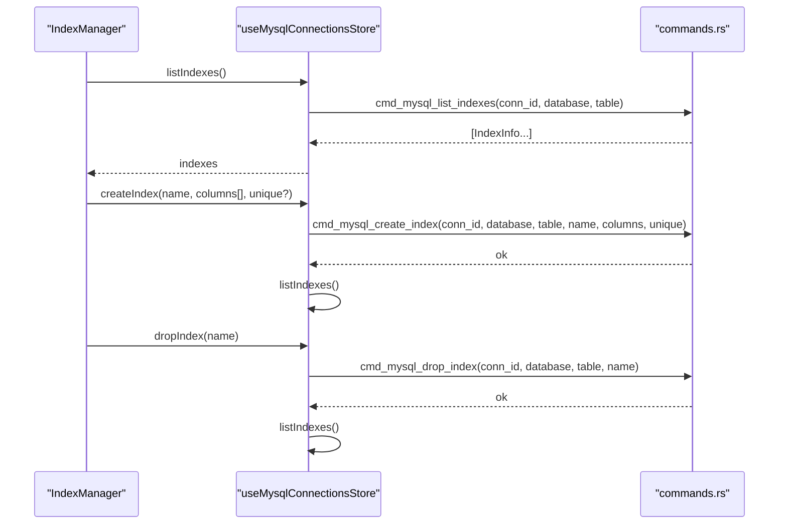

**Diagram sources**
- [IndexManager.tsx:5-14](file://src/plugins/mysql-client/views/IndexManager.tsx#L5-L14)
- [mysql-connections.ts:144-146](file://src/plugins/mysql-client/store/mysql-connections.ts#L144-L146)
- [commands.rs:446-501](file://src-tauri/src/plugins/mysql/commands.rs#L446-L501)

**Section sources**
- [IndexManager.tsx:5-14](file://src/plugins/mysql-client/views/IndexManager.tsx#L5-L14)
- [mysql-connections.ts:144-146](file://src/plugins/mysql-client/store/mysql-connections.ts#L144-L146)
- [commands.rs:446-501](file://src-tauri/src/plugins/mysql/commands.rs#L446-L501)

### Import/Export Tools: Data Migration
- Export rows to JSON or CSV from the current table.
- Import rows from JSON or CSV files; supports insert-only or replace-into modes.
- Preview import rows before applying.

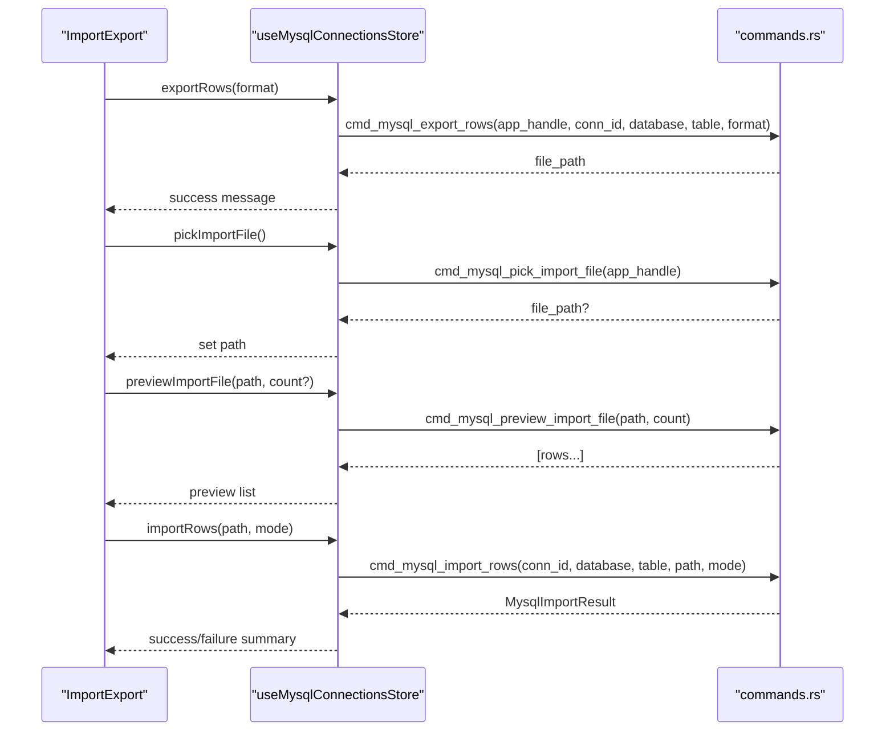

**Diagram sources**
- [ImportExport.tsx:5-18](file://src/plugins/mysql-client/views/ImportExport.tsx#L5-L18)
- [mysql-connections.ts:147-150](file://src/plugins/mysql-client/store/mysql-connections.ts#L147-L150)
- [commands.rs:503-601](file://src-tauri/src/plugins/mysql/commands.rs#L503-L601)

**Section sources**
- [ImportExport.tsx:5-18](file://src/plugins/mysql-client/views/ImportExport.tsx#L5-L18)
- [mysql-connections.ts:147-150](file://src/plugins/mysql-client/store/mysql-connections.ts#L147-L150)
- [commands.rs:503-601](file://src-tauri/src/plugins/mysql/commands.rs#L503-L601)

### Server Status Monitoring
- Loads MySQL server version and selected global status metrics on demand.

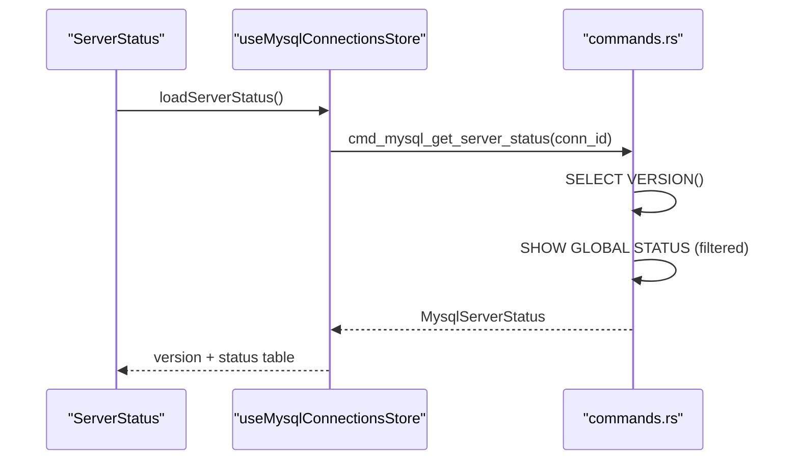

**Diagram sources**
- [ServerStatus.tsx:5-14](file://src/plugins/mysql-client/views/ServerStatus.tsx#L5-L14)
- [mysql-connections.ts:151](file://src/plugins/mysql-client/store/mysql-connections.ts#L151)
- [commands.rs:603-614](file://src-tauri/src/plugins/mysql/commands.rs#L603-L614)

**Section sources**
- [ServerStatus.tsx:5-14](file://src/plugins/mysql-client/views/ServerStatus.tsx#L5-L14)
- [mysql-connections.ts:151](file://src/plugins/mysql-client/store/mysql-connections.ts#L151)
- [commands.rs:603-614](file://src-tauri/src/plugins/mysql/commands.rs#L603-L614)

## Dependency Analysis
- Frontend depends on Ant Design and Zustand; UI components depend on the store for actions and state.
- Store actions depend on Tauri invoke to call backend commands.
- Backend commands depend on:
  - Connection pool for MySQL connectivity.
  - Local SQLite for storing connection metadata and secrets.
  - Shared types for serialization/deserialization.

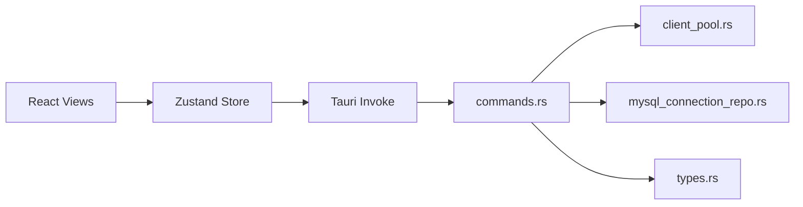

**Diagram sources**
- [mysql-connections.ts:1-2](file://src/plugins/mysql-client/store/mysql-connections.ts#L1-L2)
- [commands.rs:1-16](file://src-tauri/src/plugins/mysql/commands.rs#L1-L16)
- [client_pool.rs:1-9](file://src-tauri/src/plugins/mysql/client_pool.rs#L1-L9)
- [mysql_connection_repo.rs:1-43](file://src-tauri/src/db/mysql_connection_repo.rs#L1-L43)
- [types.rs:1-97](file://src-tauri/src/plugins/mysql/types.rs#L1-L97)

**Section sources**
- [mysql-connections.ts:1-2](file://src/plugins/mysql-client/store/mysql-connections.ts#L1-L2)
- [commands.rs:1-16](file://src-tauri/src/plugins/mysql/commands.rs#L1-L16)

## Performance Considerations
- Pagination: Row loading limits rows per page and uses explicit offsets to avoid large result sets.
- Connection reuse: Pooled connections minimize handshake overhead.
- Charset initialization: Sets appropriate character set at pool creation to reduce conversion costs.
- Batch imports: Iterates rows sequentially; consider batching for very large datasets.
- Query classification: Distinguishes queries from statements to optimize execution paths.

[No sources needed since this section provides general guidance]

## Troubleshooting Guide
- Connection failures:
  - Verify host/port/credentials; use the test connection button to measure latency and check server version.
  - Ensure SSL mode compatibility and charset correctness.
- No primary key:
  - Editing operations are disabled when no primary key exists; add a primary key before enabling updates/deletes.
- Dangerous SQL:
  - The SQL workspace warns before running DROP/TRUNCATE/ALTER or DELETE/UPDATE without WHERE.
- Import issues:
  - Ensure JSON arrays or CSV headers match table columns; use preview to validate.
- Server status:
  - Confirm active connection and that the pool is established before requesting status.

**Section sources**
- [MysqlConnectionForm.tsx:40](file://src/plugins/mysql-client/components/MysqlConnectionForm.tsx#L40)
- [TableData.tsx:10-11](file://src/plugins/mysql-client/views/TableData.tsx#L10-L11)
- [SqlWorkspace.tsx:6-9](file://src/plugins/mysql-client/views/SqlWorkspace.tsx#L6-L9)
- [commands.rs:344-347](file://src-tauri/src/plugins/mysql/commands.rs#L344-L347)

## Conclusion
The MySQL client plugin integrates seamlessly with RDMM’s plugin architecture, offering a comprehensive toolkit for managing MySQL instances. It emphasizes secure credential handling, robust connection pooling, and a rich UI for schema exploration, data manipulation, DDL operations, and server monitoring. Following the best practices outlined here ensures reliable, secure, and efficient administration.

[No sources needed since this section summarizes without analyzing specific files]

## Appendices

### Practical Examples
- Connecting to a MySQL database:
  - Open the Connections tab, click New, fill in host/port/username/password, optionally set default database and SSL mode, then click Save and Test. Finally, Connect to establish the pool.
- Executing a SELECT query:
  - Switch to the SQL tab, write a SELECT statement, and click Run. View results in table or JSON format.
- Managing table structures:
  - Use the Indexes tab to create/drop indexes. Use the SQL tab for DDL statements like ALTER TABLE.
- Importing/exporting data:
  - Use the Import/Export tab to export current table rows to JSON/CSV or import rows from JSON/CSV files.
- Monitoring server status:
  - Open the Server tab to view MySQL version and selected global status metrics.

[No sources needed since this section provides general guidance]