# SQL Workspace

<cite>
**Referenced Files in This Document**
- [SqlWorkspace.tsx](file://src/plugins/mysql-client/views/SqlWorkspace.tsx)
- [mysql-connections.ts](file://src/plugins/mysql-client/store/mysql-connections.ts)
- [types.ts](file://src/plugins/mysql-client/types.ts)
- [index.tsx](file://src/plugins/mysql-client/index.tsx)
- [DatabaseBrowser.tsx](file://src/plugins/mysql-client/views/DatabaseBrowser.tsx)
- [TableData.tsx](file://src/plugins/mysql-client/views/TableData.tsx)
- [ImportExport.tsx](file://src/plugins/mysql-client/views/ImportExport.tsx)
- [MysqlConnectionForm.tsx](file://src/plugins/mysql-client/components/MysqlConnectionForm.tsx)
- [commands.rs](file://src-tauri/src/plugins/mysql/commands.rs)
- [mod.rs](file://src-tauri/src/plugins/mysql/mod.rs)
- [init.rs](file://src-tauri/src/db/init.rs)
</cite>

## Table of Contents
1. [Introduction](#introduction)
2. [Project Structure](#project-structure)
3. [Core Components](#core-components)
4. [Architecture Overview](#architecture-overview)
5. [Detailed Component Analysis](#detailed-component-analysis)
6. [Dependency Analysis](#dependency-analysis)
7. [Performance Considerations](#performance-considerations)
8. [Troubleshooting Guide](#troubleshooting-guide)
9. [Conclusion](#conclusion)
10. [Appendices](#appendices)

## Introduction
This document describes the MySQL SQL workspace interface, focusing on the SQL editor, execution environment, result visualization, and workspace organization. It also covers advanced SQL features currently supported (prepared statements via JSON-based APIs), transaction management boundaries, and integration with the MySQL client’s connection management system. Practical examples demonstrate writing complex queries, analyzing results, and managing database operations.

## Project Structure
The SQL workspace is part of the MySQL client plugin. The frontend is organized into views and a central store, while the backend exposes Tauri commands for database operations and persistence.

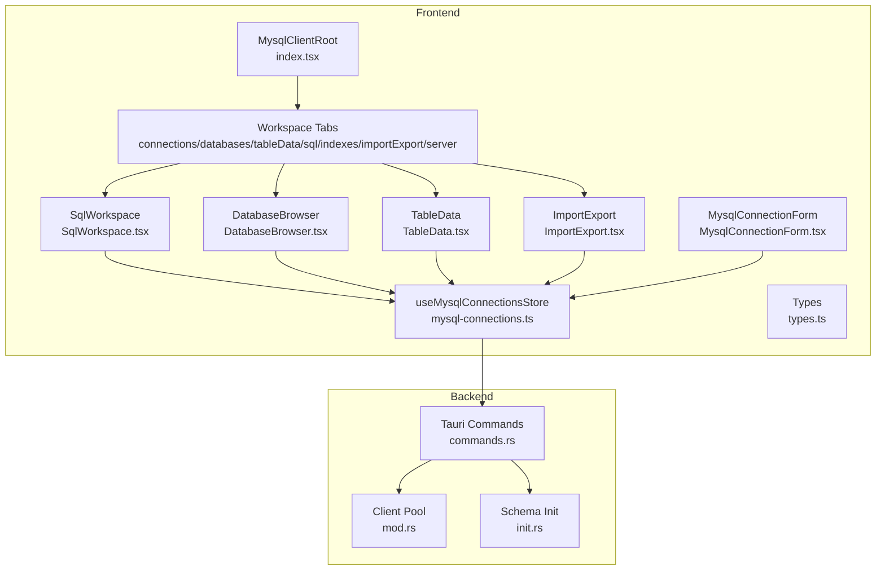

**Diagram sources**
- [index.tsx:14-35](file://src/plugins/mysql-client/index.tsx#L14-L35)
- [SqlWorkspace.tsx:11-25](file://src/plugins/mysql-client/views/SqlWorkspace.tsx#L11-L25)
- [mysql-connections.ts:77-152](file://src/plugins/mysql-client/store/mysql-connections.ts#L77-L152)
- [commands.rs:176-444](file://src-tauri/src/plugins/mysql/commands.rs#L176-L444)
- [mod.rs:1-4](file://src-tauri/src/plugins/mysql/mod.rs#L1-L4)
- [init.rs:144-153](file://src-tauri/src/db/init.rs#L144-L153)

**Section sources**
- [index.tsx:14-35](file://src/plugins/mysql-client/index.tsx#L14-L35)
- [SqlWorkspace.tsx:11-25](file://src/plugins/mysql-client/views/SqlWorkspace.tsx#L11-L25)
- [mysql-connections.ts:77-152](file://src/plugins/mysql-client/store/mysql-connections.ts#L77-L152)

## Core Components
- SQL Editor: Text area with monospace font for SQL input.
- Execution Engine: Executes SELECT/SHOW/DESCRIBE/EXPLAIN as queries and DML/DCL as statements; records history; warns on destructive operations.
- Results Viewer: Tabbed interface showing tabular data or raw JSON; displays affected rows and last insert ID.
- History Panel: Drawer listing recent queries per connection with re-run capability.
- Workspace Tabs: Organize multiple tasks: Connections, Databases, Table Data, SQL, Indexes, Import/Export, Server Status.

**Section sources**
- [SqlWorkspace.tsx:11-25](file://src/plugins/mysql-client/views/SqlWorkspace.tsx#L11-L25)
- [mysql-connections.ts:52-53](file://src/plugins/mysql-client/store/mysql-connections.ts#L52-L53)
- [types.ts:35-37](file://src/plugins/mysql-client/types.ts#L35-L37)
- [index.tsx:20-34](file://src/plugins/mysql-client/index.tsx#L20-L34)

## Architecture Overview
The SQL workspace integrates frontend state management with backend Tauri commands. The store encapsulates connection lifecycle, database/table navigation, and SQL execution. Backend commands handle connection pooling, query execution, and persistent history.

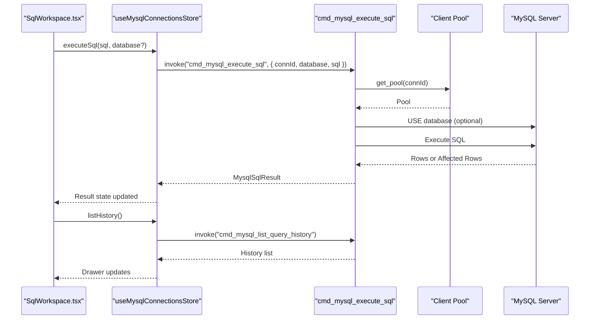

**Diagram sources**
- [SqlWorkspace.tsx:11-25](file://src/plugins/mysql-client/views/SqlWorkspace.tsx#L11-L25)
- [mysql-connections.ts:52-53](file://src/plugins/mysql-client/store/mysql-connections.ts#L52-L53)
- [commands.rs:387-415](file://src-tauri/src/plugins/mysql/commands.rs#L387-L415)

## Detailed Component Analysis

### SQL Editor and Execution Environment
- Editor: Monospace textarea for SQL input with initial default query.
- Safety: Detects potentially destructive statements (DROP/TRUNCATE/ALTER, DELETE/UPDATE without WHERE) and prompts for confirmation before execution.
- Execution: Calls the store’s executeSql, which invokes a Tauri command. The backend determines whether the SQL is a query or statement and returns appropriate results.
- Results: Two tabs:
  - Table: Paginated, horizontally scrollable table for query results; shows affected rows and last insert ID for non-query statements.
  - JSON: Raw JSON serialization of the result set.

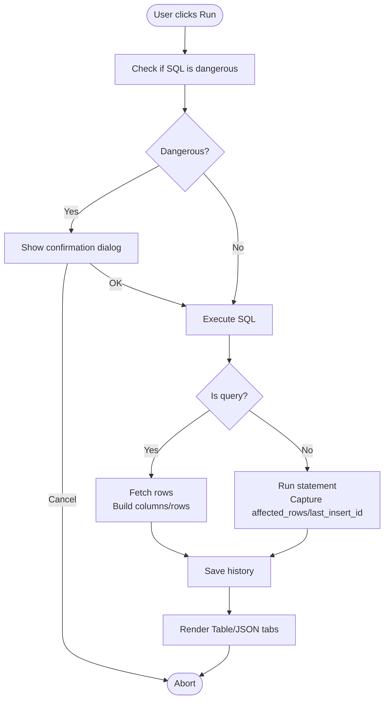

**Diagram sources**
- [SqlWorkspace.tsx:6-25](file://src/plugins/mysql-client/views/SqlWorkspace.tsx#L6-L25)
- [commands.rs:387-415](file://src-tauri/src/plugins/mysql/commands.rs#L387-L415)

**Section sources**
- [SqlWorkspace.tsx:11-25](file://src/plugins/mysql-client/views/SqlWorkspace.tsx#L11-L25)
- [types.ts:35-37](file://src/plugins/mysql-client/types.ts#L35-L37)

### Query Execution Environment
- Query vs Statement: The backend checks the SQL keyword to decide execution path. Queries return rows; statements return metadata.
- Database Selection: Optional USE clause applied before execution when a database is provided.
- History Recording: Every execution persists a record with connection, database, SQL text, and timestamp.

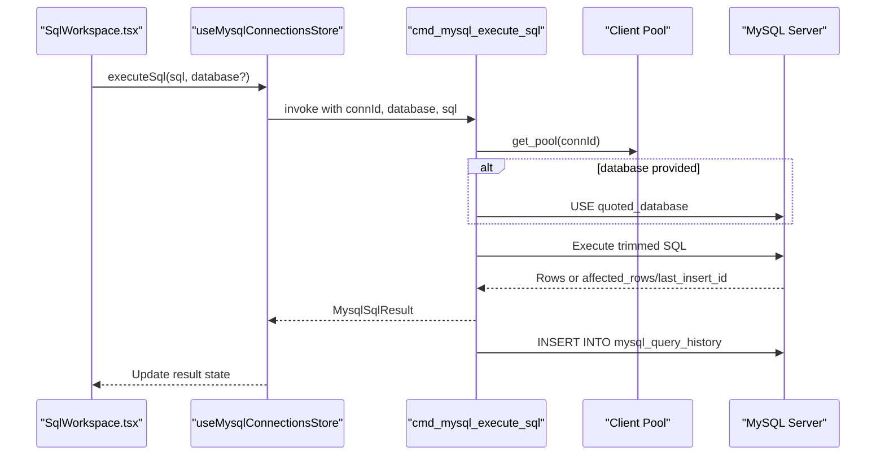

**Diagram sources**
- [commands.rs:387-415](file://src-tauri/src/plugins/mysql/commands.rs#L387-L415)
- [init.rs:144-153](file://src-tauri/src/db/init.rs#L144-L153)

**Section sources**
- [commands.rs:387-415](file://src-tauri/src/plugins/mysql/commands.rs#L387-L415)
- [init.rs:144-153](file://src-tauri/src/db/init.rs#L144-L153)

### Result Set Visualization
- Query Results: Columns and rows parsed from the database response; rendered in a scrollable table with ellipsis for long values.
- Non-Query Results: Shows affected rows and last insert ID when applicable.
- JSON View: Raw JSON serialization of the result object for inspection.

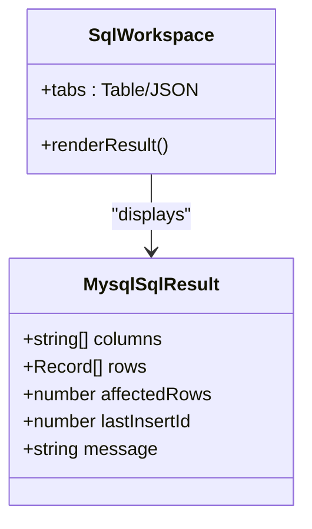

**Diagram sources**
- [types.ts:35-37](file://src/plugins/mysql-client/types.ts#L35-L37)
- [SqlWorkspace.tsx:21-23](file://src/plugins/mysql-client/views/SqlWorkspace.tsx#L21-L23)

**Section sources**
- [types.ts:35-37](file://src/plugins/mysql-client/types.ts#L35-L37)
- [SqlWorkspace.tsx:21-23](file://src/plugins/mysql-client/views/SqlWorkspace.tsx#L21-L23)

### Execution History
- Listing: Retrieves recent queries for the active connection with optional limit.
- Re-running: Clicking a history item populates the editor with the SQL text.

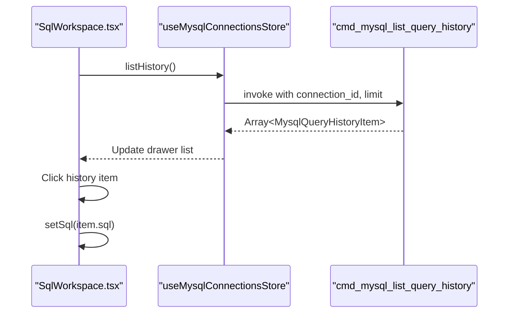

**Diagram sources**
- [SqlWorkspace.tsx:15-25](file://src/plugins/mysql-client/views/SqlWorkspace.tsx#L15-L25)
- [mysql-connections.ts:53-53](file://src/plugins/mysql-client/store/mysql-connections.ts#L53-L53)
- [commands.rs:417-444](file://src-tauri/src/plugins/mysql/commands.rs#L417-L444)

**Section sources**
- [SqlWorkspace.tsx:15-25](file://src/plugins/mysql-client/views/SqlWorkspace.tsx#L15-L25)
- [mysql-connections.ts:143-143](file://src/plugins/mysql-client/store/mysql-connections.ts#L143-L143)
- [commands.rs:417-444](file://src-tauri/src/plugins/mysql/commands.rs#L417-L444)

### Workspace Tabs Organization
- SQL tab hosts the SQL editor and results.
- Other tabs (Connections, Databases, Table Data, Indexes, Import/Export, Server) support multi-session workflows and complementary operations.

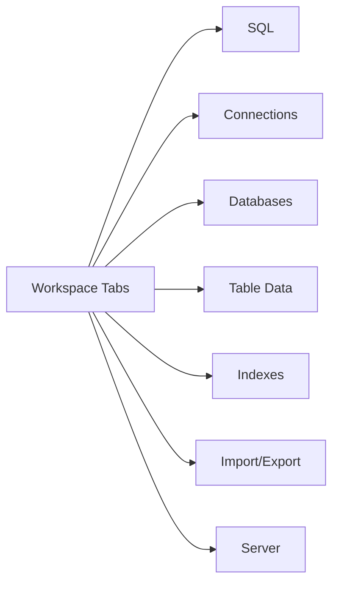

**Diagram sources**
- [index.tsx:20-34](file://src/plugins/mysql-client/index.tsx#L20-L34)

**Section sources**
- [index.tsx:20-34](file://src/plugins/mysql-client/index.tsx#L20-L34)

### Advanced SQL Features
- Prepared Statements: Implemented via JSON-to-SQL conversion helpers in the backend. Row operations accept JSON payloads that are transformed into INSERT/UPDATE/DELETE clauses. This enables prepared-style behavior by building parameterized SQL safely.
- Stored Procedures: Not exposed in the current SQL workspace; procedures would require a dedicated UI and command surface.
- Transactions: No explicit transaction commands are provided in the SQL workspace. Use a BEGIN/COMMIT block in the SQL editor and rely on the existing connection lifecycle managed by the plugin.
- Error Handling: Frontend shows success messages on execution; backend wraps errors with descriptive strings for failures during connection, query execution, or row operations.

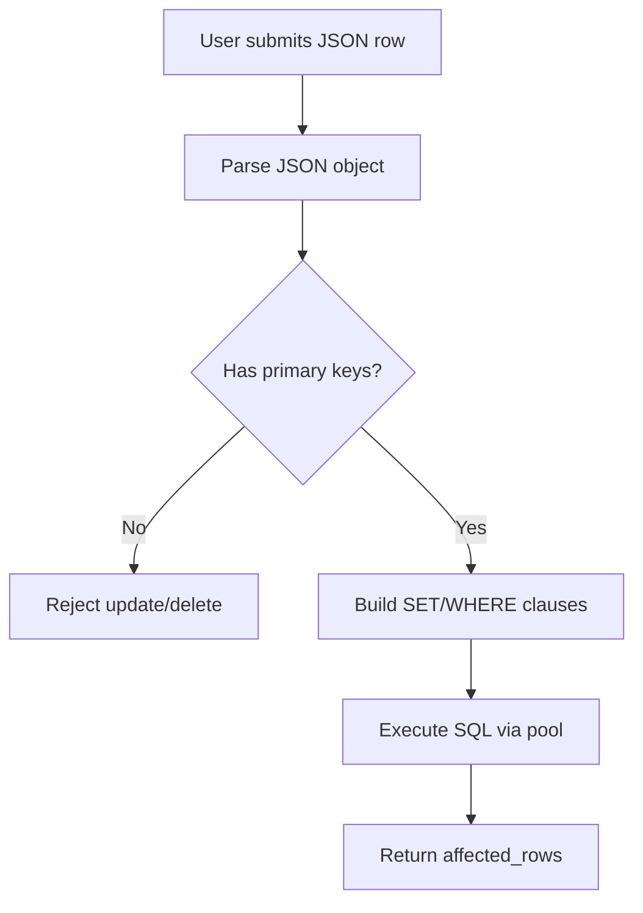

**Diagram sources**
- [commands.rs:324-385](file://src-tauri/src/plugins/mysql/commands.rs#L324-L385)

**Section sources**
- [commands.rs:324-385](file://src-tauri/src/plugins/mysql/commands.rs#L324-L385)
- [mysql-connections.ts:48-51](file://src/plugins/mysql-client/store/mysql-connections.ts#L48-L51)

### Practical Examples
- Complex Query: Write a multi-table JOIN with aggregation; switch to JSON tab to inspect nested structures.
- Performance Analysis: Use EXPLAIN in the editor to analyze query plans; review affected rows for DML statements.
- Transaction Management: Wrap operations in a single session using BEGIN/COMMIT; leverage the connection lifecycle to maintain state.
- Templates: Use the History panel to re-run frequently used statements; paste into the editor for quick iteration.

[No sources needed since this section provides general guidance]

## Dependency Analysis
- Frontend depends on Ant Design components and Zustand store.
- Store uses Tauri invoke to call backend commands.
- Backend manages connection pools and persists history in a local database.

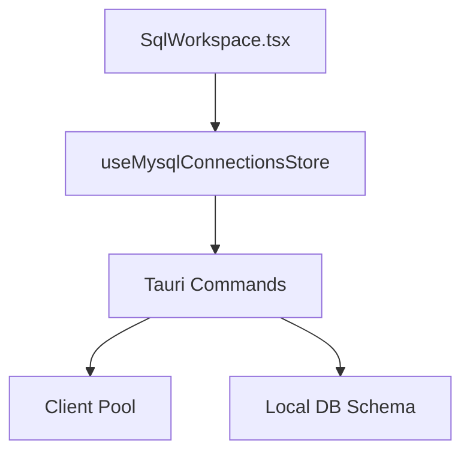

**Diagram sources**
- [SqlWorkspace.tsx:11-25](file://src/plugins/mysql-client/views/SqlWorkspace.tsx#L11-L25)
- [mysql-connections.ts:77-152](file://src/plugins/mysql-client/store/mysql-connections.ts#L77-L152)
- [commands.rs:176-444](file://src-tauri/src/plugins/mysql/commands.rs#L176-L444)
- [init.rs:144-153](file://src-tauri/src/db/init.rs#L144-L153)

**Section sources**
- [mysql-connections.ts:77-152](file://src/plugins/mysql-client/store/mysql-connections.ts#L77-L152)
- [commands.rs:176-444](file://src-tauri/src/plugins/mysql/commands.rs#L176-L444)
- [init.rs:144-153](file://src-tauri/src/db/init.rs#L144-L153)

## Performance Considerations
- Pagination: Table browsing uses LIMIT/OFFSET to avoid large result sets.
- History Limits: Listing history is capped to reduce overhead.
- JSON Export: Controlled batch sizes for exports to prevent memory pressure.

[No sources needed since this section provides general guidance]

## Troubleshooting Guide
- Connection Issues: Use the connection form to test latency and server version; verify credentials and timeouts.
- Execution Failures: Review backend error messages returned from commands; ensure database selection and table existence.
- History Not Loading: Confirm an active connection and refresh history from the SQL workspace.

**Section sources**
- [MysqlConnectionForm.tsx:9-44](file://src/plugins/mysql-client/components/MysqlConnectionForm.tsx#L9-L44)
- [commands.rs:192-199](file://src-tauri/src/plugins/mysql/commands.rs#L192-L199)
- [SqlWorkspace.tsx:15-25](file://src/plugins/mysql-client/views/SqlWorkspace.tsx#L15-L25)

## Conclusion
The SQL workspace provides a focused, safe, and efficient environment for executing SQL against MySQL. It emphasizes result clarity (table and JSON views), safety (dangerous statement warnings), and historical traceability. While advanced features like stored procedures and explicit transaction controls are not present, the underlying JSON-based prepared-style operations and robust connection management enable reliable development workflows.

## Appendices

### Data Model: SQL Result and History Items
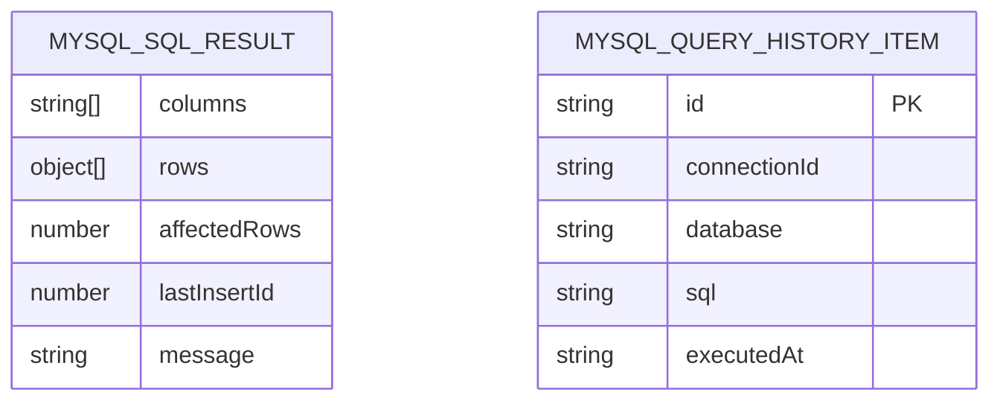

**Diagram sources**
- [types.ts:35-37](file://src/plugins/mysql-client/types.ts#L35-L37)
- [types.ts:37-37](file://src/plugins/mysql-client/types.ts#L37-L37)

**Section sources**
- [types.ts:35-37](file://src/plugins/mysql-client/types.ts#L35-L37)

### Connection Management Integration
- Connections are managed via the store and Tauri commands; the SQL workspace reads the active connection and database to scope executions.

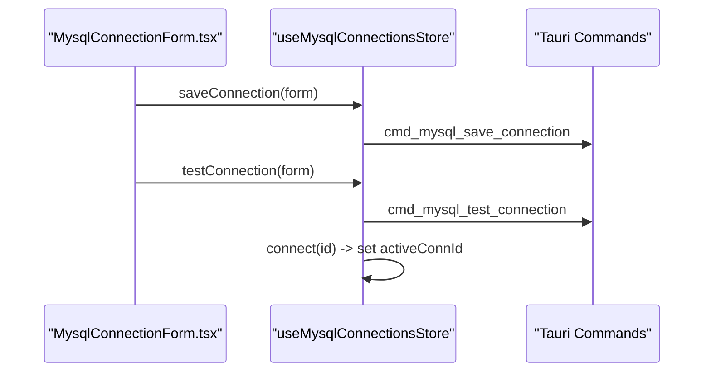

**Diagram sources**
- [MysqlConnectionForm.tsx:9-44](file://src/plugins/mysql-client/components/MysqlConnectionForm.tsx#L9-L44)
- [mysql-connections.ts:99-113](file://src/plugins/mysql-client/store/mysql-connections.ts#L99-L113)
- [commands.rs:182-209](file://src-tauri/src/plugins/mysql/commands.rs#L182-L209)

**Section sources**
- [MysqlConnectionForm.tsx:9-44](file://src/plugins/mysql-client/components/MysqlConnectionForm.tsx#L9-L44)
- [mysql-connections.ts:99-113](file://src/plugins/mysql-client/store/mysql-connections.ts#L99-L113)
- [commands.rs:182-209](file://src-tauri/src/plugins/mysql/commands.rs#L182-L209)