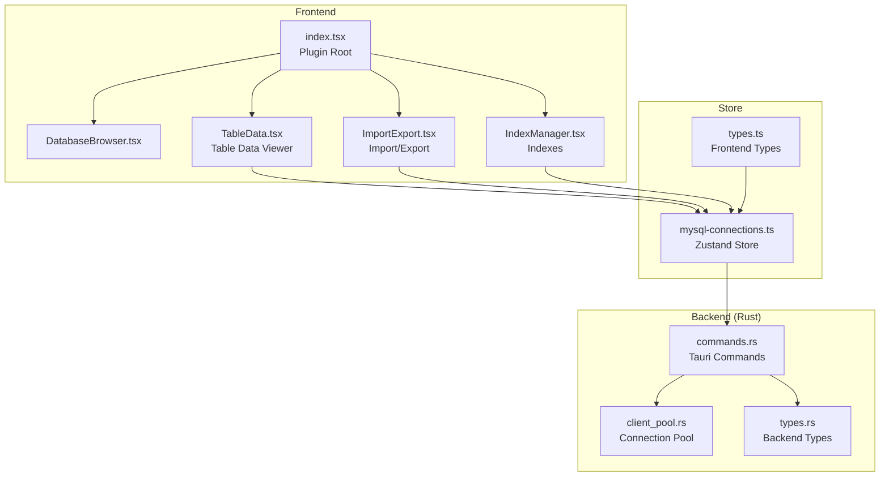
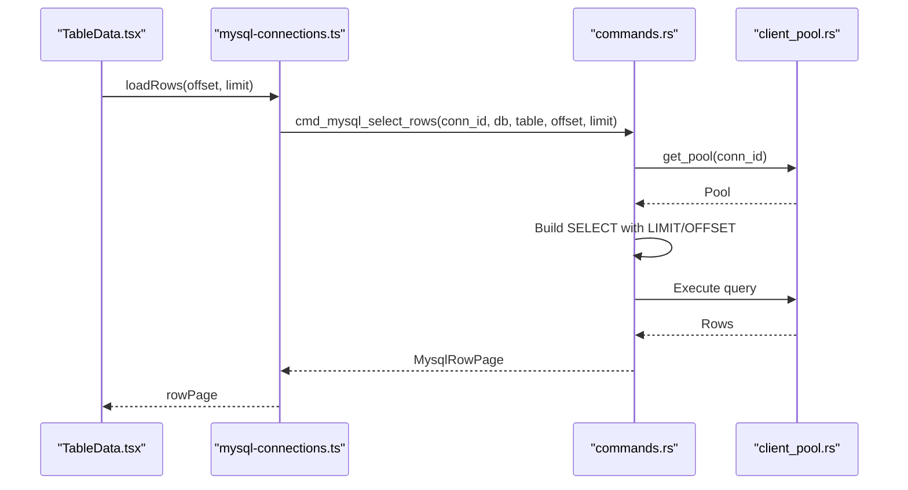
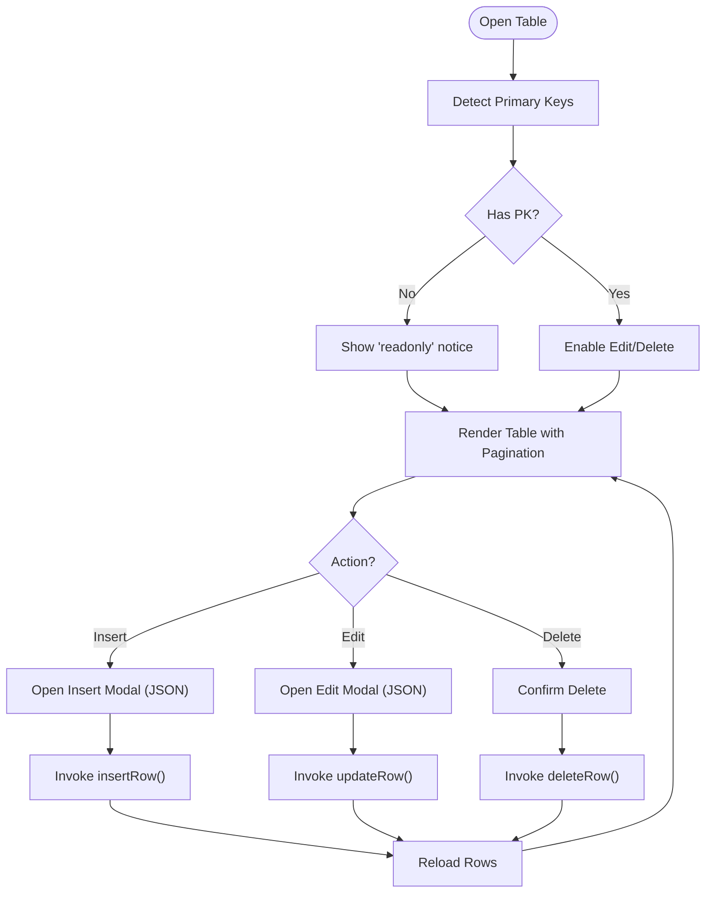
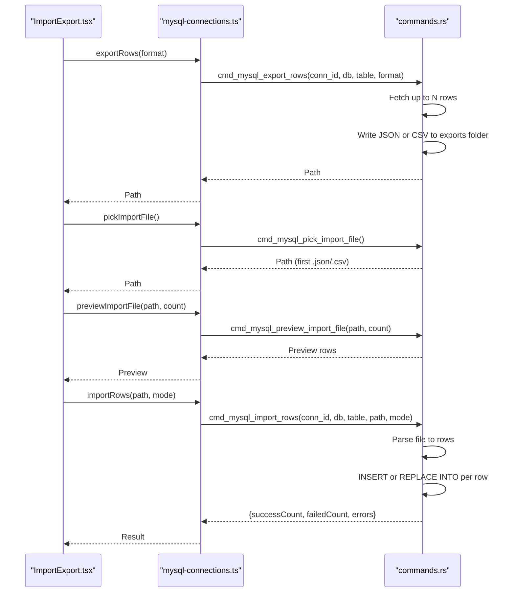
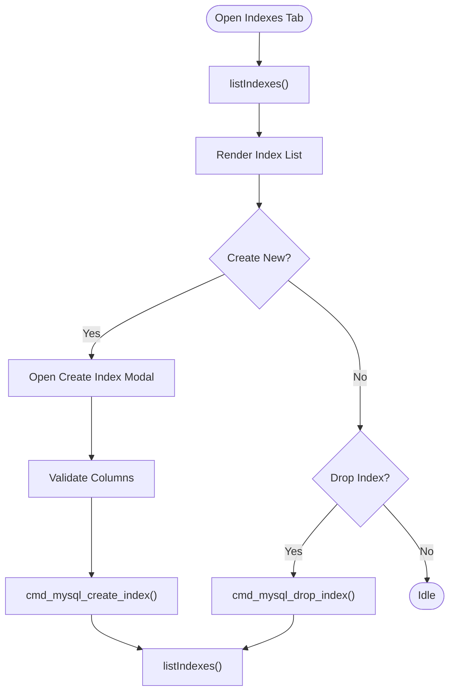
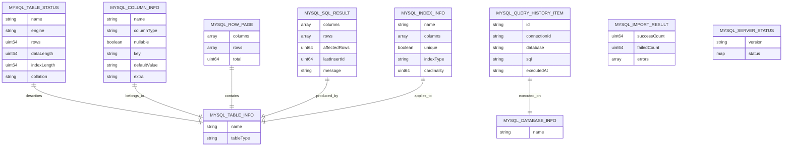
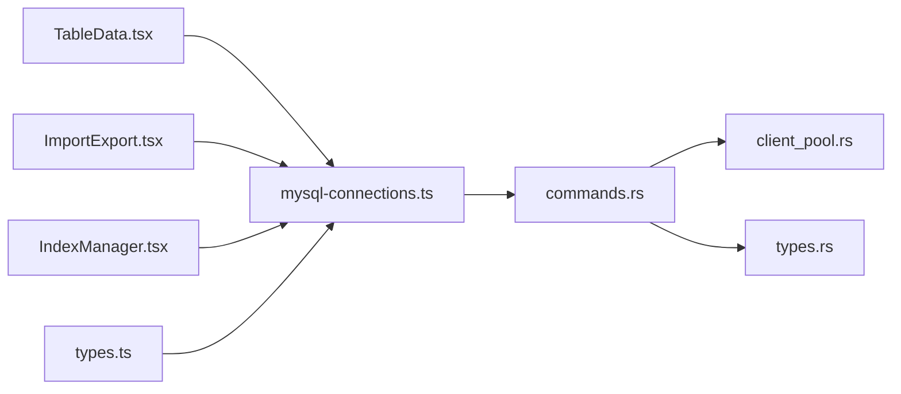

# Table Operations

<cite>
**Referenced Files in This Document**
- [TableData.tsx](file://src/plugins/mysql-client/views/TableData.tsx)
- [ImportExport.tsx](file://src/plugins/mysql-client/views/ImportExport.tsx)
- [mysql-connections.ts](file://src/plugins/mysql-client/store/mysql-connections.ts)
- [types.ts](file://src/plugins/mysql-client/types.ts)
- [index.tsx](file://src/plugins/mysql-client/index.tsx)
- [DatabaseBrowser.tsx](file://src/plugins/mysql-client/views/DatabaseBrowser.tsx)
- [IndexManager.tsx](file://src/plugins/mysql-client/views/IndexManager.tsx)
- [commands.rs](file://src-tauri/src/plugins/mysql/commands.rs)
- [client_pool.rs](file://src-tauri/src/plugins/mysql/client_pool.rs)
- [types.rs](file://src-tauri/src/plugins/mysql/types.rs)
</cite>

## Table of Contents
1. [Introduction](#introduction)
2. [Project Structure](#project-structure)
3. [Core Components](#core-components)
4. [Architecture Overview](#architecture-overview)
5. [Detailed Component Analysis](#detailed-component-analysis)
6. [Dependency Analysis](#dependency-analysis)
7. [Performance Considerations](#performance-considerations)
8. [Troubleshooting Guide](#troubleshooting-guide)
9. [Conclusion](#conclusion)

## Introduction
This document explains MySQL table operations in RDMM, focusing on the table data viewer, import/export workflows, record editing, and schema management. It covers browsing and editing records with pagination, inline editing, and constraints-aware operations; importing and exporting data in JSON and CSV formats; and managing indexes and table metadata. Practical examples demonstrate working with large datasets, bulk operations, and ensuring data integrity during migrations.

## Project Structure
RDMM’s MySQL plugin is organized into React views, a Zustand store, and a Tauri-backed Rust backend. The frontend provides user interfaces for browsing, editing, and importing/exporting data, while the backend executes SQL, manages pools, and handles file operations.

**Diagram sources**
- [index.tsx:14-37](file://src/plugins/mysql-client/index.tsx#L14-L37)
- [DatabaseBrowser.tsx:4-12](file://src/plugins/mysql-client/views/DatabaseBrowser.tsx#L4-L12)
- [TableData.tsx:5-21](file://src/plugins/mysql-client/views/TableData.tsx#L5-L21)
- [ImportExport.tsx:5-18](file://src/plugins/mysql-client/views/ImportExport.tsx#L5-L18)
- [IndexManager.tsx:5-14](file://src/plugins/mysql-client/views/IndexManager.tsx#L5-L14)
- [mysql-connections.ts:77-152](file://src/plugins/mysql-client/store/mysql-connections.ts#L77-L152)
- [types.ts:1-40](file://src/plugins/mysql-client/types.ts#L1-L40)
- [commands.rs:176-615](file://src-tauri/src/plugins/mysql/commands.rs#L176-L615)
- [client_pool.rs:7-65](file://src-tauri/src/plugins/mysql/client_pool.rs#L7-L65)
- [types.rs:1-97](file://src-tauri/src/plugins/mysql/types.rs#L1-L97)

**Section sources**
- [index.tsx:14-37](file://src/plugins/mysql-client/index.tsx#L14-L37)
- [mysql-connections.ts:77-152](file://src/plugins/mysql-client/store/mysql-connections.ts#L77-L152)

## Core Components
- Table Data Viewer: Displays paginated rows, supports inline edit and delete when a primary key exists, and allows inserting new rows via a JSON editor.
- Import/Export: Exports table rows to JSON or CSV and imports JSON/CSV files with preview and two modes (insert-only or replace-into).
- Index Manager: Lists indexes and supports creating/dropping indexes.
- Store: Centralizes state and exposes actions for data operations, navigation, and metadata retrieval.
- Backend Commands: Implements SQL execution, row operations, exports, imports, and server status.

**Section sources**
- [TableData.tsx:5-21](file://src/plugins/mysql-client/views/TableData.tsx#L5-L21)
- [ImportExport.tsx:5-18](file://src/plugins/mysql-client/views/ImportExport.tsx#L5-L18)
- [IndexManager.tsx:5-14](file://src/plugins/mysql-client/views/IndexManager.tsx#L5-L14)
- [mysql-connections.ts:48-61](file://src/plugins/mysql-client/store/mysql-connections.ts#L48-L61)
- [commands.rs:296-385](file://src-tauri/src/plugins/mysql/commands.rs#L296-L385)
- [commands.rs:503-601](file://src-tauri/src/plugins/mysql/commands.rs#L503-L601)

## Architecture Overview
The frontend communicates with the backend via Tauri commands. The store orchestrates UI actions and invokes backend commands. The backend uses a connection pool to execute SQL safely and efficiently.

**Diagram sources**
- [TableData.tsx:13-16](file://src/plugins/mysql-client/views/TableData.tsx#L13-L16)
- [mysql-connections.ts:134-138](file://src/plugins/mysql-client/store/mysql-connections.ts#L134-L138)
- [commands.rs:296-322](file://src-tauri/src/plugins/mysql/commands.rs#L296-L322)
- [client_pool.rs:32-48](file://src-tauri/src/plugins/mysql/client_pool.rs#L32-L48)

## Detailed Component Analysis

### Table Data Viewer
The table viewer displays rows with a fixed page size, shows a “readonly” hint when no primary key exists, and enables inline edit/delete operations. It also supports inserting new rows via a JSON modal.

**Diagram sources**
- [TableData.tsx:10-21](file://src/plugins/mysql-client/views/TableData.tsx#L10-L21)
- [mysql-connections.ts:139-141](file://src/plugins/mysql-client/store/mysql-connections.ts#L139-L141)
- [commands.rs:324-385](file://src-tauri/src/plugins/mysql/commands.rs#L324-L385)

**Section sources**
- [TableData.tsx:5-21](file://src/plugins/mysql-client/views/TableData.tsx#L5-L21)
- [mysql-connections.ts:48-61](file://src/plugins/mysql-client/store/mysql-connections.ts#L48-L61)

### Import/Export Workflow
The import/export panel supports exporting to JSON or CSV and importing from JSON or CSV with a preview. Two import modes are supported: insert-only and replace-into.

**Diagram sources**
- [ImportExport.tsx:5-18](file://src/plugins/mysql-client/views/ImportExport.tsx#L5-L18)
- [mysql-connections.ts:57-61](file://src/plugins/mysql-client/store/mysql-connections.ts#L57-L61)
- [commands.rs:503-531](file://src-tauri/src/plugins/mysql/commands.rs#L503-L531)
- [commands.rs:558-562](file://src-tauri/src/plugins/mysql/commands.rs#L558-L562)
- [commands.rs:564-577](file://src-tauri/src/plugins/mysql/commands.rs#L564-L577)
- [commands.rs:579-601](file://src-tauri/src/plugins/mysql/commands.rs#L579-L601)

**Section sources**
- [ImportExport.tsx:5-18](file://src/plugins/mysql-client/views/ImportExport.tsx#L5-L18)
- [mysql-connections.ts:57-61](file://src/plugins/mysql-client/store/mysql-connections.ts#L57-L61)

### Index Management
The index manager lists existing indexes and supports creating new indexes and dropping them (excluding primary keys).

**Diagram sources**
- [IndexManager.tsx:5-14](file://src/plugins/mysql-client/views/IndexManager.tsx#L5-L14)
- [mysql-connections.ts:144-146](file://src/plugins/mysql-client/store/mysql-connections.ts#L144-L146)
- [commands.rs:446-501](file://src-tauri/src/plugins/mysql/commands.rs#L446-L501)

**Section sources**
- [IndexManager.tsx:5-14](file://src/plugins/mysql-client/views/IndexManager.tsx#L5-L14)
- [mysql-connections.ts:144-146](file://src/plugins/mysql-client/store/mysql-connections.ts#L144-L146)

### Data Model Overview
The frontend and backend share typed models for database, table, column, index, row pages, SQL results, and import results.

**Diagram sources**
- [types.ts:30-39](file://src/plugins/mysql-client/types.ts#L30-L39)
- [types.rs:10-97](file://src-tauri/src/plugins/mysql/types.rs#L10-L97)

**Section sources**
- [types.ts:1-40](file://src/plugins/mysql-client/types.ts#L1-L40)
- [types.rs:1-97](file://src-tauri/src/plugins/mysql/types.rs#L1-L97)

## Dependency Analysis
- Frontend depends on the store for state and actions; the store invokes Tauri commands.
- Backend commands depend on the connection pool and filesystem for exports/imports.
- Type definitions are shared between frontend and backend to ensure consistent serialization.

**Diagram sources**
- [TableData.tsx:5-21](file://src/plugins/mysql-client/views/TableData.tsx#L5-L21)
- [ImportExport.tsx:5-18](file://src/plugins/mysql-client/views/ImportExport.tsx#L5-L18)
- [IndexManager.tsx:5-14](file://src/plugins/mysql-client/views/IndexManager.tsx#L5-L14)
- [mysql-connections.ts:77-152](file://src/plugins/mysql-client/store/mysql-connections.ts#L77-L152)
- [commands.rs:176-615](file://src-tauri/src/plugins/mysql/commands.rs#L176-L615)
- [client_pool.rs:7-65](file://src-tauri/src/plugins/mysql/client_pool.rs#L7-L65)
- [types.ts:1-40](file://src/plugins/mysql-client/types.ts#L1-L40)
- [types.rs:1-97](file://src-tauri/src/plugins/mysql/types.rs#L1-L97)

**Section sources**
- [mysql-connections.ts:77-152](file://src/plugins/mysql-client/store/mysql-connections.ts#L77-L152)
- [commands.rs:176-615](file://src-tauri/src/plugins/mysql/commands.rs#L176-L615)

## Performance Considerations
- Pagination and limits: The backend enforces a maximum page size for row selection to avoid heavy queries.
- Bulk imports: The backend iterates rows and executes inserts or replaces; consider batching at the client or splitting very large files.
- Export size: Exports are written to the application data exports directory; large exports may impact disk I/O.
- Connection pooling: The backend maintains pools keyed by connection ID to reduce overhead.
- Sorting and filtering: Not implemented in the viewer; use the SQL workspace for advanced queries.

Recommendations:
- For large datasets, prefer exporting via the SQL workspace with WHERE clauses and LIMIT/OFFSET.
- Use replace-into mode for idempotent imports when duplicates may occur.
- Monitor server status to assess concurrent connections and uptime.

**Section sources**
- [commands.rs:313-322](file://src-tauri/src/plugins/mysql/commands.rs#L313-L322)
- [commands.rs:503-531](file://src-tauri/src/plugins/mysql/commands.rs#L503-L531)
- [client_pool.rs:32-48](file://src-tauri/src/plugins/mysql/client_pool.rs#L32-L48)

## Troubleshooting Guide
Common issues and resolutions:
- No primary key: Editing and deleting are disabled. Add a primary key or surrogate key to enable inline edits.
- Import failures: Review the returned error list and fix malformed rows or schema mismatches.
- Connection problems: Test the connection and ensure credentials and network settings are correct.
- Large result handling: Use the SQL workspace for filtered queries or export smaller subsets.

Operational tips:
- Use the SQL workspace to validate queries and check server status.
- Keep the query history to audit recent operations.
- Verify table metadata (engine, collation, sizes) in the database browser.

**Section sources**
- [TableData.tsx:10-11](file://src/plugins/mysql-client/views/TableData.tsx#L10-L11)
- [ImportExport.tsx:13-14](file://src/plugins/mysql-client/views/ImportExport.tsx#L13-L14)
- [mysql-connections.ts:142-143](file://src/plugins/mysql-client/store/mysql-connections.ts#L142-L143)
- [DatabaseBrowser.tsx:10](file://src/plugins/mysql-client/views/DatabaseBrowser.tsx#L10)

## Conclusion
RDMM’s MySQL plugin provides a practical toolkit for browsing, editing, and migrating table data. The table data viewer offers constrained inline editing, while import/export supports JSON and CSV with preview and flexible modes. Index management complements schema evolution. For large-scale operations, combine the SQL workspace with backend commands and monitor server health to maintain performance and data integrity.