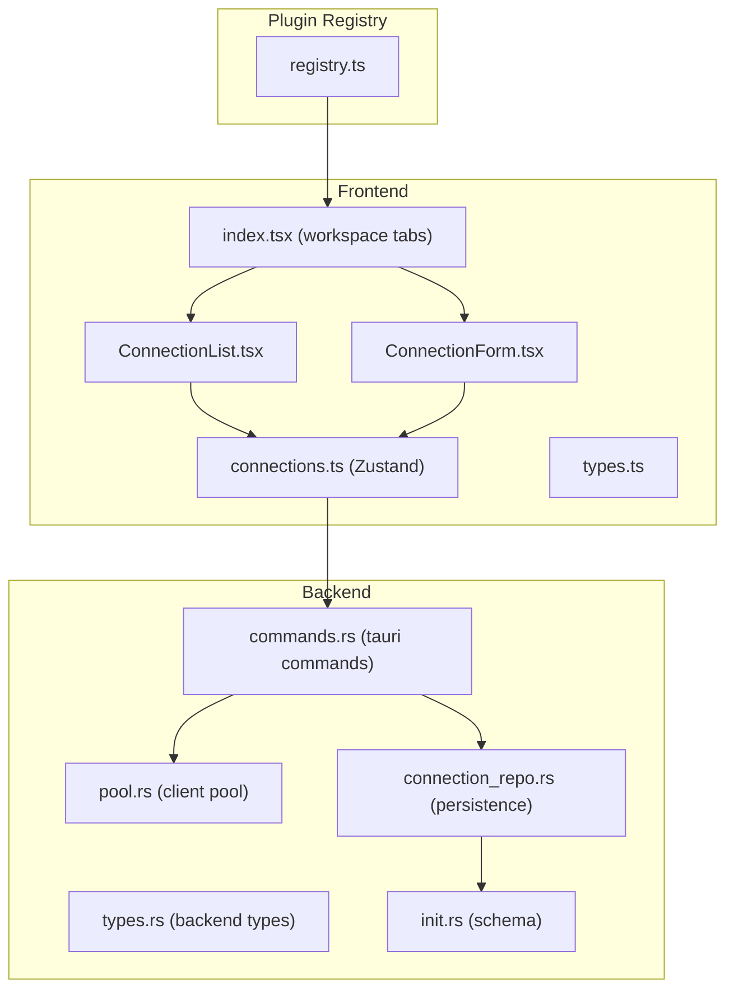
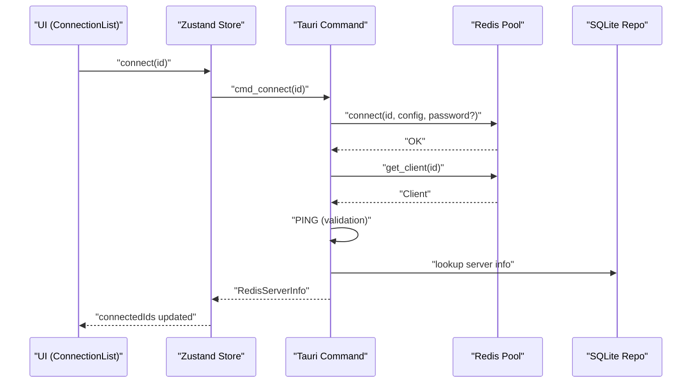
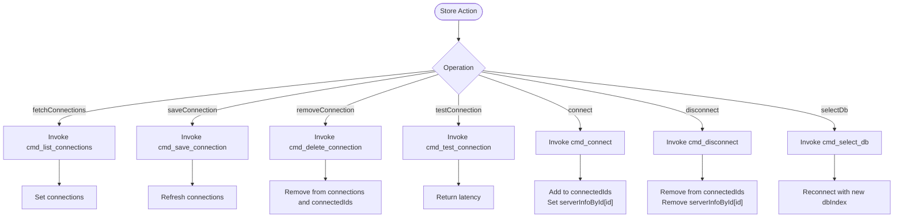
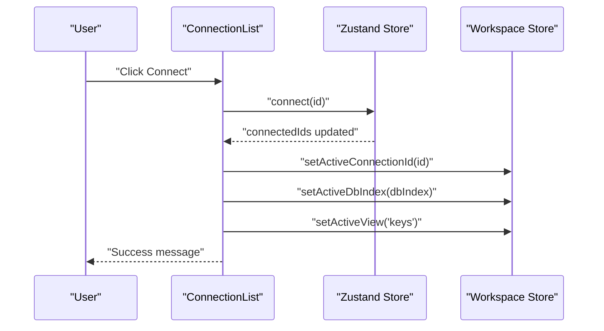
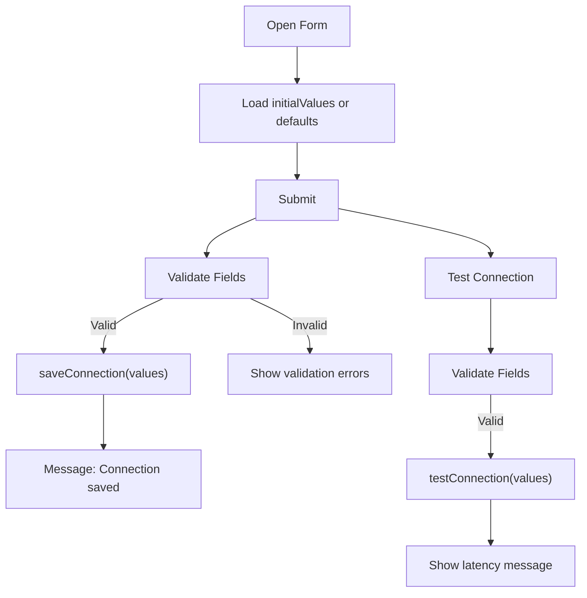
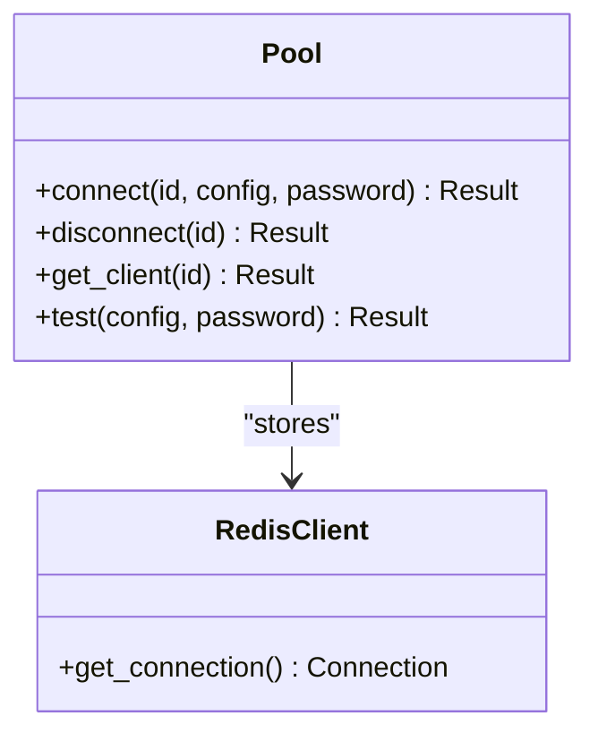
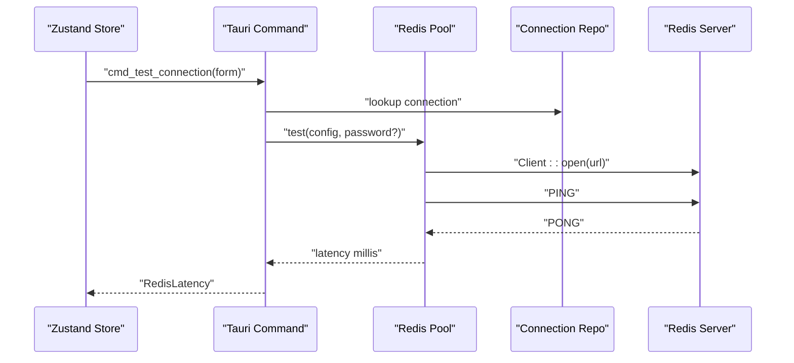
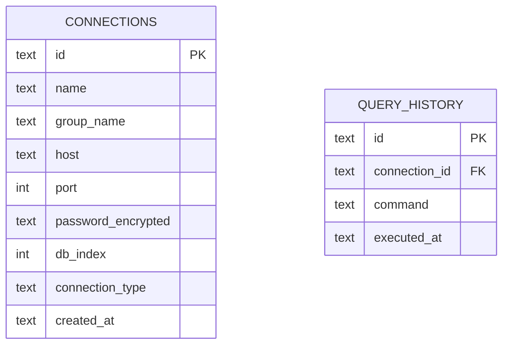
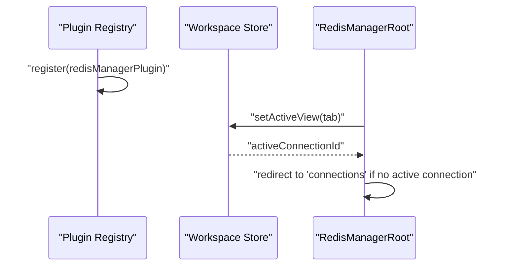
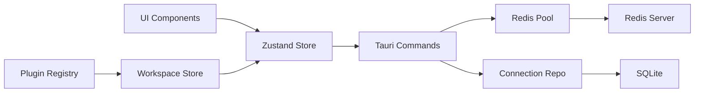

# Connection Management

<cite>
**Referenced Files in This Document**
- [connections.ts](file://src/plugins/redis-manager/store/connections.ts)
- [ConnectionForm.tsx](file://src/plugins/redis-manager/components/ConnectionForm.tsx)
- [ConnectionList.tsx](file://src/plugins/redis-manager/views/ConnectionList.tsx)
- [types.ts](file://src/plugins/redis-manager/types.ts)
- [index.tsx](file://src/plugins/redis-manager/index.tsx)
- [pool.rs](file://src-tauri/src/plugins/redis/pool.rs)
- [commands.rs](file://src-tauri/src/plugins/redis/commands.rs)
- [types.rs](file://src-tauri/src/plugins/redis/types.rs)
- [connection_repo.rs](file://src-tauri/src/db/connection_repo.rs)
- [init.rs](file://src-tauri/src/db/init.rs)
- [registry.ts](file://src/app/plugin-registry/registry.ts)
</cite>

## Table of Contents
1. [Introduction](#introduction)
2. [Project Structure](#project-structure)
3. [Core Components](#core-components)
4. [Architecture Overview](#architecture-overview)
5. [Detailed Component Analysis](#detailed-component-analysis)
6. [Dependency Analysis](#dependency-analysis)
7. [Performance Considerations](#performance-considerations)
8. [Troubleshooting Guide](#troubleshooting-guide)
9. [Conclusion](#conclusion)

## Introduction
This document describes the Redis connection management system, focusing on:
- Viewing and managing multiple Redis instances via the connection list interface
- Configuring new connections with host, port, password, and authentication settings
- Connection pooling, validation, error handling, and lifecycle management
- Practical examples for adding connections, configuring authentication (password), SSL/TLS considerations, and connection testing
- Security best practices, timeouts, and recovery mechanisms
- Connection store architecture, state management patterns, and integration with the plugin registry system

## Project Structure
The Redis connection management spans React frontend components and a Tauri backend:
- Frontend store and UI: connection list, connection form, and workspace routing
- Backend pool and commands: connection pooling, validation, and Redis operations
- Database persistence: connection storage and encrypted credentials
- Plugin registry: integration with the application’s plugin system

**Diagram sources**
- [ConnectionList.tsx:1-213](file://src/plugins/redis-manager/views/ConnectionList.tsx#L1-L213)
- [ConnectionForm.tsx:1-115](file://src/plugins/redis-manager/components/ConnectionForm.tsx#L1-L115)
- [connections.ts:1-91](file://src/plugins/redis-manager/store/connections.ts#L1-L91)
- [types.ts:1-91](file://src/plugins/redis-manager/types.ts#L1-L91)
- [index.tsx:1-67](file://src/plugins/redis-manager/index.tsx#L1-L67)
- [pool.rs:1-76](file://src-tauri/src/plugins/redis/pool.rs#L1-L76)
- [commands.rs:1-1016](file://src-tauri/src/plugins/redis/commands.rs#L1-L1016)
- [types.rs:1-97](file://src-tauri/src/plugins/redis/types.rs#L1-L97)
- [connection_repo.rs:1-174](file://src-tauri/src/db/connection_repo.rs#L1-L174)
- [init.rs:1-393](file://src-tauri/src/db/init.rs#L1-L393)
- [registry.ts:1-26](file://src/app/plugin-registry/registry.ts#L1-L26)

**Section sources**
- [ConnectionList.tsx:1-213](file://src/plugins/redis-manager/views/ConnectionList.tsx#L1-L213)
- [ConnectionForm.tsx:1-115](file://src/plugins/redis-manager/components/ConnectionForm.tsx#L1-L115)
- [connections.ts:1-91](file://src/plugins/redis-manager/store/connections.ts#L1-L91)
- [types.ts:1-91](file://src/plugins/redis-manager/types.ts#L1-L91)
- [index.tsx:1-67](file://src/plugins/redis-manager/index.tsx#L1-L67)
- [pool.rs:1-76](file://src-tauri/src/plugins/redis/pool.rs#L1-L76)
- [commands.rs:1-1016](file://src-tauri/src/plugins/redis/commands.rs#L1-L1016)
- [types.rs:1-97](file://src-tauri/src/plugins/redis/types.rs#L1-L97)
- [connection_repo.rs:1-174](file://src-tauri/src/db/connection_repo.rs#L1-L174)
- [init.rs:1-393](file://src-tauri/src/db/init.rs#L1-L393)
- [registry.ts:1-26](file://src/app/plugin-registry/registry.ts#L1-L26)

## Core Components
- Connection store (Zustand): manages connection list, connectivity state, server info, latency, and exposes actions to fetch/save/remove/test/connect/disconnect/select DB.
- Connection list view: renders grouped connections, supports search, connect/disconnect, edit, and delete.
- Connection form: validates and submits connection settings; includes a “Test Connection” action.
- Backend pool: maintains a static in-memory pool of Redis clients keyed by connection ID; handles PING validation and URL construction.
- Commands: Tauri commands bridge frontend store actions to backend operations (list/save/delete/test/connect/disconnect/select DB).
- Persistence: SQLite-backed connection repository with encrypted passwords.
- Workspace: orchestrates tabs and enforces navigation rules (e.g., defaulting to connections when no active connection is selected).
- Plugin registry: registers the Redis manager plugin with sidebar ordering and icon.

**Section sources**
- [connections.ts:11-91](file://src/plugins/redis-manager/store/connections.ts#L11-L91)
- [ConnectionList.tsx:20-84](file://src/plugins/redis-manager/views/ConnectionList.tsx#L20-L84)
- [ConnectionForm.tsx:14-53](file://src/plugins/redis-manager/components/ConnectionForm.tsx#L14-L53)
- [pool.rs:10-76](file://src-tauri/src/plugins/redis/pool.rs#L10-L76)
- [commands.rs:139-215](file://src-tauri/src/plugins/redis/commands.rs#L139-L215)
- [connection_repo.rs:96-174](file://src-tauri/src/db/connection_repo.rs#L96-L174)
- [index.tsx:14-57](file://src/plugins/redis-manager/index.tsx#L14-L57)
- [registry.ts:59-67](file://src/plugins/redis-manager/index.tsx#L59-L67)

## Architecture Overview
The system follows a layered architecture:
- UI layer: Ant Design components and React hooks
- Store layer: Zustand state with selectors and async actions
- Command layer: Tauri commands exposing backend functionality
- Backend layer: Redis client pool and connection validation
- Persistence layer: SQLite with encrypted credentials

**Diagram sources**
- [ConnectionList.tsx:61-67](file://src/plugins/redis-manager/views/ConnectionList.tsx#L61-L67)
- [connections.ts:59-69](file://src/plugins/redis-manager/store/connections.ts#L59-L69)
- [commands.rs:174-194](file://src-tauri/src/plugins/redis/commands.rs#L174-L194)
- [pool.rs:39-48](file://src-tauri/src/plugins/redis/pool.rs#L39-L48)

## Detailed Component Analysis

### Connection Store (Zustand)
Responsibilities:
- Fetch, save, remove, and test connections
- Connect/disconnect and track connected IDs
- Persist DB selection and update connection list after DB change
- Expose latency and server info per connection

Key behaviors:
- Loading state during fetches
- Asynchronous invocation of Tauri commands
- State updates for connected IDs and server info
- DB index updates trigger re-connect to apply the new DB

**Diagram sources**
- [connections.ts:33-89](file://src/plugins/redis-manager/store/connections.ts#L33-L89)

**Section sources**
- [connections.ts:11-91](file://src/plugins/redis-manager/store/connections.ts#L11-L91)

### Connection List View
Responsibilities:
- Render grouped connections by group name
- Support filtering by name
- Provide context menu actions: connect/disconnect, edit, delete
- Open the connection form in create/edit mode
- Navigate to the Keys workspace after successful connect

**Diagram sources**
- [ConnectionList.tsx:61-67](file://src/plugins/redis-manager/views/ConnectionList.tsx#L61-L67)
- [connections.ts:59-69](file://src/plugins/redis-manager/store/connections.ts#L59-L69)

**Section sources**
- [ConnectionList.tsx:20-84](file://src/plugins/redis-manager/views/ConnectionList.tsx#L20-L84)

### Connection Form
Responsibilities:
- Capture connection settings: name, group, host, port, password, DB index, connection type
- Validate form fields (required, numeric range)
- Save connection via store action
- Test connection latency via store action

**Diagram sources**
- [ConnectionForm.tsx:25-53](file://src/plugins/redis-manager/components/ConnectionForm.tsx#L25-L53)
- [types.ts:3-12](file://src/plugins/redis-manager/types.ts#L3-L12)

**Section sources**
- [ConnectionForm.tsx:14-53](file://src/plugins/redis-manager/components/ConnectionForm.tsx#L14-L53)
- [types.ts:3-12](file://src/plugins/redis-manager/types.ts#L3-L12)

### Backend Pool and Validation
Responsibilities:
- Maintain a static HashMap of Redis clients keyed by connection ID
- Build Redis URL with optional password encoding
- Validate connectivity with PING
- Provide test latency measurement

**Diagram sources**
- [pool.rs:10-76](file://src-tauri/src/plugins/redis/pool.rs#L10-L76)

**Section sources**
- [pool.rs:10-76](file://src-tauri/src/plugins/redis/pool.rs#L10-L76)

### Commands and Operations
Responsibilities:
- List, save, delete, test, connect, disconnect, select DB
- Retrieve server info and parse INFO sections
- Execute Redis commands and map responses to frontend types
- Write query history and enforce safety checks for dangerous commands

**Diagram sources**
- [commands.rs:158-172](file://src-tauri/src/plugins/redis/commands.rs#L158-L172)
- [pool.rs:69-75](file://src-tauri/src/plugins/redis/pool.rs#L69-L75)

**Section sources**
- [commands.rs:139-215](file://src-tauri/src/plugins/redis/commands.rs#L139-L215)
- [types.rs:54-62](file://src-tauri/src/plugins/redis/types.rs#L54-L62)

### Persistence Layer
Responsibilities:
- Define connection schema and migrations
- Encrypt and decrypt passwords before storing/retrieving
- Upsert connections and update DB index

**Diagram sources**
- [init.rs:37-54](file://src-tauri/src/db/init.rs#L37-L54)
- [connection_repo.rs:96-131](file://src-tauri/src/db/connection_repo.rs#L96-L131)

**Section sources**
- [connection_repo.rs:96-174](file://src-tauri/src/db/connection_repo.rs#L96-L174)
- [init.rs:37-54](file://src-tauri/src/db/init.rs#L37-L54)

### Workspace and Plugin Registry
Responsibilities:
- Manage active view and active connection state
- Enforce navigation rules (e.g., redirect to connections when no active connection)
- Register the Redis manager plugin with sidebar order and icon

**Diagram sources**
- [registry.ts:59-67](file://src/plugins/redis-manager/index.tsx#L59-L67)
- [index.tsx:19-23](file://src/plugins/redis-manager/index.tsx#L19-L23)

**Section sources**
- [index.tsx:14-57](file://src/plugins/redis-manager/index.tsx#L14-L57)
- [registry.ts:1-26](file://src/app/plugin-registry/registry.ts#L1-L26)

## Dependency Analysis
- Frontend store depends on Tauri core invocations and Ant Design components
- Commands depend on the pool and repository layers
- Pool depends on the Redis client library and URL encoding
- Repository depends on SQLite and encryption utilities
- Workspace depends on the store for state synchronization
- Plugin registry depends on the manifest registration

**Diagram sources**
- [connections.ts:27-91](file://src/plugins/redis-manager/store/connections.ts#L27-L91)
- [commands.rs:139-215](file://src-tauri/src/plugins/redis/commands.rs#L139-L215)
- [pool.rs:10-76](file://src-tauri/src/plugins/redis/pool.rs#L10-L76)
- [connection_repo.rs:96-174](file://src-tauri/src/db/connection_repo.rs#L96-L174)
- [registry.ts:59-67](file://src/plugins/redis-manager/index.tsx#L59-L67)

**Section sources**
- [connections.ts:27-91](file://src/plugins/redis-manager/store/connections.ts#L27-L91)
- [commands.rs:139-215](file://src-tauri/src/plugins/redis/commands.rs#L139-L215)
- [pool.rs:10-76](file://src-tauri/src/plugins/redis/pool.rs#L10-L76)
- [connection_repo.rs:96-174](file://src-tauri/src/db/connection_repo.rs#L96-L174)
- [registry.ts:59-67](file://src/plugins/redis-manager/index.tsx#L59-L67)

## Performance Considerations
- Connection pooling: The backend maintains a single client per connection ID in-process. This avoids repeated TCP handshakes and reduces overhead for frequent operations.
- Validation cost: PING is used for both connect and test operations; latency is measured around client creation and PING execution.
- UI responsiveness: Store actions set loading flags and batch updates to minimize re-renders.
- DB selection: Switching DB triggers reconnect to ensure subsequent operations target the correct logical DB.

[No sources needed since this section provides general guidance]

## Troubleshooting Guide
Common issues and remedies:
- Connection fails immediately after connect:
  - Verify host/port reachability and firewall rules
  - Confirm password correctness; note that empty password is supported
  - Use “Test Connection” to measure latency and isolate network vs authentication problems
- DB selection does not persist:
  - Ensure DB index is within allowed range (0–15)
  - After changing DB index, the system reconnects automatically
- Persistent storage issues:
  - Confirm database initialization and migrations succeeded
  - Check that encrypted passwords are present and retrievable
- Plugin not visible in sidebar:
  - Ensure the plugin manifest is registered with a valid sidebar order and icon

Operational references:
- Connection lifecycle and state transitions are handled in the store and commands
- Persistence and encryption are managed by the repository and initialization routines

**Section sources**
- [commands.rs:202-214](file://src-tauri/src/plugins/redis/commands.rs#L202-L214)
- [connection_repo.rs:96-174](file://src-tauri/src/db/connection_repo.rs#L96-L174)
- [init.rs:37-54](file://src-tauri/src/db/init.rs#L37-L54)

## Conclusion
The Redis connection management system provides a cohesive, layered design:
- A reactive frontend store coordinates user actions with backend commands
- A lightweight in-process client pool improves performance and simplifies lifecycle management
- Robust persistence with encrypted credentials ensures secure storage
- Clear workspace and plugin integration streamline user workflows

Practical recommendations:
- Prefer “Test Connection” before connecting to diagnose latency and authentication issues
- Use groups to organize connections and leverage search for quick access
- Keep DB index within supported bounds and rely on automatic reconnect after changes
- Monitor slow logs and query history for operational insights

[No sources needed since this section summarizes without analyzing specific files]