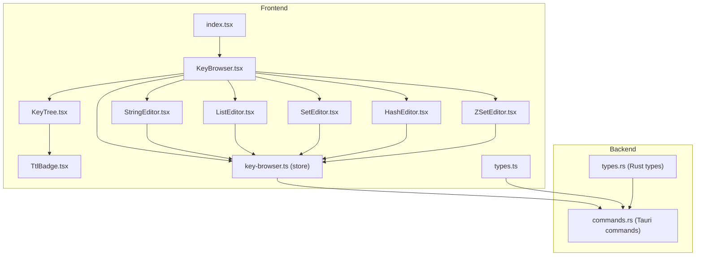
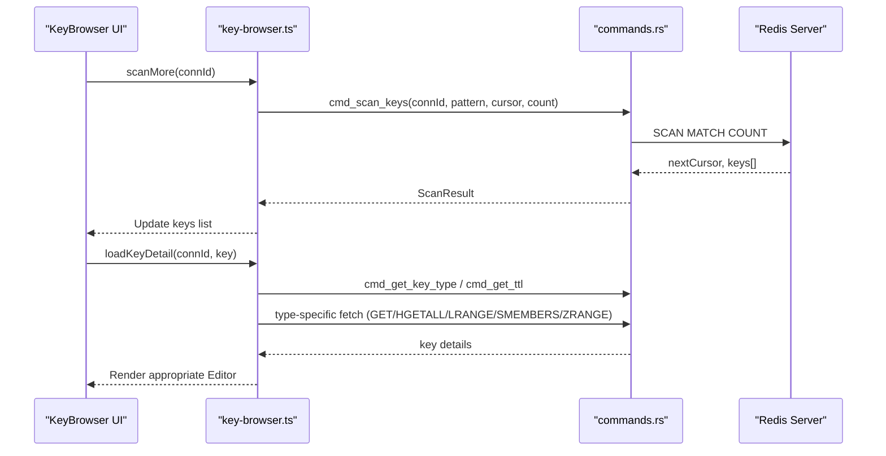
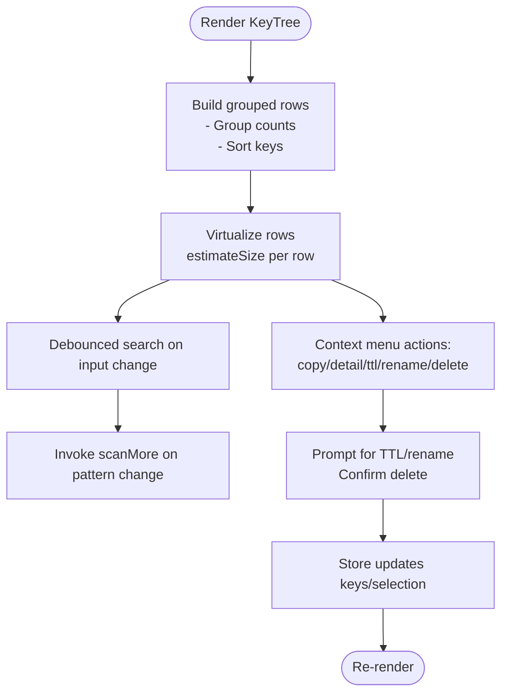
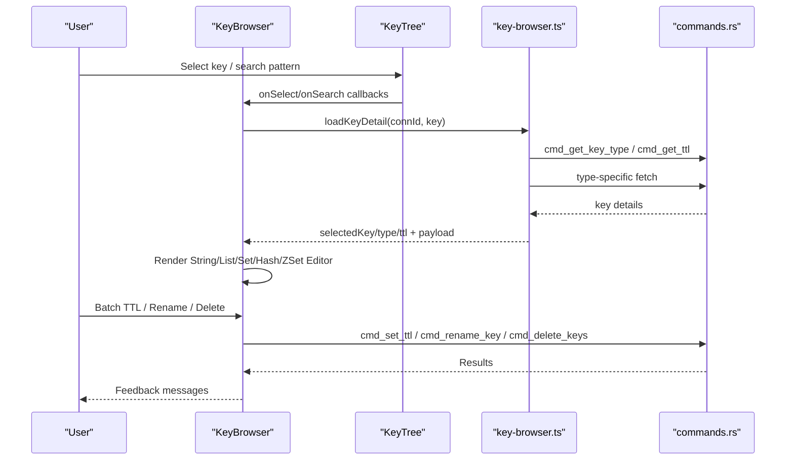
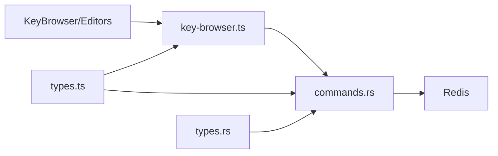

# Key Browser and Editors

<cite>
**Referenced Files in This Document**
- [KeyBrowser.tsx](file://src/plugins/redis-manager/views/KeyBrowser.tsx)
- [KeyTree.tsx](file://src/plugins/redis-manager/components/KeyTree.tsx)
- [StringEditor.tsx](file://src/plugins/redis-manager/components/editors/StringEditor.tsx)
- [ListEditor.tsx](file://src/plugins/redis-manager/components/editors/ListEditor.tsx)
- [SetEditor.tsx](file://src/plugins/redis-manager/components/editors/SetEditor.tsx)
- [HashEditor.tsx](file://src/plugins/redis-manager/components/editors/HashEditor.tsx)
- [ZSetEditor.tsx](file://src/plugins/redis-manager/components/editors/ZSetEditor.tsx)
- [TtlBadge.tsx](file://src/plugins/redis-manager/components/TtlBadge.tsx)
- [key-browser.ts](file://src/plugins/redis-manager/store/key-browser.ts)
- [types.ts](file://src/plugins/redis-manager/types.ts)
- [index.tsx](file://src/plugins/redis-manager/index.tsx)
- [commands.rs](file://src-tauri/src/plugins/redis/commands.rs)
- [types.rs](file://src-tauri/src/plugins/redis/types.rs)
</cite>

## Table of Contents
1. [Introduction](#introduction)
2. [Project Structure](#project-structure)
3. [Core Components](#core-components)
4. [Architecture Overview](#architecture-overview)
5. [Detailed Component Analysis](#detailed-component-analysis)
6. [Dependency Analysis](#dependency-analysis)
7. [Performance Considerations](#performance-considerations)
8. [Troubleshooting Guide](#troubleshooting-guide)
9. [Conclusion](#conclusion)
10. [Appendices](#appendices)

## Introduction
This document describes the Redis key browsing and editing system built with React and Tauri. It covers hierarchical key navigation, filtering and search, real-time metadata display (data types and TTL), and dedicated editors for each Redis data type: string, list, set, hash, and sorted set. It also documents batch operations, TTL management, data export/import, and performance optimization techniques.

## Project Structure
The Redis Manager plugin is organized into views, components, stores, and a Rust backend. The frontend handles UI and state, while the backend exposes Tauri commands to communicate with Redis.

**Diagram sources**
- [KeyBrowser.tsx:1-525](file://src/plugins/redis-manager/views/KeyBrowser.tsx#L1-L525)
- [KeyTree.tsx:1-278](file://src/plugins/redis-manager/components/KeyTree.tsx#L1-L278)
- [StringEditor.tsx:1-45](file://src/plugins/redis-manager/components/editors/StringEditor.tsx#L1-L45)
- [ListEditor.tsx:1-123](file://src/plugins/redis-manager/components/editors/ListEditor.tsx#L1-L123)
- [SetEditor.tsx:1-76](file://src/plugins/redis-manager/components/editors/SetEditor.tsx#L1-L76)
- [HashEditor.tsx:1-127](file://src/plugins/redis-manager/components/editors/HashEditor.tsx#L1-L127)
- [ZSetEditor.tsx:1-82](file://src/plugins/redis-manager/components/editors/ZSetEditor.tsx#L1-L82)
- [TtlBadge.tsx:1-18](file://src/plugins/redis-manager/components/TtlBadge.tsx#L1-L18)
- [key-browser.ts:1-224](file://src/plugins/redis-manager/store/key-browser.ts#L1-L224)
- [types.ts:1-91](file://src/plugins/redis-manager/types.ts#L1-L91)
- [index.tsx:1-67](file://src/plugins/redis-manager/index.tsx#L1-L67)
- [commands.rs:1-1016](file://src-tauri/src/plugins/redis/commands.rs#L1-L1016)
- [types.rs:1-97](file://src-tauri/src/plugins/redis/types.rs#L1-L97)

**Section sources**
- [index.tsx:1-67](file://src/plugins/redis-manager/index.tsx#L1-L67)
- [KeyBrowser.tsx:1-525](file://src/plugins/redis-manager/views/KeyBrowser.tsx#L1-L525)
- [key-browser.ts:1-224](file://src/plugins/redis-manager/store/key-browser.ts#L1-L224)
- [commands.rs:1-1016](file://src-tauri/src/plugins/redis/commands.rs#L1-L1016)

## Core Components
- KeyBrowser: Orchestrates scanning, selection, detail loading, and editor rendering. Provides batch operations, TTL updates, rename/delete, and export/import.
- KeyTree: Renders hierarchical key tree with grouping, search, pagination, and context actions (copy, detail, TTL, rename, delete).
- Type-specific Editors: Dedicated editors for string, list, set, hash, and sorted set with inline editing and CRUD operations.
- Store: Centralized state for keys, selections, and key details; orchestrates backend invocations.
- Backend Commands: Tauri commands for SCAN, TYPE, TTL, GET/SET, HGETALL/HSET/HDEL, LRANGE/LLEN/LSET/LPUSH/RPUSH/LREM, SMEMBERS/SADD/SREM, ZRANGE/ZADD/ZREM/ZSCORE/ZRANGEBYSCORE, DEL, RENAME, EXPIRE, and export/import.

**Section sources**
- [KeyBrowser.tsx:1-525](file://src/plugins/redis-manager/views/KeyBrowser.tsx#L1-L525)
- [KeyTree.tsx:1-278](file://src/plugins/redis-manager/components/KeyTree.tsx#L1-L278)
- [StringEditor.tsx:1-45](file://src/plugins/redis-manager/components/editors/StringEditor.tsx#L1-L45)
- [ListEditor.tsx:1-123](file://src/plugins/redis-manager/components/editors/ListEditor.tsx#L1-L123)
- [SetEditor.tsx:1-76](file://src/plugins/redis-manager/components/editors/SetEditor.tsx#L1-L76)
- [HashEditor.tsx:1-127](file://src/plugins/redis-manager/components/editors/HashEditor.tsx#L1-L127)
- [ZSetEditor.tsx:1-82](file://src/plugins/redis-manager/components/editors/ZSetEditor.tsx#L1-L82)
- [key-browser.ts:1-224](file://src/plugins/redis-manager/store/key-browser.ts#L1-L224)
- [commands.rs:217-293](file://src-tauri/src/plugins/redis/commands.rs#L217-L293)

## Architecture Overview
The system follows a unidirectional data flow: UI triggers actions via the store, which invokes Tauri commands to Redis, then updates state and re-renders the UI.

**Diagram sources**
- [key-browser.ts:66-134](file://src/plugins/redis-manager/store/key-browser.ts#L66-L134)
- [commands.rs:217-251](file://src-tauri/src/plugins/redis/commands.rs#L217-L251)
- [commands.rs:254-277](file://src-tauri/src/plugins/redis/commands.rs#L254-L277)
- [commands.rs:339-374](file://src-tauri/src/plugins/redis/commands.rs#L339-L374)
- [commands.rs:377-425](file://src-tauri/src/plugins/redis/commands.rs#L377-L425)
- [commands.rs:428-451](file://src-tauri/src/plugins/redis/commands.rs#L428-L451)
- [commands.rs:522-532](file://src-tauri/src/plugins/redis/commands.rs#L522-L532)
- [commands.rs:567-586](file://src-tauri/src/plugins/redis/commands.rs#L567-L586)

## Detailed Component Analysis

### KeyTree: Hierarchical Key Navigation and Search
KeyTree builds a grouped, virtualized list from flat key scans. It:
- Splits keys by ":" to infer groups and counts per group.
- Sorts keys and emits group headers before items.
- Supports live search with debounced pattern matching.
- Provides context menu actions: copy key, view detail, set TTL, rename, delete.
- Uses virtualization for smooth scrolling of large key lists.

**Diagram sources**
- [KeyTree.tsx:35-79](file://src/plugins/redis-manager/components/KeyTree.tsx#L35-L79)
- [KeyTree.tsx:81-86](file://src/plugins/redis-manager/components/KeyTree.tsx#L81-L86)
- [KeyTree.tsx:155-160](file://src/plugins/redis-manager/components/KeyTree.tsx#L155-L160)
- [KeyTree.tsx:221-233](file://src/plugins/redis-manager/components/KeyTree.tsx#L221-L233)

**Section sources**
- [KeyTree.tsx:1-278](file://src/plugins/redis-manager/components/KeyTree.tsx#L1-L278)

### KeyBrowser: Orchestrating Browsing, Editing, and Operations
KeyBrowser integrates the key tree with type-specific editors and provides:
- Split-pane layout with resizable left/right panes.
- Active database switching and key counters.
- Real-time metadata display (type, TTL) and manual TTL updates.
- Rename and single-key deletion controls.
- Batch operations: batch delete and batch TTL.
- Export/import with JSON/CVS support and preview modal.
- Editor routing based on selected key type.

**Diagram sources**
- [KeyBrowser.tsx:266-290](file://src/plugins/redis-manager/views/KeyBrowser.tsx#L266-L290)
- [KeyBrowser.tsx:110-219](file://src/plugins/redis-manager/views/KeyBrowser.tsx#L110-L219)
- [key-browser.ts:84-134](file://src/plugins/redis-manager/store/key-browser.ts#L84-L134)
- [commands.rs:254-277](file://src-tauri/src/plugins/redis/commands.rs#L254-L277)
- [commands.rs:280-293](file://src-tauri/src/plugins/redis/commands.rs#L280-L293)
- [commands.rs:309-322](file://src-tauri/src/plugins/redis/commands.rs#L309-L322)
- [commands.rs:296-306](file://src-tauri/src/plugins/redis/commands.rs#L296-L306)

**Section sources**
- [KeyBrowser.tsx:1-525](file://src/plugins/redis-manager/views/KeyBrowser.tsx#L1-L525)

### String Editor
- Inline editing with draft state and byte-size calculation.
- JSON detection/formatting for structured values.
- Save action persists to Redis and updates local state.

**Section sources**
- [StringEditor.tsx:1-45](file://src/plugins/redis-manager/components/editors/StringEditor.tsx#L1-L45)
- [key-browser.ts:135-142](file://src/plugins/redis-manager/store/key-browser.ts#L135-L142)
- [commands.rs:353-374](file://src-tauri/src/plugins/redis/commands.rs#L353-L374)

### List Editor
- Paginated table view of list items with index and value.
- Inline edit mode per item.
- Push-left (LPUSH), push-right (RPUSH), and remove (LREM) operations.
- Selection via radio button for removal.

**Section sources**
- [ListEditor.tsx:1-123](file://src/plugins/redis-manager/components/editors/ListEditor.tsx#L1-L123)
- [key-browser.ts:180-194](file://src/plugins/redis-manager/store/key-browser.ts#L180-L194)
- [commands.rs:454-519](file://src-tauri/src/plugins/redis/commands.rs#L454-L519)

### Set Editor
- Member search/filter and multi-select removal.
- Add/remove members with validation.
- Visual selection feedback.

**Section sources**
- [SetEditor.tsx:1-76](file://src/plugins/redis-manager/components/editors/SetEditor.tsx#L1-L76)
- [key-browser.ts:196-202](file://src/plugins/redis-manager/store/key-browser.ts#L196-L202)
- [commands.rs:535-564](file://src-tauri/src/plugins/redis/commands.rs#L535-L564)

### Hash Editor
- Field/value grid with inline editing.
- Add new field/value pair.
- Delete individual fields.
- Case-insensitive field search.

**Section sources**
- [HashEditor.tsx:1-127](file://src/plugins/redis-manager/components/editors/HashEditor.tsx#L1-L127)
- [key-browser.ts:172-179](file://src/plugins/redis-manager/store/key-browser.ts#L172-L179)
- [commands.rs:394-425](file://src-tauri/src/plugins/redis/commands.rs#L394-L425)

### Sorted Set Editor
- Score-based sorting and filter by min/max scores.
- Upsert member/score and remove members.
- Pagination for large sorted sets.

**Section sources**
- [ZSetEditor.tsx:1-82](file://src/plugins/redis-manager/components/editors/ZSetEditor.tsx#L1-L82)
- [key-browser.ts:204-222](file://src/plugins/redis-manager/store/key-browser.ts#L204-L222)
- [commands.rs:598-666](file://src-tauri/src/plugins/redis/commands.rs#L598-L666)

### TTL Badge
- Visual indicator for TTL values: persistent, warning (low), or normal (green).

**Section sources**
- [TtlBadge.tsx:1-18](file://src/plugins/redis-manager/components/TtlBadge.tsx#L1-L18)

## Dependency Analysis
The frontend depends on Ant Design components and Zustand for state. The store depends on Tauri invocations to the backend, which in turn depends on the Redis client pool.

**Diagram sources**
- [key-browser.ts:1-224](file://src/plugins/redis-manager/store/key-browser.ts#L1-L224)
- [types.ts:1-91](file://src/plugins/redis-manager/types.ts#L1-L91)
- [commands.rs:1-1016](file://src-tauri/src/plugins/redis/commands.rs#L1-L1016)
- [types.rs:1-97](file://src-tauri/src/plugins/redis/types.rs#L1-L97)

**Section sources**
- [key-browser.ts:1-224](file://src/plugins/redis-manager/store/key-browser.ts#L1-L224)
- [commands.rs:1-1016](file://src-tauri/src/plugins/redis/commands.rs#L1-L1016)

## Performance Considerations
- Virtualized rendering: KeyTree uses virtualization to efficiently render large key lists.
- Incremental scanning: SCAN with cursor and count batches results to avoid blocking.
- Lazy detail loading: Key details are fetched only when a key is selected.
- Pagination in editors: List and sorted-set editors use pagination to limit DOM size.
- Debounced search: Reduces unnecessary backend calls during typing.
- Batch operations: Batch TTL and batch delete minimize round-trips.

[No sources needed since this section provides general guidance]

## Troubleshooting Guide
- Invalid TTL input: Validation prevents non-finite or non-positive values.
- Confirmation dialogs: Dangerous operations (batch delete) require confirmation.
- Error reporting: Messages surface backend errors for user feedback.
- Import preview: Errors are aggregated and shown in a modal for review.

**Section sources**
- [KeyTree.tsx:88-111](file://src/plugins/redis-manager/components/KeyTree.tsx#L88-L111)
- [KeyBrowser.tsx:296-305](file://src/plugins/redis-manager/views/KeyBrowser.tsx#L296-L305)
- [KeyBrowser.tsx:466-521](file://src/plugins/redis-manager/views/KeyBrowser.tsx#L466-L521)

## Conclusion
The Redis key browser and editors provide a comprehensive, efficient interface for navigating, inspecting, and modifying Redis data. Its modular design, virtualization, and batch operations enable safe and scalable management of diverse data types and large datasets.

## Appendices

### Practical Examples

- Browsing keys
  - Open the Keys tab and use the search box to filter by pattern (e.g., user:*).
  - Use Load More to incrementally scan keys.
  - Select a key to view its type and TTL, then choose the appropriate editor.

- Editing different data types
  - String: Edit value, optionally format JSON, and save.
  - List: Add items via LPUSH/ RPUSH, edit items inline, and remove entries.
  - Set: Add members, search/filter, and remove selected members.
  - Hash: Add/update fields, edit values inline, and delete fields.
  - Sorted Set: Upsert member/score, filter by score range, and remove members.

- Managing key expiration
  - Set TTL per key via the TTL input and button.
  - Set TTL for selected keys in batch using the Batch TTL input and button.
  - Use the TTL badge to quickly assess persistence vs. TTL status.

- Bulk operations
  - Select multiple keys and delete them in bulk.
  - Apply TTL to multiple keys simultaneously.

- Performance optimization
  - Use search patterns to narrow results.
  - Leverage pagination in editors to reduce memory footprint.
  - Prefer batch operations for multiple keys.

- Data export and import
  - Export selected keys to JSON or CSV.
  - Import keys from a JSON file; preview supported before importing.
  - Errors during import are summarized for quick remediation.

**Section sources**
- [KeyBrowser.tsx:374-407](file://src/plugins/redis-manager/views/KeyBrowser.tsx#L374-L407)
- [KeyBrowser.tsx:471-501](file://src/plugins/redis-manager/views/KeyBrowser.tsx#L471-L501)
- [commands.rs:836-888](file://src-tauri/src/plugins/redis/commands.rs#L836-L888)
- [commands.rs:891-988](file://src-tauri/src/plugins/redis/commands.rs#L891-L988)
- [commands.rs:1007-1015](file://src-tauri/src/plugins/redis/commands.rs#L1007-L1015)