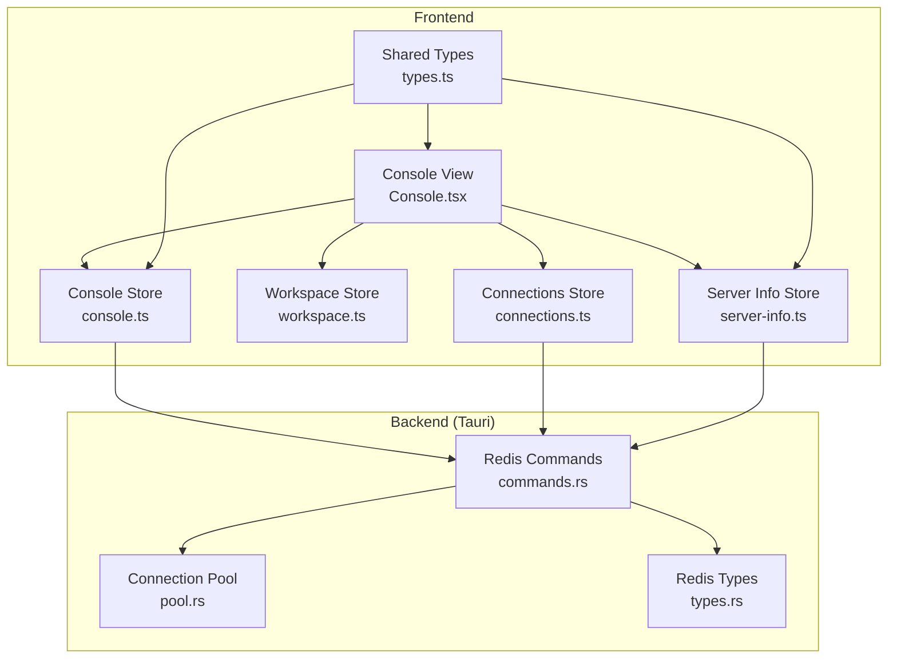
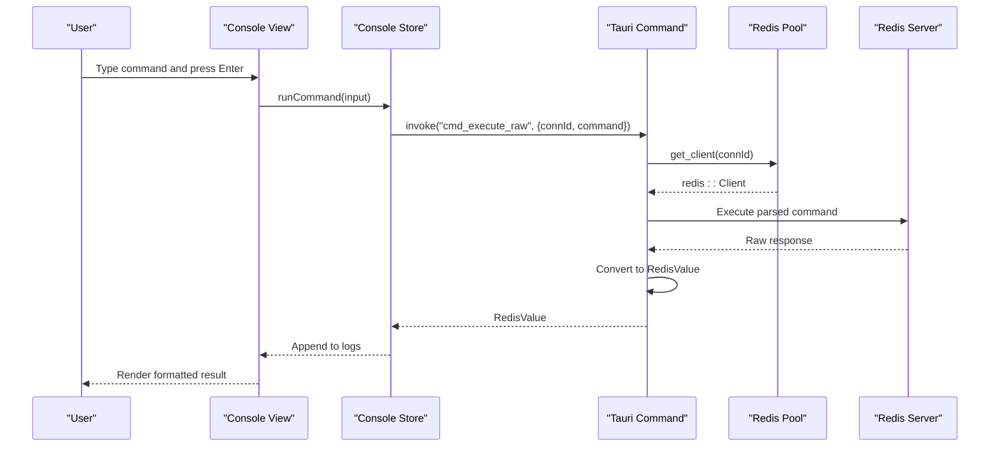
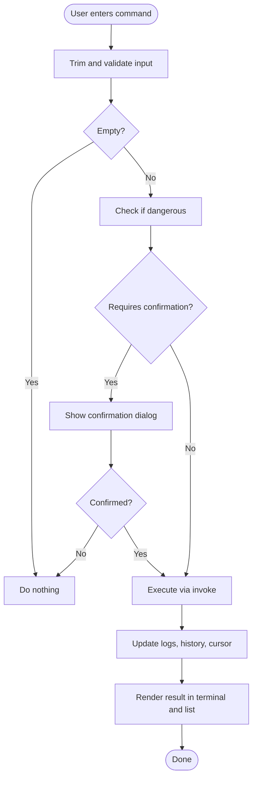
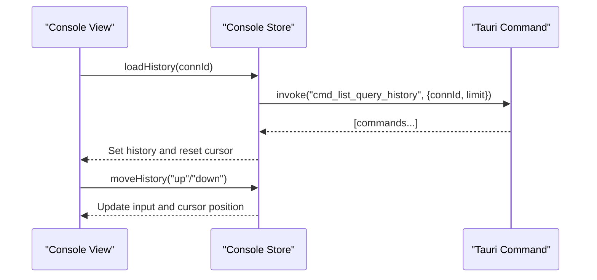
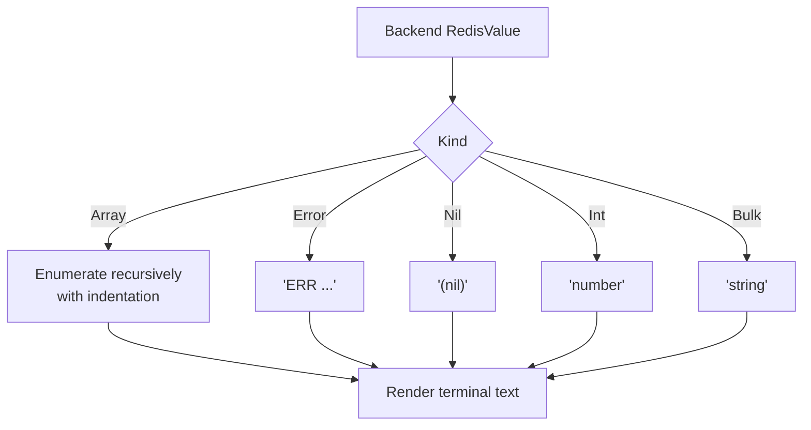
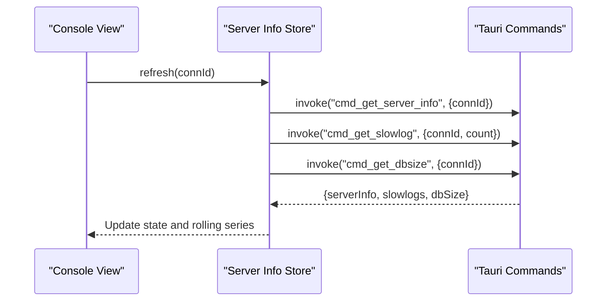
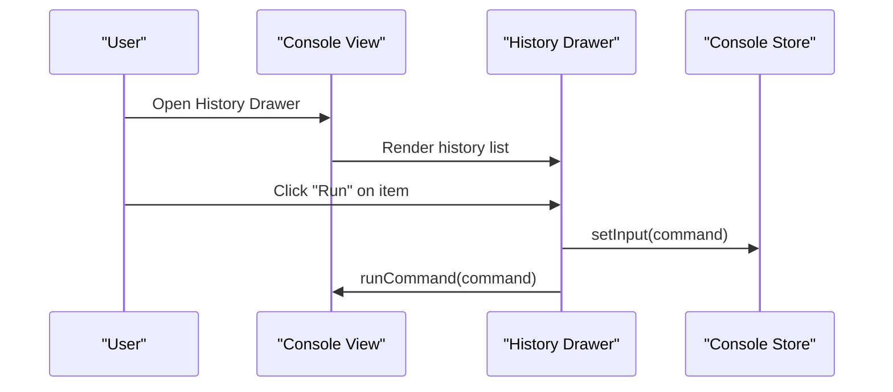
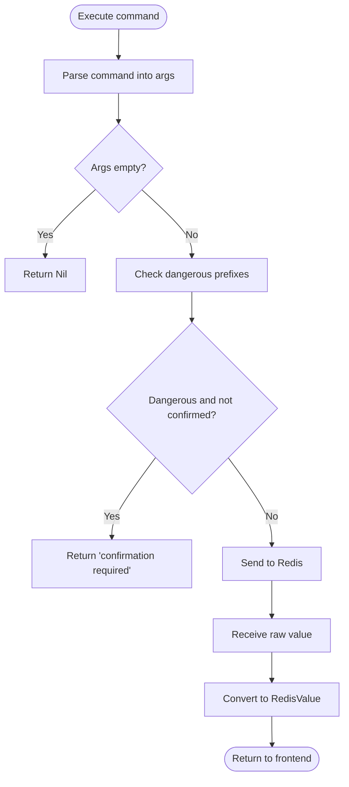
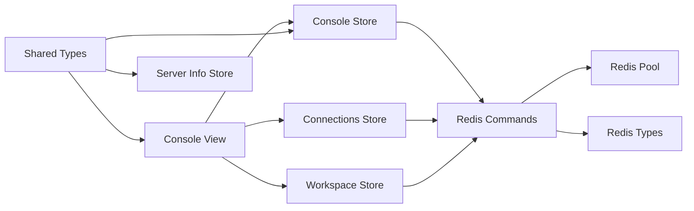

# Redis Console

<cite>
**Referenced Files in This Document**
- [Console.tsx](file://src/plugins/redis-manager/views/Console.tsx)
- [console.ts](file://src/plugins/redis-manager/store/console.ts)
- [types.ts](file://src/plugins/redis-manager/types.ts)
- [server-info.ts](file://src/plugins/redis-manager/store/server-info.ts)
- [workspace.ts](file://src/plugins/redis-manager/store/workspace.ts)
- [connections.ts](file://src/plugins/redis-manager/store/connections.ts)
- [commands.rs](file://src-tauri/src/plugins/redis/commands.rs)
- [types.rs](file://src-tauri/src/plugins/redis/types.rs)
- [pool.rs](file://src-tauri/src/plugins/redis/pool.rs)
</cite>

## Table of Contents
1. [Introduction](#introduction)
2. [Project Structure](#project-structure)
3. [Core Components](#core-components)
4. [Architecture Overview](#architecture-overview)
5. [Detailed Component Analysis](#detailed-component-analysis)
6. [Dependency Analysis](#dependency-analysis)
7. [Performance Considerations](#performance-considerations)
8. [Troubleshooting Guide](#troubleshooting-guide)
9. [Conclusion](#conclusion)

## Introduction
This document describes the Redis console interface for interactive command execution and real-time monitoring. It covers the console command input system, command history and autocomplete, response formatting and presentation, batch-style command execution via history, and integration with Redis monitoring commands. It also explains how dangerous command confirmation works, how responses are parsed and rendered, and how the console integrates with the active connection context.

## Project Structure
The Redis console spans React frontend components and a Tauri-backed Rust backend:
- Frontend: Console view, Zustand stores for console state, workspace, and server info, and shared types.
- Backend: Redis command invocations, connection pooling, and response conversion.

**Diagram sources**
- [Console.tsx:28-280](file://src/plugins/redis-manager/views/Console.tsx#L28-L280)
- [console.ts:23-75](file://src/plugins/redis-manager/store/console.ts#L23-L75)
- [workspace.ts:16-26](file://src/plugins/redis-manager/store/workspace.ts#L16-L26)
- [connections.ts:27-91](file://src/plugins/redis-manager/store/connections.ts#L27-L91)
- [server-info.ts:17-47](file://src/plugins/redis-manager/store/server-info.ts#L17-L47)
- [types.ts:85-91](file://src/plugins/redis-manager/types.ts#L85-L91)
- [commands.rs:669-781](file://src-tauri/src/plugins/redis/commands.rs#L669-L781)
- [pool.rs:39-76](file://src-tauri/src/plugins/redis/pool.rs#L39-L76)
- [types.rs:89-97](file://src-tauri/src/plugins/redis/types.rs#L89-L97)

**Section sources**
- [Console.tsx:28-280](file://src/plugins/redis-manager/views/Console.tsx#L28-L280)
- [console.ts:23-75](file://src/plugins/redis-manager/store/console.ts#L23-L75)
- [workspace.ts:16-26](file://src/plugins/redis-manager/store/workspace.ts#L16-L26)
- [connections.ts:27-91](file://src/plugins/redis-manager/store/connections.ts#L27-L91)
- [server-info.ts:17-47](file://src/plugins/redis-manager/store/server-info.ts#L17-L47)
- [types.ts:85-91](file://src/plugins/redis-manager/types.ts#L85-L91)
- [commands.rs:669-781](file://src-tauri/src/plugins/redis/commands.rs#L669-L781)
- [pool.rs:39-76](file://src-tauri/src/plugins/redis/pool.rs#L39-L76)
- [types.rs:89-97](file://src-tauri/src/plugins/redis/types.rs#L89-L97)

## Core Components
- Console View: Provides the interactive terminal-like experience, input autocomplete, command execution, history drawer, and live rendering of results.
- Console Store: Manages input, history navigation, and executes commands against the backend.
- Workspace Store: Tracks the active connection and database index used by the console.
- Connections Store: Loads available connections and supports DB selection.
- Server Info Store: Fetches and displays server metrics and slow log entries for monitoring.
- Backend Commands: Executes raw Redis commands, parses responses, writes command history, and exposes monitoring commands.

**Section sources**
- [Console.tsx:28-280](file://src/plugins/redis-manager/views/Console.tsx#L28-L280)
- [console.ts:23-75](file://src/plugins/redis-manager/store/console.ts#L23-L75)
- [workspace.ts:16-26](file://src/plugins/redis-manager/store/workspace.ts#L16-L26)
- [connections.ts:27-91](file://src/plugins/redis-manager/store/connections.ts#L27-L91)
- [server-info.ts:17-47](file://src/plugins/redis-manager/store/server-info.ts#L17-L47)
- [commands.rs:669-781](file://src-tauri/src/plugins/redis/commands.rs#L669-L781)

## Architecture Overview
The console orchestrates user input with backend Redis operations. The frontend invokes Tauri commands, which route to the Redis client pool, execute the requested command, and return typed results.

**Diagram sources**
- [Console.tsx:131-153](file://src/plugins/redis-manager/views/Console.tsx#L131-L153)
- [console.ts:54-73](file://src/plugins/redis-manager/store/console.ts#L54-L73)
- [commands.rs:669-695](file://src-tauri/src/plugins/redis/commands.rs#L669-L695)
- [pool.rs:58-67](file://src-tauri/src/plugins/redis/pool.rs#L58-L67)

## Detailed Component Analysis

### Console Input, Autocomplete, and Execution
- Input handling: The view binds the input to the console store and triggers execution on Enter or button click.
- Autocomplete: Filters a curated list of Redis command hints based on the current input prefix.
- History navigation: Up/down arrows move the cursor through stored history; the input updates accordingly.
- Dangerous command confirmation: Certain commands require explicit confirmation before execution.

**Diagram sources**
- [Console.tsx:131-153](file://src/plugins/redis-manager/views/Console.tsx#L131-L153)
- [Console.tsx:203-225](file://src/plugins/redis-manager/views/Console.tsx#L203-L225)
- [console.ts:54-73](file://src/plugins/redis-manager/store/console.ts#L54-L73)
- [commands.rs:675-679](file://src-tauri/src/plugins/redis/commands.rs#L675-L679)

**Section sources**
- [Console.tsx:131-153](file://src/plugins/redis-manager/views/Console.tsx#L131-L153)
- [Console.tsx:203-225](file://src/plugins/redis-manager/views/Console.tsx#L203-L225)
- [console.ts:54-73](file://src/plugins/redis-manager/store/console.ts#L54-L73)
- [commands.rs:675-679](file://src-tauri/src/plugins/redis/commands.rs#L675-L679)

### Command History and Navigation
- Loading history: On connection change or mount, history is fetched from the backend and stored in the console store.
- Cursor movement: Up/down arrows navigate through recent commands; the input reflects the selected history item.
- Deduplication and limits: New commands are prepended and duplicates removed, capped at a fixed size.

**Diagram sources**
- [Console.tsx:96-98](file://src/plugins/redis-manager/views/Console.tsx#L96-L98)
- [console.ts:29-53](file://src/plugins/redis-manager/store/console.ts#L29-L53)
- [commands.rs:698-704](file://src-tauri/src/plugins/redis/commands.rs#L698-L704)

**Section sources**
- [Console.tsx:96-98](file://src/plugins/redis-manager/views/Console.tsx#L96-L98)
- [console.ts:29-53](file://src/plugins/redis-manager/store/console.ts#L29-L53)
- [commands.rs:698-704](file://src-tauri/src/plugins/redis/commands.rs#L698-L704)

### Response Formatting and Rendering
- Value rendering: The console converts backend RedisValue into human-readable text. Arrays are enumerated with indentation; errors are highlighted.
- Terminal rendering: Errors are rendered with terminal escape sequences for color.
- List and terminal panes: Results appear both in a scrollable list and a terminal-like pane.

**Diagram sources**
- [Console.tsx:11-26](file://src/plugins/redis-manager/views/Console.tsx#L11-L26)
- [types.ts:85-91](file://src/plugins/redis-manager/types.ts#L85-L91)
- [types.rs:89-97](file://src-tauri/src/plugins/redis/types.rs#L89-L97)

**Section sources**
- [Console.tsx:11-26](file://src/plugins/redis-manager/views/Console.tsx#L11-L26)
- [types.ts:85-91](file://src/plugins/redis-manager/types.ts#L85-L91)
- [types.rs:89-97](file://src-tauri/src/plugins/redis/types.rs#L89-L97)

### Monitoring Commands and Real-Time Metrics
- Server info: Fetches categorized server sections (server, clients, memory, stats, replication).
- Slow log: Retrieves recent slow commands with ID, timestamp, duration, and command text.
- DB sizes: Aggregates per-DB key counts from INFO keyspace output.
- Live metrics: Server info store maintains rolling series for memory and operations metrics.

**Diagram sources**
- [server-info.ts:25-47](file://src/plugins/redis-manager/store/server-info.ts#L25-L47)
- [commands.rs:707-781](file://src-tauri/src/plugins/redis/commands.rs#L707-L781)

**Section sources**
- [server-info.ts:25-47](file://src/plugins/redis-manager/store/server-info.ts#L25-L47)
- [commands.rs:707-781](file://src-tauri/src/plugins/redis/commands.rs#L707-L781)

### Batch Execution and Templates
- Batch-style execution: Use the history drawer to re-run previous commands. Clicking “Run” fills the input and executes the selected command.
- Templates: The console provides a curated list of Redis command hints to guide input. These act as templates for quick command composition.

**Diagram sources**
- [Console.tsx:250-277](file://src/plugins/redis-manager/views/Console.tsx#L250-L277)
- [console.ts:54-73](file://src/plugins/redis-manager/store/console.ts#L54-L73)

**Section sources**
- [Console.tsx:250-277](file://src/plugins/redis-manager/views/Console.tsx#L250-L277)
- [console.ts:54-73](file://src/plugins/redis-manager/store/console.ts#L54-L73)

### Parameter Validation and Error Handling
- Dangerous command gating: Commands starting with specific prefixes require confirmation; otherwise execution fails early with a confirmation-required error.
- Input validation: Empty commands are ignored; history navigation handles bounds gracefully.
- Error propagation: Backend errors are returned as typed errors and rendered distinctly.

**Diagram sources**
- [commands.rs:675-695](file://src-tauri/src/plugins/redis/commands.rs#L675-L695)
- [console.ts:138-152](file://src/plugins/redis-manager/store/console.ts#L138-L152)

**Section sources**
- [commands.rs:675-695](file://src-tauri/src/plugins/redis/commands.rs#L675-L695)
- [console.ts:138-152](file://src/plugins/redis-manager/store/console.ts#L138-L152)

### Practical Examples

- Interactive execution
  - GET key
  - SET key value [EX seconds|PX milliseconds|EXAT unix|PXAT unix]
  - HGETALL key
  - LRANGE key start stop
  - SMEMBERS key
  - ZRANGE key start stop WITHSCORES

- Pipeline operations
  - Queue multiple commands and rely on the backend to execute them individually; the console renders each result independently.

- Transaction handling
  - The console does not implement a dedicated transaction wrapper; use MULTI/EXEC via raw command input.

- Monitoring commands
  - INFO: Retrieve categorized server sections.
  - CLIENT LIST: Use INFO with appropriate sections or external monitoring; the console focuses on INFO and slow log retrieval.
  - CONFIG GET: Use raw command input to issue CONFIG commands.

Note: The console’s autocomplete and hints include common commands to guide input. Use the history drawer to quickly re-run frequently used commands.

**Section sources**
- [Console.tsx:60-90](file://src/plugins/redis-manager/views/Console.tsx#L60-L90)
- [commands.rs:669-781](file://src-tauri/src/plugins/redis/commands.rs#L669-L781)

## Dependency Analysis
- Frontend-to-backend invocation: The console store uses Tauri invoke to call backend commands.
- Connection context: The workspace store supplies the active connection ID and DB index used by console execution and DB switching.
- Connection lifecycle: The connections store lists, saves, connects, disconnects, and selects databases.
- Response typing: Shared types define RedisValue and server info structures used across frontend and backend.

**Diagram sources**
- [Console.tsx:28-280](file://src/plugins/redis-manager/views/Console.tsx#L28-L280)
- [console.ts:23-75](file://src/plugins/redis-manager/store/console.ts#L23-L75)
- [workspace.ts:16-26](file://src/plugins/redis-manager/store/workspace.ts#L16-L26)
- [connections.ts:27-91](file://src/plugins/redis-manager/store/connections.ts#L27-L91)
- [server-info.ts:17-47](file://src/plugins/redis-manager/store/server-info.ts#L17-L47)
- [types.ts:85-91](file://src/plugins/redis-manager/types.ts#L85-L91)
- [commands.rs:669-781](file://src-tauri/src/plugins/redis/commands.rs#L669-L781)
- [pool.rs:39-76](file://src-tauri/src/plugins/redis/pool.rs#L39-L76)
- [types.rs:89-97](file://src-tauri/src/plugins/redis/types.rs#L89-L97)

**Section sources**
- [Console.tsx:28-280](file://src/plugins/redis-manager/views/Console.tsx#L28-L280)
- [console.ts:23-75](file://src/plugins/redis-manager/store/console.ts#L23-L75)
- [workspace.ts:16-26](file://src/plugins/redis-manager/store/workspace.ts#L16-L26)
- [connections.ts:27-91](file://src/plugins/redis-manager/store/connections.ts#L27-L91)
- [server-info.ts:17-47](file://src/plugins/redis-manager/store/server-info.ts#L17-L47)
- [types.ts:85-91](file://src/plugins/redis-manager/types.ts#L85-L91)
- [commands.rs:669-781](file://src-tauri/src/plugins/redis/commands.rs#L669-L781)
- [pool.rs:39-76](file://src-tauri/src/plugins/redis/pool.rs#L39-L76)
- [types.rs:89-97](file://src-tauri/src/plugins/redis/types.rs#L89-L97)

## Performance Considerations
- Command parsing: Arguments are split by whitespace; avoid extremely long single-token commands.
- History size: Stored up to a bounded number; older entries are trimmed.
- Rendering: Large arrays are indented recursively; very large outputs may impact rendering performance.
- Connection pooling: Reuses pooled clients to minimize connection overhead.

[No sources needed since this section provides general guidance]

## Troubleshooting Guide
- No active connection: The console prompts to connect before allowing input.
- Dangerous command error: Certain commands require confirmation; retry with confirmation enabled.
- Empty input ignored: Pressing Enter on empty input does nothing; ensure a command is present.
- History navigation: Up arrow cycles through history; down arrow resets input when reaching the top.

**Section sources**
- [Console.tsx:155-161](file://src/plugins/redis-manager/views/Console.tsx#L155-L161)
- [Console.tsx:138-152](file://src/plugins/redis-manager/views/Console.tsx#L138-L152)
- [console.ts:33-53](file://src/plugins/redis-manager/store/console.ts#L33-L53)

## Conclusion
The Redis console provides a streamlined, interactive interface for issuing Redis commands, reviewing command history, and monitoring server health. Its design emphasizes safety (dangerous command confirmation), usability (autocomplete and history), and clarity (typed response rendering). By leveraging the backend’s robust command execution and monitoring capabilities, it enables efficient day-to-day Redis operations within the application.