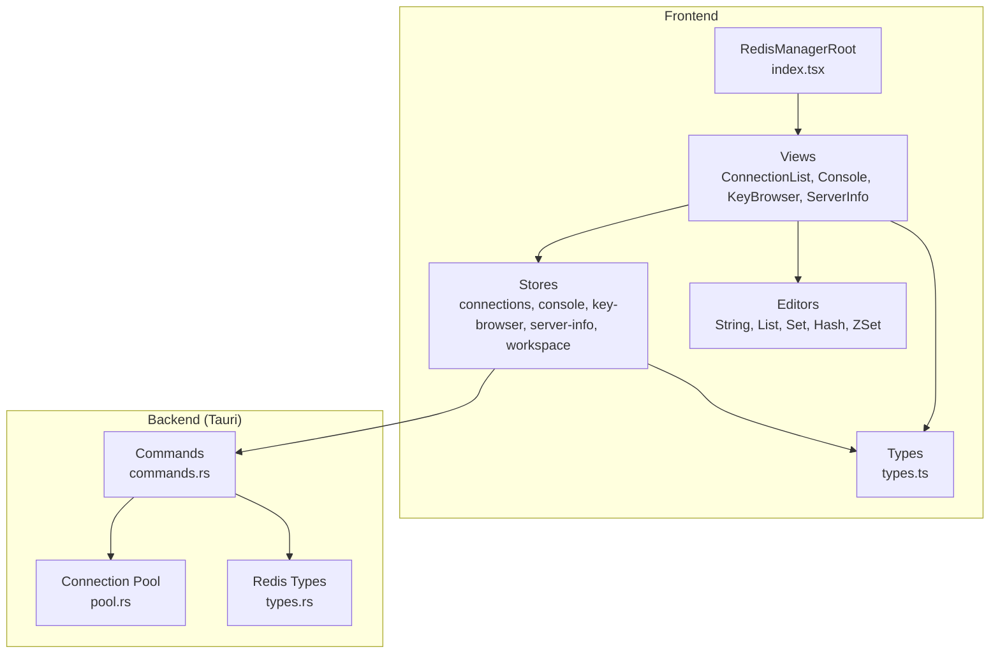
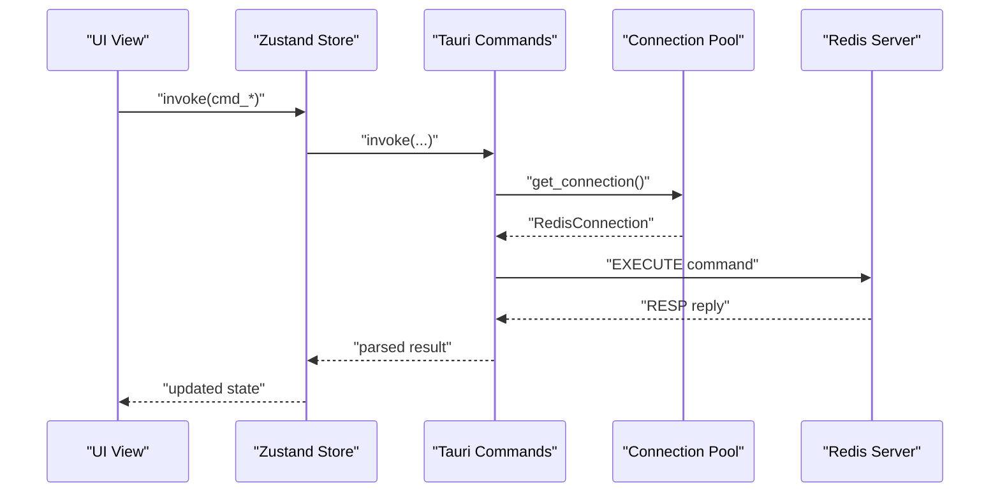
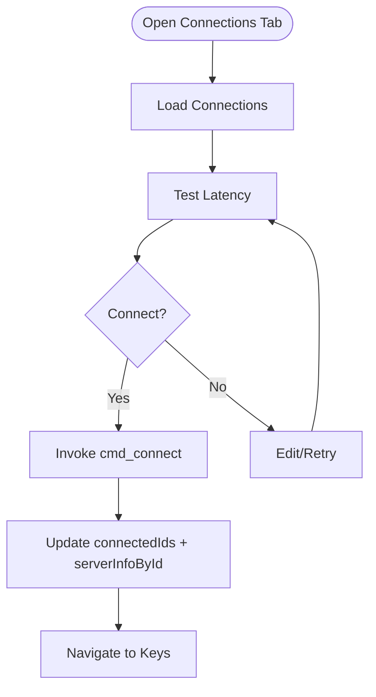
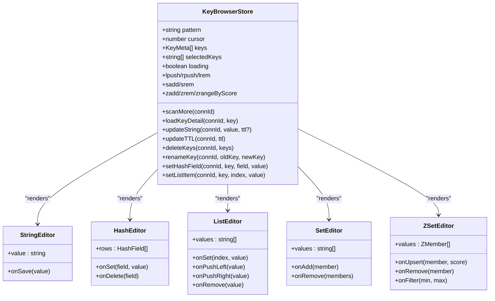
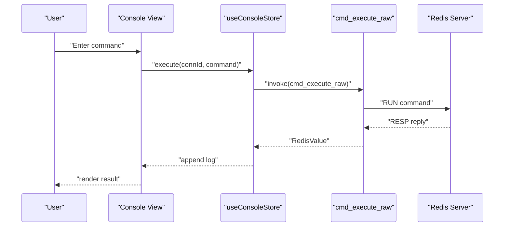
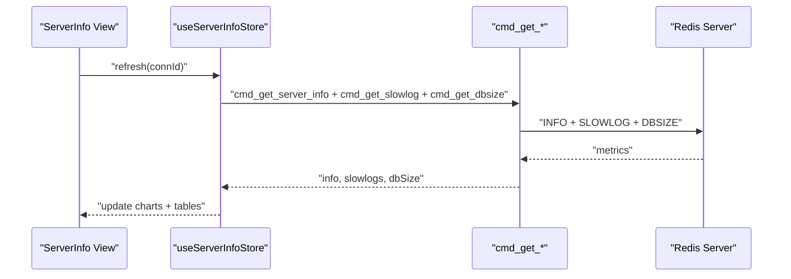
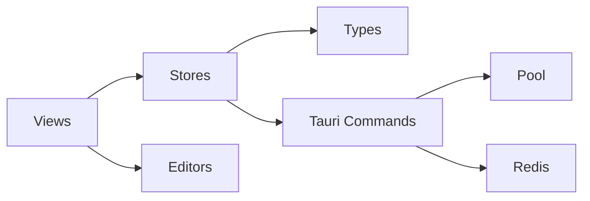

# Redis Manager

<cite>
**Referenced Files in This Document**
- [index.tsx](file://src/plugins/redis-manager/index.tsx)
- [types.ts](file://src/plugins/redis-manager/types.ts)
- [connections.ts](file://src/plugins/redis-manager/store/connections.ts)
- [console.ts](file://src/plugins/redis-manager/store/console.ts)
- [key-browser.ts](file://src/plugins/redis-manager/store/key-browser.ts)
- [server-info.ts](file://src/plugins/redis-manager/store/server-info.ts)
- [workspace.ts](file://src/plugins/redis-manager/store/workspace.ts)
- [StringEditor.tsx](file://src/plugins/redis-manager/components/editors/StringEditor.tsx)
- [ListEditor.tsx](file://src/plugins/redis-manager/components/editors/ListEditor.tsx)
- [SetEditor.tsx](file://src/plugins/redis-manager/components/editors/SetEditor.tsx)
- [HashEditor.tsx](file://src/plugins/redis-manager/components/editors/HashEditor.tsx)
- [ZSetEditor.tsx](file://src/plugins/redis-manager/components/editors/ZSetEditor.tsx)
- [ConnectionList.tsx](file://src/plugins/redis-manager/views/ConnectionList.tsx)
- [Console.tsx](file://src/plugins/redis-manager/views/Console.tsx)
- [KeyBrowser.tsx](file://src/plugins/redis-manager/views/KeyBrowser.tsx)
- [ServerInfo.tsx](file://src/plugins/redis-manager/views/ServerInfo.tsx)
- [pool.rs](file://src-tauri/src/plugins/redis/pool.rs)
- [commands.rs](file://src-tauri/src/plugins/redis/commands.rs)
- [types.rs](file://src-tauri/src/plugins/redis/types.rs)
</cite>

## Table of Contents
1. [Introduction](#introduction)
2. [Project Structure](#project-structure)
3. [Core Components](#core-components)
4. [Architecture Overview](#architecture-overview)
5. [Detailed Component Analysis](#detailed-component-analysis)
6. [Dependency Analysis](#dependency-analysis)
7. [Performance Considerations](#performance-considerations)
8. [Troubleshooting Guide](#troubleshooting-guide)
9. [Conclusion](#conclusion)
10. [Appendices](#appendices)

## Introduction
This document describes the Redis Manager plugin for RDMM, focusing on in-memory data structure server management. It covers connection management, authentication, connection pooling, the browser for exploring keys and data types, the console for executing Redis commands, and the server information panel for monitoring instance statistics. It also documents key editors for different data types, TTL management, and memory-related tools. Practical examples, security considerations, pipeline operations, error handling, and best practices are included, along with integration details within RDMM’s plugin architecture and real-time update mechanisms.

## Project Structure
The Redis Manager plugin is organized into views, stores (state management), components (editors), and shared types. The frontend communicates with backend commands via Tauri invocations. The Rust backend implements Redis command execution and connection pooling.

**Diagram sources**
- [index.tsx:14-57](file://src/plugins/redis-manager/index.tsx#L14-L57)
- [ConnectionList.tsx:20-213](file://src/plugins/redis-manager/views/ConnectionList.tsx#L20-L213)
- [Console.tsx:28-280](file://src/plugins/redis-manager/views/Console.tsx#L28-L280)
- [KeyBrowser.tsx:29-525](file://src/plugins/redis-manager/views/KeyBrowser.tsx#L29-L525)
- [ServerInfo.tsx:61-193](file://src/plugins/redis-manager/views/ServerInfo.tsx#L61-L193)
- [connections.ts:27-91](file://src/plugins/redis-manager/store/connections.ts#L27-L91)
- [console.ts:23-75](file://src/plugins/redis-manager/store/console.ts#L23-L75)
- [key-browser.ts:43-224](file://src/plugins/redis-manager/store/key-browser.ts#L43-L224)
- [server-info.ts:17-48](file://src/plugins/redis-manager/store/server-info.ts#L17-L48)
- [workspace.ts:16-26](file://src/plugins/redis-manager/store/workspace.ts#L16-L26)
- [StringEditor.tsx:9-45](file://src/plugins/redis-manager/components/editors/StringEditor.tsx#L9-L45)
- [ListEditor.tsx:12-123](file://src/plugins/redis-manager/components/editors/ListEditor.tsx#L12-L123)
- [SetEditor.tsx:10-76](file://src/plugins/redis-manager/components/editors/SetEditor.tsx#L10-L76)
- [HashEditor.tsx:12-127](file://src/plugins/redis-manager/components/editors/HashEditor.tsx#L12-L127)
- [ZSetEditor.tsx:13-82](file://src/plugins/redis-manager/components/editors/ZSetEditor.tsx#L13-L82)
- [types.ts:1-91](file://src/plugins/redis-manager/types.ts#L1-L91)
- [pool.rs](file://src-tauri/src/plugins/redis/pool.rs)
- [commands.rs](file://src-tauri/src/plugins/redis/commands.rs)
- [types.rs](file://src-tauri/src/plugins/redis/types.rs)

**Section sources**
- [index.tsx:14-67](file://src/plugins/redis-manager/index.tsx#L14-L67)
- [types.ts:1-91](file://src/plugins/redis-manager/types.ts#L1-L91)

## Core Components
- Plugin entry and routing: The plugin manifest exposes four tabs—Connections, Keys, Console, and Server—managed by a workspace store. Navigation enforces that the Keys tab requires an active connection.
- Connection management: Frontend stores encapsulate CRUD operations, connectivity state, latency testing, and database selection. Backend commands handle actual Redis connections and pooling.
- Key browsing and editing: A paginated scanning mechanism loads keys by pattern, with per-type editors for strings, hashes, lists, sets, and sorted sets. TTL updates and batch operations are supported.
- Console: A command-line-like interface with history, autocomplete hints, and terminal rendering. Dangerous commands require confirmation.
- Server info: Real-time charts and tables for memory usage, operations per second, DB sizes, and slowlog entries.

**Section sources**
- [index.tsx:14-57](file://src/plugins/redis-manager/index.tsx#L14-L57)
- [workspace.ts:16-26](file://src/plugins/redis-manager/store/workspace.ts#L16-L26)
- [connections.ts:27-91](file://src/plugins/redis-manager/store/connections.ts#L27-L91)
- [key-browser.ts:43-224](file://src/plugins/redis-manager/store/key-browser.ts#L43-L224)
- [console.ts:23-75](file://src/plugins/redis-manager/store/console.ts#L23-L75)
- [server-info.ts:17-48](file://src/plugins/redis-manager/store/server-info.ts#L17-L48)

## Architecture Overview
The plugin follows a layered architecture:
- UI Layer: React components and views manage user interactions.
- Store Layer: Zustand stores orchestrate state and async operations via Tauri invocations.
- Command Layer: Tauri backend executes Redis commands and manages pools.
- Pool Layer: Reusable connection pools isolate connections per Redis topology (standalone, sentinel, cluster).

**Diagram sources**
- [connections.ts:36-68](file://src/plugins/redis-manager/store/connections.ts#L36-L68)
- [key-browser.ts:66-82](file://src/plugins/redis-manager/store/key-browser.ts#L66-L82)
- [console.ts:54-73](file://src/plugins/redis-manager/store/console.ts#L54-L73)
- [server-info.ts:25-46](file://src/plugins/redis-manager/store/server-info.ts#L25-L46)
- [commands.rs](file://src-tauri/src/plugins/redis/commands.rs)
- [pool.rs](file://src-tauri/src/plugins/redis/pool.rs)

## Detailed Component Analysis

### Connection Management
- Connection lifecycle: Create, list, test latency, connect/disconnect, select DB, and remove.
- Authentication: Password is captured in forms and passed to backend commands.
- Topology support: Standalone, Sentinel, and Cluster connection types are modeled and persisted.
- Real-time updates: Connected state and server info are tracked per connection ID.

**Diagram sources**
- [ConnectionList.tsx:39-83](file://src/plugins/redis-manager/views/ConnectionList.tsx#L39-L83)
- [connections.ts:33-89](file://src/plugins/redis-manager/store/connections.ts#L33-L89)

**Section sources**
- [ConnectionList.tsx:20-213](file://src/plugins/redis-manager/views/ConnectionList.tsx#L20-L213)
- [connections.ts:27-91](file://src/plugins/redis-manager/store/connections.ts#L27-L91)
- [types.ts:1-23](file://src/plugins/redis-manager/types.ts#L1-L23)

### Key Browser and Editors
- Scanning: Pattern-based SCAN with cursor pagination and COUNT batching.
- Type-specific editors:
  - String: JSON formatting helper and byte-size indicator.
  - Hash: Field/value CRUD with filtering and inline edit.
  - List: Push/pop operations, index-based editing, and removal.
  - Set: Member search, add/remove, and bulk selection.
  - Sorted Set: Score-based filtering, upsert, and removal.
- Key operations: Rename, delete, TTL update, batch TTL, export/import.

**Diagram sources**
- [key-browser.ts:43-224](file://src/plugins/redis-manager/store/key-browser.ts#L43-L224)
- [StringEditor.tsx:9-45](file://src/plugins/redis-manager/components/editors/StringEditor.tsx#L9-L45)
- [HashEditor.tsx:12-127](file://src/plugins/redis-manager/components/editors/HashEditor.tsx#L12-L127)
- [ListEditor.tsx:12-123](file://src/plugins/redis-manager/components/editors/ListEditor.tsx#L12-L123)
- [SetEditor.tsx:10-76](file://src/plugins/redis-manager/components/editors/SetEditor.tsx#L10-L76)
- [ZSetEditor.tsx:13-82](file://src/plugins/redis-manager/components/editors/ZSetEditor.tsx#L13-L82)

**Section sources**
- [KeyBrowser.tsx:29-525](file://src/plugins/redis-manager/views/KeyBrowser.tsx#L29-L525)
- [key-browser.ts:66-224](file://src/plugins/redis-manager/store/key-browser.ts#L66-L224)
- [StringEditor.tsx:9-45](file://src/plugins/redis-manager/components/editors/StringEditor.tsx#L9-L45)
- [HashEditor.tsx:12-127](file://src/plugins/redis-manager/components/editors/HashEditor.tsx#L12-L127)
- [ListEditor.tsx:12-123](file://src/plugins/redis-manager/components/editors/ListEditor.tsx#L12-L123)
- [SetEditor.tsx:10-76](file://src/plugins/redis-manager/components/editors/SetEditor.tsx#L10-L76)
- [ZSetEditor.tsx:13-82](file://src/plugins/redis-manager/components/editors/ZSetEditor.tsx#L13-L82)

### Console
- Features: Autocomplete hints, command history navigation, terminal-like output, and drawer history.
- Safety: Dangerous commands prompt for confirmation before execution.
- Execution: Results are rendered with color-coded error handling.

**Diagram sources**
- [Console.tsx:131-153](file://src/plugins/redis-manager/views/Console.tsx#L131-L153)
- [console.ts:54-73](file://src/plugins/redis-manager/store/console.ts#L54-L73)

**Section sources**
- [Console.tsx:28-280](file://src/plugins/redis-manager/views/Console.tsx#L28-L280)
- [console.ts:23-75](file://src/plugins/redis-manager/store/console.ts#L23-L75)

### Server Information Panel
- Metrics: Used memory, connected clients, instantaneous ops/sec, role.
- Charts: Memory trend and operations trend using ECharts.
- DB size: Bar chart and table of keys per logical DB.
- Slowlog: Recent slow commands with timestamps and durations.

**Diagram sources**
- [ServerInfo.tsx:72-79](file://src/plugins/redis-manager/views/ServerInfo.tsx#L72-L79)
- [server-info.ts:25-46](file://src/plugins/redis-manager/store/server-info.ts#L25-L46)

**Section sources**
- [ServerInfo.tsx:61-193](file://src/plugins/redis-manager/views/ServerInfo.tsx#L61-L193)
- [server-info.ts:17-48](file://src/plugins/redis-manager/store/server-info.ts#L17-L48)

## Dependency Analysis
- Frontend-to-backend invocation contract: Stores call Tauri commands by name; backend implements handlers and uses a connection pool.
- Internal coupling: Views depend on stores; stores depend on types; editors are reusable UI components.
- External dependencies: Ant Design for UI, xterm for terminal emulation, ECharts for charts.

**Diagram sources**
- [index.tsx:6-9](file://src/plugins/redis-manager/index.tsx#L6-L9)
- [connections.ts:2-9](file://src/plugins/redis-manager/store/connections.ts#L2-L9)
- [key-browser.ts:2-4](file://src/plugins/redis-manager/store/key-browser.ts#L2-L4)
- [console.ts:2-4](file://src/plugins/redis-manager/store/console.ts#L2-L4)
- [server-info.ts:2-4](file://src/plugins/redis-manager/store/server-info.ts#L2-L4)
- [commands.rs](file://src-tauri/src/plugins/redis/commands.rs)
- [pool.rs](file://src-tauri/src/plugins/redis/pool.rs)

**Section sources**
- [types.ts:1-91](file://src/plugins/redis-manager/types.ts#L1-L91)
- [connections.ts:27-91](file://src/plugins/redis-manager/store/connections.ts#L27-L91)
- [key-browser.ts:43-224](file://src/plugins/redis-manager/store/key-browser.ts#L43-L224)
- [console.ts:23-75](file://src/plugins/redis-manager/store/console.ts#L23-L75)
- [server-info.ts:17-48](file://src/plugins/redis-manager/store/server-info.ts#L17-L48)

## Performance Considerations
- Pagination and batching: SCAN uses COUNT=200 to balance responsiveness and throughput.
- Parallel metrics: Server info refreshes INFO, SLOWLOG, and DBSIZE concurrently.
- Lightweight rendering: Editors avoid unnecessary re-renders using memoization and immutable updates.
- Terminal output: Rendered values are formatted efficiently; errors are color-coded for quick identification.
- Recommendations:
  - Prefer patterned scans with wildcards carefully to avoid long-running operations.
  - Use batch TTL operations for bulk updates.
  - Monitor slowlog regularly and tune expensive commands.

[No sources needed since this section provides general guidance]

## Troubleshooting Guide
- Connection failures:
  - Verify credentials and network reachability.
  - Use latency test before connect to detect timeouts.
- Command errors:
  - Console renders ERR responses; review command syntax and arguments.
  - Dangerous commands require confirmation; confirm when prompted.
- Key editing issues:
  - Ensure the selected key type matches the editor in use.
  - For large lists/sets/zsets, prefer batch operations and filtering.
- Server info delays:
  - Refresh interval is 5 seconds; wait for next poll or manually refresh.
- Import/export:
  - Ensure import files are placed under the expected application data path.
  - Review import error summaries for failed entries.

**Section sources**
- [Console.tsx:131-153](file://src/plugins/redis-manager/views/Console.tsx#L131-L153)
- [KeyBrowser.tsx:466-521](file://src/plugins/redis-manager/views/KeyBrowser.tsx#L466-L521)
- [ServerInfo.tsx:72-79](file://src/plugins/redis-manager/views/ServerInfo.tsx#L72-L79)

## Conclusion
The Redis Manager plugin integrates tightly with RDMM’s plugin architecture to provide a comprehensive Redis administration experience. It supports secure connections, robust browsing and editing of diverse data types, a powerful console with safety checks, and real-time server monitoring. The backend leverages a connection pool abstraction to handle different Redis topologies reliably.

[No sources needed since this section summarizes without analyzing specific files]

## Appendices

### Practical Examples
- Connecting to a Redis instance:
  - Open Connections, add a new connection with host/port/password/dbIndex, test latency, then connect.
  - Switch active DB and navigate to Keys.
- Browsing key-value pairs:
  - Enter a pattern (e.g., “user:*”) and scan; select a key to view details.
  - Use type-specific editors to modify values.
- Executing Redis commands:
  - Type commands in the Console; use autocomplete hints.
  - Review terminal-style output and command history.
- Managing data expiration:
  - Set TTL per key or apply batch TTL to selected keys.
- Monitoring server performance:
  - Observe memory and ops trends; check slowlog for problematic commands.

[No sources needed since this section provides general guidance]

### Security and Best Practices
- Authentication:
  - Store passwords securely; avoid sharing saved configurations.
  - Prefer TLS-enabled connections when available.
- Pipeline operations:
  - Group related operations to reduce round-trips; monitor latency.
- Error handling:
  - Treat ERR responses as actionable failures; confirm dangerous commands.
- Best practices:
  - Use patterns cautiously to prevent blocking operations.
  - Regularly review slowlog and optimize hotspots.
  - Back up critical data before mass edits.

[No sources needed since this section provides general guidance]