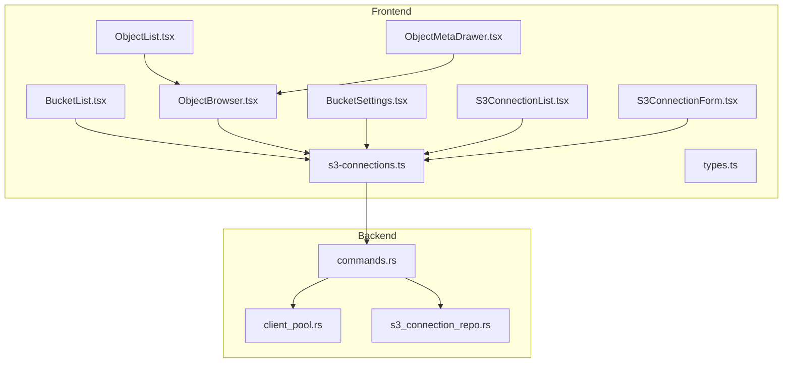
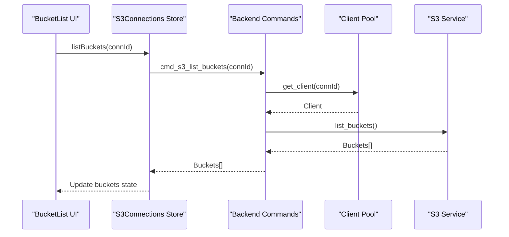
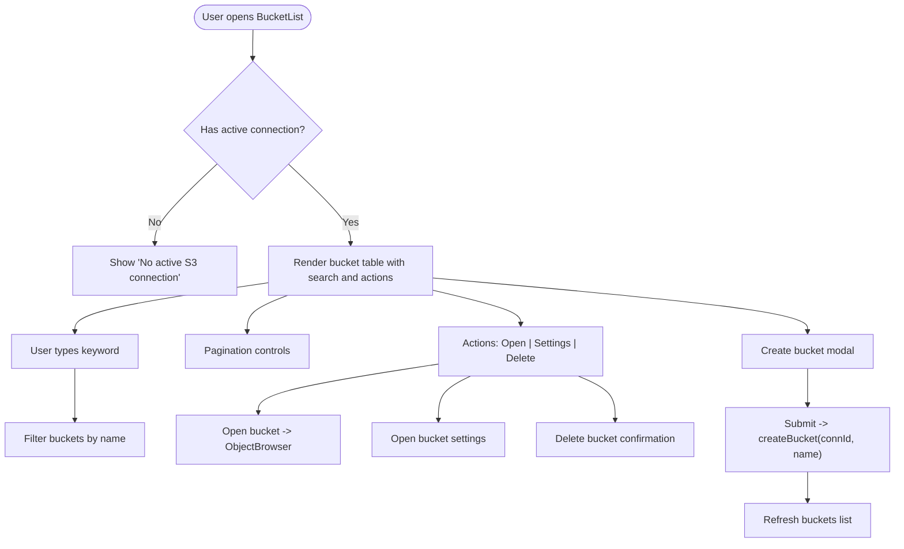
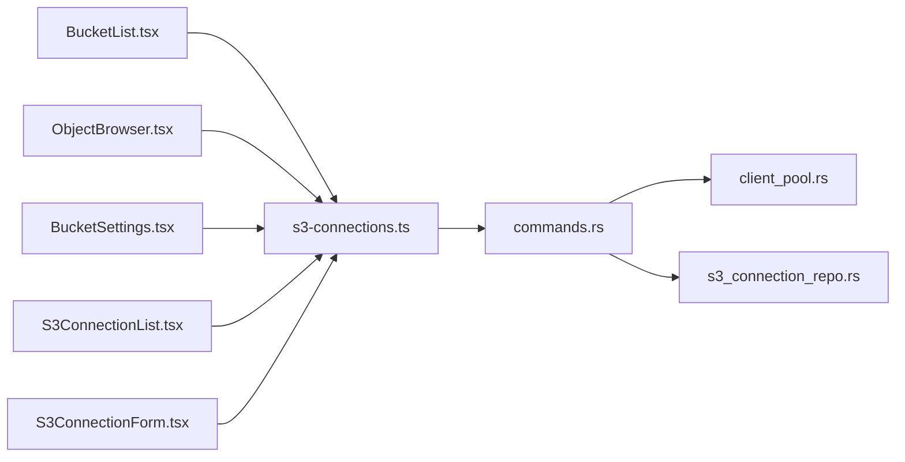

# Bucket Browser

<cite>
**Referenced Files in This Document**
- [BucketList.tsx](file://src/plugins/s3-client/views/BucketList.tsx)
- [s3-connections.ts](file://src/plugins/s3-client/store/s3-connections.ts)
- [BucketSettings.tsx](file://src/plugins/s3-client/components/BucketSettings.tsx)
- [ObjectBrowser.tsx](file://src/plugins/s3-client/views/ObjectBrowser.tsx)
- [ObjectList.tsx](file://src/plugins/s3-client/components/ObjectList.tsx)
- [ObjectMetaDrawer.tsx](file://src/plugins/s3-client/components/ObjectMetaDrawer.tsx)
- [S3ConnectionList.tsx](file://src/plugins/s3-client/views/S3ConnectionList.tsx)
- [S3ConnectionForm.tsx](file://src/plugins/s3-client/components/S3ConnectionForm.tsx)
- [types.ts](file://src/plugins/s3-client/types.ts)
- [commands.rs](file://src-tauri/src/plugins/s3/commands.rs)
- [client_pool.rs](file://src-tauri/src/plugins/s3/client_pool.rs)
- [s3_connection_repo.rs](file://src-tauri/src/db/s3_connection_repo.rs)
</cite>

## Table of Contents
1. [Introduction](#introduction)
2. [Project Structure](#project-structure)
3. [Core Components](#core-components)
4. [Architecture Overview](#architecture-overview)
5. [Detailed Component Analysis](#detailed-component-analysis)
6. [Dependency Analysis](#dependency-analysis)
7. [Performance Considerations](#performance-considerations)
8. [Troubleshooting Guide](#troubleshooting-guide)
9. [Conclusion](#conclusion)

## Introduction
This document describes the S3 bucket browsing functionality, focusing on the bucket list interface, filtering and search capabilities, metadata display, settings configuration, and operational workflows. It explains how users can explore available storage buckets, apply filters, view bucket statistics, configure bucket properties, and manage permissions. The documentation covers pagination handling for large bucket lists, performance optimization for bucket enumeration, error handling for access issues, and integration with AWS SDK operations.

## Project Structure
The S3 client plugin consists of React components for the UI, a Zustand store for state management, and a Rust backend that integrates with the AWS SDK. The frontend components coordinate with the backend through Tauri commands to perform S3 operations.

**Diagram sources**
- [BucketList.tsx:19-191](file://src/plugins/s3-client/views/BucketList.tsx#L19-L191)
- [ObjectBrowser.tsx:27-468](file://src/plugins/s3-client/views/ObjectBrowser.tsx#L27-L468)
- [ObjectList.tsx:53-287](file://src/plugins/s3-client/components/ObjectList.tsx#L53-L287)
- [ObjectMetaDrawer.tsx:15-137](file://src/plugins/s3-client/components/ObjectMetaDrawer.tsx#L15-L137)
- [BucketSettings.tsx:14-136](file://src/plugins/s3-client/components/BucketSettings.tsx#L14-L136)
- [S3ConnectionList.tsx:32-215](file://src/plugins/s3-client/views/S3ConnectionList.tsx#L32-L215)
- [S3ConnectionForm.tsx:42-227](file://src/plugins/s3-client/components/S3ConnectionForm.tsx#L42-L227)
- [s3-connections.ts:137-432](file://src/plugins/s3-client/store/s3-connections.ts#L137-L432)
- [types.ts:1-110](file://src/plugins/s3-client/types.ts#L1-L110)
- [commands.rs:1-1164](file://src-tauri/src/plugins/s3/commands.rs#L1-L1164)
- [client_pool.rs:1-86](file://src-tauri/src/plugins/s3/client_pool.rs#L1-L86)
- [s3_connection_repo.rs:1-188](file://src-tauri/src/db/s3_connection_repo.rs#L1-L188)

**Section sources**
- [BucketList.tsx:1-191](file://src/plugins/s3-client/views/BucketList.tsx#L1-L191)
- [ObjectBrowser.tsx:1-468](file://src/plugins/s3-client/views/ObjectBrowser.tsx#L1-L468)
- [s3-connections.ts:1-432](file://src/plugins/s3-client/store/s3-connections.ts#L1-L432)
- [commands.rs:1-1164](file://src-tauri/src/plugins/s3/commands.rs#L1-L1164)
- [client_pool.rs:1-86](file://src-tauri/src/plugins/s3/client_pool.rs#L1-L86)
- [s3_connection_repo.rs:1-188](file://src-tauri/src/db/s3_connection_repo.rs#L1-L188)

## Core Components
- BucketList: Renders the bucket table, search/filter, pagination, actions (open, settings, delete), and creation modal.
- ObjectBrowser: Provides object listing with breadcrumb navigation, sorting, filtering, and bulk operations.
- BucketSettings: Manages bucket-level configurations including versioning and policy.
- S3Connections store: Centralizes state and exposes actions for listing buckets, creating/deleting buckets, listing objects, and invoking backend commands.
- Backend commands: Implements AWS SDK integration for bucket and object operations, including listing, creating, deleting, and metadata retrieval.

**Section sources**
- [BucketList.tsx:19-191](file://src/plugins/s3-client/views/BucketList.tsx#L19-L191)
- [ObjectBrowser.tsx:27-468](file://src/plugins/s3-client/views/ObjectBrowser.tsx#L27-L468)
- [BucketSettings.tsx:14-136](file://src/plugins/s3-client/components/BucketSettings.tsx#L14-L136)
- [s3-connections.ts:137-432](file://src/plugins/s3-client/store/s3-connections.ts#L137-L432)
- [commands.rs:210-344](file://src-tauri/src/plugins/s3/commands.rs#L210-L344)

## Architecture Overview
The frontend communicates with the backend via Tauri commands. The store orchestrates UI interactions and delegates to backend commands. The backend uses a client pool to manage AWS SDK clients per connection and performs operations against S3-compatible services.

**Diagram sources**
- [BucketList.tsx:80-84](file://src/plugins/s3-client/views/BucketList.tsx#L80-L84)
- [s3-connections.ts:197-205](file://src/plugins/s3-client/store/s3-connections.ts#L197-L205)
- [commands.rs:210-249](file://src-tauri/src/plugins/s3/commands.rs#L210-L249)
- [client_pool.rs:61-69](file://src-tauri/src/plugins/s3/client_pool.rs#L61-L69)

## Detailed Component Analysis

### Bucket List Interface
The bucket list displays available buckets, supports search by name, pagination, and provides actions to open a bucket, view settings, and delete a bucket. It also includes a creation modal for new buckets.

Key behaviors:
- Keyword search filters buckets by name.
- Pagination controls allow navigating filtered results.
- Double-clicking a row opens the object browser for that bucket.
- Refresh button triggers a fresh bucket listing.
- Create bucket modal validates input and invokes backend creation.

**Diagram sources**
- [BucketList.tsx:19-191](file://src/plugins/s3-client/views/BucketList.tsx#L19-L191)

**Section sources**
- [BucketList.tsx:19-191](file://src/plugins/s3-client/views/BucketList.tsx#L19-L191)
- [s3-connections.ts:197-215](file://src/plugins/s3-client/store/s3-connections.ts#L197-L215)

### Filtering and Search Capabilities
- Frontend filtering: Case-insensitive substring match on bucket name.
- Real-time pagination: Reset page to 1 when filters change; pagination total reflects filtered length.
- Keyword state: Controlled by Input.Search component; cleared on refresh.

Practical example:
- Enter "logs" in the search box to filter buckets whose names contain "logs".
- Change filters to narrow results; pagination resets automatically.

**Section sources**
- [BucketList.tsx:38-46](file://src/plugins/s3-client/views/BucketList.tsx#L38-L46)

### Bucket Metadata Display
- Overview tab in BucketSettings shows region, object count, total size, and storage class breakdown.
- Statistics are computed by iterating paginated object listings and aggregating counts and sizes.

Practical example:
- Open bucket settings for a bucket to view total object count and storage class distribution.

**Section sources**
- [BucketSettings.tsx:31-60](file://src/plugins/s3-client/components/BucketSettings.tsx#L31-L60)
- [commands.rs:1115-1151](file://src-tauri/src/plugins/s3/commands.rs#L1115-L1151)

### Bucket Settings Configuration
- Versioning: Toggle switch to enable/disable versioning; updates backend state and reflects current status.
- Policy: JSON editor for bucket policy; supports save and delete operations with validation.

Practical example:
- Enable versioning for a bucket to preserve multiple versions of objects.
- Apply a bucket policy to restrict access or enable public reads.

**Section sources**
- [BucketSettings.tsx:62-131](file://src/plugins/s3-client/components/BucketSettings.tsx#L62-L131)
- [commands.rs:291-315](file://src-tauri/src/plugins/s3/commands.rs#L291-L315)
- [commands.rs:984-1037](file://src-tauri/src/plugins/s3/commands.rs#L984-L1037)

### Bucket Operations
- Creation: Validates non-empty name; invokes backend create bucket; refreshes bucket list.
- Deletion: Requires empty bucket; confirmation dialog; refreshes bucket list.
- Listing: Uses list_buckets with fallback to manual bucket names when ListBuckets is disallowed.

Practical example:
- Click "New Bucket", enter a name, submit to create a new bucket.
- Right-click a bucket and choose "Delete"; confirm to remove it.

**Section sources**
- [BucketList.tsx:159-181](file://src/plugins/s3-client/views/BucketList.tsx#L159-L181)
- [s3-connections.ts:206-215](file://src/plugins/s3-client/store/s3-connections.ts#L206-L215)
- [commands.rs:318-344](file://src-tauri/src/plugins/s3/commands.rs#L318-L344)
- [commands.rs:346-359](file://src-tauri/src/plugins/s3/commands.rs#L346-L359)
- [commands.rs:210-249](file://src-tauri/src/plugins/s3/commands.rs#L210-L249)

### Object Browser and Pagination
- Breadcrumb navigation: Clickable segments to navigate up the prefix hierarchy.
- Sorting: Sort by name, size, or last modified.
- Filtering: Text search on object names.
- Pagination: "Load More" button uses continuation tokens to fetch additional objects.
- View modes: List and grid layouts with context menus for actions.

Practical example:
- Navigate into a folder using breadcrumb; adjust sort order; click "Load More" to enumerate deeper results.

**Section sources**
- [ObjectBrowser.tsx:103-107](file://src/plugins/s3-client/views/ObjectBrowser.tsx#L103-L107)
- [ObjectBrowser.tsx:168-188](file://src/plugins/s3-client/views/ObjectBrowser.tsx#L168-L188)
- [ObjectBrowser.tsx:305-320](file://src/plugins/s3-client/views/ObjectBrowser.tsx#L305-L320)
- [ObjectList.tsx:89-158](file://src/plugins/s3-client/components/ObjectList.tsx#L89-L158)

### Object Metadata and Tags
- Object details drawer shows key, content type, size, ETag, last modified, storage class, and version ID.
- Metadata table displays key-value pairs attached to the object.
- Tags management: Add, edit, save, and reload tags for objects.

Practical example:
- Select an object, open details, and edit tags to categorize content.

**Section sources**
- [ObjectMetaDrawer.tsx:30-134](file://src/plugins/s3-client/components/ObjectMetaDrawer.tsx#L30-L134)
- [commands.rs:1040-1095](file://src-tauri/src/plugins/s3/commands.rs#L1040-L1095)

### Connection Management
- Connection list: Grouped cards with connect/disconnect/edit/delete actions.
- Connection form: Supports basic and advanced settings including provider, region, endpoint, path-style access, and manual bucket names.
- Test connection: Measures latency to validate connectivity.

Practical example:
- Add a new connection, test it, then connect to open the bucket list.

**Section sources**
- [S3ConnectionList.tsx:32-215](file://src/plugins/s3-client/views/S3ConnectionList.tsx#L32-L215)
- [S3ConnectionForm.tsx:42-227](file://src/plugins/s3-client/components/S3ConnectionForm.tsx#L42-L227)
- [commands.rs:35-91](file://src-tauri/src/plugins/s3/commands.rs#L35-L91)

## Dependency Analysis
The frontend store depends on Tauri invocations to backend commands. The backend manages AWS SDK clients via a pool and persists connection information in a database.

**Diagram sources**
- [s3-connections.ts:137-432](file://src/plugins/s3-client/store/s3-connections.ts#L137-L432)
- [commands.rs:1-1164](file://src-tauri/src/plugins/s3/commands.rs#L1-L1164)
- [client_pool.rs:1-86](file://src-tauri/src/plugins/s3/client_pool.rs#L1-L86)
- [s3_connection_repo.rs:1-188](file://src-tauri/src/db/s3_connection_repo.rs#L1-L188)
- [BucketList.tsx:19-191](file://src/plugins/s3-client/views/BucketList.tsx#L19-L191)
- [ObjectBrowser.tsx:27-468](file://src/plugins/s3-client/views/ObjectBrowser.tsx#L27-L468)
- [BucketSettings.tsx:14-136](file://src/plugins/s3-client/components/BucketSettings.tsx#L14-L136)
- [S3ConnectionList.tsx:32-215](file://src/plugins/s3-client/views/S3ConnectionList.tsx#L32-L215)
- [S3ConnectionForm.tsx:42-227](file://src/plugins/s3-client/components/S3ConnectionForm.tsx#L42-L227)

**Section sources**
- [s3-connections.ts:137-432](file://src/plugins/s3-client/store/s3-connections.ts#L137-L432)
- [commands.rs:1-1164](file://src-tauri/src/plugins/s3/commands.rs#L1-L1164)
- [client_pool.rs:1-86](file://src-tauri/src/plugins/s3/client_pool.rs#L1-L86)
- [s3_connection_repo.rs:1-188](file://src-tauri/src/db/s3_connection_repo.rs#L1-L188)

## Performance Considerations
- Pagination and continuation tokens: The backend limits list_objects results per request and uses continuation tokens to fetch more items efficiently. The frontend supports "Load More" to append results.
- Max keys tuning: The store sets a default of 200 objects per page for object listing.
- Manual bucket fallback: When ListBuckets is restricted, the backend falls back to configured manual bucket names to avoid failures.
- Virtualized tables: ObjectList uses virtualization to render large datasets efficiently.

Practical tips:
- Use the "Load More" button to incrementally load large object sets.
- Adjust page size in the bucket list for better responsiveness.
- Prefer prefix-based filtering to reduce object enumeration.

**Section sources**
- [s3-connections.ts:225-245](file://src/plugins/s3-client/store/s3-connections.ts#L225-L245)
- [commands.rs:362-430](file://src-tauri/src/plugins/s3/commands.rs#L362-L430)
- [ObjectList.tsx:170-176](file://src/plugins/s3-client/components/ObjectList.tsx#L170-L176)

## Troubleshooting Guide
Common issues and resolutions:
- No active S3 connection: Ensure a connection is selected and connected before browsing buckets.
- ListBuckets access denied: Configure manual bucket names in the connection form to bypass restricted permissions.
- Bucket deletion fails: Ensure the bucket is empty; the backend requires an empty bucket for deletion.
- Policy errors: Validate JSON syntax before saving; handle "NoSuchBucketPolicy" gracefully.
- Versioning toggle: Confirm the operation succeeded and refresh the bucket settings to reflect the new status.

Operational checks:
- Test connection to verify latency and endpoint reachability.
- Use object details to inspect metadata and tags for troubleshooting.
- Leverage "Load More" to enumerate hidden objects due to pagination limits.

**Section sources**
- [S3ConnectionList.tsx:75-83](file://src/plugins/s3-client/views/S3ConnectionList.tsx#L75-L83)
- [S3ConnectionForm.tsx:208-217](file://src/plugins/s3-client/components/S3ConnectionForm.tsx#L208-L217)
- [commands.rs:210-249](file://src-tauri/src/plugins/s3/commands.rs#L210-L249)
- [commands.rs:346-359](file://src-tauri/src/plugins/s3/commands.rs#L346-L359)
- [commands.rs:984-1037](file://src-tauri/src/plugins/s3/commands.rs#L984-L1037)
- [commands.rs:291-315](file://src-tauri/src/plugins/s3/commands.rs#L291-L315)

## Conclusion
The S3 bucket browser provides a comprehensive interface for exploring, filtering, and managing S3-compatible storage. It integrates tightly with AWS SDK operations through a robust backend, offers efficient pagination and virtualized rendering, and supports essential bucket and object operations. Users can configure bucket properties, apply policies, and manage permissions securely, while the system handles edge cases such as restricted ListBuckets access and large dataset enumeration.