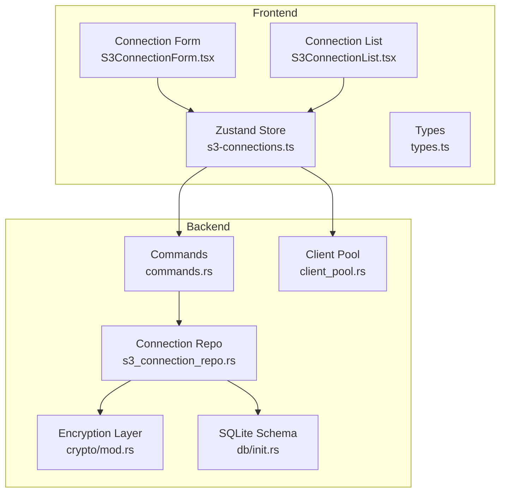
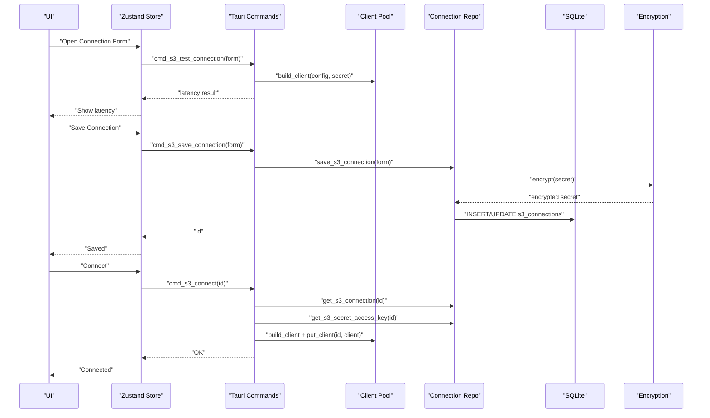
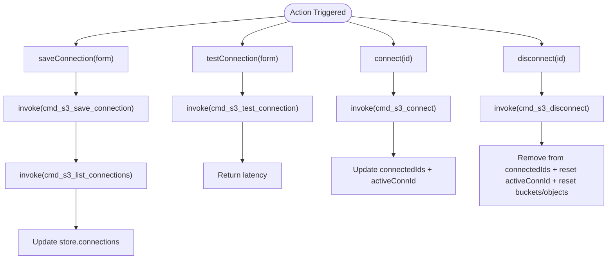
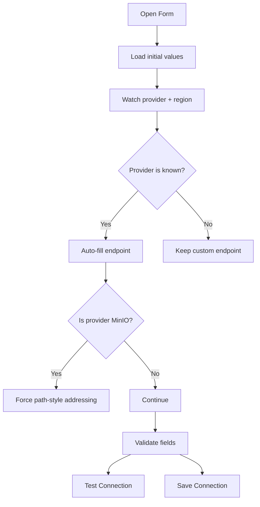
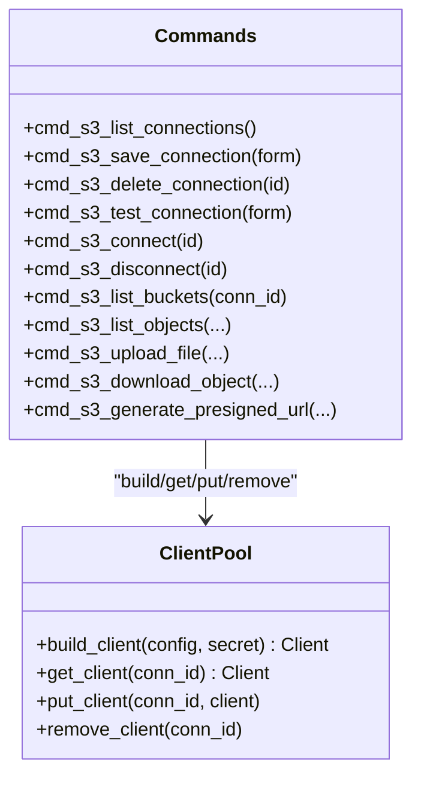
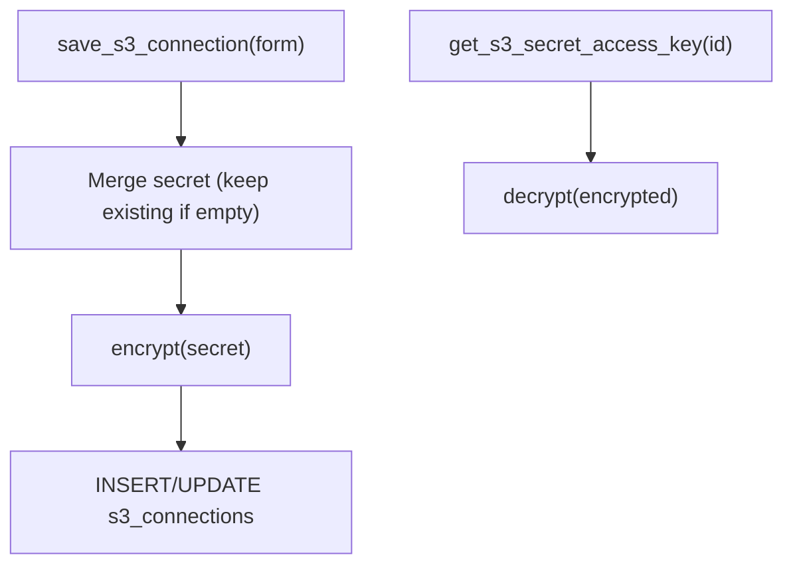
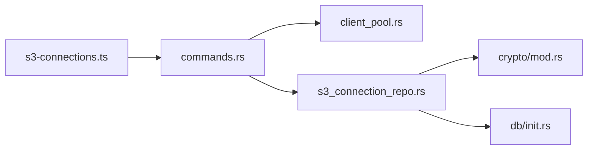

# Connection Management

<cite>
**Referenced Files in This Document**
- [s3-connections.ts](file://src/plugins/s3-client/store/s3-connections.ts)
- [S3ConnectionForm.tsx](file://src/plugins/s3-client/components/S3ConnectionForm.tsx)
- [S3ConnectionList.tsx](file://src/plugins/s3-client/views/S3ConnectionList.tsx)
- [types.ts](file://src/plugins/s3-client/types.ts)
- [commands.rs](file://src-tauri/src/plugins/s3/commands.rs)
- [client_pool.rs](file://src-tauri/src/plugins/s3/client_pool.rs)
- [s3_connection_repo.rs](file://src-tauri/src/db/s3_connection_repo.rs)
- [mod.rs](file://src-tauri/src/plugins/s3/mod.rs)
- [types.rs](file://src-tauri/src/plugins/s3/types.rs)
- [mod.rs (crypto)](file://src-tauri/src/crypto/mod.rs)
- [init.rs](file://src-tauri/src/db/init.rs)
- [README.md](file://README.md)
</cite>

## Table of Contents
1. [Introduction](#introduction)
2. [Project Structure](#project-structure)
3. [Core Components](#core-components)
4. [Architecture Overview](#architecture-overview)
5. [Detailed Component Analysis](#detailed-component-analysis)
6. [Dependency Analysis](#dependency-analysis)
7. [Performance Considerations](#performance-considerations)
8. [Troubleshooting Guide](#troubleshooting-guide)
9. [Conclusion](#conclusion)
10. [Appendices](#appendices)

## Introduction
This document describes the S3 connection management system in RDMM. It covers how multiple S3 endpoints are stored and managed, how credentials are handled securely, and how secure connections are established. It also documents the connection form interface for configuring endpoint URLs, regions, and authentication parameters, along with validation, testing, and error handling. Practical examples demonstrate adding new connections, switching between active connections, managing credentials securely, and handling connection failures. Security best practices for credential storage, connection pooling, and authentication token management are included, along with integration with RDMM’s encryption layer and connection lifecycle management.

## Project Structure
The S3 connection management spans frontend and backend layers:
- Frontend store and UI: manage connection lifecycle, forms, and UI interactions.
- Backend commands and pools: handle connection persistence, encryption, client construction, and S3 operations.
- Database schema: stores connection records and encrypted secrets.
- Encryption layer: provides AES-GCM encryption for sensitive fields.

**Diagram sources**
- [s3-connections.ts:137-431](file://src/plugins/s3-client/store/s3-connections.ts#L137-L431)
- [S3ConnectionForm.tsx:42-226](file://src/plugins/s3-client/components/S3ConnectionForm.tsx#L42-L226)
- [S3ConnectionList.tsx:32-214](file://src/plugins/s3-client/views/S3ConnectionList.tsx#L32-L214)
- [types.ts:1-110](file://src/plugins/s3-client/types.ts#L1-L110)
- [commands.rs:14-106](file://src-tauri/src/plugins/s3/commands.rs#L14-L106)
- [client_pool.rs:10-85](file://src-tauri/src/plugins/s3/client_pool.rs#L10-L85)
- [s3_connection_repo.rs:110-161](file://src-tauri/src/db/s3_connection_repo.rs#L110-L161)
- [mod.rs (crypto):40-74](file://src-tauri/src/crypto/mod.rs#L40-L74)
- [init.rs:103-115](file://src-tauri/src/db/init.rs#L103-L115)

**Section sources**
- [README.md:15-22](file://README.md#L15-L22)
- [README.md:27-28](file://README.md#L27-L28)

## Core Components
- Frontend store: centralizes connection state, exposes actions for fetching, saving, connecting, disconnecting, listing buckets, and object operations. It invokes backend commands via Tauri invocations.
- Connection form: validates and builds connection configurations, auto-fills endpoints for known providers, and supports testing connections.
- Connection list: displays grouped connections, supports connect/disconnect, edit, delete, and navigation to buckets.
- Backend commands: validate inputs, construct clients, perform S3 operations, and manage connection lifecycle.
- Client pool: caches per-connection S3 clients keyed by connection ID.
- Connection repository: persists connections and secrets to SQLite, encrypts/decrypts secrets using the encryption layer.
- Encryption layer: AES-GCM encryption/decryption for sensitive data.
- Database schema: defines the s3_connections table with encrypted secret storage.

**Section sources**
- [s3-connections.ts:15-135](file://src/plugins/s3-client/store/s3-connections.ts#L15-L135)
- [S3ConnectionForm.tsx:14-41](file://src/plugins/s3-client/components/S3ConnectionForm.tsx#L14-L41)
- [S3ConnectionList.tsx:19-30](file://src/plugins/s3-client/views/S3ConnectionList.tsx#L19-L30)
- [commands.rs:14-106](file://src-tauri/src/plugins/s3/commands.rs#L14-L106)
- [client_pool.rs:10-85](file://src-tauri/src/plugins/s3/client_pool.rs#L10-L85)
- [s3_connection_repo.rs:110-161](file://src-tauri/src/db/s3_connection_repo.rs#L110-L161)
- [mod.rs (crypto):40-74](file://src-tauri/src/crypto/mod.rs#L40-L74)
- [init.rs:103-115](file://src-tauri/src/db/init.rs#L103-L115)

## Architecture Overview
The system follows a layered pattern:
- UI layer (React + Ant Design) renders forms and lists.
- State layer (Zustand) orchestrates actions and updates UI.
- Command layer (Tauri commands) executes backend logic.
- Persistence layer (SQLite) stores connection metadata and encrypted secrets.
- Security layer (AES-GCM) protects sensitive data at rest.

**Diagram sources**
- [s3-connections.ts:160-196](file://src/plugins/s3-client/store/s3-connections.ts#L160-L196)
- [commands.rs:36-106](file://src-tauri/src/plugins/s3/commands.rs#L36-L106)
- [client_pool.rs:34-77](file://src-tauri/src/plugins/s3/client_pool.rs#L34-L77)
- [s3_connection_repo.rs:110-161](file://src-tauri/src/db/s3_connection_repo.rs#L110-L161)
- [mod.rs (crypto):40-74](file://src-tauri/src/crypto/mod.rs#L40-L74)
- [init.rs:103-115](file://src-tauri/src/db/init.rs#L103-L115)

## Detailed Component Analysis

### Connection Store (Frontend)
Responsibilities:
- Manage connection list, active connection, and UI state.
- Expose actions to fetch, save, test, connect, disconnect, list buckets, and perform object operations.
- Invoke backend commands via Tauri and update state accordingly.

Key behaviors:
- Fetch connections, save connection (including preserving existing secret if not provided), delete connection, test connection (latency), connect/disconnect (update connected IDs and active connection), list buckets, list objects, delete/rename/copy objects, upload/download, generate presigned URLs, and manage workspace tab and active connection.

**Diagram sources**
- [s3-connections.ts:151-196](file://src/plugins/s3-client/store/s3-connections.ts#L151-L196)
- [s3-connections.ts:160-173](file://src/plugins/s3-client/store/s3-connections.ts#L160-L173)
- [s3-connections.ts:174-177](file://src/plugins/s3-client/store/s3-connections.ts#L174-L177)
- [s3-connections.ts:178-196](file://src/plugins/s3-client/store/s3-connections.ts#L178-L196)

**Section sources**
- [s3-connections.ts:15-135](file://src/plugins/s3-client/store/s3-connections.ts#L15-L135)

### Connection Form Interface
Responsibilities:
- Provide a modal form to configure S3 connection settings.
- Auto-fill endpoint based on provider and region for known providers.
- Validate required fields and enforce custom provider endpoint requirement.
- Support testing connection and saving with optional secret retention.

Key behaviors:
- Provider options include AWS S3, MinIO, Aliyun OSS, Tencent COS, Cloudflare R2, and Custom.
- Region options include common regions; endpoint is auto-filled except for Custom and MinIO.
- Advanced options include path-style addressing and manual bucket list for restricted accounts.
- Secret access key is optional when editing existing connections.

**Diagram sources**
- [S3ConnectionForm.tsx:53-94](file://src/plugins/s3-client/components/S3ConnectionForm.tsx#L53-L94)
- [S3ConnectionForm.tsx:96-107](file://src/plugins/s3-client/components/S3ConnectionForm.tsx#L96-L107)
- [S3ConnectionForm.tsx:13-41](file://src/plugins/s3-client/components/S3ConnectionForm.tsx#L13-L41)

**Section sources**
- [S3ConnectionForm.tsx:14-41](file://src/plugins/s3-client/components/S3ConnectionForm.tsx#L14-L41)
- [S3ConnectionForm.tsx:53-94](file://src/plugins/s3-client/components/S3ConnectionForm.tsx#L53-L94)
- [S3ConnectionForm.tsx:96-107](file://src/plugins/s3-client/components/S3ConnectionForm.tsx#L96-L107)

### Connection List View
Responsibilities:
- Display grouped connections with provider tags and connection status.
- Provide actions: connect and open buckets, disconnect, edit, delete.
- Navigate to buckets view after successful connection.

Key behaviors:
- Group connections by group name (default to “Default” if none).
- Search by name, provider, or endpoint.
- On double-click or context menu action, connect, set active, list buckets, and switch workspace tab.

**Section sources**
- [S3ConnectionList.tsx:32-83](file://src/plugins/s3-client/views/S3ConnectionList.tsx#L32-L83)
- [S3ConnectionList.tsx:53-73](file://src/plugins/s3-client/views/S3ConnectionList.tsx#L53-L73)

### Backend Commands and Client Pool
Responsibilities:
- Validate connection form inputs.
- Build S3 clients with AWS SDK using configured credentials and endpoint.
- Manage connection lifecycle: list/save/delete, connect/disconnect, list buckets, and object operations.
- Use a static pool keyed by connection ID to cache clients.

Key behaviors:
- Validation ensures required fields and custom endpoint presence.
- Client building sets region, credentials, optional endpoint override, and path-style addressing.
- Connect stores client in pool; disconnect removes it.
- List buckets handles both ListBuckets permission and manual bucket fallback.

**Diagram sources**
- [commands.rs:14-106](file://src-tauri/src/plugins/s3/commands.rs#L14-L106)
- [client_pool.rs:34-85](file://src-tauri/src/plugins/s3/client_pool.rs#L34-L85)

**Section sources**
- [commands.rs:36-106](file://src-tauri/src/plugins/s3/commands.rs#L36-L106)
- [client_pool.rs:34-85](file://src-tauri/src/plugins/s3/client_pool.rs#L34-L85)

### Connection Repository and Encryption
Responsibilities:
- Persist S3 connections to SQLite with encrypted secret access key.
- Retrieve connection info and secret access key.
- Encrypt secrets before storing and decrypt when retrieving.

Key behaviors:
- Save merges updates and preserves existing secret if new secret is empty.
- Encrypt/decrypt using AES-GCM with a per-installation key file.
- Schema defines s3_connections table with encrypted secret field.

**Diagram sources**
- [s3_connection_repo.rs:110-161](file://src-tauri/src/db/s3_connection_repo.rs#L110-L161)
- [mod.rs (crypto):40-74](file://src-tauri/src/crypto/mod.rs#L40-L74)
- [init.rs:103-115](file://src-tauri/src/db/init.rs#L103-L115)

**Section sources**
- [s3_connection_repo.rs:110-161](file://src-tauri/src/db/s3_connection_repo.rs#L110-L161)
- [mod.rs (crypto):40-74](file://src-tauri/src/crypto/mod.rs#L40-L74)
- [init.rs:103-115](file://src-tauri/src/db/init.rs#L103-L115)

### Data Types
Responsibilities:
- Define shapes for connection form data, connection info, latency, buckets, objects, tags, and stats.

Key types:
- S3ConnectionFormData: mutable form shape.
- S3ConnectionInfo: persisted connection record.
- S3Latency: test result.
- S3BucketInfo, S3ObjectItem, S3ObjectMeta, S3DeleteObjectsResult, S3ObjectTag, S3BucketStats, S3ObjectRow.

**Section sources**
- [types.ts:3-110](file://src/plugins/s3-client/types.ts#L3-L110)

## Dependency Analysis
- Frontend store depends on Tauri invocations to backend commands.
- Backend commands depend on client pool for S3 client instances and on connection repository for persistence.
- Connection repository depends on encryption layer and SQLite schema.
- Client pool depends on AWS SDK configuration and credentials.

**Diagram sources**
- [s3-connections.ts:151-196](file://src/plugins/s3-client/store/s3-connections.ts#L151-L196)
- [commands.rs:14-106](file://src-tauri/src/plugins/s3/commands.rs#L14-L106)
- [client_pool.rs:10-85](file://src-tauri/src/plugins/s3/client_pool.rs#L10-L85)
- [s3_connection_repo.rs:110-161](file://src-tauri/src/db/s3_connection_repo.rs#L110-L161)
- [mod.rs (crypto):40-74](file://src-tauri/src/crypto/mod.rs#L40-L74)
- [init.rs:103-115](file://src-tauri/src/db/init.rs#L103-L115)

**Section sources**
- [mod.rs:1-4](file://src-tauri/src/plugins/s3/mod.rs#L1-L4)
- [types.rs:3-5](file://src-tauri/src/plugins/s3/types.rs#L3-L5)

## Performance Considerations
- Connection pooling: Clients are cached per connection ID to avoid repeated client construction overhead. Ensure to disconnect unused connections to free memory.
- Pagination and listing: Object listing uses max keys and continuation tokens to prevent large payloads. Use prefix filtering to reduce response sizes.
- Batch operations: Folder upload traverses filesystem and uploads files sequentially; consider limiting concurrency for very large directories.
- Endpoint selection: Prefer known provider endpoints to avoid unnecessary DNS resolution and TLS negotiation.

[No sources needed since this section provides general guidance]

## Troubleshooting Guide
Common issues and resolutions:
- Validation errors during save/test: Ensure required fields are filled, especially provider-specific endpoint for Custom provider and region.
- Permission denied on ListBuckets: Configure Manual Buckets in advanced settings to restrict operations to allowed buckets.
- Connection not found: Verify connection ID exists and client is present in pool; reconnect if needed.
- Decryption failures: Confirm encryption key file exists and is readable; re-save connection to refresh encryption if needed.
- Upload/download failures: Check local file paths and permissions; verify bucket/key correctness and storage class settings.

**Section sources**
- [commands.rs:36-55](file://src-tauri/src/plugins/s3/commands.rs#L36-L55)
- [commands.rs:214-228](file://src-tauri/src/plugins/s3/commands.rs#L214-L228)
- [s3_connection_repo.rs:170-187](file://src-tauri/src/db/s3_connection_repo.rs#L170-L187)

## Conclusion
RDMM’s S3 connection management provides a robust, secure, and user-friendly system for managing multiple S3 endpoints. It integrates frontend state management with backend command execution, secure credential storage, and efficient client pooling. The form-driven configuration supports common providers and advanced scenarios like restricted permissions. Following the best practices outlined here will help maintain reliability, security, and performance.

[No sources needed since this section summarizes without analyzing specific files]

## Appendices

### Practical Examples

- Add a new connection:
  - Open the connection form, fill in name, provider, region, endpoint (auto-filled for known providers), access key ID, and secret access key.
  - Click Save; the store invokes the backend to persist and refresh the list.
  - Reference: [S3ConnectionForm.tsx:96-101](file://src/plugins/s3-client/components/S3ConnectionForm.tsx#L96-L101), [s3-connections.ts:160-164](file://src/plugins/s3-client/store/s3-connections.ts#L160-L164), [commands.rs:22-27](file://src-tauri/src/plugins/s3/commands.rs#L22-L27), [s3_connection_repo.rs:110-161](file://src-tauri/src/db/s3_connection_repo.rs#L110-L161)

- Switch between active connections:
  - From the connection list, click Connect and Open Buckets or double-click a connection.
  - The store connects the selected ID and navigates to buckets.
  - Reference: [S3ConnectionList.tsx:75-83](file://src/plugins/s3-client/views/S3ConnectionList.tsx#L75-L83), [s3-connections.ts:178-184](file://src/plugins/s3-client/store/s3-connections.ts#L178-L184)

- Manage connection credentials securely:
  - When editing, leave the secret access key empty to retain the existing encrypted secret.
  - The repository merges secrets and re-encrypts if a new secret is provided.
  - Reference: [s3-connections.ts:160-164](file://src/plugins/s3-client/store/s3-connections.ts#L160-L164), [s3_connection_repo.rs:115-124](file://src-tauri/src/db/s3_connection_repo.rs#L115-L124), [mod.rs (crypto):40-74](file://src-tauri/src/crypto/mod.rs#L40-L74)

- Handle connection failures:
  - Use Test Connection to validate latency and basic connectivity.
  - For permission issues, enable Manual Buckets and specify allowed buckets.
  - Reference: [S3ConnectionForm.tsx:103-107](file://src/plugins/s3-client/components/S3ConnectionForm.tsx#L103-L107), [commands.rs:36-91](file://src-tauri/src/plugins/s3/commands.rs#L36-L91), [commands.rs:214-228](file://src-tauri/src/plugins/s3/commands.rs#L214-L228)

### Security Best Practices
- Credential storage: Secrets are encrypted at rest using AES-GCM; do not log or expose secrets.
- Connection pooling: Reuse clients per connection ID; disconnect inactive connections to minimize exposure.
- Authentication: Use least-privilege credentials; leverage provider-specific endpoints and path-style addressing when required.
- Token management: Use presigned URLs for temporary access; set appropriate expiration times.

**Section sources**
- [README.md:181-186](file://README.md#L181-L186)
- [mod.rs (crypto):40-74](file://src-tauri/src/crypto/mod.rs#L40-L74)
- [client_pool.rs:34-58](file://src-tauri/src/plugins/s3/client_pool.rs#L34-L58)
- [commands.rs:421-428](file://src-tauri/src/plugins/s3/commands.rs#L421-L428)