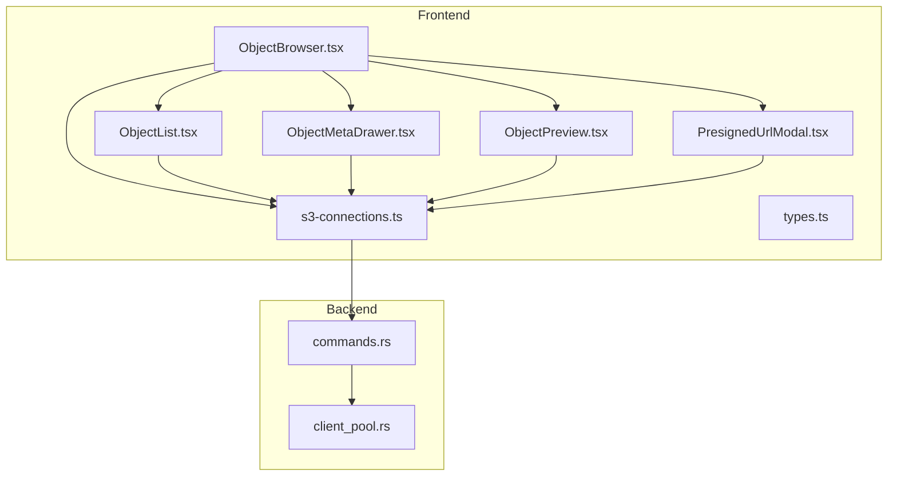
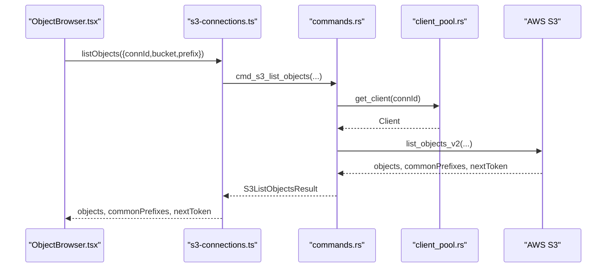
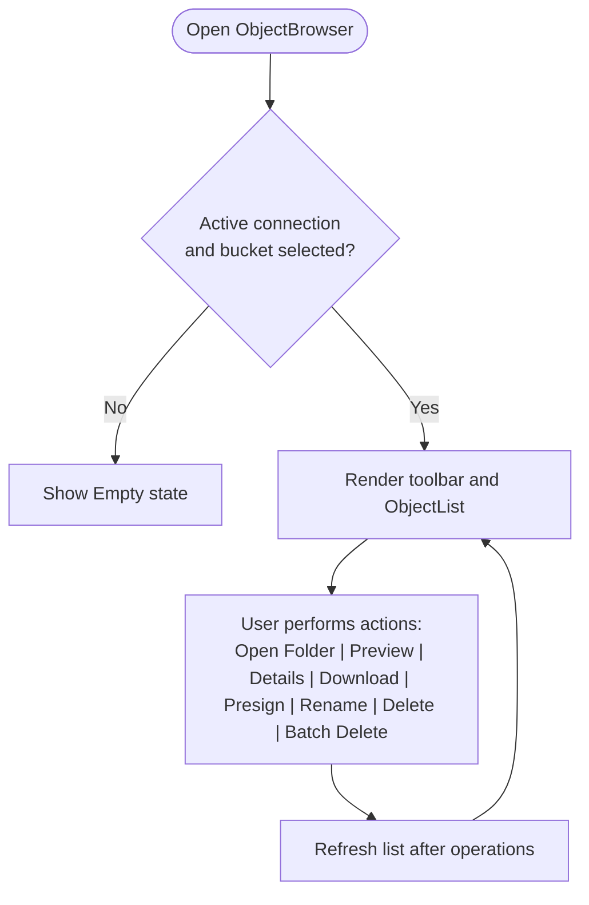
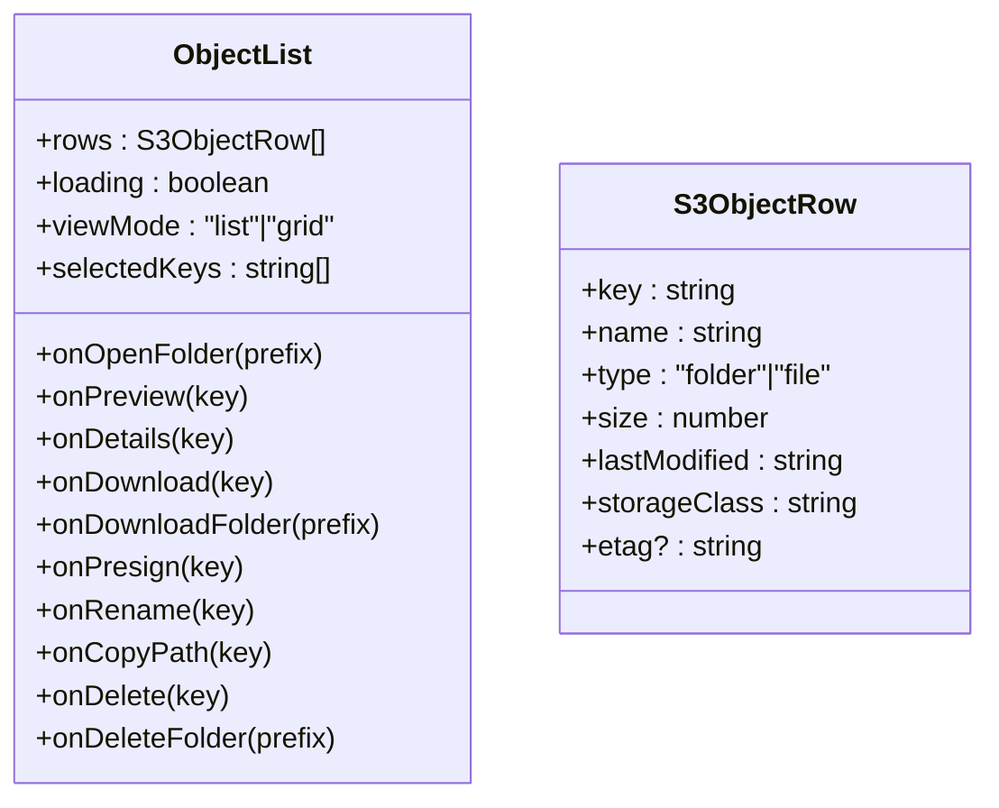
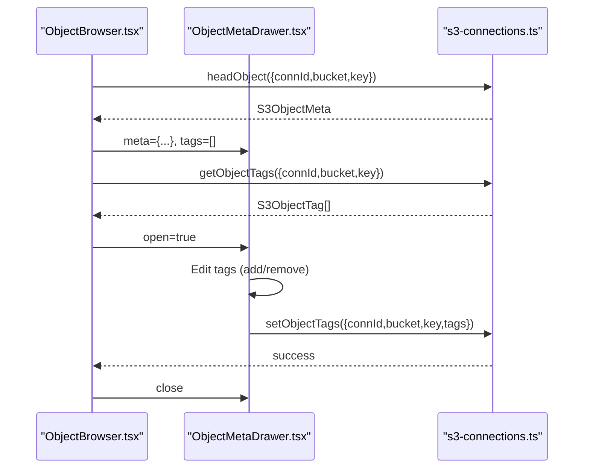
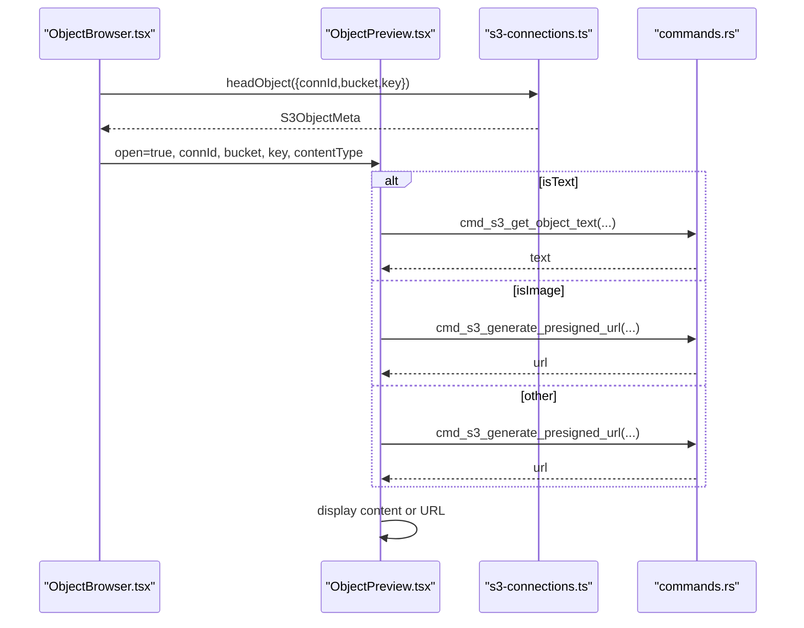
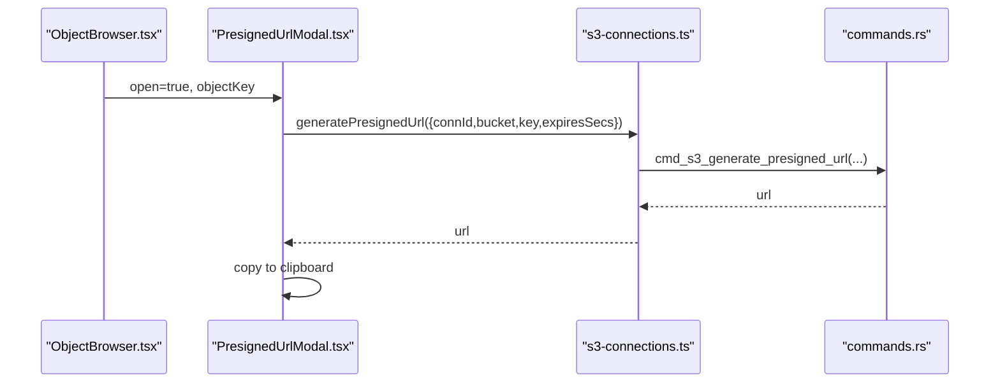
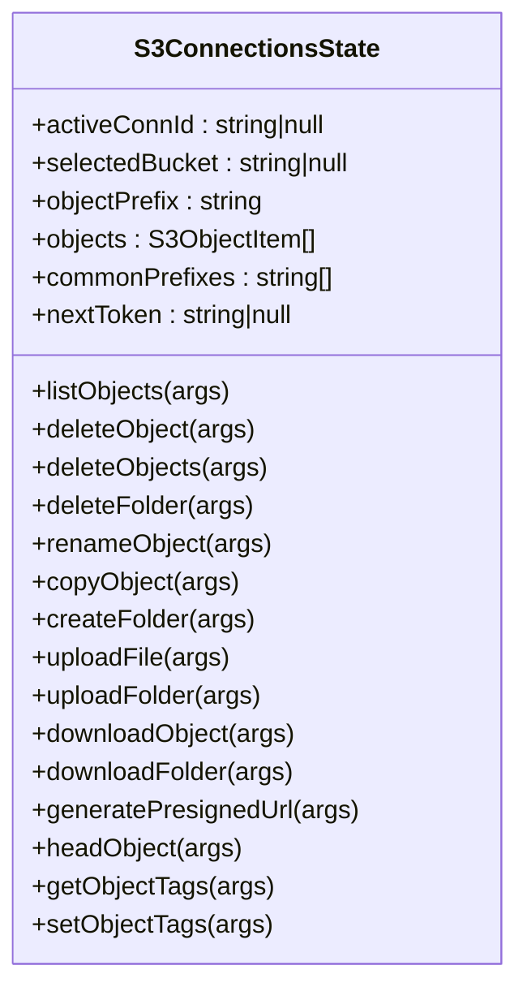
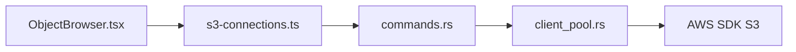

# Object Browser

<cite>
**Referenced Files in This Document**
- [ObjectBrowser.tsx](file://src/plugins/s3-client/views/ObjectBrowser.tsx)
- [ObjectList.tsx](file://src/plugins/s3-client/components/ObjectList.tsx)
- [ObjectMetaDrawer.tsx](file://src/plugins/s3-client/components/ObjectMetaDrawer.tsx)
- [ObjectPreview.tsx](file://src/plugins/s3-client/components/ObjectPreview.tsx)
- [PresignedUrlModal.tsx](file://src/plugins/s3-client/components/PresignedUrlModal.tsx)
- [types.ts](file://src/plugins/s3-client/types.ts)
- [s3-connections.ts](file://src/plugins/s3-client/store/s3-connections.ts)
- [commands.rs](file://src-tauri/src/plugins/s3/commands.rs)
- [client_pool.rs](file://src-tauri/src/plugins/s3/client_pool.rs)
</cite>

## Table of Contents
1. [Introduction](#introduction)
2. [Project Structure](#project-structure)
3. [Core Components](#core-components)
4. [Architecture Overview](#architecture-overview)
5. [Detailed Component Analysis](#detailed-component-analysis)
6. [Dependency Analysis](#dependency-analysis)
7. [Performance Considerations](#performance-considerations)
8. [Troubleshooting Guide](#troubleshooting-guide)
9. [Conclusion](#conclusion)

## Introduction
This document describes the S3 object browsing and management system. It covers how users navigate file hierarchies within S3 buckets, view object metadata, preview supported file types, and perform operations such as upload, download, delete, rename, and bulk operations. It also documents the metadata drawer for viewing and editing object properties, tags, and custom metadata, and the preview modal for text, images, and documents. Practical examples demonstrate browsing hierarchies, previewing files, managing metadata, generating presigned URLs for temporary access, and handling bulk operations. Performance considerations address large object lists, streaming downloads, and thumbnail generation for image previews.

## Project Structure
The S3 plugin is organized around a view component that orchestrates several specialized components:
- ObjectBrowser: Top-level view that manages state, navigation, and operations
- ObjectList: Renders hierarchical objects in list or grid mode with actions
- ObjectMetaDrawer: Displays and edits object metadata and tags
- ObjectPreview: Provides preview for text, images, and documents
- PresignedUrlModal: Generates and copies temporary access URLs
- Store: Centralized state management for S3 operations
- Types: Shared TypeScript interfaces and types
- Backend: Rust/Tauri commands implementing AWS S3 operations

**Diagram sources**
- [ObjectBrowser.tsx:148-467](file://src/plugins/s3-client/views/ObjectBrowser.tsx#L148-L467)
- [ObjectList.tsx:53-286](file://src/plugins/s3-client/components/ObjectList.tsx#L53-L286)
- [ObjectMetaDrawer.tsx:15-136](file://src/plugins/s3-client/components/ObjectMetaDrawer.tsx#L15-L136)
- [ObjectPreview.tsx:14-122](file://src/plugins/s3-client/components/ObjectPreview.tsx#L14-L122)
- [PresignedUrlModal.tsx:11-61](file://src/plugins/s3-client/components/PresignedUrlModal.tsx#L11-L61)
- [s3-connections.ts:137-431](file://src/plugins/s3-client/store/s3-connections.ts#L137-L431)
- [commands.rs:14-1164](file://src-tauri/src/plugins/s3/commands.rs#L14-L1164)
- [client_pool.rs:34-85](file://src-tauri/src/plugins/s3/client_pool.rs#L34-L85)

**Section sources**
- [ObjectBrowser.tsx:148-467](file://src/plugins/s3-client/views/ObjectBrowser.tsx#L148-L467)
- [ObjectList.tsx:53-286](file://src/plugins/s3-client/components/ObjectList.tsx#L53-L286)
- [ObjectMetaDrawer.tsx:15-136](file://src/plugins/s3-client/components/ObjectMetaDrawer.tsx#L15-L136)
- [ObjectPreview.tsx:14-122](file://src/plugins/s3-client/components/ObjectPreview.tsx#L14-L122)
- [PresignedUrlModal.tsx:11-61](file://src/plugins/s3-client/components/PresignedUrlModal.tsx#L11-L61)
- [s3-connections.ts:137-431](file://src/plugins/s3-client/store/s3-connections.ts#L137-L431)
- [types.ts:92-110](file://src/plugins/s3-client/types.ts#L92-L110)
- [commands.rs:362-430](file://src-tauri/src/plugins/s3/commands.rs#L362-L430)
- [client_pool.rs:34-85](file://src-tauri/src/plugins/s3/client_pool.rs#L34-L85)

## Core Components
- ObjectBrowser: Orchestrates navigation, filtering, sorting, and operations. Manages breadcrumbs, view modes, selection, and modal dialogs for uploads, downloads, and presigned URLs.
- ObjectList: Renders objects in list or grid view with action menus, double-click to open folders or preview files, and bulk selection for batch operations.
- ObjectMetaDrawer: Shows object metadata (content type, size, ETag, last modified, storage class, version ID) and allows editing tags with add/reload/save actions.
- ObjectPreview: Loads and displays text previews or generates presigned URLs for images and documents; supports configurable expiration.
- PresignedUrlModal: Generates and copies temporary URLs with predefined expiration options.
- Store: Provides typed actions for listing, deleting, renaming, uploading, downloading, tagging, and presigned URL generation.
- Types: Defines S3ObjectRow, S3ObjectMeta, S3ObjectTag, and other interfaces used across components.

**Section sources**
- [ObjectBrowser.tsx:27-101](file://src/plugins/s3-client/views/ObjectBrowser.tsx#L27-L101)
- [ObjectList.tsx:26-70](file://src/plugins/s3-client/components/ObjectList.tsx#L26-L70)
- [ObjectMetaDrawer.tsx:6-22](file://src/plugins/s3-client/components/ObjectMetaDrawer.tsx#L6-L22)
- [ObjectPreview.tsx:5-21](file://src/plugins/s3-client/components/ObjectPreview.tsx#L5-L21)
- [PresignedUrlModal.tsx:4-10](file://src/plugins/s3-client/components/PresignedUrlModal.tsx#L4-L10)
- [s3-connections.ts:15-135](file://src/plugins/s3-client/store/s3-connections.ts#L15-L135)
- [types.ts:92-110](file://src/plugins/s3-client/types.ts#L92-L110)

## Architecture Overview
The system follows a React frontend with a Zustand store that invokes Tauri commands implemented in Rust. The backend uses the AWS SDK for S3 to perform operations like listing, uploading, downloading, tagging, and presigned URL generation. A client pool caches configured clients per connection.

**Diagram sources**
- [ObjectBrowser.tsx:207-213](file://src/plugins/s3-client/views/ObjectBrowser.tsx#L207-L213)
- [s3-connections.ts:225-244](file://src/plugins/s3-client/store/s3-connections.ts#L225-L244)
- [commands.rs:362-430](file://src-tauri/src/plugins/s3/commands.rs#L362-L430)
- [client_pool.rs:61-69](file://src-tauri/src/plugins/s3/client_pool.rs#L61-L69)

## Detailed Component Analysis

### ObjectBrowser: Navigation, Filtering, Sorting, and Operations
- Navigation: Breadcrumb reflects current prefix; clicking breadcrumb items navigates up the hierarchy.
- Filtering and Sorting: Supports keyword search and sort by name, size, or last modified.
- View Modes: Toggle between list and grid layouts; grid uses context menus for actions.
- Bulk Operations: Selected files enable batch delete confirmation.
- Modals: Create folder, upload file/folder, download object/folder, and presigned URL generation.

**Diagram sources**
- [ObjectBrowser.tsx:128-146](file://src/plugins/s3-client/views/ObjectBrowser.tsx#L128-L146)
- [ObjectBrowser.tsx:219-321](file://src/plugins/s3-client/views/ObjectBrowser.tsx#L219-L321)

**Section sources**
- [ObjectBrowser.tsx:103-118](file://src/plugins/s3-client/views/ObjectBrowser.tsx#L103-L118)
- [ObjectBrowser.tsx:232-304](file://src/plugins/s3-client/views/ObjectBrowser.tsx#L232-L304)
- [ObjectBrowser.tsx:356-464](file://src/plugins/s3-client/views/ObjectBrowser.tsx#L356-L464)

### ObjectList: Hierarchical Object Rendering and Actions
- Grid Mode: Shows folders and files as cards with context menus for open/download/copy/delete/presign/rename/preview.
- List Mode: Uses Ant Design Table with virtualization, row selection (disabled for folders), and action buttons.
- Double-click: Opens folders or previews files depending on type.
- Selection: Tracks selected keys for bulk operations.

**Diagram sources**
- [ObjectList.tsx:26-70](file://src/plugins/s3-client/components/ObjectList.tsx#L26-L70)
- [types.ts:92-110](file://src/plugins/s3-client/types.ts#L92-L110)

**Section sources**
- [ObjectList.tsx:89-158](file://src/plugins/s3-client/components/ObjectList.tsx#L89-L158)
- [ObjectList.tsx:160-286](file://src/plugins/s3-client/components/ObjectList.tsx#L160-L286)

### ObjectMetaDrawer: Metadata and Tags Management
- Displays object metadata (key, content type, size, ETag, last modified, storage class, version ID).
- Shows custom metadata as key/value pairs.
- Allows adding/removing tags, reloading tags, and saving edited tags.

**Diagram sources**
- [ObjectBrowser.tsx:109-118](file://src/plugins/s3-client/views/ObjectBrowser.tsx#L109-L118)
- [ObjectMetaDrawer.tsx:15-136](file://src/plugins/s3-client/components/ObjectMetaDrawer.tsx#L15-L136)
- [s3-connections.ts:84-95](file://src/plugins/s3-client/store/s3-connections.ts#L84-L95)

**Section sources**
- [ObjectMetaDrawer.tsx:30-136](file://src/plugins/s3-client/components/ObjectMetaDrawer.tsx#L30-L136)
- [s3-connections.ts:84-95](file://src/plugins/s3-client/store/s3-connections.ts#L84-L95)

### ObjectPreview: Text, Image, and Document Previews
- Determines preview type based on content type:
  - Text-like content types (text/*, json, xml, yaml, javascript) load as text.
  - Images show via presigned URL.
  - Other content types show a presigned URL with copy-to-clipboard.
- Expiration controls allow selecting 5m/1h/1d/7d.

**Diagram sources**
- [ObjectBrowser.tsx:120-126](file://src/plugins/s3-client/views/ObjectBrowser.tsx#L120-L126)
- [ObjectPreview.tsx:14-122](file://src/plugins/s3-client/components/ObjectPreview.tsx#L14-L122)
- [commands.rs:903-951](file://src-tauri/src/plugins/s3/commands.rs#L903-L951)
- [commands.rs:954-982](file://src-tauri/src/plugins/s3/commands.rs#L954-L982)

**Section sources**
- [ObjectPreview.tsx:28-61](file://src/plugins/s3-client/components/ObjectPreview.tsx#L28-L61)
- [ObjectPreview.tsx:63-122](file://src/plugins/s3-client/components/ObjectPreview.tsx#L63-L122)
- [commands.rs:903-951](file://src-tauri/src/plugins/s3/commands.rs#L903-L951)
- [commands.rs:954-982](file://src-tauri/src/plugins/s3/commands.rs#L954-L982)

### PresignedUrlModal: Temporary Access URLs
- Generates presigned URLs with selectable expiration (5m/1h/1d/7d).
- Copies generated URL to clipboard and shows success feedback.

**Diagram sources**
- [ObjectBrowser.tsx:347-355](file://src/plugins/s3-client/views/ObjectBrowser.tsx#L347-L355)
- [PresignedUrlModal.tsx:11-61](file://src/plugins/s3-client/components/PresignedUrlModal.tsx#L11-L61)
- [s3-connections.ts:127-132](file://src/plugins/s3-client/store/s3-connections.ts#L127-L132)
- [commands.rs:954-982](file://src-tauri/src/plugins/s3/commands.rs#L954-L982)

**Section sources**
- [PresignedUrlModal.tsx:22-61](file://src/plugins/s3-client/components/PresignedUrlModal.tsx#L22-L61)
- [s3-connections.ts:127-132](file://src/plugins/s3-client/store/s3-connections.ts#L127-L132)

### Store: S3 Operations and State
- Centralizes S3 operations: list buckets, list objects, delete, rename, copy, upload, download, tags, presigned URLs.
- Maintains UI state: active connection, selected bucket, object prefix, loading flags, objects, common prefixes, next token.
- Integrates with Tauri commands for all backend operations.

**Diagram sources**
- [s3-connections.ts:15-135](file://src/plugins/s3-client/store/s3-connections.ts#L15-L135)

**Section sources**
- [s3-connections.ts:225-431](file://src/plugins/s3-client/store/s3-connections.ts#L225-L431)

### Types: Data Contracts
- S3ObjectRow: Unified row representation for folders and files used by ObjectList.
- S3ObjectMeta: Object metadata returned by headObject.
- S3ObjectTag: Tag structure for tagging operations.
- S3ListObjectsResult: Backend response for listObjects.

**Section sources**
- [types.ts:92-110](file://src/plugins/s3-client/types.ts#L92-L110)
- [types.ts:65-74](file://src/plugins/s3-client/types.ts#L65-L74)
- [types.ts:81-84](file://src/plugins/s3-client/types.ts#L81-L84)
- [types.ts:48-53](file://src/plugins/s3-client/types.ts#L48-L53)

## Dependency Analysis
- Frontend depends on Ant Design components and Zustand store.
- Store depends on Tauri commands for all S3 operations.
- Backend uses AWS SDK for S3 with a client pool for connection reuse.
- Provider-specific endpoints are supported for Aliyun, Tencent Cloud, and R2.

**Diagram sources**
- [ObjectBrowser.tsx:20-50](file://src/plugins/s3-client/views/ObjectBrowser.tsx#L20-L50)
- [s3-connections.ts:137-431](file://src/plugins/s3-client/store/s3-connections.ts#L137-L431)
- [commands.rs:34-85](file://src-tauri/src/plugins/s3/commands.rs#L34-L85)
- [client_pool.rs:34-59](file://src-tauri/src/plugins/s3/client_pool.rs#L34-L59)

**Section sources**
- [client_pool.rs:15-32](file://src-tauri/src/plugins/s3/client_pool.rs#L15-L32)
- [commands.rs:34-85](file://src-tauri/src/plugins/s3/commands.rs#L34-L85)

## Performance Considerations
- Large object lists:
  - Virtualized table in list mode reduces DOM overhead.
  - Pagination via continuation tokens prevents loading all objects at once.
  - Max keys defaults to 200 per request; adjust as needed.
- Streaming downloads:
  - Backend streams object content to disk; avoids loading entire objects into memory.
  - Text preview limits apply to prevent excessive memory usage.
- Thumbnail generation for image previews:
  - Current implementation uses presigned URLs; thumbnails are not generated in the frontend.
  - Consider client-side image resizing for large images if needed.
- Network efficiency:
  - Client pool reuses configured clients per connection.
  - Provider-specific endpoints reduce latency for regional providers.

[No sources needed since this section provides general guidance]

## Troubleshooting Guide
- No objects displayed:
  - Ensure a bucket is selected; otherwise, the view shows an empty state.
  - Use refresh button to reload objects.
- Permission errors:
  - Verify credentials and region configuration.
  - For restricted accounts, configure manual buckets in connection settings.
- Large object previews:
  - Text previews are limited to 2MB; binary previews to 10MB.
  - Use download or presigned URL for larger files.
- Bulk delete failures:
  - Review error messages returned by bulk delete operations.
- Presigned URL expiration:
  - Expiration is clamped between 60 seconds and 7 days.

**Section sources**
- [ObjectBrowser.tsx:128-146](file://src/plugins/s3-client/views/ObjectBrowser.tsx#L128-L146)
- [commands.rs:910-914](file://src-tauri/src/plugins/s3/commands.rs#L910-L914)
- [commands.rs:947-950](file://src-tauri/src/plugins/s3/commands.rs#L947-L950)
- [commands.rs:964-965](file://src-tauri/src/plugins/s3/commands.rs#L964-L965)
- [s3-connections.ts:261-280](file://src/plugins/s3-client/store/s3-connections.ts#L261-L280)

## Conclusion
The S3 object browser provides a comprehensive interface for navigating S3 hierarchies, previewing supported file types, and performing essential object management tasks. Its modular design separates UI concerns from backend operations, enabling extensibility and maintainability. By leveraging virtualization, pagination, streaming, and presigned URLs, the system balances usability with performance across diverse workloads.