# S3 Client

<cite>
**Referenced Files in This Document**
- [index.tsx](file://src/plugins/s3-client/index.tsx)
- [types.ts](file://src/plugins/s3-client/types.ts)
- [s3-connections.ts](file://src/plugins/s3-client/store/s3-connections.ts)
- [S3ConnectionForm.tsx](file://src/plugins/s3-client/components/S3ConnectionForm.tsx)
- [BucketList.tsx](file://src/plugins/s3-client/views/BucketList.tsx)
- [ObjectBrowser.tsx](file://src/plugins/s3-client/views/ObjectBrowser.tsx)
- [S3ConnectionList.tsx](file://src/plugins/s3-client/views/S3ConnectionList.tsx)
- [ObjectList.tsx](file://src/plugins/s3-client/components/ObjectList.tsx)
- [ObjectMetaDrawer.tsx](file://src/plugins/s3-client/components/ObjectMetaDrawer.tsx)
- [ObjectPreview.tsx](file://src/plugins/s3-client/components/ObjectPreview.tsx)
- [PresignedUrlModal.tsx](file://src/plugins/s3-client/components/PresignedUrlModal.tsx)
- [BucketSettings.tsx](file://src/plugins/s3-client/components/BucketSettings.tsx)
- [mod.rs](file://src-tauri/src/plugins/s3/mod.rs)
- [client_pool.rs](file://src-tauri/src/plugins/s3/client_pool.rs)
- [commands.rs](file://src-tauri/src/plugins/s3/commands.rs)
</cite>

## Table of Contents
1. [Introduction](#introduction)
2. [Project Structure](#project-structure)
3. [Core Components](#core-components)
4. [Architecture Overview](#architecture-overview)
5. [Detailed Component Analysis](#detailed-component-analysis)
6. [Dependency Analysis](#dependency-analysis)
7. [Performance Considerations](#performance-considerations)
8. [Troubleshooting Guide](#troubleshooting-guide)
9. [Conclusion](#conclusion)
10. [Appendices](#appendices)

## Introduction
This document describes the S3 client plugin for RDMM, focusing on connection management for S3-compatible endpoints, authentication via AWS credentials, secure connection handling, and the user interface for browsing buckets and objects. It covers the bucket browser, object browser, connection list, bucket settings, object metadata viewing, previews for various file types, and presigned URL generation. Practical examples illustrate connecting to S3-compatible services, browsing bucket contents, uploading/downloading objects, managing object metadata, and generating temporary access links. Security considerations, credential management, error handling, and best practices are included, along with integration details with RDMM’s plugin architecture and file system operations.

## Project Structure
The S3 client plugin is organized into frontend React components and a backend Rust module implementing Tauri commands. The frontend manages UI state, user interactions, and invokes Tauri commands via a centralized Zustand store. The backend builds AWS SDK clients, caches them per connection, and executes S3 operations.

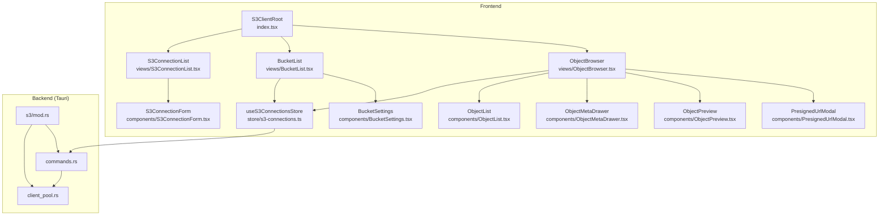

**Diagram sources**
- [index.tsx:10-76](file://src/plugins/s3-client/index.tsx#L10-L76)
- [S3ConnectionList.tsx:32-215](file://src/plugins/s3-client/views/S3ConnectionList.tsx#L32-L215)
- [BucketList.tsx:19-191](file://src/plugins/s3-client/views/BucketList.tsx#L19-L191)
- [ObjectBrowser.tsx:27-468](file://src/plugins/s3-client/views/ObjectBrowser.tsx#L27-L468)
- [s3-connections.ts:137-432](file://src/plugins/s3-client/store/s3-connections.ts#L137-L432)
- [S3ConnectionForm.tsx:42-227](file://src/plugins/s3-client/components/S3ConnectionForm.tsx#L42-L227)
- [ObjectList.tsx:53-287](file://src/plugins/s3-client/components/ObjectList.tsx#L53-L287)
- [ObjectMetaDrawer.tsx:15-137](file://src/plugins/s3-client/components/ObjectMetaDrawer.tsx#L15-L137)
- [ObjectPreview.tsx:14-123](file://src/plugins/s3-client/components/ObjectPreview.tsx#L14-L123)
- [PresignedUrlModal.tsx:11-62](file://src/plugins/s3-client/components/PresignedUrlModal.tsx#L11-L62)
- [BucketSettings.tsx:14-136](file://src/plugins/s3-client/components/BucketSettings.tsx#L14-L136)
- [mod.rs:1-4](file://src-tauri/src/plugins/s3/mod.rs#L1-L4)
- [client_pool.rs:34-86](file://src-tauri/src/plugins/s3/client_pool.rs#L34-L86)
- [commands.rs:14-1164](file://src-tauri/src/plugins/s3/commands.rs#L14-L1164)

**Section sources**
- [index.tsx:10-76](file://src/plugins/s3-client/index.tsx#L10-L76)
- [mod.rs:1-4](file://src-tauri/src/plugins/s3/mod.rs#L1-L4)

## Core Components
- Plugin manifest and root UI: Defines the S3 plugin identity, icon, and workspace tabs (Connections, Buckets, Objects).
- Connection management: Create, edit, test, connect/disconnect, and list S3 connections; supports multiple providers and regions.
- Bucket browser: Lists buckets, filters/searches, refreshes, creates/deletes buckets, and opens bucket contents.
- Object browser: Navigates prefixes, lists files/folders, previews content, downloads/uploading, metadata/tags, renaming/copying, and batch deletion.
- Metadata and preview: Displays object metadata and tags, and previews text and images via inline content or presigned URLs.
- Presigned URL generation: Generates temporary access URLs with configurable expiration.
- Backend client pool: Builds AWS SDK clients per connection, caches them, and applies provider-specific endpoints and path-style addressing.

**Section sources**
- [types.ts:1-110](file://src/plugins/s3-client/types.ts#L1-L110)
- [s3-connections.ts:15-135](file://src/plugins/s3-client/store/s3-connections.ts#L15-L135)
- [S3ConnectionForm.tsx:14-94](file://src/plugins/s3-client/components/S3ConnectionForm.tsx#L14-L94)
- [BucketList.tsx:19-191](file://src/plugins/s3-client/views/BucketList.tsx#L19-L191)
- [ObjectBrowser.tsx:27-468](file://src/plugins/s3-client/views/ObjectBrowser.tsx#L27-L468)
- [ObjectMetaDrawer.tsx:15-137](file://src/plugins/s3-client/components/ObjectMetaDrawer.tsx#L15-L137)
- [ObjectPreview.tsx:14-123](file://src/plugins/s3-client/components/ObjectPreview.tsx#L14-L123)
- [PresignedUrlModal.tsx:11-62](file://src/plugins/s3-client/components/PresignedUrlModal.tsx#L11-L62)
- [client_pool.rs:34-86](file://src-tauri/src/plugins/s3/client_pool.rs#L34-L86)

## Architecture Overview
The S3 client plugin follows a layered architecture:
- Frontend UI and state: React components and a Zustand store orchestrate user actions and invoke Tauri commands.
- Backend commands: Tauri commands implement S3 operations using the AWS SDK for Rust, with a client pool keyed by connection ID.
- Connection lifecycle: Secrets are stored securely by the backend; the frontend triggers connect/disconnect to populate the client pool.

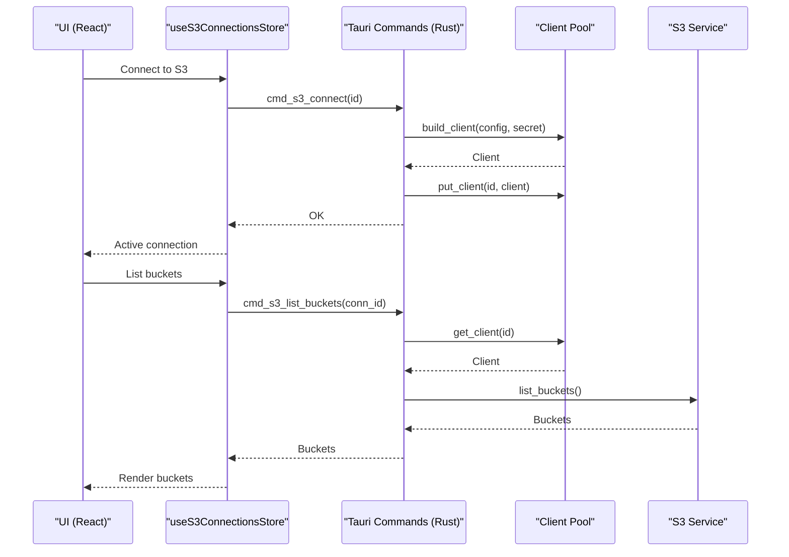

**Diagram sources**
- [s3-connections.ts:178-196](file://src/plugins/s3-client/store/s3-connections.ts#L178-L196)
- [commands.rs:94-106](file://src-tauri/src/plugins/s3/commands.rs#L94-L106)
- [client_pool.rs:61-77](file://src-tauri/src/plugins/s3/client_pool.rs#L61-L77)
- [commands.rs:211-249](file://src-tauri/src/plugins/s3/commands.rs#L211-L249)

## Detailed Component Analysis

### Connection Management System
- Connection form supports multiple providers (AWS, MinIO, Aliyun, Tencent, R2, Custom), region selection, endpoint auto-filling for supported providers, path-style addressing for MinIO, and optional manual bucket lists for restricted accounts.
- Test connection validates required fields and performs a quick connectivity check against the configured endpoint.
- Connect/disconnect maintains a client pool keyed by connection ID; disconnect removes the cached client.

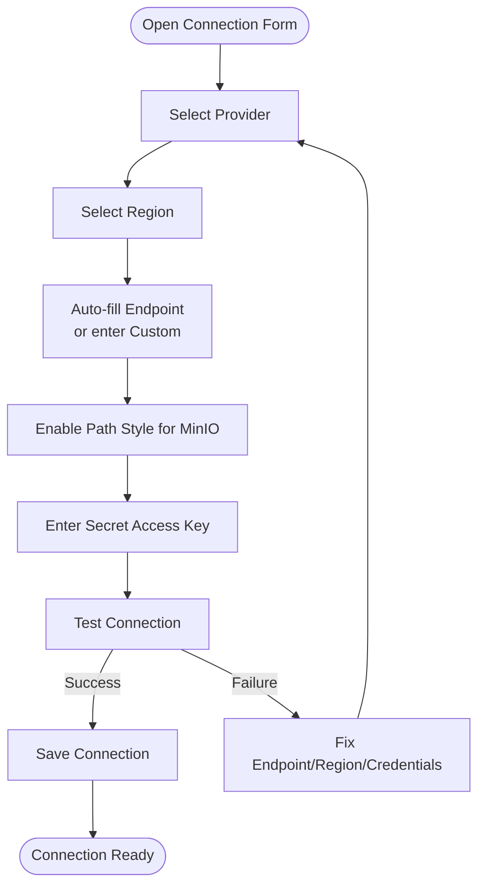

**Diagram sources**
- [S3ConnectionForm.tsx:14-94](file://src/plugins/s3-client/components/S3ConnectionForm.tsx#L14-L94)
- [S3ConnectionForm.tsx:96-107](file://src/plugins/s3-client/components/S3ConnectionForm.tsx#L96-L107)
- [client_pool.rs:15-32](file://src-tauri/src/plugins/s3/client_pool.rs#L15-L32)

**Section sources**
- [S3ConnectionForm.tsx:14-94](file://src/plugins/s3-client/components/S3ConnectionForm.tsx#L14-L94)
- [S3ConnectionForm.tsx:96-107](file://src/plugins/s3-client/components/S3ConnectionForm.tsx#L96-L107)
- [s3-connections.ts:178-196](file://src/plugins/s3-client/store/s3-connections.ts#L178-L196)
- [client_pool.rs:34-86](file://src-tauri/src/plugins/s3/client_pool.rs#L34-L86)

### Bucket Browser
- Lists buckets with filtering, refresh, create/delete, and open-to-object-browser actions.
- Supports manual bucket lists when ListBuckets is disallowed by IAM policies.
- Opens the object browser for the selected bucket and initializes prefix navigation.

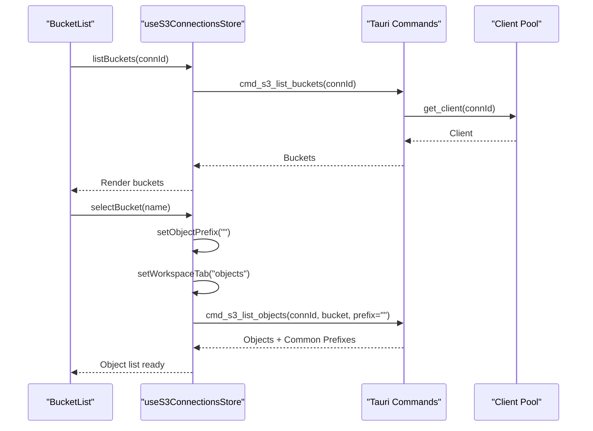

**Diagram sources**
- [BucketList.tsx:26-31](file://src/plugins/s3-client/views/BucketList.tsx#L26-L31)
- [BucketList.tsx:94-99](file://src/plugins/s3-client/views/BucketList.tsx#L94-L99)
- [s3-connections.ts:197-205](file://src/plugins/s3-client/store/s3-connections.ts#L197-L205)
- [commands.rs:211-249](file://src-tauri/src/plugins/s3/commands.rs#L211-L249)

**Section sources**
- [BucketList.tsx:19-191](file://src/plugins/s3-client/views/BucketList.tsx#L19-L191)
- [commands.rs:211-249](file://src-tauri/src/plugins/s3/commands.rs#L211-L249)

### Object Browser
- Navigation: Breadcrumb-based prefix traversal, search, sort, and view mode switching (list/grid).
- Actions: Preview (text/images via inline or presigned URL), download single object or folder, rename, copy path, delete single/multiple/folder, generate presigned URL, and batch delete.
- Metadata and tags: Details drawer shows metadata and editable tags; tags saved via backend commands.
- Upload: Single file and folder upload with automatic key derivation from prefix.

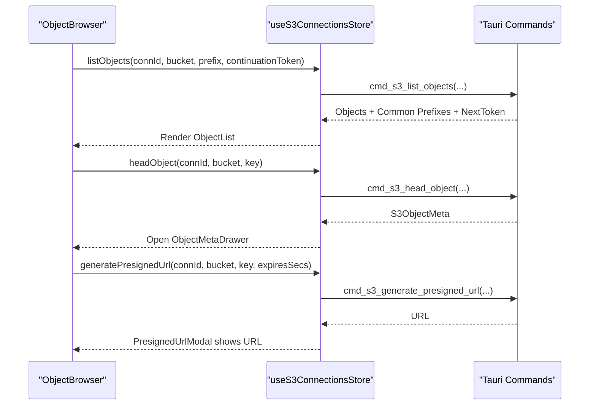

**Diagram sources**
- [ObjectBrowser.tsx:37-50](file://src/plugins/s3-client/views/ObjectBrowser.tsx#L37-L50)
- [ObjectBrowser.tsx:109-118](file://src/plugins/s3-client/views/ObjectBrowser.tsx#L109-L118)
- [ObjectBrowser.tsx:421-428](file://src/plugins/s3-client/views/ObjectBrowser.tsx#L421-L428)
- [s3-connections.ts:225-245](file://src/plugins/s3-client/store/s3-connections.ts#L225-L245)
- [s3-connections.ts:331-337](file://src/plugins/s3-client/store/s3-connections.ts#L331-L337)
- [s3-connections.ts:421-428](file://src/plugins/s3-client/store/s3-connections.ts#L421-L428)

**Section sources**
- [ObjectBrowser.tsx:27-468](file://src/plugins/s3-client/views/ObjectBrowser.tsx#L27-L468)
- [ObjectList.tsx:53-287](file://src/plugins/s3-client/components/ObjectList.tsx#L53-L287)
- [ObjectMetaDrawer.tsx:15-137](file://src/plugins/s3-client/components/ObjectMetaDrawer.tsx#L15-L137)
- [ObjectPreview.tsx:14-123](file://src/plugins/s3-client/components/ObjectPreview.tsx#L14-L123)
- [PresignedUrlModal.tsx:11-62](file://src/plugins/s3-client/components/PresignedUrlModal.tsx#L11-L62)

### Connection List
- Groups connections by group name, supports search, connect/open buckets, disconnect, edit, and delete.
- Double-click or context menu action opens buckets view after connecting.

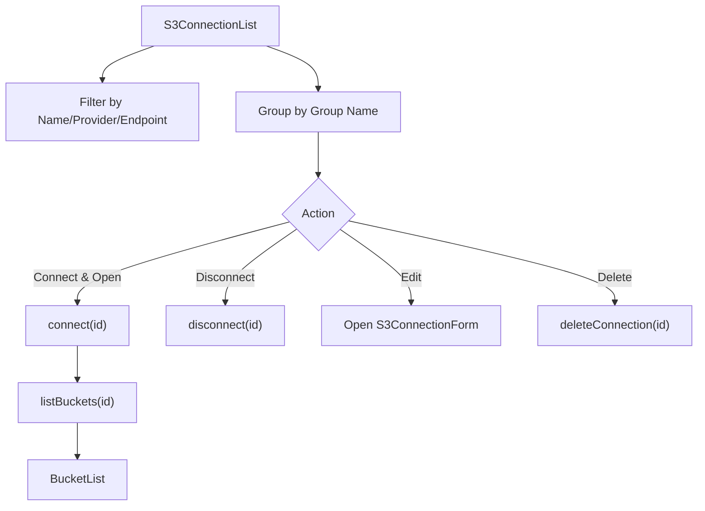

**Diagram sources**
- [S3ConnectionList.tsx:32-215](file://src/plugins/s3-client/views/S3ConnectionList.tsx#L32-L215)
- [s3-connections.ts:151-173](file://src/plugins/s3-client/store/s3-connections.ts#L151-L173)

**Section sources**
- [S3ConnectionList.tsx:32-215](file://src/plugins/s3-client/views/S3ConnectionList.tsx#L32-L215)

### Bucket Settings
- Provides bucket overview (region, object count, total size, storage class breakdown), toggles versioning, and manages bucket policy JSON.

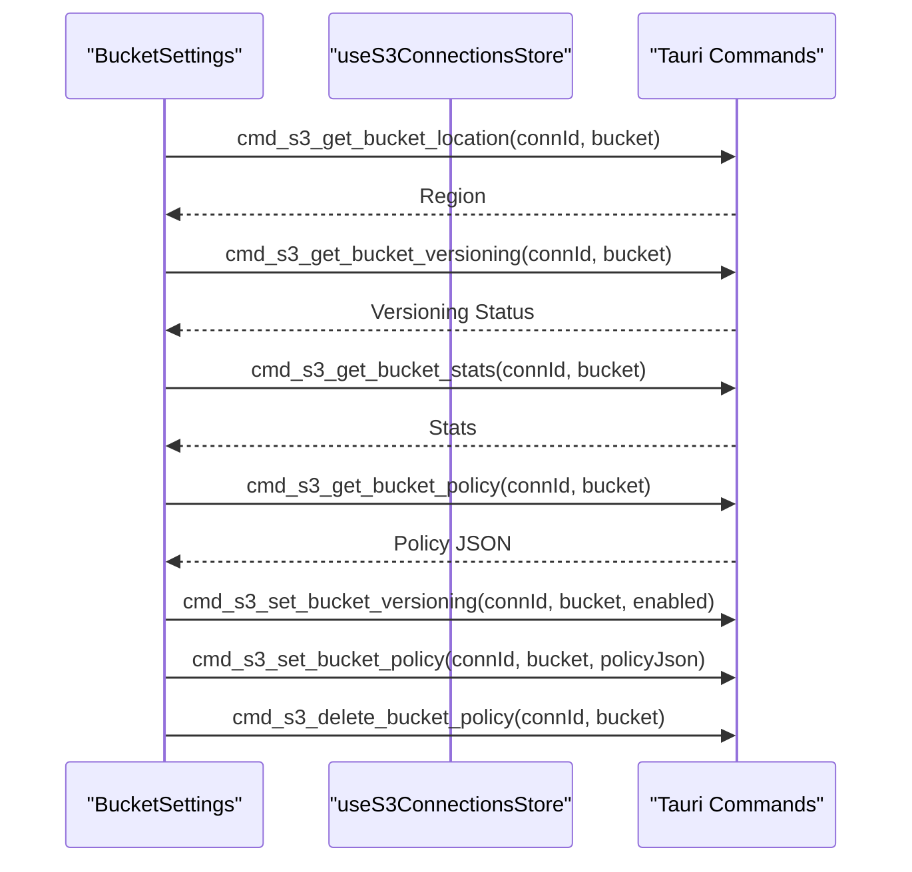

**Diagram sources**
- [BucketSettings.tsx:14-136](file://src/plugins/s3-client/components/BucketSettings.tsx#L14-L136)
- [commands.rs:252-268](file://src-tauri/src/plugins/s3/commands.rs#L252-L268)
- [commands.rs:271-315](file://src-tauri/src/plugins/s3/commands.rs#L271-L315)
- [commands.rs:318-359](file://src-tauri/src/plugins/s3/commands.rs#L318-L359)

**Section sources**
- [BucketSettings.tsx:14-136](file://src/plugins/s3-client/components/BucketSettings.tsx#L14-L136)

### Authentication and Secure Connection Handling
- Credentials: Access Key ID and Secret Access Key are required; secrets are stored and retrieved by the backend.
- Endpoint resolution: Provider-specific endpoints are auto-filled for Aliyun, Tencent, and R2; custom endpoints are supported; MinIO forces path-style addressing.
- Client caching: Clients are cached per connection ID to avoid repeated initialization and to support concurrent operations.

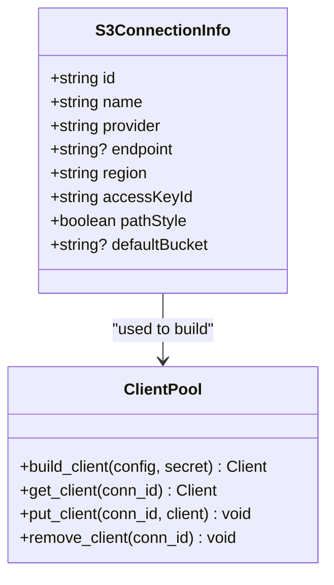

**Diagram sources**
- [types.ts:16-27](file://src/plugins/s3-client/types.ts#L16-L27)
- [client_pool.rs:34-86](file://src-tauri/src/plugins/s3/client_pool.rs#L34-L86)

**Section sources**
- [S3ConnectionForm.tsx:34-94](file://src/plugins/s3-client/components/S3ConnectionForm.tsx#L34-L94)
- [client_pool.rs:34-86](file://src-tauri/src/plugins/s3/client_pool.rs#L34-L86)

### Object Metadata Viewing and Preview
- Metadata: Retrieved via HEAD operation and displayed in a drawer with content type, size, ETag, last modified, storage class, and version ID.
- Tags: Managed via get/set commands; editable in the drawer with add/save/reload.
- Preview: Text content shown inline; images rendered via signed URL; others provide a copyable presigned URL.

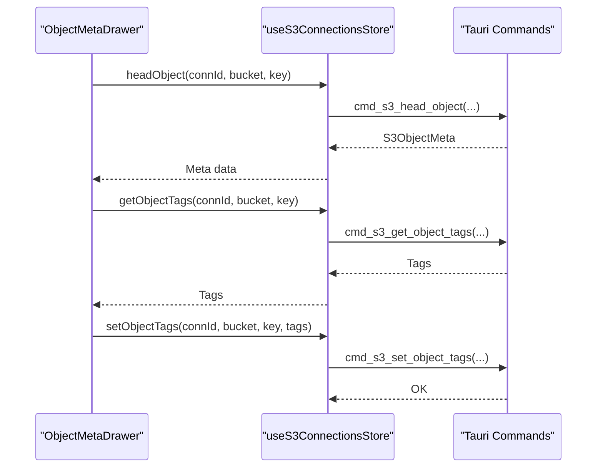

**Diagram sources**
- [ObjectMetaDrawer.tsx:15-137](file://src/plugins/s3-client/components/ObjectMetaDrawer.tsx#L15-L137)
- [s3-connections.ts:80-95](file://src/plugins/s3-client/store/s3-connections.ts#L80-L95)
- [commands.rs:460-493](file://src-tauri/src/plugins/s3/commands.rs#L460-L493)

**Section sources**
- [ObjectMetaDrawer.tsx:15-137](file://src/plugins/s3-client/components/ObjectMetaDrawer.tsx#L15-L137)
- [ObjectPreview.tsx:14-123](file://src/plugins/s3-client/components/ObjectPreview.tsx#L14-L123)
- [s3-connections.ts:80-95](file://src/plugins/s3-client/store/s3-connections.ts#L80-L95)

### Presigned URL Generation
- Generates temporary URLs with configurable expiration (5 minutes to 7 days).
- Copies generated URL to clipboard and supports inline preview for non-text content.

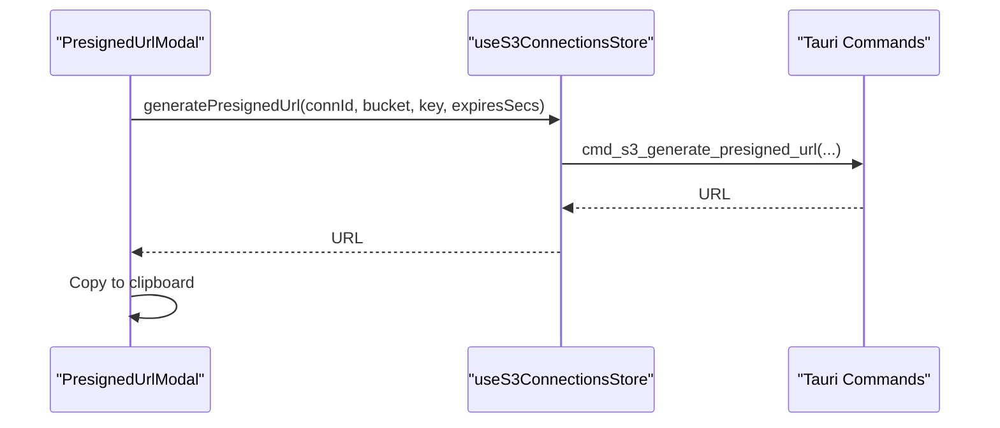

**Diagram sources**
- [PresignedUrlModal.tsx:11-62](file://src/plugins/s3-client/components/PresignedUrlModal.tsx#L11-L62)
- [s3-connections.ts:421-428](file://src/plugins/s3-client/store/s3-connections.ts#L421-L428)

**Section sources**
- [PresignedUrlModal.tsx:11-62](file://src/plugins/s3-client/components/PresignedUrlModal.tsx#L11-L62)

## Dependency Analysis
- Frontend depends on Ant Design components and Zustand for state.
- Zustand store orchestrates Tauri command invocations and updates UI state.
- Backend commands depend on the AWS SDK for Rust and maintain a static client pool.
- No circular dependencies observed between frontend components and stores; backend modules are cohesive.

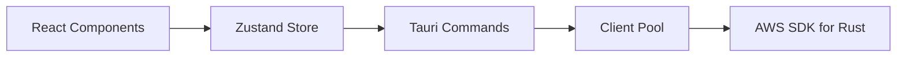

**Diagram sources**
- [s3-connections.ts:137-432](file://src/plugins/s3-client/store/s3-connections.ts#L137-L432)
- [client_pool.rs:34-86](file://src-tauri/src/plugins/s3/client_pool.rs#L34-L86)
- [commands.rs:14-1164](file://src-tauri/src/plugins/s3/commands.rs#L14-L1164)

**Section sources**
- [s3-connections.ts:137-432](file://src/plugins/s3-client/store/s3-connections.ts#L137-L432)
- [client_pool.rs:34-86](file://src-tauri/src/plugins/s3/client_pool.rs#L34-L86)
- [commands.rs:14-1164](file://src-tauri/src/plugins/s3/commands.rs#L14-L1164)

## Performance Considerations
- Pagination and continuation tokens: The object listing uses continuation tokens to load more results incrementally, reducing memory overhead for large buckets.
- Virtualized table: Object list uses virtualization to render large datasets efficiently.
- Client caching: Reusing clients avoids repeated credential loading and endpoint configuration overhead.
- Batch operations: Deleting multiple objects and folders leverages batch APIs to minimize round trips.

[No sources needed since this section provides general guidance]

## Troubleshooting Guide
- Connection failures:
  - Verify provider and region; auto-filled endpoints apply only to supported providers.
  - For accounts with restricted permissions, configure Manual Buckets in the connection form.
- Listing buckets fails:
  - Use Manual Buckets for accounts that cannot call ListBuckets.
- Upload/download issues:
  - Ensure local paths are valid and accessible.
  - Confirm bucket and key names conform to S3 naming conventions.
- Presigned URL problems:
  - Adjust expiration; ensure the object exists and is readable.
- Metadata/tags:
  - Some providers may not support tagging; verify provider compatibility.

**Section sources**
- [commands.rs:219-228](file://src-tauri/src/plugins/s3/commands.rs#L219-L228)
- [S3ConnectionForm.tsx:209-218](file://src/plugins/s3-client/components/S3ConnectionForm.tsx#L209-L218)

## Conclusion
The S3 client plugin integrates seamlessly with RDMM’s plugin architecture, offering robust S3-compatible storage management. It supports secure connections, multi-provider configurations, comprehensive bucket and object browsing, metadata and tag management, previews, and presigned URL generation. The backend client pool and Tauri commands ensure efficient and reliable operations, while the frontend provides an intuitive UI for administrators and developers.

[No sources needed since this section summarizes without analyzing specific files]

## Appendices

### Practical Examples

- Connecting to an S3-compatible service:
  - Open the connection list, click New, choose provider and region, optionally set endpoint for custom providers, enter credentials, and click Test Connection. On success, save and connect.
  - Reference: [S3ConnectionList.tsx:75-83](file://src/plugins/s3-client/views/S3ConnectionList.tsx#L75-L83), [S3ConnectionForm.tsx:96-107](file://src/plugins/s3-client/components/S3ConnectionForm.tsx#L96-L107)

- Browsing bucket contents:
  - After connecting, open Buckets and double-click a bucket to navigate to the Object Browser. Use breadcrumb navigation to traverse prefixes.
  - Reference: [BucketList.tsx:94-99](file://src/plugins/s3-client/views/BucketList.tsx#L94-L99), [ObjectBrowser.tsx:103-107](file://src/plugins/s3-client/views/ObjectBrowser.tsx#L103-L107)

- Uploading and downloading objects:
  - Upload a single file or an entire folder from the Object Browser; download individual objects or folders using the respective dialogs.
  - Reference: [ObjectBrowser.tsx:384-425](file://src/plugins/s3-client/views/ObjectBrowser.tsx#L384-L425), [ObjectBrowser.tsx:426-464](file://src/plugins/s3-client/views/ObjectBrowser.tsx#L426-L464)

- Managing object metadata and tags:
  - Open the details drawer to view metadata and edit tags; save changes to persist.
  - Reference: [ObjectMetaDrawer.tsx:30-137](file://src/plugins/s3-client/components/ObjectMetaDrawer.tsx#L30-L137)

- Generating temporary access links:
  - Use the presigned URL modal to generate a temporary link with a chosen expiration; copy the URL to share.
  - Reference: [PresignedUrlModal.tsx:23-62](file://src/plugins/s3-client/components/PresignedUrlModal.tsx#L23-L62)

- Security considerations and best practices:
  - Use least-privilege credentials; rotate secrets regularly; prefer path-style addressing for MinIO; restrict exposure of presigned URLs by setting shorter expirations.
  - Reference: [S3ConnectionForm.tsx:200-218](file://src/plugins/s3-client/components/S3ConnectionForm.tsx#L200-L218), [ObjectPreview.tsx:71-101](file://src/plugins/s3-client/components/ObjectPreview.tsx#L71-L101)