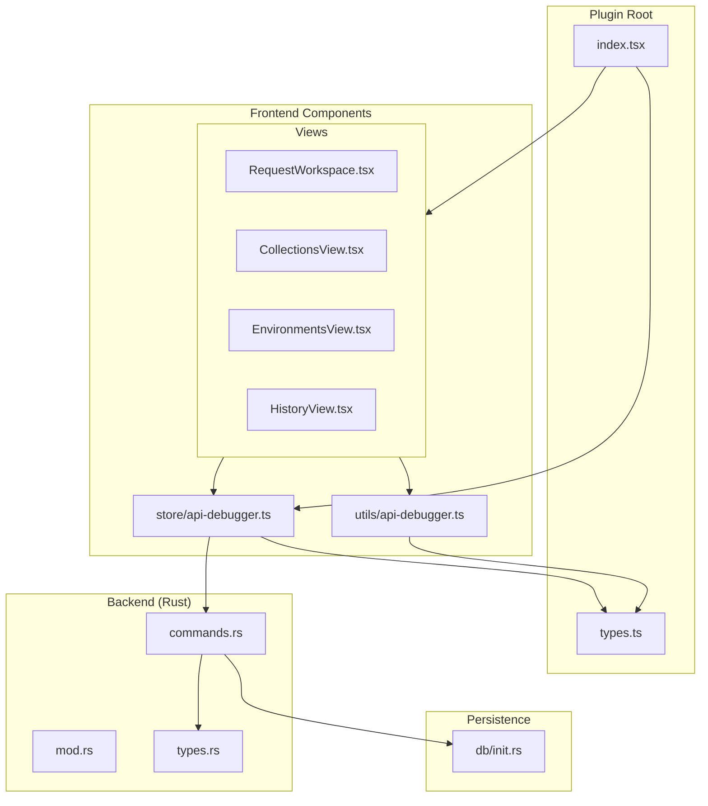
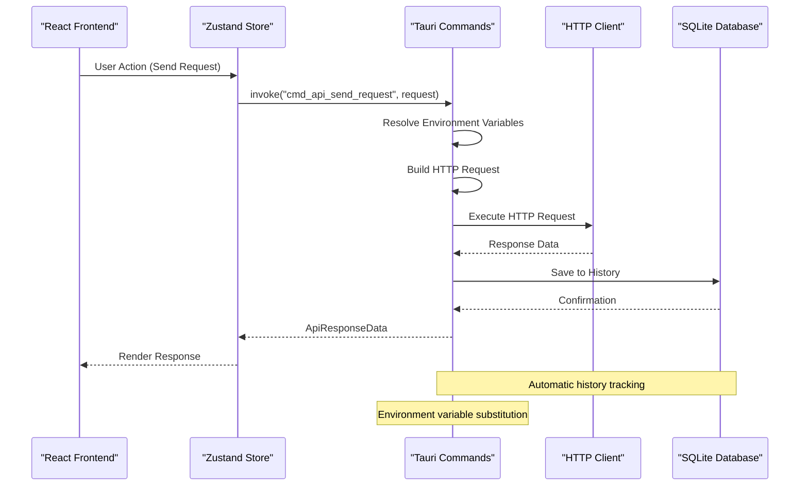
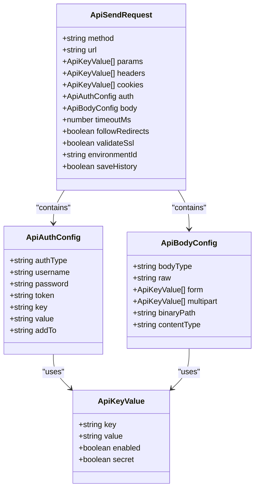
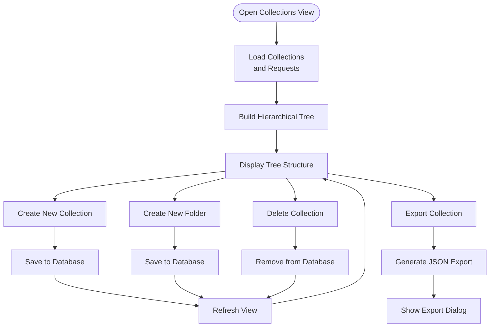
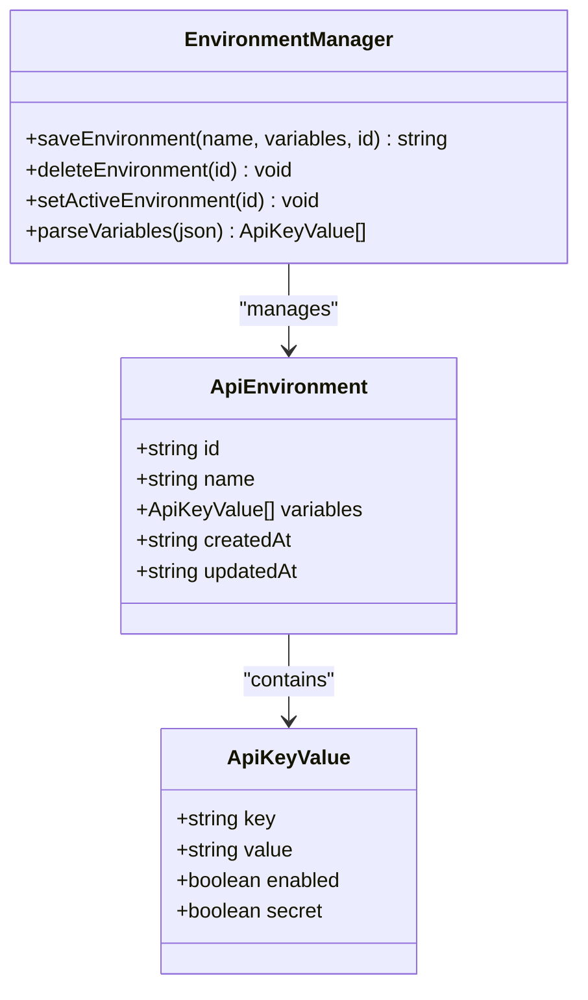
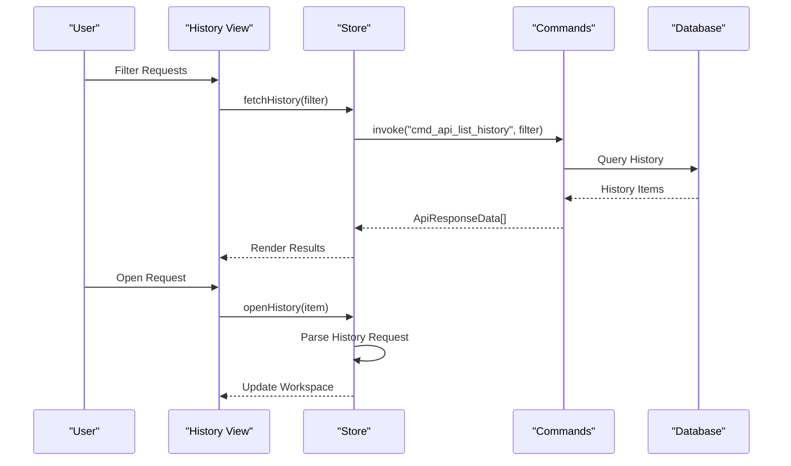
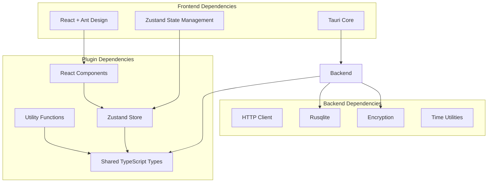

# API Debugger

<cite>
**Referenced Files in This Document**
- [index.tsx](file://src/plugins/api-debugger/index.tsx)
- [types.ts](file://src/plugins/api-debugger/types.ts)
- [api-debugger.ts](file://src/plugins/api-debugger/store/api-debugger.ts)
- [api-debugger.ts](file://src/plugins/api-debugger/utils/api-debugger.ts)
- [RequestWorkspace.tsx](file://src/plugins/api-debugger/views/RequestWorkspace.tsx)
- [CollectionsView.tsx](file://src/plugins/api-debugger/views/CollectionsView.tsx)
- [EnvironmentsView.tsx](file://src/plugins/api-debugger/views/EnvironmentsView.tsx)
- [HistoryView.tsx](file://src/plugins/api-debugger/views/HistoryView.tsx)
- [mod.rs](file://src-tauri/src/plugins/api_debugger/mod.rs)
- [commands.rs](file://src-tauri/src/plugins/api_debugger/commands.rs)
- [types.rs](file://src-tauri/src/plugins/api_debugger/types.rs)
- [init.rs](file://src-tauri/src/db/init.rs)
- [api-debugger.test.ts](file://tests/app/api-debugger.test.ts)
</cite>

## Table of Contents
1. [Introduction](#introduction)
2. [Project Structure](#project-structure)
3. [Core Components](#core-components)
4. [Architecture Overview](#architecture-overview)
5. [Detailed Component Analysis](#detailed-component-analysis)
6. [Dependency Analysis](#dependency-analysis)
7. [Performance Considerations](#performance-considerations)
8. [Troubleshooting Guide](#troubleshooting-guide)
9. [Conclusion](#conclusion)
10. [Appendices](#appendices)

## Introduction
The API Debugger plugin provides a comprehensive HTTP request testing and debugging environment within the application. It offers a modern, tabbed interface for composing and sending HTTP requests, organizing endpoints into collections, managing environment variables, and tracking request history. The plugin integrates seamlessly with the application's plugin system and leverages a Rust backend for robust HTTP operations, secure environment variable storage, and persistent data management.

The plugin supports multiple authentication methods, flexible header and body management, and advanced features like environment variable substitution, request previews, and performance monitoring. It is designed for developers who need to test APIs quickly and efficiently while maintaining organized workflows and reusable configurations.

## Project Structure
The API Debugger plugin follows a modular architecture with clear separation between frontend React components, shared TypeScript types, and backend Rust implementations. The structure emphasizes maintainability and scalability while providing a cohesive user experience.

**Diagram sources**
- [index.tsx:1-39](file://src/plugins/api-debugger/index.tsx#L1-L39)
- [store/api-debugger.ts:1-129](file://src/plugins/api-debugger/store/api-debugger.ts#L1-L129)
- [commands.rs:1-791](file://src-tauri/src/plugins/api_debugger/commands.rs#L1-L791)

**Section sources**
- [index.tsx:1-39](file://src/plugins/api-debugger/index.tsx#L1-L39)
- [types.ts:1-105](file://src/plugins/api-debugger/types.ts#L1-L105)

## Core Components
The API Debugger consists of four primary components that work together to provide a complete HTTP testing solution:

### Four-Tab Interface
The plugin presents a segmented control interface with four distinct tabs, each serving a specific purpose in the API testing workflow:

- **Workspace Tab**: Primary interface for composing and sending HTTP requests
- **Collections Tab**: Organizes endpoints into logical groupings with hierarchical folder structures
- **Environments Tab**: Manages environment-specific variables and configuration
- **History Tab**: Tracks and analyzes previous request executions

### Request Composition Engine
The Workspace provides comprehensive controls for building HTTP requests with support for various methods, headers, authentication schemes, and body formats. It includes real-time validation, preview capabilities, and integrated response analysis.

### Collection Management System
Collections serve as organizational containers that can hold multiple requests organized into hierarchical folder structures. This enables teams to maintain structured libraries of API endpoints and test scenarios.

### Environment Variable Management
The plugin supports environment-based variable substitution, allowing users to define variables for different deployment targets (development, staging, production) with optional encryption for sensitive values.

### History Tracking and Analysis
Every request execution is automatically tracked with detailed metadata, enabling users to review past requests, filter by criteria, and analyze performance metrics.

**Section sources**
- [index.tsx:24-38](file://src/plugins/api-debugger/index.tsx#L24-L38)
- [types.ts:104](file://src/plugins/api-debugger/types.ts#L104)

## Architecture Overview
The API Debugger employs a client-server architecture with a React frontend communicating with a Rust backend through Tauri commands. This design provides security isolation, performance benefits, and access to native system capabilities.

**Diagram sources**
- [store/api-debugger.ts:62-72](file://src/plugins/api-debugger/store/api-debugger.ts#L62-L72)
- [commands.rs:404-475](file://src-tauri/src/plugins/api_debugger/commands.rs#L404-L475)

The architecture ensures thread safety, efficient memory management, and robust error handling while maintaining responsive user interactions.

**Section sources**
- [store/api-debugger.ts:1-129](file://src/plugins/api-debugger/store/api-debugger.ts#L1-L129)
- [commands.rs:1-791](file://src-tauri/src/plugins/api_debugger/commands.rs#L1-L791)

## Detailed Component Analysis

### Workspace Component
The Workspace serves as the primary interface for HTTP request composition and testing. It provides comprehensive controls for all aspects of HTTP request construction and response analysis.

**Diagram sources**
- [types.ts:27-41](file://src/plugins/api-debugger/types.ts#L27-L41)
- [types.ts:8-16](file://src/plugins/api-debugger/types.ts#L8-L16)
- [types.ts:18-25](file://src/plugins/api-debugger/types.ts#L18-L25)
- [types.ts:1-6](file://src/plugins/api-debugger/types.ts#L1-L6)

The Workspace component includes specialized editors for different data types:

- **KeyValueEditor**: Generic editor for key-value pairs used in headers, cookies, and form data
- **ResponsePanel**: Comprehensive response analysis with multiple tabs for different response aspects
- **Authentication Controls**: Support for Basic, Bearer, and API Key authentication methods
- **Body Editors**: Multiple body formats including raw, JSON, XML, form-encoded, multipart, and binary

**Section sources**
- [RequestWorkspace.tsx:1-223](file://src/plugins/api-debugger/views/RequestWorkspace.tsx#L1-L223)
- [types.ts:1-105](file://src/plugins/api-debugger/types.ts#L1-L105)

### Collections Component
The Collections view provides hierarchical organization for API endpoints and test scenarios. It supports nested folder structures and integrates with the Workspace for easy request creation and management.

**Diagram sources**
- [CollectionsView.tsx:59-166](file://src/plugins/api-debugger/views/CollectionsView.tsx#L59-L166)

The collection system supports:
- Hierarchical folder organization with unlimited nesting
- Direct request assignment to collections or folders
- Bulk export functionality for sharing and backup
- Real-time synchronization with the database

**Section sources**
- [CollectionsView.tsx:1-166](file://src/plugins/api-debugger/views/CollectionsView.tsx#L1-L166)

### Environments Component
The Environments view manages environment-specific variables and configuration. It supports multiple environments with different variable sets for various deployment targets.

**Diagram sources**
- [types.ts:68-68](file://src/plugins/api-debugger/types.ts#L68-L68)
- [types.ts:1-6](file://src/plugins/api-debugger/types.ts#L1-L6)

Key features include:
- Variable encryption for sensitive values
- Template-based variable substitution in requests
- Active environment selection and switching
- Support for secret variables with masking

**Section sources**
- [EnvironmentsView.tsx:1-64](file://src/plugins/api-debugger/views/EnvironmentsView.tsx#L1-L64)
- [types.ts:68-68](file://src/plugins/api-debugger/types.ts#L68-L68)

### History Component
The History view tracks all request executions with detailed metadata and allows filtering and analysis of past requests.

**Diagram sources**
- [HistoryView.tsx:6-37](file://src/plugins/api-debugger/views/HistoryView.tsx#L6-L37)
- [store/api-debugger.ts:89](file://src/plugins/api-debugger/store/api-debugger.ts#L89)

The history system provides:
- Filtering by method, host, and status
- Request restoration to Workspace
- Export functionality for analysis
- Performance metrics tracking

**Section sources**
- [HistoryView.tsx:1-37](file://src/plugins/api-debugger/views/HistoryView.tsx#L1-L37)
- [store/api-debugger.ts:89](file://src/plugins/api-debugger/store/api-debugger.ts#L89)

## Dependency Analysis
The API Debugger plugin demonstrates excellent separation of concerns with clear dependency relationships between frontend and backend components.

**Diagram sources**
- [store/api-debugger.ts:1-5](file://src/plugins/api-debugger/store/api-debugger.ts#L1-L5)
- [commands.rs:1-8](file://src-tauri/src/plugins/api_debugger/commands.rs#L1-L8)

The dependency structure ensures:
- Loose coupling between components
- Clear data flow boundaries
- Efficient state management
- Secure data handling

**Section sources**
- [store/api-debugger.ts:1-129](file://src/plugins/api-debugger/store/api-debugger.ts#L1-L129)
- [commands.rs:1-791](file://src-tauri/src/plugins/api_debugger/commands.rs#L1-L791)

## Performance Considerations
The API Debugger is designed with performance optimization in mind, implementing several strategies to ensure responsive user interactions and efficient resource utilization.

### Memory Management
- Request bodies are truncated to prevent excessive memory usage
- Response bodies are limited to prevent UI blocking
- Temporary objects are cleaned up after request completion
- Efficient state updates minimize re-renders

### Network Optimization
- Configurable timeout settings prevent hanging requests
- Redirect handling is configurable to balance convenience and control
- SSL validation can be disabled for development environments
- Connection pooling and reuse strategies

### Database Efficiency
- Batch operations for bulk data loading
- Efficient query patterns with appropriate indexing
- Lazy loading of large datasets
- Background processing for heavy operations

### UI Responsiveness
- Debounced input handling for real-time validation
- Asynchronous operations with loading states
- Progressive rendering of large lists
- Optimized component re-rendering

## Troubleshooting Guide

### Common Issues and Solutions

#### Authentication Problems
- **Issue**: Authentication fails with 401 errors
- **Solution**: Verify environment variables are properly set and substituted
- **Debug Steps**: Check authentication type selection, verify credentials, test with Preview feature

#### Environment Variable Issues
- **Issue**: Variables not substituting in URLs or headers
- **Solution**: Ensure variables are marked as enabled and properly formatted
- **Debug Steps**: Use Preview to see resolved values, check for missing variables warning

#### Request Timeout Errors
- **Issue**: Requests timing out during execution
- **Solution**: Increase timeout value in request settings
- **Debug Steps**: Monitor response duration, check network connectivity

#### Response Display Problems
- **Issue**: Response body not displaying correctly
- **Solution**: Verify content type headers and response encoding
- **Debug Steps**: Check raw response tab, verify body truncation settings

#### Database Connection Issues
- **Issue**: Data not persisting between sessions
- **Solution**: Verify database file permissions and disk space
- **Debug Steps**: Check database path, restart application, verify file integrity

**Section sources**
- [commands.rs:349-361](file://src-tauri/src/plugins/api_debugger/commands.rs#L349-L361)
- [utils/api-debugger.ts:31-39](file://src/plugins/api-debugger/utils/api-debugger.ts#L31-L39)

## Conclusion
The API Debugger plugin provides a comprehensive solution for HTTP request testing and debugging within the application ecosystem. Its modular architecture, robust backend implementation, and intuitive frontend design create a powerful tool for developers and testers.

Key strengths include:
- **Modular Design**: Clean separation between frontend and backend components
- **Security Focus**: Environment variable encryption and sensitive data handling
- **Extensibility**: Plugin architecture allows for future enhancements
- **Performance**: Optimized for responsive user interactions and efficient resource usage
- **Organization**: Hierarchical collection system for scalable API management

The plugin successfully balances functionality with usability, providing both powerful features for advanced users and accessible interfaces for beginners. Its integration with the broader application ecosystem ensures seamless workflow integration and consistent user experience.

## Appendices

### Practical Usage Scenarios

#### Scenario 1: Testing REST API Endpoints
1. Create environment variables for base URLs and authentication tokens
2. Compose requests in Workspace with appropriate headers and authentication
3. Use Collections to organize related endpoints
4. Monitor response timing and analyze performance metrics
5. Save successful configurations to Collections for reuse

#### Scenario 2: API Integration Testing
1. Set up separate environments for development and production
2. Configure environment-specific variables and authentication
3. Test endpoint variations with different parameter combinations
4. Track request history for regression analysis
5. Export collections for team collaboration

#### Scenario 3: Performance Testing Workflow
1. Configure timeout and redirect settings for performance testing
2. Execute repeated requests with varying load conditions
3. Analyze response times and error rates
4. Use history filtering to identify performance bottlenecks
5. Document performance baselines for monitoring

### Best Practices
- Use environment variables for sensitive data and configuration
- Organize endpoints into logical collections and folders
- Regularly review and clean up unused requests
- Utilize the Preview feature for request validation
- Leverage history tracking for debugging and analysis
- Export collections for backup and team sharing