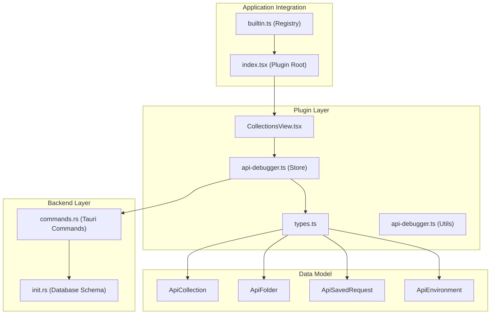
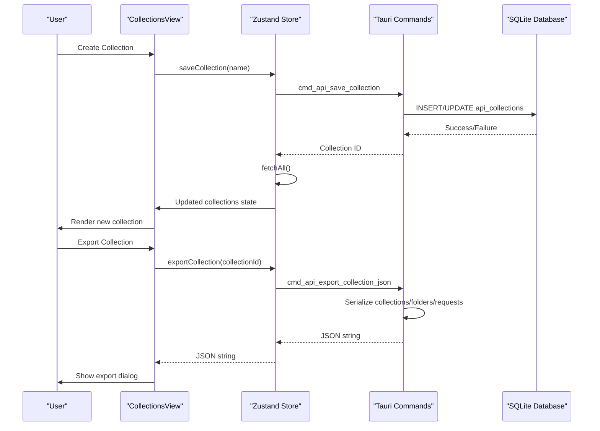
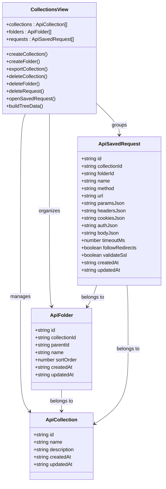
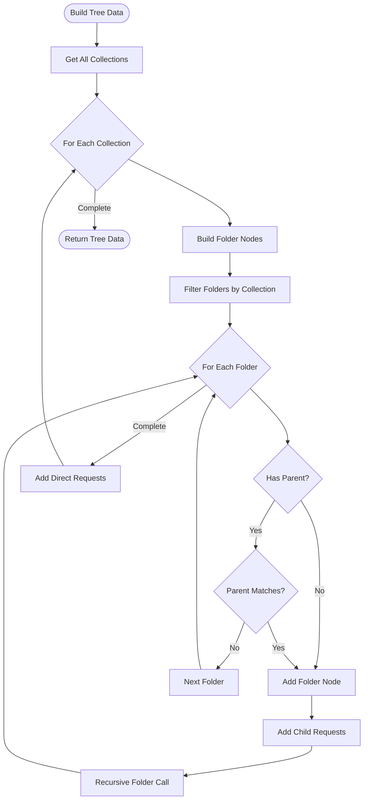
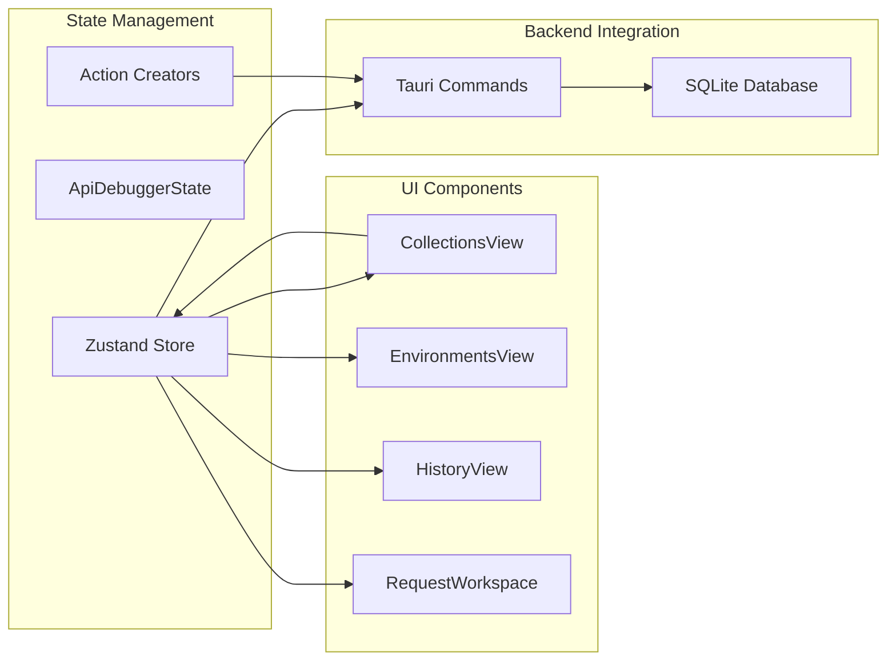
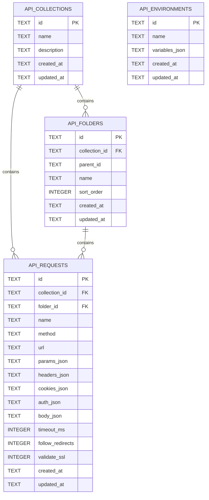
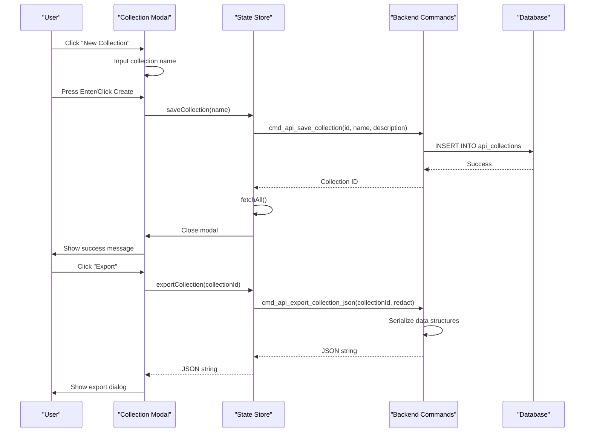
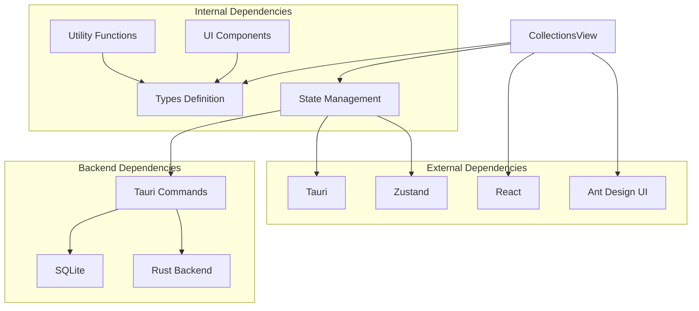

# Collections View

<cite>
**Referenced Files in This Document**
- [CollectionsView.tsx](file://src/plugins/api-debugger/views/CollectionsView.tsx)
- [api-debugger.ts](file://src/plugins/api-debugger/store/api-debugger.ts)
- [types.ts](file://src/plugins/api-debugger/types.ts)
- [api-debugger.ts](file://src/plugins/api-debugger/utils/api-debugger.ts)
- [commands.rs](file://src-tauri/src/plugins/api_debugger/commands.rs)
- [init.rs](file://src-tauri/src/db/init.rs)
- [index.tsx](file://src/plugins/api-debugger/index.tsx)
- [builtin.ts](file://src/app/plugin-registry/builtin.ts)
</cite>

## Table of Contents
1. [Introduction](#introduction)
2. [Project Structure](#project-structure)
3. [Core Components](#core-components)
4. [Architecture Overview](#architecture-overview)
5. [Detailed Component Analysis](#detailed-component-analysis)
6. [Dependency Analysis](#dependency-analysis)
7. [Performance Considerations](#performance-considerations)
8. [Troubleshooting Guide](#troubleshooting-guide)
9. [Conclusion](#conclusion)

## Introduction
The Collections View component provides a comprehensive interface for organizing and managing API endpoints within the application. It enables developers to create logical groupings of API requests through collections and nested folders, facilitating efficient navigation and maintenance of large API suites. The component offers robust functionality for creating, organizing, and sharing API collections while integrating seamlessly with the application's state management and backend persistence layer.

## Project Structure
The Collections View is part of the API Debugger plugin ecosystem, which follows a modular architecture with clear separation between frontend presentation, state management, and backend data persistence.

**Diagram sources**
- [CollectionsView.tsx:1-166](file://src/plugins/api-debugger/views/CollectionsView.tsx#L1-L166)
- [api-debugger.ts:1-129](file://src/plugins/api-debugger/store/api-debugger.ts#L1-L129)
- [commands.rs:1-791](file://src-tauri/src/plugins/api-debugger/commands.rs#L1-L791)
- [init.rs:179-236](file://src-tauri/src/db/init.rs#L179-L236)

**Section sources**
- [CollectionsView.tsx:1-166](file://src/plugins/api-debugger/views/CollectionsView.tsx#L1-L166)
- [api-debugger.ts:1-129](file://src/plugins/api-debugger/store/api-debugger.ts#L1-L129)
- [index.tsx:1-39](file://src/plugins/api-debugger/index.tsx#L1-L39)
- [builtin.ts:1-31](file://src/app/plugin-registry/builtin.ts#L1-L31)

## Core Components
The Collections View consists of several interconnected components that work together to provide a comprehensive API collection management experience:

### Primary Components
- **Collections Tree**: Hierarchical display of collections, folders, and requests
- **Collection Management**: Creation, deletion, and modification of collections
- **Folder Organization**: Nested folder structure for request categorization
- **Request Grouping**: Association of individual requests with collections and folders
- **Export Functionality**: Collection serialization for sharing and backup

### Data Models
The component operates on four primary data structures:
- **ApiCollection**: Top-level container with metadata (id, name, description, timestamps)
- **ApiFolder**: Hierarchical organization unit with parent-child relationships
- **ApiSavedRequest**: Persisted API request configurations with JSON serialization
- **ApiEnvironment**: Variable management for request templating

**Section sources**
- [types.ts:66-87](file://src/plugins/api-debugger/types.ts#L66-L87)
- [CollectionsView.tsx:59-166](file://src/plugins/api-debugger/views/CollectionsView.tsx#L59-L166)

## Architecture Overview
The Collections View implements a unidirectional data flow architecture with clear separation of concerns between presentation, state management, and data persistence.

**Diagram sources**
- [CollectionsView.tsx:77-93](file://src/plugins/api-debugger/views/CollectionsView.tsx#L77-L93)
- [api-debugger.ts:101-109](file://src/plugins/api-debugger/store/api-debugger.ts#L101-L109)
- [commands.rs:495-508](file://src-tauri/src/plugins/api-debugger/commands.rs#L495-L508)

The architecture follows these key principles:
- **Immutable State Updates**: Zustand ensures predictable state transitions
- **Command Pattern**: Tauri commands provide clean backend abstraction
- **JSON Serialization**: Requests are stored as JSON for portability
- **Hierarchical Organization**: Collections support nested folder structures

## Detailed Component Analysis

### Collections Tree Implementation
The Collections Tree provides a hierarchical view of the entire collection structure with intelligent rendering of collections, folders, and requests.

**Diagram sources**
- [CollectionsView.tsx:59-166](file://src/plugins/api-debugger/views/CollectionsView.tsx#L59-L166)
- [types.ts:66-87](file://src/plugins/api-debugger/types.ts#L66-L87)

#### Tree Construction Logic
The component builds a hierarchical tree structure using recursive folder traversal:

**Diagram sources**
- [CollectionsView.tsx:119-143](file://src/plugins/api-debugger/views/CollectionsView.tsx#L119-L143)

**Section sources**
- [CollectionsView.tsx:119-143](file://src/plugins/api-debugger/views/CollectionsView.tsx#L119-L143)

### State Management Architecture
The component leverages Zustand for efficient state management with automatic reactivity and minimal boilerplate.

**Diagram sources**
- [api-debugger.ts:47-129](file://src/plugins/api-debugger/store/api-debugger.ts#L47-L129)
- [index.tsx:13-36](file://src/plugins/api-debugger/index.tsx#L13-L36)

The store maintains separate slices for different concerns:
- **Collections Management**: CRUD operations for collections
- **Folder Organization**: Hierarchical folder structure
- **Request Storage**: Saved API requests with JSON serialization
- **Environment Variables**: Variable substitution for templates

**Section sources**
- [api-debugger.ts:7-45](file://src/plugins/api-debugger/store/api-debugger.ts#L7-L45)
- [api-debugger.ts:47-129](file://src/plugins/api-debugger/store/api-debugger.ts#L47-L129)

### Backend Data Persistence
The backend implements a comprehensive SQLite-based persistence layer with proper transaction handling and data integrity guarantees.

**Diagram sources**
- [init.rs:179-236](file://src-tauri/src/db/init.rs#L179-L236)

The database schema supports:
- **Hierarchical Folders**: Parent-child relationships with recursive queries
- **Request Organization**: Collection and folder associations
- **Environment Variables**: JSON-encoded variable sets with encryption
- **Audit Trail**: Creation and modification timestamps

**Section sources**
- [init.rs:179-236](file://src-tauri/src/db/init.rs#L179-L236)
- [commands.rs:483-515](file://src-tauri/src/plugins/api-debugger/commands.rs#L483-L515)

### Collection Operations Workflow
The component provides comprehensive collection management with intuitive user interactions.

**Diagram sources**
- [CollectionsView.tsx:77-117](file://src/plugins/api-debugger/views/CollectionsView.tsx#L77-L117)
- [api-debugger.ts:101-109](file://src/plugins/api-debugger/store/api-debugger.ts#L101-L109)
- [commands.rs:740-746](file://src-tauri/src/plugins/api-debugger/commands.rs#L740-L746)

**Section sources**
- [CollectionsView.tsx:77-117](file://src/plugins/api-debugger/views/CollectionsView.tsx#L77-L117)
- [api-debugger.ts:101-109](file://src/plugins/api-debugger/store/api-debugger.ts#L101-L109)

## Dependency Analysis
The Collections View has well-defined dependencies that promote maintainability and testability.

**Diagram sources**
- [CollectionsView.tsx:1-10](file://src/plugins/api-debugger/views/CollectionsView.tsx#L1-L10)
- [api-debugger.ts:1-6](file://src/plugins/api-debugger/store/api-debugger.ts#L1-L6)

### Component Coupling Analysis
The component demonstrates low coupling and high cohesion:
- **UI Logic**: Minimal DOM manipulation, pure functional components
- **State Management**: Clear separation between UI and state logic
- **Data Access**: Single source of truth through Tauri commands
- **Error Handling**: Centralized error messaging through Ant Design

**Section sources**
- [CollectionsView.tsx:1-166](file://src/plugins/api-debugger/views/CollectionsView.tsx#L1-L166)
- [api-debugger.ts:1-129](file://src/plugins/api-debugger/store/api-debugger.ts#L1-L129)

## Performance Considerations
The Collections View is designed with performance optimization in mind:

### Rendering Optimizations
- **Memoized Tree Construction**: Uses `useMemo` to prevent unnecessary re-renders
- **Selective Updates**: Individual state updates trigger targeted re-renders
- **Efficient Filtering**: Database-level filtering reduces memory overhead

### Memory Management
- **Lazy Loading**: Collections are fetched on demand rather than at startup
- **Batch Operations**: Multiple API calls are combined using `Promise.all`
- **Resource Cleanup**: Automatic cleanup of temporary state during operations

### Scalability Features
- **Hierarchical Queries**: Database supports deep folder nesting efficiently
- **Pagination Ready**: Backend supports filtering and limiting results
- **Index Optimization**: Proper indexing on foreign key relationships

## Troubleshooting Guide

### Common Issues and Solutions

#### Collection Creation Failures
**Symptoms**: Collection creation fails silently or throws errors
**Causes**: 
- Empty collection names
- Database connectivity issues
- Permission problems

**Solutions**:
- Validate input before submission
- Check database health
- Verify file system permissions

#### Export Operation Problems
**Symptoms**: Export fails or produces incomplete data
**Causes**:
- Large collection sizes exceeding limits
- Database corruption
- Memory constraints

**Solutions**:
- Split large collections into smaller chunks
- Run database integrity checks
- Monitor memory usage during export

#### Tree Rendering Issues
**Symptoms**: Folders not displaying correctly or requests missing
**Causes**:
- Circular parent-child relationships
- Database inconsistencies
- State synchronization delays

**Solutions**:
- Validate folder hierarchy integrity
- Re-fetch data from backend
- Check for concurrent modification conflicts

**Section sources**
- [CollectionsView.tsx:77-117](file://src/plugins/api-debugger/views/CollectionsView.tsx#L77-L117)
- [api-debugger.ts:101-129](file://src/plugins/api-debugger/store/api-debugger.ts#L101-L129)

## Conclusion
The Collections View component provides a robust, scalable solution for organizing and managing API endpoints within the application. Its architecture balances simplicity with powerful functionality, offering developers intuitive tools for:

- **Hierarchical Organization**: Natural folder-based structure for complex API suites
- **Cross-Platform Sharing**: JSON export/import for team collaboration
- **Template Management**: Environment variables for request customization
- **Performance Optimization**: Efficient rendering and data access patterns
- **Extensibility**: Clean separation enabling future enhancements

The component's design promotes maintainability through clear separation of concerns, comprehensive error handling, and adherence to React best practices. Its integration with the broader application ecosystem ensures seamless workflow integration while maintaining flexibility for future enhancements.