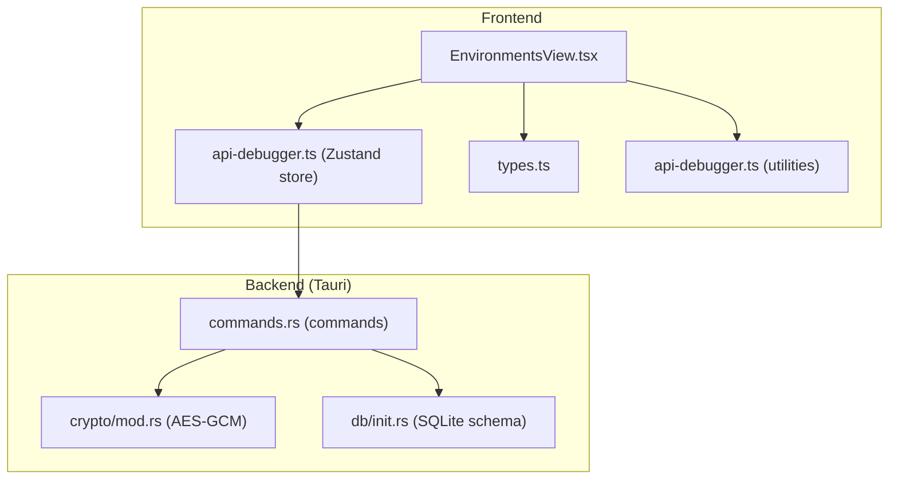
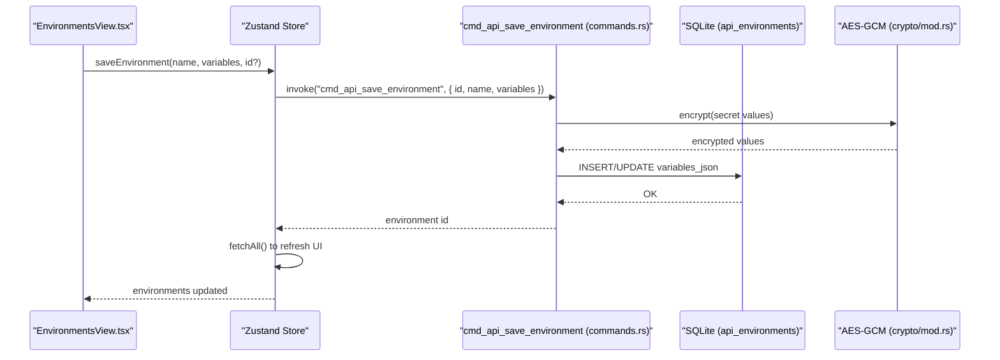
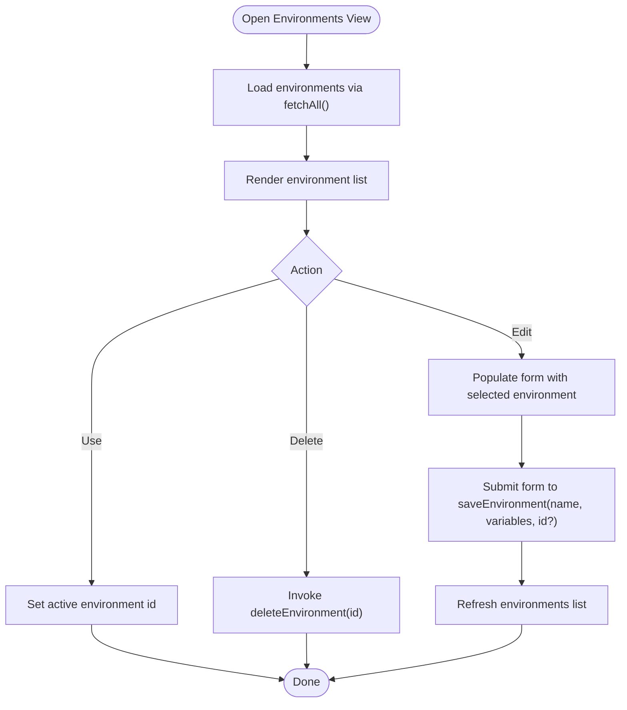
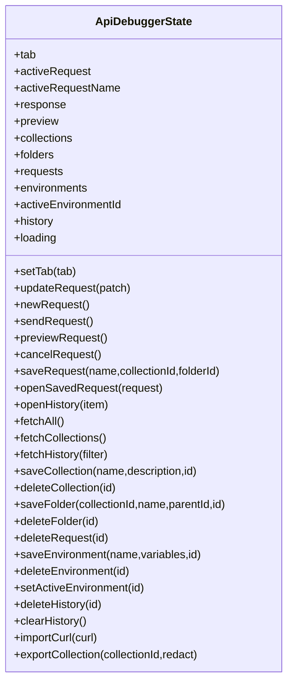
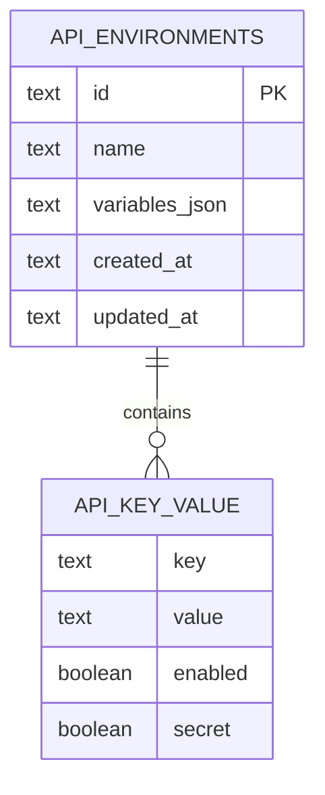
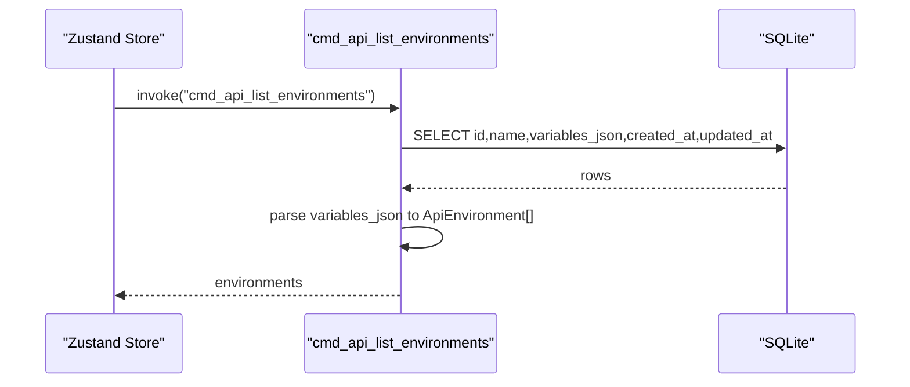
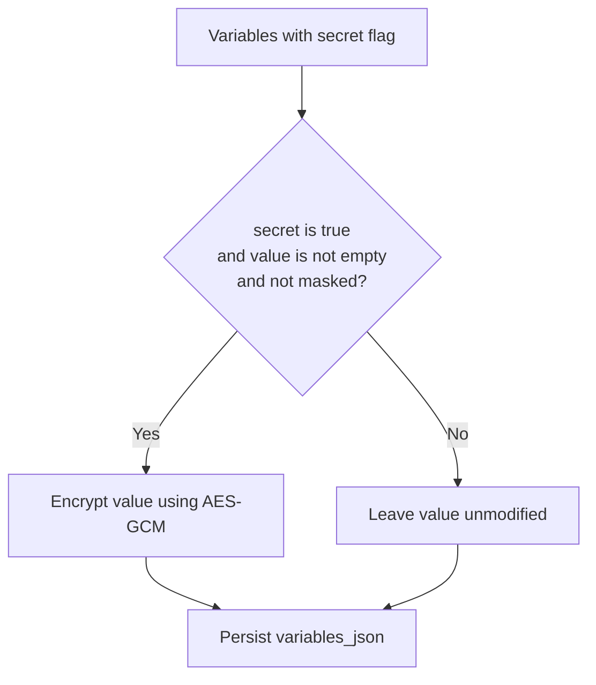
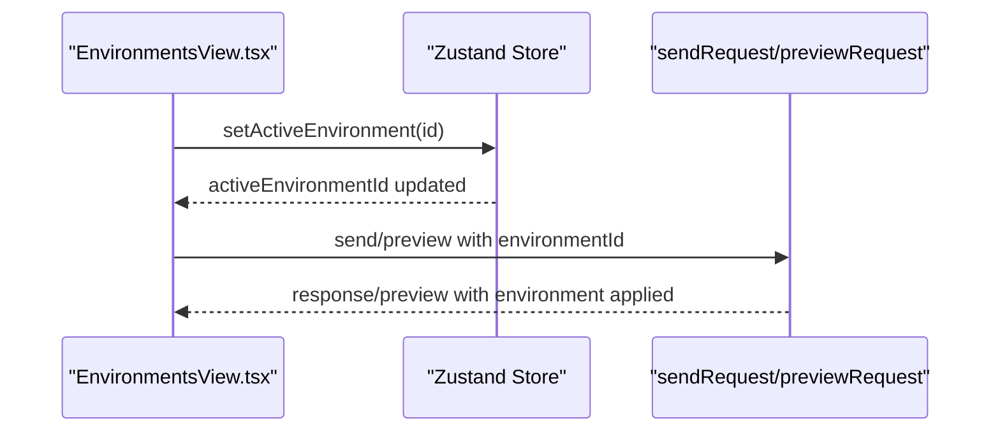
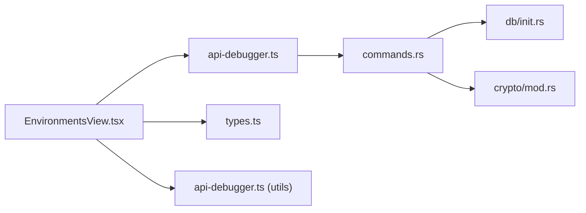

# Environments View

<cite>
**Referenced Files in This Document**
- [EnvironmentsView.tsx](file://src/plugins/api-debugger/views/EnvironmentsView.tsx)
- [api-debugger.ts](file://src/plugins/api-debugger/store/api-debugger.ts)
- [types.ts](file://src/plugins/api-debugger/types.ts)
- [api-debugger.ts](file://src/plugins/api-debugger/utils/api-debugger.ts)
- [commands.rs](file://src-tauri/src/plugins/api_debugger/commands.rs)
- [init.rs](file://src-tauri/src/db/init.rs)
- [mod.rs](file://src-tauri/src/crypto/mod.rs)
</cite>

## Table of Contents
1. [Introduction](#introduction)
2. [Project Structure](#project-structure)
3. [Core Components](#core-components)
4. [Architecture Overview](#architecture-overview)
5. [Detailed Component Analysis](#detailed-component-analysis)
6. [Dependency Analysis](#dependency-analysis)
7. [Performance Considerations](#performance-considerations)
8. [Troubleshooting Guide](#troubleshooting-guide)
9. [Conclusion](#conclusion)

## Introduction
This document describes the Environments View component responsible for managing variables and configuration across development stages (development, staging, production). It explains how environments are created, edited, and switched; how variables are defined, enabled/disabled, and optionally marked as secrets; and how secret values are stored securely. It also covers environment validation, secret management, and compliance considerations, along with practical workflows for teams.

## Project Structure
The Environments View is part of the API Debugger plugin. It integrates with a Zustand store for state management and Tauri commands for persistence and cryptography. Variables are persisted in a SQLite database with optional encryption for secret values.

**Diagram sources**
- [EnvironmentsView.tsx:1-64](file://src/plugins/api-debugger/views/EnvironmentsView.tsx#L1-L64)
- [api-debugger.ts:1-129](file://src/plugins/api-debugger/store/api-debugger.ts#L1-L129)
- [types.ts:1-105](file://src/plugins/api-debugger/types.ts#L1-L105)
- [api-debugger.ts:1-62](file://src/plugins/api-debugger/utils/api-debugger.ts#L1-L62)
- [commands.rs:626-668](file://src-tauri/src/plugins/api_debugger/commands.rs#L626-L668)
- [init.rs:217-223](file://src-tauri/src/db/init.rs#L217-L223)
- [mod.rs:1-75](file://src-tauri/src/crypto/mod.rs#L1-L75)

**Section sources**
- [EnvironmentsView.tsx:1-64](file://src/plugins/api-debugger/views/EnvironmentsView.tsx#L1-L64)
- [api-debugger.ts:1-129](file://src/plugins/api-debugger/store/api-debugger.ts#L1-L129)
- [types.ts:1-105](file://src/plugins/api-debugger/types.ts#L1-L105)
- [api-debugger.ts:1-62](file://src/plugins/api-debugger/utils/api-debugger.ts#L1-L62)
- [commands.rs:626-668](file://src-tauri/src/plugins/api_debugger/commands.rs#L626-L668)
- [init.rs:217-223](file://src-tauri/src/db/init.rs#L217-L223)
- [mod.rs:1-75](file://src-tauri/src/crypto/mod.rs#L1-L75)

## Core Components
- Environments View (UI): Renders a list of environments, allows creating/editing/deleting, switching the active environment, and editing variables with enable/disable and secret flags.
- Store (State): Provides actions to list, save, delete, and activate environments; triggers reload after mutations.
- Types: Defines environment and key-value pair structures, including secret flags.
- Utilities: Supplies helpers for empty key-value rows and normalization.
- Backend Commands: Persist environments to SQLite; encrypt secret values; list environments.
- Database Schema: Declares the environments table and JSON field for variables.
- Cryptography: AES-GCM encryption/decryption for secret values keyed by a per-app key file.

**Section sources**
- [EnvironmentsView.tsx:8-63](file://src/plugins/api-debugger/views/EnvironmentsView.tsx#L8-L63)
- [api-debugger.ts:7-45](file://src/plugins/api-debugger/store/api-debugger.ts#L7-L45)
- [types.ts:1-105](file://src/plugins/api-debugger/types.ts#L1-L105)
- [api-debugger.ts:5-12](file://src/plugins/api-debugger/utils/api-debugger.ts#L5-L12)
- [commands.rs:626-668](file://src-tauri/src/plugins/api_debugger/commands.rs#L626-L668)
- [init.rs:217-223](file://src-tauri/src/db/init.rs#L217-L223)
- [mod.rs:40-74](file://src-tauri/src/crypto/mod.rs#L40-L74)

## Architecture Overview
End-to-end flow for saving an environment with secret variables and persisting to the database.

**Diagram sources**
- [EnvironmentsView.tsx:21-26](file://src/plugins/api-debugger/views/EnvironmentsView.tsx#L21-L26)
- [api-debugger.ts:121](file://src/plugins/api-debugger/store/api-debugger.ts#L121)
- [commands.rs:641-661](file://src-tauri/src/plugins/api_debugger/commands.rs#L641-L661)
- [init.rs:217-223](file://src-tauri/src/db/init.rs#L217-L223)
- [mod.rs:40-54](file://src-tauri/src/crypto/mod.rs#L40-L54)

## Detailed Component Analysis

### Environments View (UI)
- Displays a list of environments with actions to use, edit, and delete.
- Supports creating a new environment or editing an existing one via a form.
- Variables support:
  - Enable/disable flag
  - Key/value pairs
  - Secret flag to mark sensitive values
  - Password input for values
- Uses a helper to ensure at least one variable row exists and normalizes enabled flags.

**Diagram sources**
- [EnvironmentsView.tsx:19-36](file://src/plugins/api-debugger/views/EnvironmentsView.tsx#L19-L36)
- [api-debugger.ts:121-123](file://src/plugins/api-debugger/store/api-debugger.ts#L121-L123)

**Section sources**
- [EnvironmentsView.tsx:8-63](file://src/plugins/api-debugger/views/EnvironmentsView.tsx#L8-L63)
- [api-debugger.ts:19-26](file://src/plugins/api-debugger/store/api-debugger.ts#L19-L26)
- [api-debugger.ts:5-12](file://src/plugins/api-debugger/utils/api-debugger.ts#L5-L12)

### Store (State Management)
- Exposes:
  - environments array and activeEnvironmentId
  - fetchAll to load collections, folders, requests, and environments
  - saveEnvironment, deleteEnvironment, setActiveEnvironment
- After mutation, fetchAll is called to refresh the UI.

**Diagram sources**
- [api-debugger.ts:7-45](file://src/plugins/api-debugger/store/api-debugger.ts#L7-L45)

**Section sources**
- [api-debugger.ts:47-129](file://src/plugins/api-debugger/store/api-debugger.ts#L47-L129)

### Types and Data Model
- ApiEnvironment: includes id, name, variables array, timestamps.
- ApiKeyValue: key, value, enabled flag, optional secret flag.
- ApiSendRequest: carries environmentId during send/preview.

**Diagram sources**
- [types.ts:68](file://src/plugins/api-debugger/types.ts#L68)
- [types.ts:1-6](file://src/plugins/api-debugger/types.ts#L1-L6)
- [init.rs:217-223](file://src-tauri/src/db/init.rs#L217-L223)

**Section sources**
- [types.ts:1-105](file://src/plugins/api-debugger/types.ts#L1-L105)
- [init.rs:217-223](file://src-tauri/src/db/init.rs#L217-L223)

### Backend Commands and Persistence
- Listing environments queries the api_environments table and parses variables_json into typed structures.
- Saving environments:
  - Iterates variables and encrypts values marked as secret (non-empty and not already masked).
  - Persists id, name, and serialized variables_json.
- Deleting environments removes the record from the table.

**Diagram sources**
- [api-debugger.ts:90-98](file://src/plugins/api-debugger/store/api-debugger.ts#L90-L98)
- [commands.rs:626-639](file://src-tauri/src/plugins/api_debugger/commands.rs#L626-L639)

**Section sources**
- [commands.rs:626-668](file://src-tauri/src/plugins/api_debugger/commands.rs#L626-L668)
- [api-debugger.ts:90-98](file://src/plugins/api-debugger/store/api-debugger.ts#L90-L98)

### Secret Management and Encryption
- Secret detection: variables with secret=true are candidates for encryption.
- Encryption: AES-GCM with a fixed nonce and a per-application key file stored under the app data directory.
- Decryption: performed when loading variables for display or internal use.
- Masking: sensitive values are masked in certain contexts to avoid accidental exposure.

**Diagram sources**
- [commands.rs:647-651](file://src-tauri/src/plugins/api_debugger/commands.rs#L647-L651)
- [mod.rs:40-74](file://src-tauri/src/crypto/mod.rs#L40-L74)

**Section sources**
- [commands.rs:641-661](file://src-tauri/src/plugins/api_debugger/commands.rs#L641-L661)
- [mod.rs:10-19](file://src-tauri/src/crypto/mod.rs#L10-L19)
- [mod.rs:40-74](file://src-tauri/src/crypto/mod.rs#L40-L74)

### Environment Switching and Active Selection
- Users can switch the active environment by clicking the "Use" button on an environment card.
- The store updates activeEnvironmentId, which is included in subsequent send/preview operations.

**Diagram sources**
- [EnvironmentsView.tsx:42](file://src/plugins/api-debugger/views/EnvironmentsView.tsx#L42)
- [api-debugger.ts:123](file://src/plugins/api-debugger/store/api-debugger.ts#L123)
- [api-debugger.ts:62-76](file://src/plugins/api-debugger/store/api-debugger.ts#L62-L76)

**Section sources**
- [EnvironmentsView.tsx:41-45](file://src/plugins/api-debugger/views/EnvironmentsView.tsx#L41-L45)
- [api-debugger.ts:123](file://src/plugins/api-debugger/store/api-debugger.ts#L123)
- [api-debugger.ts:62-76](file://src/plugins/api-debugger/store/api-debugger.ts#L62-L76)

### Variable Definition, Substitution, and Validation
- Variables are key-value pairs with an enabled flag; disabled variables are not applied.
- During send/preview, the active environment’s variables are resolved into the request.
- Validation:
  - Required name for environment.
  - At least one variable row is enforced via the helper.
  - Disabled variables are ignored in effective resolution.

**Section sources**
- [EnvironmentsView.tsx:35-36](file://src/plugins/api-debugger/views/EnvironmentsView.tsx#L35-L36)
- [api-debugger.ts:5-12](file://src/plugins/api-debugger/utils/api-debugger.ts#L5-L12)
- [api-debugger.ts:21-26](file://src/plugins/api-debugger/store/api-debugger.ts#L21-L26)

### Practical Workflows and Team Collaboration
- Multi-environment setup:
  - Create separate environments for Local, Staging, and Production.
  - Define stage-specific base URLs and credentials.
- Sensitive data handling:
  - Mark secrets with the secret flag; values are encrypted at rest.
  - Mask sensitive values in UI where applicable.
- Collaboration:
  - Export/import collections to share environments across team members.
  - Use environment switching to test against different targets without changing request templates.

[No sources needed since this section provides general guidance]

## Dependency Analysis
- UI depends on store for data and actions.
- Store invokes Tauri commands for persistence and listing.
- Commands depend on database schema and cryptography module.
- Types define the contract between frontend and backend.

**Diagram sources**
- [EnvironmentsView.tsx:1-6](file://src/plugins/api-debugger/views/EnvironmentsView.tsx#L1-L6)
- [api-debugger.ts:1-6](file://src/plugins/api-debugger/store/api-debugger.ts#L1-L6)
- [commands.rs:626-668](file://src-tauri/src/plugins/api_debugger/commands.rs#L626-L668)
- [init.rs:217-223](file://src-tauri/src/db/init.rs#L217-L223)
- [mod.rs:1-75](file://src-tauri/src/crypto/mod.rs#L1-L75)
- [types.ts:1-105](file://src/plugins/api-debugger/types.ts#L1-L105)
- [api-debugger.ts:1-62](file://src/plugins/api-debugger/utils/api-debugger.ts#L1-L62)

**Section sources**
- [EnvironmentsView.tsx:1-6](file://src/plugins/api-debugger/views/EnvironmentsView.tsx#L1-L6)
- [api-debugger.ts:1-6](file://src/plugins/api-debugger/store/api-debugger.ts#L1-L6)
- [commands.rs:626-668](file://src-tauri/src/plugins/api_debugger/commands.rs#L626-L668)
- [init.rs:217-223](file://src-tauri/src/db/init.rs#L217-L223)
- [mod.rs:1-75](file://src-tauri/src/crypto/mod.rs#L1-L75)
- [types.ts:1-105](file://src/plugins/api-debugger/types.ts#L1-L105)
- [api-debugger.ts:1-62](file://src/plugins/api-debugger/utils/api-debugger.ts#L1-L62)

## Performance Considerations
- Batch loading: fetchAll loads environments alongside collections/folders/requests to minimize round trips.
- Minimal re-renders: UI uses form hooks to manage variable rows efficiently.
- Encryption cost: encrypting many secrets can be CPU-intensive; batch operations should be considered for large environments.

[No sources needed since this section provides general guidance]

## Troubleshooting Guide
- Environment not appearing after save:
  - Ensure fetchAll is invoked after save/delete operations.
  - Verify backend command completion and database insertion.
- Secret values appear as plain text:
  - Confirm the secret flag is set and the value is non-empty.
  - Check encryption key availability and permissions in the app data directory.
- Masking issues:
  - Sensitive values may be masked in certain contexts; confirm masking logic applies to appropriate headers/keys.

**Section sources**
- [api-debugger.ts:121-129](file://src/plugins/api-debugger/store/api-debugger.ts#L121-L129)
- [commands.rs:647-651](file://src-tauri/src/plugins/api_debugger/commands.rs#L647-L651)
- [mod.rs:10-19](file://src-tauri/src/crypto/mod.rs#L10-L19)

## Conclusion
The Environments View provides a streamlined interface for managing environment variables across development stages. With built-in secret detection and encryption, it supports secure handling of sensitive data. The integration with the store and backend commands ensures reliable persistence and retrieval, enabling efficient multi-environment workflows and team collaboration.