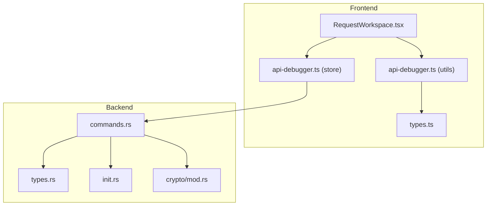
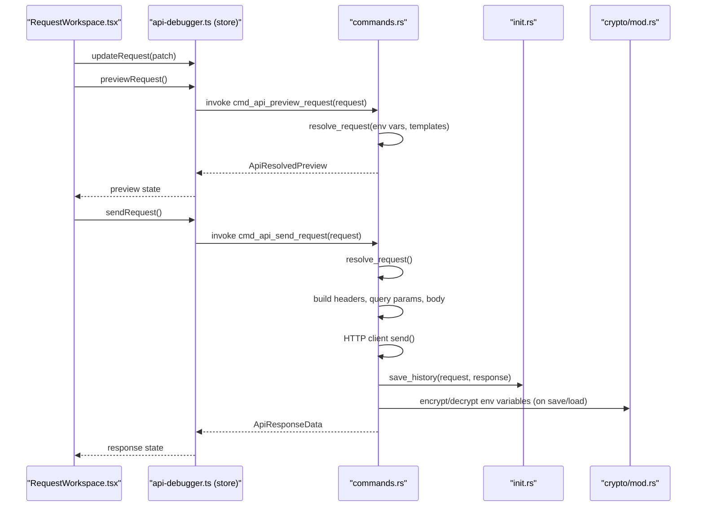
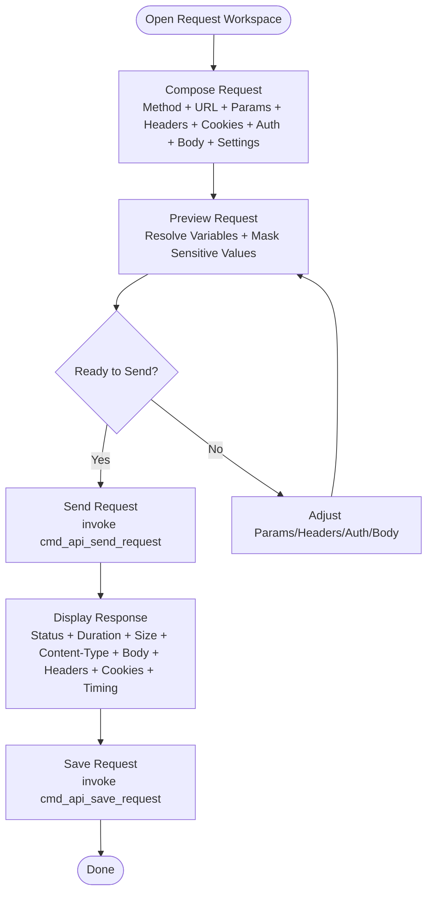
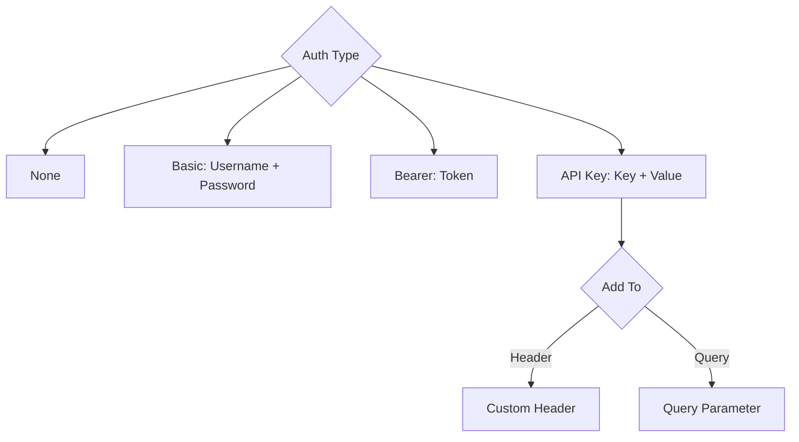
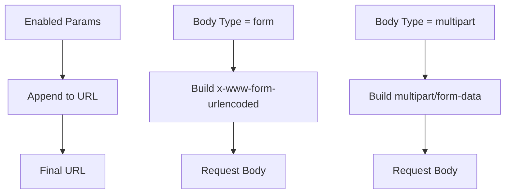
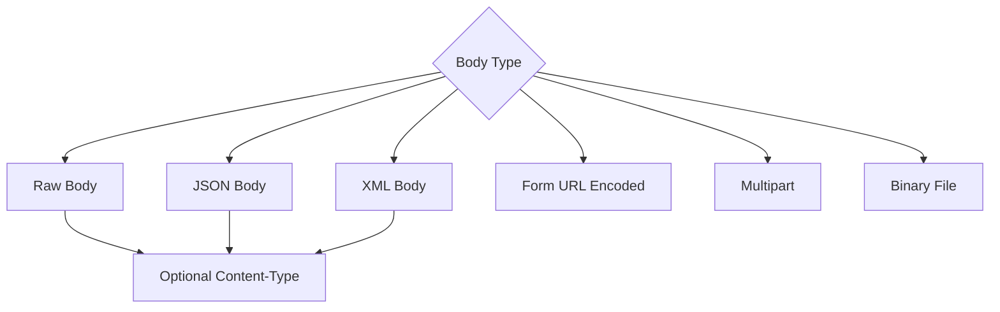
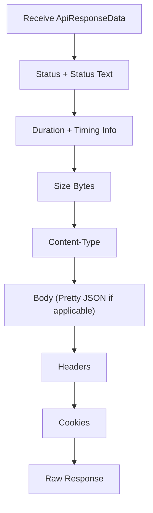
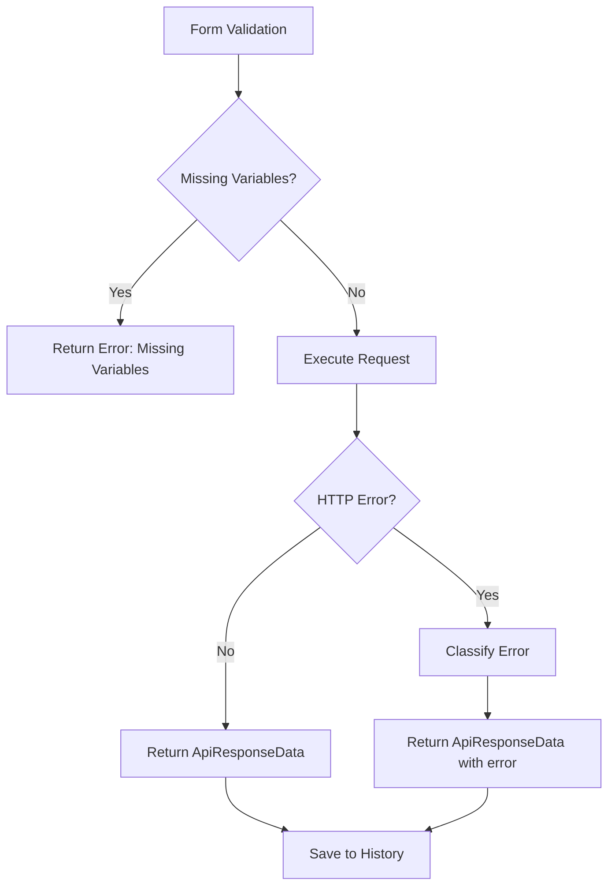
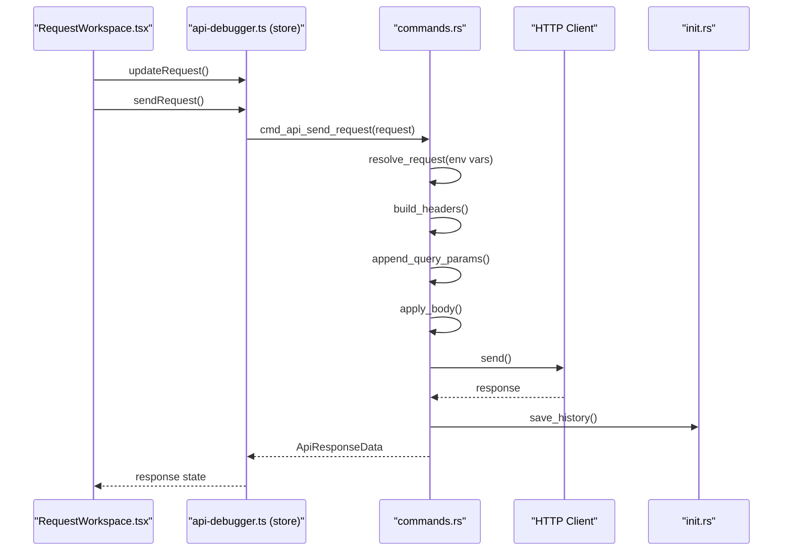
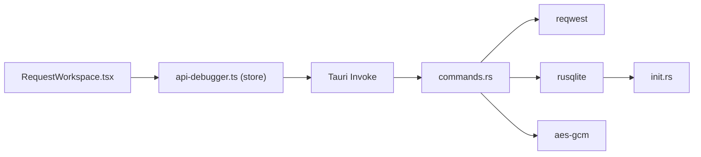

# Request Workspace

<cite>
**Referenced Files in This Document**
- [RequestWorkspace.tsx](file://src/plugins/api-debugger/views/RequestWorkspace.tsx)
- [api-debugger.ts (store)](file://src/plugins/api-debugger/store/api-debugger.ts)
- [api-debugger.ts (utils)](file://src/plugins/api-debugger/utils/api-debugger.ts)
- [types.ts](file://src/plugins/api-debugger/types.ts)
- [commands.rs](file://src-tauri/src/plugins/api_debugger/commands.rs)
- [types.rs](file://src-tauri/src/plugins/api_debugger/types.rs)
- [init.rs](file://src-tauri/src/db/init.rs)
- [mod.rs](file://src-tauri/src/plugins/api_debugger/mod.rs)
- [index.tsx](file://src/plugins/api-debugger/index.tsx)
</cite>

## Table of Contents
1. [Introduction](#introduction)
2. [Project Structure](#project-structure)
3. [Core Components](#core-components)
4. [Architecture Overview](#architecture-overview)
5. [Detailed Component Analysis](#detailed-component-analysis)
6. [Dependency Analysis](#dependency-analysis)
7. [Performance Considerations](#performance-considerations)
8. [Troubleshooting Guide](#troubleshooting-guide)
9. [Conclusion](#conclusion)
10. [Appendices](#appendices)

## Introduction
This document describes the Request Workspace component responsible for composing and executing HTTP requests. It covers the request composition interface (URL, method, headers, cookies, body), authentication methods (Bearer tokens, API keys, Basic), query parameter handling, form data encoding, response visualization (status, headers, body, timing), and operational controls (preview, send, cancel, save). It also documents validation, error handling, and history persistence.

## Project Structure
The Request Workspace is part of the API Debugger plugin. The frontend React component renders the UI and manages state via a Zustand store. The backend Rust module handles request resolution, execution, and persistence.

**Diagram sources**
- [RequestWorkspace.tsx:61-222](file://src/plugins/api-debugger/views/RequestWorkspace.tsx#L61-L222)
- [api-debugger.ts (store):47-128](file://src/plugins/api-debugger/store/api-debugger.ts#L47-L128)
- [api-debugger.ts (utils):14-29](file://src/plugins/api-debugger/utils/api-debugger.ts#L14-L29)
- [types.ts:27-41](file://src/plugins/api-debugger/types.ts#L27-L41)
- [commands.rs:404-475](file://src-tauri/src/plugins/api_debugger/commands.rs#L404-L475)
- [types.rs:35-49](file://src-tauri/src/plugins/api_debugger/types.rs#L35-L49)
- [init.rs:179-236](file://src-tauri/src/db/init.rs#L179-L236)

**Section sources**
- [RequestWorkspace.tsx:61-222](file://src/plugins/api-debugger/views/RequestWorkspace.tsx#L61-L222)
- [api-debugger.ts (store):47-128](file://src/plugins/api-debugger/store/api-debugger.ts#L47-L128)
- [api-debugger.ts (utils):14-29](file://src/plugins/api-debugger/utils/api-debugger.ts#L14-L29)
- [types.ts:27-41](file://src/plugins/api-debugger/types.ts#L27-L41)
- [commands.rs:404-475](file://src-tauri/src/plugins/api_debugger/commands.rs#L404-L475)
- [types.rs:35-49](file://src-tauri/src/plugins/api-debugger/types.rs#L35-L49)
- [init.rs:179-236](file://src-tauri/src/db/init.rs#L179-L236)

## Core Components
- Request composition UI: URL input, method selector, tabs for Params, Headers, Cookies, Auth, Body, Settings.
- Authentication modes: none, basic, bearer, apiKey.
- Body formats: none, raw, json, xml, form, multipart, binary.
- Preview and send controls: preview resolves variables and shows computed request; send executes and displays response.
- Response panel: status, duration, size, content-type, body, headers, cookies, raw, timing.
- Environment integration: variables substitution and sensitive value masking.

**Section sources**
- [RequestWorkspace.tsx:185-216](file://src/plugins/api-debugger/views/RequestWorkspace.tsx#L185-L216)
- [RequestWorkspace.tsx:25-45](file://src/plugins/api-debugger/views/RequestWorkspace.tsx#L25-L45)
- [api-debugger.ts (utils):3,14-29:3-29](file://src/plugins/api-debugger/utils/api-debugger.ts#L3-L29)
- [types.ts:8-16](file://src/plugins/api-debugger/types.ts#L8-L16)
- [types.ts:18-25](file://src/plugins/api-debugger/types.ts#L18-L25)

## Architecture Overview
The Request Workspace orchestrates request composition and execution across the frontend and backend.

**Diagram sources**
- [RequestWorkspace.tsx:104-108](file://src/plugins/api-debugger/views/RequestWorkspace.tsx#L104-L108)
- [api-debugger.ts (store):73-76](file://src/plugins/api-debugger/store/api-debugger.ts#L73-L76)
- [api-debugger.ts (store):62-72](file://src/plugins/api-debugger/store/api-debugger.ts#L62-L72)
- [commands.rs:391-401](file://src-tauri/src/plugins/api_debugger/commands.rs#L391-L401)
- [commands.rs:404-475](file://src-tauri/src/plugins/api_debugger/commands.rs#L404-L475)
- [init.rs:367-389](file://src-tauri/src/db/init.rs#L367-L389)
- [mod.rs:1-2](file://src-tauri/src/plugins/api_debugger/mod.rs#L1-L2)

## Detailed Component Analysis

### Request Composition UI
- Method and URL: top-level form items with validation.
- Params, Headers, Cookies: key-value editor with enable/disable and secret toggles.
- Auth: dropdown for auth type and fields for credentials; API key can be injected into header or query.
- Body: dropdown for body type with dedicated fields for raw, form, multipart, binary; Content-Type override.
- Settings: timeout, follow redirects, validate SSL.
- Preview: resolves variables and shows computed URL, headers, cookies, and body preview.
- Send/Cancel/Save: actions to execute, cancel, and persist requests.

**Diagram sources**
- [RequestWorkspace.tsx:185-216](file://src/plugins/api-debugger/views/RequestWorkspace.tsx#L185-L216)
- [RequestWorkspace.tsx:104-108](file://src/plugins/api-debugger/views/RequestWorkspace.tsx#L104-L108)
- [RequestWorkspace.tsx:25-45](file://src/plugins/api-debugger/views/RequestWorkspace.tsx#L25-L45)

**Section sources**
- [RequestWorkspace.tsx:61-222](file://src/plugins/api-debugger/views/RequestWorkspace.tsx#L61-L222)
- [RequestWorkspace.tsx:89-102](file://src/plugins/api-debugger/views/RequestWorkspace.tsx#L89-L102)
- [RequestWorkspace.tsx:195-214](file://src/plugins/api-debugger/views/RequestWorkspace.tsx#L195-L214)

### Authentication Methods
- None: no authentication.
- Basic: username/password encoded into Authorization header.
- Bearer: token placed in Authorization header as Bearer scheme.
- API Key: inject either as a custom header or as a query parameter depending on configuration.

**Diagram sources**
- [types.ts:8-16](file://src/plugins/api-debugger/types.ts#L8-L16)
- [commands.rs:271-294](file://src-tauri/src/plugins/api_debugger/commands.rs#L271-L294)

**Section sources**
- [types.ts:8-16](file://src/plugins/api-debugger/types.ts#L8-L16)
- [commands.rs:271-294](file://src-tauri/src/plugins/api_debugger/commands.rs#L271-L294)

### Query Parameters and Form Encoding
- Query parameters: appended to URL from enabled key-value pairs.
- API key as query parameter: when configured, appends key=value to URL.
- Form URL-encoded body: converts enabled key-value pairs into x-www-form-urlencoded.
- Multipart body: builds multipart form parts from enabled key-value pairs.

**Diagram sources**
- [commands.rs:236-245](file://src-tauri/src/plugins/api_debugger/commands.rs#L236-L245)
- [commands.rs:247-257](file://src-tauri/src/plugins/api_debugger/commands.rs#L247-L257)
- [commands.rs:311-321](file://src-tauri/src/plugins/api_debugger/commands.rs#L311-L321)
- [commands.rs:315-320](file://src-tauri/src/plugins/api_debugger/commands.rs#L315-L320)

**Section sources**
- [commands.rs:236-245](file://src-tauri/src/plugins/api_debugger/commands.rs#L236-L245)
- [commands.rs:247-257](file://src-tauri/src/plugins/api_debugger/commands.rs#L247-L257)
- [commands.rs:311-321](file://src-tauri/src/plugins/api_debugger/commands.rs#L311-L321)

### Body Formatting Options
- Raw/JSON/XML: sets body content and optional Content-Type.
- Form: form-encoded body from key-value pairs.
- Multipart: multipart form data from key-value pairs.
- Binary: reads file path and sends raw bytes.

**Diagram sources**
- [types.ts:18-25](file://src/plugins/api-debugger/types.ts#L18-L25)
- [commands.rs:297-329](file://src-tauri/src/plugins/api_debugger/commands.rs#L297-L329)

**Section sources**
- [types.ts:18-25](file://src/plugins/api-debugger/types.ts#L18-L25)
- [commands.rs:297-329](file://src-tauri/src/plugins/api_debugger/commands.rs#L297-L329)

### Response Visualization
- Status: numeric code and text; color-coded by success/error.
- Duration: milliseconds elapsed.
- Size: bytes of response body.
- Content-Type: detected MIME type.
- Body: pretty-printed JSON if applicable; otherwise raw text.
- Headers: list of response headers.
- Cookies: parsed Set-Cookie entries.
- Raw: full response payload.
- Timing: low-level timing breakdown.

**Diagram sources**
- [RequestWorkspace.tsx:25-45](file://src/plugins/api-debugger/views/RequestWorkspace.tsx#L25-L45)
- [types.ts:51-64](file://src/plugins/api-debugger/types.ts#L51-L64)
- [api-debugger.ts (utils):31-39](file://src/plugins/api-debugger/utils/api-debugger.ts#L31-L39)

**Section sources**
- [RequestWorkspace.tsx:25-45](file://src/plugins/api-debugger/views/RequestWorkspace.tsx#L25-L45)
- [types.ts:51-64](file://src/plugins/api-debugger/types.ts#L51-L64)
- [api-debugger.ts (utils):31-39](file://src/plugins/api-debugger/utils/api-debugger.ts#L31-L39)

### Validation, Error Handling, and Cancellation
- Validation: form-level required fields for method and URL; preview validates variables.
- Error handling: backend classifies errors (timeout, connection, redirect, decode) and returns human-readable messages.
- Cancellation: triggers cancellation command; clears loading state.

**Diagram sources**
- [api-debugger.ts (store):77-81](file://src/plugins/api-debugger/store/api-debugger.ts#L77-L81)
- [commands.rs:407-409](file://src-tauri/src/plugins/api_debugger/commands.rs#L407-L409)
- [commands.rs:349-361](file://src-tauri/src/plugins/api_debugger/commands.rs#L349-L361)

**Section sources**
- [api-debugger.ts (store):77-81](file://src/plugins/api-debugger/store/api-debugger.ts#L77-L81)
- [commands.rs:407-409](file://src-tauri/src/plugins/api_debugger/commands.rs#L407-L409)
- [commands.rs:349-361](file://src-tauri/src/plugins/api_debugger/commands.rs#L349-L361)

### Request Execution Flow
- Frontend: collects form values, merges into active request, invokes backend command.
- Backend: resolves environment variables and templates, applies settings, builds headers/query/body, executes HTTP request, captures response, saves to history.

**Diagram sources**
- [api-debugger.ts (store):62-72](file://src/plugins/api-debugger/store/api-debugger.ts#L62-L72)
- [commands.rs:404-475](file://src-tauri/src/plugins/api-debugger/commands.rs#L404-L475)
- [init.rs:367-389](file://src-tauri/src/db/init.rs#L367-L389)

**Section sources**
- [api-debugger.ts (store):62-72](file://src/plugins/api-debugger/store/api-debugger.ts#L62-L72)
- [commands.rs:404-475](file://src-tauri/src/plugins/api_debugger/commands.rs#L404-L475)

## Dependency Analysis
- Frontend depends on Ant Design components and Zustand store.
- Store depends on Tauri invoke to call backend commands.
- Backend depends on reqwest for HTTP, rusqlite for persistence, and AES-GCM for encryption.
- Environment variables are persisted in SQLite and encrypted at rest.

**Diagram sources**
- [RequestWorkspace.tsx:61-222](file://src/plugins/api-debugger/views/RequestWorkspace.tsx#L61-L222)
- [api-debugger.ts (store):62-72](file://src/plugins/api-debugger/store/api-debugger.ts#L62-L72)
- [commands.rs:404-475](file://src-tauri/src/plugins/api_debugger/commands.rs#L404-L475)
- [init.rs:179-236](file://src-tauri/src/db/init.rs#L179-L236)

**Section sources**
- [RequestWorkspace.tsx:61-222](file://src/plugins/api-debugger/views/RequestWorkspace.tsx#L61-L222)
- [api-debugger.ts (store):62-72](file://src/plugins/api-debugger/store/api-debugger.ts#L62-L72)
- [commands.rs:404-475](file://src-tauri/src/plugins/api_debugger/commands.rs#L404-L475)
- [init.rs:179-236](file://src-tauri/src/db/init.rs#L179-L236)

## Performance Considerations
- Timeout limits: enforced by backend client builder; clamped to a safe range.
- Redirect policy: configurable; limited by backend policy.
- SSL validation: configurable; can be disabled for self-signed certs.
- Response size: backend truncates large bodies and records truncation flag.
- History storage: snapshots redact sensitive data and truncate long bodies.

[No sources needed since this section provides general guidance]

## Troubleshooting Guide
Common issues and remedies:
- Missing variables: preview highlights missing template variables; fix by setting environment variables.
- Invalid headers/values: backend validates header names and values; correct typos or invalid characters.
- Large response bodies: backend truncates; adjust client-side expectations.
- SSL/TLS errors: disable SSL validation only for testing; re-enable in production.
- Timeouts: increase timeoutMs in Settings tab.
- Cancellation: use Cancel button to abort in-flight requests.

**Section sources**
- [commands.rs:349-361](file://src-tauri/src/plugins/api_debugger/commands.rs#L349-L361)
- [commands.rs:410-416](file://src-tauri/src/plugins/api_debugger/commands.rs#L410-L416)
- [commands.rs:448-455](file://src-tauri/src/plugins/api_debugger/commands.rs#L448-L455)

## Conclusion
The Request Workspace provides a comprehensive, secure, and user-friendly interface for crafting and executing HTTP requests. It integrates environment-driven variable resolution, robust authentication modes, flexible body formatting, and rich response visualization. The backend enforces validation, error classification, and persistent history with sensitive data protection.

## Appendices

### Practical Examples
- GET request with query parameters: compose URL with {{var}} placeholders, populate Params tab, click Preview to resolve, then Send.
- POST with JSON body: set method to POST, Body Type to JSON, set Content-Type, paste JSON in Raw Body, Send.
- Basic authentication: set Auth Type to Basic, enter username/password, Send.
- Bearer token: set Auth Type to Bearer, enter token, Send.
- API key in header: set Auth Type to apiKey, choose Header, enter Key and Value, Send.
- API key in query: set Auth Type to apiKey, choose Query, enter Key and Value, Send.
- Form submission: set Body Type to form, add key-value pairs, Send.
- Multipart upload: set Body Type to multipart, add key-value pairs, Send.
- Binary upload: set Body Type to binary, provide file path, Send.

[No sources needed since this section provides general guidance]

### Request Validation and Error Handling Details
- Form validation: required method and URL.
- Variable resolution: missing variables reported during preview.
- Header validation: invalid header names/values cause errors.
- HTTP errors: classified and surfaced to UI.
- History persistence: redacts sensitive values and truncates long bodies.

**Section sources**
- [RequestWorkspace.tsx:104-108](file://src/plugins/api-debugger/views/RequestWorkspace.tsx#L104-L108)
- [api-debugger.ts (store):73-76](file://src/plugins/api-debugger/store/api-debugger.ts#L73-L76)
- [commands.rs:391-401](file://src-tauri/src/plugins/api_debugger/commands.rs#L391-L401)
- [commands.rs:349-361](file://src-tauri/src/plugins/api_debugger/commands.rs#L349-L361)
- [commands.rs:107-123](file://src-tauri/src/plugins/api_debugger/commands.rs#L107-L123)

### Response Caching Mechanisms
- No explicit HTTP cache is implemented in the backend; responses are streamed and truncated as needed.
- History acts as a persistent cache of recent requests/responses with redaction and truncation.

**Section sources**
- [commands.rs:404-475](file://src-tauri/src/plugins/api_debugger/commands.rs#L404-L475)
- [commands.rs:107-123](file://src-tauri/src/plugins/api_debugger/commands.rs#L107-L123)