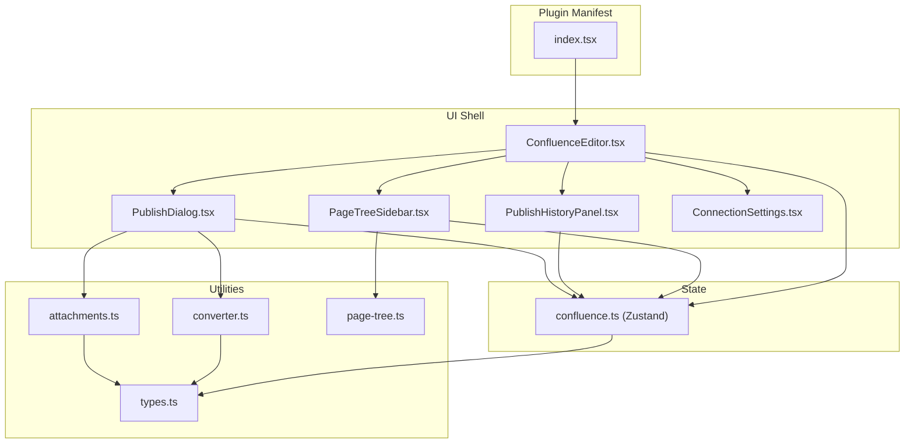
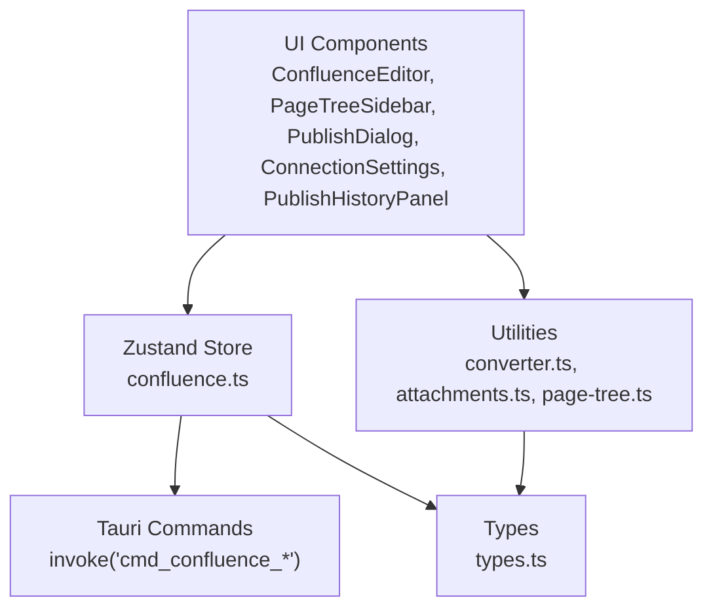
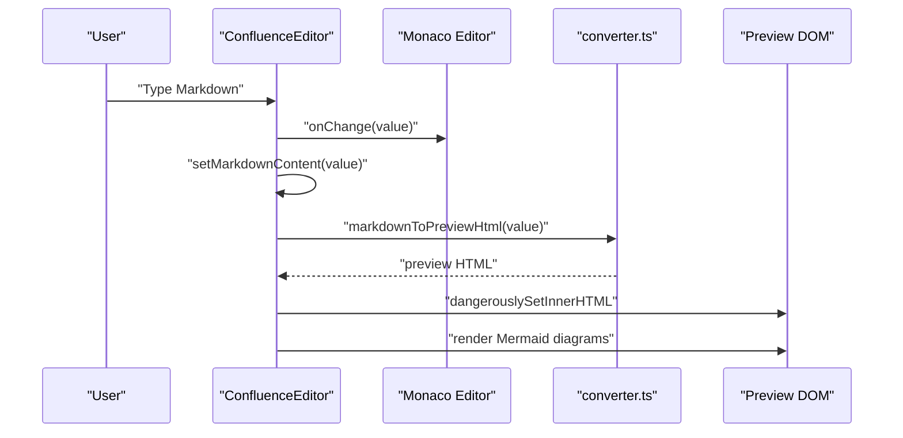
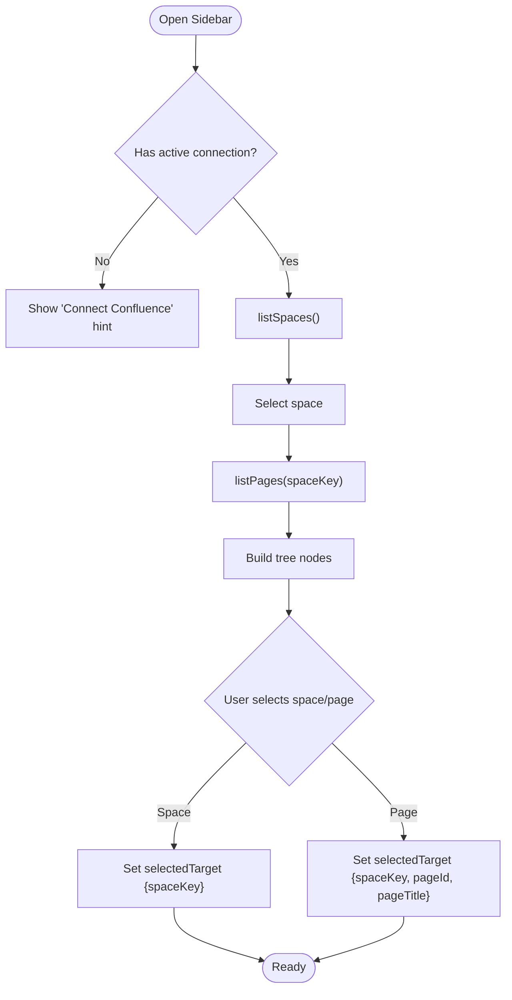
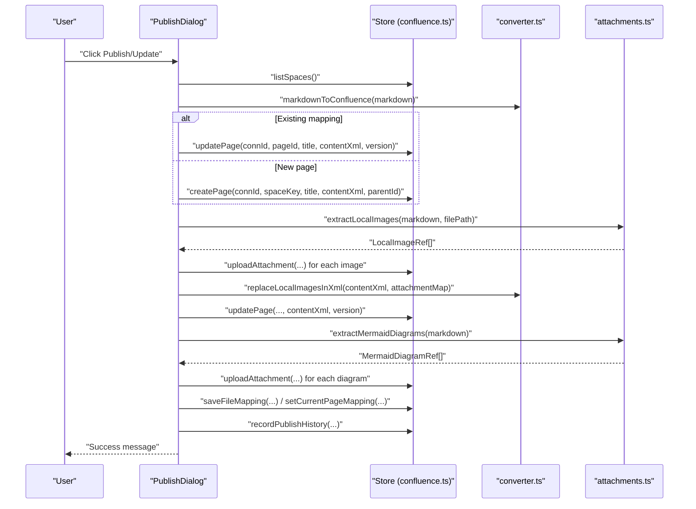
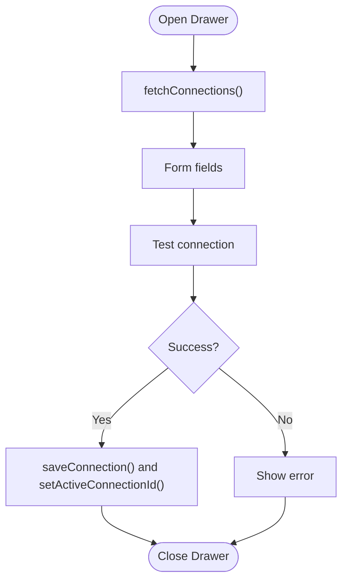
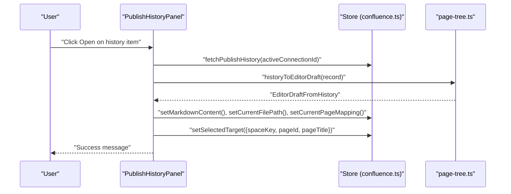
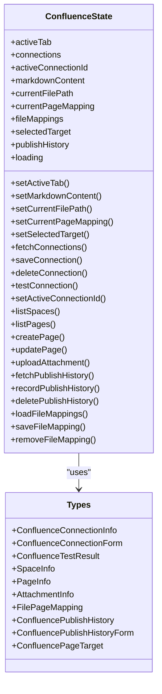
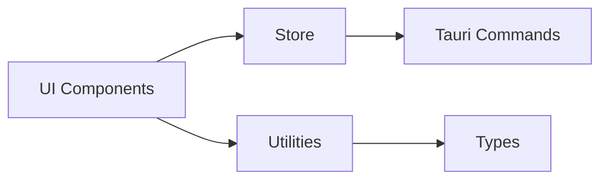

# Confluence Editor

<cite>
**Referenced Files in This Document**
- [index.tsx](file://src/plugins/confluence/index.tsx)
- [ConfluenceEditor.tsx](file://src/plugins/confluence/components/ConfluenceEditor.tsx)
- [PageTreeSidebar.tsx](file://src/plugins/confluence/components/PageTreeSidebar.tsx)
- [PublishDialog.tsx](file://src/plugins/confluence/components/PublishDialog.tsx)
- [ConnectionSettings.tsx](file://src/plugins/confluence/components/ConnectionSettings.tsx)
- [PublishHistoryPanel.tsx](file://src/plugins/confluence/components/PublishHistoryPanel.tsx)
- [confluence.ts](file://src/plugins/confluence/store/confluence.ts)
- [converter.ts](file://src/plugins/confluence/utils/converter.ts)
- [attachments.ts](file://src/plugins/confluence/utils/attachments.ts)
- [page-tree.ts](file://src/plugins/confluence/utils/page-tree.ts)
- [types.ts](file://src/plugins/confluence/types.ts)
</cite>

## Table of Contents
1. [Introduction](#introduction)
2. [Project Structure](#project-structure)
3. [Core Components](#core-components)
4. [Architecture Overview](#architecture-overview)
5. [Detailed Component Analysis](#detailed-component-analysis)
6. [Dependency Analysis](#dependency-analysis)
7. [Performance Considerations](#performance-considerations)
8. [Troubleshooting Guide](#troubleshooting-guide)
9. [Conclusion](#conclusion)
10. [Appendices](#appendices)

## Introduction
The Confluence Editor plugin provides a native desktop authoring experience for collaborative documentation and publishing to Atlassian Confluence. It combines a Markdown editor with a live preview, integrates with Confluence’s page tree for navigation, and supports publishing workflows that include attachments and diagrams. The plugin also maintains publish history and file-to-page mappings to streamline ongoing collaboration and versioning.

## Project Structure
The Confluence plugin is organized around a React-based UI with a Zustand store orchestrating state and Tauri-backed backend commands. The UI is composed of:
- A top-level plugin manifest that registers the Confluence tab
- An editor shell with toolbar, Monaco editor, and real-time preview
- Sidebar navigation for Confluence spaces/pages
- Publish dialog for creating/updating pages and managing attachments
- Connection settings drawer for configuring Confluence instances
- Publish history panel for quick recall of previous publishes
- Utility modules for conversion, attachments, and page tree building
- Strongly typed interfaces for all Confluence-related data

**Diagram sources**
- [index.tsx:1-18](file://src/plugins/confluence/index.tsx#L1-L18)
- [ConfluenceEditor.tsx:1-205](file://src/plugins/confluence/components/ConfluenceEditor.tsx#L1-L205)
- [PageTreeSidebar.tsx:1-153](file://src/plugins/confluence/components/PageTreeSidebar.tsx#L1-L153)
- [PublishDialog.tsx:1-241](file://src/plugins/confluence/components/PublishDialog.tsx#L1-L241)
- [ConnectionSettings.tsx:1-125](file://src/plugins/confluence/components/ConnectionSettings.tsx#L1-L125)
- [PublishHistoryPanel.tsx:1-88](file://src/plugins/confluence/components/PublishHistoryPanel.tsx#L1-L88)
- [confluence.ts:1-146](file://src/plugins/confluence/store/confluence.ts#L1-L146)
- [converter.ts:1-226](file://src/plugins/confluence/utils/converter.ts#L1-L226)
- [attachments.ts:1-147](file://src/plugins/confluence/utils/attachments.ts#L1-L147)
- [page-tree.ts:1-62](file://src/plugins/confluence/utils/page-tree.ts#L1-L62)
- [types.ts:1-86](file://src/plugins/confluence/types.ts#L1-L86)

**Section sources**
- [index.tsx:1-18](file://src/plugins/confluence/index.tsx#L1-L18)
- [ConfluenceEditor.tsx:1-205](file://src/plugins/confluence/components/ConfluenceEditor.tsx#L1-L205)
- [confluence.ts:1-146](file://src/plugins/confluence/store/confluence.ts#L1-L146)

## Core Components
- Plugin manifest and registration: Declares the Confluence plugin identity and UI entry.
- ConfluenceEditor: Hosts the toolbar, Monaco editor, real-time preview, sidebar, and dialogs.
- PageTreeSidebar: Lists Confluence spaces and nested pages, enabling selection and creation of new pages.
- PublishDialog: Guides publishing or updating pages, including conversion, attachments, and diagrams.
- ConnectionSettings: Manages Confluence connections (basic auth or PAT) and tests connectivity.
- PublishHistoryPanel: Recovers previous drafts and rebinds file/page mappings.
- Store: Centralizes state for content, selections, mappings, and publish history, delegating backend calls via Tauri.
- Utilities: Converter transforms Markdown to Confluence XML/HTML; attachments handles local images and Mermaid diagrams; page-tree builds hierarchical UI nodes.

**Section sources**
- [index.tsx:10-17](file://src/plugins/confluence/index.tsx#L10-L17)
- [ConfluenceEditor.tsx:15-196](file://src/plugins/confluence/components/ConfluenceEditor.tsx#L15-L196)
- [PageTreeSidebar.tsx:10-152](file://src/plugins/confluence/components/PageTreeSidebar.tsx#L10-L152)
- [PublishDialog.tsx:9-240](file://src/plugins/confluence/components/PublishDialog.tsx#L9-L240)
- [ConnectionSettings.tsx:8-124](file://src/plugins/confluence/components/ConnectionSettings.tsx#L8-L124)
- [PublishHistoryPanel.tsx:9-87](file://src/plugins/confluence/components/PublishHistoryPanel.tsx#L9-L87)
- [confluence.ts:19-145](file://src/plugins/confluence/store/confluence.ts#L19-L145)
- [converter.ts:1-226](file://src/plugins/confluence/utils/converter.ts#L1-L226)
- [attachments.ts:1-147](file://src/plugins/confluence/utils/attachments.ts#L1-L147)
- [page-tree.ts:21-61](file://src/plugins/confluence/utils/page-tree.ts#L21-L61)
- [types.ts:1-86](file://src/plugins/confluence/types.ts#L1-L86)

## Architecture Overview
The plugin follows a layered architecture:
- UI Layer: React components manage user interactions and present state.
- Store Layer: Zustand manages editor state, selections, and publish history, invoking backend commands.
- Utilities Layer: Conversion and attachment helpers encapsulate parsing, rendering, and upload logic.
- Backend Integration: Tauri commands bridge to Rust-based Confluence operations (listed via invoke calls).

**Diagram sources**
- [ConfluenceEditor.tsx:1-205](file://src/plugins/confluence/components/ConfluenceEditor.tsx#L1-L205)
- [PageTreeSidebar.tsx:1-153](file://src/plugins/confluence/components/PageTreeSidebar.tsx#L1-L153)
- [PublishDialog.tsx:1-241](file://src/plugins/confluence/components/PublishDialog.tsx#L1-L241)
- [ConnectionSettings.tsx:1-125](file://src/plugins/confluence/components/ConnectionSettings.tsx#L1-L125)
- [PublishHistoryPanel.tsx:1-88](file://src/plugins/confluence/components/PublishHistoryPanel.tsx#L1-L88)
- [confluence.ts:1-146](file://src/plugins/confluence/store/confluence.ts#L1-L146)
- [converter.ts:1-226](file://src/plugins/confluence/utils/converter.ts#L1-L226)
- [attachments.ts:1-147](file://src/plugins/confluence/utils/attachments.ts#L1-L147)
- [page-tree.ts:1-62](file://src/plugins/confluence/utils/page-tree.ts#L1-L62)
- [types.ts:1-86](file://src/plugins/confluence/types.ts#L1-L86)

## Detailed Component Analysis

### ConfluenceEditor: Markdown Editing and Real-time Preview
- Provides toolbar actions: New, Open, Save, Connect, and Publish/Update.
- Uses Monaco editor for Markdown editing with configurable options.
- Live preview pane renders converted HTML derived from Markdown.
- Integrates Mermaid rendering for embedded diagrams in preview.
- Tracks current file path and page mapping for contextual UI hints.

**Diagram sources**
- [ConfluenceEditor.tsx:167-188](file://src/plugins/confluence/components/ConfluenceEditor.tsx#L167-L188)
- [converter.ts:191-214](file://src/plugins/confluence/utils/converter.ts#L191-L214)

**Section sources**
- [ConfluenceEditor.tsx:15-196](file://src/plugins/confluence/components/ConfluenceEditor.tsx#L15-L196)
- [converter.ts:191-214](file://src/plugins/confluence/utils/converter.ts#L191-L214)

### PageTreeSidebar: Page Tree Navigation and Selection
- Loads spaces and lazy-loads child pages on demand.
- Supports selecting a space or a page, setting the publish target.
- Offers “New here” to start a new page draft under the selected target.
- Builds Ant Design Tree nodes from space and page collections.

**Diagram sources**
- [PageTreeSidebar.tsx:31-99](file://src/plugins/confluence/components/PageTreeSidebar.tsx#L31-L99)
- [page-tree.ts:21-50](file://src/plugins/confluence/utils/page-tree.ts#L21-L50)

**Section sources**
- [PageTreeSidebar.tsx:10-152](file://src/plugins/confluence/components/PageTreeSidebar.tsx#L10-L152)
- [page-tree.ts:21-61](file://src/plugins/confluence/utils/page-tree.ts#L21-L61)

### PublishDialog: Publishing Workflow and Attachments
- Determines whether to create or update a page based on existing mapping.
- Converts Markdown to Confluence XML, then to HTML for preview.
- Extracts and uploads local images and Mermaid diagrams as attachments.
- Replaces image URLs in XML after upload and re-updates the page.
- Records publish history and updates file-to-page mapping.

**Diagram sources**
- [PublishDialog.tsx:64-171](file://src/plugins/confluence/components/PublishDialog.tsx#L64-L171)
- [confluence.ts:105-119](file://src/plugins/confluence/store/confluence.ts#L105-L119)
- [converter.ts:185-225](file://src/plugins/confluence/utils/converter.ts#L185-L225)
- [attachments.ts:23-138](file://src/plugins/confluence/utils/attachments.ts#L23-L138)

**Section sources**
- [PublishDialog.tsx:9-240](file://src/plugins/confluence/components/PublishDialog.tsx#L9-L240)
- [confluence.ts:105-144](file://src/plugins/confluence/store/confluence.ts#L105-L144)
- [converter.ts:185-225](file://src/plugins/confluence/utils/converter.ts#L185-L225)
- [attachments.ts:23-138](file://src/plugins/confluence/utils/attachments.ts#L23-L138)

### ConnectionSettings: Managing Confluence Connections
- Allows adding/editing/deleting connections with label, base URL, auth type, username, and password/token.
- Tests connectivity and sets the active connection.
- Presents a list of saved connections and toggles the active one.

**Diagram sources**
- [ConnectionSettings.tsx:21-64](file://src/plugins/confluence/components/ConnectionSettings.tsx#L21-L64)
- [confluence.ts:84-104](file://src/plugins/confluence/store/confluence.ts#L84-L104)

**Section sources**
- [ConnectionSettings.tsx:8-124](file://src/plugins/confluence/components/ConnectionSettings.tsx#L8-L124)
- [confluence.ts:84-104](file://src/plugins/confluence/store/confluence.ts#L84-L104)

### PublishHistoryPanel: Draft Recovery and Mapping
- Loads recent publish records per active connection.
- Opens a historical record into the editor, restoring content and mapping.
- Supports deleting local history entries.

**Diagram sources**
- [PublishHistoryPanel.tsx:24-43](file://src/plugins/confluence/components/PublishHistoryPanel.tsx#L24-L43)
- [page-tree.ts:52-61](file://src/plugins/confluence/utils/page-tree.ts#L52-L61)
- [confluence.ts:120-132](file://src/plugins/confluence/store/confluence.ts#L120-L132)

**Section sources**
- [PublishHistoryPanel.tsx:9-87](file://src/plugins/confluence/components/PublishHistoryPanel.tsx#L9-L87)
- [page-tree.ts:52-61](file://src/plugins/confluence/utils/page-tree.ts#L52-L61)
- [confluence.ts:120-132](file://src/plugins/confluence/store/confluence.ts#L120-L132)

### Store and Types: State and Contracts
- State includes markdown content, current file path, active connection, selected target, mappings, and publish history.
- Exposes actions to list spaces/pages, create/update pages, upload attachments, and manage publish history.
- Strongly typed interfaces define connection forms, space/page info, attachments, mappings, and publish history records.

**Diagram sources**
- [confluence.ts:19-145](file://src/plugins/confluence/store/confluence.ts#L19-L145)
- [types.ts:1-86](file://src/plugins/confluence/types.ts#L1-L86)

**Section sources**
- [confluence.ts:19-145](file://src/plugins/confluence/store/confluence.ts#L19-L145)
- [types.ts:1-86](file://src/plugins/confluence/types.ts#L1-L86)

## Dependency Analysis
- UI components depend on the store for state and actions.
- Conversion and attachment utilities depend on shared types.
- The store depends on Tauri commands for backend operations.
- Page tree utilities depend on space/page types and history records.

**Diagram sources**
- [confluence.ts:1-146](file://src/plugins/confluence/store/confluence.ts#L1-L146)
- [converter.ts:1-226](file://src/plugins/confluence/utils/converter.ts#L1-L226)
- [attachments.ts:1-147](file://src/plugins/confluence/utils/attachments.ts#L1-L147)
- [page-tree.ts:1-62](file://src/plugins/confluence/utils/page-tree.ts#L1-L62)
- [types.ts:1-86](file://src/plugins/confluence/types.ts#L1-L86)

**Section sources**
- [confluence.ts:1-146](file://src/plugins/confluence/store/confluence.ts#L1-L146)
- [converter.ts:1-226](file://src/plugins/confluence/utils/converter.ts#L1-L226)
- [attachments.ts:1-147](file://src/plugins/confluence/utils/attachments.ts#L1-L147)
- [page-tree.ts:1-62](file://src/plugins/confluence/utils/page-tree.ts#L1-L62)
- [types.ts:1-86](file://src/plugins/confluence/types.ts#L1-L86)

## Performance Considerations
- Lazy loading of page trees reduces initial payload and improves responsiveness.
- Preview rendering defers Mermaid processing until after initial HTML generation.
- Local image uploads occur sequentially; batching could reduce round trips.
- Storing file-to-page mappings locally avoids frequent lookups and speeds up subsequent publishes.

## Troubleshooting Guide
- Connection failures: Use the Connection Settings drawer to test and verify credentials and base URL.
- Publish errors: Review the status messages in the Publish Dialog; ensure the page title is provided and a space is selected for new pages.
- Image not appearing: Confirm local images are within the expected relative paths; verify MIME type detection and that uploads succeed.
- Mermaid diagrams missing: Ensure Mermaid blocks are properly formatted; confirm diagram rendering and attachment upload steps complete.
- Version conflicts: When updating, the store passes the current page version; if conflicts occur, refresh the page and retry.

**Section sources**
- [ConnectionSettings.tsx:25-38](file://src/plugins/confluence/components/ConnectionSettings.tsx#L25-L38)
- [PublishDialog.tsx:64-171](file://src/plugins/confluence/components/PublishDialog.tsx#L64-L171)
- [attachments.ts:74-126](file://src/plugins/confluence/utils/attachments.ts#L74-L126)

## Conclusion
The Confluence Editor plugin delivers a cohesive workflow for authoring, previewing, navigating, and publishing Markdown documents to Confluence. Its modular design, robust conversion pipeline, and attachment handling enable efficient collaboration. The sidebar and publish history panels streamline navigation and reuse of prior work, while the store and utilities encapsulate state and transformations cleanly.

## Appendices

### Practical Examples

- Collaborative document creation
  - Open the editor, create a new draft, and type content in the Monaco editor.
  - Use the sidebar to navigate spaces and select a parent page for nesting.
  - Publish to create a new page; the system derives the title from the first heading or filename.

- Publishing workflows
  - For existing pages: open the publish dialog; it auto-detects the bound page and increments version on update.
  - For new pages: choose a space and optional parent; provide a title; publish creates the page and attaches images/diagrams.

- Content management strategies
  - Keep a single Markdown file per document; rely on file-to-page mappings for updates.
  - Use publish history to recover previous drafts and rebind mappings quickly.
  - Organize images alongside Markdown; the attachment utility resolves relative paths automatically.

- Markdown syntax support
  - Headings, paragraphs, emphasis, links, images, blockquotes, lists, code blocks, tables, footnotes, and task lists.
  - Inline and block math macros are supported.
  - Mermaid diagrams are embedded and rendered as draw.io attachments.

- Image handling
  - Local images are detected, uploaded as attachments, and referenced in the final page content.
  - Supported formats include PNG, JPEG, GIF, SVG, WEBP, and BMP.

- Document versioning
  - Updates increment the page version; the store tracks the latest version for conflict-free updates.

**Section sources**
- [ConfluenceEditor.tsx:74-105](file://src/plugins/confluence/components/ConfluenceEditor.tsx#L74-L105)
- [PublishDialog.tsx:37-171](file://src/plugins/confluence/components/PublishDialog.tsx#L37-L171)
- [PublishHistoryPanel.tsx:24-43](file://src/plugins/confluence/components/PublishHistoryPanel.tsx#L24-L43)
- [converter.ts:185-225](file://src/plugins/confluence/utils/converter.ts#L185-L225)
- [attachments.ts:23-138](file://src/plugins/confluence/utils/attachments.ts#L23-L138)
- [confluence.ts:111-119](file://src/plugins/confluence/store/confluence.ts#L111-L119)