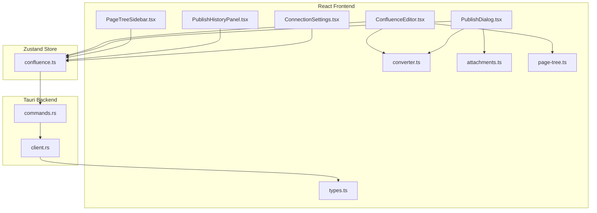
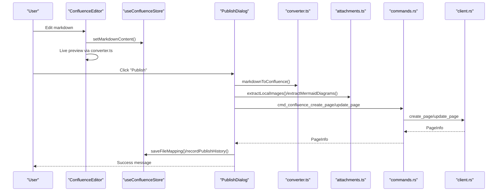
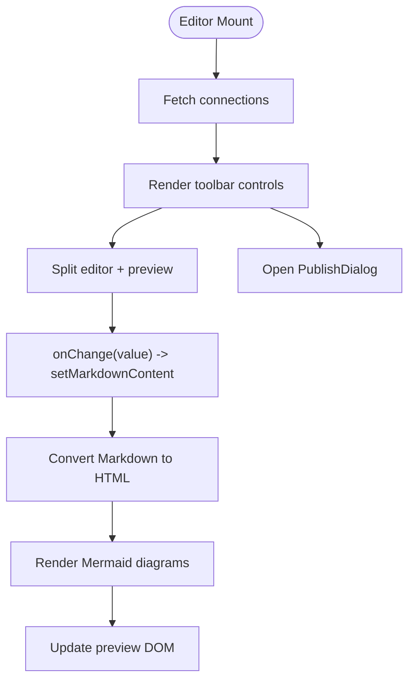
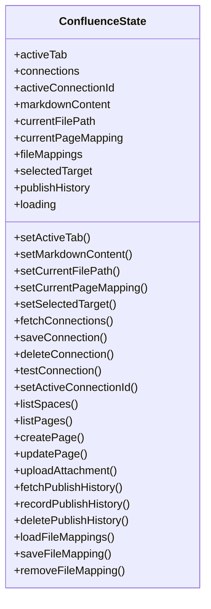
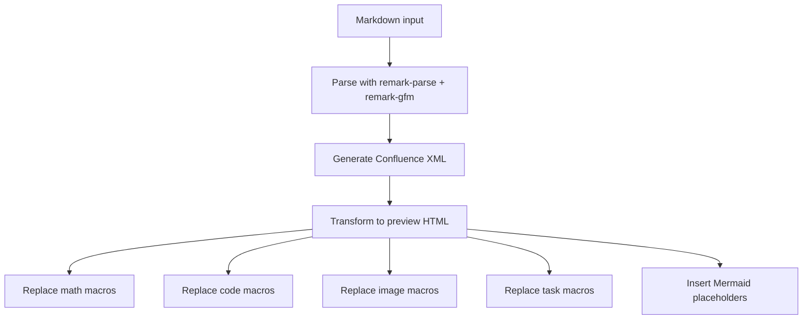
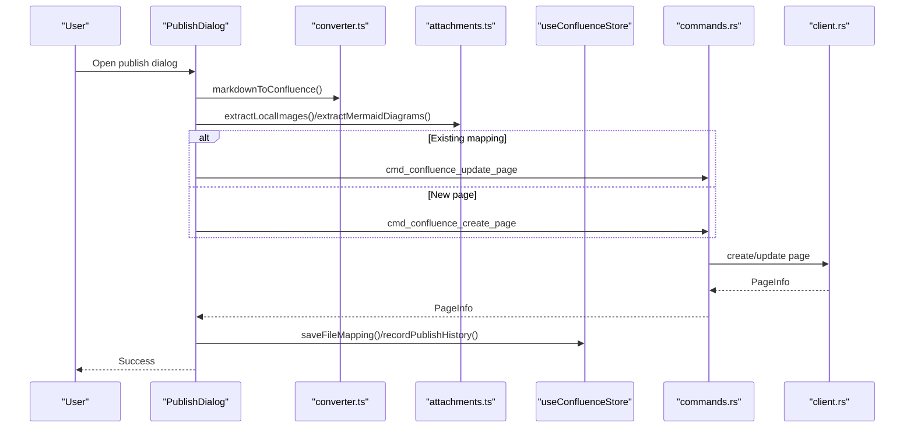
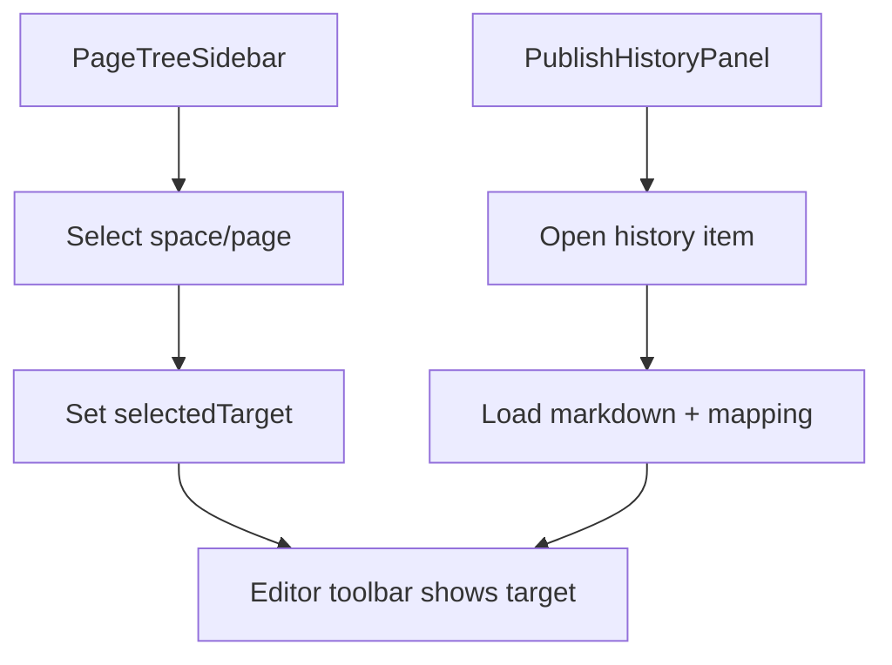
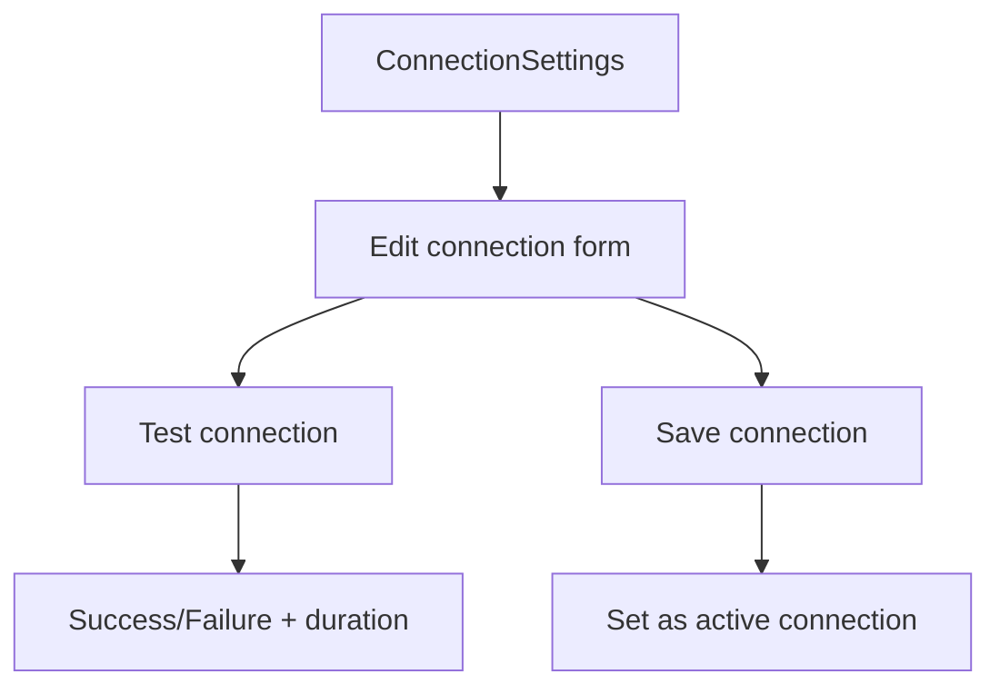
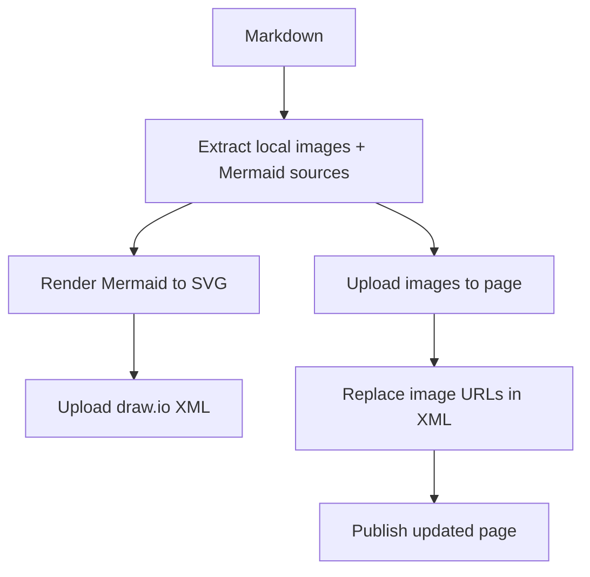
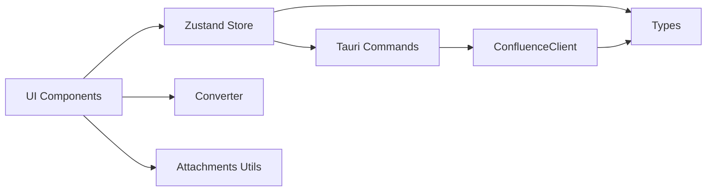

# Editor Interface

<cite>
**Referenced Files in This Document**
- [ConfluenceEditor.tsx](file://src/plugins/confluence/components/ConfluenceEditor.tsx)
- [confluence.ts](file://src/plugins/confluence/store/confluence.ts)
- [converter.ts](file://src/plugins/confluence/utils/converter.ts)
- [PublishDialog.tsx](file://src/plugins/confluence/components/PublishDialog.tsx)
- [PageTreeSidebar.tsx](file://src/plugins/confluence/components/PageTreeSidebar.tsx)
- [PublishHistoryPanel.tsx](file://src/plugins/confluence/components/PublishHistoryPanel.tsx)
- [ConnectionSettings.tsx](file://src/plugins/confluence/components/ConnectionSettings.tsx)
- [attachments.ts](file://src/plugins/confluence/utils/attachments.ts)
- [page-tree.ts](file://src/plugins/confluence/utils/page-tree.ts)
- [types.ts](file://src/plugins/confluence/types.ts)
- [index.tsx](file://src/plugins/confluence/index.tsx)
- [commands.rs](file://src-tauri/src/plugins/confluence/commands.rs)
- [client.rs](file://src-tauri/src/plugins/confluence/client.rs)
</cite>

## Table of Contents
1. [Introduction](#introduction)
2. [Project Structure](#project-structure)
3. [Core Components](#core-components)
4. [Architecture Overview](#architecture-overview)
5. [Detailed Component Analysis](#detailed-component-analysis)
6. [Dependency Analysis](#dependency-analysis)
7. [Performance Considerations](#performance-considerations)
8. [Troubleshooting Guide](#troubleshooting-guide)
9. [Conclusion](#conclusion)

## Introduction
This document describes the Confluence Editor interface component, focusing on markdown editing, live preview, user interactions, state management, document persistence, and integration with the Confluence API. It also covers publishing workflows, attachment handling, Mermaid rendering, and publish history. Practical examples illustrate markdown syntax usage and editing workflows, while diagrams explain the component interactions and data flows.

## Project Structure
The Confluence Editor is implemented as a React plugin with a Zustand store for state, a Markdown-to-Confluence converter, and Tauri-backed backend commands for Confluence API operations.

**Diagram sources**
- [ConfluenceEditor.tsx:15-196](file://src/plugins/confluence/components/ConfluenceEditor.tsx#L15-L196)
- [confluence.ts:67-145](file://src/plugins/confluence/store/confluence.ts#L67-L145)
- [converter.ts:1-226](file://src/plugins/confluence/utils/converter.ts#L1-L226)
- [PublishDialog.tsx:1-241](file://src/plugins/confluence/components/PublishDialog.tsx#L1-L241)
- [PageTreeSidebar.tsx:1-153](file://src/plugins/confluence/components/PageTreeSidebar.tsx#L1-L153)
- [PublishHistoryPanel.tsx:1-88](file://src/plugins/confluence/components/PublishHistoryPanel.tsx#L1-L88)
- [ConnectionSettings.tsx:1-125](file://src/plugins/confluence/components/ConnectionSettings.tsx#L1-L125)
- [attachments.ts:1-147](file://src/plugins/confluence/utils/attachments.ts#L1-L147)
- [page-tree.ts:1-62](file://src/plugins/confluence/utils/page-tree.ts#L1-L62)
- [types.ts:1-86](file://src/plugins/confluence/types.ts#L1-L86)
- [commands.rs:20-307](file://src-tauri/src/plugins/confluence/commands.rs#L20-L307)
- [client.rs:14-356](file://src-tauri/src/plugins/confluence/client.rs#L14-L356)

**Section sources**
- [index.tsx:1-18](file://src/plugins/confluence/index.tsx#L1-L18)
- [confluence.ts:67-145](file://src/plugins/confluence/store/confluence.ts#L67-L145)

## Core Components
- ConfluenceEditor: Main editor UI with toolbar, Monaco editor, and live preview panel. Manages markdown content, file I/O, and triggers publishing.
- PublishDialog: Modal for publishing or updating pages, including space selection, parent page selection, and status feedback.
- PageTreeSidebar: Tree browser for spaces and pages to select targets and create new drafts.
- PublishHistoryPanel: Lists recent publish actions and allows restoring drafts from history.
- ConnectionSettings: Drawer to configure Confluence connections (basic or PAT) and test connectivity.
- Converter: Converts Markdown to Confluence storage XML and generates HTML for live preview, including math and Mermaid support.
- Attachments utilities: Extracts and uploads local images and renders Mermaid diagrams as draw.io attachments.
- Store: Central state for connections, active connection, markdown content, file mappings, publish history, and selected targets.

**Section sources**
- [ConfluenceEditor.tsx:15-196](file://src/plugins/confluence/components/ConfluenceEditor.tsx#L15-L196)
- [PublishDialog.tsx:9-241](file://src/plugins/confluence/components/PublishDialog.tsx#L9-L241)
- [PageTreeSidebar.tsx:10-153](file://src/plugins/confluence/components/PageTreeSidebar.tsx#L10-L153)
- [PublishHistoryPanel.tsx:9-88](file://src/plugins/confluence/components/PublishHistoryPanel.tsx#L9-L88)
- [ConnectionSettings.tsx:8-125](file://src/plugins/confluence/components/ConnectionSettings.tsx#L8-L125)
- [converter.ts:1-226](file://src/plugins/confluence/utils/converter.ts#L1-L226)
- [attachments.ts:1-147](file://src/plugins/confluence/utils/attachments.ts#L1-L147)
- [confluence.ts:19-51](file://src/plugins/confluence/store/confluence.ts#L19-L51)

## Architecture Overview
The editor follows a unidirectional data flow:
- UI components update Zustand store state.
- Store invokes Tauri commands to call the Confluence REST API via a Rust client.
- Converter transforms Markdown to Confluence XML for publishing and preview.
- Attachment utilities manage local assets and Mermaid rendering.

**Diagram sources**
- [ConfluenceEditor.tsx:35-41](file://src/plugins/confluence/components/ConfluenceEditor.tsx#L35-L41)
- [converter.ts:185-214](file://src/plugins/confluence/utils/converter.ts#L185-L214)
- [attachments.ts:23-46](file://src/plugins/confluence/utils/attachments.ts#L23-L46)
- [PublishDialog.tsx:64-171](file://src/plugins/confluence/components/PublishDialog.tsx#L64-L171)
- [commands.rs:153-183](file://src-tauri/src/plugins/confluence/commands.rs#L153-L183)
- [client.rs:149-245](file://src-tauri/src/plugins/confluence/client.rs#L149-L245)

## Detailed Component Analysis

### ConfluenceEditor
Responsibilities:
- Provides toolbar actions: New, Open, Save, Connect, Publish/Update.
- Renders a split-pane with Monaco editor and live preview.
- Integrates Mermaid rendering for diagrams in preview.
- Tracks current file path and page mapping for publishing context.

Key behaviors:
- Live preview generation via converter and DOM updates with Mermaid rendering.
- File I/O using Tauri dialog and filesystem plugins.
- Publishing flow triggered by PublishDialog.

**Diagram sources**
- [ConfluenceEditor.tsx:31-70](file://src/plugins/confluence/components/ConfluenceEditor.tsx#L31-L70)
- [converter.ts:191-214](file://src/plugins/confluence/utils/converter.ts#L191-L214)

**Section sources**
- [ConfluenceEditor.tsx:15-196](file://src/plugins/confluence/components/ConfluenceEditor.tsx#L15-L196)

### Store and State Management
State model:
- Active tab, connections, active connection ID, markdown content, current file path, page mapping, selected target, publish history, and loading flags.
- Actions include CRUD for connections, listing spaces/pages, creating/updating pages, uploading attachments, managing publish history, and file mappings.

Persistence:
- File mappings persisted to localStorage.
- Publish history stored in the application database via Tauri commands.

Concurrency and versioning:
- Page updates increment the version number on the server; the store updates local mapping with the new version.

**Diagram sources**
- [confluence.ts:19-51](file://src/plugins/confluence/store/confluence.ts#L19-L51)

**Section sources**
- [confluence.ts:67-145](file://src/plugins/confluence/store/confluence.ts#L67-L145)

### Converter and Preview
Capabilities:
- Parses Markdown with GFM and converts to Confluence storage XML.
- Supports inline and block math macros, code blocks with language mapping, task lists, tables, footnotes, links, images, and thematic breaks.
- Generates HTML preview with math rendering, code blocks, images, and Mermaid placeholders.

Preview rendering:
- Extracts Mermaid sources from fenced code blocks and replaces macro placeholders with interactive previews.

**Diagram sources**
- [converter.ts:185-226](file://src/plugins/confluence/utils/converter.ts#L185-L226)

**Section sources**
- [converter.ts:1-226](file://src/plugins/confluence/utils/converter.ts#L1-L226)

### Publishing Workflow
End-to-end publishing:
- Detects existing mapping or prompts for space and optional parent page.
- Converts Markdown to Confluence XML.
- Uploads local images and Mermaid diagrams as attachments.
- Creates or updates the page with the correct version.
- Records publish history and updates file mappings.

**Diagram sources**
- [PublishDialog.tsx:64-171](file://src/plugins/confluence/components/PublishDialog.tsx#L64-L171)
- [converter.ts:185-189](file://src/plugins/confluence/utils/converter.ts#L185-L189)
- [attachments.ts:74-126](file://src/plugins/confluence/utils/attachments.ts#L74-L126)
- [commands.rs:153-183](file://src-tauri/src/plugins/confluence/commands.rs#L153-L183)
- [client.rs:149-245](file://src-tauri/src/plugins/confluence/client.rs#L149-L245)

**Section sources**
- [PublishDialog.tsx:64-171](file://src/plugins/confluence/components/PublishDialog.tsx#L64-L171)

### Page Tree and History Panels
- PageTreeSidebar: Lists spaces and nested pages, selects targets, and starts new drafts under the selected location.
- PublishHistoryPanel: Shows recent publish actions, allows restoring a draft and opening it in the editor, and deleting local history records.

**Diagram sources**
- [PageTreeSidebar.tsx:63-99](file://src/plugins/confluence/components/PageTreeSidebar.tsx#L63-L99)
- [PublishHistoryPanel.tsx:24-43](file://src/plugins/confluence/components/PublishHistoryPanel.tsx#L24-L43)
- [page-tree.ts:52-61](file://src/plugins/confluence/utils/page-tree.ts#L52-L61)

**Section sources**
- [PageTreeSidebar.tsx:10-153](file://src/plugins/confluence/components/PageTreeSidebar.tsx#L10-L153)
- [PublishHistoryPanel.tsx:9-88](file://src/plugins/confluence/components/PublishHistoryPanel.tsx#L9-L88)
- [page-tree.ts:1-62](file://src/plugins/confluence/utils/page-tree.ts#L1-L62)

### Connection Settings
- Manage multiple Confluence connections with labels, base URLs, and auth types (basic or PAT).
- Test connection speed and reliability.
- Persist credentials securely and toggle active connection.

**Diagram sources**
- [ConnectionSettings.tsx:25-64](file://src/plugins/confluence/components/ConnectionSettings.tsx#L25-L64)
- [commands.rs:92-112](file://src-tauri/src/plugins/confluence/commands.rs#L92-L112)

**Section sources**
- [ConnectionSettings.tsx:8-125](file://src/plugins/confluence/components/ConnectionSettings.tsx#L8-L125)

### Attachment Utilities
- Extract local images and Mermaid diagrams from Markdown.
- Upload images and Mermaid SVGs as attachments and replace references in XML.
- Compute MIME types and base64 encode content.

**Diagram sources**
- [attachments.ts:23-126](file://src/plugins/confluence/utils/attachments.ts#L23-L126)

**Section sources**
- [attachments.ts:1-147](file://src/plugins/confluence/utils/attachments.ts#L1-L147)

## Dependency Analysis
- UI components depend on the Zustand store for state and actions.
- Store actions call Tauri commands, which construct a ConfluenceClient and perform HTTP requests.
- Converter and attachment utilities are pure frontend helpers invoked during publishing and preview.
- Types define the shape of data exchanged between frontend and backend.

**Diagram sources**
- [confluence.ts:84-144](file://src/plugins/confluence/store/confluence.ts#L84-L144)
- [commands.rs:20-307](file://src-tauri/src/plugins/confluence/commands.rs#L20-L307)
- [client.rs:14-356](file://src-tauri/src/plugins/confluence/client.rs#L14-L356)
- [converter.ts:1-226](file://src/plugins/confluence/utils/converter.ts#L1-L226)
- [attachments.ts:1-147](file://src/plugins/confluence/utils/attachments.ts#L1-L147)
- [types.ts:1-86](file://src/plugins/confluence/types.ts#L1-L86)

**Section sources**
- [confluence.ts:19-51](file://src/plugins/confluence/store/confluence.ts#L19-L51)
- [commands.rs:20-307](file://src-tauri/src/plugins/confluence/commands.rs#L20-L307)
- [client.rs:14-356](file://src-tauri/src/plugins/confluence/client.rs#L14-L356)

## Performance Considerations
- Live preview conversion: Debounce or throttle editor change events if needed to avoid frequent conversions during rapid typing.
- Mermaid rendering: Cancel in-flight renders on unmount to prevent DOM updates after component exit.
- Image uploads: Batch uploads and avoid blocking the UI; show progress per asset.
- Tree loading: Lazy-load child nodes on demand to reduce initial payload.
- Database queries: Limit publish history results and paginate where appropriate.

## Troubleshooting Guide
Common issues and resolutions:
- Authentication failures: Verify auth type and credentials; PAT requires Bearer header; Basic requires username/password or token.
- Version conflicts: When updating, ensure the version number increments; the backend returns the new version after successful update.
- Mermaid rendering errors: Check diagram syntax and ensure Mermaid library loads; errors are surfaced in the preview.
- Attachment upload failures: Confirm file paths are resolvable and MIME types are correct; review console warnings.
- Connection test timeouts: Increase timeout or check network/firewall settings.

Operational checks:
- Use ConnectionSettings to test connectivity and confirm response time.
- Inspect publish history to verify actions and timestamps.
- Clear or refresh page mappings if stale.

**Section sources**
- [ConnectionSettings.tsx:25-38](file://src/plugins/confluence/components/ConnectionSettings.tsx#L25-L38)
- [client.rs:38-59](file://src-tauri/src/plugins/confluence/client.rs#L38-L59)
- [PublishDialog.tsx:165-171](file://src/plugins/confluence/components/PublishDialog.tsx#L165-L171)

## Conclusion
The Confluence Editor integrates a modern React-based UI with a robust backend pipeline to enable seamless markdown authoring, live preview, and reliable publishing to Confluence. Its state-driven architecture, modular converter and attachment utilities, and Tauri-backed API commands provide a scalable foundation for document creation, collaboration, and maintenance. Future enhancements could include auto-save hooks, keyboard shortcuts, and collaborative editing features built on top of the existing store and API layer.