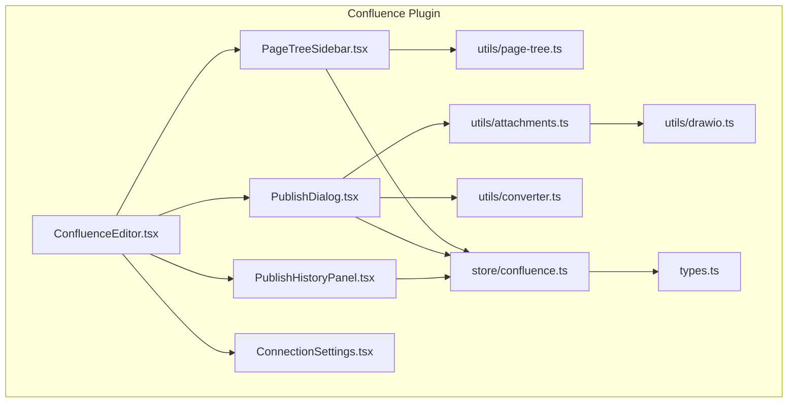
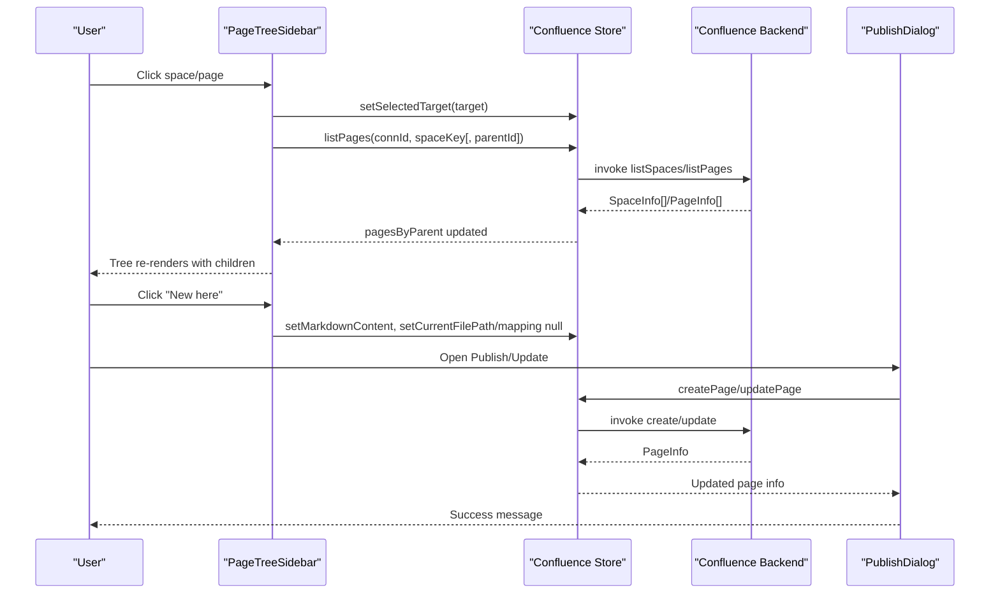
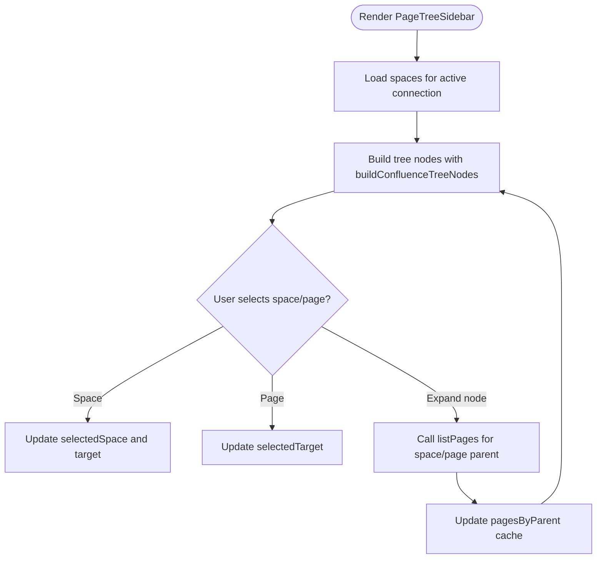
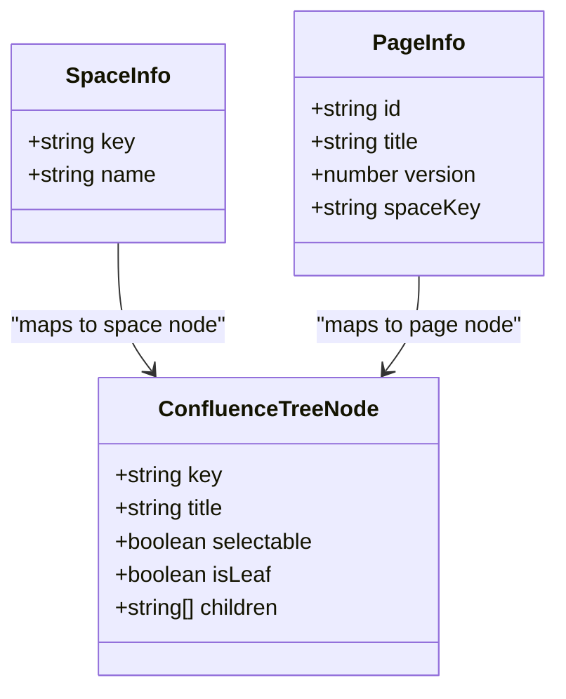
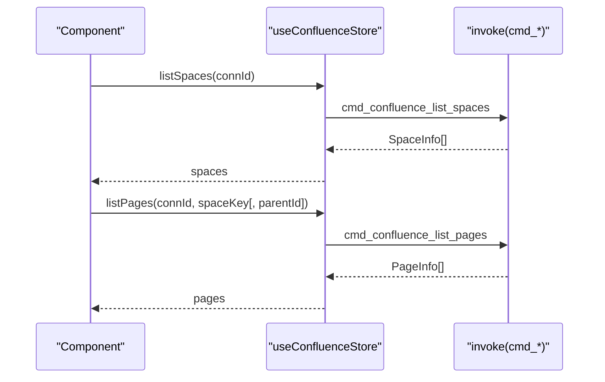
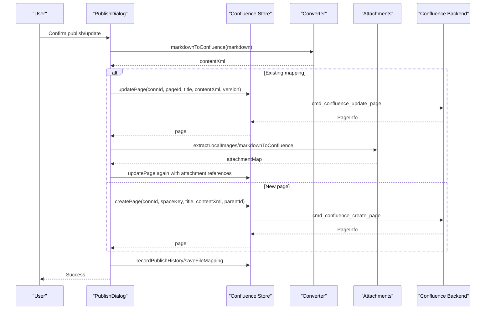
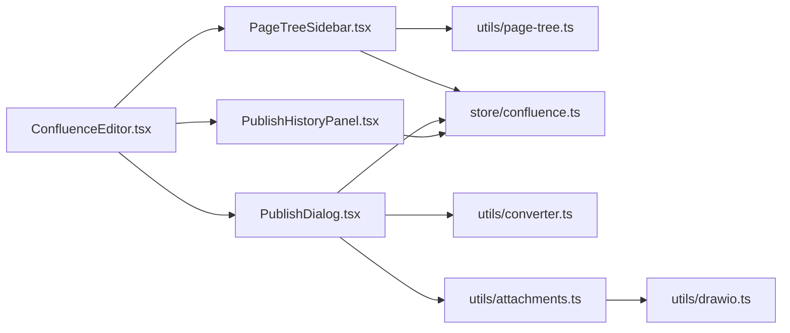

# Page Tree Navigation

<cite>
**Referenced Files in This Document**
- [PageTreeSidebar.tsx](file://src/plugins/confluence/components/PageTreeSidebar.tsx)
- [page-tree.ts](file://src/plugins/confluence/utils/page-tree.ts)
- [confluence.ts](file://src/plugins/confluence/store/confluence.ts)
- [types.ts](file://src/plugins/confluence/types.ts)
- [ConfluenceEditor.tsx](file://src/plugins/confluence/components/ConfluenceEditor.tsx)
- [converter.ts](file://src/plugins/confluence/utils/converter.ts)
- [attachments.ts](file://src/plugins/confluence/utils/attachments.ts)
- [drawio.ts](file://src/plugins/confluence/utils/drawio.ts)
- [PublishDialog.tsx](file://src/plugins/confluence/components/PublishDialog.tsx)
- [PublishHistoryPanel.tsx](file://src/plugins/confluence/components/PublishHistoryPanel.tsx)
- [ConnectionSettings.tsx](file://src/plugins/confluence/components/ConnectionSettings.tsx)
- [confluence-page-tree.test.ts](file://tests/app/confluence-page-tree.test.ts)
</cite>

## Table of Contents
1. [Introduction](#introduction)
2. [Project Structure](#project-structure)
3. [Core Components](#core-components)
4. [Architecture Overview](#architecture-overview)
5. [Detailed Component Analysis](#detailed-component-analysis)
6. [Dependency Analysis](#dependency-analysis)
7. [Performance Considerations](#performance-considerations)
8. [Troubleshooting Guide](#troubleshooting-guide)
9. [Conclusion](#conclusion)

## Introduction
This document describes the Confluence page tree navigation system, focusing on the hierarchical page structure visualization, navigation controls, and page management functionality. It explains how the page tree is rendered, how expand/collapse behaviors work, and how users can search/filter and manage pages. It also covers page relationships, publishing workflows, and cross-referencing within the Confluence environment.

## Project Structure
The Confluence plugin organizes page tree navigation across several React components and supporting utilities:
- Sidebar tree and selection logic
- Store-driven state for spaces, pages, and targets
- Rendering utilities for Ant Design Tree nodes
- Publishing dialog and history panel
- Converter and attachment utilities for publishing

**Diagram sources**
- [ConfluenceEditor.tsx:157-195](file://src/plugins/confluence/components/ConfluenceEditor.tsx#L157-L195)
- [PageTreeSidebar.tsx:10-152](file://src/plugins/confluence/components/PageTreeSidebar.tsx#L10-L152)
- [PublishDialog.tsx:9-241](file://src/plugins/confluence/components/PublishDialog.tsx#L9-L241)
- [PublishHistoryPanel.tsx:9-88](file://src/plugins/confluence/components/PublishHistoryPanel.tsx#L9-L88)
- [ConnectionSettings.tsx:8-125](file://src/plugins/confluence/components/ConnectionSettings.tsx#L8-L125)
- [page-tree.ts:21-61](file://src/plugins/confluence/utils/page-tree.ts#L21-L61)
- [confluence.ts:67-146](file://src/plugins/confluence/store/confluence.ts#L67-L146)
- [types.ts:1-86](file://src/plugins/confluence/types.ts#L1-L86)
- [converter.ts:185-226](file://src/plugins/confluence/utils/converter.ts#L185-L226)
- [attachments.ts:23-147](file://src/plugins/confluence/utils/attachments.ts#L23-L147)
- [drawio.ts:1-65](file://src/plugins/confluence/utils/drawio.ts#L1-L65)

**Section sources**
- [ConfluenceEditor.tsx:15-196](file://src/plugins/confluence/components/ConfluenceEditor.tsx#L15-L196)
- [PageTreeSidebar.tsx:10-152](file://src/plugins/confluence/components/PageTreeSidebar.tsx#L10-L152)
- [page-tree.ts:21-61](file://src/plugins/confluence/utils/page-tree.ts#L21-L61)
- [confluence.ts:67-146](file://src/plugins/confluence/store/confluence.ts#L67-L146)
- [types.ts:1-86](file://src/plugins/confluence/types.ts#L1-L86)

## Core Components
- PageTreeSidebar: Renders the hierarchical tree of Confluence spaces and pages, supports lazy loading, selection, and "New here" creation.
- buildConfluenceTreeNodes: Transforms space and page collections into Ant Design Tree nodes with proper keys and selection indicators.
- Confluence store: Provides actions to list spaces/pages, create/update pages, and maintain selected target and mappings.
- PublishDialog: Manages publishing and updating pages, including attachments and Mermaid diagrams.
- PublishHistoryPanel: Lists previous publish actions and allows restoring drafts from history.
- Converter and attachments: Convert Markdown to Confluence XML, embed images, and upload Mermaid diagrams as draw.io attachments.

**Section sources**
- [PageTreeSidebar.tsx:10-152](file://src/plugins/confluence/components/PageTreeSidebar.tsx#L10-L152)
- [page-tree.ts:21-61](file://src/plugins/confluence/utils/page-tree.ts#L21-L61)
- [confluence.ts:67-146](file://src/plugins/confluence/store/confluence.ts#L67-L146)
- [PublishDialog.tsx:9-241](file://src/plugins/confluence/components/PublishDialog.tsx#L9-L241)
- [PublishHistoryPanel.tsx:9-88](file://src/plugins/confluence/components/PublishHistoryPanel.tsx#L9-L88)
- [converter.ts:185-226](file://src/plugins/confluence/utils/converter.ts#L185-L226)
- [attachments.ts:23-147](file://src/plugins/confluence/utils/attachments.ts#L23-L147)

## Architecture Overview
The page tree navigation follows a unidirectional data flow:
- The store holds active connection, spaces, pages, selected target, and mappings.
- The sidebar renders the tree and triggers lazy loading of child pages on demand.
- Selection updates the selected target, enabling "New here" creation and publishing dialogs.
- Publishing converts Markdown to Confluence XML, uploads attachments/Mermaid diagrams, and records history.

**Diagram sources**
- [PageTreeSidebar.tsx:68-99](file://src/plugins/confluence/components/PageTreeSidebar.tsx#L68-L99)
- [confluence.ts:105-119](file://src/plugins/confluence/store/confluence.ts#L105-L119)
- [PublishDialog.tsx:64-171](file://src/plugins/confluence/components/PublishDialog.tsx#L64-L171)

## Detailed Component Analysis

### PageTreeSidebar: Hierarchical Tree and Lazy Loading
- Renders a searchable space selector and an Ant Design Tree.
- Builds nodes via buildConfluenceTreeNodes, marking the selected page with a CSS class.
- Implements lazy loading: clicking a node triggers listPages for that space or page parent.
- Selection updates selectedTarget to drive publishing and "New here" behavior.

**Diagram sources**
- [PageTreeSidebar.tsx:31-61](file://src/plugins/confluence/components/PageTreeSidebar.tsx#L31-L61)
- [PageTreeSidebar.tsx:63-85](file://src/plugins/confluence/components/PageTreeSidebar.tsx#L63-L85)
- [page-tree.ts:21-50](file://src/plugins/confluence/utils/page-tree.ts#L21-L50)

**Section sources**
- [PageTreeSidebar.tsx:10-152](file://src/plugins/confluence/components/PageTreeSidebar.tsx#L10-L152)
- [page-tree.ts:21-50](file://src/plugins/confluence/utils/page-tree.ts#L21-L50)

### buildConfluenceTreeNodes: Tree Node Construction
- Converts SpaceInfo[] and pagesByParent into Ant Design Tree nodes.
- Keys use "space:key" and "page:id" prefixes for consistent identification.
- Adds a CSS class to the selected page node for visual emphasis.

**Diagram sources**
- [page-tree.ts:5-10](file://src/plugins/confluence/utils/page-tree.ts#L5-L10)
- [types.ts:26-36](file://src/plugins/confluence/types.ts#L26-L36)
- [page-tree.ts:21-50](file://src/plugins/confluence/utils/page-tree.ts#L21-L50)

**Section sources**
- [page-tree.ts:21-50](file://src/plugins/confluence/utils/page-tree.ts#L21-L50)
- [types.ts:26-36](file://src/plugins/confluence/types.ts#L26-L36)

### Confluence Store: State and Actions
- Holds active connection, spaces, pages, selected target, and mappings.
- Exposes actions to list spaces/pages, create/update pages, upload attachments, and manage publish history.
- Integrates with backend via invoke commands.

**Diagram sources**
- [confluence.ts:105-119](file://src/plugins/confluence/store/confluence.ts#L105-L119)

**Section sources**
- [confluence.ts:67-146](file://src/plugins/confluence/store/confluence.ts#L67-L146)
- [types.ts:1-86](file://src/plugins/confluence/types.ts#L1-L86)

### Publishing Workflow: Create vs Update
- Detects existing file-to-page mappings to decide update vs create.
- Converts Markdown to Confluence XML, uploads local images and Mermaid diagrams, then updates page content with attachment references.
- Records publish history and updates file mappings.

**Diagram sources**
- [PublishDialog.tsx:64-171](file://src/plugins/confluence/components/PublishDialog.tsx#L64-L171)
- [converter.ts:185-226](file://src/plugins/confluence/utils/converter.ts#L185-L226)
- [attachments.ts:74-126](file://src/plugins/confluence/utils/attachments.ts#L74-L126)
- [confluence.ts:111-119](file://src/plugins/confluence/store/confluence.ts#L111-L119)

**Section sources**
- [PublishDialog.tsx:9-241](file://src/plugins/confluence/components/PublishDialog.tsx#L9-L241)
- [converter.ts:185-226](file://src/plugins/confluence/utils/converter.ts#L185-L226)
- [attachments.ts:23-147](file://src/plugins/confluence/utils/attachments.ts#L23-L147)
- [drawio.ts:1-65](file://src/plugins/confluence/utils/drawio.ts#L1-L65)

### Publish History Panel: Draft Restoration
- Lists publish history entries and allows loading a historical draft into the editor.
- Restores markdown content, file path, and page mapping, and sets the selected target.

**Section sources**
- [PublishHistoryPanel.tsx:9-88](file://src/plugins/confluence/components/PublishHistoryPanel.tsx#L9-L88)
- [page-tree.ts:52-61](file://src/plugins/confluence/utils/page-tree.ts#L52-L61)

### Search and Filter Capabilities
- Space selector supports showSearch and optionFilterProp for filtering by label.
- Publish dialog supports filtering spaces and parent pages by label.

**Section sources**
- [PageTreeSidebar.tsx:125-137](file://src/plugins/confluence/components/PageTreeSidebar.tsx#L125-L137)
- [PublishDialog.tsx:200-232](file://src/plugins/confluence/components/PublishDialog.tsx#L200-L232)

### Drag-and-Drop and Cross-Referencing
- The current implementation does not expose explicit drag-and-drop reordering within the page tree.
- Cross-referencing is handled by publishing links and attachments; internal page links are preserved as Markdown and converted to Confluence HTML during preview/publish.

**Section sources**
- [PageTreeSidebar.tsx:140-149](file://src/plugins/confluence/components/PageTreeSidebar.tsx#L140-L149)
- [converter.ts:120-125](file://src/plugins/confluence/utils/converter.ts#L120-L125)

### Practical Examples and Workflows
- Creating a new page under a selected target:
  - Select a space or page in the tree.
  - Click "New here" to initialize a blank draft.
  - Open the publish dialog to set title and parent, then publish.
- Publishing an existing page:
  - Open the publish dialog; if a mapping exists, it updates the existing page.
  - Images and Mermaid diagrams are uploaded as attachments and embedded automatically.
- Restoring a previous version:
  - Use the publish history panel to load a historical draft into the editor.

**Section sources**
- [PageTreeSidebar.tsx:101-105](file://src/plugins/confluence/components/PageTreeSidebar.tsx#L101-L105)
- [PublishDialog.tsx:64-171](file://src/plugins/confluence/components/PublishDialog.tsx#L64-L171)
- [PublishHistoryPanel.tsx:24-43](file://src/plugins/confluence/components/PublishHistoryPanel.tsx#L24-L43)

## Dependency Analysis
- PageTreeSidebar depends on:
  - Confluence store for spaces/pages and selected target
  - buildConfluenceTreeNodes for rendering
- PublishDialog depends on:
  - Confluence store for create/update actions
  - Converter for XML generation
  - Attachments for image/Mermaid handling
- Converter and attachments depend on:
  - drawio utilities for Mermaid embedding

**Diagram sources**
- [PageTreeSidebar.tsx:6-8](file://src/plugins/confluence/components/PageTreeSidebar.tsx#L6-L8)
- [page-tree.ts:1-10](file://src/plugins/confluence/utils/page-tree.ts#L1-L10)
- [confluence.ts:1-16](file://src/plugins/confluence/store/confluence.ts#L1-L16)
- [PublishDialog.tsx:4-7](file://src/plugins/confluence/components/PublishDialog.tsx#L4-L7)
- [converter.ts:1-11](file://src/plugins/confluence/utils/converter.ts#L1-L11)
- [attachments.ts:1-11](file://src/plugins/confluence/utils/attachments.ts#L1-L11)
- [drawio.ts:1-4](file://src/plugins/confluence/utils/drawio.ts#L1-L4)
- [PublishHistoryPanel.tsx:5-7](file://src/plugins/confluence/components/PublishHistoryPanel.tsx#L5-L7)
- [ConfluenceEditor.tsx:10-13](file://src/plugins/confluence/components/ConfluenceEditor.tsx#L10-L13)

**Section sources**
- [page-tree.test.ts:6-46](file://tests/app/confluence-page-tree.test.ts#L6-L46)

## Performance Considerations
- Lazy loading: Nodes are loaded on demand to minimize initial payload and improve responsiveness.
- Caching: pagesByParent caches fetched pages per parent key to avoid redundant requests.
- Rendering: Ant Design Tree efficiently handles large hierarchies with virtualization-like behavior.

[No sources needed since this section provides general guidance]

## Troubleshooting Guide
- No active connection:
  - The sidebar displays a message prompting to connect Confluence first.
- Connection settings:
  - Use the drawer to configure connections, test connectivity, and manage saved connections.
- Publishing errors:
  - The publish dialog reports errors and stops the process; verify credentials and permissions.
- Attachment upload failures:
  - Local images and Mermaid diagrams are uploaded separately; failures are logged and do not block page creation/update.

**Section sources**
- [PageTreeSidebar.tsx:107-109](file://src/plugins/confluence/components/PageTreeSidebar.tsx#L107-L109)
- [ConnectionSettings.tsx:25-38](file://src/plugins/confluence/components/ConnectionSettings.tsx#L25-L38)
- [PublishDialog.tsx:165-171](file://src/plugins/confluence/components/PublishDialog.tsx#L165-L171)
- [attachments.ts:89-92](file://src/plugins/confluence/utils/attachments.ts#L89-L92)

## Conclusion
The Confluence page tree navigation system provides a responsive, lazy-loading tree with robust publishing workflows. Users can organize pages hierarchically, search spaces, and manage drafts via publish history. While explicit drag-and-drop is not implemented, the system supports efficient page creation, updates, and cross-referencing through attachments and Markdown-to-Confluence conversion.