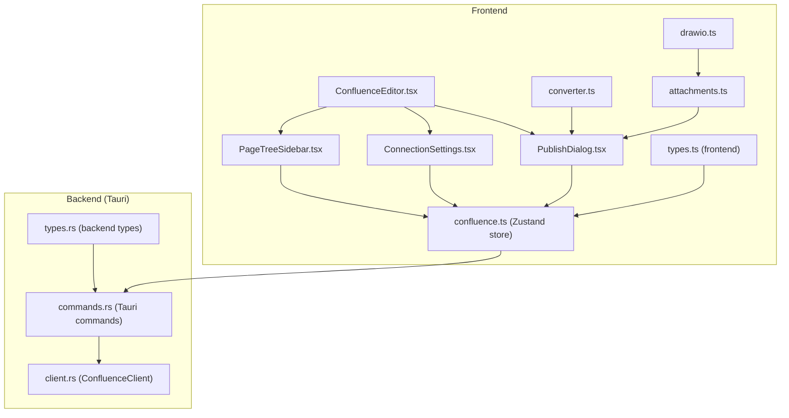
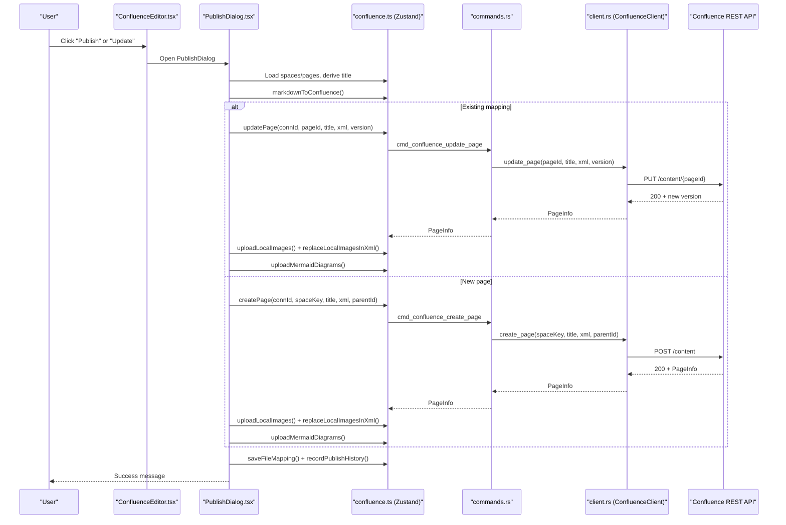
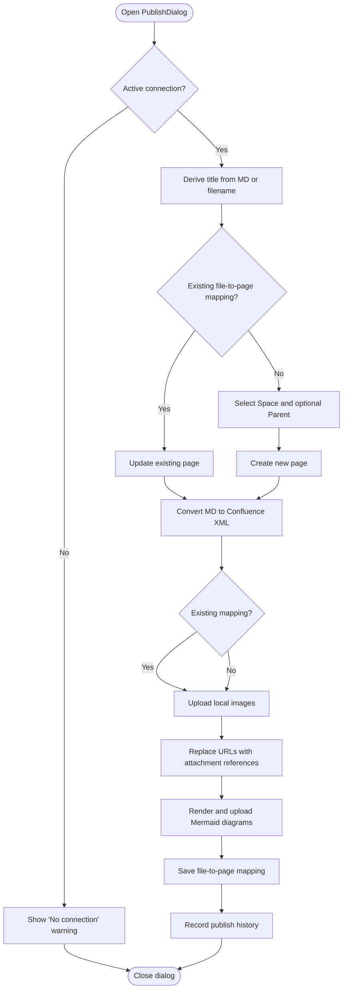
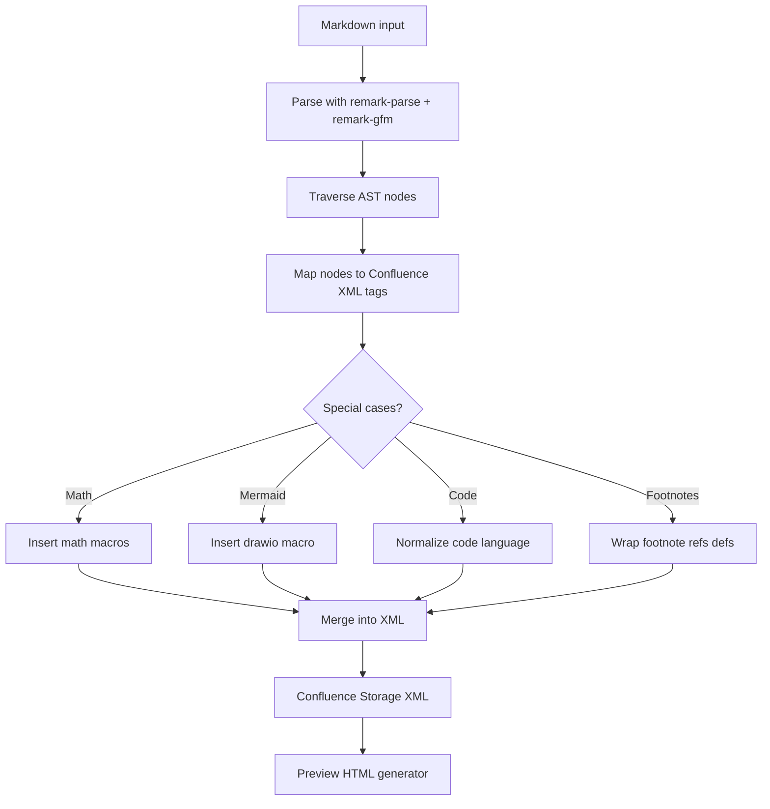
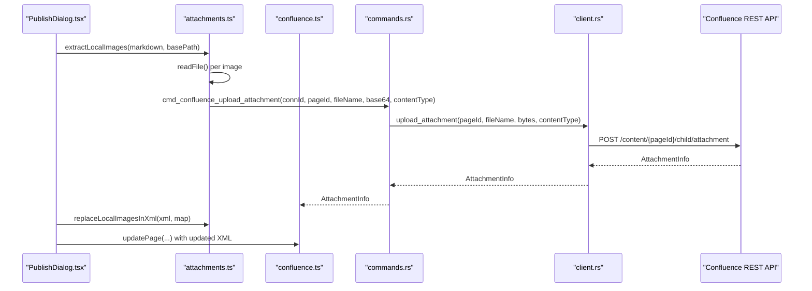
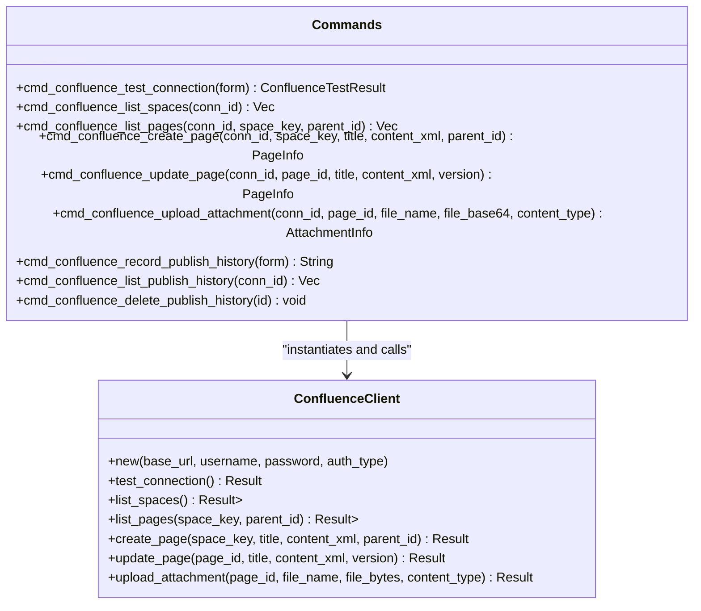
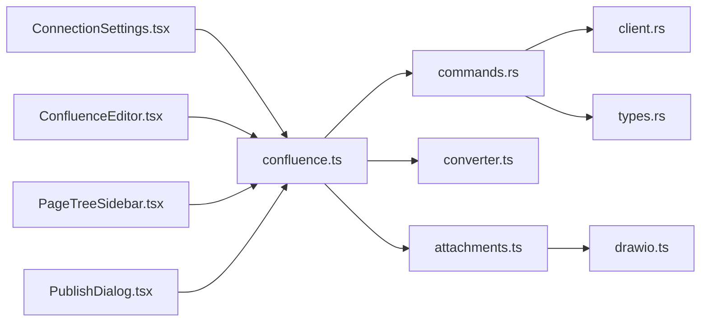

# Publishing Workflow

<cite>
**Referenced Files in This Document**
- [index.tsx](file://src/plugins/confluence/index.tsx)
- [types.ts](file://src/plugins/confluence/types.ts)
- [confluence.ts](file://src/plugins/confluence/store/confluence.ts)
- [converter.ts](file://src/plugins/confluence/utils/converter.ts)
- [attachments.ts](file://src/plugins/confluence/utils/attachments.ts)
- [drawio.ts](file://src/plugins/confluence/utils/drawio.ts)
- [page-tree.ts](file://src/plugins/confluence/utils/page-tree.ts)
- [ConfluenceEditor.tsx](file://src/plugins/confluence/components/ConfluenceEditor.tsx)
- [PublishDialog.tsx](file://src/plugins/confluence/components/PublishDialog.tsx)
- [ConnectionSettings.tsx](file://src/plugins/confluence/components/ConnectionSettings.tsx)
- [PageTreeSidebar.tsx](file://src/plugins/confluence/components/PageTreeSidebar.tsx)
- [client.rs](file://src-tauri/src/plugins/confluence/client.rs)
- [commands.rs](file://src-tauri/src/plugins/confluence/commands.rs)
- [types.rs](file://src-tauri/src/plugins/confluence/types.rs)
</cite>

## Table of Contents
1. [Introduction](#introduction)
2. [Project Structure](#project-structure)
3. [Core Components](#core-components)
4. [Architecture Overview](#architecture-overview)
5. [Detailed Component Analysis](#detailed-component-analysis)
6. [Dependency Analysis](#dependency-analysis)
7. [Performance Considerations](#performance-considerations)
8. [Troubleshooting Guide](#troubleshooting-guide)
9. [Conclusion](#conclusion)

## Introduction
This document explains the Confluence publishing workflow end-to-end. It covers the publish dialog interface, document conversion pipeline from Markdown to Confluence Storage Format, publishing configuration, authentication, API integration, publishing stages, error handling, and practical examples. It also documents metadata management, version control integration via file-to-page mappings, permissions, content validation, and conflict resolution strategies.

## Project Structure
The Confluence plugin is organized into frontend React components and utilities, and a backend Rust module that integrates with Confluence’s REST API. The frontend stores state, renders the editor and dialogs, and orchestrates publishing. The backend exposes Tauri commands that wrap HTTP requests to Confluence.

**Diagram sources**
- [ConfluenceEditor.tsx:1-205](file://src/plugins/confluence/components/ConfluenceEditor.tsx#L1-L205)
- [PublishDialog.tsx:1-241](file://src/plugins/confluence/components/PublishDialog.tsx#L1-L241)
- [ConnectionSettings.tsx:1-125](file://src/plugins/confluence/components/ConnectionSettings.tsx#L1-L125)
- [PageTreeSidebar.tsx:1-153](file://src/plugins/confluence/components/PageTreeSidebar.tsx#L1-L153)
- [confluence.ts:1-146](file://src/plugins/confluence/store/confluence.ts#L1-L146)
- [converter.ts:1-226](file://src/plugins/confluence/utils/converter.ts#L1-L226)
- [attachments.ts:1-147](file://src/plugins/confluence/utils/attachments.ts#L1-L147)
- [drawio.ts:1-65](file://src/plugins/confluence/utils/drawio.ts#L1-L65)
- [commands.rs:1-307](file://src-tauri/src/plugins/confluence/commands.rs#L1-L307)
- [client.rs:1-356](file://src-tauri/src/plugins/confluence/client.rs#L1-L356)
- [types.ts:1-86](file://src/plugins/confluence/types.ts#L1-L86)
- [types.rs:1-87](file://src-tauri/src/plugins/confluence/types.rs#L1-L87)

**Section sources**
- [index.tsx:1-18](file://src/plugins/confluence/index.tsx#L1-L18)
- [types.ts:1-86](file://src/plugins/confluence/types.ts#L1-L86)
- [confluence.ts:1-146](file://src/plugins/confluence/store/confluence.ts#L1-L146)
- [commands.rs:1-307](file://src-tauri/src/plugins/confluence/commands.rs#L1-L307)
- [client.rs:1-356](file://src-tauri/src/plugins/confluence/client.rs#L1-L356)

## Core Components
- Frontend plugin manifest and root component
- Store for state and API invocations
- Converter from Markdown to Confluence Storage Format
- Attachment utilities for local images and Mermaid diagrams
- Draw.io macro generation for Mermaid rendering
- Page tree builder and history-to-editor draft mapping
- UI components: editor, publish dialog, connection settings, page tree sidebar

Key responsibilities:
- Manage connections, spaces, pages, and publish history
- Convert Markdown to Confluence XML
- Upload attachments and replace references
- Orchestrate create/update operations with versioning
- Persist file-to-page mappings and publish history

**Section sources**
- [index.tsx:1-18](file://src/plugins/confluence/index.tsx#L1-L18)
- [confluence.ts:19-51](file://src/plugins/confluence/store/confluence.ts#L19-L51)
- [converter.ts:185-226](file://src/plugins/confluence/utils/converter.ts#L185-L226)
- [attachments.ts:74-147](file://src/plugins/confluence/utils/attachments.ts#L74-L147)
- [drawio.ts:6-65](file://src/plugins/confluence/utils/drawio.ts#L6-L65)
- [page-tree.ts:21-62](file://src/plugins/confluence/utils/page-tree.ts#L21-L62)

## Architecture Overview
The publishing workflow spans frontend and backend layers. The frontend renders the editor and dialogs, manages state, and invokes Tauri commands. The backend validates and executes HTTP requests against Confluence’s REST API, returning structured results to the frontend.

**Diagram sources**
- [PublishDialog.tsx:64-171](file://src/plugins/confluence/components/PublishDialog.tsx#L64-L171)
- [confluence.ts:111-119](file://src/plugins/confluence/store/confluence.ts#L111-L119)
- [commands.rs:153-183](file://src-tauri/src/plugins/confluence/commands.rs#L153-L183)
- [client.rs:198-245](file://src-tauri/src/plugins/confluence/client.rs#L198-L245)

## Detailed Component Analysis

### Publish Dialog Interface
The publish dialog coordinates publishing decisions and collects configuration:
- Title derivation from first heading or filename
- Space selection and optional parent page selection
- Existing mapping detection to decide create vs update
- Status updates during conversion, uploads, and re-updates
- Recording publish history and saving file-to-page mappings

**Diagram sources**
- [PublishDialog.tsx:32-171](file://src/plugins/confluence/components/PublishDialog.tsx#L32-L171)
- [attachments.ts:74-147](file://src/plugins/confluence/utils/attachments.ts#L74-L147)

**Section sources**
- [PublishDialog.tsx:9-241](file://src/plugins/confluence/components/PublishDialog.tsx#L9-L241)

### Document Conversion Pipeline
The converter transforms Markdown to Confluence Storage Format (XML):
- Uses remark/unified to parse Markdown and traverse AST
- Converts headings, paragraphs, links, images, code blocks, lists, footnotes
- Special-casing for inline and block math, Mermaid code blocks, and task lists
- Produces Confluence XML suitable for storage representation
- Provides a preview HTML generator for editor-side rendering

**Diagram sources**
- [converter.ts:185-226](file://src/plugins/confluence/utils/converter.ts#L185-L226)

**Section sources**
- [converter.ts:1-226](file://src/plugins/confluence/utils/converter.ts#L1-L226)

### Attachment Management
Local images and Mermaid diagrams are uploaded as attachments and referenced in the page content:
- Extract local image references and Mermaid diagram sources
- Upload images and Mermaid SVGs as draw.io attachments
- Replace image URLs in XML with attachment references
- Re-update the page to reflect attachment references

**Diagram sources**
- [attachments.ts:74-147](file://src/plugins/confluence/utils/attachments.ts#L74-L147)
- [confluence.ts:117-119](file://src/plugins/confluence/store/confluence.ts#L117-L119)
- [commands.rs:185-202](file://src-tauri/src/plugins/confluence/commands.rs#L185-L202)
- [client.rs:247-291](file://src-tauri/src/plugins/confluence/client.rs#L247-L291)

**Section sources**
- [attachments.ts:1-147](file://src/plugins/confluence/utils/attachments.ts#L1-L147)
- [drawio.ts:1-65](file://src/plugins/confluence/utils/drawio.ts#L1-L65)

### Authentication and API Integration
The backend supports two authentication modes:
- Basic: username/password encoded as Base64
- PAT/Bearer: Personal Access Token sent as Bearer header

It wraps Confluence REST endpoints:
- Test connection
- List spaces
- List pages (with optional parent)
- Create page
- Update page
- Upload attachment

**Diagram sources**
- [client.rs:8-356](file://src-tauri/src/plugins/confluence/client.rs#L8-L356)
- [commands.rs:92-307](file://src-tauri/src/plugins/confluence/commands.rs#L92-L307)

**Section sources**
- [client.rs:14-59](file://src-tauri/src/plugins/confluence/client.rs#L14-L59)
- [commands.rs:92-112](file://src-tauri/src/plugins/confluence/commands.rs#L92-L112)
- [types.rs:1-87](file://src-tauri/src/plugins/confluence/types.rs#L1-L87)

### Publishing Stages and Metadata
- Stage 1: Convert Markdown to Confluence XML
- Stage 2: Create or update page
- Stage 3: Upload local images and Mermaid diagrams
- Stage 4: Replace image URLs with attachment references
- Stage 5: Re-update page to include attachments
- Stage 6: Save file-to-page mapping and record publish history

Metadata managed:
- File-to-page mapping: filePath, spaceKey, pageId, pageTitle, version, lastPublished
- Publish history: connectionId, spaceKey, pageId, action, filePath, markdownContent, publishedAt

**Section sources**
- [PublishDialog.tsx:64-171](file://src/plugins/confluence/components/PublishDialog.tsx#L64-L171)
- [confluence.ts:134-144](file://src/plugins/confluence/store/confluence.ts#L134-L144)
- [types.ts:44-86](file://src/plugins/confluence/types.ts#L44-L86)

### Error Handling and Validation
- UI validations: title required, space required for new pages, active connection required
- Backend validations: HTTP status checks, JSON parsing, 401 handling for auth failures
- User feedback: messages for errors and success, status text updates during long operations
- Preview error handling: fallback message if conversion fails

**Section sources**
- [PublishDialog.tsx:64-171](file://src/plugins/confluence/components/PublishDialog.tsx#L64-L171)
- [client.rs:38-59](file://src-tauri/src/plugins/confluence/client.rs#L38-L59)
- [ConfluenceEditor.tsx:35-41](file://src/plugins/confluence/components/ConfluenceEditor.tsx#L35-L41)

### Practical Examples
- Publishing a new page under a selected space and optional parent
- Updating an existing page bound to a file via file-to-page mapping
- Uploading local images and Mermaid diagrams as attachments and replacing references
- Using connection settings to configure Basic or PAT authentication

**Section sources**
- [PublishDialog.tsx:173-241](file://src/plugins/confluence/components/PublishDialog.tsx#L173-L241)
- [ConnectionSettings.tsx:1-125](file://src/plugins/confluence/components/ConnectionSettings.tsx#L1-L125)

## Dependency Analysis
The frontend depends on:
- Zustand store for state and command invocations
- Converter and attachment utilities for transformations
- UI components for rendering and user interaction

The backend depends on:
- ConfluenceClient for HTTP operations
- Database for storing connections and publish history
- Crypto for encrypting/decrypting tokens

**Diagram sources**
- [ConnectionSettings.tsx:1-125](file://src/plugins/confluence/components/ConnectionSettings.tsx#L1-L125)
- [ConfluenceEditor.tsx:1-205](file://src/plugins/confluence/components/ConfluenceEditor.tsx#L1-L205)
- [PageTreeSidebar.tsx:1-153](file://src/plugins/confluence/components/PageTreeSidebar.tsx#L1-L153)
- [PublishDialog.tsx:1-241](file://src/plugins/confluence/components/PublishDialog.tsx#L1-L241)
- [confluence.ts:1-146](file://src/plugins/confluence/store/confluence.ts#L1-L146)
- [commands.rs:1-307](file://src-tauri/src/plugins/confluence/commands.rs#L1-L307)
- [client.rs:1-356](file://src-tauri/src/plugins/confluence/client.rs#L1-L356)
- [types.rs:1-87](file://src-tauri/src/plugins/confluence/types.rs#L1-L87)
- [converter.ts:1-226](file://src/plugins/confluence/utils/converter.ts#L1-L226)
- [attachments.ts:1-147](file://src/plugins/confluence/utils/attachments.ts#L1-L147)
- [drawio.ts:1-65](file://src/plugins/confluence/utils/drawio.ts#L1-L65)

**Section sources**
- [confluence.ts:1-146](file://src/plugins/confluence/store/confluence.ts#L1-L146)
- [commands.rs:1-307](file://src-tauri/src/plugins/confluence/commands.rs#L1-L307)

## Performance Considerations
- Minimize round-trips: convert once, upload attachments, then re-update only if references changed
- Batch operations: upload multiple images and diagrams sequentially with progress feedback
- Preview rendering: initialize Mermaid once per preview lifecycle and cancel on unmount
- Network timeouts: backend sets a 30-second timeout for HTTP requests

[No sources needed since this section provides general guidance]

## Troubleshooting Guide
Common issues and resolutions:
- Authentication failures: verify auth type and credentials; for SSO/PAT, use PAT/Bearer; for Basic, use username/password
- HTTP errors: check status codes returned by backend; review error messages for actionable details
- Preview rendering errors: Mermaid rendering failures are caught and displayed as error text in preview
- Connection not configured: open connection settings and save a valid connection before publishing

**Section sources**
- [client.rs:38-59](file://src-tauri/src/plugins/confluence/client.rs#L38-L59)
- [ConfluenceEditor.tsx:49-70](file://src/plugins/confluence/components/ConfluenceEditor.tsx#L49-L70)
- [ConnectionSettings.tsx:25-38](file://src/plugins/confluence/components/ConnectionSettings.tsx#L25-L38)

## Conclusion
The Confluence publishing workflow integrates a robust frontend/editor with a secure backend that communicates with Confluence’s REST API. It supports flexible authentication, comprehensive Markdown conversion, attachment handling, and reliable publish history tracking. By following the documented stages and validations, users can confidently publish and update pages while managing metadata and resolving conflicts.