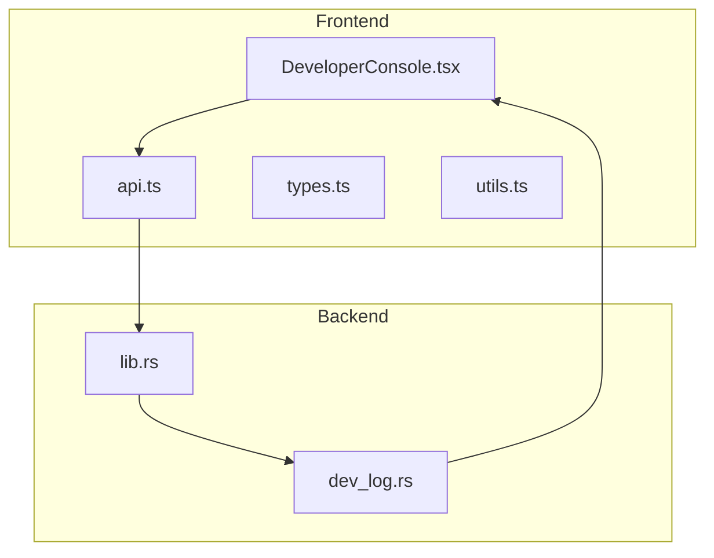
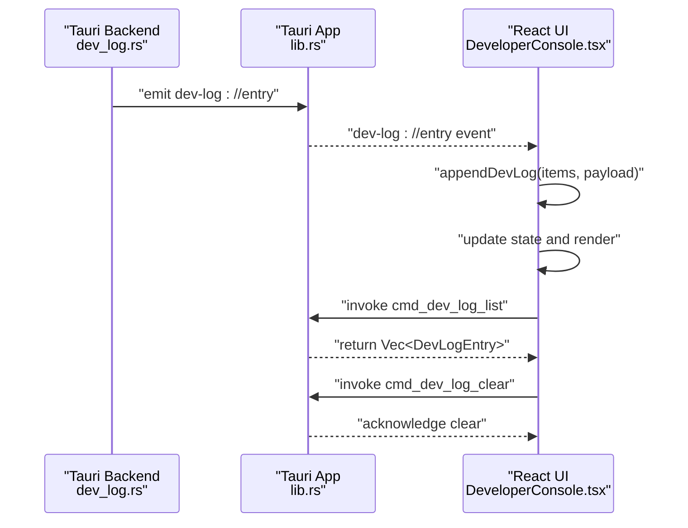
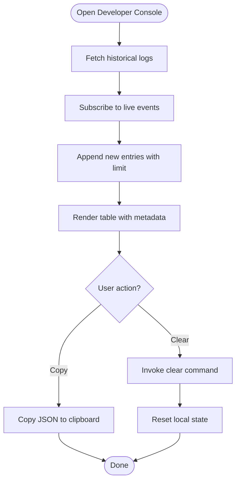
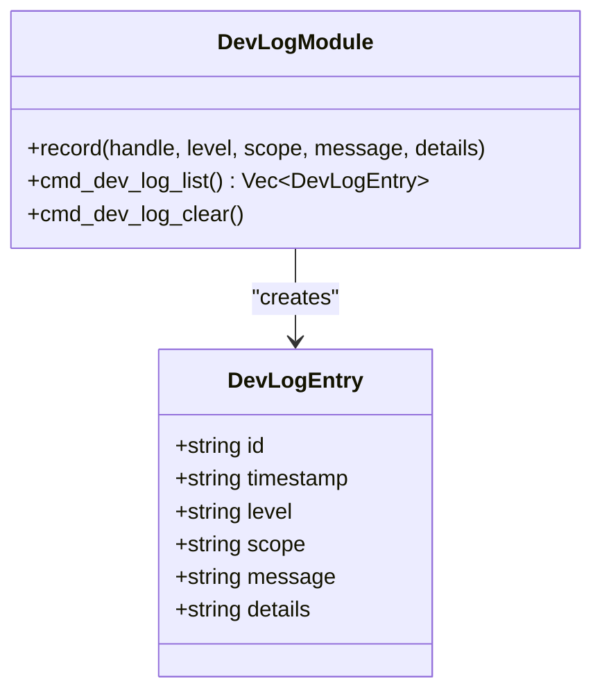
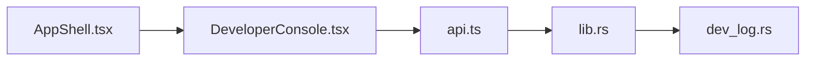

# Developer Console

<cite>
**Referenced Files in This Document**
- [DeveloperConsole.tsx](file://src/app/developer-console/DeveloperConsole.tsx)
- [api.ts](file://src/app/developer-console/api.ts)
- [types.ts](file://src/app/developer-console/types.ts)
- [utils.ts](file://src/app/developer-console/utils.ts)
- [dev_log.rs](file://src-tauri/src/dev_log.rs)
- [lib.rs](file://src-tauri/src/lib.rs)
- [AppShell.tsx](file://src/app/layout/AppShell.tsx)
- [main.tsx](file://src/main.tsx)
- [App.tsx](file://src/App.tsx)
- [developer-console.test.ts](file://tests/app/developer-console.test.ts)
</cite>

## Table of Contents
1. [Introduction](#introduction)
2. [Project Structure](#project-structure)
3. [Core Components](#core-components)
4. [Architecture Overview](#architecture-overview)
5. [Detailed Component Analysis](#detailed-component-analysis)
6. [Dependency Analysis](#dependency-analysis)
7. [Performance Considerations](#performance-considerations)
8. [Troubleshooting Guide](#troubleshooting-guide)
9. [Security and Access Controls](#security-and-access-controls)
10. [Practical Debugging Workflows](#practical-debugging-workflows)
11. [Conclusion](#conclusion)

## Introduction
The Developer Console is a hidden diagnostics panel designed for developers and advanced users to inspect internal application logs, monitor system events, and troubleshoot runtime issues. It provides real-time visibility into the application’s operational state, including LAN Chat and other subsystems, and offers tools to copy, filter, and clear logs for analysis.

Key capabilities:
- Real-time log streaming via Tauri events
- On-demand log retrieval and clearing
- Keyboard shortcut activation (hidden by design)
- Log entry metadata: timestamp, level, scope, and optional details
- Copy logs as JSON for external analysis

## Project Structure
The Developer Console spans both the frontend React application and the Tauri backend:
- Frontend: React component with Ant Design UI, keyboard shortcuts, and event listeners
- Backend: Tauri commands and a global in-memory log buffer with event emission

**Diagram sources**
- [DeveloperConsole.tsx:1-132](file://src/app/developer-console/DeveloperConsole.tsx#L1-L132)
- [api.ts:1-12](file://src/app/developer-console/api.ts#L1-L12)
- [types.ts:1-9](file://src/app/developer-console/types.ts#L1-L9)
- [utils.ts:1-13](file://src/app/developer-console/utils.ts#L1-L13)
- [lib.rs:226-227](file://src-tauri/src/lib.rs#L226-L227)
- [dev_log.rs:55-68](file://src-tauri/src/dev_log.rs#L55-L68)

**Section sources**
- [DeveloperConsole.tsx:1-132](file://src/app/developer-console/DeveloperConsole.tsx#L1-L132)
- [api.ts:1-12](file://src/app/developer-console/api.ts#L1-L12)
- [types.ts:1-9](file://src/app/developer-console/types.ts#L1-L9)
- [utils.ts:1-13](file://src/app/developer-console/utils.ts#L1-L13)
- [lib.rs:226-227](file://src-tauri/src/lib.rs#L226-L227)
- [dev_log.rs:55-68](file://src-tauri/src/dev_log.rs#L55-L68)

## Core Components
- DeveloperConsole React component: Manages drawer UI, keyboard shortcut, live log updates, and actions (copy/clear)
- API bindings: Invokes Tauri commands to list and clear logs
- Types: Defines the log entry shape
- Utilities: Appends new entries with a bounded buffer and maps log levels to colors
- Backend logging module: Records entries, maintains a ring buffer, emits events, and exposes commands

**Section sources**
- [DeveloperConsole.tsx:10-131](file://src/app/developer-console/DeveloperConsole.tsx#L10-L131)
- [api.ts:5-11](file://src/app/developer-console/api.ts#L5-L11)
- [types.ts:1-9](file://src/app/developer-console/types.ts#L1-L9)
- [utils.ts:3-12](file://src/app/developer-console/utils.ts#L3-L12)
- [dev_log.rs:29-53](file://src-tauri/src/dev_log.rs#L29-L53)

## Architecture Overview
The Developer Console architecture follows a publish-subscribe pattern:
- Backend records log entries and emits a named event
- Frontend listens for the event and appends entries to the UI
- Users can trigger manual refresh to load historical entries
- Commands expose list and clear operations backed by a bounded in-memory buffer

**Diagram sources**
- [dev_log.rs:52](file://src-tauri/src/dev_log.rs#L52)
- [lib.rs:226](file://src-tauri/src/lib.rs#L226)
- [DeveloperConsole.tsx:37-44](file://src/app/developer-console/DeveloperConsole.tsx#L37-L44)
- [api.ts:5-11](file://src/app/developer-console/api.ts#L5-L11)

## Detailed Component Analysis

### Frontend: DeveloperConsole
Responsibilities:
- Toggle drawer via keyboard shortcut
- Subscribe to live log events
- Fetch historical logs on open
- Provide actions to copy and clear logs
- Render structured log entries with timestamps, levels, scopes, and messages

**Diagram sources**
- [DeveloperConsole.tsx:15-51](file://src/app/developer-console/DeveloperConsole.tsx#L15-L51)
- [DeveloperConsole.tsx:37-44](file://src/app/developer-console/DeveloperConsole.tsx#L37-L44)
- [utils.ts:3](file://src/app/developer-console/utils.ts#L3)

**Section sources**
- [DeveloperConsole.tsx:10-131](file://src/app/developer-console/DeveloperConsole.tsx#L10-L131)
- [utils.ts:3-12](file://src/app/developer-console/utils.ts#L3-L12)

### Backend: dev_log.rs
Responsibilities:
- Define log entry structure with identifiers, timestamps, level, scope, message, and optional details
- Maintain a thread-safe ring buffer capped at a fixed size
- Emit live events upon recording
- Expose commands to list and clear logs

**Diagram sources**
- [dev_log.rs:12-21](file://src-tauri/src/dev_log.rs#L12-L21)
- [dev_log.rs:29-68](file://src-tauri/src/dev_log.rs#L29-L68)

**Section sources**
- [dev_log.rs:12-21](file://src-tauri/src/dev_log.rs#L12-L21)
- [dev_log.rs:29-68](file://src-tauri/src/dev_log.rs#L29-L68)

### API Bindings and Types
- API functions wrap Tauri invocations for listing and clearing logs
- Types define the shape of log entries consumed by the UI
- Utilities enforce a bounded buffer and map severity levels to colors

**Section sources**
- [api.ts:5-11](file://src/app/developer-console/api.ts#L5-L11)
- [types.ts:1-9](file://src/app/developer-console/types.ts#L1-L9)
- [utils.ts:3-12](file://src/app/developer-console/utils.ts#L3-L12)

## Dependency Analysis
The Developer Console integrates with the application shell and relies on Tauri’s event system and command invocation.

**Diagram sources**
- [AppShell.tsx:172](file://src/app/layout/AppShell.tsx#L172)
- [DeveloperConsole.tsx:6](file://src/app/developer-console/DeveloperConsole.tsx#L6)
- [api.ts:1](file://src/app/developer-console/api.ts#L1)
- [lib.rs:226](file://src-tauri/src/lib.rs#L226)
- [dev_log.rs:55](file://src-tauri/src/dev_log.rs#L55)

**Section sources**
- [AppShell.tsx:172](file://src/app/layout/AppShell.tsx#L172)
- [lib.rs:226](file://src-tauri/src/lib.rs#L226)

## Performance Considerations
- Bounded buffer: The backend maintains a fixed-capacity ring buffer to prevent memory growth; older entries are evicted as new ones arrive.
- Event-driven updates: Live logs are appended incrementally, minimizing rendering overhead.
- Command efficiency: Listing logs returns a shallow clone of the buffer; clearing is O(1) after lock acquisition.
- UI pagination: The table renders a limited number of rows per page to keep the DOM manageable.

[No sources needed since this section provides general guidance]

## Troubleshooting Guide
Common scenarios and resolutions:
- Logs not appearing
  - Ensure the Developer Console drawer is opened; historical logs are fetched on open.
  - Verify the live event listener is active; the component subscribes on mount.
- Slow UI during heavy logging
  - Reduce log volume or filter by scope in downstream tools.
  - Use the “Clear” action to reset the buffer.
- Copying logs for analysis
  - Use the “Copy JSON” action to export the current log state for external inspection.

Verification and testing:
- Unit tests confirm the bounded append behavior and level-to-color mapping.

**Section sources**
- [developer-console.test.ts:14-25](file://tests/app/developer-console.test.ts#L14-L25)
- [utils.ts:3-12](file://src/app/developer-console/utils.ts#L3-L12)

## Security and Access Controls
- Hidden activation: The console is toggled via a keyboard shortcut, reducing accidental exposure.
- No authentication: Access is implicit to the local user; treat as a trusted development tool.
- Data handling: Logs are stored in-memory and cleared via a command; sensitive information should be redacted before sharing.
- Scope awareness: Use the “scope” field to isolate subsystems when investigating issues.

[No sources needed since this section provides general guidance]

## Practical Debugging Workflows
- LAN Chat diagnostics
  - Open the Developer Console and reproduce the issue (e.g., port binding, discovery, or TCP delivery problems).
  - Observe real-time entries under the relevant scope and copy logs for analysis.
- API debugging integration
  - While the Developer Console focuses on internal logs, the API Debugger plugin complements it by capturing request/response details and history.
- Environment isolation
  - Filter logs by scope to narrow down subsystems (e.g., LAN Chat, Redis, SSH).
- Postmortem analysis
  - After reproducing an issue, copy logs as JSON and share them with team members or support channels.

[No sources needed since this section provides general guidance]

## Conclusion
The Developer Console provides a lightweight, real-time window into the application’s internal state. Its event-driven architecture, bounded buffer, and simple UI enable efficient debugging and diagnostics during development and troubleshooting. Combine it with other tools (e.g., the API Debugger) and adhere to security best practices for safe and effective development workflows.

[No sources needed since this section summarizes without analyzing specific files]