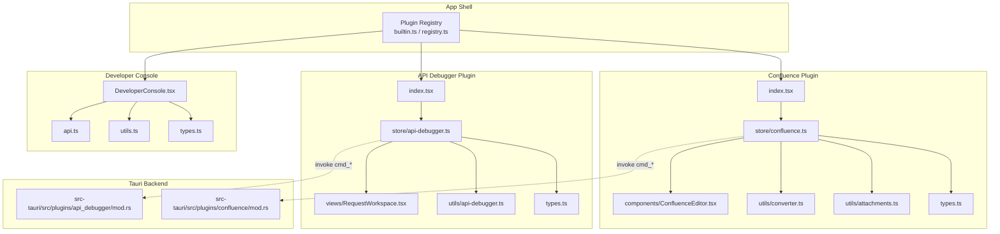
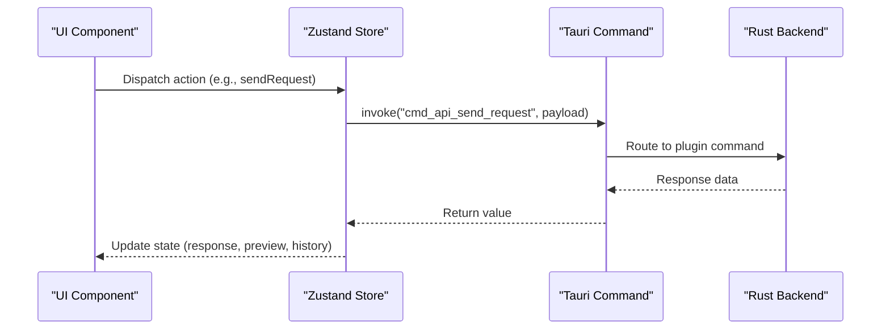
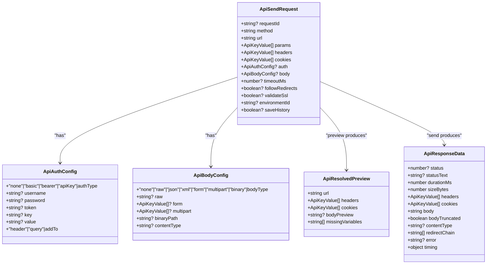
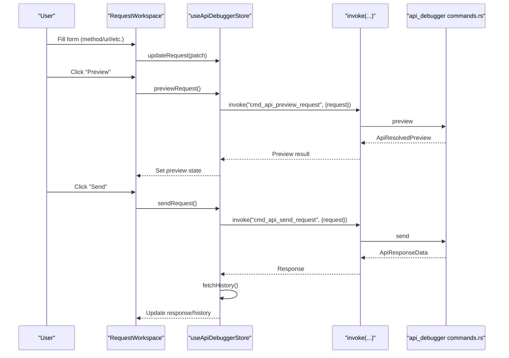
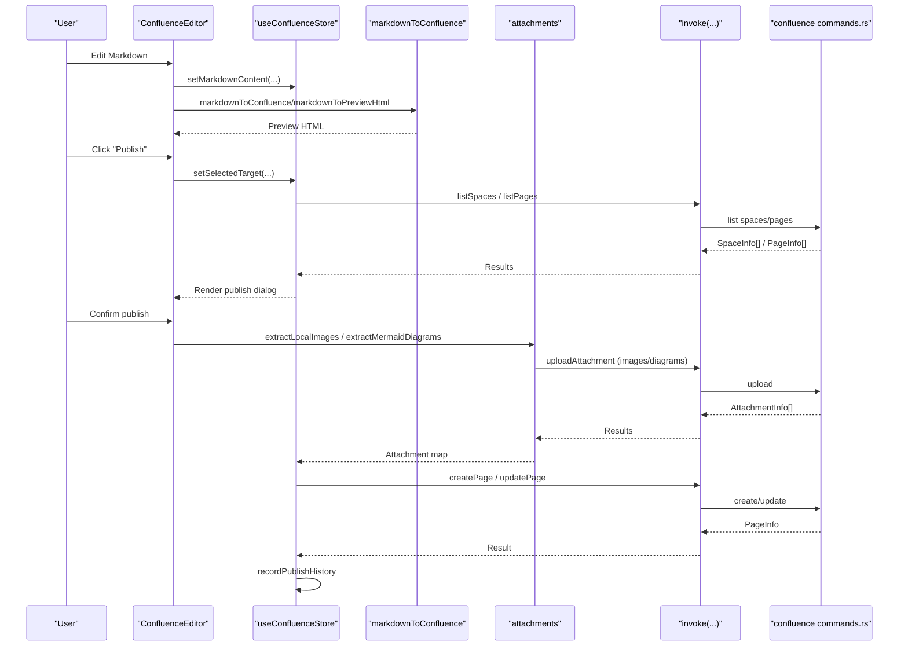
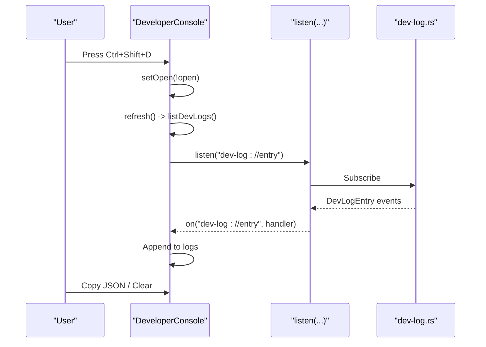
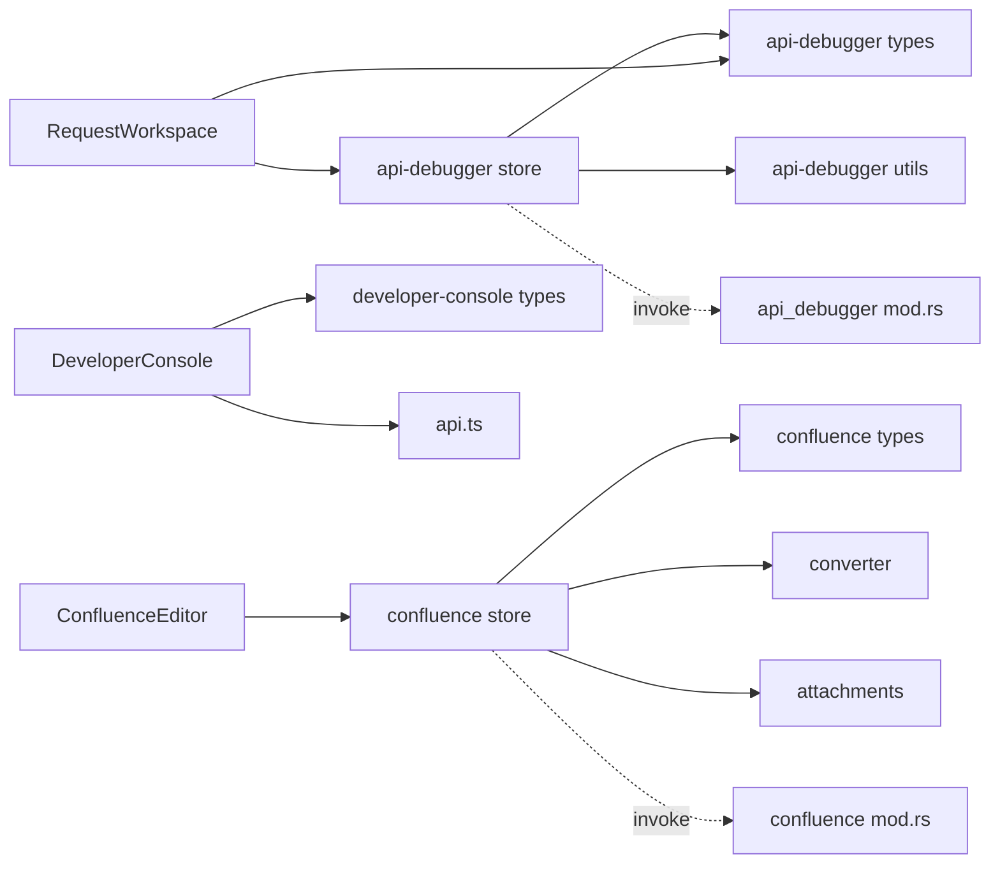

# Development Utilities

<cite>
**Referenced Files in This Document**
- [index.tsx](file://src/plugins/api-debugger/index.tsx)
- [api-debugger.ts](file://src/plugins/api-debugger/store/api-debugger.ts)
- [RequestWorkspace.tsx](file://src/plugins/api-debugger/views/RequestWorkspace.tsx)
- [api-debugger.ts](file://src/plugins/api-debugger/utils/api-debugger.ts)
- [types.ts](file://src/plugins/api-debugger/types.ts)
- [index.tsx](file://src/plugins/confluence/index.tsx)
- [confluence.ts](file://src/plugins/confluence/store/confluence.ts)
- [ConfluenceEditor.tsx](file://src/plugins/confluence/components/ConfluenceEditor.tsx)
- [converter.ts](file://src/plugins/confluence/utils/converter.ts)
- [attachments.ts](file://src/plugins/confluence/utils/attachments.ts)
- [types.ts](file://src/plugins/confluence/types.ts)
- [DeveloperConsole.tsx](file://src/app/developer-console/DeveloperConsole.tsx)
- [api.ts](file://src/app/developer-console/api.ts)
- [utils.ts](file://src/app/developer-console/utils.ts)
- [types.ts](file://src/app/developer-console/types.ts)
- [mod.rs](file://src-tauri/src/plugins/api_debugger/mod.rs)
- [mod.rs](file://src-tauri/src/plugins/confluence/mod.rs)
</cite>

## Table of Contents
1. [Introduction](#introduction)
2. [Project Structure](#project-structure)
3. [Core Components](#core-components)
4. [Architecture Overview](#architecture-overview)
5. [Detailed Component Analysis](#detailed-component-analysis)
6. [Dependency Analysis](#dependency-analysis)
7. [Performance Considerations](#performance-considerations)
8. [Troubleshooting Guide](#troubleshooting-guide)
9. [Conclusion](#conclusion)

## Introduction
This document explains RDMM’s development utility plugins designed to improve productivity and collaboration during development. It covers three key utilities:
- API Debugger: A comprehensive HTTP request testing and debugging tool with collection management, environment configuration, and history.
- Confluence Editor: A collaborative documentation editor with real-time preview, publishing workflow, and attachment management.
- Developer Console: A hidden diagnostics panel for system monitoring and debugging.

It documents request/response handling, collection/environment management, and environment configuration for the API Debugger; markdown editing, real-time preview, publishing workflow, and attachment management for the Confluence Editor; and practical workflows and best practices for each utility.

## Project Structure
The development utilities are implemented as plugins integrated into the main application via a plugin registry. Each plugin encapsulates its own UI, state management, and data types, and communicates with the Rust backend through Tauri commands.

**Diagram sources**
- [index.tsx:1-39](file://src/plugins/api-debugger/index.tsx#L1-L39)
- [api-debugger.ts:1-129](file://src/plugins/api-debugger/store/api-debugger.ts#L1-L129)
- [RequestWorkspace.tsx:1-223](file://src/plugins/api-debugger/views/RequestWorkspace.tsx#L1-L223)
- [api-debugger.ts:1-62](file://src/plugins/api-debugger/utils/api-debugger.ts#L1-L62)
- [types.ts:1-105](file://src/plugins/api-debugger/types.ts#L1-L105)
- [index.tsx:1-18](file://src/plugins/confluence/index.tsx#L1-L18)
- [confluence.ts:1-146](file://src/plugins/confluence/store/confluence.ts#L1-L146)
- [ConfluenceEditor.tsx:1-205](file://src/plugins/confluence/components/ConfluenceEditor.tsx#L1-L205)
- [converter.ts:1-226](file://src/plugins/confluence/utils/converter.ts#L1-L226)
- [attachments.ts:1-147](file://src/plugins/confluence/utils/attachments.ts#L1-L147)
- [types.ts:1-86](file://src/plugins/confluence/types.ts#L1-L86)
- [DeveloperConsole.tsx:1-132](file://src/app/developer-console/DeveloperConsole.tsx#L1-L132)
- [api.ts:1-12](file://src/app/developer-console/api.ts#L1-L12)
- [utils.ts:1-13](file://src/app/developer-console/utils.ts#L1-L13)
- [types.ts:1-9](file://src/app/developer-console/types.ts#L1-L9)
- [mod.rs:1-3](file://src-tauri/src/plugins/api_debugger/mod.rs#L1-L3)
- [mod.rs:1-4](file://src-tauri/src/plugins/confluence/mod.rs#L1-L4)

**Section sources**
- [index.tsx:1-39](file://src/plugins/api-debugger/index.tsx#L1-L39)
- [index.tsx:1-18](file://src/plugins/confluence/index.tsx#L1-L18)
- [DeveloperConsole.tsx:1-132](file://src/app/developer-console/DeveloperConsole.tsx#L1-L132)

## Core Components
- API Debugger
  - Provides a workspace for building and sending HTTP requests, previewing resolved variables, viewing responses, and managing collections/environments/history.
  - Uses a Zustand store to manage state and invokes Tauri commands for persistence and execution.
- Confluence Editor
  - Offers a split-pane editor with live preview, connection management, page tree navigation, publish history, and attachment handling.
  - Converts Markdown to Confluence Storage Format and supports Mermaid rendering in preview.
- Developer Console
  - A hidden drawer that streams and displays developer logs, supports copying and clearing logs, and listens for real-time events.

**Section sources**
- [api-debugger.ts:1-129](file://src/plugins/api-debugger/store/api-debugger.ts#L1-L129)
- [RequestWorkspace.tsx:1-223](file://src/plugins/api-debugger/views/RequestWorkspace.tsx#L1-L223)
- [confluence.ts:1-146](file://src/plugins/confluence/store/confluence.ts#L1-L146)
- [ConfluenceEditor.tsx:1-205](file://src/plugins/confluence/components/ConfluenceEditor.tsx#L1-L205)
- [DeveloperConsole.tsx:1-132](file://src/app/developer-console/DeveloperConsole.tsx#L1-L132)

## Architecture Overview
The utilities follow a consistent pattern:
- Frontend UI components in React
- State management via Zustand stores
- Data typing via TypeScript interfaces
- Backend orchestration via Tauri commands invoked from the frontend

**Diagram sources**
- [api-debugger.ts:62-72](file://src/plugins/api-debugger/store/api-debugger.ts#L62-L72)
- [mod.rs:1-3](file://src-tauri/src/plugins/api_debugger/mod.rs#L1-L3)

## Detailed Component Analysis

### API Debugger
The API Debugger enables iterative HTTP request design, execution, and inspection. It supports:
- Request composition: method, URL, query params, headers, cookies, auth, body (raw, JSON, XML, form, multipart, binary), timeouts, redirects, SSL validation.
- Environment-driven variable resolution and preview.
- Collection and folder organization for saved requests.
- History tracking and replay.

**Diagram sources**
- [types.ts:27-64](file://src/plugins/api-debugger/types.ts#L27-L64)

**Diagram sources**
- [RequestWorkspace.tsx:104-108](file://src/plugins/api-debugger/views/RequestWorkspace.tsx#L104-L108)
- [api-debugger.ts:62-72](file://src/plugins/api-debugger/store/api-debugger.ts#L62-L72)
- [api-debugger.ts:73-76](file://src/plugins/api-debugger/store/api-debugger.ts#L73-L76)
- [mod.rs:1-3](file://src-tauri/src/plugins/api_debugger/mod.rs#L1-L3)

Key behaviors and capabilities:
- Request/response handling
  - Sending requests updates response state and history.
  - Preview resolves variables and reports missing ones.
- Collection management
  - Save, open, delete requests; organize under collections and nested folders.
  - Export collections to JSON with optional redaction.
- Environment configuration
  - Switch active environment to resolve variables in URLs, headers, cookies, and body.
  - Create/update/delete environments; persist variables.

Practical workflows:
- Testing a new endpoint
  - Choose environment, compose request, click Preview to validate variables, Send to execute, inspect Response tabs (Body, Headers, Cookies, Raw, Timing).
- Managing a shared API spec
  - Create a Collection, add Folders, save multiple Requests, export JSON for team sharing.

Best practices:
- Use environments to separate dev/staging/prod endpoints and tokens.
- Keep request names descriptive and group related requests in folders.
- Use Preview to catch missing template variables before sending.

**Section sources**
- [RequestWorkspace.tsx:1-223](file://src/plugins/api-debugger/views/RequestWorkspace.tsx#L1-L223)
- [api-debugger.ts:1-129](file://src/plugins/api-debugger/store/api-debugger.ts#L1-L129)
- [api-debugger.ts:1-62](file://src/plugins/api-debugger/utils/api-debugger.ts#L1-L62)
- [types.ts:1-105](file://src/plugins/api-debugger/types.ts#L1-L105)

### Confluence Editor
The Confluence Editor provides a real-time collaborative authoring experience:
- Split-pane editor with Monaco for Markdown and live HTML preview.
- Connection management and page tree browsing.
- Publishing workflow with history tracking and attachment handling.
- Support for Mermaid diagrams and embedded draw.io attachments.

**Diagram sources**
- [ConfluenceEditor.tsx:15-195](file://src/plugins/confluence/components/ConfluenceEditor.tsx#L15-L195)
- [confluence.ts:105-119](file://src/plugins/confluence/store/confluence.ts#L105-L119)
- [converter.ts:185-214](file://src/plugins/confluence/utils/converter.ts#L185-L214)
- [attachments.ts:74-126](file://src/plugins/confluence/utils/attachments.ts#L74-L126)
- [mod.rs:1-4](file://src-tauri/src/plugins/confluence/mod.rs#L1-L4)

Capabilities:
- Real-time preview
  - Converts Markdown to Confluence Storage Format and renders preview with Mermaid support.
- Publishing workflow
  - Connect to Confluence, choose space/page, publish or update, track publish history.
- Attachment management
  - Detects local images and Mermaid diagrams, uploads them, and replaces references in the final XML.

Practical workflows:
- Collaborative documentation
  - Open a draft, connect to Confluence, browse pages, publish to a child page, and iterate with updates.
- Diagrams and assets
  - Embed Mermaid blocks; images are uploaded automatically; draw.io attachments are generated for diagrams.

Best practices:
- Keep file mappings for repeat publishing to the same page.
- Use page hierarchy to organize documentation; publish under parent pages when appropriate.
- Prefer relative image paths for portability.

**Section sources**
- [ConfluenceEditor.tsx:1-205](file://src/plugins/confluence/components/ConfluenceEditor.tsx#L1-L205)
- [confluence.ts:1-146](file://src/plugins/confluence/store/confluence.ts#L1-L146)
- [converter.ts:1-226](file://src/plugins/confluence/utils/converter.ts#L1-L226)
- [attachments.ts:1-147](file://src/plugins/confluence/utils/attachments.ts#L1-L147)
- [types.ts:1-86](file://src/plugins/confluence/types.ts#L1-L86)

### Developer Console
The Developer Console is a hidden diagnostics panel for system monitoring and debugging:
- Keyboard shortcut toggles the drawer.
- Streams developer log entries emitted by the backend.
- Provides actions to copy logs as JSON and clear logs.

**Diagram sources**
- [DeveloperConsole.tsx:10-63](file://src/app/developer-console/DeveloperConsole.tsx#L10-L63)
- [api.ts:5-11](file://src/app/developer-console/api.ts#L5-L11)
- [utils.ts:3-5](file://src/app/developer-console/utils.ts#L3-L5)

Operational notes:
- Logs are appended with a capped length to prevent memory growth.
- Levels are color-coded for quick scanning.

**Section sources**
- [DeveloperConsole.tsx:1-132](file://src/app/developer-console/DeveloperConsole.tsx#L1-L132)
- [api.ts:1-12](file://src/app/developer-console/api.ts#L1-L12)
- [utils.ts:1-13](file://src/app/developer-console/utils.ts#L1-L13)
- [types.ts:1-9](file://src/app/developer-console/types.ts#L1-L9)

## Dependency Analysis
- Internal dependencies
  - Each plugin’s store depends on its own types and utils.
  - UI components depend on Ant Design and Monaco Editor for rich editing.
- External dependencies
  - Tauri for cross-platform APIs and command invocation.
  - Unified/Remark for Markdown conversion and Mermaid rendering.
  - @tauri-apps plugins for filesystem and dialog operations.
- Backend integration
  - Plugins expose commands via Tauri modules; stores invoke commands by name to perform CRUD operations and runtime tasks.

**Diagram sources**
- [api-debugger.ts:1-129](file://src/plugins/api-debugger/store/api-debugger.ts#L1-L129)
- [types.ts:1-105](file://src/plugins/api-debugger/types.ts#L1-L105)
- [api-debugger.ts:1-62](file://src/plugins/api-debugger/utils/api-debugger.ts#L1-L62)
- [RequestWorkspace.tsx:1-223](file://src/plugins/api-debugger/views/RequestWorkspace.tsx#L1-L223)
- [confluence.ts:1-146](file://src/plugins/confluence/store/confluence.ts#L1-L146)
- [types.ts:1-86](file://src/plugins/confluence/types.ts#L1-L86)
- [converter.ts:1-226](file://src/plugins/confluence/utils/converter.ts#L1-L226)
- [attachments.ts:1-147](file://src/plugins/confluence/utils/attachments.ts#L1-L147)
- [ConfluenceEditor.tsx:1-205](file://src/plugins/confluence/components/ConfluenceEditor.tsx#L1-L205)
- [DeveloperConsole.tsx:1-132](file://src/app/developer-console/DeveloperConsole.tsx#L1-L132)
- [api.ts:1-12](file://src/app/developer-console/api.ts#L1-L12)
- [mod.rs:1-3](file://src-tauri/src/plugins/api_debugger/mod.rs#L1-L3)
- [mod.rs:1-4](file://src-tauri/src/plugins/confluence/mod.rs#L1-L4)

**Section sources**
- [api-debugger.ts:1-129](file://src/plugins/api-debugger/store/api-debugger.ts#L1-L129)
- [confluence.ts:1-146](file://src/plugins/confluence/store/confluence.ts#L1-L146)
- [DeveloperConsole.tsx:1-132](file://src/app/developer-console/DeveloperConsole.tsx#L1-L132)

## Performance Considerations
- API Debugger
  - Large responses can increase rendering time; prefer filtering headers and limiting body size when possible.
  - Preview resolves variables synchronously; keep templates concise to avoid delays.
- Confluence Editor
  - Mermaid rendering occurs on demand; avoid excessive diagrams per page to maintain responsiveness.
  - Uploading many attachments serially can be slow; leverage batch operations where feasible.
- Developer Console
  - Log streaming is additive; use Clear to reset state and reduce memory pressure.

## Troubleshooting Guide
- API Debugger
  - Missing variables in Preview: review environment variables and template placeholders; ensure active environment is selected.
  - SSL errors: toggle Validate SSL in Settings; check certificate trust on the target host.
  - History not updating: ensure Save History is enabled; re-run the request after enabling.
- Confluence Editor
  - Preview not rendering diagrams: verify Mermaid fenced code blocks; ensure Mermaid is available in the preview DOM.
  - Attachment upload failures: check file paths and permissions; confirm Confluence credentials and space/page access.
  - Publish history not recorded: ensure a successful create/update; verify connection and target selection.
- Developer Console
  - No logs visible: press the keyboard shortcut to open the drawer; ensure logging is enabled in the backend.
  - Copy/ Clear actions fail: verify permissions for clipboard and filesystem operations.

**Section sources**
- [RequestWorkspace.tsx:25-45](file://src/plugins/api-debugger/views/RequestWorkspace.tsx#L25-L45)
- [confluence.ts:120-132](file://src/plugins/confluence/store/confluence.ts#L120-L132)
- [DeveloperConsole.tsx:15-63](file://src/app/developer-console/DeveloperConsole.tsx#L15-L63)

## Conclusion
RDMM’s development utilities streamline HTTP testing, collaborative documentation, and system diagnostics. By leveraging environment-driven configuration, structured collection management, and robust publishing workflows, teams can accelerate development cycles and maintain high-quality documentation. Adopt the recommended workflows and best practices to maximize productivity and reliability across projects.