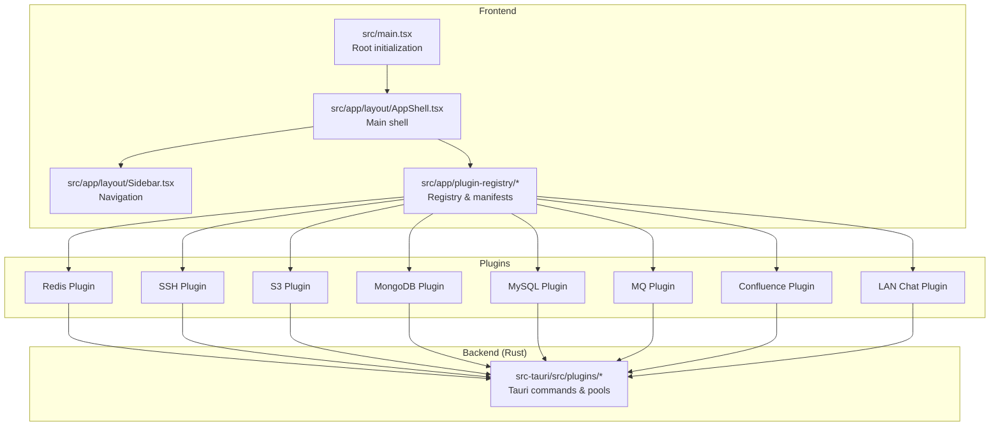
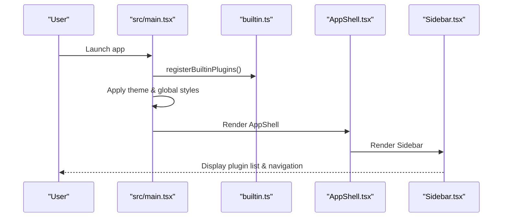
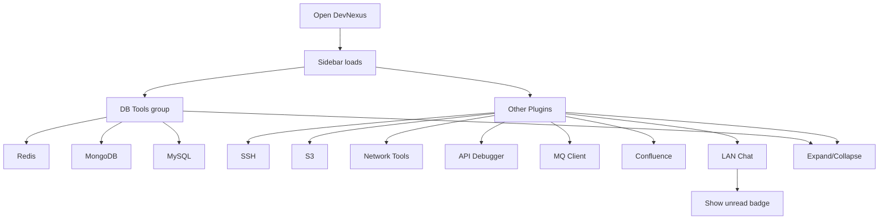
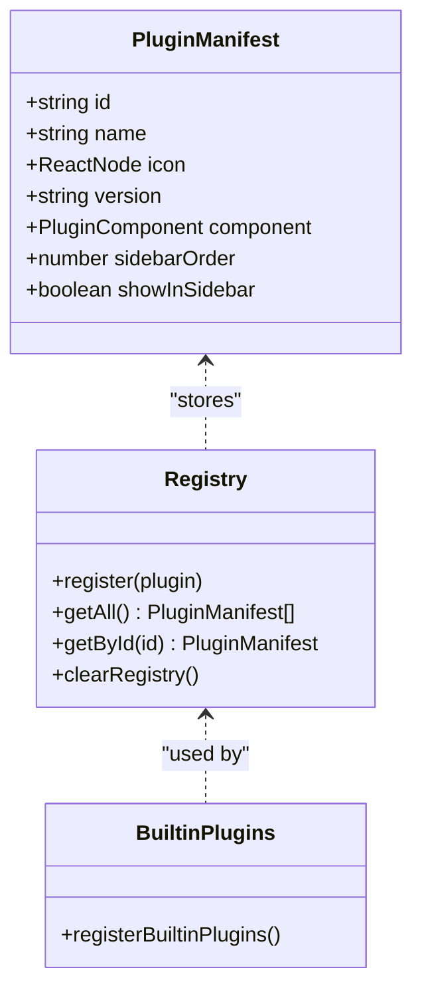
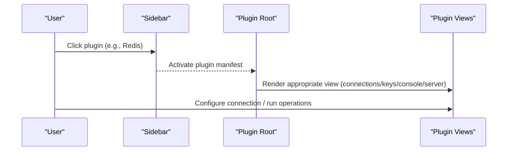
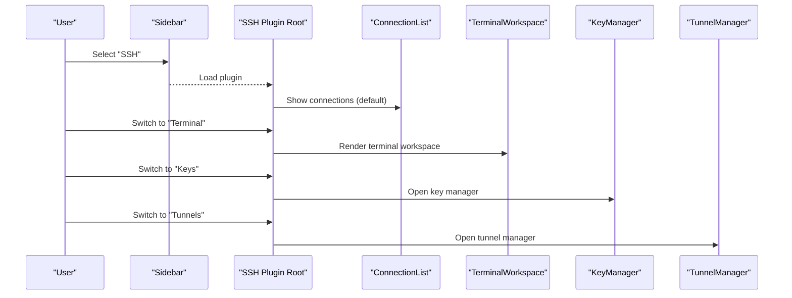

# Getting Started

<cite>
**Referenced Files in This Document**
- [README.md](file://README.md)
- [package.json](file://package.json)
- [vite.config.ts](file://vite.config.ts)
- [src-tauri/tauri.conf.json](file://src-tauri/tauri.conf.json)
- [src-tauri/Cargo.toml](file://src-tauri/Cargo.toml)
- [src/main.tsx](file://src/main.tsx)
- [src/app/plugin-registry/builtin.ts](file://src/app/plugin-registry/builtin.ts)
- [src/app/plugin-registry/registry.ts](file://src/app/plugin-registry/registry.ts)
- [src/app/plugin-registry/types.ts](file://src/app/plugin-registry/types.ts)
- [src/app/layout/AppShell.tsx](file://src/app/layout/AppShell.tsx)
- [src/app/layout/Sidebar.tsx](file://src/app/layout/Sidebar.tsx)
- [src/plugins/redis-manager/index.tsx](file://src/plugins/redis-manager/index.tsx)
- [src/plugins/ssh-client/index.tsx](file://src/plugins/ssh-client/index.tsx)
- [src/plugins/mysql-client/index.tsx](file://src/plugins/mysql-client/index.tsx)
- [src/plugins/s3-client/index.tsx](file://src/plugins/s3-client/index.tsx)
</cite>

## Table of Contents
1. [Introduction](#introduction)
2. [Project Structure](#project-structure)
3. [System Requirements](#system-requirements)
4. [Installation](#installation)
5. [First-Time Setup](#first-time-setup)
6. [Running the Development Environment](#running-the-development-environment)
7. [Building the Application](#building-the-application)
8. [Launching the Desktop App](#launching-the-desktop-app)
9. [Basic Navigation](#basic-navigation)
10. [Plugin Activation and Workflows](#plugin-activation-and-workflows)
11. [Connecting Your First Database](#connecting-your-first-database)
12. [Configuring SSH Connections](#configuring-ssh-connections)
13. [Using Core Features](#using-core-features)
14. [Troubleshooting Guide](#troubleshooting-guide)
15. [Conclusion](#conclusion)

## Introduction
DevNexus is a pluginized desktop toolbox built with Tauri 2, React 19, TypeScript, and Rust. It consolidates common connectivity tools into a single lightweight desktop application, covering Redis, SSH, S3, MongoDB, MySQL, Network diagnostics, API debugging, MQ debugging, and Confluence publishing. The project emphasizes local-first storage, cross-platform packaging, and practical operations for developers and operators.

## Project Structure
DevNexus follows a clear separation of concerns:
- Frontend: React 19 with TypeScript, Vite, Ant Design, Zustand for state, and xterm.js for terminals
- Backend: Rust with Tauri 2 plugins for each domain (Redis, SSH, S3, MongoDB, MySQL, MQ, Confluence, LAN Chat)
- Plugin Registry: Centralized registration and routing of plugins
- Tauri Configuration: Desktop window, bundling, and build hooks

**Diagram sources**
- [src/main.tsx:1-38](file://src/main.tsx#L1-L38)
- [src/app/layout/AppShell.tsx:1-207](file://src/app/layout/AppShell.tsx#L1-L207)
- [src/app/layout/Sidebar.tsx:1-177](file://src/app/layout/Sidebar.tsx#L1-L177)
- [src/app/plugin-registry/builtin.ts:1-31](file://src/app/plugin-registry/builtin.ts#L1-L31)
- [src/app/plugin-registry/registry.ts:1-26](file://src/app/plugin-registry/registry.ts#L1-L26)
- [src/app/plugin-registry/types.ts:1-14](file://src/app/plugin-registry/types.ts#L1-L14)

**Section sources**
- [README.md:54-95](file://README.md#L54-L95)
- [src/main.tsx:1-38](file://src/main.tsx#L1-L38)
- [src/app/layout/AppShell.tsx:1-207](file://src/app/layout/AppShell.tsx#L1-L207)
- [src/app/layout/Sidebar.tsx:1-177](file://src/app/layout/Sidebar.tsx#L1-L177)
- [src/app/plugin-registry/builtin.ts:1-31](file://src/app/plugin-registry/builtin.ts#L1-L31)
- [src/app/plugin-registry/registry.ts:1-26](file://src/app/plugin-registry/registry.ts#L1-L26)
- [src/app/plugin-registry/types.ts:1-14](file://src/app/plugin-registry/types.ts#L1-L14)

## System Requirements
- Node.js 20+ for frontend toolchain
- Rust stable for backend compilation
- Platform-specific Tauri prerequisites:
  - Windows: meet Tauri Windows prerequisites
  - macOS/Linux: meet Tauri macOS/Linux prerequisites

Reference: [README.md:97-108](file://README.md#L97-L108)

**Section sources**
- [README.md:97-108](file://README.md#L97-L108)

## Installation
Install dependencies for both frontend and backend:
- Install Node.js dependencies
- Install Rust toolchain and Tauri prerequisites

Reference: [README.md:109-120](file://README.md#L109-L120)

**Section sources**
- [README.md:109-120](file://README.md#L109-L120)

## First-Time Setup
On first launch, the app initializes:
- Registers built-in plugins
- Applies theme and global styles
- Sets up the main shell and sidebar

Key startup flow:
- Root bootstraps theme and registers plugins
- AppShell renders layout, sidebar, and plugin router
- Sidebar groups plugins and exposes navigation

**Diagram sources**
- [src/main.tsx:1-38](file://src/main.tsx#L1-L38)
- [src/app/plugin-registry/builtin.ts:14-29](file://src/app/plugin-registry/builtin.ts#L14-L29)
- [src/app/layout/AppShell.tsx:31-207](file://src/app/layout/AppShell.tsx#L31-L207)
- [src/app/layout/Sidebar.tsx:21-177](file://src/app/layout/Sidebar.tsx#L21-L177)

**Section sources**
- [src/main.tsx:1-38](file://src/main.tsx#L1-L38)
- [src/app/plugin-registry/builtin.ts:14-29](file://src/app/plugin-registry/builtin.ts#L14-L29)
- [src/app/layout/AppShell.tsx:31-207](file://src/app/layout/AppShell.tsx#L31-L207)
- [src/app/layout/Sidebar.tsx:21-177](file://src/app/layout/Sidebar.tsx#L21-L177)

## Running the Development Environment
There are two primary ways to run the development environment:
- Run the frontend-only dev server
- Run the full Tauri desktop dev mode

Ports and HMR:
- Frontend runs on a fixed port during Tauri dev/build
- Vite HMR can be configured for remote hosts

References:
- [README.md:109-120](file://README.md#L109-L120)
- [vite.config.ts:25-40](file://vite.config.ts#L25-L40)
- [src-tauri/tauri.conf.json:6-11](file://src-tauri/tauri.conf.json#L6-L11)

**Section sources**
- [README.md:109-120](file://README.md#L109-L120)
- [vite.config.ts:25-40](file://vite.config.ts#L25-L40)
- [src-tauri/tauri.conf.json:6-11](file://src-tauri/tauri.conf.json#L6-L11)

## Building the Application
Build targets:
- Frontend production build
- Rust backend compilation check
- Tauri bundle for current platform

References:
- [README.md:122-134](file://README.md#L122-L134)
- [package.json:6-13](file://package.json#L6-L13)
- [src-tauri/Cargo.toml:1-49](file://src-tauri/Cargo.toml#L1-L49)

**Section sources**
- [README.md:122-134](file://README.md#L122-L134)
- [package.json:6-13](file://package.json#L6-L13)
- [src-tauri/Cargo.toml:1-49](file://src-tauri/Cargo.toml#L1-L49)

## Launching the Desktop App
Desktop configuration:
- Window sizing and minimum dimensions
- Pre-dev and pre-build hooks
- Bundling icons and targets

References:
- [src-tauri/tauri.conf.json:1-39](file://src-tauri/tauri.conf.json#L1-L39)

**Section sources**
- [src-tauri/tauri.conf.json:1-39](file://src-tauri/tauri.conf.json#L1-L39)

## Basic Navigation
The sidebar organizes plugins into logical groups:
- Database Tools group (Redis, MongoDB, MySQL)
- Other tools (SSH, S3, Network, API Debugger, MQ, Confluence, LAN Chat)
- Theme toggle and LAN Chat quick access

**Diagram sources**
- [src/app/layout/Sidebar.tsx:21-177](file://src/app/layout/Sidebar.tsx#L21-L177)
- [src/app/plugin-registry/registry.ts:13-17](file://src/app/plugin-registry/registry.ts#L13-L17)

**Section sources**
- [src/app/layout/Sidebar.tsx:21-177](file://src/app/layout/Sidebar.tsx#L21-L177)
- [src/app/plugin-registry/registry.ts:13-17](file://src/app/plugin-registry/registry.ts#L13-L17)

## Plugin Activation and Workflows
Plugins are registered centrally and rendered by the plugin router. Each plugin defines:
- Manifest with id, name, icon, version, sidebar order, and component
- Internal tabs and views (e.g., connections, workspaces, consoles)

**Diagram sources**
- [src/app/plugin-registry/types.ts:5-13](file://src/app/plugin-registry/types.ts#L5-L13)
- [src/app/plugin-registry/registry.ts:1-26](file://src/app/plugin-registry/registry.ts#L1-L26)
- [src/app/plugin-registry/builtin.ts:14-29](file://src/app/plugin-registry/builtin.ts#L14-L29)

**Section sources**
- [src/app/plugin-registry/types.ts:1-14](file://src/app/plugin-registry/types.ts#L1-L14)
- [src/app/plugin-registry/registry.ts:1-26](file://src/app/plugin-registry/registry.ts#L1-L26)
- [src/app/plugin-registry/builtin.ts:1-31](file://src/app/plugin-registry/builtin.ts#L1-L31)

## Connecting Your First Database
Choose a database plugin from the sidebar and follow the plugin’s internal workflow:
- Redis: Manage connections, browse keys, use console, view server info
- MongoDB: Manage connections, browse databases/collections, edit documents, run queries
- MySQL: Manage connections, browse databases/tables, run SQL, manage indexes and import/export

**Diagram sources**
- [src/app/layout/Sidebar.tsx:21-177](file://src/app/layout/Sidebar.tsx#L21-L177)
- [src/plugins/redis-manager/index.tsx:14-57](file://src/plugins/redis-manager/index.tsx#L14-L57)
- [src/plugins/mongodb-client/index.tsx:14-35](file://src/plugins/mongodb-client/index.tsx#L14-L35)
- [src/plugins/mysql-client/index.tsx:14-35](file://src/plugins/mysql-client/index.tsx#L14-L35)

**Section sources**
- [src/app/layout/Sidebar.tsx:21-177](file://src/app/layout/Sidebar.tsx#L21-L177)
- [src/plugins/redis-manager/index.tsx:14-57](file://src/plugins/redis-manager/index.tsx#L14-L57)
- [src/plugins/mongodb-client/index.tsx:14-35](file://src/plugins/mongodb-client/index.tsx#L14-L35)
- [src/plugins/mysql-client/index.tsx:14-35](file://src/plugins/mysql-client/index.tsx#L14-L35)

## Configuring SSH Connections
SSH plugin workflow:
- Manage connections, open terminals, manage keys, and configure tunnels
- Use segmented controls to switch between connections, terminal, keys, and tunnels

**Diagram sources**
- [src/plugins/ssh-client/index.tsx:12-56](file://src/plugins/ssh-client/index.tsx#L12-L56)
- [src/app/layout/Sidebar.tsx:21-177](file://src/app/layout/Sidebar.tsx#L21-L177)

**Section sources**
- [src/plugins/ssh-client/index.tsx:12-56](file://src/plugins/ssh-client/index.tsx#L12-L56)
- [src/app/layout/Sidebar.tsx:21-177](file://src/app/layout/Sidebar.tsx#L21-L177)

## Using Core Features
Common features across plugins:
- Connection management: create, edit, delete, and activate connections
- Workspace tabs: navigate between connections, browsing, editing, and utilities
- Status bar: shows runtime context, active tool, and LAN Chat indicators
- Theme switching: light/dark modes

References:
- [src/app/layout/AppShell.tsx:45-56](file://src/app/layout/AppShell.tsx#L45-L56)
- [src/app/layout/Sidebar.tsx:150-173](file://src/app/layout/Sidebar.tsx#L150-L173)

**Section sources**
- [src/app/layout/AppShell.tsx:45-56](file://src/app/layout/AppShell.tsx#L45-L56)
- [src/app/layout/Sidebar.tsx:150-173](file://src/app/layout/Sidebar.tsx#L150-L173)

## Troubleshooting Guide
Common issues and resolutions:
- Port conflicts during development: ensure the fixed port is free or adjust Vite server configuration
- Tauri dev URL mismatch: confirm devUrl matches the frontend server address
- Rust compilation errors: run backend checks and ensure Rust stable toolchain is installed
- Platform prerequisites: verify Tauri prerequisites for Windows/macOS/Linux

References:
- [vite.config.ts:25-40](file://vite.config.ts#L25-L40)
- [src-tauri/tauri.conf.json:6-11](file://src-tauri/tauri.conf.json#L6-L11)
- [README.md:131-134](file://README.md#L131-L134)
- [README.md:97-108](file://README.md#L97-L108)

**Section sources**
- [vite.config.ts:25-40](file://vite.config.ts#L25-L40)
- [src-tauri/tauri.conf.json:6-11](file://src-tauri/tauri.conf.json#L6-L11)
- [README.md:131-134](file://README.md#L131-L134)
- [README.md:97-108](file://README.md#L97-L108)

## Conclusion
You are now ready to onboard with DevNexus. Start by installing prerequisites, then run the development environment or build the desktop app. Explore the sidebar to activate plugins, connect your first database or SSH host, and leverage core features like connection management, workspaces, and theme switching. Use the troubleshooting guide for common setup issues.